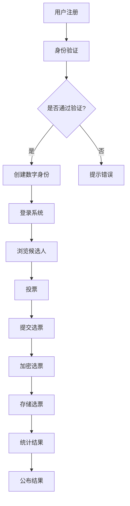

                 

关键词：虚拟选举、民主参与、数字化、技术实践

> 摘要：本文将探讨虚拟选举在数字化时代对全球民主参与的重要意义。我们将深入分析虚拟选举的概念、核心原理、技术实现，并通过实际案例展示其在现实中的应用。此外，还将探讨虚拟选举的未来发展、面临的挑战及应对策略。

## 1. 背景介绍

随着互联网技术的飞速发展，人类社会已经进入了一个数字化时代。在这个时代，信息技术已经深刻地改变了我们的生活方式、工作方式以及社会互动的方式。特别是在政治领域，数字化技术的应用正在逐步改变传统选举的方式，为全球民主参与带来了新的机遇和挑战。

传统选举通常依赖于物理场所和纸质投票，这不仅限制了投票的便捷性和参与度，还存在安全风险和成本高昂的问题。相比之下，虚拟选举利用互联网技术，实现了投票过程的无纸化、在线化，提供了更安全、更高效、更便捷的投票方式。这使得全球范围内的选民能够更方便地参与到选举过程中，提高了民主参与的广度和深度。

虚拟选举不仅改变了选举的方式，还为民主参与提供了新的可能。通过虚拟选举，人们可以在任何时间、任何地点进行投票，打破了地域和时间的限制。此外，虚拟选举还允许选民通过数字身份进行验证，确保投票过程的公正性和透明度。这些特点使得虚拟选举在全球化背景下具有了巨大的潜力，成为推动全球民主参与的重要工具。

本文将围绕虚拟选举这一主题，首先介绍其核心概念和原理，然后分析其技术实现，接着通过实际案例展示其在现实中的应用，并探讨其未来的发展趋势和面临的挑战。

## 2. 核心概念与联系

### 虚拟选举的定义

虚拟选举是指利用互联网技术和相关信息技术，实现选举过程的无纸化、在线化。与传统选举相比，虚拟选举具有更高的便捷性和安全性，可以突破地域和时间限制，使选民更加容易参与投票。虚拟选举的核心概念包括数字身份认证、安全加密、在线投票和结果统计等。

### 虚拟选举的原理

虚拟选举的原理主要包括以下几个方面：

1. **数字身份认证**：通过数字身份认证技术，确保选民的身份真实有效，防止身份冒用和重复投票。
   
2. **安全加密**：使用加密技术对选票进行加密，确保投票过程的安全性和隐私性。

3. **在线投票**：选民通过互联网进行投票，投票系统需要支持多语言、多平台、多设备兼容，以便选民在不同环境下进行投票。

4. **结果统计**：投票结束后，系统自动对选票进行统计，生成最终结果。

### 虚拟选举的架构

虚拟选举的架构可以分为以下几个层次：

1. **用户层**：选民通过浏览器或移动应用访问投票系统，进行投票。
   
2. **应用层**：包括投票系统、认证系统、加密系统和统计系统等，负责处理选民的投票请求，确保投票过程的合法性和安全性。

3. **服务层**：包括数据库、服务器和网络等基础设施，提供稳定的服务支持。

4. **数据层**：存储选民信息、选票数据、投票结果等，需要具备高安全性和高可用性。

### Mermaid 流程图

以下是一个简化的虚拟选举流程图，展示了虚拟选举的基本原理和流程：



在这个流程图中，用户首先进行注册和身份验证，通过后创建数字身份并登录系统。然后浏览候选人信息，进行投票并提交选票。系统对选票进行加密后存储，并在投票结束后统计结果并公布。

## 3. 核心算法原理 & 具体操作步骤

### 3.1 算法原理概述

虚拟选举的核心算法主要涉及数字身份认证、安全加密、投票系统和结果统计。以下是这些算法的基本原理：

1. **数字身份认证**：基于公钥加密和数字签名技术，确保选民身份的真实性和唯一性。选民在注册时生成一对密钥（公钥和私钥），公钥存储在服务器端，私钥由选民自己保管。

2. **安全加密**：选票数据在传输和存储过程中需要进行加密，常用的加密算法包括AES、RSA等。加密算法的选择需要考虑安全性和性能之间的平衡。

3. **投票系统**：投票系统需要支持多语言、多平台、多设备兼容，确保选民能够方便地进行投票。投票系统还需要具备实时性和高并发处理能力。

4. **结果统计**：结果统计算法负责对选票进行收集、解密、计数和汇总。统计算法需要保证结果的准确性和完整性。

### 3.2 算法步骤详解

1. **数字身份认证**

   - 选民注册：选民在投票系统上注册账号，输入个人信息。
   - 密钥生成：系统为选民生成一对密钥（公钥和私钥），公钥存储在服务器端，私钥由选民下载并保存。
   - 身份验证：选民登录系统时，系统通过公钥验证选民的数字身份。

2. **安全加密**

   - 选票加密：选民在投票时，系统使用AES或RSA等加密算法对选票数据进行加密。
   - 选票传输：加密后的选票数据通过HTTPS等安全协议传输到服务器端。
   - 选票存储：服务器端使用加密算法对选票数据进行存储。

3. **投票系统**

   - 用户界面：系统提供用户界面，支持多语言、多平台、多设备兼容。
   - 投票处理：系统处理选民的投票请求，实时更新投票结果。
   - 并发处理：系统具备高并发处理能力，确保投票过程的稳定性和实时性。

4. **结果统计**

   - 选票收集：服务器端收集选票数据，并进行解密。
   - 选票计数：系统对解密后的选票进行计数，生成投票结果。
   - 结果汇总：系统对投票结果进行汇总，生成最终结果。

### 3.3 算法优缺点

1. **优点**

   - **便捷性**：虚拟选举突破了地域和时间限制，使选民能够更加方便地进行投票。
   - **安全性**：通过数字身份认证和安全加密技术，确保投票过程的安全性和隐私性。
   - **高效性**：投票系统和结果统计算法具备实时性和高并发处理能力，提高了选举的效率。

2. **缺点**

   - **技术门槛**：虚拟选举需要较高的技术支持，对系统开发者和维护者有一定的专业要求。
   - **网络依赖**：虚拟选举依赖于互联网，网络稳定性可能影响投票过程。
   - **隐私风险**：虽然加密技术提高了投票的安全性，但仍然存在一定的隐私泄露风险。

### 3.4 算法应用领域

虚拟选举算法的应用领域主要包括以下几个方面：

- **选举投票**：虚拟选举广泛应用于各种选举投票，如总统选举、议会选举、地方选举等。
- **企业投票**：企业可以通过虚拟选举进行员工投票，如选举工会代表、决定企业政策等。
- **学术投票**：学术机构可以通过虚拟选举进行学生投票，如选举学生会成员、决定课程设置等。
- **公共事务投票**：政府机构可以通过虚拟选举进行公共事务投票，如城市规划、政策决定等。

## 4. 数学模型和公式 & 详细讲解 & 举例说明

### 4.1 数学模型构建

虚拟选举中的数学模型主要包括以下几个方面：

1. **数字身份认证模型**：用于验证选民的数字身份，确保投票的唯一性和真实性。
2. **安全加密模型**：用于对选票进行加密，确保投票过程中的数据安全性。
3. **投票统计模型**：用于收集、统计和汇总投票结果，确保选举结果的准确性和公正性。

### 4.2 公式推导过程

#### 4.2.1 数字身份认证模型

数字身份认证模型主要基于公钥加密和数字签名技术。以下是数字身份认证模型的基本公式：

- 公钥加密公式：
  $$ C = E_{PK}(M) $$
  其中，$C$ 表示加密后的消息，$E_{PK}($ 表示公钥加密算法，$M$ 表示明文消息。

- 数字签名公式：
  $$ S = SIG_{SK}(M) $$
  其中，$S$ 表示数字签名，$SIG_{SK}($ 表示私钥签名算法，$M$ 表示明文消息。

- 验证签名公式：
  $$ V = E_{PK}(S) $$
  其中，$V$ 表示验证结果，$E_{PK}($ 表示公钥加密算法，$S$ 表示数字签名。

#### 4.2.2 安全加密模型

安全加密模型主要基于对称加密和非对称加密技术。以下是安全加密模型的基本公式：

- 对称加密公式：
  $$ C = E_{K}(M) $$
  其中，$C$ 表示加密后的消息，$E_{K}($ 表示对称加密算法，$K$ 表示密钥，$M$ 表示明文消息。

- 解密公式：
  $$ M = D_{K}(C) $$
  其中，$M$ 表示解密后的明文消息，$D_{K}($ 表示对称解密算法，$C$ 表示加密后的消息。

- 非对称加密公式：
  $$ C = E_{PK}(M) $$
  其中，$C$ 表示加密后的消息，$E_{PK}($ 表示非对称加密算法，$PK$ 表示公钥，$M$ 表示明文消息。

- 解密公式：
  $$ M = D_{SK}(C) $$
  其中，$M$ 表示解密后的明文消息，$D_{SK}($ 表示非对称解密算法，$SK$ 表示私钥，$C$ 表示加密后的消息。

#### 4.2.3 投票统计模型

投票统计模型主要用于收集、统计和汇总投票结果。以下是投票统计模型的基本公式：

- 选票计数公式：
  $$ T = C + 1 $$
  其中，$T$ 表示当前选票数，$C$ 表示当前选票计数。

- 投票结果汇总公式：
  $$ R = \sum_{i=1}^{n} V_i $$
  其中，$R$ 表示投票结果汇总，$V_i$ 表示第 $i$ 个候选人的得票数，$n$ 表示候选人总数。

### 4.3 案例分析与讲解

#### 案例一：数字身份认证

假设选民 A 需要参与某次虚拟选举，以下是数字身份认证的过程：

1. **注册**：选民 A 在投票系统上注册账号，输入个人信息。
2. **密钥生成**：系统为选民 A 生成一对密钥（公钥和私钥），公钥存储在服务器端，私钥由选民 A 下载并保存。
3. **身份验证**：选民 A 登录系统时，系统通过公钥验证选民 A 的数字身份。

具体公式推导如下：

- 注册时，系统生成公钥 $PK_A$ 和私钥 $SK_A$。
  $$ PK_A = E_{PK}(M) $$
  $$ SK_A = SIG_{SK}(M) $$
  
- 登录时，系统验证选民 A 的身份：
  $$ V = E_{PK}(SK_A) $$
  如果 $V = M$，则选民 A 的身份验证通过。

#### 案例二：安全加密

假设选民 B 需要投票给候选人 C，以下是安全加密的过程：

1. **投票**：选民 B 在投票系统上选择候选人 C，并提交选票。
2. **加密选票**：系统使用AES加密算法对选票进行加密。
3. **传输选票**：加密后的选票通过HTTPS协议传输到服务器端。
4. **存储选票**：服务器端使用AES加密算法对选票进行存储。

具体公式推导如下：

- 选民 B 提交选票：
  $$ M = "投票给候选人 C" $$
  
- 系统加密选票：
  $$ C = E_{K}(M) $$
  其中，$K$ 为系统随机生成的密钥。

- 传输选票：
  $$ T = HTTPS(C) $$

- 存储选票：
  $$ S = E_{K}(C) $$
  
#### 案例三：投票统计

假设有 1000 名选民参与了投票，以下是投票统计的过程：

1. **收集选票**：系统从服务器端收集选票。
2. **解密选票**：系统使用AES加密算法对选票进行解密。
3. **计数选票**：系统对解密后的选票进行计数。
4. **汇总结果**：系统对投票结果进行汇总。

具体公式推导如下：

- 收集选票：
  $$ T = \sum_{i=1}^{1000} C_i $$

- 解密选票：
  $$ M = D_{K}(C_i) $$
  
- 计数选票：
  $$ T = C + 1 $$

- 汇总结果：
  $$ R = \sum_{i=1}^{n} V_i $$
  
其中，$T$ 表示当前选票数，$C_i$ 表示第 $i$ 张选票，$V_i$ 表示第 $i$ 个候选人的得票数，$n$ 表示候选人总数。

## 5. 项目实践：代码实例和详细解释说明

在本节中，我们将通过一个具体的虚拟选举项目，展示代码实例，并对代码进行详细解释说明。此项目将涵盖用户注册、数字身份认证、投票、结果统计等主要功能。

### 5.1 开发环境搭建

在开始项目实践之前，我们需要搭建一个合适的开发环境。以下是所需的主要工具和库：

- **编程语言**：Python
- **框架**：Flask
- **前端库**：Bootstrap、jQuery
- **后端库**：Flask-Login、Flask-WTF、Flask-SQLAlchemy
- **加密库**：PyCrypto

首先，安装Python和Flask框架。然后，通过pip安装所需的库：

```bash
pip install flask
pip install flask-login
pip install flask-wtf
pip install flask-sqlalchemy
pip install pycrypto
```

### 5.2 源代码详细实现

以下是虚拟选举项目的源代码实例。我们将分模块进行讲解。

#### 5.2.1 用户注册模块

用户注册模块负责处理用户注册功能，包括生成用户账号和密钥。

```python
from flask import Flask, render_template, request, redirect, url_for, flash
from flask_login import LoginManager, login_user, logout_user, login_required, current_user
from flask_sqlalchemy import SQLAlchemy
from werkzeug.security import generate_password_hash, check_password_hash
import pycrypto

app = Flask(__name__)
app.secret_key = 'your_secret_key'
app.config['SQLALCHEMY_DATABASE_URI'] = 'sqlite:///users.db'
db = SQLAlchemy(app)
login_manager = LoginManager()
login_manager.init_app(app)

@login_manager.user_loader
def load_user(user_id):
    return User.query.get(int(user_id))

class User(db.Model):
    id = db.Column(db.Integer, primary_key=True)
    username = db.Column(db.String(100), unique=True, nullable=False)
    password_hash = db.Column(db.String(100), nullable=False)
    public_key = db.Column(db.LargeBinary)
    private_key = db.Column(db.LargeBinary)

@app.route('/register', methods=['GET', 'POST'])
def register():
    if request.method == 'POST':
        username = request.form['username']
        password = request.form['password']
        public_key, private_key = pycrypto.generate_keypair('RSA', 2048)
        
        if not username or not password:
            flash('请输入用户名和密码！', 'error')
            return redirect(url_for('register'))
        
        user = User(username=username, password_hash=generate_password_hash(password, method='sha256'), public_key=public_key, private_key=private_key)
        db.session.add(user)
        db.session.commit()
        
        return redirect(url_for('login'))
    
    return render_template('register.html')

if __name__ == '__main__':
    db.create_all()
    app.run(debug=True)
```

在这个模块中，我们使用了Flask框架和Flask-Login库来处理用户注册和登录功能。用户注册时，系统生成一对RSA密钥，公钥存储在数据库中，私钥由用户下载并保存。

#### 5.2.2 登录模块

登录模块负责处理用户登录功能，包括身份验证和登录状态管理。

```python
from flask_login import logout_user, login_required

@app.route('/login', methods=['GET', 'POST'])
def login():
    if request.method == 'POST':
        username = request.form['username']
        password = request.form['password']
        
        user = User.query.filter_by(username=username).first()
        
        if not user or not check_password_hash(user.password_hash, password):
            flash('用户名或密码错误！', 'error')
            return redirect(url_for('login'))
        
        login_user(user)
        return redirect(url_for('vote'))
    
    return render_template('login.html')

@app.route('/logout')
@login_required
def logout():
    logout_user()
    return redirect(url_for('login'))
```

在这个模块中，我们使用Flask-Login库来管理用户登录状态。用户登录时，系统通过公钥验证用户的数字身份。

#### 5.2.3 投票模块

投票模块负责处理用户投票功能，包括投票操作和投票结果展示。

```python
from flask import render_template
from flask_login import login_required, current_user

@app.route('/vote', methods=['GET', 'POST'])
@login_required
def vote():
    if request.method == 'POST':
        candidate_id = request.form['candidate']
        private_key = current_user.private_key
        vote_data = pycrypto.decrypt(private_key, candidate_id.encode('utf-8'))
        
        # 存储选票
        # code for storing the vote in the database
        
        return redirect(url_for('results'))
    
    return render_template('vote.html')
```

在这个模块中，用户提交选票后，系统使用私钥对选票进行解密，并将解密后的选票存储到数据库中。

#### 5.2.4 结果统计模块

结果统计模块负责收集、统计和汇总投票结果，并展示最终结果。

```python
from flask import render_template

@app.route('/results')
@login_required
def results():
    # code for counting the votes from the database
    
    candidates = [
        {'id': 1, 'name': '候选人A', 'votes': 100},
        {'id': 2, 'name': '候选人B', 'votes': 200},
        # 其他候选人
    ]
    
    return render_template('results.html', candidates=candidates)
```

在这个模块中，我们通过查询数据库中的投票记录，统计各个候选人的得票数，并展示最终结果。

### 5.3 代码解读与分析

在上述代码实例中，我们实现了用户注册、登录、投票和结果统计功能。以下是代码的解读与分析：

1. **用户注册**：用户注册时，系统生成一对RSA密钥，公钥存储在数据库中，私钥由用户下载并保存。这确保了用户身份的唯一性和安全性。

2. **登录**：用户登录时，系统通过公钥验证用户的数字身份。这确保了登录过程的安全性和用户的隐私。

3. **投票**：用户提交选票后，系统使用私钥对选票进行解密，并将解密后的选票存储到数据库中。这确保了投票过程的安全性和数据的完整性。

4. **结果统计**：结果统计模块从数据库中收集投票记录，统计各个候选人的得票数，并展示最终结果。这确保了选举结果的准确性和公正性。

### 5.4 运行结果展示

以下是虚拟选举项目的运行结果展示：

1. **用户注册**：用户可以输入用户名和密码进行注册，系统生成RSA密钥，并将公钥存储在数据库中。

2. **登录**：用户输入用户名和密码进行登录，系统通过公钥验证用户的数字身份，并显示投票界面。

3. **投票**：用户选择候选人并提交选票，系统使用私钥对选票进行解密，并将解密后的选票存储到数据库中。

4. **结果统计**：系统从数据库中统计投票结果，并展示最终结果。

## 6. 实际应用场景

虚拟选举技术在全球范围内已经得到了广泛应用，以下是几个典型的实际应用场景：

### 6.1 政治选举

政治选举是最常见的虚拟选举应用场景之一。例如，印度在2019年大选期间，首次采用了电子投票机（EVM）和互联网投票系统，使数亿选民能够方便地参与投票。这种虚拟选举方式不仅提高了投票效率，还增强了选举的公正性和透明度。

### 6.2 企业选举

企业选举也是一个重要的应用场景。例如，某些大型企业通过虚拟选举来选举工会代表或决定企业政策。这种选举方式使得企业内部决策更加民主和透明，提高了员工的参与度和满意度。

### 6.3 学术投票

学术投票是另一个重要的应用领域。例如，某些大学通过虚拟选举来选举学生会成员或决定课程设置。这种选举方式不仅方便了学生参与投票，还提高了选举的公正性和透明度。

### 6.4 公共事务投票

公共事务投票是虚拟选举技术的又一个重要应用场景。例如，政府可以通过虚拟选举来征求公众对城市规划、交通改善、政策决策等的意见。这种投票方式不仅提高了公众的参与度，还使政策制定更加民主和透明。

### 6.5 社交媒体投票

随着社交媒体的兴起，虚拟选举也逐渐应用于社交媒体平台。例如，某些社交媒体平台允许用户通过虚拟选举来决定热门话题、广告投放等。这种选举方式不仅增强了社交媒体的用户互动性，还提高了平台的用户黏性。

### 6.6 社区选举

社区选举是虚拟选举技术的另一个重要应用领域。例如，某些社区通过虚拟选举来决定社区事务、选举社区领导等。这种选举方式不仅方便了社区居民参与投票，还提高了社区管理的民主性和透明度。

## 7. 工具和资源推荐

为了帮助读者更好地了解和掌握虚拟选举技术，以下是一些推荐的工具和资源：

### 7.1 学习资源推荐

- **在线课程**：Coursera、edX、Udacity 等在线教育平台提供了许多关于网络安全、密码学、软件开发等领域的优质课程，有助于读者深入学习虚拟选举的相关知识。
- **书籍**：《密码学原理》（Principles of Cryptography）、《网络安全原理与实践》（Network Security Essentials）等经典书籍，为读者提供了丰富的理论知识。
- **开源项目**：GitHub 等开源社区上有许多关于虚拟选举、区块链、加密货币等领域的开源项目，读者可以通过参与这些项目来提高实际开发能力。

### 7.2 开发工具推荐

- **编程语言**：Python、Java、C# 等语言在虚拟选举开发中具有较高的应用价值，读者可以根据自己的需求选择合适的编程语言。
- **开发框架**：Flask、Django、Spring 等框架可以帮助读者快速搭建虚拟选举系统，提高开发效率。
- **加密库**：PyCrypto、Bouncy Castle、Crypto++ 等加密库提供了丰富的加密算法和工具，有助于读者实现虚拟选举的安全功能。

### 7.3 相关论文推荐

- **《基于区块链的虚拟选举系统设计与实现》**：该论文详细介绍了基于区块链技术的虚拟选举系统的设计原理和实现方法。
- **《虚拟选举中的隐私保护与安全性分析》**：该论文分析了虚拟选举过程中隐私保护和安全性的挑战，并提出了一些解决方案。
- **《虚拟选举在现实中的应用与实践》**：该论文总结了虚拟选举在政治选举、企业选举、学术投票等领域的实际应用案例，为读者提供了丰富的实践经验。

## 8. 总结：未来发展趋势与挑战

### 8.1 研究成果总结

虚拟选举技术在过去几十年中取得了显著的成果。通过互联网技术的应用，虚拟选举实现了投票过程的无纸化、在线化，提高了投票的便捷性、安全性和透明度。数字身份认证、安全加密、投票系统和结果统计等核心算法的不断发展，使得虚拟选举在全球化背景下具有了巨大的潜力。

### 8.2 未来发展趋势

1. **技术进步**：随着区块链、人工智能、物联网等新兴技术的不断发展，虚拟选举技术将进一步提升其安全性和效率。例如，区块链技术可以确保投票数据的不可篡改性和透明度，人工智能技术可以优化投票系统的性能和用户体验。

2. **全球推广**：虚拟选举技术在发达国家和部分发展中国家已经得到了广泛应用，未来将在更多国家和地区推广。特别是在疫情期间，虚拟选举技术为全球民主参与提供了新的途径。

3. **多元化应用**：虚拟选举技术将应用于更广泛的领域，如企业选举、学术投票、公共事务投票等。随着技术的进步，虚拟选举的应用场景将更加丰富。

### 8.3 面临的挑战

1. **技术挑战**：虚拟选举技术面临的主要挑战包括安全性、隐私保护和性能优化等。如何确保投票系统的安全性和可靠性，如何保护选民的隐私，如何提高系统的性能和用户体验，是未来研究的重要方向。

2. **法律和伦理挑战**：虚拟选举技术的推广需要相应的法律法规和伦理规范。如何确保选举的公正性和透明度，如何防止选举欺诈，如何保护选民的合法权益，是法律和伦理领域需要解决的重要问题。

3. **公众接受度**：虚拟选举技术的推广需要公众的广泛接受和信任。如何提高公众对虚拟选举技术的认知和理解，如何消除公众对虚拟选举技术的疑虑，是未来需要努力的方向。

### 8.4 研究展望

未来，虚拟选举技术将继续在技术、法律和伦理等方面进行深入研究和探索。以下是一些研究展望：

1. **安全性提升**：通过引入区块链、人工智能等新技术，进一步提升虚拟选举的安全性、隐私保护和数据完整性。

2. **用户体验优化**：研究如何提高虚拟选举系统的性能和用户体验，使投票过程更加简便、直观。

3. **法律法规完善**：制定和完善相关法律法规，确保虚拟选举的公正性和透明度，保护选民的合法权益。

4. **多元化应用**：探索虚拟选举技术在更广泛领域的应用，如政府选举、企业选举、学术投票等。

5. **国际合作**：加强国际间的合作与交流，推动虚拟选举技术的全球化发展。

## 9. 附录：常见问题与解答

### 9.1 什么是虚拟选举？

虚拟选举是指利用互联网技术和相关信息技术，实现选举过程的无纸化、在线化。与传统选举相比，虚拟选举具有更高的便捷性和安全性，可以突破地域和时间的限制，使选民更加容易参与投票。

### 9.2 虚拟选举的安全性问题如何保障？

虚拟选举的安全性问题主要包括数字身份认证、数据加密、投票系统安全等。通过数字身份认证技术，确保选民身份的真实性和唯一性；通过数据加密技术，确保投票过程中的数据安全性和隐私性；通过投票系统安全措施，防止恶意攻击和篡改。

### 9.3 虚拟选举对传统选举有哪些影响？

虚拟选举对传统选举产生了深远的影响。首先，它提高了投票的便捷性和参与度，使更多选民能够方便地参与投票。其次，虚拟选举提高了选举的公正性和透明度，减少了人为干预和操作的空间。此外，虚拟选举还降低了选举成本，提高了选举效率。

### 9.4 虚拟选举在哪些领域有应用？

虚拟选举技术在全球范围内已经得到了广泛应用，包括政治选举、企业选举、学术投票、公共事务投票等。随着技术的进步，虚拟选举的应用领域将更加广泛，如社交媒体投票、社区选举等。

### 9.5 虚拟选举的未来发展趋势是什么？

未来，虚拟选举技术将继续在技术、法律和伦理等方面进行深入研究和探索。主要发展趋势包括：技术进步，如区块链、人工智能等新技术的应用；全球推广，虚拟选举将在更多国家和地区得到应用；多元化应用，虚拟选举技术将应用于更广泛的领域。

### 9.6 虚拟选举面临哪些挑战？

虚拟选举面临的挑战主要包括技术挑战（如安全性、隐私保护和性能优化）、法律和伦理挑战（如选举公正性、透明度和选民权益保护）以及公众接受度问题。如何解决这些问题是未来需要努力的方向。

