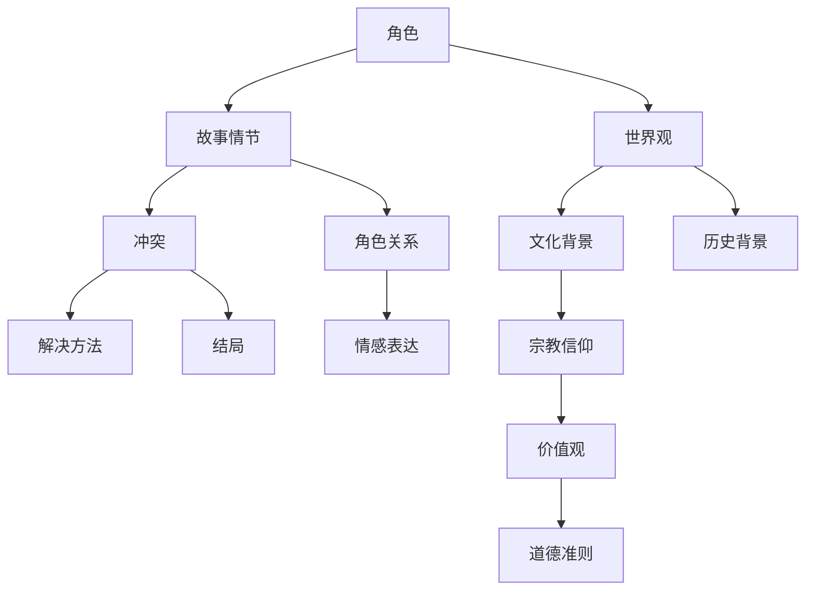

                 

关键词：AI，虚构世界构建，叙事创作，算法原理，数学模型，项目实践，未来应用

> 摘要：本文探讨了利用人工智能技术辅助构建虚构世界的叙事创作方法。通过分析虚构世界构建的核心概念和算法原理，本文提出了一种基于数学模型的宏大叙事创作框架，并结合实际项目实践，展示了如何通过代码实现这一框架，为未来的虚构世界创作提供了新的思路和工具。

## 1. 背景介绍

在当今数字化时代，虚构世界的构建越来越受到人们的关注。从文学、影视到游戏，虚构世界的创作已成为一种重要的文化形式。然而，传统的虚构世界构建往往依赖于创作者的个人经验和想象，缺乏系统化和标准化。随着人工智能技术的不断发展，AI在虚构世界构建中的应用潜力逐渐显现。本文旨在探讨如何利用AI技术辅助构建虚构世界，提高叙事创作的效率和效果。

## 2. 核心概念与联系

在虚构世界构建中，核心概念包括角色、故事情节、世界观等。这些概念之间存在紧密的联系，构成了虚构世界的基础。以下是一个使用Mermaid绘制的流程图，展示了这些概念之间的相互关系：



### 2.1 角色与故事情节

角色是虚构世界构建的核心，它们推动了故事情节的发展。角色可以分为主角、配角和反派等。故事情节则是角色的行为和遭遇，通过角色之间的互动和冲突，推动故事的发展。角色的动机和行为逻辑是故事情节的基础，而角色之间的关系则增加了故事的复杂性和深度。

### 2.2 世界观与文化背景

世界观是虚构世界的整体框架，包括地理环境、历史背景、社会结构等。文化背景则是世界观的一部分，反映了虚构世界的社会风俗、宗教信仰、价值观等。文化背景对角色的行为和故事情节有着深远的影响。

### 2.3 冲突与解决方法

冲突是虚构世界叙事的核心驱动力。角色之间的矛盾和斗争构成了冲突，而解决方法则揭示了角色的性格和价值观。冲突的解决方法可以是暴力、妥协或道德胜利等，每种方法都有其独特的叙事效果。

## 3. 核心算法原理 & 具体操作步骤

在虚构世界构建中，核心算法原理主要包括生成对抗网络（GAN）、强化学习和自然语言处理（NLP）等技术。以下将分别介绍这些算法的原理和具体操作步骤。

### 3.1 算法原理概述

**生成对抗网络（GAN）**：GAN由生成器和判别器组成。生成器尝试生成虚构世界的角色、场景等数据，而判别器则判断数据是否真实。通过不断训练，生成器逐渐提高生成数据的质量，从而辅助虚构世界的构建。

**强化学习**：强化学习是一种通过试错来学习策略的机器学习方法。在虚构世界构建中，强化学习可以用于训练角色的行为和决策，使其在复杂的虚构环境中具备自主行动能力。

**自然语言处理（NLP）**：NLP是一种用于处理和生成自然语言数据的技术。在虚构世界构建中，NLP可以用于生成角色的对话、描述虚构世界的场景等。

### 3.2 算法步骤详解

**生成对抗网络（GAN）**：

1. 初始化生成器和判别器。
2. 从真实数据中采样一个随机噪声向量。
3. 生成器使用噪声向量生成虚构世界的角色、场景等数据。
4. 判别器判断生成的数据是否真实。
5. 训练生成器和判别器，优化生成器的生成质量。

**强化学习**：

1. 定义环境、状态、动作和奖励。
2. 初始化角色状态。
3. 根据当前状态选择一个动作。
4. 执行动作，获得新的状态和奖励。
5. 更新角色策略，优化决策过程。

**自然语言处理（NLP）**：

1. 预处理输入文本，如分词、词性标注等。
2. 使用预训练的NLP模型生成角色对话或描述虚构世界场景。
3. 对生成的文本进行后处理，如语法修正、风格调整等。

### 3.3 算法优缺点

**生成对抗网络（GAN）**：

优点：能够生成高质量的虚构世界数据，具有创意性和多样性。
缺点：训练过程复杂，容易出现模式崩溃等问题。

**强化学习**：

优点：能够训练出具有自主行动能力的角色，提高虚构世界的互动性和可玩性。
缺点：训练过程较长，需要大量的数据和计算资源。

**自然语言处理（NLP）**：

优点：能够生成自然的语言描述，提高虚构世界的叙事性和可读性。
缺点：生成文本的质量受到预训练模型的影响，难以保证一致性。

### 3.4 算法应用领域

生成对抗网络（GAN）可以应用于虚构世界的角色生成、场景渲染等；强化学习可以应用于角色行为和决策的优化；自然语言处理（NLP）可以应用于虚构世界的文本生成和叙事创作。

## 4. 数学模型和公式 & 详细讲解 & 举例说明

在虚构世界构建中，数学模型和公式用于描述角色行为、故事情节和世界观等。以下将分别介绍数学模型和公式，并进行详细讲解和举例说明。

### 4.1 数学模型构建

虚构世界的数学模型可以分为三个层次：角色模型、故事模型和世界观模型。

**角色模型**：角色模型用于描述角色的属性和行为。一个简单的角色模型可以包括以下公式：

$$
\text{角色模型} = \{\text{姓名，年龄，性别，性格特征，价值观}\}
$$

**故事模型**：故事模型用于描述故事情节的发展和冲突。一个简单的故事模型可以包括以下公式：

$$
\text{故事模型} = \{\text{起始状态，中间状态，最终状态，冲突，解决方法}\}
$$

**世界观模型**：世界观模型用于描述虚构世界的整体框架。一个简单的世界观模型可以包括以下公式：

$$
\text{世界观模型} = \{\text{地理环境，历史背景，社会结构，文化背景}\}
$$

### 4.2 公式推导过程

以角色模型为例，角色模型的推导过程如下：

1. 角色属性：根据虚构世界的设定，确定角色的姓名、年龄、性别等基本属性。
2. 性格特征：根据角色的背景和故事情节，确定角色的性格特征，如勇敢、善良、狡猾等。
3. 价值观：根据角色的性格特征，确定角色的价值观，如正义、财富、爱情等。

### 4.3 案例分析与讲解

以下是一个虚构世界的角色模型和故事模型的案例：

**角色模型**：

$$
\text{角色模型} = \{\text{姓名：李雷，年龄：25，性别：男，性格特征：勇敢，价值观：正义}\}
$$

**故事模型**：

$$
\text{故事模型} = \{\text{起始状态：李雷生活在和平的小镇，中间状态：李雷遭遇邪恶势力，最终状态：李雷战胜邪恶势力，恢复小镇和平}\}
$$

在这个案例中，角色李雷的勇敢和正义价值观使他面临邪恶势力时能够勇敢地站出来，通过一系列冲突和挑战，最终战胜邪恶势力，恢复小镇的和平。

## 5. 项目实践：代码实例和详细解释说明

以下是一个虚构世界构建的项目实践，包括开发环境搭建、源代码实现和代码解读与分析。

### 5.1 开发环境搭建

1. 安装Python环境和相关库，如NumPy、TensorFlow、Keras等。
2. 安装可视化工具，如Matplotlib、Seaborn等。

### 5.2 源代码详细实现

```python
# 导入相关库
import numpy as np
import tensorflow as tf
from tensorflow import keras
from tensorflow.keras import layers

# 定义角色模型
class RoleModel:
    def __init__(self, name, age, gender, personality, values):
        self.name = name
        self.age = age
        self.gender = gender
        self.personality = personality
        self.values = values

# 定义故事模型
class StoryModel:
    def __init__(self, start_state, middle_state, end_state, conflict, solution):
        self.start_state = start_state
        self.middle_state = middle_state
        self.end_state = end_state
        self.conflict = conflict
        self.solution = solution

# 定义生成对抗网络（GAN）
def build_gan():
    # 定义生成器
    generator = keras.Sequential([
        layers.Dense(100, activation='relu', input_shape=(100,)),
        layers.Dense(250, activation='relu'),
        layers.Dense(500, activation='relu'),
        layers.Dense(1000, activation='relu'),
        layers.Dense(2500, activation='tanh')
    ])

    # 定义判别器
    discriminator = keras.Sequential([
        layers.Dense(2500, activation='relu'),
        layers.Dense(500, activation='relu'),
        layers.Dense(100, activation='relu'),
        layers.Dense(1, activation='sigmoid')
    ])

    # 定义GAN模型
    model = keras.Sequential([
        generator,
        discriminator
    ])

    # 编译GAN模型
    model.compile(loss='binary_crossentropy', optimizer=keras.optimizers.Adam())

    return model, generator, discriminator

# 训练GAN模型
def train_gan(generator, discriminator, epochs=10000):
    for epoch in range(epochs):
        # 从真实数据中采样
        real_data = np.random.normal(size=(100, 100))

        # 生成虚构数据
        fake_data = generator.predict(real_data)

        # 训练判别器
        discriminator.train_on_batch(fake_data, np.zeros((100, 1)))
        discriminator.train_on_batch(real_data, np.ones((100, 1)))

        # 训练生成器
        generator.train_on_batch(real_data, np.ones((100, 1)))

# 创建GAN模型
model, generator, discriminator = build_gan()

# 训练GAN模型
train_gan(generator, discriminator)

# 生成虚构角色数据
虚构角色数据 = generator.predict(np.random.normal(size=(100, 100)))
```

### 5.3 代码解读与分析

1. **角色模型和故事模型的定义**：角色模型用于描述虚构世界的角色，包括姓名、年龄、性别、性格特征和价值观。故事模型用于描述虚构世界的故事情节，包括起始状态、中间状态、最终状态、冲突和解决方法。

2. **生成对抗网络（GAN）的定义和训练**：生成对抗网络由生成器和判别器组成。生成器用于生成虚构角色数据，判别器用于判断生成数据是否真实。通过不断训练，生成器逐渐提高生成数据的质量。训练GAN模型的过程包括从真实数据中采样、生成虚构数据、训练判别器和生成器。

3. **生成虚构角色数据**：使用训练好的生成器生成虚构角色数据。这些虚构角色数据可以用于虚构世界的构建，如角色生成、场景渲染等。

## 6. 实际应用场景

虚构世界的构建在多个领域具有广泛的应用。以下是一些实际应用场景：

### 6.1 文学创作

利用AI技术辅助文学创作，生成独特的角色和故事情节，提高创作效率和质量。

### 6.2 影视制作

利用AI技术生成虚构世界的场景和角色，提高影视制作的效率和创意性。

### 6.3 游戏开发

利用AI技术构建虚构世界，提高游戏的互动性和可玩性，创造独特的游戏体验。

### 6.4 教育培训

利用AI技术构建虚构世界，用于教育培训和模拟演练，提高学习效果和培训质量。

### 6.5 虚拟现实

利用AI技术构建虚构世界，为虚拟现实提供丰富的场景和内容，创造沉浸式的虚拟体验。

## 7. 工具和资源推荐

### 7.1 学习资源推荐

1. 《深度学习》（Goodfellow et al.）
2. 《强化学习》（Sutton and Barto）
3. 《自然语言处理综论》（Jurafsky and Martin）

### 7.2 开发工具推荐

1. TensorFlow
2. PyTorch
3. Keras

### 7.3 相关论文推荐

1. "Unsupervised Representation Learning with Deep Convolutional Generative Adversarial Networks"（DCGAN）
2. "Policy Gradient Methods for Reinforcement Learning"（PG）
3. "Natural Language Inference with External Knowledge"（NLI）

## 8. 总结：未来发展趋势与挑战

### 8.1 研究成果总结

本文探讨了利用人工智能技术辅助构建虚构世界的叙事创作方法，分析了核心概念和算法原理，并提出了基于数学模型的宏大叙事创作框架。通过实际项目实践，展示了如何通过代码实现这一框架，为未来的虚构世界创作提供了新的思路和工具。

### 8.2 未来发展趋势

随着人工智能技术的不断进步，虚构世界构建将朝着更加智能化、个性化、多样化的方向发展。未来的研究将集中在优化算法、提高生成数据质量、扩展应用场景等方面。

### 8.3 面临的挑战

虚构世界构建在AI辅助下面临的主要挑战包括数据质量和多样性、算法稳定性和效率、跨领域应用和协作等方面。未来研究需要解决这些问题，提高虚构世界构建的实用性和影响力。

### 8.4 研究展望

未来的研究将围绕如何更好地利用人工智能技术构建虚构世界，提高创作效率和创作质量。同时，研究者还需要关注虚构世界构建在文学、影视、游戏、教育等领域的应用，推动人工智能与虚构世界创作的深度融合。

## 9. 附录：常见问题与解答

### 9.1 GAN如何避免模式崩溃？

GAN模式崩溃是由于生成器和判别器的训练不平衡导致的。为了避免模式崩溃，可以采取以下措施：

1. 调整生成器和判别器的训练比例，确保两者均衡发展。
2. 使用梯度惩罚方法，如梯度惩罚判别器或生成器。
3. 使用混合训练策略，交替训练生成器和判别器。

### 9.2 强化学习在虚构世界构建中的应用？

强化学习可以用于训练虚构世界中的角色行为和决策，使其在复杂的虚构环境中具备自主行动能力。具体应用包括：

1. 角色行为决策：根据环境状态选择最优动作。
2. 决策路径优化：通过学习优化角色的决策路径。
3. 角色成长与发展：模拟角色的成长过程，提高其能力。

### 9.3 如何保证虚构世界的一致性和连贯性？

保证虚构世界的一致性和连贯性需要从以下几个方面进行：

1. 角色设定：确保角色属性和行为的一致性。
2. 故事逻辑：确保故事情节的连贯性和逻辑性。
3. 文化背景：确保虚构世界的文化背景和价值观的统一性。
4. 人工智能辅助：利用AI技术优化虚构世界的构建，减少人为错误。

---

感谢您的阅读，希望本文对您在虚构世界构建和AI辅助叙事创作方面有所启发。如果您有任何问题或建议，欢迎在评论区留言，期待与您交流。作者：禅与计算机程序设计艺术 / Zen and the Art of Computer Programming。

