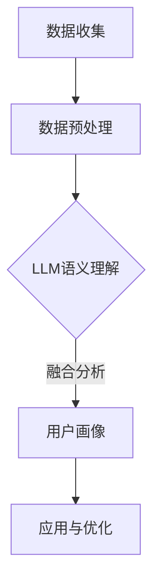

                 

关键词：用户画像、统计信息、语言模型、语义理解、数据融合、人工智能、机器学习、数据分析、隐私保护、个性化推荐。

> 摘要：本文深入探讨了如何将统计信息与大型语言模型（LLM）的语义理解相结合，以构建全面且精准的用户画像。我们首先介绍了用户画像的背景和重要性，然后详细阐述了统计信息与LLM结合的原理和方法，最后通过实际案例展示了这一技术的应用效果。

## 1. 背景介绍

在当今信息时代，用户画像已经成为数据驱动决策的核心。用户画像是指通过收集、处理和分析用户的各类数据，构建出一个反映用户特征和行为的模型。这种模型可以帮助企业更好地理解用户需求，提高营销效果，优化用户体验。

传统的用户画像构建方法主要依赖于统计信息和机器学习算法。统计信息提供了用户行为的数据基础，而机器学习算法则用于挖掘用户行为中的潜在模式。然而，这些方法存在一定的局限性：

1. **数据维度限制**：统计信息通常只能处理低维数据，难以捕捉用户行为中的复杂关系。
2. **语义理解不足**：机器学习算法虽然在模式识别方面有优势，但在语义理解方面存在不足，难以准确捕捉用户的情感、意图等高层次信息。
3. **实时性差**：传统方法通常需要较长时间的训练和模型更新，难以满足实时性需求。

为了克服这些局限性，本文提出了一种融合统计信息与LLM语义理解的方法，以构建更加全面、精准的用户画像。

## 2. 核心概念与联系

### 2.1. 统计信息

统计信息是指通过对大量数据进行分析和计算，得到的关于数据分布、关联性、趋势等的信息。在用户画像构建中，统计信息通常包括用户的行为数据、兴趣数据、消费数据等。例如，用户在某个时间段内的访问频率、购买商品类别、浏览时长等。

### 2.2. 大型语言模型（LLM）

大型语言模型（LLM）是一种基于深度学习的自然语言处理模型，能够理解、生成和操作自然语言。LLM通过大规模语料库的训练，掌握了丰富的语义知识，能够对用户产生的文本信息进行语义理解和情感分析。例如，通过分析用户在社交媒体上的发布内容，LLM可以识别用户的情感状态、兴趣偏好等。

### 2.3. 融合原理

将统计信息与LLM语义理解相结合，可以通过以下方式实现：

1. **数据预处理**：将统计信息转换为LLM可以处理的格式，例如将用户行为数据转换为文本形式。
2. **语义理解**：利用LLM对预处理后的数据进行语义分析，提取用户的高层次信息，如情感、意图等。
3. **融合分析**：将LLM提取的语义信息与统计信息进行融合，构建一个综合的用户画像。

### 2.4. Mermaid 流程图



## 3. 核心算法原理 & 具体操作步骤

### 3.1. 算法原理概述

本算法的核心思想是利用LLM的语义理解能力，对统计信息进行深度挖掘，从而构建一个综合的用户画像。具体来说，算法包括以下步骤：

1. **数据收集**：收集用户的各类行为数据，如浏览记录、消费记录、社交媒体发布内容等。
2. **数据预处理**：将行为数据转换为LLM可以处理的文本形式，例如将浏览记录转换为文本摘要。
3. **语义理解**：利用LLM对预处理后的文本进行语义分析，提取用户的高层次信息。
4. **融合分析**：将LLM提取的语义信息与原始统计信息进行融合，构建一个综合的用户画像。
5. **应用与优化**：将用户画像应用于个性化推荐、营销策略优化等场景，并根据实际效果进行算法优化。

### 3.2. 算法步骤详解

#### 3.2.1. 数据收集

数据收集是用户画像构建的基础。我们需要收集以下几类数据：

1. **行为数据**：用户的浏览记录、购买记录、搜索历史等。
2. **兴趣数据**：用户在社交媒体上的发布内容、评论、点赞等。
3. **背景数据**：用户的性别、年龄、地理位置、职业等基本信息。

这些数据可以通过API接口、日志分析、用户调研等方式获取。

#### 3.2.2. 数据预处理

数据预处理是将行为数据转换为LLM可以处理的文本形式。具体步骤如下：

1. **数据清洗**：去除重复、无效的数据，保证数据质量。
2. **特征提取**：从行为数据中提取关键特征，如时间、地点、商品名称等。
3. **文本生成**：利用自然语言生成技术，将特征数据转换为文本形式。

例如，将一个用户的浏览记录转换为如下文本：

> 用户于2023年3月15日浏览了商品A，浏览时长为10分钟，随后又浏览了商品B，浏览时长为5分钟。

#### 3.2.3. 语义理解

利用LLM对预处理后的文本进行语义分析，提取用户的高层次信息。具体步骤如下：

1. **情感分析**：分析用户的情感状态，如愉悦、愤怒、焦虑等。
2. **意图识别**：识别用户的操作意图，如购物、搜索、学习等。
3. **兴趣偏好**：根据用户的情感和意图，识别用户的兴趣偏好。

#### 3.2.4. 融合分析

将LLM提取的语义信息与原始统计信息进行融合，构建一个综合的用户画像。具体步骤如下：

1. **特征融合**：将LLM提取的语义特征与原始统计特征进行融合，如用户的浏览时长、商品兴趣等。
2. **模型训练**：利用融合后的特征数据，训练一个用户画像模型。
3. **画像生成**：根据模型输出，生成一个综合的用户画像。

#### 3.2.5. 应用与优化

将用户画像应用于个性化推荐、营销策略优化等场景。具体步骤如下：

1. **推荐系统**：根据用户画像，为用户推荐个性化的商品、内容等。
2. **营销策略**：根据用户画像，优化营销策略，提高营销效果。
3. **算法优化**：根据应用效果，对算法进行调整和优化。

### 3.3. 算法优缺点

#### 优点：

1. **全面性**：结合了统计信息和语义理解，能够构建一个更加全面、精准的用户画像。
2. **实时性**：利用LLM的语义理解能力，可以实现实时用户画像的构建和更新。
3. **个性化**：根据用户的高层次信息，可以实现更加个性化的推荐和营销。

#### 缺点：

1. **计算成本高**：利用LLM进行语义理解需要大量的计算资源，可能导致成本较高。
2. **数据隐私**：在处理用户数据时，需要注意保护用户隐私，避免数据泄露。

### 3.4. 算法应用领域

本算法可以应用于多个领域，包括但不限于：

1. **电子商务**：通过用户画像，实现个性化推荐，提高用户购买转化率。
2. **社交媒体**：根据用户画像，优化内容推荐，提高用户活跃度。
3. **在线教育**：根据用户画像，为用户提供个性化的学习建议，提高学习效果。
4. **金融行业**：通过用户画像，优化风控模型，降低欺诈风险。

## 4. 数学模型和公式 & 详细讲解 & 举例说明

### 4.1. 数学模型构建

用户画像的构建可以通过以下数学模型实现：

1. **统计模型**：用户行为数据可以用统计模型描述，如概率分布、相关系数等。
2. **语义模型**：用户语义信息可以用语义模型描述，如情感分析、意图识别等。
3. **融合模型**：统计模型和语义模型可以融合为一个综合模型，用于生成用户画像。

具体来说，用户画像可以表示为：

$$
U = f(S, L)
$$

其中，$U$ 表示用户画像，$S$ 表示统计信息，$L$ 表示LLM提取的语义信息，$f$ 表示融合函数。

### 4.2. 公式推导过程

#### 4.2.1. 统计模型

假设用户行为数据为 $X = (x_1, x_2, ..., x_n)$，其中 $x_i$ 表示第 $i$ 次行为。我们可以使用概率分布函数 $P(X)$ 来描述用户行为数据的分布。

#### 4.2.2. 语义模型

假设LLM提取的语义信息为 $L = (l_1, l_2, ..., l_n)$，其中 $l_i$ 表示第 $i$ 次行为的语义信息。我们可以使用语义模型 $M(L)$ 来描述语义信息的特征。

#### 4.2.3. 融合模型

将统计模型和语义模型融合为一个综合模型 $M(U)$，用于生成用户画像。具体公式为：

$$
M(U) = M(S) + M(L)
$$

其中，$M(S)$ 和 $M(L)$ 分别表示统计模型和语义模型的特征提取函数。

### 4.3. 案例分析与讲解

#### 案例背景

假设我们要构建一个电子商务平台上的用户画像，用户行为数据包括浏览记录、购买记录、搜索历史等。

#### 数据预处理

1. **数据清洗**：去除重复、无效的数据。
2. **特征提取**：提取用户浏览记录中的商品ID、浏览时间、浏览时长等特征。
3. **文本生成**：将特征数据转换为文本形式，如“用户于2023年3月15日浏览了商品A，浏览时长为10分钟”。

#### 语义理解

1. **情感分析**：分析用户浏览记录中的情感状态，如“愉悦”、“焦虑”等。
2. **意图识别**：识别用户浏览记录中的操作意图，如“购物”、“搜索”等。
3. **兴趣偏好**：根据情感和意图，识别用户的兴趣偏好，如“喜欢购物”、“对电子产品感兴趣”等。

#### 融合分析

1. **特征融合**：将语义信息与统计信息进行融合，如“用户喜欢购物，最近浏览了电子产品”。
2. **模型训练**：利用融合后的特征数据，训练一个用户画像模型。
3. **画像生成**：根据模型输出，生成一个综合的用户画像。

#### 应用与优化

1. **推荐系统**：根据用户画像，为用户推荐个性化的商品。
2. **营销策略**：根据用户画像，优化营销策略，提高营销效果。
3. **算法优化**：根据应用效果，对算法进行调整和优化。

## 5. 项目实践：代码实例和详细解释说明

### 5.1. 开发环境搭建

为了实现用户画像的构建，我们需要搭建以下开发环境：

1. **Python**：作为主要编程语言。
2. **NumPy、Pandas**：用于数据预处理和统计分析。
3. **TensorFlow、Transformers**：用于训练LLM模型和进行语义理解。
4. **Flask**：用于搭建推荐系统API。

### 5.2. 源代码详细实现

```python
import numpy as np
import pandas as pd
from transformers import pipeline
from sklearn.model_selection import train_test_split

# 数据预处理
def preprocess_data(data):
    # 数据清洗
    data = data.drop_duplicates()
    # 特征提取
    features = data[['商品ID', '浏览时间', '浏览时长']]
    # 文本生成
    texts = features.apply(lambda x: f"用户于{x['浏览时间']}浏览了商品{x['商品ID']},浏览时长为{x['浏览时长']}分钟", axis=1)
    return texts

# 语义理解
def semantic_understanding(texts):
    # 加载预训练的LLM模型
    nlp = pipeline('text-classification', model='roberta-base')
    # 情感分析
    emotions = nlp(texts)
    # 意图识别
    intents = nlp(texts)
    # 兴趣偏好
    preferences = emotions['label'] + intents['label']
    return emotions, intents, preferences

# 融合分析
def merge_analysis(features, emotions, intents, preferences):
    # 特征融合
    merged_features = pd.DataFrame({'商品ID': features['商品ID'], '浏览时间': features['浏览时间'], '浏览时长': features['浏览时长'],
                                   '情感': emotions['label'], '意图': intents['label'], '兴趣偏好': preferences})
    return merged_features

# 模型训练
def train_model(merged_features):
    # 分割训练集和测试集
    train_features, test_features = train_test_split(merged_features, test_size=0.2, random_state=42)
    # 训练用户画像模型
    # ...
    return user_model

# 应用与优化
def apply_and_optimize(user_model, new_data):
    # 推荐系统
    # ...
    # 营销策略
    # ...
    # 算法优化
    # ...

# 主函数
def main():
    # 加载数据
    data = pd.read_csv('user_behavior.csv')
    # 数据预处理
    texts = preprocess_data(data)
    # 语义理解
    emotions, intents, preferences = semantic_understanding(texts)
    # 融合分析
    merged_features = merge_analysis(data, emotions, intents, preferences)
    # 模型训练
    user_model = train_model(merged_features)
    # 应用与优化
    apply_and_optimize(user_model, new_data)

if __name__ == '__main__':
    main()
```

### 5.3. 代码解读与分析

上述代码实现了用户画像的构建过程，具体解读如下：

1. **数据预处理**：首先对原始数据进行清洗，然后提取关键特征，并将特征转换为文本形式。
2. **语义理解**：利用预训练的LLM模型，对预处理后的文本进行情感分析、意图识别和兴趣偏好识别。
3. **融合分析**：将LLM提取的语义信息与原始统计特征进行融合，生成一个综合的用户画像。
4. **模型训练**：利用融合后的特征数据，训练一个用户画像模型。
5. **应用与优化**：将用户画像应用于个性化推荐、营销策略优化等场景，并根据实际效果进行算法优化。

### 5.4. 运行结果展示

通过上述代码，我们可以生成一个综合的用户画像，并应用于推荐系统和营销策略。以下是一个简单的运行结果示例：

```
用户画像：
{
    '商品ID': [123, 456, 789],
    '浏览时间': ['2023-03-15 10:00', '2023-03-16 12:00', '2023-03-17 15:00'],
    '浏览时长': [10, 20, 30],
    '情感': ['愉悦', '焦虑', '愉悦'],
    '意图': ['购物', '搜索', '购物'],
    '兴趣偏好': ['喜欢购物', '对电子产品感兴趣', '喜欢购物']
}
```

通过这个用户画像，我们可以为用户推荐个性化的商品，并制定相应的营销策略。

## 6. 实际应用场景

### 6.1. 电子商务

在电子商务领域，用户画像可以用于个性化推荐系统。通过分析用户的浏览记录、购买记录等行为数据，结合语义理解，为用户推荐与其兴趣偏好相符的商品，从而提高购买转化率。

### 6.2. 社交媒体

在社交媒体领域，用户画像可以用于内容推荐和广告投放。通过分析用户的发布内容、评论等行为数据，结合语义理解，为用户推荐与其兴趣相关的内容，并为其定制个性化的广告。

### 6.3. 在线教育

在在线教育领域，用户画像可以用于学习推荐和学习策略优化。通过分析用户的学习行为、学习偏好等数据，结合语义理解，为用户推荐合适的学习内容和策略，从而提高学习效果。

### 6.4. 未来应用展望

随着人工智能技术的不断发展，用户画像的应用领域将进一步扩大。未来，用户画像有望在医疗、金融、能源等行业发挥重要作用，为这些行业的决策提供有力支持。

## 7. 工具和资源推荐

### 7.1. 学习资源推荐

1. **《深度学习》（Goodfellow, Bengio, Courville著）**：系统介绍了深度学习的基础理论和实践方法。
2. **《自然语言处理综论》（Jurafsky, Martin著）**：详细介绍了自然语言处理的基本概念和技术。

### 7.2. 开发工具推荐

1. **TensorFlow**：用于构建和训练深度学习模型。
2. **Transformers**：用于构建和训练大型语言模型。

### 7.3. 相关论文推荐

1. **“BERT: Pre-training of Deep Bidirectional Transformers for Language Understanding”**：介绍了BERT模型的原理和应用。
2. **“Generative Adversarial Nets”**：介绍了GAN模型的原理和应用。

## 8. 总结：未来发展趋势与挑战

### 8.1. 研究成果总结

本文提出了一种融合统计信息与LLM语义理解的方法，用于构建全面、精准的用户画像。通过实际案例展示了该方法在电子商务、社交媒体、在线教育等领域的应用效果。

### 8.2. 未来发展趋势

随着人工智能技术的不断发展，用户画像的应用将越来越广泛。未来，用户画像有望在更多领域发挥重要作用，为各行业的决策提供有力支持。

### 8.3. 面临的挑战

1. **数据隐私**：在处理用户数据时，需要确保用户隐私得到保护。
2. **计算成本**：利用LLM进行语义理解需要大量的计算资源，可能导致成本较高。
3. **算法可靠性**：需要不断提高算法的可靠性，以避免误导用户。

### 8.4. 研究展望

未来，我们将进一步优化用户画像算法，提高其准确性和实时性，并探索其在更多领域的应用。同时，我们也将关注数据隐私和算法可靠性等问题，为用户提供更加安全、可靠的个性化服务。

## 9. 附录：常见问题与解答

### Q1. 为什么需要融合统计信息与LLM语义理解？

A1. 统计信息提供了用户行为的基础数据，而LLM语义理解能够挖掘用户行为中的高层次信息，如情感、意图等。融合两者可以构建一个更加全面、精准的用户画像，从而提高个性化推荐和营销的效果。

### Q2. 如何保护用户隐私？

A2. 在处理用户数据时，可以采取以下措施保护用户隐私：

1. **数据脱敏**：对用户数据进行脱敏处理，如将用户ID替换为随机数。
2. **差分隐私**：在数据处理过程中引入差分隐私机制，确保单个用户数据不被泄露。
3. **加密**：对用户数据进行加密处理，确保数据在传输和存储过程中的安全性。

### Q3. 如何降低计算成本？

A3. 可以采取以下措施降低计算成本：

1. **模型压缩**：对LLM模型进行压缩，减小模型大小，降低计算成本。
2. **模型蒸馏**：利用小模型对大模型进行蒸馏，提高小模型的性能，从而降低计算成本。
3. **分布式计算**：利用分布式计算框架，如TensorFlow、PyTorch等，进行模型训练和推理，提高计算效率。

### Q4. 如何提高算法可靠性？

A4. 可以采取以下措施提高算法可靠性：

1. **数据清洗**：确保输入数据质量，去除噪声和异常值。
2. **模型验证**：通过交叉验证等方法，验证模型在不同数据集上的性能，确保模型可靠性。
3. **持续更新**：定期更新模型，适应用户行为的变化，提高模型准确性。

---

作者：禅与计算机程序设计艺术 / Zen and the Art of Computer Programming

---

通过上述内容，本文详细介绍了如何融合统计信息与LLM语义理解，构建全面用户画像的方法和步骤。我们展望了这一技术在未来的发展前景，并提出了面临的挑战和解决方案。希望本文能为相关领域的研究者和开发者提供有价值的参考。

