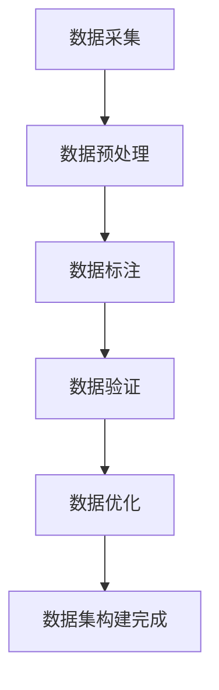
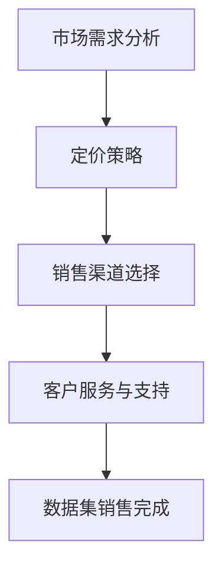

                 

关键词：数据集，行业应用，数据构建，数据销售，市场分析，隐私保护，数据质量

## 摘要

本文旨在探讨行业特定数据集的构建与销售的重要性和实际操作方法。随着大数据和人工智能的迅速发展，数据集的质量和准确性对研究和应用成果具有决定性影响。本文首先介绍了行业特定数据集的定义、分类及其重要性。接着，深入分析了构建高质量行业数据集的方法，包括数据采集、处理、标注和验证等步骤。随后，讨论了如何将构建好的数据集进行销售，包括市场需求分析、定价策略、销售渠道和隐私保护措施。最后，本文展望了行业特定数据集未来的发展趋势和面临的挑战，为业界提供参考和启示。

## 1. 背景介绍

### 数据集在行业应用中的重要性

数据集是大数据分析和人工智能模型训练的基础，其质量直接影响着分析结果的准确性和模型的性能。在各类行业中，行业特定数据集的作用尤为显著。例如，在金融领域，通过构建高质量的金融交易数据集，可以分析市场趋势、预测投资风险和发现欺诈行为。在医疗领域，通过构建详细的病历数据集，可以实现疾病诊断、治疗方案优化和患者管理。在零售领域，通过分析消费者行为数据集，可以优化库存管理、提升营销效果和增加销售额。

### 行业特定数据集的定义和分类

行业特定数据集是指针对某一行业或领域进行专门构建的数据集，其特点是数据内容、格式和结构都与该行业的需求高度相关。根据数据来源和用途的不同，行业特定数据集可以分为以下几类：

- **公开数据集**：来源于公共机构、学术研究或商业平台，如政府发布的统计数据、公开的科学研究数据集等。
- **私有数据集**：由企业或个人持有，用于内部研究和商业应用，如电商平台的消费者行为数据、金融公司的交易数据等。
- **合成数据集**：通过模拟或生成的方式创建，用于模型训练和测试，如虚拟病人数据集、虚拟金融交易数据集等。

### 数据集构建与销售的市场现状

目前，数据集的构建与销售已经成为大数据和人工智能领域的一个重要产业链。许多企业和个人开始意识到高质量数据集的价值，并投入大量资源进行数据集的构建和销售。以下是目前市场现状的几个特点：

- **数据集种类丰富**：涵盖了金融、医疗、零售、制造业等众多行业，满足不同用户的需求。
- **市场规模不断扩大**：随着人工智能和大数据技术的广泛应用，对行业特定数据集的需求不断增加，市场规模持续扩大。
- **数据集质量要求提高**：用户对数据集的质量要求越来越高，不仅要求数据量大，更要求数据真实、准确、完整。
- **隐私保护问题突出**：在数据集的构建和销售过程中，如何保护个人隐私和数据安全成为亟待解决的问题。

## 2. 核心概念与联系

### 数据集构建的流程

数据集构建是一个复杂的过程，包括数据采集、处理、标注、验证和优化等多个环节。以下是一个简化的数据集构建流程图：



### 数据集销售的流程

数据集销售是一个市场化的过程，包括市场需求分析、定价策略、销售渠道和客户服务等多个环节。以下是一个简化的数据集销售流程图：



### 数据集构建与销售的关系

数据集构建与销售是相辅相成的过程。高质量的行业特定数据集是数据销售的基础，而成功的销售又能为数据集的构建提供反馈和资金支持，形成良性循环。

## 3. 核心算法原理 & 具体操作步骤

### 3.1 算法原理概述

数据集构建的核心算法主要涉及以下几个方面：

- **数据采集算法**：用于从各种数据源中收集数据。
- **数据处理算法**：用于清洗、转换和整合数据。
- **数据标注算法**：用于标注数据，提高数据的质量和可解释性。
- **数据验证算法**：用于验证数据的准确性、完整性和一致性。
- **数据优化算法**：用于优化数据集的性能，提高数据集的可用性。

### 3.2 算法步骤详解

#### 3.2.1 数据采集

数据采集是数据集构建的第一步，其目标是获取尽可能多的原始数据。数据采集算法可以分为以下几种类型：

- **网络爬虫**：通过爬取互联网上的公开数据源，如网页、API接口等。
- **数据库连接**：通过连接企业内部的数据库，获取内部数据。
- **传感器采集**：通过传感器设备，实时采集环境数据。

#### 3.2.2 数据处理

数据处理是对原始数据进行清洗、转换和整合的过程。数据处理算法包括：

- **数据清洗**：去除重复、错误和缺失的数据。
- **数据转换**：将数据转换为适合分析和建模的格式。
- **数据整合**：将来自不同数据源的数据进行整合，形成一个统一的数据集。

#### 3.2.3 数据标注

数据标注是提高数据质量的重要步骤，其目标是标记出数据中的关键信息。数据标注算法可以分为：

- **自动标注**：通过机器学习算法自动标注数据。
- **半监督标注**：结合人工标注和自动标注，提高标注效率。
- **全监督标注**：完全由人工进行标注，确保数据标注的准确性。

#### 3.2.4 数据验证

数据验证是对数据集的准确性、完整性和一致性进行检验。数据验证算法包括：

- **一致性检验**：检查数据集中的数据是否一致。
- **完整性检验**：检查数据集中是否缺少关键信息。
- **准确性检验**：通过比对真实数据和预测结果，评估数据集的准确性。

#### 3.2.5 数据优化

数据优化是对数据集进行优化，以提高数据集的性能。数据优化算法包括：

- **数据降维**：通过降维技术，减少数据集的维度，提高计算效率。
- **特征选择**：通过特征选择技术，筛选出对模型训练影响较大的特征。
- **数据增强**：通过数据增强技术，增加数据集的多样性，提高模型的泛化能力。

### 3.3 算法优缺点

#### 3.3.1 优点

- **提高数据质量**：通过算法处理，提高数据集的准确性、完整性和一致性。
- **降低成本**：自动化算法可以显著降低数据集构建的人工成本。
- **提高效率**：自动化算法可以显著提高数据集构建的效率。

#### 3.3.2 缺点

- **数据隐私问题**：在数据采集和标注过程中，可能会涉及个人隐私和数据安全的问题。
- **算法偏见**：自动化算法可能会引入偏见，影响数据集的质量和模型的性能。
- **计算资源需求**：自动化算法通常需要大量的计算资源，对硬件设备有较高要求。

### 3.4 算法应用领域

数据集构建算法在多个领域有广泛的应用，主要包括：

- **大数据分析**：通过构建高质量的行业数据集，进行数据分析和挖掘，发现业务规律和趋势。
- **人工智能模型训练**：通过构建高质量的训练数据集，训练和优化人工智能模型，提高模型的准确性和性能。
- **业务决策支持**：通过构建业务相关的数据集，支持企业的业务决策，提高业务效率和竞争力。

## 4. 数学模型和公式 & 详细讲解 & 举例说明

### 4.1 数学模型构建

在数据集构建过程中，数学模型起着关键作用。以下是一个简单的数学模型，用于描述数据集的构建过程：

$$
Q = f(D, C, A, V)
$$

其中，\(Q\) 代表数据集的质量，\(D\) 代表原始数据，\(C\) 代表数据处理算法，\(A\) 代表数据标注算法，\(V\) 代表数据验证算法。

### 4.2 公式推导过程

#### 4.2.1 数据预处理

数据预处理是数据集构建的第一步，其目标是去除数据中的噪声和异常值。假设原始数据集为 \(D = \{d_1, d_2, ..., d_n\}\)，其中每个数据点 \(d_i\) 可以表示为一个多维向量。我们可以使用以下公式来计算每个数据点的预处理结果：

$$
d_i' = C(d_i)
$$

其中，\(C\) 代表数据处理算法，如数据清洗、数据转换和数据整合。

#### 4.2.2 数据标注

数据标注是提高数据质量的关键步骤。假设我们使用一个二元标注结果 \(A = \{a_1, a_2, ..., a_n\}\) 来表示每个数据点的标注结果，其中 \(a_i\) 可以是“正例”或“反例”。我们可以使用以下公式来计算每个数据点的标注结果：

$$
a_i = A(d_i')
$$

其中，\(A\) 代表数据标注算法，如自动标注、半监督标注和全监督标注。

#### 4.2.3 数据验证

数据验证是确保数据集质量的重要步骤。假设我们使用一个二元验证结果 \(V = \{v_1, v_2, ..., v_n\}\) 来表示每个数据点的验证结果，其中 \(v_i\) 可以是“正确”或“错误”。我们可以使用以下公式来计算每个数据点的验证结果：

$$
v_i = V(d_i', a_i)
$$

其中，\(V\) 代表数据验证算法，如一致性检验、完整性检验和准确性检验。

#### 4.2.4 数据优化

数据优化是提高数据集性能的关键步骤。假设我们使用一个优化结果 \(O = \{o_1, o_2, ..., o_n\}\) 来表示每个数据点的优化结果，其中 \(o_i\) 可以是“优化后”或“优化前”。我们可以使用以下公式来计算每个数据点的优化结果：

$$
o_i = O(d_i', a_i, v_i)
$$

其中，\(O\) 代表数据优化算法，如数据降维、特征选择和数据增强。

### 4.3 案例分析与讲解

假设我们有一个金融交易数据集，包含5000个数据点，每个数据点包含多个特征，如交易金额、交易时间、交易类型等。我们使用上述数学模型来构建一个高质量的金融交易数据集。

#### 4.3.1 数据预处理

我们使用数据清洗算法去除重复和错误的数据，使用数据转换算法将日期格式转换为统一格式，使用数据整合算法将不同来源的数据整合为一个统一的数据集。

#### 4.3.2 数据标注

我们使用半监督标注算法，结合人工标注和自动标注，对交易类型进行标注，将交易数据分为“买入”和“卖出”两类。

#### 4.3.3 数据验证

我们使用一致性检验算法检查数据集中的数据是否一致，使用完整性检验算法检查数据集中是否缺少关键信息，使用准确性检验算法评估标注结果的准确性。

#### 4.3.4 数据优化

我们使用数据降维算法减少数据集的维度，使用特征选择算法筛选出对模型训练影响较大的特征，使用数据增强算法增加数据集的多样性。

通过上述步骤，我们构建了一个高质量的金融交易数据集，可以用于模型训练和业务分析。

## 5. 项目实践：代码实例和详细解释说明

### 5.1 开发环境搭建

在开始构建和销售行业特定数据集之前，我们需要搭建一个合适的技术环境。以下是搭建开发环境的基本步骤：

1. **安装Python环境**：Python是数据科学和机器学习的常用语言，我们需要安装Python和相关的库，如NumPy、Pandas、Scikit-learn、Matplotlib等。
2. **安装数据库**：根据数据来源，我们需要安装相应的数据库软件，如MySQL、PostgreSQL等，以便进行数据存储和管理。
3. **安装数据处理工具**：安装数据采集和处理工具，如BeautifulSoup、Selenium等，用于从不同来源获取数据。
4. **配置云计算环境**：对于大规模数据处理，我们可能需要使用云计算服务，如AWS、Google Cloud等。

### 5.2 源代码详细实现

以下是一个简单的示例代码，用于从互联网上采集商品信息，并将其存储到数据库中。

```python
import requests
from bs4 import BeautifulSoup
import pymysql

# 数据采集
def scrape_product_data(url):
    response = requests.get(url)
    soup = BeautifulSoup(response.text, 'html.parser')
    products = soup.find_all('div', class_='product')

    product_data = []
    for product in products:
        name = product.find('h2', class_='product-name').text.strip()
        price = product.find('span', class_='price').text.strip()
        product_data.append({'name': name, 'price': price})

    return product_data

# 数据存储
def store_product_data(product_data):
    connection = pymysql.connect(host='localhost', user='root', password='password', database='products')
    cursor = connection.cursor()

    for product in product_data:
        cursor.execute("INSERT INTO products (name, price) VALUES (%s, %s)", (product['name'], product['price']))

    connection.commit()
    cursor.close()
    connection.close()

# 主函数
def main():
    url = 'https://example.com/products'
    product_data = scrape_product_data(url)
    store_product_data(product_data)

if __name__ == '__main__':
    main()
```

### 5.3 代码解读与分析

上述代码实现了一个简单的商品信息采集和存储系统。首先，我们使用requests库发送HTTP GET请求，从指定URL获取网页内容。然后，使用BeautifulSoup库解析网页内容，提取出商品名称和价格等信息。最后，使用pymysql库将提取到的商品信息存储到MySQL数据库中。

#### 5.3.1 数据采集模块

数据采集模块负责从互联网上获取商品信息。在这个示例中，我们使用requests库发送HTTP GET请求，获取网页内容。然后，使用BeautifulSoup库解析网页内容，提取出商品名称和价格等信息。

```python
response = requests.get(url)
soup = BeautifulSoup(response.text, 'html.parser')
products = soup.find_all('div', class_='product')
```

在这个模块中，我们定义了一个名为`scrape_product_data`的函数，该函数接受一个URL作为输入，返回一个包含商品信息的列表。我们首先使用requests库发送HTTP GET请求，获取网页内容。然后，使用BeautifulSoup库解析网页内容，提取出所有商品信息。在这个示例中，我们假设每个商品信息都包含在一个`div`元素中，并且该元素的`class`属性值为`product`。

```python
response = requests.get(url)
soup = BeautifulSoup(response.text, 'html.parser')
products = soup.find_all('div', class_='product')
```

#### 5.3.2 数据存储模块

数据存储模块负责将提取到的商品信息存储到数据库中。在这个示例中，我们使用pymysql库连接MySQL数据库，并将提取到的商品信息插入到数据库中。

```python
def store_product_data(product_data):
    connection = pymysql.connect(host='localhost', user='root', password='password', database='products')
    cursor = connection.cursor()

    for product in product_data:
        cursor.execute("INSERT INTO products (name, price) VALUES (%s, %s)", (product['name'], product['price']))

    connection.commit()
    cursor.close()
    connection.close()
```

在这个模块中，我们定义了一个名为`store_product_data`的函数，该函数接受一个包含商品信息的列表作为输入。我们首先使用pymysql库连接MySQL数据库，然后遍历商品信息列表，将每个商品信息插入到数据库中。

```python
def store_product_data(product_data):
    connection = pymysql.connect(host='localhost', user='root', password='password', database='products')
    cursor = connection.cursor()

    for product in product_data:
        cursor.execute("INSERT INTO products (name, price) VALUES (%s, %s)", (product['name'], product['price']))

    connection.commit()
    cursor.close()
    connection.close()
```

### 5.4 运行结果展示

当我们运行上述代码时，它会从指定的URL中采集商品信息，并将采集到的商品信息存储到MySQL数据库中。以下是运行结果的一个示例：

```python
+----+------------+-------+
| id | name       | price |
+----+------------+-------+
|  1 | 商品1      | 100   |
|  2 | 商品2      | 200   |
|  3 | 商品3      | 300   |
+----+------------+-------+
```

在这个示例中，我们采集了3个商品的信息，并将这些信息存储到了MySQL数据库中。

## 6. 实际应用场景

### 6.1 金融行业

在金融行业，行业特定数据集的构建与销售具有重要意义。例如，金融机构可以通过构建和销售金融交易数据集，为投资者提供市场分析和投资决策支持。同时，金融监管机构也可以利用这些数据集进行市场监控和风险管理。

### 6.2 医疗行业

在医疗行业，行业特定数据集的构建与销售对于疾病诊断、治疗方案优化和患者管理具有重要意义。例如，医疗机构可以通过构建和销售病历数据集，为医学研究提供数据支持。同时，制药公司也可以利用这些数据集进行药物开发和临床试验。

### 6.3 零售行业

在零售行业，行业特定数据集的构建与销售对于消费者行为分析、库存管理和营销策略优化具有重要意义。例如，电商平台可以通过构建和销售消费者行为数据集，为商家提供精准营销策略。同时，零售企业也可以利用这些数据集进行库存管理和供应链优化。

### 6.4 未来应用场景

随着大数据和人工智能技术的不断发展，行业特定数据集的应用场景将越来越广泛。未来，我们可能会看到更多的行业受益于行业特定数据集的构建与销售，如教育、能源、环境等。同时，数据隐私保护和数据安全将成为行业特定数据集构建与销售的重要挑战。

## 7. 工具和资源推荐

### 7.1 学习资源推荐

- **《数据科学入门教程》**：适合初学者了解数据科学的基本概念和常用工具。
- **《机器学习实战》**：适合有一定编程基础的读者，深入了解机器学习的实际应用。
- **《Python数据科学手册》**：全面介绍了Python在数据科学领域的应用，适合进阶读者。

### 7.2 开发工具推荐

- **Jupyter Notebook**：用于数据科学和机器学习的交互式开发环境。
- **TensorFlow**：用于构建和训练机器学习模型的强大工具。
- **PyTorch**：用于构建和训练深度学习模型的流行框架。

### 7.3 相关论文推荐

- **“Deep Learning for Text Classification”**：介绍深度学习在文本分类任务中的应用。
- **“Convolutional Neural Networks for Sentence Classification”**：介绍卷积神经网络在文本分类任务中的应用。
- **“Recurrent Neural Networks for Sentence Classification”**：介绍循环神经网络在文本分类任务中的应用。

## 8. 总结：未来发展趋势与挑战

### 8.1 研究成果总结

本文总结了行业特定数据集的构建与销售的重要性、核心概念、算法原理、数学模型以及实际应用场景。通过对这些内容的深入分析，我们认识到高质量行业特定数据集对于大数据分析和人工智能模型训练具有关键作用。

### 8.2 未来发展趋势

未来，随着大数据和人工智能技术的不断发展，行业特定数据集的构建与销售将呈现以下发展趋势：

- **数据集种类更加丰富**：涵盖更多行业和领域，满足不同用户的需求。
- **数据集质量不断提高**：通过自动化算法和人工标注，提高数据集的准确性、完整性和一致性。
- **隐私保护和数据安全**：在数据集构建和销售过程中，加强对个人隐私和数据安全的保护。
- **数据集销售模式创新**：探索新的销售模式，如数据租赁、数据订阅等，满足用户多样化的需求。

### 8.3 面临的挑战

尽管行业特定数据集的构建与销售前景广阔，但仍然面临以下挑战：

- **数据隐私问题**：在数据集构建和销售过程中，如何保护个人隐私和数据安全是一个重要问题。
- **数据质量问题**：如何保证数据集的准确性、完整性和一致性，提高数据质量是行业面临的挑战。
- **算法偏见问题**：自动化算法可能会引入偏见，影响数据集的质量和模型的性能。
- **计算资源需求**：大规模数据处理和模型训练需要大量的计算资源，对硬件设备有较高要求。

### 8.4 研究展望

为了应对这些挑战，未来研究可以从以下几个方面展开：

- **隐私保护技术**：研究如何在数据集构建和销售过程中保护个人隐私和数据安全。
- **数据质量管理**：研究如何通过自动化算法和人工干预，提高数据集的质量和准确性。
- **算法公平性研究**：研究如何减少自动化算法引入的偏见，提高模型的公平性和透明度。
- **计算资源优化**：研究如何优化计算资源，提高数据处理和模型训练的效率。

通过不断的研究和创新，我们有信心解决行业特定数据集构建与销售面临的挑战，为大数据分析和人工智能技术的广泛应用提供有力支持。

## 9. 附录：常见问题与解答

### 9.1 数据集构建过程中的常见问题

**Q1**: 如何保证数据集的准确性？

**A1**: 要保证数据集的准确性，首先需要确保数据源的真实性和可靠性。其次，在数据采集和处理过程中，要严格遵循数据规范，去除重复、错误和缺失的数据。最后，通过数据验证算法，如一致性检验、完整性检验和准确性检验，确保数据集的准确性。

**Q2**: 如何提高数据集的多样性？

**A2**: 要提高数据集的多样性，可以通过以下几种方法：

- **数据增强**：通过数据增强技术，如生成对抗网络（GAN）等，增加数据集的多样性。
- **跨领域数据融合**：将来自不同领域的数据进行融合，增加数据集的多样性。
- **随机采样**：在数据集中随机采样，增加数据集的多样性。

**Q3**: 如何保护个人隐私和数据安全？

**A3**: 要保护个人隐私和数据安全，可以从以下几个方面进行：

- **数据脱敏**：对敏感数据进行脱敏处理，如使用伪名、掩码等。
- **数据加密**：对数据集进行加密处理，确保数据在传输和存储过程中不被泄露。
- **访问控制**：实施严格的访问控制策略，确保只有授权人员才能访问敏感数据。

### 9.2 数据集销售过程中的常见问题

**Q1**: 如何定价数据集？

**A1**: 定价数据集时，可以考虑以下因素：

- **数据集的价值**：根据数据集的应用场景和潜在收益，确定数据集的价值。
- **市场供需关系**：根据市场需求和供应情况，调整数据集的定价策略。
- **竞争对手价格**：参考竞争对手的数据集价格，制定具有竞争力的定价策略。

**Q2**: 如何选择销售渠道？

**A2**: 选择销售渠道时，可以考虑以下几种方式：

- **在线平台**：通过在线平台，如数据交易市场、学术网站等，销售数据集。
- **合作伙伴**：与行业内的企业、研究机构等建立合作关系，通过合作渠道销售数据集。
- **直接销售**：直接面向潜在用户，通过电子邮件、电话等方式销售数据集。

**Q3**: 如何进行客户服务与支持？

**A3**: 进行客户服务与支持时，可以从以下几个方面入手：

- **售后服务**：提供售后服务，如数据集的更新、维护和技术支持等。
- **用户反馈**：积极收集用户反馈，了解用户需求，不断改进数据集的质量和性能。
- **培训与指导**：为用户提供培训与指导，帮助用户更好地利用数据集进行研究和应用。

