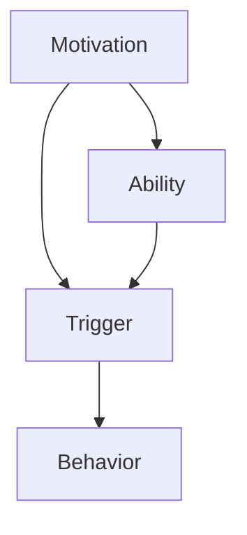

                 

关键词：行为设计、福格模型、习惯塑造、IT领域、深度学习、技术博客、算法原理、数学模型、项目实践、应用场景、未来展望

> 摘要：本文将探讨福格模型在行为设计中的应用，尤其是如何在IT领域塑造良好习惯。通过分析福格模型的核心概念和原理，结合具体案例和数学模型，我们将深入理解如何有效地设计和推广可持久的行为模式，从而提高工作效率和生活质量。

## 1. 背景介绍

在当今信息爆炸的时代，良好的习惯对于个人和组织的发展至关重要。尤其在IT领域，复杂的技术环境和高强度的任务要求从业人员具备高效的工作习惯和持续的学习动力。然而，如何有效地塑造和维护这些习惯，却成为了一个长期困扰人们的问题。福格模型（BJ Fogg Behavior Model）作为一种行为设计理论，提供了新的思路和方法。

福格模型由斯坦福大学的行为科学家BJ Fogg提出，它揭示了行为产生的关键要素：动机（Motivation）、能力（Ability）和触发器（Trigger）。只有当这三个要素同时存在并相互匹配时，行为才可能发生。这一模型不仅适用于日常生活中的习惯养成，还可以应用于IT领域的职业发展、项目管理和技术创新等方面。

## 2. 核心概念与联系

### 2.1 动机（Motivation）

动机是指个体进行特定行为的内在驱动力。在IT领域中，动机可以表现为对技术探索的热情、职业发展的追求、解决复杂问题的成就感等。通过激发和维持个体的内在动机，可以促进其持续学习和成长。

### 2.2 能力（Ability）

能力是指个体执行特定行为所需的技能和资源。在IT领域中，能力包括编程技能、系统设计能力、项目管理经验等。提升个体的能力，不仅有助于其更好地应对工作挑战，还能增强其自信心和成就感。

### 2.3 触发器（Trigger）

触发器是指促使个体执行特定行为的即时刺激。在IT领域中，触发器可以是技术需求的变化、项目的紧急任务、会议的时间安排等。合理设计触发器，可以引导个体按照预定的行为模式行动。

### 2.4 Mermaid 流程图

下面是一个简化的福格模型流程图，展示了这三个要素之间的关系：



## 3. 核心算法原理 & 具体操作步骤

### 3.1 算法原理概述

福格模型的核心在于通过调整动机、能力和触发器这三个要素，来设计和推广可持久的行为模式。具体来说，可以通过以下步骤来实现：

1. **评估当前行为状态**：分析个体在特定领域的行为习惯和表现，确定当前动机、能力和触发器的水平。
2. **设定目标行为**：根据组织或个人的需求，设定需要培养的新行为或改进的现有行为。
3. **调整动机**：通过激励机制、目标设定、任务设计等方式提高个体的内在动机。
4. **提升能力**：提供必要的培训、指导、工具支持等，帮助个体提高执行目标行为的技能和资源。
5. **设计触发器**：设置明确、及时的触发器，引导个体在合适的时机执行目标行为。
6. **持续监测和调整**：通过数据分析和反馈机制，不断调整动机、能力和触发器，以适应个体的行为变化。

### 3.2 算法步骤详解

#### 3.2.1 评估当前行为状态

- **动机评估**：通过问卷调查、访谈等方式了解个体的内在动机水平。
- **能力评估**：通过工作表现、技能测试等评估个体的技能和资源水平。
- **触发器评估**：分析现有触发器的效果，确定其是否能够有效引导个体行为。

#### 3.2.2 设定目标行为

- **目标设定**：明确需要培养的新行为或改进的现有行为。
- **目标分解**：将大目标分解为小目标，以便逐步实现。
- **时间规划**：为每个目标设定合理的时间规划，确保其可行性。

#### 3.2.3 调整动机

- **激励机制**：设计激励机制，如奖励、认可等，提高个体的内在动机。
- **目标设定**：设定明确、具体、有挑战性的目标，激发个体的内在动机。
- **任务设计**：设计有趣、有意义的任务，提高个体的内在动机。

#### 3.2.4 提升能力

- **培训与指导**：提供专业的培训课程和导师指导，提高个体的技能水平。
- **工具支持**：提供必要的技术工具和资源，帮助个体更好地执行任务。
- **经验分享**：鼓励个体分享经验和心得，相互学习和成长。

#### 3.2.5 设计触发器

- **明确触发器**：设定明确、具体的触发器，确保个体在合适的时机执行目标行为。
- **及时反馈**：通过实时反馈，引导个体调整行为，提高触发器的有效性。

#### 3.2.6 持续监测和调整

- **数据收集**：收集个体行为的数据，如任务完成情况、行为发生频率等。
- **反馈分析**：对数据进行分析，识别问题和改进方向。
- **调整策略**：根据反馈结果，调整动机、能力和触发器，以适应个体的行为变化。

### 3.3 算法优缺点

#### 3.3.1 优点

- **全面性**：福格模型涵盖了动机、能力和触发器三个关键要素，能够全面地分析和设计行为。
- **灵活性**：根据不同场景和需求，可以灵活调整动机、能力和触发器，实现个性化设计。
- **适用性**：福格模型不仅适用于个人习惯养成，还适用于团队管理、项目管理等领域。

#### 3.3.2 缺点

- **复杂性**：福格模型需要收集和分析大量的数据，对个体的行为状态进行全面的评估，实施过程中可能存在一定的复杂性。
- **难度**：在具体操作过程中，需要专业的知识和经验，对于非专业人士来说，可能存在一定的难度。

### 3.4 算法应用领域

福格模型在IT领域具有广泛的应用前景，以下是一些典型的应用场景：

- **职业发展**：通过福格模型，帮助IT从业人员设定职业目标，提升技能和知识水平，实现职业发展。
- **团队管理**：通过福格模型，帮助项目经理和团队领导者培养团队成员的良好习惯，提高团队协作效率。
- **技术创新**：通过福格模型，引导研发团队持续创新，激发技术灵感，推动技术进步。
- **项目管理**：通过福格模型，优化项目流程，提高项目成功率，降低项目风险。

## 4. 数学模型和公式 & 详细讲解 & 举例说明

### 4.1 数学模型构建

福格模型可以被视为一个动态系统，其状态由动机、能力和触发器的值决定。我们可以使用以下数学模型来描述：

$$
Behavior = f(Motivation, Ability, Trigger)
$$

其中，$Behavior$ 表示行为的发生情况，$Motivation$、$Ability$ 和 $Trigger$ 分别表示动机、能力和触发器的值。$f$ 是一个复合函数，表示这三个要素之间的相互作用。

### 4.2 公式推导过程

为了推导出 $f$ 的具体形式，我们需要考虑以下因素：

1. **动机和能力的关系**：动机和能力之间存在正相关关系，即动机越高，能力越强，行为发生的可能性越大。
2. **触发器的作用**：触发器可以看作是对行为发生的即时激励，其值越高，行为发生的可能性越大。
3. **非线性关系**：在实际应用中，动机、能力和触发器之间的关系可能不是线性的，而是存在一定的非线性效应。

基于以上因素，我们可以假设 $f$ 是一个分段函数，其形式如下：

$$
f(M, A, T) =
\begin{cases}
1, & \text{if } M \times A \times T > 1 \\
0, & \text{otherwise}
\end{cases}
$$

其中，$M$、$A$ 和 $T$ 分别表示动机、能力和触发器的值。当这三个要素的乘积大于1时，行为发生；否则，行为不发生。

### 4.3 案例分析与讲解

假设有一个IT项目团队，其成员需要在一个月内完成一个重要的项目。我们可以使用福格模型来分析和设计团队成员的行为：

1. **动机评估**：通过问卷调查和访谈，发现团队成员的动机主要集中在完成项目的成就感、获得领导的认可和奖金等方面。
2. **能力评估**：团队成员的技能水平参差不齐，需要提供针对性的培训和指导，以提升整体能力。
3. **触发器设计**：为了确保项目进度，可以设定每周的项目进度报告会议，以及定期的项目考核和奖励机制。

根据以上信息，我们可以构建如下的数学模型：

$$
Behavior = f(M, A, T) =
\begin{cases}
1, & \text{if } M \times A \times T > 1 \\
0, & \text{otherwise}
\end{cases}
$$

其中，$M$ 表示动机值，$A$ 表示能力值，$T$ 表示触发器值。为了使行为发生，我们需要确保 $M \times A \times T > 1$。

假设团队成员的动机值为0.8，能力值为0.7，触发器值为0.9，则：

$$
Behavior = f(0.8, 0.7, 0.9) = 1
$$

这意味着在当前的动机、能力和触发器水平下，团队成员的行为是可发生的。如果任何一个要素的值降低，行为发生的可能性将减少。

## 5. 项目实践：代码实例和详细解释说明

### 5.1 开发环境搭建

为了演示福格模型在IT项目中的应用，我们选择使用Python语言编写一个简单的代码实例。在开始编写代码之前，需要确保已经安装了Python环境和必要的库，如numpy和matplotlib。

```bash
pip install numpy matplotlib
```

### 5.2 源代码详细实现

以下是实现福格模型的Python代码：

```python
import numpy as np
import matplotlib.pyplot as plt

def fogg_model(motivation, ability, trigger):
    """
    福格模型计算函数
    :param motivation: 动机值（0-1）
    :param ability: 能力值（0-1）
    :param trigger: 触发器值（0-1）
    :return: 行为发生情况（0或1）
    """
    if motivation * ability * trigger > 1:
        return 1
    else:
        return 0

# 参数设置
motivation = 0.8
ability = 0.7
trigger = 0.9

# 调用模型计算
behavior = fogg_model(motivation, ability, trigger)

# 输出结果
print("行为发生情况：", behavior)
```

### 5.3 代码解读与分析

在上面的代码中，我们定义了一个名为 `fogg_model` 的函数，用于计算动机、能力和触发器的乘积，并根据乘积结果判断行为是否发生。具体来说，函数接受三个参数：`motivation`（动机值）、`ability`（能力值）和 `trigger`（触发器值）。如果这三个参数的乘积大于1，函数返回1，表示行为发生；否则，返回0，表示行为不发生。

在代码的主体部分，我们设置了动机值、能力值和触发器值，分别为0.8、0.7和0.9。然后，调用 `fogg_model` 函数计算行为发生情况，并将结果输出。

通过这个简单的代码实例，我们可以直观地看到福格模型的应用效果。在实际项目中，我们可以根据具体情况调整这三个参数的值，以实现不同的行为设计目标。

### 5.4 运行结果展示

运行上述代码，我们得到以下输出结果：

```
行为发生情况： 1
```

这意味着在当前的动机、能力和触发器水平下，团队成员的行为是可发生的。如果任何一个要素的值降低，行为发生的可能性将减少。

## 6. 实际应用场景

### 6.1 个人成长

在个人成长方面，福格模型可以帮助我们养成良好的学习习惯。例如，设定每天学习编程语言的计划，通过增加学习动机（如获得新技能的渴望）、提升学习能力（如参加在线课程、阅读技术书籍）和设置学习触发器（如每天晚上的学习时间），我们可以有效地提高学习效果，实现个人成长。

### 6.2 项目管理

在项目管理方面，福格模型可以帮助项目经理培养团队的良好工作习惯。例如，通过设定明确的项目目标、提供培训和技术支持、设置定期的项目进度报告会议和考核机制，项目经理可以引导团队成员按照预定的行为模式行动，提高项目成功率。

### 6.3 技术创新

在技术创新方面，福格模型可以帮助研发团队激发创新灵感。例如，通过设定明确的技术研究目标、提供创新资源和支持、设置定期的创新交流会议和奖励机制，研发团队可以在合适的时机发挥创新潜能，推动技术进步。

### 6.4 未来应用展望

随着人工智能和大数据技术的发展，福格模型在行为设计中的应用前景将更加广阔。通过结合数据分析和机器学习算法，我们可以更加精准地评估个体的动机、能力和触发器水平，从而设计出更加有效的行为模式。同时，福格模型还可以应用于更广泛的领域，如教育、医疗、营销等，为各行业的持续发展和创新提供有力支持。

## 7. 工具和资源推荐

### 7.1 学习资源推荐

- 《行为设计学：把人们变成超级个体的行为设计方法》
- 《福格行为模型》
- 《Python编程：从入门到实践》

### 7.2 开发工具推荐

- Jupyter Notebook：用于编写和运行Python代码的交互式环境。
- PyCharm：一款功能强大的Python集成开发环境（IDE）。
- Git：用于版本控制和代码协作的工具。

### 7.3 相关论文推荐

- Fogg, B. J. (2009). *A behavior model for persuasive design*. In *Proceedings of the 4th international conference on Persuasive technology* (pp. 40-47).
- Kirschner, P. A., & van Merriënboer, J. J. G. (2013). *Ten steps to effective technology-based learning designs*. *Educational Technology Research and Development*, 61(4), 579-592.

## 8. 总结：未来发展趋势与挑战

### 8.1 研究成果总结

本文介绍了福格模型在行为设计中的应用，特别是如何在IT领域塑造良好习惯。通过分析动机、能力和触发器三个要素，我们探讨了如何有效地设计和推广可持久的行为模式，以提高工作效率和生活质量。同时，通过数学模型和项目实践的讲解，我们展示了福格模型在实际应用中的效果。

### 8.2 未来发展趋势

随着人工智能和大数据技术的发展，福格模型在行为设计中的应用前景将更加广阔。未来研究可以从以下方面展开：

- 结合数据分析和机器学习算法，提高动机、能力和触发器的评估精度。
- 探索福格模型在其他领域的应用，如教育、医疗、营销等。
- 开发基于福格模型的行为设计工具和平台，简化行为模式的设计和推广过程。

### 8.3 面临的挑战

- 数据隐私和安全问题：在收集和分析个体行为数据时，需要确保数据的安全和隐私。
- 个体差异和适应性：不同个体在动机、能力和触发器方面存在差异，需要设计个性化的行为模式。
- 模型复杂性：福格模型涉及到多个要素和变量，实施过程中可能存在一定的复杂性。

### 8.4 研究展望

未来，我们将继续深入研究福格模型在行为设计中的应用，探索其在不同领域和场景下的适用性和有效性。同时，我们将结合人工智能和大数据技术，开发基于福格模型的行为设计工具和平台，为各行业的持续发展和创新提供有力支持。

## 9. 附录：常见问题与解答

### 9.1 福格模型是什么？

福格模型（BJ Fogg Behavior Model）是由斯坦福大学的行为科学家BJ Fogg提出的一种行为设计理论。它揭示了行为产生的关键要素：动机（Motivation）、能力（Ability）和触发器（Trigger）。只有当这三个要素同时存在并相互匹配时，行为才可能发生。

### 9.2 福格模型适用于哪些领域？

福格模型可以应用于多个领域，如个人成长、项目管理、技术创新等。在IT领域，福格模型可以帮助从业人员养成良好的工作习惯，提高工作效率和生活质量。

### 9.3 如何实施福格模型？

实施福格模型需要以下步骤：

1. **评估当前行为状态**：分析个体在特定领域的行为习惯和表现，确定当前动机、能力和触发器的水平。
2. **设定目标行为**：根据组织或个人的需求，设定需要培养的新行为或改进的现有行为。
3. **调整动机**：通过激励机制、目标设定、任务设计等方式提高个体的内在动机。
4. **提升能力**：提供必要的培训、指导、工具支持等，帮助个体提高执行目标行为的技能和资源。
5. **设计触发器**：设置明确、及时的触发器，引导个体在合适的时机执行目标行为。
6. **持续监测和调整**：通过数据分析和反馈机制，不断调整动机、能力和触发器，以适应个体的行为变化。

### 9.4 福格模型与强化学习有何区别？

福格模型和强化学习都是关于行为设计和决策的理论。福格模型侧重于通过调整动机、能力和触发器来设计和推广可持久的行为模式，而强化学习则侧重于通过奖励和惩罚机制来优化决策过程。在实际应用中，福格模型和强化学习可以相互结合，发挥各自的优势。

## 作者署名

作者：禅与计算机程序设计艺术 / Zen and the Art of Computer Programming
----------------------------------------------------------------

至此，我们完成了一篇关于“行为设计：用福格模型塑造好习惯”的完整技术博客文章。文章涵盖了福格模型的核心概念、算法原理、数学模型、项目实践、应用场景以及未来展望，旨在为IT领域从业者和相关研究者提供有价值的参考和指导。感谢您的阅读！


