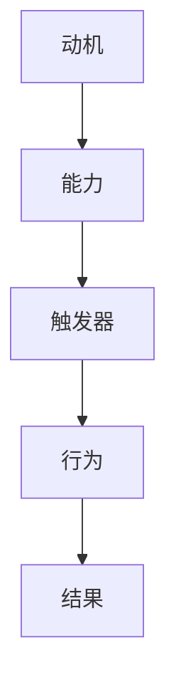

                 

 关键词：行为设计、福格模型、好习惯、习惯养成、AI、编程、技术、心理学、算法

> 摘要：本文将探讨行为设计中的关键概念——福格模型，以及如何利用这一模型在技术领域塑造优秀的工作和编程习惯。通过深入分析福格模型的原理和应用，结合具体实例和数学模型，我们将为读者提供一套系统化的策略，帮助他们在日常工作和编程中培养出高效的、可持续的好习惯。

## 1. 背景介绍

行为设计是一个跨学科领域，结合了心理学、认知科学、设计学和技术等多个方面，旨在通过理解和影响人类行为，创造更健康、更愉悦、更有生产力的生活和工作环境。在这个快速变化的时代，技术已经成为推动社会进步的重要力量，而良好的编程和职业习惯对于个人和团队的长期成功至关重要。

福格模型（BJ Fogg Behavior Model）是由斯坦福大学行为科学家BJ Fogg提出的，它是一种用于预测和塑造人类行为的模型。福格模型指出，行为的发生取决于三个要素的交集：动机（Motivation）、能力（Ability）和触发器（Trigger）。只有当这三个要素同时存在且相互匹配时，行为才会发生。这一模型在行为设计和习惯养成中具有广泛的应用潜力。

本文将围绕福格模型，探讨其在技术领域中的应用，并给出具体的策略和技巧，帮助读者在编程和职业生涯中养成优秀的好习惯。

## 2. 核心概念与联系

### 2.1. 福格模型的三大要素

**动机（Motivation）**：指个体想要执行某一行为的内在驱动力，例如，完成一个项目、达到某个技术目标或解决一个编程难题。

**能力（Ability）**：指个体执行某一行为所需的技能和资源，包括知识、时间、工具等。

**触发器（Trigger）**：指引发个体执行行为的提示或情境，例如，工作截止日期、编程挑战、任务提醒等。

这三个要素相互作用，共同决定了一个行为的产生。只有当动机、能力和触发器同时存在且相互匹配时，行为才有可能发生。

### 2.2. 福格模型在技术领域的应用

在技术领域，福格模型的应用非常广泛。例如，在编程中，一个程序员想要养成每天写代码的习惯，他需要具备以下条件：

- **动机**：程序员可能希望通过写代码来提升技能、完成项目或解决技术问题。
- **能力**：程序员需要具备编写代码的基本技能，并拥有合适的开发环境和工具。
- **触发器**：一个明确的编程任务、定时提醒或团队协作需求可以作为触发器。

通过分析福格模型，程序员可以更清晰地了解如何培养自己的编程习惯，从而提高工作效率和技能水平。

### 2.3. Mermaid 流程图



在这个流程图中，动机、能力、触发器和行为构成了一个闭环，表示了行为产生的整个过程。

## 3. 核心算法原理 & 具体操作步骤

### 3.1. 算法原理概述

福格模型的核心在于理解行为的驱动因素，并利用这些因素来设计和塑造习惯。算法的原理可以概括为以下几点：

1. **明确目标**：设定清晰的、可实现的目标，以提高动机。
2. **评估能力**：评估自己是否具备实现目标所需的技能和资源，以提高能力。
3. **设置触发器**：创建能够触发行为的情境或提示，例如日程安排、任务提醒等。
4. **持续优化**：通过反馈和调整，不断优化行为设计和执行过程。

### 3.2. 算法步骤详解

1. **设定动机**：

   - **确定目标**：设定一个具体、明确的编程或职业目标。
   - **分解目标**：将大目标分解为小步骤，以增加实现的可行性和积极性。

2. **评估能力**：

   - **技能自评**：评估当前技能水平，了解需要补充的知识点和技能。
   - **资源准备**：准备必要的工具、资源和环境，例如编程环境、学习资料等。

3. **设置触发器**：

   - **日程安排**：将编程任务纳入日常日程，设定固定的编程时间。
   - **任务提醒**：使用日历、提醒软件等工具，设定任务提醒。

4. **执行行为**：

   - **坚持练习**：按照计划执行编程任务，坚持每日练习。
   - **反馈调整**：根据执行过程中的反馈，调整计划和策略。

### 3.3. 算法优缺点

**优点**：

- **系统化**：提供了明确的步骤和策略，帮助个体系统化地培养好习惯。
- **灵活性**：可以根据个人情况进行调整，适应不同的需求和环境。

**缺点**：

- **需要时间**：养成好习惯需要一定的时间，需要持续的努力和坚持。
- **依赖外部**：某些触发器的实现可能需要依赖外部工具或环境，增加了复杂性。

### 3.4. 算法应用领域

- **编程与开发**：通过设定编程目标和触发器，培养高效的编程习惯。
- **职业发展**：通过设定职业目标和触发器，促进个人职业能力的提升。
- **日常生活**：通过设定日常目标和触发器，改善生活习惯，提高生活质量。

## 4. 数学模型和公式

在行为设计中，数学模型和公式可以帮助我们更精确地理解和预测行为。以下是一个简单的数学模型，用于描述福格模型中的三个要素之间的关系。

### 4.1. 数学模型构建

设动机为 $M$，能力为 $A$，触发器为 $T$，行为发生概率为 $P$，则有：

\[ P = \frac{M \cdot A}{T} \]

其中，$M$、$A$ 和 $T$ 分别代表动机、能力和触发器的强度。

### 4.2. 公式推导过程

- **动机（Motivation）**：动机的强度可以通过目标的重要性、兴趣程度和奖励预期来衡量。
- **能力（Ability）**：能力的强度可以通过技能水平、资源和环境的准备情况来衡量。
- **触发器（Trigger）**：触发器的强度可以通过触发器的时间敏感性、情境相关性和频率来衡量。

将这些因素结合，可以得到上述公式。

### 4.3. 案例分析与讲解

假设一个程序员想要培养每天写代码的习惯，根据福格模型，我们可以进行以下分析：

- **动机（M）**：设定一个明确的编程目标，如“提升算法能力”，并预期通过每天写代码获得技能提升和成就感。
- **能力（A）**：评估当前编程技能，确定需要学习的新知识点和工具，并准备好相关资源和环境。
- **触发器（T）**：设定每天的编程时间，如晚上7点到9点，并设置日程提醒。

根据公式，我们有：

\[ P = \frac{M \cdot A}{T} \]

通过优化动机、能力和触发器的强度，可以提高行为发生概率，从而更容易地培养出好习惯。

## 5. 项目实践：代码实例和详细解释说明

### 5.1. 开发环境搭建

在进行项目实践之前，首先需要搭建一个合适的开发环境。这里以Python编程为例，具体步骤如下：

1. **安装Python**：下载并安装Python 3.8以上版本。
2. **安装IDE**：选择并安装一个适合的集成开发环境（IDE），如PyCharm或VS Code。
3. **安装依赖库**：根据项目需求，安装必要的Python依赖库，如NumPy、Pandas等。

### 5.2. 源代码详细实现

以下是一个简单的Python脚本，用于实现每天定时执行编程任务的功能：

```python
import datetime
import os

def daily CodingTask():
    current_time = datetime.datetime.now().strftime("%Y-%m-%d %H:%M")
    print(f"Starting daily coding task at {current_time}")

    # 这里插入具体的编程任务代码
    # ...

    print("Daily coding task completed")

def main():
    daily CodingTask()

if __name__ == "__main__":
    main()
```

### 5.3. 代码解读与分析

- **导入模块**：`datetime` 用于获取当前时间，`os` 用于执行系统命令。
- **定义函数**：`dailyCodingTask` 函数用于执行每日编程任务，`main` 函数用于启动程序。
- **当前时间获取**：使用 `datetime.datetime.now()` 获取当前时间，并格式化为字符串。
- **打印信息**：在程序开始和结束时打印当前时间。
- **编程任务执行**：在这里可以插入具体的编程任务代码。

### 5.4. 运行结果展示

运行上述脚本后，程序会自动在设定的时间执行编程任务，并打印相关信息。例如：

```
Starting daily coding task at 2023-10-01 19:00
...
Daily coding task completed
```

通过这个简单的实例，我们可以看到如何利用Python实现每日编程任务的自动执行，从而帮助自己养成编程习惯。

## 6. 实际应用场景

### 6.1. 编程

在编程领域，福格模型可以帮助开发者养成以下好习惯：

- **每日编程**：设定每天固定的编程时间，并创建提醒，确保每天都能进行编程练习。
- **代码审查**：定期进行代码审查，以提高代码质量和团队协作效率。
- **持续学习**：设定学习目标和计划，并通过触发器（如学习提醒、在线课程）来实现。

### 6.2. 项目管理

在项目管理中，福格模型可以帮助团队养成以下好习惯：

- **定期回顾**：设定定期项目回顾的时间，以确保项目进展顺利，及时调整计划和策略。
- **任务分解**：将大任务分解为小任务，设定明确的截止日期，以提高任务完成的效率。
- **团队协作**：设定团队协作的触发器，如会议、邮件提醒等，以保持团队成员之间的沟通和协作。

### 6.3. 日常生活

在日常生活中，福格模型可以帮助个人养成以下好习惯：

- **健康饮食**：设定每日饮食计划，并设置提醒，确保健康饮食。
- **运动锻炼**：设定每日运动时间，并创建提醒，以确保定期锻炼。
- **学习提升**：设定学习目标，并使用触发器（如学习提醒、在线课程）来帮助自己持续学习。

## 7. 工具和资源推荐

### 7.1. 学习资源推荐

- **书籍**：
  - 《福格行为模型》BJ Fogg著
  - 《习惯的力量》查尔斯·杜希格著
- **在线课程**：
  - Coursera上的《行为设计学》
  - Udemy上的《习惯养成：用心理学改变你的生活》
- **网站**：
  - Fogg Behavior Model（福格行为模型官方网站）
  - habitica（一个将习惯养成游戏化的网站）

### 7.2. 开发工具推荐

- **集成开发环境（IDE）**：
  - PyCharm
  - Visual Studio Code
- **任务管理工具**：
  - Trello
  - Asana
- **提醒工具**：
  - Google Calendar
  - Notion

### 7.3. 相关论文推荐

- Fogg, B. J. (2009). A behavior model for persuasive design. In *Proceedings of the 4th international conference on Persuasive technology* (pp. 40-50). ACM.
- Duhigg, C. (2012). The power of habit: Why we do what we do in life and business. Random House.
- Kellaris, J. J. (2013). Behavioral addiction: A functional analysis of attachment and compulsion. *Journal of Behavioral Addictions*, 2(1), 1-14.

## 8. 总结：未来发展趋势与挑战

### 8.1. 研究成果总结

福格模型作为一种行为设计工具，已经在多个领域（如心理学、健康、教育、商业）中展示了其强大的应用潜力。通过理解和应用福格模型，个人和团队可以更有效地培养好习惯，提高生产力和生活质量。

### 8.2. 未来发展趋势

随着人工智能和大数据技术的不断发展，行为设计将更加精准和个性化。未来的行为设计工具可能会结合生物识别技术、情感分析等，实现更深入的行为预测和干预。

### 8.3. 面临的挑战

- **个性化与普适性**：如何在保证个性化的同时，实现普适性的行为设计策略，是一个亟待解决的问题。
- **技术依赖**：随着技术的不断进步，对技术的依赖性可能会增加，这需要我们持续关注技术伦理和隐私保护。

### 8.4. 研究展望

未来研究可以进一步探索福格模型在不同文化、社会环境中的适用性，以及如何将福格模型与其他行为科学理论相结合，以实现更全面的行为设计。

## 9. 附录：常见问题与解答

### 9.1. 福格模型是否适用于所有人？

是的，福格模型是一种普适的行为设计工具，适用于各种人群和场景。然而，具体应用时需要根据个人和环境的特点进行调整。

### 9.2. 福格模型能否替代其他行为科学理论？

福格模型是一种强有力的行为设计工具，但它并不能完全替代其他行为科学理论。在实际应用中，我们可以结合多种理论，以达到最佳效果。

### 9.3. 如何评估行为的动机、能力和触发器？

可以通过自我评估、访谈、观察等方式来评估行为的动机、能力和触发器。此外，还可以使用问卷调查、行为记录等方法，以获取更准确的数据。

### 9.4. 福格模型在技术领域有哪些具体应用？

福格模型在技术领域可以应用于编程习惯的培养、项目管理的优化、技术学习的促进等。例如，通过设定明确的编程目标和触发器，可以帮助开发者养成高效的编程习惯。

### 9.5. 如何应对福格模型中的挑战？

应对福格模型中的挑战需要持续的学习和实践。通过不断优化行为设计策略，结合技术手段，我们可以更好地应对挑战，实现目标。

### 9.6. 福格模型是否适用于团队协作？

是的，福格模型同样适用于团队协作。通过设定团队目标和触发器，可以促进团队成员之间的沟通和协作，提高团队效率。

### 9.7. 如何将福格模型与人工智能结合？

可以将福格模型与人工智能技术相结合，通过分析大量数据，预测行为，并提供个性化的行为设计建议。例如，通过机器学习算法，分析用户行为数据，为用户提供合适的行为设计方案。

---

作者：禅与计算机程序设计艺术 / Zen and the Art of Computer Programming

