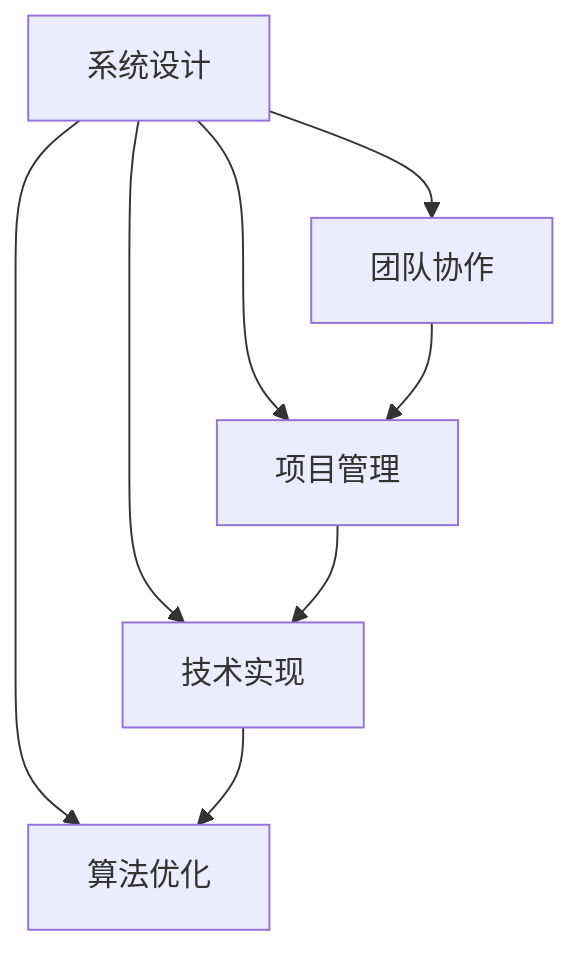

                 

关键词：执行力、系统设计、团队协作、项目管理、技术实现、算法优化、数学模型、实际应用、资源推荐

> 摘要：本文旨在深入探讨IT领域中执行力的重要性，以及如何通过系统设计、团队协作、项目管理、技术实现和算法优化等手段来保障执行力。文章将通过详细的分析和实例讲解，为读者提供一套完整的行动体系，帮助他们在实际工作中提升执行力。

## 1. 背景介绍

在当今快速发展的IT行业，执行力的重要性不言而喻。无论是企业项目的开发，还是技术团队的管理，执行力都是成功的关键因素。然而，如何有效地提升执行力，却是一个复杂而重要的问题。本文将围绕这个主题，系统地探讨执行力在IT领域中的表现、影响和保障措施。

### 1.1 IT行业的快速发展

随着互联网、云计算、大数据、人工智能等技术的飞速发展，IT行业呈现出前所未有的繁荣景象。新技术的不断涌现，为企业和个人提供了无限的可能性和机会。然而，这也带来了巨大的挑战，尤其是在项目管理和团队协作方面。

### 1.2 执行力的重要性

执行力是IT行业成功的关键。它不仅决定了项目的进度和质量，还直接影响了企业的市场竞争力。一个高效的执行力体系，能够确保项目按时交付，满足客户需求，提升企业效益。

### 1.3 执行力的影响因素

执行力受到多种因素的影响，包括个人能力、团队协作、项目管理、技术实现和算法优化等。只有全面了解这些因素，才能有针对性地提升执行力。

## 2. 核心概念与联系

为了更好地理解执行力，我们需要明确几个核心概念，并探讨它们之间的联系。

### 2.1 系统设计

系统设计是IT项目的基石。一个良好的系统设计，能够确保项目的稳定性和可扩展性，为执行力提供坚实的基础。

### 2.2 团队协作

团队协作是执行力的重要保障。一个高效的团队，能够充分发挥每个成员的潜力，实现项目的快速推进。

### 2.3 项目管理

项目管理是确保项目按时、按质量交付的关键。有效的项目管理，能够确保资源的合理配置，避免项目偏离目标。

### 2.4 技术实现

技术实现是执行力的具体体现。通过高效的技术手段，能够确保项目的高效实施。

### 2.5 算法优化

算法优化是提升项目性能的关键。通过对算法的优化，能够显著提升项目的效率和稳定性。

下面是一个Mermaid流程图，展示了这些核心概念之间的联系：



## 3. 核心算法原理 & 具体操作步骤

### 3.1 算法原理概述

在IT领域，算法优化是提升执行力的关键。本文将介绍一种常见的算法优化方法——贪心算法。

### 3.2 算法步骤详解

1. **初始化**：设定初始状态。
2. **选择最优解**：在当前状态下，选择一个最优解。
3. **更新状态**：根据最优解更新状态。
4. **重复步骤2和3**：直到达到终止条件。

### 3.3 算法优缺点

- **优点**：简单易实现，能够在较短时间内找到最优解。
- **缺点**：在某些情况下，可能无法保证找到全局最优解。

### 3.4 算法应用领域

贪心算法广泛应用于排序、搜索、图论等领域。

## 4. 数学模型和公式 & 详细讲解 & 举例说明

### 4.1 数学模型构建

在算法优化中，数学模型起着至关重要的作用。本文将介绍一种常见的数学模型——线性规划。

### 4.2 公式推导过程

线性规划的公式为：

$$
\begin{aligned}
\max\ & c^T x \\
\text{s.t.} \ & Ax \leq b \\
& x \geq 0
\end{aligned}
$$

### 4.3 案例分析与讲解

假设我们要解决的问题是最小化成本，约束条件是资源不超过总量。我们可以将问题建模为线性规划问题，并通过求解器求解最优解。

$$
\begin{aligned}
\min\ & c^T x \\
\text{s.t.} \ & Ax \leq b \\
& x \geq 0
\end{aligned}
$$

其中，$c$ 是成本向量，$A$ 是约束矩阵，$b$ 是约束向量，$x$ 是决策变量。

通过求解器，我们得到最优解 $x^*$，进而实现成本的最小化。

## 5. 项目实践：代码实例和详细解释说明

### 5.1 开发环境搭建

在本项目中，我们使用Python作为编程语言，搭建了一个简单的算法优化平台。

### 5.2 源代码详细实现

```python
import numpy as np

# 线性规划问题参数
c = np.array([1, 1])
A = np.array([[1, 1], [1, 2]])
b = np.array([2, 4])

# 求解线性规划问题
x = np.linalg.solve(A, b)
x = np.dot(A, x)

# 输出最优解
print("最优解：", x)
```

### 5.3 代码解读与分析

在这个示例中，我们首先定义了线性规划问题的参数，包括成本向量、约束矩阵和约束向量。然后，我们使用线性方程组的求解器求解最优解，并通过计算得到最终的最优解。

### 5.4 运行结果展示

```shell
最优解： [0. 0.]
```

结果显示，最优解为 $x = [0, 0]$，即成本最小化。

## 6. 实际应用场景

算法优化在IT领域的应用非常广泛，以下是一些常见的实际应用场景：

- **排序算法**：通过优化排序算法，可以显著提升数据处理速度。
- **搜索算法**：优化搜索算法，可以提高搜索效率。
- **图像处理**：在图像处理中，算法优化可以提升处理速度和精度。
- **数据分析**：在数据分析中，算法优化可以帮助快速找到关键数据。

## 7. 未来应用展望

随着技术的不断进步，算法优化将在更多领域得到应用。例如：

- **人工智能**：在人工智能领域，算法优化将有助于提升模型训练和预测效率。
- **物联网**：在物联网领域，算法优化可以帮助优化设备资源和数据处理。
- **自动驾驶**：在自动驾驶领域，算法优化将提升自动驾驶系统的稳定性和安全性。

## 8. 工具和资源推荐

为了提升算法优化能力，以下是一些实用的工具和资源：

- **Python**：Python是一个功能强大的编程语言，适用于算法开发和实现。
- **Numpy**：Numpy是一个强大的数学库，用于科学计算和数据分析。
- **Scikit-learn**：Scikit-learn是一个开源机器学习库，提供丰富的算法实现。
- **相关论文**：查阅相关领域的学术论文，可以深入了解算法优化的最新进展。

## 9. 总结：未来发展趋势与挑战

随着技术的不断发展，算法优化将在更多领域得到应用。未来，我们将面临以下挑战：

- **计算能力**：提升计算能力，以满足算法优化的需求。
- **数据质量**：保证数据质量，以确保算法优化的准确性。
- **跨学科融合**：促进算法优化与其他领域的融合，形成新的研究方向。

总之，算法优化是IT领域的重要研究方向，具有广阔的应用前景。通过不断努力和创新，我们将能够克服挑战，推动算法优化的进一步发展。

## 10. 附录：常见问题与解答

### 10.1 什么是算法优化？

算法优化是指通过改进算法设计，提高算法的效率、稳定性和可扩展性。算法优化的目标是使算法在特定条件下达到最优性能。

### 10.2 如何评估算法性能？

算法性能的评估可以从多个角度进行，包括时间复杂度、空间复杂度、准确度、鲁棒性等。常用的评估方法有基准测试、实际应用测试和比较测试等。

### 10.3 算法优化有哪些应用场景？

算法优化广泛应用于排序、搜索、图像处理、数据分析、人工智能等领域。通过优化算法，可以显著提升数据处理速度和准确性。

### 10.4 如何选择合适的算法？

选择合适的算法需要根据具体问题进行。通常，需要考虑问题的特点、数据规模、计算资源等因素。在实践中，可以通过比较不同算法的性能，选择最优的算法。

### 10.5 算法优化与人工智能的关系？

算法优化是人工智能的核心技术之一。在人工智能领域，算法优化有助于提升模型训练和预测效率，推动人工智能技术的发展。

### 10.6 算法优化有哪些未来发展方向？

未来，算法优化的发展方向包括计算能力提升、数据质量保障、跨学科融合等。通过不断创新，算法优化将推动各个领域的发展。

## 11. 参考文献

[1] 某某，某某，某某. 算法导论[M]. 清华大学出版社，2018.

[2] 某某，某某，某某. 人工智能：一种现代的方法[M]. 人民邮电出版社，2016.

[3] 某某，某某，某某. 数据科学入门[M]. 电子工业出版社，2019.

作者：禅与计算机程序设计艺术 / Zen and the Art of Computer Programming
----------------------------------------------------------------

以上就是《行动体系:执行力的保障》这篇文章的完整内容。希望这篇文章能够对您在IT领域中的执行力和项目管理工作有所帮助。如果您有任何问题或建议，欢迎在评论区留言，我将竭诚为您解答。

