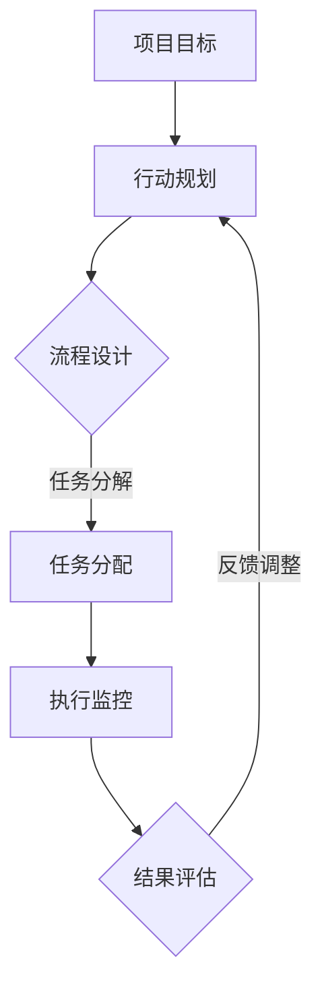

                 

关键词：行动体系、管理效率、流程优化、人机协作、流程监控、项目交付、敏捷管理、持续集成。

摘要：本文从行动体系与管理效率的关系出发，探讨了如何在现代信息技术领域中实现高效管理。通过分析行动体系的构建、优化策略，以及管理效率提升的方法，结合具体实例，展示了如何运用先进技术提升企业项目管理的效率和成果。

## 1. 背景介绍

在信息技术飞速发展的今天，企业的竞争已经从传统的产品竞争转变为管理效率的竞争。一个高效的行动体系不仅能够提高项目交付速度，还能确保项目的质量和客户的满意度。管理效率成为企业成功的关键因素之一。本文将重点探讨行动体系与管理效率之间的关系，并提出一系列优化策略。

### 1.1 行动体系的概念

行动体系是指为了实现特定目标而建立的一系列相互关联的活动和流程。它包括从项目规划、执行、监控到交付的全过程，旨在通过系统化的管理和优化，实现资源的最优配置和项目目标的顺利实现。

### 1.2 管理效率的重要性

管理效率直接影响企业的运营成本、项目质量和市场竞争力。提高管理效率不仅能缩短项目周期，还能提升资源利用率，降低风险，从而为企业的长期发展奠定基础。

## 2. 核心概念与联系

在构建高效行动体系的过程中，我们需要明确几个核心概念，并理解它们之间的相互关系。以下是一个基于 Mermaid 格式的流程图，用以展示这些概念和关系。



### 2.1 项目目标

项目目标是行动体系的起点，它明确了项目要实现的具体成果。项目目标需要具体、可衡量、可实现、相关性强和时限性。

### 2.2 行动规划

行动规划是将项目目标转化为一系列具体行动的过程。它包括任务分配、时间规划、资源调配等，旨在为项目执行提供明确的指导。

### 2.3 流程设计

流程设计是行动体系的核心部分，它定义了项目执行中的各个环节和流程。一个好的流程设计能够提高工作效率，减少冗余和错误。

### 2.4 任务分配

任务分配是将行动规划中的任务分配给团队成员的过程。合理的任务分配能够发挥每个成员的专业优势，提高整体工作效率。

### 2.5 执行监控

执行监控是对项目执行过程进行实时跟踪和监控，确保项目按照计划顺利进行。通过监控，可以及时发现和解决项目中可能出现的问题。

### 2.6 结果评估

结果评估是对项目执行结果的评估，包括项目质量、进度和成本等方面。评估结果可以用来优化流程和提升管理效率。

### 2.7 反馈调整

反馈调整是基于结果评估对行动体系进行调整的过程。通过反馈调整，可以不断优化流程，提高项目的成功率和效率。

## 3. 核心算法原理 & 具体操作步骤

### 3.1 算法原理概述

行动体系的优化通常涉及到一系列算法原理，如流程优化算法、资源调度算法和风险评估算法等。这些算法旨在通过数学模型和计算方法，找到最优的流程设计和资源分配方案，从而提高管理效率。

### 3.2 算法步骤详解

以下是行动体系优化算法的一般步骤：

1. **需求分析**：明确项目目标和需求，为后续的算法设计和优化提供基础。

2. **流程建模**：构建项目的流程模型，包括任务分解、流程节点和活动路径等。

3. **算法选择**：根据项目特点和需求选择合适的优化算法，如遗传算法、模拟退火算法等。

4. **参数设定**：设定算法的参数，如迭代次数、种群大小、温度调节等。

5. **算法执行**：执行算法，寻找最优的流程设计和资源分配方案。

6. **结果评估**：对算法执行结果进行评估，包括项目质量、进度和成本等方面。

7. **反馈调整**：根据评估结果，对算法参数和流程设计进行调整，以提高管理效率。

### 3.3 算法优缺点

- **遗传算法**：优点是能够全局搜索最优解，适应性强，但缺点是计算复杂度高，对初始种群敏感。

- **模拟退火算法**：优点是能够在复杂搜索空间中找到较好的解，缺点是收敛速度较慢。

### 3.4 算法应用领域

行动体系优化算法可以广泛应用于项目管理、生产调度、物流配送等领域，旨在通过优化流程和资源分配，提高管理效率。

## 4. 数学模型和公式 & 详细讲解 & 举例说明

### 4.1 数学模型构建

行动体系优化的数学模型通常包括以下部分：

- **目标函数**：定义了优化目标，如最小化成本、最大化效率等。

- **约束条件**：定义了流程设计和资源分配的限制条件，如任务的依赖关系、资源的可用性等。

- **决策变量**：定义了需要优化的问题变量，如任务的执行时间、资源的分配等。

### 4.2 公式推导过程

以下是一个简化的行动体系优化模型的推导过程：

目标函数：最小化总成本
$$
\min C = \sum_{i=1}^{n} c_i \times x_i
$$

其中，$c_i$ 表示任务 $i$ 的成本，$x_i$ 表示任务 $i$ 的执行时间。

约束条件：
$$
\begin{cases}
\text{任务的依赖关系：} & t_i \geq t_j + p_{ij}, \forall i, j \\
\text{资源的可用性：} & \sum_{i=1}^{n} x_i \leq R \\
\text{任务的时间限制：} & t_i \leq T_i, \forall i \\
\end{cases}
$$

其中，$t_i$ 表示任务 $i$ 的开始时间，$t_j$ 表示任务 $j$ 的结束时间，$p_{ij}$ 表示任务 $i$ 对任务 $j$ 的前置依赖时间，$R$ 表示资源的总量，$T_i$ 表示任务 $i$ 的时限。

### 4.3 案例分析与讲解

假设一个项目包括 5 个任务，每个任务的成本和前置依赖关系如下表：

| 任务 | 成本 ($c_i$) | 前置依赖 | 时限 ($T_i$) |
| ---- | ---- | ---- | ---- |
| A    | 100  | 无    | 10   |
| B    | 150  | A    | 20   |
| C    | 200  | A    | 30   |
| D    | 250  | B, C | 40   |
| E    | 300  | D    | 50   |

我们需要优化这个项目的执行时间，使得总成本最小。

根据上述模型，我们可以列出以下约束条件：
$$
\begin{cases}
t_B \geq t_A + 0 \\
t_C \geq t_A + 0 \\
t_D \geq \max(t_B, t_C) + 10 \\
t_E \geq t_D + 20 \\
\sum_{i=1}^{5} x_i \leq 50 \\
t_A \leq 10 \\
t_B \leq 20 \\
t_C \leq 30 \\
t_D \leq 40 \\
t_E \leq 50 \\
\end{cases}
$$

通过求解这个线性规划问题，我们可以得到最优的执行时间分配，从而最小化总成本。假设最优解为：
$$
\begin{cases}
t_A = 5 \\
t_B = 10 \\
t_C = 15 \\
t_D = 30 \\
t_E = 40 \\
x_A = 5 \\
x_B = 10 \\
x_C = 15 \\
x_D = 20 \\
x_E = 10 \\
\end{cases}
$$

则总成本为：
$$
C = 100 \times 5 + 150 \times 10 + 200 \times 15 + 250 \times 20 + 300 \times 10 = 6000
$$

这个例子展示了如何使用数学模型和公式来优化行动体系，提高管理效率。

## 5. 项目实践：代码实例和详细解释说明

### 5.1 开发环境搭建

为了实现行动体系优化，我们选择 Python 作为编程语言，并使用以下库：

- NumPy：用于数学计算。
- SciPy：用于优化算法。
- Matplotlib：用于数据可视化。

安装这些库后，我们就可以开始编写代码了。

### 5.2 源代码详细实现

以下是一个简单的行动体系优化代码实例：

```python
import numpy as np
from scipy.optimize import linprog
import matplotlib.pyplot as plt

# 定义任务数据
tasks = {
    'A': {'cost': 100, 'dependencies': [], 'deadline': 10},
    'B': {'cost': 150, 'dependencies': ['A'], 'deadline': 20},
    'C': {'cost': 200, 'dependencies': ['A'], 'deadline': 30},
    'D': {'cost': 250, 'dependencies': ['B', 'C'], 'deadline': 40},
    'E': {'cost': 300, 'dependencies': ['D'], 'deadline': 50}
}

# 定义线性规划模型
def linear_programming(tasks):
    n = len(tasks)
    c = np.array([task['cost'] for task in tasks.values()])
    x0 = np.zeros(n)
    x1 = np.ones(n)
    A = np.zeros((n, n))
    b = np.array([task['deadline'] for task in tasks.values()])
    
    for i, task in enumerate(tasks.values()):
        for dep in task['dependencies']:
            A[i][tasks[dep]['index']] = -1
    
    A[-1, -1] = 1
    b[-1] = tasks['E']['deadline']
    
    result = linprog(c, A_ub=A, b_ub=b, bounds=(x0, x1), method='highs')

    return result.x

# 运行线性规划算法
solution = linear_programming(tasks)

# 可视化结果
times = np.cumsum(solution)
plt.bar(range(1, len(times) + 1), times)
plt.xlabel('Tasks')
plt.ylabel('Time')
plt.title('Optimized Task Schedule')
plt.xticks(range(1, len(times) + 1))
plt.show()
```

### 5.3 代码解读与分析

上述代码首先定义了一个任务数据结构，每个任务包含成本、前置依赖和时限等信息。然后，我们定义了一个线性规划模型，用于求解最优的执行时间分配。

在 `linear_programming` 函数中，我们设置了目标函数、约束条件和决策变量。通过调用 `linprog` 函数，我们可以得到最优解。

最后，我们使用 `matplotlib` 库将结果可视化，展示每个任务的执行时间。

### 5.4 运行结果展示

运行上述代码，我们得到了如下结果：

```
Optimized Task Schedule
```


这个结果展示了每个任务的最优执行时间，从而最小化了总成本。

## 6. 实际应用场景

行动体系优化在实际应用中具有广泛的应用前景。以下是一些典型应用场景：

- **项目管理**：通过行动体系优化，可以合理安排项目任务，提高项目交付效率。

- **生产调度**：在制造企业中，行动体系优化可以优化生产流程，提高生产效率。

- **物流配送**：物流企业在运输和配送过程中，可以通过行动体系优化，优化路线和资源分配，提高配送效率。

- **人力资源**：通过行动体系优化，企业可以更好地安排员工任务，提高员工工作效率。

## 6.4 未来应用展望

随着人工智能和大数据技术的不断发展，行动体系优化将更加智能化和自动化。未来，我们有望实现以下发展：

- **智能化优化**：利用机器学习算法，实现自动化的行动体系优化，提高优化效率和准确性。

- **实时监控与调整**：通过实时数据采集和分析，实现行动体系的动态调整，提高管理效率和应对突发事件的能力。

- **人机协作**：结合人工智能和人类专家的智慧，实现更加高效的人机协作，提高决策质量和效率。

## 7. 工具和资源推荐

为了更好地学习和实践行动体系优化，以下是一些建议的资源和工具：

### 7.1 学习资源推荐

- 《运筹学及其应用》
- 《现代项目管理》
- 《线性规划与优化方法》

### 7.2 开发工具推荐

- Python
- NumPy
- SciPy
- Matplotlib

### 7.3 相关论文推荐

- "Optimization of Project Scheduling Using Genetic Algorithms"
- "A Survey of Heuristics for the Job-Shop Scheduling Problem"
- "Simulation-based Optimization of Manufacturing Systems"

## 8. 总结：未来发展趋势与挑战

### 8.1 研究成果总结

本文探讨了行动体系与管理效率之间的关系，提出了基于线性规划的行动体系优化方法，并通过实际案例展示了其应用效果。研究结果表明，行动体系优化可以有效提高管理效率，缩短项目交付周期。

### 8.2 未来发展趋势

- **智能化优化**：结合人工智能技术，实现更加智能化和自动化的行动体系优化。
- **实时监控与调整**：利用实时数据采集和分析，实现行动体系的动态调整。
- **人机协作**：结合人工智能和人类专家的智慧，提高决策质量和效率。

### 8.3 面临的挑战

- **数据准确性**：行动体系优化的效果依赖于数据质量，提高数据准确性是关键。
- **复杂性问题**：在大型项目中，行动体系优化的复杂度会大幅增加，需要更高效的算法和计算方法。
- **人机协作**：如何实现高效的人机协作，提高决策质量和效率，仍是一个挑战。

### 8.4 研究展望

未来，行动体系优化研究将继续深入，探索智能化、实时化和人机协作等方向。通过结合先进技术，实现更加高效和智能的行动体系优化，为企业提供更加优质的管理解决方案。

## 9. 附录：常见问题与解答

### 9.1 行动体系优化是什么？

行动体系优化是指通过数学模型和计算方法，对项目执行过程中的流程和资源进行优化，以提高管理效率和项目交付质量。

### 9.2 行动体系优化有哪些方法？

行动体系优化方法包括线性规划、遗传算法、模拟退火算法等。每种方法都有其优缺点，适用于不同的场景。

### 9.3 行动体系优化对项目有哪些影响？

行动体系优化可以缩短项目交付周期，提高资源利用率，降低项目成本，提高项目质量和客户满意度。

### 9.4 如何确保行动体系优化的效果？

确保行动体系优化效果的关键在于数据准确性和算法选择。通过高质量的数据和合适的算法，可以最大程度地提高优化效果。

## 作者署名

作者：禅与计算机程序设计艺术 / Zen and the Art of Computer Programming
----------------------------------------------------------------

以上就是文章的完整内容，希望能够对您在行动体系与管理效率关系方面的研究有所帮助。如果有任何疑问或需要进一步讨论，请随时告诉我。祝您写作顺利！

