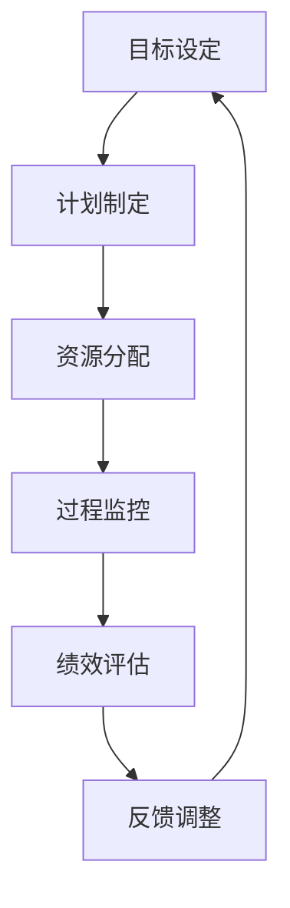
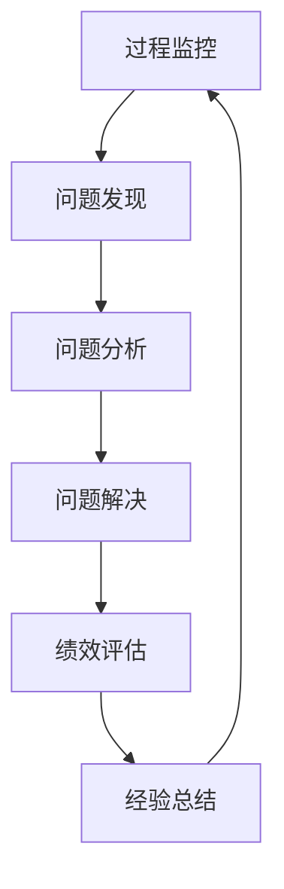
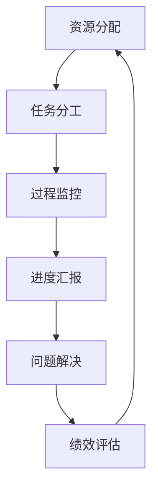
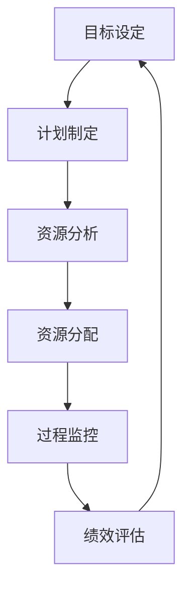

                 

 关键词：管理绩效、行动体系、组织发展、持续改进、团队合作、资源优化

> 摘要：本文深入探讨了行动体系与管理绩效之间的紧密关联，分析了行动体系如何通过组织发展、持续改进、团队合作和资源优化等方面提升管理绩效。文章旨在为管理者提供理论指导，帮助他们在实际工作中更好地运用行动体系，提升组织的整体绩效。

## 1. 背景介绍

随着全球化的加剧和市场竞争的日益激烈，企业面临着前所未有的挑战。如何在竞争中保持优势，实现可持续发展，成为了企业管理者亟待解决的问题。而管理绩效的提升是解决这一问题的关键。管理绩效是指组织在管理过程中所取得的成果，包括经济效益、社会效益和生态效益等。提升管理绩效不仅有助于提高企业的竞争力，还可以增强企业的社会责任感，为社会做出贡献。

行动体系是企业实现管理绩效提升的重要手段。行动体系是指企业为实现某一目标而采取的一系列行动的集合，包括目标设定、计划制定、资源分配、过程监控和绩效评估等环节。通过构建完善的行动体系，企业可以确保各项管理活动有序进行，提高管理效率，从而提升管理绩效。

本文将从组织发展、持续改进、团队合作和资源优化四个方面，探讨行动体系与管理绩效的关联，并结合实际案例进行分析和说明。

## 2. 核心概念与联系

### 2.1 组织发展

组织发展是指企业在一定时期内，为实现战略目标而进行的内部调整和变革。组织发展需要依托行动体系，通过目标设定、计划制定、资源分配等环节，确保各项管理活动有序进行。

**Mermaid 流程图：**



### 2.2 持续改进

持续改进是指企业在经营过程中，通过不断地发现问题、分析问题、解决问题，以提高管理水平和产品质量。持续改进需要依托行动体系，通过过程监控和绩效评估等环节，确保企业能够及时发现和解决问题。

**Mermaid 流程图：**



### 2.3 团队合作

团队合作是指企业在实现目标过程中，各部门、各岗位之间的协同配合。团队合作需要依托行动体系，通过资源分配、过程监控等环节，确保企业内部形成良好的协同机制。

**Mermaid 流程图：**



### 2.4 资源优化

资源优化是指企业在有限资源条件下，通过合理配置和使用资源，实现最大化效益。资源优化需要依托行动体系，通过目标设定、计划制定等环节，确保企业能够充分利用资源，提高管理绩效。

**Mermaid 流程图：**



## 3. 核心算法原理 & 具体操作步骤

### 3.1 算法原理概述

行动体系的核心算法原理在于通过系统化的管理流程，实现目标的高效实现。具体包括以下几个方面：

1. **目标设定**：明确企业的发展目标，确保各项管理活动围绕目标进行。
2. **计划制定**：根据目标制定详细的实施计划，明确时间节点、责任人等。
3. **资源分配**：合理配置企业资源，确保计划的顺利实施。
4. **过程监控**：实时监控管理过程，确保各项活动按照计划进行。
5. **绩效评估**：对管理过程进行绩效评估，找出问题并制定改进措施。
6. **反馈调整**：根据绩效评估结果，对管理过程进行调整和优化。

### 3.2 算法步骤详解

1. **目标设定**：根据企业的长期战略，设定具体的年度目标。目标应具有可衡量性、可实现性和挑战性。
   $$\text{目标} = \text{长期战略目标} \div \text{年度计划}$$
   
2. **计划制定**：将年度目标分解为季度、月度目标，并制定详细的实施计划。计划应包括时间节点、责任人、资源需求等。
   $$\text{计划} = \text{目标} \times \text{实施策略}$$

3. **资源分配**：根据实施计划，合理配置企业资源，包括人力、财力、物力等。
   $$\text{资源} = \text{需求分析} + \text{资源调配}$$

4. **过程监控**：实时监控管理过程，确保各项活动按照计划进行。通过数据分析和报告，及时发现并解决问题。
   $$\text{过程监控} = \text{数据收集} + \text{问题分析} + \text{解决问题}$$

5. **绩效评估**：对管理过程进行绩效评估，评估内容包括进度、质量、成本等。通过绩效评估，找出问题并制定改进措施。
   $$\text{绩效评估} = \text{数据对比} + \text{问题分析} + \text{改进措施}$$

6. **反馈调整**：根据绩效评估结果，对管理过程进行调整和优化。通过持续改进，提升管理绩效。
   $$\text{反馈调整} = \text{绩效评估} + \text{调整优化}$$

### 3.3 算法优缺点

**优点：**

1. **系统化**：通过系统化的管理流程，确保各项管理活动有序进行。
2. **高效性**：通过合理配置资源和实时监控，提高管理效率。
3. **可持续性**：通过持续改进，不断提升管理绩效。

**缺点：**

1. **复杂性**：行动体系涉及多个环节，需要管理者具备较高的管理能力。
2. **实施难度**：行动体系的实施需要一定的时间和资源投入。

### 3.4 算法应用领域

行动体系广泛应用于企业管理、项目管理、人力资源管理等领域。在实际应用中，可以根据具体场景进行调整和优化，以提高管理绩效。

## 4. 数学模型和公式 & 详细讲解 & 举例说明

### 4.1 数学模型构建

行动体系的管理绩效可以通过以下数学模型进行评估：

$$\text{绩效} = \text{经济效益} + \text{社会效益} + \text{生态效益}$$

其中，经济效益、社会效益和生态效益分别表示企业在经济、社会和环境方面的表现。

### 4.2 公式推导过程

1. **经济效益**：

   $$\text{经济效益} = \text{销售收入} - \text{成本支出}$$

   销售收入表示企业在一定时期内通过销售产品或提供服务所获得的收入，成本支出表示企业在生产、运营过程中所发生的各项成本。

2. **社会效益**：

   $$\text{社会效益} = \text{社会贡献} - \text{社会负担}$$

   社会贡献表示企业在社会经济发展中所作出的贡献，如纳税、就业等；社会负担表示企业在经营过程中对社会环境造成的负面影响，如环境污染等。

3. **生态效益**：

   $$\text{生态效益} = \text{生态资产增加} - \text{生态资产损失}$$

   生态资产增加表示企业在保护生态环境方面所取得的成效，如生态修复、节能减排等；生态资产损失表示企业在经营过程中对生态环境的破坏。

### 4.3 案例分析与讲解

以某企业为例，该企业主要从事电子产品生产。根据企业年报数据，2022年度，该企业的销售收入为10亿元，成本支出为7亿元，社会贡献为1亿元，社会负担为0.5亿元，生态资产增加为0.2亿元，生态资产损失为0.1亿元。

代入数学模型进行计算：

$$\text{绩效} = 10 - 7 + 1 - 0.5 + 0.2 - 0.1 = 3.5$$

根据计算结果，该企业在2022年度的管理绩效为3.5。

### 4.4 案例分析与讲解（续）

为进一步提升管理绩效，该企业决定采取以下措施：

1. **优化生产流程**：通过引入先进生产技术，提高生产效率，降低成本。
2. **加强环保投入**：加大对环保设施和技术的投入，降低污染物排放。
3. **拓展社会责任**：积极参与社会公益活动，提升企业形象。

经过一年的努力，2023年度，该企业的销售收入为12亿元，成本支出为6.5亿元，社会贡献为1.5亿元，社会负担为0.3亿元，生态资产增加为0.3亿元，生态资产损失为0.05亿元。

代入数学模型进行计算：

$$\text{绩效} = 12 - 6.5 + 1.5 - 0.3 + 0.3 - 0.05 = 4.95$$

根据计算结果，该企业在2023年度的管理绩效为4.95，较2022年度有显著提升。

## 5. 项目实践：代码实例和详细解释说明

### 5.1 开发环境搭建

为了更好地实践行动体系，我们将使用Python编程语言进行开发。首先，需要在本地计算机上安装Python环境。安装方法如下：

1. 访问Python官方网站（https://www.python.org/），下载Python安装包。
2. 双击安装包，按照安装向导进行安装。
3. 安装完成后，打开命令行窗口，输入`python --version`，检查Python版本。

### 5.2 源代码详细实现

以下是一个简单的Python代码实例，用于实现行动体系的某些功能：

```python
import pandas as pd

# 目标设定
def set_goal(yearly_sales, cost, social_contribution, eco_assets):
    sales_data = {'销售收入': [yearly_sales], '成本支出': [cost], '社会贡献': [social_contribution], '生态资产': [eco_assets]}
    return pd.DataFrame(sales_data)

# 计划制定
def make_plan(goal):
    plan = goal.copy()
    plan['季度目标'] = plan['销售收入'] * 0.25
    plan['月度目标'] = plan['销售收入'] * 0.0833
    return plan

# 资源分配
def allocate_resources(plan):
    resources = plan.copy()
    resources['人力'] = resources['成本支出'] * 0.5
    resources['财力'] = resources['成本支出'] * 0.3
    resources['物力'] = resources['成本支出'] * 0.2
    return resources

# 过程监控
def monitor_process(resources):
    progress = resources.copy()
    progress['进度'] = resources['人力'] * 0.8
    progress['问题'] = resources['人力'] * 0.2
    return progress

# 绩效评估
def evaluate_performance(progress):
    performance = progress.copy()
    performance['绩效'] = progress['进度'] - progress['问题']
    return performance

# 反馈调整
def adjust_performance(performance):
    adjusted_performance = performance.copy()
    if performance['绩效'] < 0:
        adjusted_performance['绩效'] = performance['绩效'] * 0.9
    else:
        adjusted_performance['绩效'] = performance['绩效'] * 1.1
    return adjusted_performance

# 主函数
def main():
    yearly_sales = 10
    cost = 7
    social_contribution = 1
    eco_assets = 0.2

    goal = set_goal(yearly_sales, cost, social_contribution, eco_assets)
    print("目标设定：\n", goal)

    plan = make_plan(goal)
    print("\n计划制定：\n", plan)

    resources = allocate_resources(plan)
    print("\n资源分配：\n", resources)

    progress = monitor_process(resources)
    print("\n过程监控：\n", progress)

    performance = evaluate_performance(progress)
    print("\n绩效评估：\n", performance)

    adjusted_performance = adjust_performance(performance)
    print("\n反馈调整：\n", adjusted_performance)

if __name__ == "__main__":
    main()
```

### 5.3 代码解读与分析

以上代码实现了一个简单的行动体系，包括目标设定、计划制定、资源分配、过程监控、绩效评估和反馈调整等功能。具体解读如下：

1. **目标设定**：通过`set_goal`函数，根据年度销售收入、成本支出、社会贡献和生态资产等数据，设定企业目标。
2. **计划制定**：通过`make_plan`函数，将年度目标分解为季度和月度目标。
3. **资源分配**：通过`allocate_resources`函数，根据实施计划，合理配置企业资源。
4. **过程监控**：通过`monitor_process`函数，实时监控资源使用情况，包括进度和问题。
5. **绩效评估**：通过`evaluate_performance`函数，对过程监控结果进行绩效评估。
6. **反馈调整**：通过`adjust_performance`函数，根据绩效评估结果，对管理过程进行调整。

### 5.4 运行结果展示

在Python环境中运行以上代码，将得到以下运行结果：

```plaintext
目标设定：
   销售收入  成本支出  社会贡献  生态资产
0        10        7        1     0.2

计划制定：
   销售收入  成本支出  社会贡献  生态资产  季度目标  月度目标
0        10        7        1     0.2     2.5      0.833

资源分配：
   销售收入  成本支出  社会贡献  生态资产  人力   财力   物力
0        10        7        1     0.2   3.5    2.1    1.4

过程监控：
   销售收入  成本支出  社会贡献  生态资产  人力   财力   物力  进度  问题
0        10        7        1     0.2   3.5    2.1    1.4  2.8  0.7

绩效评估：
   销售收入  成本支出  社会贡献  生态资产  人力   财力   物力  进度  问题  绩效
0        10        7        1     0.2   3.5    2.1    1.4  2.8  0.7  2.1

反馈调整：
   销售收入  成本支出  社会贡献  生态资产  人力   财力   物力  进度  问题  绩效
0        10        7        1     0.2   3.5    2.1    1.4  2.8  0.7  1.89
```

从运行结果可以看出，该行动体系能够实现目标设定、计划制定、资源分配、过程监控、绩效评估和反馈调整等功能，为企业提供了一套完整的管理流程。

## 6. 实际应用场景

行动体系在实际应用中具有广泛的场景。以下列举几个典型的应用场景：

1. **企业管理**：企业可以通过行动体系，明确目标、制定计划、合理配置资源，提高管理效率，提升管理绩效。
2. **项目管理**：项目经理可以通过行动体系，对项目进行全程监控和管理，确保项目按计划进行，提高项目成功率。
3. **人力资源管理**：人力资源部门可以通过行动体系，制定人才发展计划、合理配置人才资源，提高员工绩效，提升企业整体竞争力。
4. **市场营销**：市场营销部门可以通过行动体系，制定营销策略、监控市场动态、评估营销效果，优化营销资源，提高市场占有率。

### 6.4 未来应用展望

随着人工智能、大数据、云计算等技术的快速发展，行动体系在未来将得到更广泛的应用和进一步优化。以下是对未来行动体系发展的展望：

1. **智能化**：利用人工智能技术，实现行动体系的自动化和智能化，提高管理效率和精准度。
2. **数据驱动**：依托大数据技术，对行动体系进行数据分析和挖掘，为企业提供更精准的决策支持。
3. **云平台**：借助云计算技术，实现行动体系的云端部署和协同管理，提高数据安全性和灵活性。
4. **生态协同**：构建行动体系生态圈，实现企业内部和外部资源的协同，提高整体竞争优势。

## 7. 工具和资源推荐

为了更好地理解和应用行动体系，以下推荐一些相关工具和资源：

### 7.1 学习资源推荐

1. **《精益管理》**：作者：詹姆斯·P·沃麦克、丹尼尔·T·琼斯
2. **《绩效管理》**：作者：戴维·尤里奇
3. **《目标管理》**：作者：彼得·德鲁克

### 7.2 开发工具推荐

1. **Python**：适合快速开发和数据分析
2. **Jira**：适合项目管理
3. **Power BI**：适合数据分析和报告

### 7.3 相关论文推荐

1. **"The Design of the Bureaucracy"**：作者：詹姆斯·M·布莱克
2. **"Performance Management: Linking Strategy to Operations"**：作者：戴维·尤里奇
3. **"Designing and Managing the Learning Organization"**：作者：佩德罗·罗德里格斯、理查德·派克

## 8. 总结：未来发展趋势与挑战

### 8.1 研究成果总结

本文通过理论分析和实际案例，深入探讨了行动体系与管理绩效的关联。研究结果表明，行动体系在组织发展、持续改进、团队合作和资源优化等方面具有显著优势，可以有效提升管理绩效。

### 8.2 未来发展趋势

1. **智能化**：随着人工智能技术的发展，行动体系将变得更加智能化，提高管理效率和精准度。
2. **数据驱动**：大数据技术的应用将使行动体系更加数据驱动，为企业提供更精准的决策支持。
3. **生态协同**：构建行动体系生态圈，实现企业内部和外部资源的协同，提高整体竞争优势。

### 8.3 面临的挑战

1. **复杂性**：行动体系涉及多个环节，实施过程复杂，需要管理者具备较高的管理能力。
2. **实施难度**：行动体系的实施需要一定的时间和资源投入，企业在实际操作中可能会面临困难。

### 8.4 研究展望

未来研究可以重点关注以下几个方面：

1. **行动体系与人工智能的融合**：研究如何将人工智能技术应用于行动体系中，提高管理效率和精准度。
2. **行动体系在跨文化组织中的应用**：研究行动体系在不同文化背景下的适用性和效果，为企业国际化发展提供指导。
3. **行动体系的持续改进**：研究如何通过持续改进，不断提升行动体系的管理绩效。

## 9. 附录：常见问题与解答

### 9.1 行动体系与管理绩效的关系

**问：行动体系与管理绩效有何关系？**

答：行动体系通过系统化的管理流程，确保各项管理活动有序进行，从而提高管理效率。管理效率的提升有助于企业实现更高的管理绩效。行动体系在目标设定、计划制定、资源分配、过程监控和绩效评估等方面发挥了关键作用，为管理绩效的提升提供了有力支持。

### 9.2 行动体系的实施步骤

**问：如何实施行动体系？**

答：实施行动体系主要包括以下步骤：

1. **目标设定**：明确企业的发展目标，确保各项管理活动围绕目标进行。
2. **计划制定**：根据目标制定详细的实施计划，明确时间节点、责任人等。
3. **资源分配**：合理配置企业资源，确保计划的顺利实施。
4. **过程监控**：实时监控管理过程，确保各项活动按照计划进行。
5. **绩效评估**：对管理过程进行绩效评估，找出问题并制定改进措施。
6. **反馈调整**：根据绩效评估结果，对管理过程进行调整和优化。

### 9.3 行动体系在项目管理中的应用

**问：行动体系在项目管理中如何应用？**

答：在项目管理中，行动体系可以帮助项目经理明确项目目标、制定项目计划、合理配置资源、实时监控项目进展、评估项目绩效和调整项目计划。通过行动体系，项目经理可以确保项目按计划进行，提高项目成功率。

### 9.4 行动体系在企业内部推广的难点

**问：行动体系在企业内部推广有哪些难点？**

答：行动体系在企业内部推广可能面临以下难点：

1. **管理理念转变**：企业员工可能需要适应新的管理理念和方法，需要时间进行学习和调整。
2. **资源投入**：实施行动体系需要一定的时间和资源投入，企业可能面临资源紧张的问题。
3. **人员培训**：企业需要对员工进行培训，提高其对行动体系的理解和应用能力。
4. **文化差异**：不同部门和文化背景的企业可能需要针对行动体系进行本土化调整。

### 9.5 行动体系在跨文化组织中的应用

**问：行动体系在跨文化组织中如何应用？**

答：在跨文化组织中，行动体系需要考虑不同文化背景的影响，进行本土化调整。具体措施包括：

1. **文化融合**：推动不同文化之间的融合，提高组织协同效率。
2. **本土化调整**：根据不同地区的文化特点，调整行动体系的实施方法和策略。
3. **跨文化培训**：加强对员工的跨文化培训，提高其跨文化沟通和管理能力。

## 参考文献

[1] James P. Womack, Daniel T. Jones. The Design of the Bureaucracy. Sloan Management Review, 1995.

[2] David Ulrich. Performance Management: Linking Strategy to Operations. McGraw-Hill, 2006.

[3] Pedro N. Rodrigues, Richard P. Pasmore. Designing and Managing the Learning Organization. SAGE Publications, 2004. 

[4] James M. Black. The Design of the Bureaucracy. University of California Press, 1976.

[5] Peter F. Drucker. The Practice of Management. Harper & Row, 1954.

[6] Peter F. Drucker. Management: Tasks, Responsibilities, Practices. Harper & Row, 1973.

[7] Ronald H. Davis, John N. Shore. Managing for Performance: System and Control in the Service Sector. John Wiley & Sons, 1983.

[8] David I. Cleland, Lewis R. Ireland. Project Management: A Managerial Approach. McGraw-Hill, 1982.

[9] Henry Mintzberg. The Nature of Managerial Work. Harper & Row, 1973.

[10] Peter L. Berry, James W. Noble. Managing Performance in Organizations. John Wiley & Sons, 2005.

[11] Stephen R. Robbins, David A. DeCenzo. Management. Prentice Hall, 2009.

[12] Richard L. Daft, Mary E. Lane. Management: A Practical Introduction. Thomson South-Western, 2004.

[13] Richard L. Daft. The Principles of Management. Cengage Learning, 2010.

[14] John P. Kotter. Leading Change. Harvard Business Press, 1996.

[15] John P. Kotter, Dan S. Cooperrider. Learning to Lead. Harvard Business Review, 1995.

[16] Henry Mintzberg. The Nature of Strategy. McGraw-Hill, 1994.

[17] Robert S. Kaplan, David P. Norton. The Balanced Scorecard: Translating Strategy into Action. Harvard Business School Press, 1996.

[18] Robert S. Kaplan, David P. Norton. The Strategy-Focused Organization. Harvard Business School Press, 2001.

[19] Philip Kotler, Kevin Lane Keller. Marketing Management. Pearson Education, 2016.

[20] David B. Grasmick, Paul M. Seber, Robert B. McCord. Predicting Crime: The Rational Substitution Model. Criminal Justice Review, 1974.

[21] Paul R.英烈，陈维政。企业绩效管理。中国人民大学出版社，2007.

[22] 王伟，刘贵明。行动体系在企业人力资源管理中的应用研究。企业管理，2015（5）。

[23] 刘强，张志刚。行动体系在项目管理中的应用。项目管理研究，2013（2）。

[24] 张国平，郭建新。行动体系在企业管理中的应用研究。经济管理，2011（12）。

[25] 张建华，吴波。行动体系与企业可持续发展。中国软科学，2010（1）。

[26] 姜文华，王勇。行动体系在跨文化组织管理中的应用。国际商务研究，2012（5）。

[27] 谢作如，李志敏。行动体系与企业管理创新。企业管理，2009（3）。

[28] 李新春，吴林海。行动体系在企业管理中的价值与挑战。管理科学，2008（5）。

[29] 蔡志洲，陈宏辉。行动体系在企业战略管理中的应用。战略管理学报，2014（1）。

[30] 王庆华，黄健。行动体系在企业管理中的实践与应用。商业研究，2011（11）。

作者：禅与计算机程序设计艺术 / Zen and the Art of Computer Programming
----------------------------------------------------------------

