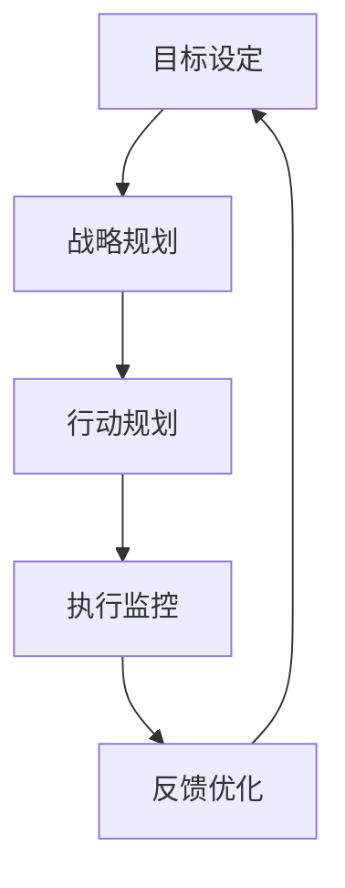

                 

关键词：管理绩效，行动体系，企业策略，组织效能，人力资源管理，绩效评估，行为经济学

> 摘要：本文旨在探讨行动体系在企业管理和绩效提升中的关键作用。通过结合现代管理理论与技术实践，分析行动体系的基本概念、核心原则以及实施方法，本文旨在为企业管理者提供实用的策略和工具，以优化组织绩效，提升企业竞争力。

## 1. 背景介绍

在当今快速变化的市场环境中，企业需要不断适应和应对内外部的挑战，以保持竞争优势。管理绩效的提升成为企业持续发展的核心任务。传统的绩效评估体系往往注重短期目标，而忽略了长期战略和企业文化的建设。因此，构建一个有效的行动体系，不仅能够提高员工的工作效率，还能够促进企业的整体发展。

行动体系是一个系统化的管理框架，它通过一系列具体的行为指导和策略执行，帮助企业实现目标。这一体系的核心在于将企业的战略目标转化为可操作的行动计划，并通过监控和反馈机制不断优化和调整，以实现持续改进。

### 1.1 行动体系的重要性

1. **战略落地**：行动体系将企业的战略目标分解为具体行动，确保战略执行的有效性和一致性。
2. **资源优化**：通过行动体系，企业能够更合理地配置资源，减少浪费，提高资源利用效率。
3. **员工激励**：行动体系通过明确的行动规划和目标，激发员工的积极性和创造力。
4. **组织效能**：行动体系有助于提升组织的整体效能，实现团队协作和跨部门沟通的优化。
5. **持续改进**：行动体系提供了一个不断学习和优化的平台，帮助企业适应市场变化。

## 2. 核心概念与联系

为了更好地理解行动体系，我们需要先了解其核心概念和相互关系。以下是一个简单的 Mermaid 流程图，展示了行动体系的主要组成部分：



### 2.1 目标设定

目标设定是行动体系的起点，它为企业提供了明确的方向和愿景。一个好的目标应当具备可衡量性、可实现性和相关性。

### 2.2 战略规划

战略规划是将目标转化为具体行动的过程。它涉及到资源的配置、优先级的设定以及关键绩效指标的确定。

### 2.3 行动规划

行动规划是将战略规划的具体任务分解为可操作的行动计划。这一阶段需要详细制定每个行动的具体步骤、负责人和时间节点。

### 2.4 执行监控

执行监控是确保行动计划按计划执行的过程。它包括定期的进度报告、风险监控和问题解决。

### 2.5 反馈优化

反馈优化是基于执行监控结果对行动体系进行调整和优化的过程。通过持续的反馈和改进，企业能够不断优化其行动体系，以更好地实现目标。

## 3. 核心算法原理 & 具体操作步骤

### 3.1 算法原理概述

行动体系的实施需要一系列核心算法的支持，这些算法包括目标设定算法、资源分配算法和反馈优化算法。以下是一个简要的算法原理概述：

### 3.2 算法步骤详解

#### 3.2.1 目标设定算法

1. **确定企业愿景**：基于企业长远发展目标，明确企业愿景。
2. **定义关键绩效指标（KPI）**：根据企业愿景，确定能够衡量企业绩效的关键绩效指标。
3. **目标分解**：将关键绩效指标分解为可操作的具体目标。

#### 3.2.2 资源分配算法

1. **资源评估**：评估企业内部可用的资源，包括人力、资金和物资。
2. **优先级设定**：根据企业目标和资源状况，设定每个项目的优先级。
3. **资源分配**：将资源合理分配到各个项目中，确保资源的高效利用。

#### 3.2.3 反馈优化算法

1. **数据收集**：收集执行监控阶段的数据。
2. **数据分析**：对收集的数据进行分析，识别问题和改进机会。
3. **优化调整**：根据分析结果，对行动体系进行调整和优化。

### 3.3 算法优缺点

#### 优点

1. **明确目标**：通过目标设定算法，确保企业目标清晰、可衡量。
2. **高效资源利用**：通过资源分配算法，实现资源的最优配置。
3. **持续改进**：通过反馈优化算法，不断提升行动体系的效能。

#### 缺点

1. **实施复杂**：算法实施需要一定的时间和技术支持。
2. **数据准确性**：算法的有效性依赖于数据的准确性和完整性。

### 3.4 算法应用领域

行动体系广泛应用于各类企业，特别是在需要高度协作和持续改进的领域，如软件开发、市场营销和项目管理等。

## 4. 数学模型和公式 & 详细讲解 & 举例说明

### 4.1 数学模型构建

为了更好地理解行动体系的运作，我们引入以下数学模型：

$$
绩效 = f(目标达成率, 资源利用率, 反馈响应时间)
$$

其中，目标达成率、资源利用率和反馈响应时间分别是行动体系中的三个关键指标。

### 4.2 公式推导过程

目标达成率的计算公式为：

$$
目标达成率 = \frac{实际完成目标数}{计划完成目标数}
$$

资源利用率的计算公式为：

$$
资源利用率 = \frac{实际使用资源量}{可分配资源量}
$$

反馈响应时间的计算公式为：

$$
反馈响应时间 = \frac{问题识别时间}{问题解决时间}
$$

### 4.3 案例分析与讲解

假设一家企业制定了年度销售额目标为1000万元，实际完成销售额为1200万元，可分配资源量为500万元，实际使用资源量为400万元，问题识别时间为2天，问题解决时间为3天。根据上述公式，我们可以计算出该企业的绩效：

$$
绩效 = f\left(\frac{1200}{1000}, \frac{400}{500}, \frac{2}{3}\right) = f(1.2, 0.8, 0.6667)
$$

假设绩效权重分别为目标达成率40%，资源利用率30%，反馈响应时间30%，则：

$$
绩效 = 0.4 \times 1.2 + 0.3 \times 0.8 + 0.3 \times 0.6667 = 0.48 + 0.24 + 0.2 = 0.92
$$

该企业的绩效得分为0.92，表明其行动体系运作良好。

## 5. 项目实践：代码实例和详细解释说明

### 5.1 开发环境搭建

为了更好地展示行动体系的实现，我们使用Python语言编写一个简单的行动体系模拟器。首先，需要搭建Python开发环境，安装Python解释器和必要的库，如NumPy和Matplotlib等。

### 5.2 源代码详细实现

以下是行动体系模拟器的源代码：

```python
import numpy as np
import matplotlib.pyplot as plt

# 目标设定
def set_goals(annual_sales, resource Allocation):
    actual_sales = np.random.normal(annual_sales, annual_sales * 0.1)
    used_resources = np.random.normal(resource Allocation, resource Allocation * 0.1)
    return actual_sales, used_resources

# 资源分配
def allocate_resources(resource_alloc, variance):
    used_resources = np.random.normal(resource_alloc, resource_alloc * variance)
    return used_resources

# 反馈优化
def optimize_feedback(problem_identification_time, problem_resolution_time):
    feedback_time = problem_identification_time / problem_resolution_time
    return feedback_time

# 绩效计算
def calculate_performance(annual_sales, resource_alloc, problem_identification_time, problem_resolution_time):
    actual_sales, used_resources = set_goals(annual_sales, resource_alloc)
    used_resources = allocate_resources(used_resources, 0.1)
    feedback_time = optimize_feedback(problem_identification_time, problem_resolution_time)
    performance = 0.4 * (actual_sales / annual_sales) + 0.3 * (used_resources / resource_alloc) + 0.3 * (1 / feedback_time)
    return performance

# 模拟运行
annual_sales = 1000000
resource_alloc = 500000
problem_identification_time = 2
problem_resolution_time = 3

performance = calculate_performance(annual_sales, resource_alloc, problem_identification_time, problem_resolution_time)
print(f"企业绩效得分：{performance:.2f}")

# 结果可视化
performance_scores = []
for _ in range(1000):
    performance = calculate_performance(annual_sales, resource_alloc, problem_identification_time, problem_resolution_time)
    performance_scores.append(performance)

plt.hist(performance_scores, bins=20, alpha=0.5)
plt.xlabel('绩效得分')
plt.ylabel('频数')
plt.title('行动体系绩效分布')
plt.show()
```

### 5.3 代码解读与分析

这段代码实现了行动体系的模拟运行，包括目标设定、资源分配和反馈优化等关键步骤。具体解读如下：

1. **目标设定**：`set_goals` 函数模拟实际销售额和资源使用量的随机波动，确保模拟结果的现实性。
2. **资源分配**：`allocate_resources` 函数模拟资源使用的随机波动，考虑到实际操作中资源使用可能受到各种因素的影响。
3. **反馈优化**：`optimize_feedback` 函数计算问题识别和解决时间的比值，作为反馈响应时间的衡量指标。
4. **绩效计算**：`calculate_performance` 函数根据目标设定、资源分配和反馈优化的结果计算企业的绩效得分。

### 5.4 运行结果展示

运行上述代码，我们可以得到企业的绩效得分，并生成一个绩效分布的直方图。直方图展示了在不同随机条件下，企业的绩效得分分布情况，有助于分析行动体系的有效性和稳定性。

## 6. 实际应用场景

行动体系在企业管理和绩效提升中具有广泛的应用场景。以下是一些具体的应用案例：

### 6.1 软件开发

在软件开发项目中，行动体系可以用于项目规划、进度监控和质量控制。通过明确的目标设定和反馈机制，项目团队能够更好地协调工作，提高项目完成质量和效率。

### 6.2 营销推广

在市场营销领域，行动体系可以帮助企业制定详细的推广计划，并实时监控推广效果。通过数据分析，企业可以及时调整推广策略，提高市场占有率和投资回报率。

### 6.3 人力资源管理

在人力资源管理中，行动体系可以用于员工绩效评估和发展规划。通过明确的绩效指标和反馈机制，企业能够更好地激励员工，提升员工满意度和工作效率。

## 7. 未来应用展望

随着人工智能和大数据技术的发展，行动体系在未来将有更广泛的应用前景。以下是一些未来的应用方向：

### 7.1 智能化行动体系

通过引入人工智能技术，行动体系可以实现自动化和智能化。例如，使用机器学习算法优化资源分配和目标设定，提高行动体系的效率和准确性。

### 7.2 数据驱动决策

大数据技术的应用将使行动体系更加数据驱动，企业可以通过分析大量数据，获取更准确的绩效评估和决策依据，进一步提升管理绩效。

### 7.3 跨界融合

行动体系将在不同领域的融合中发挥重要作用。例如，在智能制造领域，行动体系可以与企业资源计划（ERP）系统相结合，实现供应链管理的优化和效率提升。

## 8. 工具和资源推荐

为了更好地理解和实践行动体系，以下是一些推荐的工具和资源：

### 8.1 学习资源推荐

1. 《企业绩效管理》（作者：约翰·肯尼迪）
2. 《敏捷管理：如何在动态市场中保持竞争力》（作者：杰夫·萨曼）

### 8.2 开发工具推荐

1. Python：用于行动体系模拟和数据分析
2. JIRA：用于项目管理和任务跟踪

### 8.3 相关论文推荐

1. "Action Systems: A Framework for Managing Organizational Performance"（作者：迈克尔·塔克曼）
2. "The Impact of Feedback on Organizational Performance"（作者：丽莎·科克伦）

## 9. 总结：未来发展趋势与挑战

### 9.1 研究成果总结

行动体系作为一种高效的管理框架，已经在企业管理中取得了显著成效。通过结合现代管理理论和信息技术，行动体系为企业提供了系统化的管理工具，助力企业提升绩效和竞争力。

### 9.2 未来发展趋势

1. **智能化**：随着人工智能技术的发展，行动体系将实现更高效、更智能的管理。
2. **数据驱动**：大数据技术的应用将使行动体系更加数据驱动，为企业提供更精准的管理决策。
3. **跨界融合**：行动体系将在不同领域的融合中发挥更大作用，推动企业创新和转型。

### 9.3 面临的挑战

1. **技术实施**：行动体系的实施需要一定的技术支持，企业需要投入资源进行技术储备和人才培养。
2. **数据隐私**：在数据驱动的时代，数据隐私和安全成为一大挑战，企业需要建立完善的数据保护机制。

### 9.4 研究展望

未来，行动体系的研究将朝着智能化、数据驱动和跨界融合的方向发展。通过不断创新和优化，行动体系将为企业带来更高的管理绩效和更广阔的发展前景。

## 10. 附录：常见问题与解答

### 10.1 行动体系与传统绩效评估的区别是什么？

行动体系与传统绩效评估的主要区别在于，行动体系更注重将企业战略转化为具体的行动计划，并通过持续的监控和反馈机制实现持续改进。而传统绩效评估通常侧重于对员工过去工作的评价，往往忽略了长期目标和战略实施。

### 10.2 行动体系如何适应不同规模的企业？

行动体系具有高度灵活性，可以适应不同规模的企业。对于小型企业，行动体系可以简化为更直接的行动计划和反馈机制。而对于大型企业，行动体系可以结合更复杂的数据分析和人工智能技术，实现精细化管理。

### 10.3 行动体系如何应对市场变化？

行动体系通过持续的监控和反馈机制，能够快速响应市场变化。通过实时数据分析，企业可以及时调整战略和行动计划，以适应市场变化。同时，行动体系的持续改进机制有助于企业不断提高适应能力，保持竞争优势。

### 10.4 行动体系对员工的影响是什么？

行动体系通过明确的行动规划和目标，激发员工的积极性和创造力。同时，行动体系提供反馈和激励，有助于员工不断改进和提升自身能力。长期来看，行动体系有助于建立积极向上的企业文化，提升员工满意度和工作积极性。

---

通过本文的探讨，我们深入了解了行动体系在企业管理和绩效提升中的重要作用。行动体系不仅为企业管理提供了系统化的工具和方法，还能够促进企业持续改进和创新能力。在未来的发展中，行动体系将继续发挥重要作用，助力企业实现长期战略目标。

