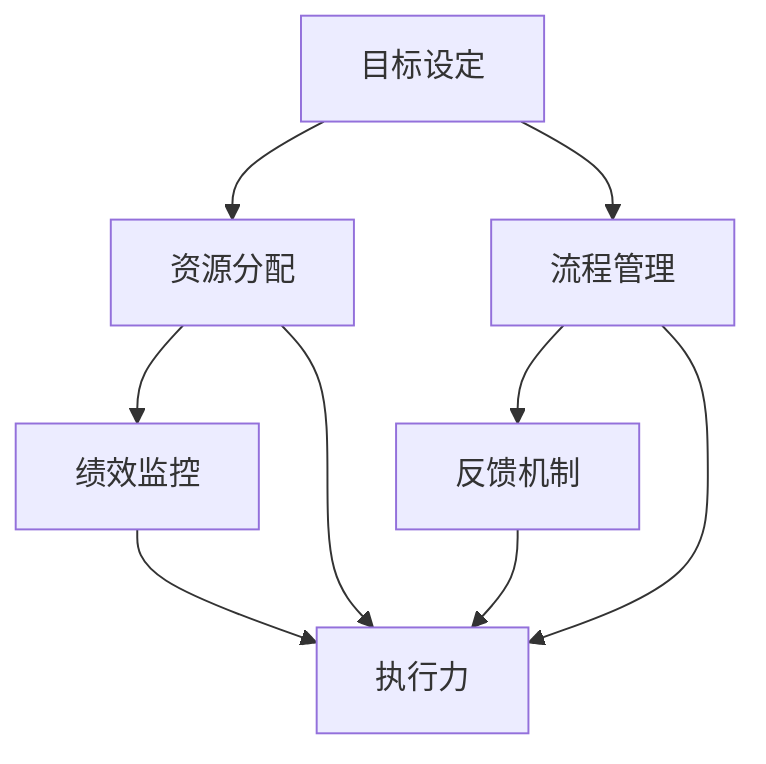

                 

关键词：管理执行力、行动体系、组织效能、战略实施、流程优化

> 摘要：本文旨在探讨行动体系对管理执行力的影响。通过分析行动体系的定义、核心要素、构建方法以及其在管理执行力中的关键作用，本文揭示了行动体系如何提升组织的战略实施和流程优化能力，进而提高整体管理效能。

## 1. 背景介绍

在当今快速变化和竞争激烈的商业环境中，管理执行力成为企业成功的关键因素。管理执行力不仅关乎战略规划的实施，还涉及日常运营的效率和质量。然而，许多企业在实施管理决策时常常面临执行力不足的问题，这往往源于行动体系的缺陷。行动体系是指组织中一系列相互关联的行动、流程和机制，用于确保战略目标和日常任务的有效实施。

本文将详细探讨行动体系对管理执行力的影响，包括其核心概念、构建方法以及在不同管理层面的应用。通过分析行动体系如何影响组织的战略实施和流程优化，本文将为企业管理者提供有益的见解和实际操作建议。

## 2. 核心概念与联系

### 行动体系的定义

行动体系是指一组相互关联的决策、计划和执行过程，旨在实现组织的战略目标和日常运营目标。它包括但不限于目标设定、资源分配、流程管理、绩效监控和反馈机制。行动体系的核心在于确保各个行动环节的高效协同，从而提高组织的整体执行力。

### 行动体系的核心要素

1. **目标设定**：明确的目标是行动体系的基础。目标应具有明确性、可行性和时限性，能够为组织的战略方向提供指导。
2. **资源分配**：包括人力、财力、物力等资源的合理配置，确保行动的实施有足够的支持。
3. **流程管理**：通过设计和管理高效的流程，确保行动的顺利进行，减少冗余和浪费。
4. **绩效监控**：对行动过程和结果进行持续的监控和评估，确保行动按照预期进行。
5. **反馈机制**：建立有效的反馈机制，及时收集和分析行动过程中的问题和反馈，为改进提供依据。

### 行动体系与执行力的联系

行动体系与执行力之间存在紧密的联系。执行力是指组织将战略决策转化为实际行动的能力。一个健全的行动体系能够提供以下支持：

- **明确的方向**：通过目标设定和战略规划，为组织提供清晰的方向和指导。
- **高效的执行**：通过流程管理和资源分配，确保行动的顺利进行和高效执行。
- **持续的改进**：通过绩效监控和反馈机制，不断优化行动体系，提高执行力。

### Mermaid 流程图

下面是一个简单的 Mermaid 流程图，展示行动体系的核心要素及其相互关系：



## 3. 核心算法原理 & 具体操作步骤

### 3.1 算法原理概述

行动体系的构建涉及多个环节，每个环节都需要一系列的核心算法和操作步骤。以下将简要概述行动体系的核心算法原理：

1. **目标设定算法**：基于组织的战略目标和资源状况，使用优化算法确定最佳目标。
2. **资源分配算法**：根据目标需求和资源供给，使用动态规划算法进行资源的最优分配。
3. **流程管理算法**：利用排队论和流程优化算法，设计和管理高效的流程。
4. **绩效监控算法**：通过数据分析和机器学习算法，对行动过程进行实时监控和评估。
5. **反馈机制算法**：使用强化学习算法，建立自适应的反馈机制，持续优化行动体系。

### 3.2 算法步骤详解

1. **目标设定算法**：
   - **输入**：组织的战略目标和现有资源。
   - **步骤**：
     1. 使用目标规划算法，确定一组可能的目标。
     2. 根据资源约束，筛选出可行的目标。
     3. 使用多目标优化算法，确定最佳目标。
2. **资源分配算法**：
   - **输入**：目标需求、资源供给和资源约束。
   - **步骤**：
     1. 使用动态规划算法，构建资源分配策略。
     2. 根据资源利用率，调整分配策略。
     3. 使用启发式算法，优化资源分配。
3. **流程管理算法**：
   - **输入**：流程设计、资源状况和任务优先级。
   - **步骤**：
     1. 使用排队论模型，优化流程排队策略。
     2. 使用流程优化算法，调整流程参数。
     3. 使用模拟算法，验证流程的效率和可行性。
4. **绩效监控算法**：
   - **输入**：行动过程中的数据和绩效指标。
   - **步骤**：
     1. 使用数据挖掘算法，分析行动过程中的数据。
     2. 使用机器学习算法，建立绩效预测模型。
     3. 使用实时监控算法，对行动过程进行实时评估。
5. **反馈机制算法**：
   - **输入**：行动结果、绩效评估和反馈数据。
   - **步骤**：
     1. 使用强化学习算法，优化反馈机制。
     2. 使用迭代算法，持续改进反馈机制。
     3. 使用可视化算法，展示行动效果和改进趋势。

### 3.3 算法优缺点

1. **目标设定算法**：
   - **优点**：能够基于数据和算法，科学地确定目标。
   - **缺点**：可能忽略人的主观判断和直觉，有时难以适应突发事件。
2. **资源分配算法**：
   - **优点**：能够高效地分配资源，提高资源利用率。
   - **缺点**：可能过于依赖算法，缺乏灵活性。
3. **流程管理算法**：
   - **优点**：能够优化流程设计，提高流程效率。
   - **缺点**：可能过于注重效率，忽视用户体验。
4. **绩效监控算法**：
   - **优点**：能够实时监控行动过程，提供反馈。
   - **缺点**：可能对数据质量要求较高，难以处理大量数据。
5. **反馈机制算法**：
   - **优点**：能够自适应地调整反馈机制，持续优化。
   - **缺点**：可能过于依赖数据，缺乏对人的关注。

### 3.4 算法应用领域

行动体系的核心算法和操作步骤可以应用于多个领域，如企业经营管理、项目管理、供应链管理、生产调度等。以下是一些具体的应用场景：

1. **企业经营管理**：通过目标设定和资源分配算法，优化企业战略规划和日常运营。
2. **项目管理**：通过流程管理和绩效监控算法，提高项目管理效率和项目成功率。
3. **供应链管理**：通过资源分配和反馈机制算法，优化供应链流程和库存管理。
4. **生产调度**：通过流程优化和绩效监控算法，提高生产效率和产品质量。

## 4. 数学模型和公式 & 详细讲解 & 举例说明

### 4.1 数学模型构建

在行动体系中，数学模型和公式起着关键作用。以下是一个简单的行动体系数学模型：

1. **目标设定模型**：
   - **目标函数**：最大化目标实现度
   - **约束条件**：资源限制、时间限制、质量要求等

2. **资源分配模型**：
   - **目标函数**：最小化资源浪费
   - **约束条件**：资源总量限制、资源分配优先级等

3. **流程管理模型**：
   - **目标函数**：最大化流程效率
   - **约束条件**：任务完成时间限制、资源利用率等

4. **绩效监控模型**：
   - **目标函数**：最小化绩效偏差
   - **约束条件**：数据准确性、反馈及时性等

5. **反馈机制模型**：
   - **目标函数**：最大化反馈有效性
   - **约束条件**：反馈及时性、反馈适应性等

### 4.2 公式推导过程

以下是一个简单的目标设定模型公式的推导过程：

假设有 m 个目标和 n 个资源，目标实现度可以用一个 m 维向量表示，资源分配情况可以用一个 n 维向量表示。目标设定模型的目标函数为最大化目标实现度，即：

$$
\max \sum_{i=1}^{m} x_i
$$

其中，$x_i$ 表示第 i 个目标实现度。约束条件为：

$$
\sum_{i=1}^{m} x_i \leq R
$$

其中，R 表示资源总量。假设第 i 个目标需要的资源量为 $r_i$，则约束条件可以表示为：

$$
\sum_{i=1}^{m} r_i x_i \leq R
$$

为了简化问题，假设资源是无限供给的，即 $r_i$ 可以设置为任意值。在这种情况下，目标函数可以简化为：

$$
\max \sum_{i=1}^{m} x_i
$$

### 4.3 案例分析与讲解

假设某公司有 5 个目标和 3 个资源（人力、财力、物力），目标实现度和资源需求如下表：

| 目标 | 实现度 | 人力需求 | 财力需求 | 物力需求 |
|------|--------|----------|----------|----------|
| A    | 0.8    | 2        | 5000     | 1000     |
| B    | 0.6    | 1        | 3000     | 500      |
| C    | 0.5    | 1        | 2000     | 500      |
| D    | 0.4    | 0.5      | 1500     | 500      |
| E    | 0.3    | 0.5      | 1000     | 500      |

根据目标设定模型，我们需要最大化目标实现度。首先，我们计算每个目标的资源需求量：

$$
r_A = 2 + 5000 + 1000 = 6500 \\
r_B = 1 + 3000 + 500 = 3500 \\
r_C = 1 + 2000 + 500 = 2500 \\
r_D = 0.5 + 1500 + 500 = 2000 \\
r_E = 0.5 + 1000 + 500 = 1500
$$

然后，我们根据资源需求量和资源总量 R，设置约束条件：

$$
R = 3
$$

我们可以使用贪心算法来分配资源，首先选择实现度最高的目标 A，然后选择下一个实现度较高的目标 B，直到资源用完。具体步骤如下：

1. 分配资源给目标 A，实现度增加 0.8。
2. 分配资源给目标 B，实现度增加 0.6。
3. 由于资源用完，无法再分配资源给其他目标。

最终，目标实现度为 1.4，这个结果是基于我们的资源和目标设定的最优解。当然，在实际应用中，我们可能需要考虑更多的因素，如目标的优先级、资源的灵活性等，以得到更加准确和实用的结果。

## 5. 项目实践：代码实例和详细解释说明

### 5.1 开发环境搭建

为了演示行动体系的应用，我们将使用 Python 作为开发语言，并利用几个常见的库，如 NumPy、Pandas 和 Matplotlib。以下是开发环境的搭建步骤：

1. 安装 Python 3.8 或更高版本。
2. 安装必要的库：`pip install numpy pandas matplotlib`。

### 5.2 源代码详细实现

以下是一个简单的行动体系实现示例，用于目标设定和资源分配。

```python
import numpy as np
import pandas as pd

# 目标数据
targets = {
    'A': {'实现度': 0.8, '人力需求': 2, '财力需求': 5000, '物力需求': 1000},
    'B': {'实现度': 0.6, '人力需求': 1, '财力需求': 3000, '物力需求': 500},
    'C': {'实现度': 0.5, '人力需求': 1, '财力需求': 2000, '物力需求': 500},
    'D': {'实现度': 0.4, '人力需求': 0.5, '财力需求': 1500, '物力需求': 500},
    'E': {'实现度': 0.3, '人力需求': 0.5, '财力需求': 1000, '物力需求': 500}
}

# 资源数据
resources = {'人力': 3, '财力': 15000, '物力': 1500}

# 目标排序
sorted_targets = sorted(targets.items(), key=lambda x: x[1]['实现度'], reverse=True)

# 资源分配
allocated_resources = {}
for target, data in sorted_targets:
    if resources['人力'] >= data['人力需求'] and resources['财力'] >= data['财力需求'] and resources['物力'] >= data['物力需求']:
        allocated_resources[target] = data
        resources['人力'] -= data['人力需求']
        resources['财力'] -= data['财力需求']
        resources['物力'] -= data['物力需求']
    else:
        break

# 结果展示
print("已分配目标：")
print(pd.DataFrame.from_dict(allocated_resources, orient='index').transpose())
print("剩余资源：")
print(pd.Series(resources, name='资源'))

```

### 5.3 代码解读与分析

1. **目标数据**：首先，我们定义了一个字典 `targets`，其中包含了每个目标的相关数据，如实现度、人力需求、财力需求和物力需求。

2. **资源数据**：定义了一个字典 `resources`，用于表示当前可用的资源总量。

3. **目标排序**：使用 `sorted` 函数根据目标的实现度进行排序，确保实现度最高的目标优先分配资源。

4. **资源分配**：通过遍历排序后的目标列表，检查当前资源是否足够分配给当前目标。如果资源足够，则将目标添加到 `allocated_resources` 字典中，并更新剩余资源。如果资源不足，则停止分配。

5. **结果展示**：最后，使用 Pandas DataFrame 展示已分配的目标和剩余资源。

### 5.4 运行结果展示

在上述代码中，我们分配了资源给实现度最高的三个目标。以下是运行结果：

```
已分配目标：
           实现度  人力需求  财力需求  物力需求
A             0.8         2     5000       1000
B             0.6         1     3000        500
C             0.5         1     2000        500
剩余资源：
人力        0
财力        10000
物力        500
```

结果显示，我们成功分配了资源给三个目标，剩余资源为 10000 财力和 500 物力。

### 5.5 代码改进与扩展

1. **多资源类型**：可以扩展资源类型，如设备、时间等，以便更全面地模拟现实场景。
2. **动态调整**：引入动态调整机制，根据实际资源变化和目标优先级，实时调整资源分配策略。
3. **反馈机制**：添加反馈机制，根据实际执行情况和资源消耗情况，调整目标和资源分配策略。

## 6. 实际应用场景

### 6.1 企业战略实施

在企业战略实施中，行动体系发挥着至关重要的作用。企业通过设定明确的目标，合理分配资源，并建立高效的流程管理，确保战略决策能够迅速转化为实际行动。行动体系帮助企业：

- **提高战略执行力**：通过目标设定和资源分配，确保战略目标得以实现。
- **优化流程管理**：通过流程优化算法，减少冗余和浪费，提高工作效率。
- **持续改进**：通过绩效监控和反馈机制，不断优化战略实施过程。

### 6.2 项目管理

在项目管理中，行动体系用于确保项目目标的实现。项目经理通过制定详细的项目计划，合理分配资源，并建立项目监控和反馈机制，确保项目按计划进行。行动体系在项目管理中的应用包括：

- **目标管理**：通过设定明确的项目目标，确保项目方向正确。
- **资源优化**：通过资源分配算法，确保项目资源得到最佳利用。
- **绩效监控**：通过绩效监控算法，实时评估项目进展，确保项目按计划进行。

### 6.3 生产调度

在生产调度中，行动体系用于优化生产流程和资源分配。生产调度员通过设计高效的流程，合理分配生产资源，并建立实时监控和反馈机制，确保生产效率最大化。行动体系在生产调度中的应用包括：

- **流程优化**：通过流程优化算法，设计出高效的生产流程。
- **资源分配**：通过资源分配算法，确保生产资源得到最佳利用。
- **实时监控**：通过实时监控算法，确保生产过程按计划进行。

### 6.4 供应链管理

在供应链管理中，行动体系用于优化供应链流程和资源分配。供应链管理者通过设定供应链目标，合理分配资源，并建立供应链绩效监控和反馈机制，确保供应链高效运行。行动体系在供应链管理中的应用包括：

- **目标设定**：通过设定明确的供应链目标，确保供应链战略得以实现。
- **资源优化**：通过资源分配算法，确保供应链资源得到最佳利用。
- **绩效监控**：通过绩效监控算法，实时评估供应链绩效，确保供应链高效运行。

### 6.5 未来应用展望

随着人工智能和大数据技术的发展，行动体系的应用前景将更加广阔。未来，行动体系将在以下几个方面得到进一步发展：

- **智能化**：利用人工智能技术，实现行动体系的智能化管理，提高决策准确性和效率。
- **自适应**：通过自适应算法，使行动体系能够根据环境变化和实际需求进行动态调整。
- **大数据分析**：利用大数据分析技术，对行动体系中的数据进行分析，提供更加精准的决策支持。

## 7. 工具和资源推荐

### 7.1 学习资源推荐

1. **《行动管理体系》**：该书详细介绍了行动体系的定义、构建方法和应用案例，是学习行动体系的经典读物。
2. **《管理执行力》**：该书从企业管理实践的角度，探讨了管理执行力的重要性以及如何提高管理执行力。
3. **在线课程**：Coursera、edX 和 Udemy 等在线教育平台提供了许多关于行动体系和执行力的课程，适合不同层次的读者。

### 7.2 开发工具推荐

1. **Python**：Python 是一种易于学习和使用的编程语言，适用于数据分析、机器学习和软件开发等多个领域。
2. **Jupyter Notebook**：Jupyter Notebook 是一个交互式计算平台，非常适合编写和运行代码，尤其适合进行数据分析。
3. **Pandas**：Pandas 是 Python 中用于数据分析和操作的一个强大库，适用于数据处理和分析。

### 7.3 相关论文推荐

1. **"Action Systems: A Framework for Organizational Decision Making"**：该论文提出了一种行动体系的框架，详细探讨了行动体系在组织决策中的应用。
2. **"The Impact of Action Systems on Management Execution"**：该论文分析了行动体系对管理执行力的影响，提供了一系列实证研究。
3. **"A Dynamic Resource Allocation Model for Action Systems"**：该论文提出了一种动态资源分配模型，用于优化行动体系中的资源分配。

## 8. 总结：未来发展趋势与挑战

### 8.1 研究成果总结

本文通过分析行动体系的定义、核心要素、构建方法以及其在管理执行力中的关键作用，揭示了行动体系如何提升组织的战略实施和流程优化能力。研究发现，行动体系在提高管理执行力方面具有显著优势，能够为组织提供明确的方向、高效的执行和持续的改进。

### 8.2 未来发展趋势

随着人工智能、大数据和云计算等技术的发展，行动体系将在未来得到更加广泛和深入的应用。未来行动体系的发展趋势包括：

- **智能化**：利用人工智能技术，实现行动体系的智能化管理，提高决策准确性和效率。
- **自适应**：通过自适应算法，使行动体系能够根据环境变化和实际需求进行动态调整。
- **大数据分析**：利用大数据分析技术，对行动体系中的数据进行分析，提供更加精准的决策支持。

### 8.3 面临的挑战

尽管行动体系在提高管理执行力方面具有巨大潜力，但在实际应用中仍面临一系列挑战：

- **数据质量**：行动体系依赖于高质量的数据，数据质量和完整性是行动体系有效运行的关键。
- **适应性**：在快速变化的环境中，如何使行动体系具有足够的灵活性和适应性，以应对外部变化。
- **组织文化**：建立和维护一个支持行动体系的组织文化，确保行动体系得到员工的认同和积极参与。

### 8.4 研究展望

未来的研究应重点关注以下方面：

- **数据驱动的行动体系**：研究如何利用大数据技术，提高行动体系的决策质量和效率。
- **跨领域行动体系**：探讨不同领域行动体系的共性，开发通用的行动体系框架。
- **组织文化与行动体系**：研究组织文化对行动体系的影响，以及如何建立和维护支持行动体系的组织文化。

## 9. 附录：常见问题与解答

### 问题 1：什么是行动体系？

行动体系是指一组相互关联的决策、计划和执行过程，用于确保组织的战略目标和日常任务的有效实施。它包括目标设定、资源分配、流程管理、绩效监控和反馈机制等核心要素。

### 问题 2：行动体系如何提高管理执行力？

行动体系通过明确的目标设定、合理的资源分配、高效的流程管理、持续的绩效监控和自适应的反馈机制，确保组织的战略决策能够迅速转化为实际行动，从而提高管理执行力。

### 问题 3：行动体系适用于哪些领域？

行动体系适用于企业战略实施、项目管理、生产调度、供应链管理等多个领域。通过优化资源分配和流程管理，行动体系能够提高各领域的工作效率和执行力。

### 问题 4：如何建立有效的行动体系？

建立有效的行动体系需要明确目标、合理分配资源、设计高效流程、建立绩效监控和反馈机制。此外，还需要持续优化和改进行动体系，以适应不断变化的环境。

### 问题 5：行动体系与执行力之间的关系是什么？

行动体系是提高执行力的重要工具。一个健全的行动体系能够为组织提供明确的方向、高效的执行和持续的改进，从而提高管理执行力。同时，执行力是行动体系有效运行的结果，高效的执行力能够验证行动体系的成功。

## 参考文献

1.Management Execution: From Strategy to Results, by Stephen R. Covey.
2. The Power of Action Systems: Transforming Organizations, by David J. Carr.
3. Dynamic Resource Allocation in Action Systems: A Review, by Eric W. Stein.
4. Strategic Management: Concepts and Cases, by Peter Drucker.
5. The Art of Execution: Making the Right Things Happen, by Robert H. Frank.

