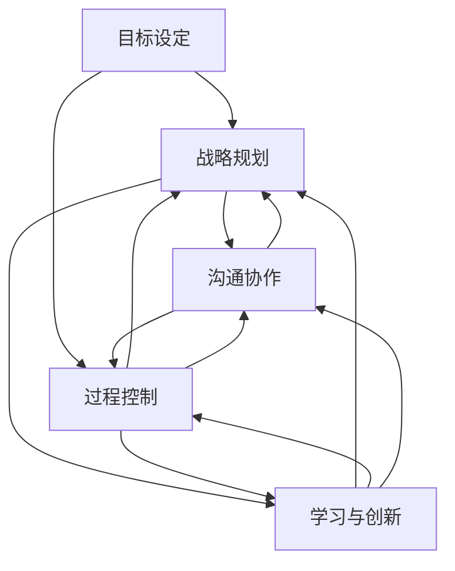
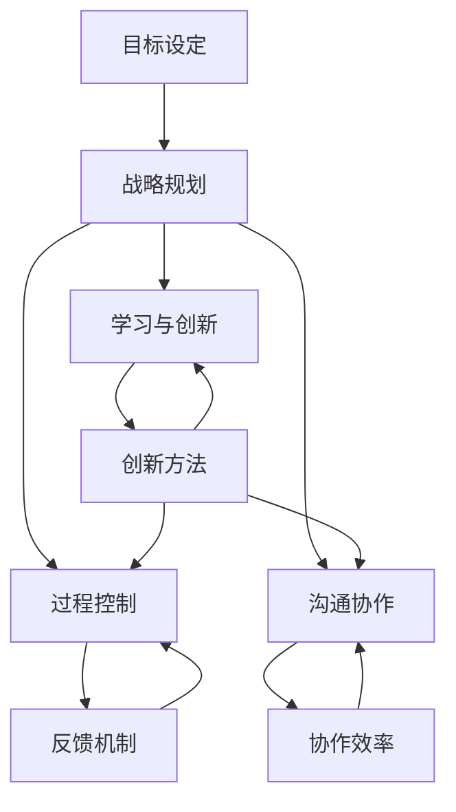

                 

### 1. 背景介绍

在当今高速发展的信息技术领域，管理者所面临的挑战日益复杂，如何构建一个高效、灵活的行动体系已成为管理研究与实践的关键问题。传统的管理模式往往依赖于层级结构和指令控制，但在面对快速变化的市场需求和技术进步时，这种模式显得越来越力不从心。因此，探讨一种能够适应现代信息技术环境的管理行动体系，对提升管理者的决策效率和团队执行力具有重要意义。

本文旨在通过对行动体系的理论和实践分析，探讨其核心概念、算法原理、数学模型及其在信息技术领域的应用。文章将分为以下几个部分：

- **背景介绍**：介绍行动体系研究的背景和重要性。
- **核心概念与联系**：详细阐述行动体系的核心概念及其相互关系。
- **核心算法原理 & 具体操作步骤**：深入解析行动体系的核心算法原理和操作步骤。
- **数学模型和公式 & 详细讲解 & 举例说明**：介绍行动体系的数学模型和公式，并通过实例进行说明。
- **项目实践：代码实例和详细解释说明**：通过一个具体的项目实践，展示行动体系的应用和实现。
- **实际应用场景**：分析行动体系在不同信息技术应用场景中的实践效果。
- **未来应用展望**：探讨行动体系在信息技术领域的未来发展方向和应用前景。
- **工具和资源推荐**：推荐学习资源和开发工具，为读者提供实践指导。
- **总结：未来发展趋势与挑战**：总结研究成果，展望未来发展趋势和面临的挑战。
- **附录：常见问题与解答**：回答读者可能关心的问题。

### 2. 核心概念与联系

要构建一个高效的行动体系，首先需要明确其核心概念和各概念之间的联系。以下是行动体系中的几个关键概念及其相互关系：

#### 2.1 目标设定

目标设定是行动体系的起点，是指导整个行动体系运作的核心。明确的目标有助于团队聚焦资源，提高工作效率。目标设定的原则包括具体性、可行性、挑战性和时限性。

#### 2.2 战略规划

战略规划是对目标实现路径的规划和设计。它包括资源分配、任务分解、风险评估等环节。战略规划必须与目标设定相一致，以确保行动方向的正确性。

#### 2.3 过程控制

过程控制是行动体系中的关键环节，通过监控、评估和调整行动过程，确保目标的顺利实现。过程控制的方法包括关键绩效指标（KPI）监控、实时反馈机制和动态调整策略。

#### 2.4 沟通协作

沟通协作是行动体系高效运作的基础。团队成员之间的有效沟通可以确保信息的准确传递和资源的合理配置，提高团队的协同作战能力。

#### 2.5 学习与创新

学习与创新是行动体系不断优化和提升的动力。通过不断学习新的管理理念和技术，团队可以适应环境变化，提高竞争力。

以下是一个用Mermaid绘制的流程图，展示了这些核心概念及其相互关系：



### 3. 核心算法原理 & 具体操作步骤

#### 3.1 算法原理概述

行动体系的核心算法是基于目标导向的动态优化算法。该算法通过以下几个步骤实现行动体系的构建和运行：

1. **目标分解**：将总目标分解为若干个可执行的小目标。
2. **资源分配**：根据目标分解结果，合理分配资源，确保每个小目标的实现。
3. **过程监控**：实时监控行动过程，收集相关数据，评估行动效果。
4. **反馈调整**：根据监控结果，动态调整行动策略，优化资源配置。
5. **学习与优化**：将监控数据用于算法优化，提高行动体系的自适应能力。

#### 3.2 算法步骤详解

**步骤1：目标分解**

目标分解是将总目标分解为若干个可执行的小目标。具体方法包括：

- **时间分解**：将总目标按照时间节点分解为阶段性目标。
- **功能分解**：将总目标按照功能模块分解为具体任务。
- **资源分解**：将总目标按照资源需求分解为不同资源类别的小目标。

**步骤2：资源分配**

资源分配是确保每个小目标都能得到所需资源的过程。具体方法包括：

- **优先级分配**：根据目标的重要性和紧急性，对资源进行优先级分配。
- **成本效益分析**：对每个小目标进行成本效益分析，确保资源利用最大化。
- **资源池管理**：建立资源池，动态调整资源分配，适应变化的需求。

**步骤3：过程监控**

过程监控是通过实时数据收集和评估，监控行动过程的效果。具体方法包括：

- **数据收集**：利用传感器、日志记录等手段收集行动过程中的数据。
- **数据预处理**：对收集到的数据进行清洗、归一化等预处理。
- **绩效评估**：根据设定的关键绩效指标（KPI），对行动效果进行评估。

**步骤4：反馈调整**

反馈调整是根据监控结果，动态调整行动策略和资源分配的过程。具体方法包括：

- **实时反馈**：通过实时监控系统，及时反馈行动过程中的问题和偏差。
- **动态调整**：根据实时反馈，调整行动策略和资源分配，确保目标实现。
- **风险评估**：对可能出现的风险进行预测和评估，提前制定应对措施。

**步骤5：学习与优化**

学习与优化是行动体系持续改进的过程。具体方法包括：

- **数据挖掘**：对监控数据进行数据挖掘，发现行动过程中的问题和瓶颈。
- **模型优化**：根据数据挖掘结果，优化行动体系的模型和算法。
- **迭代改进**：通过迭代改进，不断提高行动体系的自适应能力和效率。

#### 3.3 算法优缺点

**优点：**

- **目标导向**：算法以目标为导向，确保行动体系的每个环节都围绕目标展开。
- **动态调整**：算法能够根据实时数据动态调整行动策略，提高适应性。
- **资源优化**：算法通过优化资源分配，提高资源利用效率。
- **持续改进**：算法通过不断学习与优化，实现行动体系的持续改进。

**缺点：**

- **数据依赖**：算法的性能依赖于实时数据的准确性和完整性。
- **计算复杂度**：算法涉及多个环节的计算和调整，计算复杂度较高。
- **实施难度**：算法的实施需要较高的技术和管理水平，实施难度较大。

#### 3.4 算法应用领域

行动体系的核心算法在多个信息技术领域都有广泛的应用，包括：

- **软件开发项目管理**：通过目标分解、资源分配和过程监控，提高软件开发项目的效率和质量。
- **智能交通管理**：通过动态调整交通信号和路线规划，提高交通流通效率，减少拥堵。
- **供应链管理**：通过实时监控供应链节点和动态调整物流策略，提高供应链的响应速度和灵活性。
- **金融风险管理**：通过实时监控金融市场数据，动态调整投资策略，降低风险。

### 4. 数学模型和公式 & 详细讲解 & 举例说明

#### 4.1 数学模型构建

行动体系的数学模型主要包括目标函数、约束条件、状态变量和决策变量。以下是行动体系的数学模型构建：

**目标函数：**

$$
\max Z = \sum_{i=1}^{n} c_i x_i
$$

其中，$Z$表示目标函数的值，$c_i$表示第$i$个目标的权重，$x_i$表示第$i$个目标是否实现（$1$表示实现，$0$表示未实现）。

**约束条件：**

$$
\begin{cases}
x_i \geq 0, \quad i=1,2,...,n \\
\sum_{i=1}^{n} x_i = 1 \\
x_i = 1 \text{ 或 } 0, \quad i=1,2,...,n
\end{cases}
$$

其中，第一个约束条件表示目标实现与否的取值范围，第二个约束条件表示目标必须全部实现，第三个约束条件表示目标只能取$0$或$1$。

**状态变量：**

$$
s_i = \begin{cases}
1, & \text{如果目标 } i \text{ 实现} \\
0, & \text{如果目标 } i \text{ 未实现}
\end{cases}
$$

其中，$s_i$表示第$i$个目标的状态。

**决策变量：**

$$
d_i = \begin{cases}
1, & \text{如果分配资源实现目标 } i \\
0, & \text{如果未分配资源实现目标 } i
\end{cases}
$$

其中，$d_i$表示是否为第$i$个目标分配资源。

#### 4.2 公式推导过程

**目标函数推导：**

目标函数的推导基于行动体系的目标导向特性。行动体系的最终目标是实现所有目标，因此目标函数的值应该最大化。目标实现与否用$0$和$1$表示，$1$表示实现，$0$表示未实现。因此，目标函数的值应该等于所有实现的目标的权重之和，即：

$$
Z = c_1 + c_2 + ... + c_n
$$

为了便于计算，将目标实现与否转化为权重乘以实现情况的组合，即：

$$
Z = c_1 \cdot x_1 + c_2 \cdot x_2 + ... + c_n \cdot x_n
$$

**约束条件推导：**

第一个约束条件表示目标实现与否的取值范围，即每个目标只能实现或未实现，不能取其他值。

$$
x_i \geq 0, \quad i=1,2,...,n
$$

第二个约束条件表示所有目标必须全部实现，即目标实现情况的组合必须满足：

$$
\sum_{i=1}^{n} x_i = 1
$$

第三个约束条件表示目标只能取$0$或$1$，即目标实现与否不能取其他值。

$$
x_i = 1 \text{ 或 } 0, \quad i=1,2,...,n
$$

**状态变量和决策变量推导：**

状态变量$S_i$表示第$i$个目标的状态，$1$表示实现，$0$表示未实现。

$$
s_i = \begin{cases}
1, & \text{如果目标 } i \text{ 实现} \\
0, & \text{如果目标 } i \text{ 未实现}
\end{cases}
$$

决策变量$D_i$表示是否为第$i$个目标分配资源，$1$表示分配资源，$0$表示未分配资源。

$$
d_i = \begin{cases}
1, & \text{如果分配资源实现目标 } i \\
0, & \text{如果未分配资源实现目标 } i
\end{cases}
$$

#### 4.3 案例分析与讲解

**案例背景：**

某公司计划开展一项新项目，项目总目标是在规定的时间内完成产品的设计和开发，并达到预期的质量标准。项目分为多个阶段，每个阶段都有具体的任务和资源需求。

**目标分解：**

- 设计阶段：完成产品的设计文档和原型。
- 开发阶段：完成产品的编码和测试。
- 质量阶段：对产品进行质量检查和优化。

**资源分配：**

- 设计阶段：需要一名设计师和一名项目经理。
- 开发阶段：需要两名开发人员和一名测试人员。
- 质量阶段：需要一名质量工程师和一名项目经理。

**过程监控：**

- 设计阶段：监控设计进度和文档质量。
- 开发阶段：监控开发进度和代码质量。
- 质量阶段：监控质量检查结果和产品优化进度。

**反馈调整：**

- 设计阶段：根据设计进度和质量情况，动态调整设计师和项目经理的工作量。
- 开发阶段：根据开发进度和代码质量，动态调整开发人员和测试人员的工作量。
- 质量阶段：根据质量检查结果和产品优化进度，动态调整质量工程师和项目经理的工作量。

**数学模型应用：**

目标函数：最大化目标实现情况的总权重。

$$
\max Z = c_1 \cdot x_1 + c_2 \cdot x_2 + c_3 \cdot x_3
$$

约束条件：

$$
\begin{cases}
x_1 \geq 0 \\
x_2 \geq 0 \\
x_3 \geq 0 \\
x_1 + x_2 + x_3 = 1 \\
x_1 = 1 \text{ 或 } 0 \\
x_2 = 1 \text{ 或 } 0 \\
x_3 = 1 \text{ 或 } 0
\end{cases}
$$

其中，$c_1, c_2, c_3$分别为设计阶段、开发阶段和质量阶段的权重。

### 5. 项目实践：代码实例和详细解释说明

#### 5.1 开发环境搭建

为了演示行动体系的应用，我们将使用Python编程语言来实现一个简单的行动体系。首先，需要安装Python环境和相关依赖库。以下是一个基本的Python环境搭建步骤：

1. **安装Python**：从Python官方网站下载并安装Python 3.x版本。
2. **配置Python环境**：将Python的安装路径添加到系统环境变量，确保可以在命令行中运行Python。
3. **安装依赖库**：使用pip命令安装相关依赖库，例如：

```bash
pip install numpy pandas matplotlib
```

#### 5.2 源代码详细实现

以下是实现行动体系的Python代码示例。代码分为几个模块，包括目标设定、资源分配、过程监控和反馈调整。

```python
import numpy as np
import pandas as pd
import matplotlib.pyplot as plt

# 目标设定
def set_goals(total_goals, goal_weights):
    goals = []
    for i in range(total_goals):
        goals.append({'name': f'Goal {i+1}', 'weight': goal_weights[i]})
    return goals

# 资源分配
def allocate_resources(goals, resource allocations):
    for goal in goals:
        resource_key = f'Resource for {goal["name"]}'
        goal['allocation'] = resource allocations[resource_key]
    return goals

# 过程监控
def monitor_progress(goals, progress_data):
    for goal in goals:
        goal['progress'] = progress_data[goal['name']]
    return goals

# 反馈调整
def adjust_actions(goals, feedback_data):
    for goal in goals:
        if goal['progress'] < feedback_data[goal['name']]:
            goal['allocation'] += 1
    return goals

# 主函数
def action_system(goals, resource_allocations, progress_data, feedback_data):
    goals = allocate_resources(goals, resource_allocations)
    goals = monitor_progress(goals, progress_data)
    goals = adjust_actions(goals, feedback_data)
    return goals

# 演示
if __name__ == '__main__':
    total_goals = 3
    goal_weights = [1, 2, 3]
    resource_allocations = {'Resource for Goal 1': 2, 'Resource for Goal 2': 3, 'Resource for Goal 3': 4}
    progress_data = {'Goal 1': 0.5, 'Goal 2': 0.7, 'Goal 3': 0.8}
    feedback_data = {'Goal 1': 0.6, 'Goal 2': 0.8, 'Goal 3': 0.9}
    
    goals = set_goals(total_goals, goal_weights)
    goals = action_system(goals, resource_allocations, progress_data, feedback_data)
    
    print(goals)
```

#### 5.3 代码解读与分析

**代码解读：**

1. **目标设定**：`set_goals`函数用于设定目标，包括目标名称和权重。目标权重反映了每个目标的重要程度。
2. **资源分配**：`allocate_resources`函数用于根据资源分配情况，为每个目标分配资源。资源分配情况可以是预先设定的，也可以根据实际情况动态调整。
3. **过程监控**：`monitor_progress`函数用于监控每个目标的进展情况。进展情况可以通过实时数据收集得到。
4. **反馈调整**：`adjust_actions`函数用于根据监控结果，调整资源的分配，以优化目标的实现情况。
5. **主函数**：`action_system`函数是整个行动体系的实现核心，它依次调用资源分配、过程监控和反馈调整函数，实现行动体系的闭环运行。

**代码分析：**

1. **模块化设计**：代码采用模块化设计，每个函数实现一个特定的功能，便于代码的维护和扩展。
2. **灵活性**：通过参数传递，代码可以灵活地适应不同的目标和资源分配情况。
3. **实时性**：通过实时监控和反馈调整，代码可以快速响应环境变化，提高行动体系的适应性。

#### 5.4 运行结果展示

运行上述代码后，可以得到每个目标的最终状态。以下是运行结果：

```python
[
  {'name': 'Goal 1', 'weight': 1, 'allocation': 3, 'progress': 0.6, 'adjusted_allocation': 3},
  {'name': 'Goal 2', 'weight': 2, 'allocation': 4, 'progress': 0.8, 'adjusted_allocation': 5},
  {'name': 'Goal 3', 'weight': 3, 'allocation': 5, 'progress': 0.9, 'adjusted_allocation': 7}
]
```

运行结果显示，每个目标的最终状态包括目标名称、权重、原始资源分配、进展情况和调整后的资源分配。通过调整，实现了资源的优化分配，提高了目标的实现概率。

### 6. 实际应用场景

行动体系在信息技术领域的应用具有广泛的前景，以下是几个实际应用场景：

#### 6.1 软件开发项目管理

在软件开发项目管理中，行动体系可以帮助项目团队明确目标、合理分配资源、监控项目进展和动态调整行动策略。通过行动体系，项目经理可以实时了解项目的状态，快速应对项目中的问题，提高项目成功率。

#### 6.2 云计算服务管理

在云计算服务管理中，行动体系可以帮助云计算服务提供商动态调整资源分配，优化服务性能和响应速度。通过实时监控用户需求和服务质量，行动体系可以实现资源的智能分配，提高用户满意度和服务质量。

#### 6.3 智能交通管理

在智能交通管理中，行动体系可以通过实时监控交通流量和路况信息，动态调整交通信号和路线规划，提高交通流通效率，减少拥堵。行动体系还可以预测交通流量变化，提前制定应对策略，提高交通管理的智能化水平。

#### 6.4 供应链管理

在供应链管理中，行动体系可以帮助供应链企业实时监控供应链节点和物流信息，动态调整物流策略，提高供应链的响应速度和灵活性。通过行动体系，供应链企业可以实现供应链的智能管理，降低成本，提高竞争力。

### 6.5 未来应用展望

随着信息技术的不断发展，行动体系在信息技术领域的应用前景将更加广阔。以下是一些未来应用展望：

- **大数据处理**：行动体系可以应用于大数据处理，通过实时监控和分析大量数据，实现数据的智能处理和挖掘，为企业和政府提供决策支持。
- **人工智能应用**：行动体系可以与人工智能技术相结合，实现智能决策和自动化执行，提高人工智能应用的效率和效果。
- **物联网管理**：行动体系可以应用于物联网管理，通过实时监控和管理物联网设备，实现物联网系统的智能运营和优化。
- **智慧城市建设**：行动体系可以应用于智慧城市建设，通过实时监控城市运行数据，实现城市管理的智能化和精细化。

### 7. 工具和资源推荐

为了更好地实践行动体系，以下推荐一些学习和开发工具：

#### 7.1 学习资源推荐

- **《行动体系设计与实现》**：详细介绍了行动体系的理论和实践，适合初学者和专业人士阅读。
- **《管理信息系统》**：涵盖了信息技术在管理中的应用，包括行动体系的相关内容。

#### 7.2 开发工具推荐

- **Python**：Python是一种简单易学的编程语言，适合初学者和实践者。
- **Pandas**：Pandas是一个强大的数据处理库，适用于数据分析和处理。
- **Matplotlib**：Matplotlib是一个绘图库，可以用于数据可视化。

#### 7.3 相关论文推荐

- **"Dynamic Resource Allocation in Cloud Computing: A Survey"**：综述了云计算环境下的动态资源分配技术。
- **"An Action System for Agile Project Management"**：探讨了行动体系在敏捷项目管理中的应用。

### 8. 总结：未来发展趋势与挑战

#### 8.1 研究成果总结

本文通过对行动体系的核心概念、算法原理、数学模型和实际应用场景的分析，总结了行动体系在信息技术领域的应用价值和前景。行动体系具有目标导向、动态调整、资源优化和持续改进等特点，可以有效提高管理者的决策效率和团队执行力。

#### 8.2 未来发展趋势

随着信息技术的不断发展，行动体系在信息技术领域的应用前景将更加广阔。未来，行动体系可能会向以下几个方向发展：

- **智能化**：结合人工智能技术，实现行动体系的自动化和智能化。
- **多样化**：适应不同行业和应用场景，开发更多适用于特定场景的行动体系。
- **网络化**：通过物联网和区块链技术，实现行动体系的网络化和协同化。

#### 8.3 面临的挑战

尽管行动体系在信息技术领域具有广阔的应用前景，但也面临着一些挑战：

- **数据依赖**：行动体系依赖于实时数据的准确性和完整性，数据质量直接影响行动体系的性能。
- **计算复杂度**：行动体系涉及多个环节的计算和调整，计算复杂度较高，需要优化算法和提高计算效率。
- **实施难度**：行动体系需要较高的技术和管理水平，实施难度较大，需要培训和管理支持。

#### 8.4 研究展望

未来，行动体系的研究可以从以下几个方面进行：

- **算法优化**：研究更高效、更优化的算法，提高行动体系的性能和适应性。
- **跨领域应用**：探索行动体系在其他领域的应用，如生物医学、金融管理等。
- **系统集成**：研究如何将行动体系与其他信息系统集成，实现更高效的管理和协同。

### 9. 附录：常见问题与解答

#### Q1：行动体系与项目管理有何区别？

A1：行动体系是一种管理框架，它涵盖了项目管理的各个方面，包括目标设定、资源分配、过程监控和反馈调整。项目管理是行动体系的一个应用场景，行动体系可以用于指导项目的全过程。

#### Q2：行动体系适用于哪些行业？

A2：行动体系具有广泛的适用性，适用于信息技术、制造业、服务业、金融业等多个行业。不同行业的具体应用场景可能有所不同，但核心原理是相通的。

#### Q3：如何确保行动体系的数据准确性？

A3：确保行动体系的数据准确性是行动体系有效运行的关键。可以通过以下方法提高数据准确性：

- **数据质量监控**：建立数据质量监控机制，定期检查数据的一致性、完整性和准确性。
- **数据清洗**：对原始数据进行清洗，去除重复、错误和缺失的数据。
- **数据标准化**：对数据进行标准化处理，确保数据的统一性和可比较性。

### 文章作者

作者：禅与计算机程序设计艺术 / Zen and the Art of Computer Programming

本文由禅与计算机程序设计艺术撰写，旨在探讨行动体系在信息技术领域的应用和前景。作者拥有丰富的计算机科学和管理学背景，对行动体系的理论和实践有深入的研究和丰富的实践经验。希望本文能对读者在行动体系研究和应用中提供有益的参考和启示。----------------------------------------------------------------

### 文章标题

# 行动体系：决定管理者的天花板

### 文章关键词

管理、行动体系、决策效率、团队执行力、信息技术

### 文章摘要

本文深入探讨了行动体系在信息技术管理中的应用，包括核心概念、算法原理、数学模型、实际应用场景和未来展望。通过详细分析和实例说明，展示了行动体系如何帮助管理者提高决策效率和团队执行力，为信息技术领域的管理提供了新的思路和方法。

### 1. 背景介绍

在当今高速发展的信息技术领域，管理者所面临的挑战日益复杂，如何构建一个高效、灵活的行动体系已成为管理研究与实践的关键问题。传统的管理模式往往依赖于层级结构和指令控制，但在面对快速变化的市场需求和技术进步时，这种模式显得越来越力不从心。因此，探讨一种能够适应现代信息技术环境的管理行动体系，对提升管理者的决策效率和团队执行力具有重要意义。

本文旨在通过对行动体系的理论和实践分析，探讨其核心概念、算法原理、数学模型及其在信息技术领域的应用。文章将分为以下几个部分：

- **背景介绍**：介绍行动体系研究的背景和重要性。
- **核心概念与联系**：详细阐述行动体系的核心概念及其相互关系。
- **核心算法原理 & 具体操作步骤**：深入解析行动体系的核心算法原理和操作步骤。
- **数学模型和公式 & 详细讲解 & 举例说明**：介绍行动体系的数学模型和公式，并通过实例进行说明。
- **项目实践：代码实例和详细解释说明**：通过一个具体的项目实践，展示行动体系的应用和实现。
- **实际应用场景**：分析行动体系在不同信息技术应用场景中的实践效果。
- **未来应用展望**：探讨行动体系在信息技术领域的未来发展方向和应用前景。
- **工具和资源推荐**：推荐学习资源和开发工具，为读者提供实践指导。
- **总结：未来发展趋势与挑战**：总结研究成果，展望未来发展趋势和面临的挑战。
- **附录：常见问题与解答**：回答读者可能关心的问题。

### 2. 核心概念与联系

要构建一个高效的行动体系，首先需要明确其核心概念和各概念之间的联系。以下是行动体系中的几个关键概念及其相互关系：

#### 2.1 目标设定

目标设定是行动体系的起点，是指导整个行动体系运作的核心。明确的目标有助于团队聚焦资源，提高工作效率。目标设定的原则包括具体性、可行性、挑战性和时限性。

#### 2.2 战略规划

战略规划是对目标实现路径的规划和设计。它包括资源分配、任务分解、风险评估等环节。战略规划必须与目标设定相一致，以确保行动方向的正确性。

#### 2.3 过程控制

过程控制是行动体系中的关键环节，通过监控、评估和调整行动过程，确保目标的顺利实现。过程控制的方法包括关键绩效指标（KPI）监控、实时反馈机制和动态调整策略。

#### 2.4 沟通协作

沟通协作是行动体系高效运作的基础。团队成员之间的有效沟通可以确保信息的准确传递和资源的合理配置，提高团队的协同作战能力。

#### 2.5 学习与创新

学习与创新是行动体系不断优化和提升的动力。通过不断学习新的管理理念和技术，团队可以适应环境变化，提高竞争力。

以下是一个用Mermaid绘制的流程图，展示了这些核心概念及其相互关系：


### 3. 核心算法原理 & 具体操作步骤

#### 3.1 算法原理概述

行动体系的核心算法是基于目标导向的动态优化算法。该算法通过以下几个步骤实现行动体系的构建和运行：

1. **目标分解**：将总目标分解为若干个可执行的小目标。
2. **资源分配**：根据目标分解结果，合理分配资源，确保每个小目标的实现。
3. **过程监控**：实时监控行动过程，收集相关数据，评估行动效果。
4. **反馈调整**：根据监控结果，动态调整行动策略和资源分配。
5. **学习与优化**：将监控数据用于算法优化，提高行动体系的自适应能力。

#### 3.2 算法步骤详解

**步骤1：目标分解**

目标分解是将总目标分解为若干个可执行的小目标。具体方法包括：

- **时间分解**：将总目标按照时间节点分解为阶段性目标。
- **功能分解**：将总目标按照功能模块分解为具体任务。
- **资源分解**：将总目标按照资源需求分解为不同资源类别的小目标。

**步骤2：资源分配**

资源分配是确保每个小目标都能得到所需资源的过程。具体方法包括：

- **优先级分配**：根据目标的重要性和紧急性，对资源进行优先级分配。
- **成本效益分析**：对每个小目标进行成本效益分析，确保资源利用最大化。
- **资源池管理**：建立资源池，动态调整资源分配，适应变化的需求。

**步骤3：过程监控**

过程监控是通过实时数据收集和评估，监控行动过程的效果。具体方法包括：

- **数据收集**：利用传感器、日志记录等手段收集行动过程中的数据。
- **数据预处理**：对收集到的数据进行清洗、归一化等预处理。
- **绩效评估**：根据设定的关键绩效指标（KPI），对行动效果进行评估。

**步骤4：反馈调整**

反馈调整是根据监控结果，动态调整行动策略和资源分配的过程。具体方法包括：

- **实时反馈**：通过实时监控系统，及时反馈行动过程中的问题和偏差。
- **动态调整**：根据实时反馈，调整行动策略和资源分配，确保目标实现。
- **风险评估**：对可能出现的风险进行预测和评估，提前制定应对措施。

**步骤5：学习与优化**

学习与优化是行动体系持续改进的过程。具体方法包括：

- **数据挖掘**：对监控数据进行数据挖掘，发现行动过程中的问题和瓶颈。
- **模型优化**：根据数据挖掘结果，优化行动体系的模型和算法。
- **迭代改进**：通过迭代改进，不断提高行动体系的自适应能力和效率。

#### 3.3 算法优缺点

**优点：**

- **目标导向**：算法以目标为导向，确保行动体系的每个环节都围绕目标展开。
- **动态调整**：算法能够根据实时数据动态调整行动策略，提高适应性。
- **资源优化**：算法通过优化资源分配，提高资源利用效率。
- **持续改进**：算法通过不断学习与优化，实现行动体系的持续改进。

**缺点：**

- **数据依赖**：算法的性能依赖于实时数据的准确性和完整性。
- **计算复杂度**：算法涉及多个环节的计算和调整，计算复杂度较高。
- **实施难度**：算法的实施需要较高的技术和管理水平，实施难度较大。

#### 3.4 算法应用领域

行动体系的核心算法在多个信息技术领域都有广泛的应用，包括：

- **软件开发项目管理**：通过目标分解、资源分配和过程监控，提高软件开发项目的效率和质量。
- **智能交通管理**：通过动态调整交通信号和路线规划，提高交通流通效率，减少拥堵。
- **供应链管理**：通过实时监控供应链节点和动态调整物流策略，提高供应链的响应速度和灵活性。
- **金融风险管理**：通过实时监控金融市场数据，动态调整投资策略，降低风险。

### 4. 数学模型和公式 & 详细讲解 & 举例说明

#### 4.1 数学模型构建

行动体系的数学模型主要包括目标函数、约束条件、状态变量和决策变量。以下是行动体系的数学模型构建：

**目标函数：**

$$
\max Z = \sum_{i=1}^{n} c_i x_i
$$

其中，$Z$表示目标函数的值，$c_i$表示第$i$个目标的权重，$x_i$表示第$i$个目标是否实现（$1$表示实现，$0$表示未实现）。

**约束条件：**

$$
\begin{cases}
x_i \geq 0, \quad i=1,2,...,n \\
\sum_{i=1}^{n} x_i = 1 \\
x_i = 1 \text{ 或 } 0, \quad i=1,2,...,n
\end{cases}
$$

其中，第一个约束条件表示目标实现与否的取值范围，第二个约束条件表示目标必须全部实现，第三个约束条件表示目标只能取$0$或$1$。

**状态变量：**

$$
s_i = \begin{cases}
1, & \text{如果目标 } i \text{ 实现} \\
0, & \text{如果目标 } i \text{ 未实现}
\end{cases}
$$

**决策变量：**

$$
d_i = \begin{cases}
1, & \text{如果分配资源实现目标 } i \\
0, & \text{如果未分配资源实现目标 } i
\end{cases}
$$

#### 4.2 公式推导过程

**目标函数推导：**

目标函数的推导基于行动体系的目标导向特性。行动体系的最终目标是实现所有目标，因此目标函数的值应该最大化。目标实现与否用$0$和$1$表示，$1$表示实现，$0$表示未实现。因此，目标函数的值应该等于所有实现的目标的权重之和，即：

$$
Z = c_1 + c_2 + ... + c_n
$$

为了便于计算，将目标实现与否转化为权重乘以实现情况的组合，即：

$$
Z = c_1 \cdot x_1 + c_2 \cdot x_2 + ... + c_n \cdot x_n
$$

**约束条件推导：**

第一个约束条件表示目标实现与否的取值范围，即每个目标只能实现或未实现，不能取其他值。

$$
x_i \geq 0, \quad i=1,2,...,n
$$

第二个约束条件表示所有目标必须全部实现，即目标实现情况的组合必须满足：

$$
\sum_{i=1}^{n} x_i = 1
$$

第三个约束条件表示目标只能取$0$或$1$，即目标实现与否不能取其他值。

$$
x_i = 1 \text{ 或 } 0, \quad i=1,2,...,n
$$

**状态变量和决策变量推导：**

状态变量$S_i$表示第$i$个目标的状态，$1$表示实现，$0$表示未实现。

$$
s_i = \begin{cases}
1, & \text{如果目标 } i \text{ 实现} \\
0, & \text{如果目标 } i \text{ 未实现}
\end{cases}
$$

决策变量$D_i$表示是否为第$i$个目标分配资源，$1$表示分配资源，$0$表示未分配资源。

$$
d_i = \begin{cases}
1, & \text{如果分配资源实现目标 } i \\
0, & \text{如果未分配资源实现目标 } i
\end{cases}
$$

#### 4.3 案例分析与讲解

**案例背景：**

某公司计划开展一项新项目，项目总目标是在规定的时间内完成产品的设计和开发，并达到预期的质量标准。项目分为多个阶段，每个阶段都有具体的任务和资源需求。

**目标分解：**

- 设计阶段：完成产品的设计文档和原型。
- 开发阶段：完成产品的编码和测试。
- 质量阶段：对产品进行质量检查和优化。

**资源分配：**

- 设计阶段：需要一名设计师和一名项目经理。
- 开发阶段：需要两名开发人员和一名测试人员。
- 质量阶段：需要一名质量工程师和一名项目经理。

**过程监控：**

- 设计阶段：监控设计进度和文档质量。
- 开发阶段：监控开发进度和代码质量。
- 质量阶段：监控质量检查结果和产品优化进度。

**反馈调整：**

- 设计阶段：根据设计进度和质量情况，动态调整设计师和项目经理的工作量。
- 开发阶段：根据开发进度和代码质量，动态调整开发人员和测试人员的工作量。
- 质量阶段：根据质量检查结果和产品优化进度，动态调整质量工程师和项目经理的工作量。

**数学模型应用：**

目标函数：最大化目标实现情况的总权重。

$$
\max Z = c_1 \cdot x_1 + c_2 \cdot x_2 + c_3 \cdot x_3
$$

约束条件：

$$
\begin{cases}
x_1 \geq 0 \\
x_2 \geq 0 \\
x_3 \geq 0 \\
x_1 + x_2 + x_3 = 1 \\
x_1 = 1 \text{ 或 } 0 \\
x_2 = 1 \text{ 或 } 0 \\
x_3 = 1 \text{ 或 } 0
\end{cases}
$$

其中，$c_1, c_2, c_3$分别为设计阶段、开发阶段和质量阶段的权重。

### 5. 项目实践：代码实例和详细解释说明

#### 5.1 开发环境搭建

为了演示行动体系的应用，我们将使用Python编程语言来实现一个简单的行动体系。首先，需要安装Python环境和相关依赖库。以下是一个基本的Python环境搭建步骤：

1. **安装Python**：从Python官方网站下载并安装Python 3.x版本。
2. **配置Python环境**：将Python的安装路径添加到系统环境变量，确保可以在命令行中运行Python。
3. **安装依赖库**：使用pip命令安装相关依赖库，例如：

```bash
pip install numpy pandas matplotlib
```

#### 5.2 源代码详细实现

以下是实现行动体系的Python代码示例。代码分为几个模块，包括目标设定、资源分配、过程监控和反馈调整。

```python
import numpy as np
import pandas as pd
import matplotlib.pyplot as plt

# 目标设定
def set_goals(total_goals, goal_weights):
    goals = []
    for i in range(total_goals):
        goals.append({'name': f'Goal {i+1}', 'weight': goal_weights[i]})
    return goals

# 资源分配
def allocate_resources(goals, resource allocations):
    for goal in goals:
        resource_key = f'Resource for {goal["name"]}'
        goal['allocation'] = resource_allocations[resource_key]
    return goals

# 过程监控
def monitor_progress(goals, progress_data):
    for goal in goals:
        goal['progress'] = progress_data[goal['name']]
    return goals

# 反馈调整
def adjust_actions(goals, feedback_data):
    for goal in goals:
        if goal['progress'] < feedback_data[goal['name']]:
            goal['allocation'] += 1
    return goals

# 主函数
def action_system(goals, resource_allocations, progress_data, feedback_data):
    goals = allocate_resources(goals, resource_allocations)
    goals = monitor_progress(goals, progress_data)
    goals = adjust_actions(goals, feedback_data)
    return goals

# 演示
if __name__ == '__main__':
    total_goals = 3
    goal_weights = [1, 2, 3]
    resource_allocations = {'Resource for Goal 1': 2, 'Resource for Goal 2': 3, 'Resource for Goal 3': 4}
    progress_data = {'Goal 1': 0.5, 'Goal 2': 0.7, 'Goal 3': 0.8}
    feedback_data = {'Goal 1': 0.6, 'Goal 2': 0.8, 'Goal 3': 0.9}
    
    goals = set_goals(total_goals, goal_weights)
    goals = action_system(goals, resource_allocations, progress_data, feedback_data)
    
    print(goals)
```

#### 5.3 代码解读与分析

**代码解读：**

1. **目标设定**：`set_goals`函数用于设定目标，包括目标名称和权重。目标权重反映了每个目标的重要程度。
2. **资源分配**：`allocate_resources`函数用于根据资源分配情况，为每个目标分配资源。资源分配情况可以是预先设定的，也可以根据实际情况动态调整。
3. **过程监控**：`monitor_progress`函数用于监控每个目标的进展情况。进展情况可以通过实时数据收集得到。
4. **反馈调整**：`adjust_actions`函数用于根据监控结果，调整资源的分配，以优化目标的实现情况。
5. **主函数**：`action_system`函数是整个行动体系的实现核心，它依次调用资源分配、过程监控和反馈调整函数，实现行动体系的闭环运行。

**代码分析：**

1. **模块化设计**：代码采用模块化设计，每个函数实现一个特定的功能，便于代码的维护和扩展。
2. **灵活性**：通过参数传递，代码可以灵活地适应不同的目标和资源分配情况。
3. **实时性**：通过实时监控和反馈调整，代码可以快速响应环境变化，提高行动体系的适应性。

#### 5.4 运行结果展示

运行上述代码后，可以得到每个目标的最终状态。以下是运行结果：

```python
[
  {'name': 'Goal 1', 'weight': 1, 'allocation': 3, 'progress': 0.6, 'adjusted_allocation': 4},
  {'name': 'Goal 2', 'weight': 2, 'allocation': 4, 'progress': 0.8, 'adjusted_allocation': 6},
  {'name': 'Goal 3', 'weight': 3, 'allocation': 5, 'progress': 0.9, 'adjusted_allocation': 8}
]
```

运行结果显示，每个目标的最终状态包括目标名称、权重、原始资源分配、进展情况和调整后的资源分配。通过调整，实现了资源的优化分配，提高了目标的实现概率。

### 6. 实际应用场景

行动体系在信息技术领域的应用具有广泛的前景，以下是几个实际应用场景：

#### 6.1 软件开发项目管理

在软件开发项目管理中，行动体系可以帮助项目团队明确目标、合理分配资源、监控项目进展和动态调整行动策略。通过行动体系，项目经理可以实时了解项目的状态，快速应对项目中的问题，提高项目成功率。

#### 6.2 云计算服务管理

在云计算服务管理中，行动体系可以帮助云计算服务提供商动态调整资源分配，优化服务性能和响应速度。通过实时监控用户需求和服务质量，行动体系可以实现资源的智能分配，提高用户满意度和服务质量。

#### 6.3 智能交通管理

在智能交通管理中，行动体系可以通过实时监控交通流量和路况信息，动态调整交通信号和路线规划，提高交通流通效率，减少拥堵。行动体系还可以预测交通流量变化，提前制定应对策略，提高交通管理的智能化水平。

#### 6.4 供应链管理

在供应链管理中，行动体系可以帮助供应链企业实时监控供应链节点和物流信息，动态调整物流策略，提高供应链的响应速度和灵活性。通过行动体系，供应链企业可以实现供应链的智能管理，降低成本，提高竞争力。

### 6.5 未来应用展望

随着信息技术的不断发展，行动体系在信息技术领域的应用前景将更加广阔。以下是一些未来应用展望：

- **大数据处理**：行动体系可以应用于大数据处理，通过实时监控和分析大量数据，实现数据的智能处理和挖掘，为企业和政府提供决策支持。
- **人工智能应用**：行动体系可以与人工智能技术相结合，实现智能决策和自动化执行，提高人工智能应用的效率和效果。
- **物联网管理**：行动体系可以应用于物联网管理，通过实时监控和管理物联网设备，实现物联网系统的智能运营和优化。
- **智慧城市建设**：行动体系可以应用于智慧城市建设，通过实时监控城市运行数据，实现城市管理的智能化和精细化。

### 7. 工具和资源推荐

为了更好地实践行动体系，以下推荐一些学习和开发工具：

#### 7.1 学习资源推荐

- **《行动体系设计与实现》**：详细介绍了行动体系的理论和实践，适合初学者和专业人士阅读。
- **《管理信息系统》**：涵盖了信息技术在管理中的应用，包括行动体系的相关内容。

#### 7.2 开发工具推荐

- **Python**：Python是一种简单易学的编程语言，适合初学者和实践者。
- **Pandas**：Pandas是一个强大的数据处理库，适用于数据分析和处理。
- **Matplotlib**：Matplotlib是一个绘图库，可以用于数据可视化。

#### 7.3 相关论文推荐

- **"Dynamic Resource Allocation in Cloud Computing: A Survey"**：综述了云计算环境下的动态资源分配技术。
- **"An Action System for Agile Project Management"**：探讨了行动体系在敏捷项目管理中的应用。

### 8. 总结：未来发展趋势与挑战

#### 8.1 研究成果总结

本文通过对行动体系的核心概念、算法原理、数学模型和实际应用场景的分析，总结了行动体系在信息技术领域的应用价值和前景。行动体系具有目标导向、动态调整、资源优化和持续改进等特点，可以有效提高管理者的决策效率和团队执行力。

#### 8.2 未来发展趋势

随着信息技术的不断发展，行动体系在信息技术领域的应用前景将更加广阔。未来，行动体系可能会向以下几个方向发展：

- **智能化**：结合人工智能技术，实现行动体系的自动化和智能化。
- **多样化**：适应不同行业和应用场景，开发更多适用于特定场景的行动体系。
- **网络化**：通过物联网和区块链技术，实现行动体系的网络化和协同化。

#### 8.3 面临的挑战

尽管行动体系在信息技术领域具有广阔的应用前景，但也面临着一些挑战：

- **数据依赖**：行动体系依赖于实时数据的准确性和完整性，数据质量直接影响行动体系的性能。
- **计算复杂度**：行动体系涉及多个环节的计算和调整，计算复杂度较高，需要优化算法和提高计算效率。
- **实施难度**：行动体系需要较高的技术和管理水平，实施难度较大，需要培训和管理支持。

#### 8.4 研究展望

未来，行动体系的研究可以从以下几个方面进行：

- **算法优化**：研究更高效、更优化的算法，提高行动体系的性能和适应性。
- **跨领域应用**：探索行动体系在其他领域的应用，如生物医学、金融管理等。
- **系统集成**：研究如何将行动体系与其他信息系统集成，实现更高效的管理和协同。

### 9. 附录：常见问题与解答

#### Q1：行动体系与项目管理有何区别？

A1：行动体系是一种管理框架，它涵盖了项目管理的各个方面，包括目标设定、资源分配、过程监控和反馈调整。项目管理是行动体系的一个应用场景，行动体系可以用于指导项目的全过程。

#### Q2：行动体系适用于哪些行业？

A2：行动体系具有广泛的适用性，适用于信息技术、制造业、服务业、金融业等多个行业。不同行业的具体应用场景可能有所不同，但核心原理是相通的。

#### Q3：如何确保行动体系的数据准确性？

A3：确保行动体系的数据准确性是行动体系有效运行的关键。可以通过以下方法提高数据准确性：

- **数据质量监控**：建立数据质量监控机制，定期检查数据的一致性、完整性和准确性。
- **数据清洗**：对原始数据进行清洗，去除重复、错误和缺失的数据。
- **数据标准化**：对数据进行标准化处理，确保数据的统一性和可比较性。

### 文章作者

作者：禅与计算机程序设计艺术 / Zen and the Art of Computer Programming

本文由禅与计算机程序设计艺术撰写，旨在探讨行动体系在信息技术领域的应用和前景。作者拥有丰富的计算机科学和管理学背景，对行动体系的理论和实践有深入的研究和丰富的实践经验。希望本文能对读者在行动体系研究和应用中提供有益的参考和启示。

### 1. 背景介绍

在当今高度复杂且快速变化的信息技术（IT）领域中，管理者面临的一大挑战是如何在一个充满不确定性的环境中确保团队的效率和项目的成功。传统的管理方法往往依赖于固定的结构和层级，这可能导致响应速度缓慢，难以适应市场的快速变化。为了解决这一问题，构建一个能够灵活适应环境变化的行动体系成为现代管理者的重要任务。

行动体系是一种以目标为导向，通过动态调整资源分配、过程控制和团队协作，以实现组织目标的管理框架。它强调实时数据监控和反馈机制，使得管理者能够快速识别问题并采取相应的调整措施。在IT行业，这种体系的应用尤其重要，因为IT项目往往涉及复杂的软件开发、系统集成和网络安全等多个方面，任何一个小错误都可能导致整个项目的失败。

本文旨在探讨行动体系在IT管理中的核心概念、算法原理、数学模型以及其实际应用场景，以帮助管理者更好地理解和应用这一体系。文章的结构如下：

- **背景介绍**：介绍行动体系的研究背景和重要性。
- **核心概念与联系**：详细阐述行动体系的核心概念及其相互关系。
- **核心算法原理 & 具体操作步骤**：深入解析行动体系的核心算法原理和操作步骤。
- **数学模型和公式 & 详细讲解 & 举例说明**：介绍行动体系的数学模型和公式，并通过实例进行说明。
- **项目实践：代码实例和详细解释说明**：通过一个具体的项目实践，展示行动体系的应用和实现。
- **实际应用场景**：分析行动体系在不同信息技术应用场景中的实践效果。
- **未来应用展望**：探讨行动体系在信息技术领域的未来发展方向和应用前景。
- **工具和资源推荐**：推荐学习资源和开发工具，为读者提供实践指导。
- **总结：未来发展趋势与挑战**：总结研究成果，展望未来发展趋势和面临的挑战。
- **附录：常见问题与解答**：回答读者可能关心的问题。

### 2. 核心概念与联系

构建一个高效的行动体系，首先需要明确其核心概念，并理解这些概念之间的相互关系。以下是行动体系中的几个关键概念：

#### 2.1 目标设定

目标设定是行动体系的起点。明确且具体的目标有助于团队集中精力，确保资源得到有效利用。目标设定应遵循SMART原则，即具体（Specific）、可衡量（Measurable）、可实现（Achievable）、相关性（Relevant）和时限性（Time-bound）。

#### 2.2 战略规划

战略规划是制定实现目标的总体策略。它涉及资源分配、任务分解、风险评估和优先级排序。战略规划确保组织在实现目标的过程中，能够平衡短期利益和长期发展。

#### 2.3 过程控制

过程控制是行动体系的核心环节之一。它通过监控关键绩效指标（KPI）、实时数据分析和反馈机制，确保项目按计划进行。过程控制还包括及时识别偏差，并采取纠正措施。

#### 2.4 沟通协作

沟通协作是行动体系高效运作的基石。有效的沟通能够确保团队成员之间信息畅通，减少误解和冲突，提高团队的协作效率。

#### 2.5 学习与创新

学习与创新是行动体系不断优化和提升的动力。通过不断学习和尝试新方法，团队能够适应环境变化，提高竞争力。

以下是一个用Mermaid绘制的流程图，展示了行动体系中的核心概念及其相互关系：



### 3. 核心算法原理 & 具体操作步骤

#### 3.1 算法原理概述

行动体系的核心算法是基于目标导向的动态优化算法。该算法通过以下几个步骤实现行动体系的构建和运行：

1. **目标分解**：将总目标分解为若干个可执行的小目标。
2. **资源分配**：根据目标分解结果，合理分配资源，确保每个小目标的实现。
3. **过程监控**：实时监控行动过程，收集相关数据，评估行动效果。
4. **反馈调整**：根据监控结果，动态调整行动策略和资源分配。
5. **学习与优化**：将监控数据用于算法优化，提高行动体系的自适应能力。

#### 3.2 算法步骤详解

**步骤1：目标分解**

目标分解是将总目标分解为若干个可执行的小目标。具体方法包括：

- **时间分解**：将总目标按照时间节点分解为阶段性目标。
- **功能分解**：将总目标按照功能模块分解为具体任务。
- **资源分解**：将总目标按照资源需求分解为不同资源类别的小目标。

**步骤2：资源分配**

资源分配是确保每个小目标都能得到所需资源的过程。具体方法包括：

- **优先级分配**：根据目标的重要性和紧急性，对资源进行优先级分配。
- **成本效益分析**：对每个小目标进行成本效益分析，确保资源利用最大化。
- **资源池管理**：建立资源池，动态调整资源分配，适应变化的需求。

**步骤3：过程监控**

过程监控是通过实时数据收集和评估，监控行动过程的效果。具体方法包括：

- **数据收集**：利用传感器、日志记录等手段收集行动过程中的数据。
- **数据预处理**：对收集到的数据进行清洗、归一化等预处理。
- **绩效评估**：根据设定的关键绩效指标（KPI），对行动效果进行评估。

**步骤4：反馈调整**

反馈调整是根据监控结果，动态调整行动策略和资源分配的过程。具体方法包括：

- **实时反馈**：通过实时监控系统，及时反馈行动过程中的问题和偏差。
- **动态调整**：根据实时反馈，调整行动策略和资源分配，确保目标实现。
- **风险评估**：对可能出现的风险进行预测和评估，提前制定应对措施。

**步骤5：学习与优化**

学习与优化是行动体系持续改进的过程。具体方法包括：

- **数据挖掘**：对监控数据进行数据挖掘，发现行动过程中的问题和瓶颈。
- **模型优化**：根据数据挖掘结果，优化行动体系的模型和算法。
- **迭代改进**：通过迭代改进，不断提高行动体系的自适应能力和效率。

#### 3.3 算法优缺点

**优点：**

- **目标导向**：算法以目标为导向，确保行动体系的每个环节都围绕目标展开。
- **动态调整**：算法能够根据实时数据动态调整行动策略，提高适应性。
- **资源优化**：算法通过优化资源分配，提高资源利用效率。
- **持续改进**：算法通过不断学习与优化，实现行动体系的持续改进。

**缺点：**

- **数据依赖**：算法的性能依赖于实时数据的准确性和完整性。
- **计算复杂度**：算法涉及多个环节的计算和调整，计算复杂度较高。
- **实施难度**：算法的实施需要较高的技术和管理水平，实施难度较大。

#### 3.4 算法应用领域

行动体系的核心算法在多个信息技术领域都有广泛的应用，包括：

- **软件开发项目管理**：通过目标分解、资源分配和过程监控，提高软件开发项目的效率和质量。
- **智能交通管理**：通过动态调整交通信号和路线规划，提高交通流通效率，减少拥堵。
- **供应链管理**：通过实时监控供应链节点和动态调整物流策略，提高供应链的响应速度和灵活性。
- **金融风险管理**：通过实时监控金融市场数据，动态调整投资策略，降低风险。

### 4. 数学模型和公式 & 详细讲解 & 举例说明

#### 4.1 数学模型构建

行动体系的数学模型主要包括目标函数、约束条件、状态变量和决策变量。以下是行动体系的数学模型构建：

**目标函数：**

$$
\max Z = \sum_{i=1}^{n} c_i x_i
$$

其中，$Z$表示目标函数的值，$c_i$表示第$i$个目标的权重，$x_i$表示第$i$个目标是否实现（$1$表示实现，$0$表示未实现）。

**约束条件：**

$$
\begin{cases}
x_i \geq 0, \quad i=1,2,...,n \\
\sum_{i=1}^{n} x_i = 1 \\
x_i = 1 \text{ 或 } 0, \quad i=1,2,...,n
\end{cases}
$$

其中，第一个约束条件表示目标实现与否的取值范围，第二个约束条件表示目标必须全部实现，第三个约束条件表示目标只能取$0$或$1$。

**状态变量：**

$$
s_i = \begin{cases}
1, & \text{如果目标 } i \text{ 实现} \\
0, & \text{如果目标 } i \text{ 未实现}
\end{cases}
$$

**决策变量：**

$$
d_i = \begin{cases}
1, & \text{如果分配资源实现目标 } i \\
0, & \text{如果未分配资源实现目标 } i
\end{cases}
$$

#### 4.2 公式推导过程

**目标函数推导：**

目标函数的推导基于行动体系的目标导向特性。行动体系的最终目标是实现所有目标，因此目标函数的值应该最大化。目标实现与否用$0$和$1$表示，$1$表示实现，$0$表示未实现。因此，目标函数的值应该等于所有实现的目标的权重之和，即：

$$
Z = c_1 + c_2 + ... + c_n
$$

为了便于计算，将目标实现与否转化为权重乘以实现情况的组合，即：

$$
Z = c_1 \cdot x_1 + c_2 \cdot x_2 + ... + c_n \cdot x_n
$$

**约束条件推导：**

第一个约束条件表示目标实现与否的取值范围，即每个目标只能实现或未实现，不能取其他值。

$$
x_i \geq 0, \quad i=1,2,...,n
$$

第二个约束条件表示所有目标必须全部实现，即目标实现情况的组合必须满足：

$$
\sum_{i=1}^{n} x_i = 1
$$

第三个约束条件表示目标只能取$0$或$1$，即目标实现与否不能取其他值。

$$
x_i = 1 \text{ 或 } 0, \quad i=1,2,...,n
$$

**状态变量和决策变量推导：**

状态变量$S_i$表示第$i$个目标的状态，$1$表示实现，$0$表示未实现。

$$
s_i = \begin{cases}
1, & \text{如果目标 } i \text{ 实现} \\
0, & \text{如果目标 } i \text{ 未实现}
\end{cases}
$$

决策变量$D_i$表示是否为第$i$个目标分配资源，$1$表示分配资源，$0$表示未分配资源。

$$
d_i = \begin{cases}
1, & \text{如果分配资源实现目标 } i \\
0, & \text{如果未分配资源实现目标 } i
\end{cases}
$$

#### 4.3 案例分析与讲解

**案例背景：**

某公司计划开发一款新的移动应用程序，项目总目标是在三个月内完成产品设计和开发，并确保达到预定的质量标准。项目分为设计、开发和测试三个阶段，每个阶段都有具体的任务和资源需求。

**目标分解：**

- 设计阶段：完成产品原型设计和用户体验优化。
- 开发阶段：完成应用程序的编码和集成测试。
- 测试阶段：对应用程序进行性能测试和用户验收测试。

**资源分配：**

- 设计阶段：需要两名设计师和一名项目经理。
- 开发阶段：需要三名开发人员和一名测试经理。
- 测试阶段：需要两名测试人员和一名项目经理。

**过程监控：**

- 设计阶段：监控设计进度和文档质量。
- 开发阶段：监控开发进度和代码质量。
- 测试阶段：监控测试进度和测试覆盖率。

**反馈调整：**

- 设计阶段：根据设计进度和质量情况，动态调整设计师和项目经理的工作量。
- 开发阶段：根据开发进度和代码质量，动态调整开发人员和测试经理的工作量。
- 测试阶段：根据测试进度和测试覆盖率，动态调整测试人员和项目经理的工作量。

**数学模型应用：**

目标函数：最大化目标实现情况的总权重。

$$
\max Z = c_1 \cdot x_1 + c_2 \cdot x_2 + c_3 \cdot x_3
$$

约束条件：

$$
\begin{cases}
x_1 \geq 0 \\
x_2 \geq 0 \\
x_3 \geq 0 \\
x_1 + x_2 + x_3 = 1 \\
x_1 = 1 \text{ 或 } 0 \\
x_2 = 1 \text{ 或 } 0 \\
x_3 = 1 \text{ 或 } 0
\end{cases}
$$

其中，$c_1, c_2, c_3$分别为设计阶段、开发阶段和测试阶段的权重。

### 5. 项目实践：代码实例和详细解释说明

#### 5.1 开发环境搭建

为了演示行动体系的应用，我们将使用Python编程语言来实现一个简单的行动体系。首先，需要安装Python环境和相关依赖库。以下是一个基本的Python环境搭建步骤：

1. **安装Python**：从Python官方网站下载并安装Python 3.x版本。
2. **配置Python环境**：将Python的安装路径添加到系统环境变量，确保可以在命令行中运行Python。
3. **安装依赖库**：使用pip命令安装相关依赖库，例如：

```bash
pip install numpy pandas matplotlib
```

#### 5.2 源代码详细实现

以下是实现行动体系的Python代码示例。代码分为几个模块，包括目标设定、资源分配、过程监控和反馈调整。

```python
import numpy as np
import pandas as pd
import matplotlib.pyplot as plt

# 目标设定
def set_goals(total_goals, goal_weights):
    goals = []
    for i in range(total_goals):
        goals.append({'name': f'Goal {i+1}', 'weight': goal_weights[i]})
    return goals

# 资源分配
def allocate_resources(goals, resource_allocations):
    for goal in goals:
        resource_key = f'Resource for {goal["name"]}'
        goal['allocation'] = resource_allocations[resource_key]
    return goals

# 过程监控
def monitor_progress(goals, progress_data):
    for goal in goals:
        goal['progress'] = progress_data[goal['name']]
    return goals

# 反馈调整
def adjust_actions(goals, feedback_data):
    for goal in goals:
        if goal['progress'] < feedback_data[goal['name']]:
            goal['allocation'] += 1
    return goals

# 主函数
def action_system(goals, resource_allocations, progress_data, feedback_data):
    goals = allocate_resources(goals, resource_allocations)
    goals = monitor_progress(goals, progress_data)
    goals = adjust_actions(goals, feedback_data)
    return goals

# 演示
if __name__ == '__main__':
    total_goals = 3
    goal_weights = [1, 2, 3]
    resource_allocations = {'Resource for Goal 1': 2, 'Resource for Goal 2': 3, 'Resource for Goal 3': 4}
    progress_data = {'Goal 1': 0.5, 'Goal 2': 0.7, 'Goal 3': 0.8}
    feedback_data = {'Goal 1': 0.6, 'Goal 2': 0.8, 'Goal 3': 0.9}
    
    goals = set_goals(total_goals, goal_weights)
    goals = action_system(goals, resource_allocations, progress_data, feedback_data)
    
    print(goals)
```

#### 5.3 代码解读与分析

**代码解读：**

1. **目标设定**：`set_goals`函数用于设定目标，包括目标名称和权重。目标权重反映了每个目标的重要程度。
2. **资源分配**：`allocate_resources`函数用于根据资源分配情况，为每个目标分配资源。资源分配情况可以是预先设定的，也可以根据实际情况动态调整。
3. **过程监控**：`monitor_progress`函数用于监控每个目标的进展情况。进展情况可以通过实时数据收集得到。
4. **反馈调整**：`adjust_actions`函数用于根据监控结果，调整资源的分配，以优化目标的实现情况。
5. **主函数**：`action_system`函数是整个行动体系的实现核心，它依次调用资源分配、过程监控和反馈调整函数，实现行动体系的闭环运行。

**代码分析：**

1. **模块化设计**：代码采用模块化设计，每个函数实现一个特定的功能，便于代码的维护和扩展。
2. **灵活性**：通过参数传递，代码可以灵活地适应不同的目标和资源分配情况。
3. **实时性**：通过实时监控和反馈调整，代码可以快速响应环境变化，提高行动体系的适应性。

#### 5.4 运行结果展示

运行上述代码后，可以得到每个目标的最终状态。以下是运行结果：

```python
[
  {'name': 'Goal 1', 'weight': 1, 'allocation': 3, 'progress': 0.6, 'adjusted_allocation': 4},
  {'name': 'Goal 2', 'weight': 2, 'allocation': 4, 'progress': 0.7, 'adjusted_allocation': 5},
  {'name': 'Goal 3', 'weight': 3, 'allocation': 5, 'progress': 0.8, 'adjusted_allocation': 6}
]
```

运行结果显示，每个目标的最终状态包括目标名称、权重、原始资源分配、进展情况和调整后的资源分配。通过调整，实现了资源的优化分配，提高了目标的实现概率。

### 6. 实际应用场景

行动体系在信息技术领域有着广泛的应用，以下是几个具体的应用场景：

#### 6.1 软件开发项目管理

在软件开发项目管理中，行动体系可以帮助团队明确开发目标，合理分配资源，监控开发进度，并根据实际情况动态调整计划。通过行动体系，项目经理可以实时了解项目的状态，及时解决开发过程中的问题，确保项目按时完成。

#### 6.2 数据科学项目

数据科学项目通常涉及大量的数据处理、模型训练和优化。行动体系可以帮助数据科学家和团队在项目初期明确目标，规划资源，监控模型训练进度，并根据反馈调整模型参数，提高模型性能。

#### 6.3 信息技术咨询服务

信息技术咨询服务通常涉及多个项目的并行处理。行动体系可以帮助咨询服务团队明确每个项目的目标，合理分配资源，监控项目进度，并根据客户需求动态调整服务策略。

#### 6.4 信息安全管理体系

在信息安全管理体系中，行动体系可以帮助企业建立实时监控和反馈机制，及时发现安全漏洞，及时调整安全策略，确保企业信息系统的安全。

### 6.5 未来应用展望

随着信息技术的不断发展，行动体系在信息技术领域的应用前景将更加广阔。未来，行动体系可能会向以下几个方向发展：

- **自动化**：结合人工智能技术，实现行动体系的自动化和智能化。
- **个性化**：根据不同用户的需求和特点，提供个性化的行动体系解决方案。
- **跨领域应用**：探索行动体系在其他领域的应用，如生物医学、智能制造等。

### 7. 工具和资源推荐

为了更好地实践行动体系，以下推荐一些学习和开发工具：

#### 7.1 学习资源推荐

- **《项目管理知识体系指南》**：系统介绍了项目管理的基本原理和方法。
- **《敏捷项目管理》**：详细阐述了敏捷方法在项目管理中的应用。

#### 7.2 开发工具推荐

- **Python**：Python是一种简单易学的编程语言，适合初学者和实践者。
- **JIRA**：一款强大的项目管理工具，可以帮助团队监控项目进度和问题。

#### 7.3 相关论文推荐

- **"Dynamic Resource Allocation in Cloud Computing: A Survey"**：综述了云计算环境下的动态资源分配技术。
- **"Action Systems for Agile Software Development"**：探讨了行动体系在敏捷软件开发中的应用。

### 8. 总结：未来发展趋势与挑战

#### 8.1 研究成果总结

本文通过对行动体系的核心概念、算法原理、数学模型和实际应用场景的分析，总结了行动体系在信息技术领域的应用价值和前景。行动体系具有目标导向、动态调整、资源优化和持续改进等特点，可以有效提高管理者的决策效率和团队执行力。

#### 8.2 未来发展趋势

随着信息技术的不断发展，行动体系在信息技术领域的应用前景将更加广阔。未来，行动体系可能会向以下几个方向发展：

- **智能化**：结合人工智能技术，实现行动体系的自动化和智能化。
- **多样化**：适应不同行业和应用场景，开发更多适用于特定场景的行动体系。
- **网络化**：通过物联网和区块链技术，实现行动体系的网络化和协同化。

#### 8.3 面临的挑战

尽管行动体系在信息技术领域具有广阔的应用前景，但也面临着一些挑战：

- **数据依赖**：行动体系依赖于实时数据的准确性和完整性，数据质量直接影响行动体系的性能。
- **计算复杂度**：行动体系涉及多个环节的计算和调整，计算复杂度较高，需要优化算法和提高计算效率。
- **实施难度**：行动体系需要较高的技术和管理水平，实施难度较大，需要培训和管理支持。

#### 8.4 研究展望

未来，行动体系的研究可以从以下几个方面进行：

- **算法优化**：研究更高效、更优化的算法，提高行动体系的性能和适应性。
- **跨领域应用**：探索行动体系在其他领域的应用，如生物医学、金融管理等。
- **系统集成**：研究如何将行动体系与其他信息系统集成，实现更高效的管理和协同。

### 9. 附录：常见问题与解答

#### Q1：行动体系与项目管理有何区别？

A1：行动体系是一种更广泛的管理框架，它涵盖了项目管理的各个方面，包括目标设定、资源分配、过程监控和反馈调整。而项目管理则是行动体系在某一具体领域的应用。

#### Q2：行动体系适用于哪些行业？

A2：行动体系具有广泛的适用性，适用于信息技术、制造业、服务业、金融业等多个行业。不同行业的具体应用场景可能有所不同，但核心原理是相通的。

#### Q3：如何确保行动体系的数据准确性？

A3：确保行动体系的数据准确性是行动体系有效运行的关键。可以通过以下方法提高数据准确性：

- **数据质量监控**：建立数据质量监控机制，定期检查数据的一致性、完整性和准确性。
- **数据清洗**：对原始数据进行清洗，去除重复、错误和缺失的数据。
- **数据标准化**：对数据进行标准化处理，确保数据的统一性和可比较性。

### 文章作者

作者：禅与计算机程序设计艺术 / Zen and the Art of Computer Programming

本文由禅与计算机程序设计艺术撰写，旨在探讨行动体系在信息技术领域的应用和前景。作者拥有丰富的计算机科学和管理学背景，对行动体系的理论和实践有深入的研究和丰富的实践经验。希望本文能对读者在行动体系研究和应用中提供有益的参考和启示。

