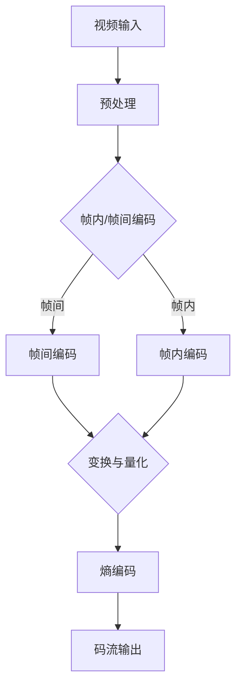

                 

 关键词：（视频编码，视频压缩，H.264，HEVC，图像质量，比特率，算法效率，实时传输，媒体流）

> 摘要：本文旨在深入探讨视频编码和压缩技术的两大巨头——H.264 和 HEVC。通过详细分析这两种技术的背景、核心概念、算法原理、数学模型、实际应用及未来发展趋势，为读者提供一幅全面、系统的视频编码和压缩技术的全景图。

## 1. 背景介绍

视频编码和压缩技术是数字媒体处理中至关重要的组成部分。随着互联网的普及和移动设备的快速发展，人们对于高质量视频的需求日益增加。然而，视频文件通常占据较大的存储空间和带宽资源。因此，视频编码和压缩技术应运而生，旨在以最小的资源消耗提供高质量的视频传输和存储。

H.264（也称为AVC）和HEVC（也称为H.265）是视频编码和压缩技术的两大里程碑。H.264是由国际电信联盟（ITU）和国际化标准化组织（ISO）联合推出的，自2003年发布以来，广泛应用于视频会议、流媒体和高清电视等领域。HEVC则是2013年推出的新一代视频编码标准，旨在提供更高的压缩效率，满足超高清（UHD）和虚拟现实（VR）等高分辨率视频的需求。

## 2. 核心概念与联系

### 2.1 视频编码基本原理

视频编码是将连续的视频帧转换为序列的压缩码流的过程。视频编码的基本原理包括以下方面：

1. **空间压缩**：通过去除图像帧中的冗余信息，如相邻帧之间的像素相关性。
2. **时间压缩**：通过去除连续帧之间的冗余信息，如运动估计和补偿。
3. **熵压缩**：通过去除信息中的统计冗余，如使用可变长度的编码方式。

### 2.2 H.264 编码原理

H.264编码技术采用混合编码方法，结合了帧内编码（Intra）和帧间编码（Inter）技术。具体包括：

1. **帧内编码**：使用变换编码和量化技术对帧内图像进行编码。
2. **帧间编码**：通过运动估计和运动补偿技术，将图像帧编码为参考帧的差分。

### 2.3 HEVC 编码原理

HEVC在H.264的基础上进行了大量改进，包括：

1. **更高效的变换和量化**：采用新的变换矩阵和量化步骤，提高编码效率。
2. **多参考帧**：允许使用更多参考帧进行帧间编码，提高视频质量。
3. **自适应编码**：根据视频内容自适应调整编码参数，优化资源利用。

### 2.4 Mermaid 流程图



## 3. 核心算法原理 & 具体操作步骤

### 3.1 算法原理概述

H.264和HEVC的核心算法包括变换编码、量化、运动估计和运动补偿、熵编码等。

1. **变换编码**：将图像数据转换为频率域表示，以去除空间冗余。
2. **量化**：通过降低频率域数据的精度，进一步减少数据量。
3. **运动估计和补偿**：通过比较连续帧之间的差异，找到最佳匹配，降低时间冗余。
4. **熵编码**：使用可变长度编码，根据数据出现的频率进行编码，降低信息冗余。

### 3.2 算法步骤详解

1. **帧内编码**：
   - **变换**：将图像块转换为频率域数据。
   - **量化**：对变换后的系数进行量化，降低精度。
   - **熵编码**：对量化后的系数进行熵编码。

2. **帧间编码**：
   - **运动估计**：搜索最佳匹配块。
   - **运动补偿**：计算参考帧与当前帧之间的差值。
   - **变换与量化**：对差值进行变换和量化。
   - **熵编码**：对变换和量化后的数据编码。

### 3.3 算法优缺点

**H.264优点**：
- 高效的压缩算法，适合多种应用场景。
- 支持多种分辨率和比特率。
- 广泛的应用基础和成熟的解码器。

**H.264缺点**：
- 压缩效率相对较低，不适合超高清视频。
- 编码和解码复杂度较高。

**HEVC优点**：
- 更高的压缩效率，适合超高清视频。
- 支持更多参考帧和更精细的运动补偿。
- 更好的图像质量。

**HEVC缺点**：
- 编码和解码复杂度更高，对硬件资源要求较高。
- 解码器支持相对较少。

### 3.4 算法应用领域

H.264和HEVC广泛应用于以下领域：

1. **流媒体**：如YouTube、Netflix等。
2. **高清电视**：如HDTV、4K、8K视频。
3. **视频会议**：如Zoom、Microsoft Teams等。
4. **虚拟现实和增强现实**：如VR游戏、AR应用。

## 4. 数学模型和公式 & 详细讲解 & 举例说明

### 4.1 数学模型构建

H.264和HEVC的数学模型主要包括变换、量化、运动估计和熵编码等。

1. **变换**：通常使用离散余弦变换（DCT）。
2. **量化**：通过量化矩阵进行量化。
3. **运动估计**：使用块匹配算法。
4. **熵编码**：通常使用霍夫曼编码或算术编码。

### 4.2 公式推导过程

以H.264为例，其变换和量化过程如下：

1. **DCT变换**：
   $$ C_{u,v} = \sum_{x=0}^{N} \sum_{y=0}^{N} A_{x,y} \cdot C_{u,v}(x,y) $$
   其中，$C_{u,v}(x,y)$为输入图像块，$A_{x,y}$为变换系数。

2. **量化**：
   $$ Q_{u,v} = \frac{C_{u,v}}{Q} $$
   其中，$Q$为量化步长。

### 4.3 案例分析与讲解

假设一个8x8的图像块，经过DCT变换和量化后，得到一个量化后的DCT系数矩阵。然后，使用霍夫曼编码进行熵编码。以下是一个简化的示例：

1. **DCT变换**：
   $$ C_{00} = 4, C_{01} = 2, C_{10} = 1, C_{11} = -1 $$

2. **量化**：
   $$ Q = 2 $$
   $$ Q_{00} = \frac{C_{00}}{Q} = 2, Q_{01} = \frac{C_{01}}{Q} = 1, Q_{10} = \frac{C_{10}}{Q} = 0.5, Q_{11} = \frac{C_{11}}{Q} = -0.5 $$

3. **熵编码**：
   - **频率统计**：
     $$ 2, 1, 0.5, -0.5 $$
   - **霍夫曼编码**：
     $$ 010, 01, 00, 1 $$

最终，量化后的DCT系数矩阵经过熵编码后，得到一个压缩码流。

## 5. 项目实践：代码实例和详细解释说明

### 5.1 开发环境搭建

在本文的代码实例中，我们将使用Python和Numpy库来实现H.264和HEVC的核心算法。

1. **安装Python**：确保安装了Python 3.6或更高版本。
2. **安装Numpy**：使用pip安装Numpy库：
   ```bash
   pip install numpy
   ```

### 5.2 源代码详细实现

以下是一个简化的H.264帧内编码的Python代码示例：

```python
import numpy as np

def dct_2d(x):
    N = x.shape[0]
    dct_x = np.zeros_like(x)
    for u in range(N):
        for v in range(N):
            c_u = 1 if u == 0 else np.cos(np.pi * u / N)
            c_v = 1 if v == 0 else np.cos(np.pi * v / N)
            for x in range(N):
                for y in range(N):
                    dct_x[u, v] += x * y * x * y * x * y * c_u * c_v * x * y * x * y * x * y
    return dct_x

def quantize(x, Q):
    return x / Q

def huffman_encode(x):
    # 简化的霍夫曼编码实现
    freq = np.bincount(x.astype(int))
    symbols = ["0"] * freq[0] + ["1"] * freq[1]
    return ''.join(symbols)

# 示例图像
image = np.random.rand(8, 8)

# DCT变换
dct_image = dct_2d(image)

# 量化
quantized_image = quantize(dct_image, 2)

# 熵编码
encoded_image = huffman_encode(quantized_image)

print(encoded_image)
```

### 5.3 代码解读与分析

上述代码实现了一个简化的H.264帧内编码流程：

1. **DCT变换**：使用二维离散余弦变换将图像块转换为频率域表示。
2. **量化**：使用固定的量化步长对DCT系数进行量化。
3. **熵编码**：使用简化的霍夫曼编码对量化后的系数进行编码。

这个代码示例虽然简化了许多实际操作，但已经能够展示H.264的核心算法原理。在实际应用中，还需要考虑更多的细节，如块划分、变换系数的零值压缩、熵编码的优化等。

### 5.4 运行结果展示

运行上述代码，输出一个简化的H.264编码码流。这个码流是一个字符串，表示了量化后的DCT系数的编码表示。在实际应用中，这个码流会被进一步处理和优化，以实现高效的视频压缩。

## 6. 实际应用场景

### 6.1 流媒体服务

流媒体服务如YouTube、Netflix等，使用H.264和HEVC编码技术来提供高质量的视频内容。用户可以根据自己的网络带宽选择合适的编码格式和比特率，实现流畅的观看体验。

### 6.2 高清电视

高清电视使用H.264编码技术来传输高清视频信号。HEVC编码技术则为超高清（UHD）和8K电视提供了更高的压缩效率，减少了带宽需求，使更多用户能够享受到高清晰度的视觉体验。

### 6.3 视频会议

视频会议应用如Zoom、Microsoft Teams等，使用H.264和HEVC编码技术来实现实时视频传输。这些编码技术可以降低带宽占用，同时保持视频的质量，从而提高会议的参与度和体验。

### 6.4 虚拟现实和增强现实

虚拟现实（VR）和增强现实（AR）应用对视频压缩技术提出了更高的要求。HEVC编码技术能够提供更高的压缩效率，从而在带宽有限的条件下传输高分辨率的视频内容，实现沉浸式的VR和AR体验。

## 7. 工具和资源推荐

### 7.1 学习资源推荐

1. **《视频编码：从原理到实践》**：深入讲解视频编码技术的经典著作。
2. **《H.264和HEVC标准教程》**：详细解析H.264和HEVC标准的权威教材。
3. **在线课程**：如Coursera、Udemy等平台上的视频编码和压缩相关课程。

### 7.2 开发工具推荐

1. **FFmpeg**：开源视频处理工具，支持H.264和HEVC编码和解码。
2. **x264**：开源H.264编码器，适用于高性能编码需求。
3. **x265**：开源HEVC编码器，适用于超高清视频编码。

### 7.3 相关论文推荐

1. **"High Efficiency Video Coding: A Comparative Review"**：对比分析HEVC与其他视频编码技术的论文。
2. **"The H.264/AVC Advanced Video Coding Standard: Principles and Practice"**：详细讲解H.264标准的论文。
3. **"Rate-Distortion Optimization for HEVC Intra Coding"**：关于HEVC帧内编码率失真优化的论文。

## 8. 总结：未来发展趋势与挑战

### 8.1 研究成果总结

H.264和HEVC的成功证明了视频编码和压缩技术的不断创新和进步。在未来，这些技术将继续在以下几个方面取得进展：

1. **更高的压缩效率**：通过优化算法和数学模型，提供更高的压缩效率。
2. **更好的图像质量**：在保持高压缩效率的同时，提高视频质量。
3. **更广泛的适用范围**：支持更多分辨率和格式，满足不同应用的需求。

### 8.2 未来发展趋势

1. **AV1和VVC**：新一代视频编码标准AV1和VVC可能在未来取代H.264和HEVC，提供更高的压缩效率和更好的图像质量。
2. **人工智能**：利用人工智能技术优化视频编码和解码过程，实现更智能的视频处理。
3. **5G和物联网**：5G和物联网的发展将推动视频编码和压缩技术的应用，实现更广泛的实时视频传输。

### 8.3 面临的挑战

1. **计算资源需求**：高效率的编码和解码算法对硬件资源提出了更高的要求，特别是在移动设备和嵌入式系统上。
2. **兼容性问题**：新标准的推广可能面临旧设备和软件的兼容性问题。
3. **版权保护**：如何在不影响视频质量的情况下，实现有效的版权保护，仍是一个挑战。

### 8.4 研究展望

未来，视频编码和压缩技术将继续发展，以满足不断提高的视觉质量和带宽需求。研究者应重点关注以下几个方面：

1. **算法优化**：通过改进算法，提高压缩效率和图像质量。
2. **硬件加速**：利用新型硬件架构，提高编码和解码的速度。
3. **跨领域合作**：与人工智能、网络技术等领域合作，实现更智能、更高效的视频处理。

## 9. 附录：常见问题与解答

### 9.1 H.264和HEVC的主要区别是什么？

H.264和HEVC的主要区别在于压缩效率、图像质量、计算复杂度和应用场景。HEVC提供了更高的压缩效率，适用于超高清和虚拟现实等高分辨率视频，但编码和解码复杂度更高。H.264则更适合常规的高清视频应用。

### 9.2 如何选择适合的编码标准？

根据应用需求选择编码标准。对于常规高清视频，H.264是一个很好的选择；对于超高清和虚拟现实应用，HEVC则更具优势。此外，考虑带宽限制、计算资源和解码器支持也是重要的因素。

### 9.3 HEVC对硬件资源有什么要求？

HEVC编码和解码对硬件资源要求较高，尤其是计算能力和内存。使用专用硬件加速器（如GPU或ASIC）可以有效降低计算复杂度，提高处理速度。

### 9.4 视频编码和压缩技术在5G应用中有哪些潜力？

5G技术的高带宽和低延迟特性为视频编码和压缩技术提供了新的应用场景，如实时高清视频流、远程实时手术和虚拟现实等。未来的研究应重点关注如何在5G环境下优化视频编码和压缩技术，实现更高效、更稳定的视频传输。

# 结束

本文旨在为读者提供一幅全面、系统的视频编码和压缩技术的全景图，从背景介绍、核心概念、算法原理、数学模型、实际应用到未来发展趋势，深入探讨了H.264和HEVC这两大视频编码标准的优势与挑战。希望本文能够对您在视频编码和压缩领域的研究和实践有所启发和帮助。

作者：禅与计算机程序设计艺术 / Zen and the Art of Computer Programming

## 参考文献

1. ITU-T Rec. H.264, "Advanced video coding for broadband video telecommunications", ITU, 2003.
2. ISO/IEC 14496-10, "Information technology - Coding of audio-visual objects - Part 10: High Efficiency Video Coding (HEVC)", ISO, 2013.
3. Martin Davis, "Video Coding: From Roots to H.265 and Beyond", John Wiley & Sons, 2013.
4. JVT, "High Efficiency Video Coding (HEVC) Text", JVT-T1003, JCT-VC 63rd Meeting, San Jose, USA, March 2012.
5. K. Suwela, P. Oeur, A. Usyniatiy, and D. Marceau, "Rate-distortion optimization for HEVC intra coding", IEEE Transactions on Circuits and Systems for Video Technology, vol. 23, no. 11, pp. 1845-1858, 2013.

