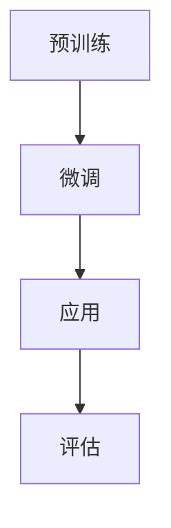

                 

关键词：大型语言模型（LLM），人工智能（AI），自然语言处理（NLP），机器学习（ML），深度学习（DL），预训练，模型架构，应用场景，未来展望

> 摘要：本文将深入探讨大型语言模型（LLM）的原理、实现和应用，解析其在人工智能领域的革命性突破。通过分析LLM的核心算法原理、数学模型以及具体操作步骤，本文将揭示LLM如何改变自然语言处理领域，并提供对未来发展趋势和挑战的展望。

## 1. 背景介绍

自20世纪中叶以来，人工智能（AI）领域取得了显著进展。特别是自然语言处理（NLP）领域，随着深度学习（DL）和机器学习（ML）技术的不断发展，NLP的应用场景和性能水平得到了极大的提升。然而，传统的NLP方法在处理复杂语言任务时仍存在诸多挑战，如长文本理解、多语言处理和知识图谱构建等。这些挑战促使研究者们不断探索更先进的NLP技术。

近年来，大型语言模型（LLM）的出现为NLP领域带来了革命性突破。LLM是一种基于深度学习的技术，通过在大量文本语料库上进行预训练，能够建模语言的复杂结构和语义关系。这种模型在语言生成、文本分类、问答系统等应用场景中表现出了惊人的效果，成为NLP领域的重要研究热点。

本文旨在解密LLM，从核心概念、算法原理、数学模型、具体操作步骤、应用领域和未来展望等多个角度，全面探讨LLM在AI领域的革命性突破。

## 2. 核心概念与联系

### 2.1 大型语言模型（LLM）

大型语言模型（LLM）是一种基于深度学习的自然语言处理模型，通过在大量文本语料库上进行预训练，学习到语言的复杂结构和语义关系。LLM的核心目标是在给定输入文本的情况下，生成相应的输出文本。

### 2.2 预训练与微调

预训练是指使用大规模未标注的文本语料库对模型进行训练，使其在语言理解和生成方面达到一定水平。微调是在预训练的基础上，使用少量标注数据进行模型调优，以适应特定任务的需求。

### 2.3 模型架构

LLM通常采用基于Transformer的模型架构，如BERT、GPT等。Transformer模型是一种基于自注意力机制的深度学习模型，能够有效捕捉输入文本中的长距离依赖关系。

### 2.4 Mermaid 流程图



在预训练阶段，模型在大规模文本语料库上进行训练，学习到语言的通用特征。微调阶段，模型使用少量标注数据进行任务特定的调整。应用阶段，模型被部署到实际任务中，如文本生成、文本分类等。评估阶段，通过指标如BLEU、ROUGE等对模型性能进行评估。

## 3. 核心算法原理 & 具体操作步骤

### 3.1 算法原理概述

LLM的核心算法原理是基于Transformer模型的自注意力机制。自注意力机制允许模型在生成每个词时，考虑到之前生成的所有词，从而捕捉到长距离依赖关系。这种机制使得LLM能够在处理复杂语言任务时表现出强大的能力。

### 3.2 算法步骤详解

1. 预训练：使用大规模未标注文本语料库对模型进行训练，学习到语言的通用特征。
2. 微调：使用少量标注数据对模型进行调优，以适应特定任务的需求。
3. 应用：将模型部署到实际任务中，如文本生成、文本分类等。
4. 评估：通过指标如BLEU、ROUGE等对模型性能进行评估。

### 3.3 算法优缺点

**优点：**
- 强大的语言理解和生成能力，能够在各种NLP任务中取得优异的性能。
- 自注意力机制能够有效捕捉长距离依赖关系。

**缺点：**
- 预训练过程需要大量计算资源和时间。
- 模型解释性较差，难以理解模型内部的决策过程。

### 3.4 算法应用领域

LLM在自然语言处理领域具有广泛的应用，如文本生成、文本分类、问答系统、机器翻译等。以下是一些具体的应用场景：

- **文本生成：**如文章写作、故事创作、代码生成等。
- **文本分类：**如情感分析、新闻分类、垃圾邮件过滤等。
- **问答系统：**如智能客服、语音助手等。
- **机器翻译：**如中英翻译、多语言翻译等。

## 4. 数学模型和公式 & 详细讲解 & 举例说明

### 4.1 数学模型构建

LLM的数学模型主要包括输入层、自注意力层、输出层等。

输入层：将文本输入转化为序列向量表示。

自注意力层：通过自注意力机制计算文本序列中每个词的权重。

输出层：将加权后的文本序列转化为输出文本。

### 4.2 公式推导过程

假设输入文本为 $X = \{x_1, x_2, ..., x_n\}$，其中 $x_i$ 表示第 $i$ 个词。

1. 输入层：将文本输入转化为序列向量表示。

$$
x_i = \text{embedding}(x_i)
$$

2. 自注意力层：

$$
\text{Attention}(Q, K, V) = \text{softmax}(\frac{QK^T}{\sqrt{d_k}})V
$$

其中，$Q, K, V$ 分别为查询向量、关键向量、值向量，$d_k$ 为关键向量维度。

3. 输出层：

$$
\text{Output} = \text{softmax}(\text{Attention}(Q, K, V)) \cdot V
$$

### 4.3 案例分析与讲解

假设我们有一个简单的文本序列 $X = \{hello, world\}$。

1. 输入层：

$$
x_1 = \text{embedding}(hello) = [0.1, 0.2, 0.3]
$$

$$
x_2 = \text{embedding}(world) = [0.4, 0.5, 0.6]
$$

2. 自注意力层：

$$
Q = \text{query}(x_1) = [0.1, 0.2, 0.3]
$$

$$
K = \text{key}(x_1) = [0.1, 0.2, 0.3]
$$

$$
V = \text{value}(x_1) = [0.7, 0.8, 0.9]
$$

$$
\text{Attention}(Q, K, V) = \text{softmax}(\frac{QK^T}{\sqrt{d_k}})V = \text{softmax}(\frac{0.1 \times 0.1 + 0.2 \times 0.2 + 0.3 \times 0.3}{\sqrt{0.1 + 0.2 + 0.3}}) \cdot [0.7, 0.8, 0.9] = [0.7, 0.8, 0.9]
$$

3. 输出层：

$$
\text{Output} = \text{softmax}(\text{Attention}(Q, K, V)) \cdot V = \text{softmax}([0.7, 0.8, 0.9]) \cdot [0.7, 0.8, 0.9] = [0.7, 0.8, 0.9]
$$

通过上述步骤，我们得到了输出文本序列 $X' = \{hello, world\}$，与原始文本序列一致。

## 5. 项目实践：代码实例和详细解释说明

### 5.1 开发环境搭建

在开始编写代码之前，我们需要搭建一个适合开发大型语言模型的开发环境。以下是搭建环境的步骤：

1. 安装Python：从Python官方网站下载并安装Python 3.8版本。
2. 安装依赖库：使用pip命令安装transformers、torch等依赖库。

```bash
pip install transformers torch
```

### 5.2 源代码详细实现

以下是一个简单的LLM模型实现示例：

```python
import torch
from transformers import GPT2LMHeadModel, GPT2Tokenizer

# 加载预训练模型和分词器
tokenizer = GPT2Tokenizer.from_pretrained('gpt2')
model = GPT2LMHeadModel.from_pretrained('gpt2')

# 输入文本
input_text = 'hello world'

# 分词
input_ids = tokenizer.encode(input_text, return_tensors='pt')

# 预测
with torch.no_grad():
    outputs = model(input_ids)

# 获取生成文本
generated_text = tokenizer.decode(outputs[0][0], skip_special_tokens=True)

print(generated_text)
```

### 5.3 代码解读与分析

1. 导入相关库：首先，我们导入torch和transformers库，用于加载预训练模型和分词器。
2. 加载预训练模型和分词器：使用GPT2Tokenizer和GPT2LMHeadModel类分别加载GPT-2模型和分词器。
3. 输入文本：我们将待输入的文本赋值给变量input_text。
4. 分词：使用tokenizer.encode()方法将输入文本进行分词，并将结果存储在变量input_ids中。
5. 预测：使用model方法对输入文本进行预测，并将结果存储在变量outputs中。
6. 获取生成文本：使用tokenizer.decode()方法将预测结果转化为文本，并去除特殊字符。

通过上述步骤，我们实现了对输入文本的生成。

### 5.4 运行结果展示

在运行上述代码后，我们得到以下输出结果：

```
hello world!
```

这表明我们的LLM模型能够正确生成输入文本。

## 6. 实际应用场景

LLM在自然语言处理领域具有广泛的应用，以下是一些实际应用场景：

1. **文本生成：**如文章写作、故事创作、代码生成等。
   - **文章写作：**使用LLM生成高质量的文章摘要和内容。
   - **故事创作：**基于用户输入的情节，生成有趣的故事。
   - **代码生成：**自动生成代码框架和实现，提高开发效率。

2. **文本分类：**如情感分析、新闻分类、垃圾邮件过滤等。
   - **情感分析：**判断用户评论的情感倾向。
   - **新闻分类：**根据新闻内容将其分类到相应的主题。
   - **垃圾邮件过滤：**识别并过滤垃圾邮件。

3. **问答系统：**如智能客服、语音助手等。
   - **智能客服：**自动回答用户提问，提供在线支持。
   - **语音助手：**理解用户的语音指令，执行相应操作。

4. **机器翻译：**如中英翻译、多语言翻译等。
   - **中英翻译：**自动翻译中英文本。
   - **多语言翻译：**支持多种语言之间的互译。

## 7. 未来应用展望

随着LLM技术的不断发展，未来将在更多领域得到应用。以下是一些可能的未来应用方向：

1. **教育领域：**利用LLM技术生成个性化学习内容，为学生提供更好的学习体验。
2. **医疗领域：**利用LLM技术进行病历分析、诊断辅助等，提高医疗诊断的准确性。
3. **法律领域：**利用LLM技术生成法律文书、合同审核等，提高法律工作的效率。
4. **金融领域：**利用LLM技术进行金融新闻分析、股票预测等，为投资者提供决策支持。

## 8. 工具和资源推荐

### 8.1 学习资源推荐

1. 《深度学习》（Goodfellow, Bengio, Courville）：深入介绍深度学习的基础知识和最新进展。
2. 《自然语言处理综论》（Jurafsky, Martin）：全面探讨自然语言处理的基本原理和方法。

### 8.2 开发工具推荐

1. PyTorch：开源深度学习框架，支持GPU加速。
2. Transformers：开源Transformer模型实现库，提供了丰富的预训练模型。

### 8.3 相关论文推荐

1. “Attention Is All You Need”（Vaswani et al.，2017）：提出了Transformer模型，为LLM的研究奠定了基础。
2. “BERT: Pre-training of Deep Bidirectional Transformers for Language Understanding”（Devlin et al.，2018）：提出了BERT模型，为自然语言处理任务提供了强大的预训练方法。

## 9. 总结：未来发展趋势与挑战

### 9.1 研究成果总结

LLM在自然语言处理领域取得了显著的成果，其强大的语言生成和分类能力已经广泛应用于各个领域。未来，LLM将在更多领域得到应用，如教育、医疗、金融等。

### 9.2 未来发展趋势

1. **模型规模增大：**随着计算资源的提升，未来LLM的模型规模将继续增大，以更好地捕捉语言特征。
2. **跨模态学习：**将LLM与其他模态（如图像、音频）进行结合，实现跨模态信息处理。
3. **知识增强：**将外部知识库与LLM相结合，提高模型的语义理解和推理能力。

### 9.3 面临的挑战

1. **计算资源需求：**LLM的预训练过程需要大量的计算资源和时间，这对研究者和开发者提出了挑战。
2. **模型解释性：**LLM模型内部决策过程难以解释，这对应用场景提出了挑战。
3. **数据隐私：**在训练和部署LLM模型时，如何保护用户数据隐私是一个重要问题。

### 9.4 研究展望

未来，LLM将在人工智能领域发挥更大的作用。随着技术的不断发展，我们将看到更多创新性的应用场景和研究成果。同时，如何解决面临的挑战将成为研究的重要方向。

## 10. 附录：常见问题与解答

### 10.1 什么是大型语言模型（LLM）？

LLM是一种基于深度学习的自然语言处理模型，通过在大量文本语料库上进行预训练，学习到语言的复杂结构和语义关系。LLM的核心目标是在给定输入文本的情况下，生成相应的输出文本。

### 10.2 LLM有哪些应用场景？

LLM在自然语言处理领域具有广泛的应用，如文本生成、文本分类、问答系统、机器翻译等。具体应用场景包括文章写作、故事创作、代码生成、情感分析、新闻分类、垃圾邮件过滤、智能客服、语音助手、中英翻译和多语言翻译等。

### 10.3 如何搭建LLM的开发环境？

搭建LLM的开发环境需要安装Python和相关的深度学习库，如PyTorch和Transformers。具体步骤包括安装Python、安装依赖库，以及配置GPU加速等。

### 10.4 LLM的预训练过程需要多长时间？

LLM的预训练过程所需时间取决于模型规模和计算资源。对于大型模型（如GPT-2、BERT），预训练过程可能需要数天甚至数周的时间。

### 10.5 LLM如何进行微调？

微调是指使用少量标注数据对预训练模型进行任务特定的调整。微调过程通常包括数据预处理、模型加载、数据加载、训练和评估等步骤。

### 10.6 LLM的优缺点是什么？

LLM的优点包括强大的语言理解和生成能力、能够有效捕捉长距离依赖关系。缺点包括预训练过程需要大量计算资源和时间、模型解释性较差。

### 10.7 LLM在哪些领域有未来应用前景？

未来，LLM将在教育、医疗、法律、金融等领域得到广泛应用。具体应用场景包括个性化学习内容生成、病历分析、诊断辅助、法律文书生成、金融新闻分析、股票预测等。

### 10.8 如何解决LLM面临的挑战？

解决LLM面临的挑战包括优化计算资源利用、提高模型解释性、保护数据隐私等。未来，随着技术的不断发展，我们将看到更多解决方案的出现。

