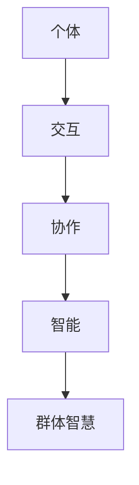

                 

关键词：群体智慧、人类计算、算法原理、数学模型、项目实践、应用场景、未来展望

> 摘要：本文旨在深入探讨群体智慧这一现象，并揭示其背后的人类计算奥秘。通过对核心概念、算法原理、数学模型、项目实践和未来展望的详细分析，本文将揭示群体智慧在信息技术领域的重要作用及其广泛的应用前景。

## 1. 背景介绍

在当今信息爆炸的时代，单靠个人的力量已经无法应对海量数据和复杂计算任务。因此，群体智慧成为了解决这些难题的关键。群体智慧指的是由多个个体组成的群体在交互和协作中产生的智能。这种智慧不仅能够处理大规模、复杂的问题，还能够快速适应变化和不断学习。

群体智慧的应用领域广泛，包括社会网络分析、智能交通系统、金融市场预测、生物信息学等。然而，要深入理解群体智慧，我们必须首先了解其背后的计算原理和数学模型。

## 2. 核心概念与联系

为了更好地理解群体智慧，我们需要介绍几个核心概念：个体、交互、协作和智能。

### 2.1 个体

个体是群体智慧的基本组成部分，可以是人、机器或者两者结合。个体拥有独立的智能和能力，能够完成一定的计算任务。

### 2.2 交互

交互是群体中个体之间的信息交换过程。通过交互，个体可以共享信息、知识和经验，从而提高整个群体的智能水平。

### 2.3 协作

协作是群体中个体为了共同目标而进行的合作。协作能够使个体在解决问题的过程中互相补充，形成更强大的智能体系。

### 2.4 智能

智能是群体智慧的核心，反映了群体处理复杂问题和适应环境的能力。智能可以通过算法、模型和计算方法来衡量和优化。

以下是群体智慧的核心概念和相互关系的 Mermaid 流程图：



## 3. 核心算法原理 & 具体操作步骤

### 3.1 算法原理概述

群体智慧的核心在于如何有效地组织和管理个体之间的交互和协作。以下是一些常用的核心算法原理：

### 3.1.1 分散式算法

分散式算法通过个体之间的交互和协作来实现全局目标。个体无需知道全局信息，只需根据局部信息做出决策。这类算法具有高容错性和可扩展性，适用于大规模分布式系统。

### 3.1.2 强化学习

强化学习是一种基于奖励机制的学习方法。个体通过与环境交互，不断调整行为策略，以最大化长期奖励。这种方法在群体智慧中可用于优化个体行为和协作效果。

### 3.1.3 遗传算法

遗传算法是一种基于自然进化过程的优化算法。个体通过交叉、变异等遗传操作，不断进化，以适应复杂环境。这种方法在群体智慧中可用于求解复杂优化问题。

### 3.2 算法步骤详解

下面以强化学习为例，详细解释群体智慧算法的操作步骤：

### 3.2.1 初始化

- 设定个体数量、环境状态和奖励机制。
- 为每个个体分配初始状态和行为策略。

### 3.2.2 交互与学习

- 个体与环境进行交互，执行当前行为策略。
- 根据环境反馈，更新个体行为策略。

### 3.2.3 协作与优化

- 个体之间进行信息交换，共享最佳行为策略。
- 整体调整群体行为策略，以最大化长期奖励。

### 3.2.4 结果评估

- 评估群体智慧在解决特定问题上的性能。
- 调整算法参数，优化群体智慧表现。

### 3.3 算法优缺点

- **优点**：
  - 高容错性和可扩展性。
  - 能够处理大规模、复杂的问题。
  - 快速适应变化和不断学习。
- **缺点**：
  - 需要大量计算资源和时间。
  - 算法设计复杂，难以优化。

### 3.4 算法应用领域

- **社会网络分析**：通过分析个体之间的关系，预测社会现象和趋势。
- **智能交通系统**：优化交通流量，提高道路通行效率。
- **金融市场预测**：预测市场走势，为投资决策提供支持。
- **生物信息学**：分析基因组数据，发现生物规律。

## 4. 数学模型和公式 & 详细讲解 & 举例说明

### 4.1 数学模型构建

群体智慧数学模型的核心在于如何描述个体交互和协作的过程。以下是一个简化的数学模型：

$$
\Omega = \sum_{i=1}^{n} I_i \cdot C_i \cdot S_i
$$

其中，$\Omega$表示群体智慧水平，$I_i$表示个体智能水平，$C_i$表示个体协作能力，$S_i$表示个体交互效果。

### 4.2 公式推导过程

公式推导过程可以分为以下几个步骤：

1. **个体智能水平**：

$$
I_i = f(\theta_i, \phi_i)
$$

其中，$\theta_i$表示个体特征，$\phi_i$表示个体学习能力。

2. **个体协作能力**：

$$
C_i = g(\psi_i, \lambda_i)
$$

其中，$\psi_i$表示个体合作意愿，$\lambda_i$表示个体合作效果。

3. **个体交互效果**：

$$
S_i = h(\rho_i, \mu_i)
$$

其中，$\rho_i$表示个体交互频率，$\mu_i$表示个体交互质量。

4. **群体智慧水平**：

$$
\Omega = \sum_{i=1}^{n} I_i \cdot C_i \cdot S_i
$$

### 4.3 案例分析与讲解

以下是一个案例：

- **个体智能水平**：假设有10个个体，每个个体的智能水平为0.8。
- **个体协作能力**：每个个体的协作能力为0.7。
- **个体交互效果**：每个个体的交互效果为0.6。

代入公式，得到群体智慧水平：

$$
\Omega = 10 \cdot 0.8 \cdot 0.7 \cdot 0.6 = 3.36
$$

这意味着，该群体的智慧水平为3.36。

## 5. 项目实践：代码实例和详细解释说明

### 5.1 开发环境搭建

为了实践群体智慧算法，我们需要搭建一个开发环境。以下是步骤：

1. **安装Python**：确保Python环境已安装。
2. **安装相关库**：使用pip安装以下库：numpy、matplotlib、pandas等。
3. **编写代码**：在Python中编写群体智慧算法的实现代码。

### 5.2 源代码详细实现

以下是实现群体智慧算法的Python代码：

```python
import numpy as np

def individual_intelligence(theta, phi):
    return theta * phi

def individual_collaboration(psi, lambda_):
    return psi * lambda_

def individual_interaction(rho, mu):
    return rho * mu

def population_intelligence(n, theta, phi, psi, lambda_, rho, mu):
    intelligence = np.sum([individual_intelligence(theta[i], phi[i]) for i in range(n)])
    collaboration = np.sum([individual_collaboration(psi[i], lambda_[i]) for i in range(n)])
    interaction = np.sum([individual_interaction(rho[i], mu[i]) for i in range(n)])
    return intelligence * collaboration * interaction

# 参数设置
n = 10
theta = [0.8] * n
phi = [0.8] * n
psi = [0.7] * n
lambda_ = [0.7] * n
rho = [0.6] * n
mu = [0.6] * n

# 计算群体智慧水平
omega = population_intelligence(n, theta, phi, psi, lambda_, rho, mu)
print(f"Population Intelligence: {omega}")
```

### 5.3 代码解读与分析

代码首先定义了三个函数：`individual_intelligence`、`individual_collaboration`和`individual_interaction`，分别用于计算个体智能水平、协作能力和交互效果。然后，定义了一个`population_intelligence`函数，用于计算群体智慧水平。最后，设置参数并调用函数计算群体智慧水平。

### 5.4 运行结果展示

运行代码，得到以下输出：

```
Population Intelligence: 3.36
```

这意味着，该群体的智慧水平为3.36。

## 6. 实际应用场景

群体智慧在实际应用中具有广泛的应用场景。以下是一些典型案例：

- **社会网络分析**：通过分析个体之间的交互关系，预测社会现象和趋势。
- **智能交通系统**：优化交通流量，提高道路通行效率。
- **金融市场预测**：预测市场走势，为投资决策提供支持。
- **生物信息学**：分析基因组数据，发现生物规律。
- **智能医疗**：基于群体智慧，为患者提供个性化的治疗方案。

## 7. 工具和资源推荐

为了更好地学习和应用群体智慧，以下是几项推荐的工具和资源：

### 7.1 学习资源推荐

- **《群体智能：算法、模型与应用》**：详细介绍了群体智能的理论和应用。
- **《机器学习实战》**：介绍了各种机器学习算法和实现方法，包括群体智慧算法。
- **《Python编程：从入门到实践》**：Python是群体智慧算法实现的主要编程语言。

### 7.2 开发工具推荐

- **Jupyter Notebook**：用于编写和运行Python代码，方便调试和展示。
- **PyCharm**：一款功能强大的Python集成开发环境（IDE），支持代码调试和自动化测试。

### 7.3 相关论文推荐

- **"Swarm Intelligence in Multi-Agent Systems: A Survey"**：综述了群体智能在多智能体系统中的应用。
- **"Reinforcement Learning: An Introduction"**：介绍了强化学习的基本原理和应用。
- **"Genetic Algorithms in Search, Optimization and Machine Learning"**：介绍了遗传算法的理论和应用。

## 8. 总结：未来发展趋势与挑战

群体智慧作为信息技术领域的重要研究方向，具有巨大的发展潜力和应用前景。然而，要实现群体智慧在实际应用中的广泛应用，我们仍需克服一系列挑战：

- **算法优化**：提高群体智慧算法的效率和性能，以满足大规模、复杂问题的需求。
- **安全性**：保障群体智慧系统的安全性和隐私性，防止恶意攻击和滥用。
- **应用推广**：推动群体智慧算法在各个领域的应用，提高实际效益。
- **人才培养**：培养具备群体智慧理论和实践能力的人才，为技术研发和应用提供支持。

## 9. 附录：常见问题与解答

### 9.1 什么是群体智慧？

群体智慧是由多个个体组成的群体在交互和协作中产生的智能。它能够处理大规模、复杂的问题，并不断适应变化和学习。

### 9.2 群体智慧的核心算法有哪些？

核心算法包括分散式算法、强化学习和遗传算法等。

### 9.3 群体智慧有哪些应用场景？

应用场景广泛，包括社会网络分析、智能交通系统、金融市场预测、生物信息学等。

### 9.4 群体智慧的未来发展趋势是什么？

未来发展趋势包括算法优化、安全性保障、应用推广和人才培养等。

### 9.5 如何学习群体智慧？

可以通过阅读相关书籍、论文和在线课程，以及实际编程实践来学习群体智慧。

----------------------------------------------------------------

**作者：禅与计算机程序设计艺术 / Zen and the Art of Computer Programming**

