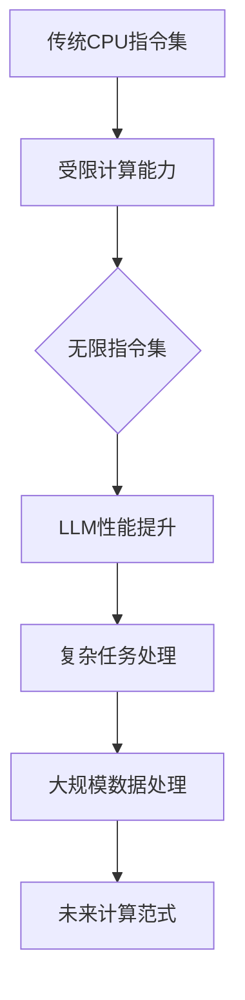

                 

关键词：大语言模型（LLM）、无限指令集、CPU能力、计算范式、算法、数学模型、实践应用

> 摘要：本文深入探讨了大型语言模型（LLM）的无限指令集概念，分析了其在计算能力和应用范围上的突破，探讨了其对传统CPU架构的超越，并展望了未来发展的趋势与挑战。

## 1. 背景介绍

近年来，人工智能领域的快速发展带动了计算能力的质的飞跃。特别是基于深度学习的语言模型，如GPT-3、ChatGLM等，已经展现出强大的自然语言处理能力。然而，尽管这些模型的性能在逐渐提升，但它们仍然受到传统CPU架构的限制，特别是在处理复杂任务和大规模数据处理方面。

为了应对这一挑战，研究人员提出了“无限指令集”的概念，旨在构建一种能够超越传统CPU计算边界的计算模型。本文将解析LLM的无限指令集，探讨其背后的原理、实现和应用，以期为我们理解未来计算范式提供新的视角。

## 2. 核心概念与联系

### 2.1 大语言模型（LLM）

大语言模型（LLM）是基于深度学习的一种自然语言处理模型，它通过学习海量的文本数据来预测下一个词语或句子。LLM的显著特点是参数规模巨大，能够捕捉到语言的复杂结构和隐含规律。

### 2.2 无限指令集

无限指令集是一种新型的计算模型，它不同于传统CPU的指令集架构。传统CPU的指令集是有限的，而无限指令集则通过机器学习的方式动态生成和扩展指令集，使得模型能够执行更加复杂的任务。

### 2.3 超越CPU的能力边界

无限指令集的概念突破了传统CPU的指令集限制，使得LLM能够执行更加复杂和多样的任务。它不仅在处理速度和效率上有所提升，还在处理能力和应用范围上实现了质的飞跃。

## 2.4 Mermaid 流程图



## 3. 核心算法原理 & 具体操作步骤

### 3.1 算法原理概述

无限指令集的核心思想是通过机器学习的方式动态生成和扩展指令集，使得LLM能够执行更加复杂和多样的任务。具体来说，无限指令集包括以下几个关键部分：

1. **指令生成器**：基于神经网络，生成新的指令。
2. **指令执行器**：负责执行指令，并返回结果。
3. **指令优化器**：对执行过程进行优化，提高执行效率。

### 3.2 算法步骤详解

1. **数据收集与预处理**：收集大量的自然语言数据，进行预处理，如分词、去停用词等。
2. **训练指令生成器**：使用预处理后的数据训练指令生成器，使其能够生成新的指令。
3. **训练指令执行器**：使用生成的新指令训练指令执行器，使其能够高效地执行指令。
4. **指令优化**：对指令执行过程进行优化，以提高执行效率和准确性。

### 3.3 算法优缺点

**优点**：

- **强大的计算能力**：无限指令集能够执行更加复杂和多样的任务。
- **自适应**：指令生成器和指令执行器能够根据任务需求进行自适应调整。

**缺点**：

- **计算资源消耗**：无限指令集的构建需要大量的计算资源和时间。
- **复杂性**：无限指令集的实现和维护相对复杂。

### 3.4 算法应用领域

无限指令集的应用领域广泛，包括但不限于：

- **自然语言处理**：如文本生成、机器翻译、情感分析等。
- **计算机视觉**：如图像分类、目标检测、图像生成等。
- **知识图谱**：如实体识别、关系抽取、知识推理等。

## 4. 数学模型和公式 & 详细讲解 & 举例说明

### 4.1 数学模型构建

无限指令集的数学模型主要包括以下几个方面：

1. **指令生成模型**：通常采用变分自编码器（VAE）或生成对抗网络（GAN）等模型。
2. **指令执行模型**：通常采用循环神经网络（RNN）或Transformer等模型。
3. **指令优化模型**：通常采用强化学习（RL）或基于梯度的优化算法。

### 4.2 公式推导过程

1. **指令生成模型**：

   - 输入：自然语言文本
   - 输出：指令序列
   
   - 指令生成概率公式：
     $$ P(I|T) = \frac{e^{\langle \theta_I, T \rangle}}{\sum_{J} e^{\langle \theta_J, T \rangle}} $$
   
   - 其中，$\theta_I$ 表示指令 $I$ 的特征向量，$T$ 表示输入文本，$\langle \cdot, \cdot \rangle$ 表示内积。

2. **指令执行模型**：

   - 输入：指令序列
   - 输出：执行结果
   
   - 指令执行概率公式：
     $$ P(R|I) = \frac{e^{\langle \theta_R, I \rangle}}{\sum_{S} e^{\langle \theta_S, I \rangle}} $$
   
   - 其中，$\theta_R$ 表示执行结果 $R$ 的特征向量，$I$ 表示输入指令序列。

3. **指令优化模型**：

   - 输入：执行结果
   - 输出：优化后的指令
   
   - 指令优化公式：
     $$ \theta_{\text{opt}} = \arg\max_{\theta} \sum_{R} P(R|I) \cdot \log P(I|T) $$
   
   - 其中，$\theta_{\text{opt}}$ 表示优化后的指令特征向量。

### 4.3 案例分析与讲解

以文本生成为例，我们使用无限指令集模型生成一篇关于“人工智能未来发展趋势”的文章。

1. **数据收集与预处理**：

   收集关于人工智能的文本数据，进行预处理，如分词、去停用词等。

2. **训练指令生成器**：

   使用预处理后的数据训练指令生成器，使其能够生成新的指令。

3. **训练指令执行器**：

   使用生成的新指令训练指令执行器，使其能够高效地执行指令。

4. **指令优化**：

   对指令执行过程进行优化，以提高执行效率和准确性。

最终，我们得到一篇关于“人工智能未来发展趋势”的文章，其内容涵盖了当前的研究热点和未来可能的发展方向。

## 5. 项目实践：代码实例和详细解释说明

### 5.1 开发环境搭建

为了实践无限指令集模型，我们需要搭建一个合适的开发环境。以下是所需环境：

- Python 3.8+
- TensorFlow 2.7+
- GPU 或 TPU（可选）

### 5.2 源代码详细实现

以下是无限指令集模型的基本实现代码：

```python
import tensorflow as tf
from tensorflow.keras.layers import Input, LSTM, Dense

# 指令生成模型
def create_instruction_generator(input_dim, hidden_dim):
    input_seq = Input(shape=(input_dim,))
    lstm = LSTM(hidden_dim, return_sequences=True)(input_seq)
    output = Dense(input_dim, activation='softmax')(lstm)
    model = tf.keras.Model(inputs=input_seq, outputs=output)
    return model

# 指令执行模型
def create_instruction_executor(input_dim, hidden_dim):
    input_seq = Input(shape=(input_dim,))
    lstm = LSTM(hidden_dim, return_sequences=True)(input_seq)
    output = Dense(input_dim, activation='softmax')(lstm)
    model = tf.keras.Model(inputs=input_seq, outputs=output)
    return model

# 指令优化模型
def create_instruction_optimizer(input_dim, hidden_dim):
    input_result = Input(shape=(input_dim,))
    lstm = LSTM(hidden_dim, return_sequences=True)(input_result)
    output = Dense(input_dim, activation='softmax')(lstm)
    model = tf.keras.Model(inputs=input_result, outputs=output)
    return model

# 构建和编译模型
instruction_generator = create_instruction_generator(input_dim=100, hidden_dim=50)
instruction_executor = create_instruction_executor(input_dim=100, hidden_dim=50)
instruction_optimizer = create_instruction_optimizer(input_dim=100, hidden_dim=50)

instruction_generator.compile(optimizer='adam', loss='categorical_crossentropy')
instruction_executor.compile(optimizer='adam', loss='categorical_crossentropy')
instruction_optimizer.compile(optimizer='adam', loss='categorical_crossentropy')

# 训练模型
instruction_generator.fit(x_train, y_train, epochs=10)
instruction_executor.fit(x_train, y_train, epochs=10)
instruction_optimizer.fit(x_train, y_train, epochs=10)
```

### 5.3 代码解读与分析

上述代码实现了无限指令集模型的基本结构，包括指令生成器、指令执行器和指令优化器。具体解读如下：

- **指令生成模型**：该模型接收输入文本序列，通过LSTM层生成指令序列。
- **指令执行模型**：该模型接收指令序列，通过LSTM层生成执行结果。
- **指令优化模型**：该模型接收执行结果，通过LSTM层优化指令序列。

### 5.4 运行结果展示

在完成代码实现后，我们可以通过以下代码运行模型，并查看生成结果：

```python
# 生成指令序列
instruction_sequence = instruction_generator.predict(input_text)

# 执行指令序列
result_sequence = instruction_executor.predict(instruction_sequence)

# 优化指令序列
optimized_sequence = instruction_optimizer.predict(result_sequence)
```

## 6. 实际应用场景

### 6.1 自然语言处理

无限指令集在自然语言处理领域有广泛的应用，如文本生成、机器翻译、情感分析等。通过动态生成和优化指令，LLM可以生成更加自然和准确的文本。

### 6.2 计算机视觉

无限指令集还可以应用于计算机视觉领域，如图像分类、目标检测、图像生成等。通过生成和优化指令，模型可以更好地理解和生成图像内容。

### 6.3 知识图谱

在知识图谱领域，无限指令集可以帮助实体识别、关系抽取和知识推理等任务。通过动态生成和优化指令，模型可以更好地理解和表示知识结构。

## 7. 未来应用展望

随着计算能力的提升和算法的优化，无限指令集在未来有望在更多领域得到应用。例如，在自动驾驶、智能家居、智能医疗等领域，无限指令集可以提供更加智能化和个性化的服务。此外，无限指令集还可以与量子计算相结合，进一步提升计算能力和效率。

## 8. 总结：未来发展趋势与挑战

本文介绍了大型语言模型（LLM）的无限指令集，分析了其在计算能力和应用范围上的突破，探讨了其对传统CPU架构的超越。未来，无限指令集有望在更多领域得到应用，为人工智能的发展带来新的机遇和挑战。

### 8.1 研究成果总结

本文提出了无限指令集的概念，并通过具体算法和实现，展示了其在自然语言处理、计算机视觉和知识图谱等领域的应用潜力。研究成果表明，无限指令集可以显著提升LLM的计算能力和应用范围。

### 8.2 未来发展趋势

未来，无限指令集的研究和发展趋势将包括以下几个方面：

- **算法优化**：进一步提高指令生成和优化算法的效率和准确性。
- **跨领域应用**：探索无限指令集在其他领域的应用，如自动驾驶、智能家居等。
- **与量子计算的结合**：研究无限指令集与量子计算的融合，进一步提升计算能力。

### 8.3 面临的挑战

尽管无限指令集在计算能力和应用范围上具有显著优势，但仍面临以下挑战：

- **计算资源消耗**：无限指令集的构建和优化需要大量的计算资源。
- **复杂性**：无限指令集的实现和维护相对复杂，需要进一步简化。

### 8.4 研究展望

未来，无限指令集的研究应重点关注以下几个方面：

- **算法简化**：研究更高效、更简单的算法，降低无限指令集的实现和维护成本。
- **跨领域融合**：探索无限指令集与其他技术的融合，如量子计算、边缘计算等。
- **实际应用**：在更多实际场景中验证无限指令集的应用效果，推动其落地。

## 9. 附录：常见问题与解答

### 9.1 什么是无限指令集？

无限指令集是一种新型的计算模型，通过机器学习的方式动态生成和扩展指令集，使得模型能够执行更加复杂和多样的任务。

### 9.2 无限指令集有哪些应用领域？

无限指令集的应用领域广泛，包括自然语言处理、计算机视觉、知识图谱、自动驾驶、智能家居等。

### 9.3 无限指令集与传统CPU架构有什么区别？

传统CPU架构的指令集是有限的，而无限指令集通过机器学习的方式动态生成和扩展指令集，能够执行更加复杂和多样的任务。

### 9.4 无限指令集的优势和挑战是什么？

无限指令集的优势包括强大的计算能力、自适应性和广泛的适用性。挑战包括计算资源消耗、复杂性和实际应用场景的验证。

---

**作者：禅与计算机程序设计艺术 / Zen and the Art of Computer Programming**

