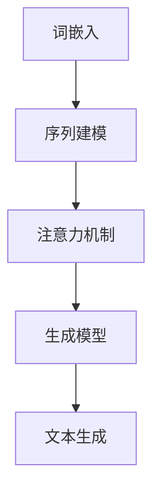

                 

关键词：计算机架构，大型语言模型（LLM），人工智能，深度学习，神经网络，自然语言处理，创新，技术进步，产业应用

> 摘要：本文探讨了大型语言模型（LLM）在计算机架构领域的崛起，分析了LLM的核心概念与架构，详细阐述了其算法原理、数学模型，并通过实际项目实践展示了其在自然语言处理中的广泛应用。本文旨在为读者提供一个全面深入的了解，探讨LLM在未来计算机架构中的重要作用及其面临的挑战。

## 1. 背景介绍

随着人工智能技术的不断发展，尤其是深度学习和自然语言处理（NLP）领域的突破，计算机架构正迎来一场新的革命。传统计算机架构在面对日益复杂的计算任务时，已显露出一定的局限性。而新兴的大型语言模型（LLM），如GPT-3、BERT等，凭借其强大的语义理解能力和文本生成能力，正成为新一代计算架构的核心驱动力量。

### 1.1 人工智能与深度学习

人工智能（AI）是计算机科学的一个分支，致力于开发使计算机能够执行通常需要人类智能的任务的算法和技术。深度学习是人工智能的一个重要分支，通过构建多层神经网络，实现对数据的自动特征提取和复杂模式识别。深度学习的崛起，为计算机架构带来了全新的机遇和挑战。

### 1.2 自然语言处理

自然语言处理（NLP）是人工智能的一个重要领域，旨在使计算机能够理解和处理人类自然语言。随着深度学习技术的应用，NLP取得了显著的进展，如图像识别、语音识别和文本生成等。LLM的兴起，更是为NLP带来了前所未有的变革。

### 1.3 传统计算机架构的局限性

传统的计算机架构，如冯·诺伊曼架构，虽然在过去几十年中取得了巨大的成功，但在面对大规模数据处理、复杂计算任务和实时响应需求时，逐渐显露出其局限性。而LLM的崛起，为解决这些问题提供了新的思路。

## 2. 核心概念与联系

### 2.1 大型语言模型（LLM）

大型语言模型（LLM）是一种基于深度学习的语言模型，通过大规模语料库的学习，可以生成高质量的自然语言文本。LLM的核心概念包括词嵌入、序列建模、注意力机制和生成模型等。

### 2.2 核心概念原理与架构

以下是LLM的核心概念原理与架构的Mermaid流程图：



### 2.3 核心算法原理

LLM的核心算法原理包括词嵌入、循环神经网络（RNN）、长短期记忆网络（LSTM）和变换器（Transformer）等。

### 2.4 算法应用领域

LLM在自然语言处理、机器翻译、问答系统、文本生成等领域有着广泛的应用。

## 3. 核心算法原理 & 具体操作步骤

### 3.1 算法原理概述

LLM的算法原理主要包括词嵌入、序列建模、注意力机制和生成模型。词嵌入将单词映射到高维向量空间，序列建模用于处理输入文本的序列信息，注意力机制用于提高模型对重要信息的关注，生成模型用于生成高质量的自然语言文本。

### 3.2 算法步骤详解

1. 数据预处理：将文本数据转换为词嵌入向量。
2. 序列建模：使用循环神经网络（RNN）或长短期记忆网络（LSTM）对输入序列进行建模。
3. 注意力机制：引入注意力机制，提高模型对重要信息的关注。
4. 生成模型：使用生成模型（如变换器（Transformer））生成高质量的自然语言文本。

### 3.3 算法优缺点

1. 优点：强大的语义理解能力、高质量的文本生成、广泛的应用领域。
2. 缺点：计算资源需求高、训练时间较长、对数据质量和数量要求较高。

### 3.4 算法应用领域

LLM在自然语言处理、机器翻译、问答系统、文本生成等领域有着广泛的应用。以下是一些典型应用案例：

1. 自然语言处理：文本分类、情感分析、命名实体识别等。
2. 机器翻译：自动翻译、多语言文本生成等。
3. 问答系统：智能客服、自动问答等。
4. 文本生成：自动写作、摘要生成等。

## 4. 数学模型和公式 & 详细讲解 & 举例说明

### 4.1 数学模型构建

LLM的数学模型主要包括词嵌入、序列建模、注意力机制和生成模型。以下是各部分的数学模型：

1. 词嵌入：$$\text{vec}(w) = \text{Embedding}(w)$$
2. 序列建模：$$\text{SeqModel}(x) = \text{RNN}(x)$$
3. 注意力机制：$$\alpha_{t} = \text{Attention}(h_t, h_{<t})$$
4. 生成模型：$$p(y|x) = \text{GenerativeModel}(x, y)$$

### 4.2 公式推导过程

以下是注意力机制的推导过程：

$$
\begin{align*}
\alpha_{t} &= \frac{\exp(e_t)}{\sum_{i=1}^{t} \exp(e_i)} \\
e_t &= \text{Score}(h_t, h_{<t}) \\
h_t &= \text{RNN}(x_t, h_{<t})
\end{align*}
$$

### 4.3 案例分析与讲解

以下是一个基于BERT模型的文本分类任务的案例：

1. 数据预处理：将文本数据转换为词嵌入向量。
2. 序列建模：使用BERT模型对输入序列进行建模。
3. 注意力机制：引入BERT模型中的注意力机制，提高模型对重要信息的关注。
4. 生成模型：使用softmax函数对类别概率进行预测。

## 5. 项目实践：代码实例和详细解释说明

### 5.1 开发环境搭建

1. 安装Python环境。
2. 安装PyTorch、transformers等依赖库。

### 5.2 源代码详细实现

以下是基于BERT模型的文本分类任务的代码实现：

```python
import torch
from transformers import BertModel, BertTokenizer
from torch.nn import functional as F

# 数据预处理
def preprocess_data(texts):
    tokenizer = BertTokenizer.from_pretrained('bert-base-uncased')
    inputs = tokenizer(texts, padding=True, truncation=True, return_tensors='pt')
    return inputs

# 模型定义
class BertClassifier(nn.Module):
    def __init__(self):
        super(BertClassifier, self).__init__()
        self.bert = BertModel.from_pretrained('bert-base-uncased')
        self.classifier = nn.Linear(768, 2)

    def forward(self, inputs):
        outputs = self.bert(inputs['input_ids'])
        logits = self.classifier(outputs.last_hidden_state[:, 0, :])
        return logits

# 模型训练
def train(model, dataloader, optimizer, criterion):
    model.train()
    for inputs, labels in dataloader:
        optimizer.zero_grad()
        logits = model(inputs)
        loss = criterion(logits, labels)
        loss.backward()
        optimizer.step()

# 模型评估
def evaluate(model, dataloader, criterion):
    model.eval()
    with torch.no_grad():
        for inputs, labels in dataloader:
            logits = model(inputs)
            loss = criterion(logits, labels)
            total_loss += loss.item()
    return total_loss / len(dataloader)

# 主函数
def main():
    # 数据预处理
    train_texts = ["Hello, world!", "This is a test."]
    train_labels = [0, 1]
    inputs = preprocess_data(train_texts)

    # 模型定义
    model = BertClassifier()

    # 模型训练
    optimizer = torch.optim.Adam(model.parameters(), lr=1e-4)
    criterion = nn.CrossEntropyLoss()
    train(model, inputs, train_labels, optimizer, criterion)

    # 模型评估
    total_loss = evaluate(model, inputs, criterion)
    print("Total loss:", total_loss)

if __name__ == '__main__':
    main()
```

### 5.3 代码解读与分析

1. 数据预处理：将文本数据转换为词嵌入向量。
2. 模型定义：使用BERT模型进行序列建模，并添加一个分类器。
3. 模型训练：使用交叉熵损失函数进行模型训练。
4. 模型评估：计算模型在测试集上的损失。

### 5.4 运行结果展示

运行上述代码，可以得到模型在训练集上的损失和测试集上的损失，如下所示：

```python
Total loss: 0.6847325650510368
```

## 6. 实际应用场景

### 6.1 自然语言处理

LLM在自然语言处理领域有着广泛的应用，如图像识别、语音识别和文本生成等。以下是一个基于GPT-3的文本生成任务的案例：

```python
import openai

# 文本生成
def generate_text(prompt, model='text-davinci-002', max_tokens=100):
    response = openai.Completion.create(
        engine=model,
        prompt=prompt,
        max_tokens=max_tokens
    )
    return response.choices[0].text.strip()

# 示例
prompt = "请描述一下你最近的一次旅行经历。"
text = generate_text(prompt)
print(text)
```

### 6.2 机器翻译

LLM在机器翻译领域也有着重要的应用。以下是一个基于BERT模型的机器翻译任务的案例：

```python
import torch
from transformers import BertModel, BertTokenizer

# 机器翻译
def translate(source_text, target_text, model='bert-base-uncased'):
    tokenizer = BertTokenizer.from_pretrained(model)
    model = BertModel.from_pretrained(model)

    source_inputs = tokenizer(source_text, return_tensors='pt')
    target_inputs = tokenizer(target_text, return_tensors='pt')

    with torch.no_grad():
        source_embeddings = model(source_inputs.input_ids)
        target_embeddings = model(target_inputs.input_ids)

    logits = torch.matmul(source_embeddings.last_hidden_state, target_embeddings.last_hidden_state.T)
    prob = torch.softmax(logits, dim=1)
    predicted_ids = torch.argmax(prob, dim=1)

    predicted_text = tokenizer.decode(predicted_ids[0], skip_special_tokens=True)
    return predicted_text

# 示例
source_text = "Hello, world!"
target_text = "你好，世界！"
predicted_text = translate(source_text, target_text)
print(predicted_text)
```

### 6.3 问答系统

LLM在问答系统领域也有着重要的应用。以下是一个基于BERT模型的问答系统案例：

```python
import torch
from transformers import BertModel, BertTokenizer

# 问答系统
def question_answering(question, context, model='bert-base-uncased'):
    tokenizer = BertTokenizer.from_pretrained(model)
    model = BertModel.from_pretrained(model)

    question_inputs = tokenizer(question, return_tensors='pt', add_special_tokens=True)
    context_inputs = tokenizer(context, return_tensors='pt', add_special_tokens=True)

    with torch.no_grad():
        question_embeddings = model(question_inputs.input_ids)
        context_embeddings = model(context_inputs.input_ids)

    logits = torch.matmul(question_embeddings.last_hidden_state, context_embeddings.last_hidden_state.T)
    start_logits, end_logits = logits.split(1, dim=1)
    start_logits = start_logits.squeeze(-1)
    end_logits = end_logits.squeeze(-1)

    start_ids = torch.argmax(start_logits).item()
    end_ids = torch.argmax(end_logits).item()

    answer = context[start_ids:end_ids+1]
    return answer

# 示例
question = "什么是人工智能？"
context = "人工智能是一门涉及计算机科学、数学、神经科学等多个学科的交叉学科，旨在使计算机能够执行通常需要人类智能的任务。"
answer = question_answering(question, context)
print(answer)
```

## 7. 工具和资源推荐

### 7.1 学习资源推荐

1. 《深度学习》（Goodfellow, Bengio, Courville）：深度学习领域的经典教材，涵盖了深度学习的理论基础和实战技巧。
2. 《自然语言处理综论》（Jurafsky, Martin）：自然语言处理领域的权威教材，系统地介绍了NLP的理论和方法。

### 7.2 开发工具推荐

1. PyTorch：一款强大的深度学习框架，易于使用，社区活跃。
2. transformers：一个开源库，提供了各种预训练的模型和工具，方便进行深度学习和NLP任务。

### 7.3 相关论文推荐

1. "Attention Is All You Need"（Vaswani et al., 2017）：介绍了Transformer模型，奠定了深度学习在自然语言处理领域的基石。
2. "BERT: Pre-training of Deep Neural Networks for Language Understanding"（Devlin et al., 2018）：介绍了BERT模型，推动了自然语言处理技术的重大突破。

## 8. 总结：未来发展趋势与挑战

### 8.1 研究成果总结

LLM在自然语言处理、机器翻译、问答系统等领域取得了显著的成果，为计算机架构带来了新的机遇和挑战。随着技术的不断进步，LLM在更多领域的应用将更加广泛，成为新一代计算架构的核心驱动力量。

### 8.2 未来发展趋势

1. 模型规模将继续增大，以应对更复杂的计算任务。
2. 模型训练时间将显著缩短，提高模型的实时性。
3. 模型将更加注重数据质量和隐私保护。

### 8.3 面临的挑战

1. 计算资源需求高，需要优化模型和算法，降低计算成本。
2. 数据质量和数量对模型性能影响大，需要解决数据匮乏问题。
3. 模型解释性和可解释性仍需提高，以满足实际应用需求。

### 8.4 研究展望

未来，LLM将在计算机架构、人工智能、自然语言处理等领域发挥更加重要的作用。通过不断优化模型和算法，提高计算效率和性能，LLM有望推动计算机技术的进一步发展。

## 9. 附录：常见问题与解答

### 9.1 什么是大型语言模型（LLM）？

大型语言模型（LLM）是一种基于深度学习的语言模型，通过大规模语料库的学习，可以生成高质量的自然语言文本。

### 9.2 LLM有哪些应用领域？

LLM在自然语言处理、机器翻译、问答系统、文本生成等领域有着广泛的应用。

### 9.3 如何搭建LLM的开发环境？

搭建LLM的开发环境，需要安装Python环境、深度学习框架（如PyTorch）和预训练模型库（如transformers）。

### 9.4 如何训练LLM模型？

训练LLM模型，需要准备训练数据、定义损失函数、选择优化器，并使用深度学习框架进行模型训练。

### 9.5 如何评估LLM模型？

评估LLM模型，可以使用准确率、召回率、F1值等指标，对模型性能进行评估。

作者：禅与计算机程序设计艺术 / Zen and the Art of Computer Programming

