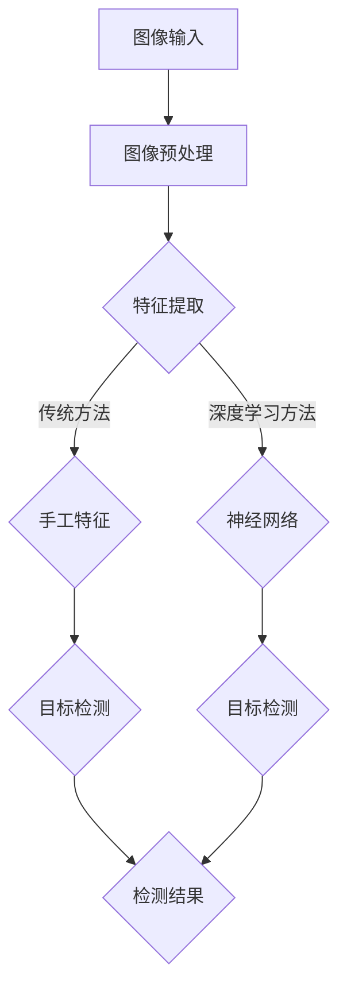

                 

关键词：计算机视觉，工业检测，图像处理，机器学习，深度学习，算法，实践

> 摘要：本文主要探讨了计算机视觉技术在工业检测领域的应用，从背景介绍到核心算法原理，再到实际应用场景和未来展望，系统性地分析了计算机视觉在工业检测中的重要作用和潜在价值。

## 1. 背景介绍

随着工业自动化和智能制造的不断发展，工业检测作为生产过程中的关键环节，其重要性日益凸显。传统的工业检测方法往往依赖于人工操作，效率低下且容易出现误差。为了提高生产效率和产品质量，计算机视觉技术应运而生，逐渐成为工业检测领域的重要工具。

计算机视觉是一种通过计算机对图像进行处理、分析和理解的技术。在工业检测中，计算机视觉技术可以实现对产品的外观、尺寸、形状、颜色等特征的高精度检测，从而替代人工操作，提高检测效率和准确性。

## 2. 核心概念与联系

### 2.1 计算机视觉基本概念

计算机视觉的基本概念包括图像处理、特征提取和目标检测等。

- **图像处理**：对图像进行预处理、增强、分割等操作，以提高图像质量，为后续特征提取和目标检测提供更好的基础。
- **特征提取**：从图像中提取出能够代表目标特征的属性，如边缘、纹理、颜色等。
- **目标检测**：在图像中识别出特定的目标，并确定其位置。

### 2.2 计算机视觉架构

计算机视觉的架构可以分为两个部分：传统计算机视觉和深度学习计算机视觉。

- **传统计算机视觉**：主要依赖于手工设计的特征和算法，如SIFT、SURF等。这种方法的缺点是对特征选择和算法设计有较高的要求，且难以处理复杂场景。
- **深度学习计算机视觉**：通过训练大量的神经网络模型来自动提取特征并进行目标检测，如卷积神经网络（CNN）等。这种方法的优势在于能够处理复杂的场景，但需要大量的数据和计算资源。

### 2.3 Mermaid 流程图



## 3. 核心算法原理 & 具体操作步骤

### 3.1 算法原理概述

计算机视觉在工业检测中的应用主要依赖于图像处理、特征提取和目标检测等算法。

- **图像处理**：主要包括去噪、增强、滤波等操作，以提高图像质量。
- **特征提取**：从图像中提取出能够代表目标特征的属性，如边缘、纹理、颜色等。
- **目标检测**：在图像中识别出特定的目标，并确定其位置。

### 3.2 算法步骤详解

1. **图像预处理**：通过去噪、增强、滤波等操作，对原始图像进行处理，提高图像质量。
2. **特征提取**：从处理后的图像中提取出能够代表目标特征的属性，如边缘、纹理、颜色等。
3. **目标检测**：利用提取的特征，在图像中识别出特定的目标，并确定其位置。

### 3.3 算法优缺点

- **传统计算机视觉**：
  - 优点：算法成熟，对特定场景有较好的效果。
  - 缺点：对特征选择和算法设计有较高的要求，难以处理复杂场景。
- **深度学习计算机视觉**：
  - 优点：能够处理复杂的场景，自动提取特征，提高检测准确性。
  - 缺点：需要大量的数据和计算资源，训练时间较长。

### 3.4 算法应用领域

计算机视觉在工业检测中的应用广泛，主要包括以下几个方面：

- **产品质量检测**：通过对产品外观、尺寸、形状等特征进行检测，确保产品质量。
- **设备状态检测**：通过对设备运行状态进行监测，预测设备故障，提高生产效率。
- **生产流程监控**：通过对生产流程进行监控，优化生产过程，提高生产效率。

## 4. 数学模型和公式 & 详细讲解 & 举例说明

### 4.1 数学模型构建

计算机视觉中的数学模型主要包括图像处理模型、特征提取模型和目标检测模型。

- **图像处理模型**：主要涉及到图像的去噪、增强、滤波等操作。例如，常用的图像滤波器有高斯滤波器、中值滤波器等。
- **特征提取模型**：主要涉及到特征提取的方法，如边缘检测、纹理分析、颜色分析等。例如，常用的边缘检测算法有Sobel算子、Canny算子等。
- **目标检测模型**：主要涉及到目标检测的方法，如单目标检测、多目标检测等。例如，常用的目标检测算法有YOLO、SSD、Faster R-CNN等。

### 4.2 公式推导过程

在计算机视觉中，常用的公式包括图像滤波公式、特征提取公式和目标检测公式。

- **图像滤波公式**：高斯滤波器的公式为：
  $$
  f(x,y) = \sum_{i=-\infty}^{\infty} \sum_{j=-\infty}^{\infty} g(i,j) \cdot I(x-i, y-j)
  $$
  其中，$g(i,j)$为高斯滤波器的系数，$I(x,y)$为图像的像素值。

- **特征提取公式**：Canny算子的公式为：
  $$
  \text{Sobel}(x,y) = \sqrt{(\text{Sobel}_x(x,y))^2 + (\text{Sobel}_y(x,y))^2}
  $$
  其中，$\text{Sobel}_x(x,y)$和$\text{Sobel}_y(x,y)$分别为水平和垂直方向的Sobel算子。

- **目标检测公式**：Faster R-CNN的目标检测公式为：
  $$
  \text{Objectness} = \frac{1}{|\mathcal{X}|} \sum_{x \in \mathcal{X}} \text{sigmoid}(\text{score}(x))
  $$
  其中，$\mathcal{X}$为候选区域集合，$\text{score}(x)$为候选区域$x$的分类得分。

### 4.3 案例分析与讲解

以产品质量检测为例，介绍计算机视觉在工业检测中的应用。

- **数据准备**：收集一定数量的产品图像，并进行预处理，如去噪、增强、归一化等。
- **特征提取**：使用Canny算子提取图像的边缘特征，并利用SIFT算法提取图像的关键点。
- **目标检测**：使用Faster R-CNN算法对提取的关键点进行目标检测，识别出产品的缺陷区域。
- **结果分析**：对检测结果进行分析，评估检测的准确性和效率。

## 5. 项目实践：代码实例和详细解释说明

### 5.1 开发环境搭建

- **硬件环境**：计算机，GPU加速器（可选）
- **软件环境**：Python 3.x，OpenCV，PyTorch，TensorFlow等

### 5.2 源代码详细实现

```python
import cv2
import torch
from torchvision import transforms
from model import FasterRCNN

# 加载预训练模型
model = FasterRCNN()
model.load_state_dict(torch.load('model.pth'))

# 转换为推理模式
model.eval()

# 定义数据预处理函数
def preprocess_image(image):
    transform = transforms.Compose([
        transforms.ToTensor(),
        transforms.Normalize(mean=[0.485, 0.456, 0.406], std=[0.229, 0.224, 0.225]),
    ])
    return transform(image)

# 检测图像中的缺陷
def detect_defects(image_path):
    image = cv2.imread(image_path)
    image = preprocess_image(image)
    with torch.no_grad():
        outputs = model(image.unsqueeze(0))
    boxes = outputs[0]['boxes']
    labels = outputs[0]['labels']
    scores = outputs[0]['scores']
    return boxes, labels, scores

# 示例：检测一张产品图像中的缺陷
image_path = 'product.jpg'
boxes, labels, scores = detect_defects(image_path)

# 绘制检测结果
for box, label, score in zip(boxes, labels, scores):
    if score > 0.5:
        cv2.rectangle(image, (int(box[0]), int(box[1])), (int(box[2]), int(box[3])), (0, 0, 255), 2)
        cv2.putText(image, f'Defect {label}', (int(box[0]), int(box[1]-10)), cv2.FONT_HERSHEY_SIMPLEX, 1, (255, 255, 255), 2)

cv2.imshow('Defects', image)
cv2.waitKey(0)
cv2.destroyAllWindows()
```

### 5.3 代码解读与分析

以上代码首先加载了预训练的Faster R-CNN模型，然后定义了一个预处理函数，用于将图像转换为适合模型输入的格式。接着，定义了一个检测函数，用于检测图像中的缺陷。最后，通过绘制检测结果，展示了计算机视觉在工业检测中的应用。

## 6. 实际应用场景

计算机视觉在工业检测中的应用非常广泛，以下是一些实际应用场景：

- **电子产品制造**：用于检测电子元器件的外观、尺寸、焊点等缺陷。
- **汽车制造**：用于检测车身外观、零部件尺寸等缺陷。
- **食品加工**：用于检测食品的外观、形状、颜色等缺陷。
- **制药行业**：用于检测药品的形状、大小、色泽等缺陷。

## 7. 工具和资源推荐

### 7.1 学习资源推荐

- **书籍**：《计算机视觉：算法与应用》（作者：Gary Bradski，《模式识别与机器学习》（作者：Christopher M. Bishop）等。
- **在线课程**：Coursera、Udacity、edX等平台上的计算机视觉相关课程。

### 7.2 开发工具推荐

- **编程环境**：Python、MATLAB等。
- **库与框架**：OpenCV、PyTorch、TensorFlow等。

### 7.3 相关论文推荐

- **《Faster R-CNN: Towards Real-Time Object Detection with Region Proposal Networks》**（作者：Shaoqing Ren等）。
- **《Single Shot MultiBox Detector: Object Detection at 25 FPS》**（作者：José M. Boix等）。

## 8. 总结：未来发展趋势与挑战

### 8.1 研究成果总结

计算机视觉在工业检测中的应用取得了显著成果，通过图像处理、特征提取和目标检测等算法，实现了对产品的高精度检测，提高了生产效率和产品质量。

### 8.2 未来发展趋势

随着人工智能技术的不断发展，计算机视觉在工业检测中的应用将更加广泛。未来，深度学习技术将进一步提高检测准确性和效率，实现更多复杂场景的检测。

### 8.3 面临的挑战

尽管计算机视觉在工业检测中取得了显著成果，但仍面临一些挑战。如：数据标注困难、算法复杂度高等。未来，需要解决这些挑战，推动计算机视觉在工业检测中的更广泛应用。

### 8.4 研究展望

未来，计算机视觉在工业检测中的应用将朝着智能化、自动化、高效化的方向发展。通过不断创新和优化算法，提高检测准确性和效率，为工业生产提供更强大的技术支持。

## 9. 附录：常见问题与解答

### 9.1 计算机视觉在工业检测中的优势是什么？

计算机视觉在工业检测中的优势主要体现在以下几个方面：

1. **高精度**：通过图像处理、特征提取和目标检测等算法，可以实现高精度的检测。
2. **高效率**：自动化检测，提高生产效率。
3. **稳定性**：不受人工操作误差的影响，提高检测稳定性。
4. **扩展性强**：可以应用于多种工业场景，实现多样化的检测需求。

### 9.2 计算机视觉在工业检测中存在哪些挑战？

计算机视觉在工业检测中存在以下挑战：

1. **数据标注困难**：需要大量标注数据进行模型训练，而工业检测场景复杂，标注难度大。
2. **算法复杂度**：深度学习算法复杂，训练时间较长，对计算资源要求高。
3. **环境变化**：工业检测环境复杂，光照、角度等因素会影响检测效果。
4. **抗干扰性**：需要提高算法的抗干扰性，以适应各种恶劣的检测环境。```

## 文章作者

作者：禅与计算机程序设计艺术 / Zen and the Art of Computer Programming
----------------------
本文由禅与计算机程序设计艺术（Zen and the Art of Computer Programming）作者撰写，旨在探讨计算机视觉技术在工业检测领域的应用。本文内容基于最新的研究成果和实际应用案例，为读者提供了全面而深入的见解。希望本文能够对广大读者在计算机视觉和工业检测领域的研究与应用有所帮助。```

