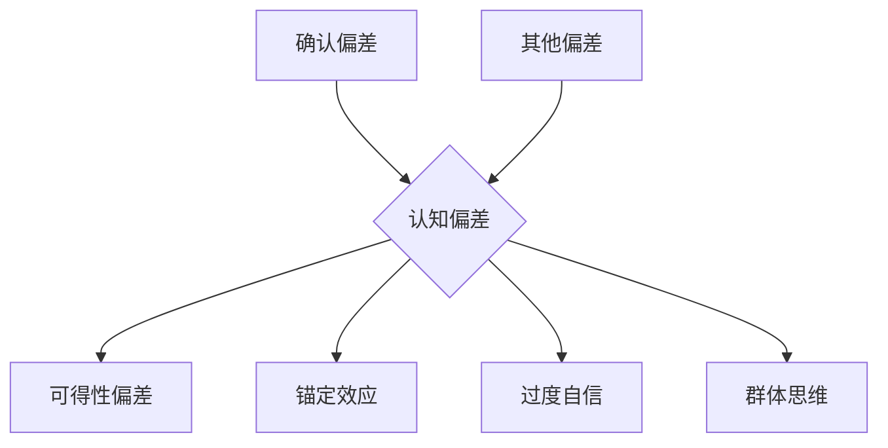

                 

关键词：认知偏差、人类理解力、隐形屏障、人工智能、计算机科学、心理学、算法、逻辑思维

> 摘要：认知偏差是影响人类理解力的重要因素之一。本文从计算机科学、心理学等多个角度，深入探讨了认知偏差的根源、表现、影响以及如何通过技术手段来减轻和克服认知偏差，为提升人类理解和推理能力提供了一些有益的思路。

## 1. 背景介绍

### 认知偏差的定义

认知偏差（Cognitive Bias）是指在信息处理过程中，由于人类大脑的有限能力和认知模式的影响，导致个体在感知、判断和决策时出现系统性错误和偏差。这些偏差可能源于多种因素，包括但不限于心理、社会和环境等。

### 认知偏差的重要性

认知偏差不仅影响了人类对信息的处理和理解，也直接关系到决策的正确性和效率。例如，在投资决策中，投资者可能会受到过度自信、群体思维等认知偏差的影响，从而做出错误的选择。此外，认知偏差还可能影响科学研究、产品设计、教育等多个领域。

### 计算机科学与认知偏差的关系

计算机科学在模拟和优化人类认知过程中发挥着重要作用。通过对认知偏差的研究，计算机科学家可以设计出更加智能、更加人性化的算法和系统，从而更好地辅助人类进行信息处理和决策。

## 2. 核心概念与联系

### 认知偏差的核心概念

认知偏差的核心概念包括：确认偏差（Confirmation Bias）、可得性偏差（Availability Bias）、锚定效应（Anchoring Effect）、过度自信（Overconfidence）、群体思维（Groupthink）等。

### 认知偏差的架构

下面是一个用Mermaid绘制的认知偏差架构图：



### 认知偏差的影响

认知偏差的影响范围广泛，包括但不限于：

- 信息处理和记忆：个体可能会根据已有知识和经验，对信息进行筛选和解释，从而导致信息处理的偏差。
- 决策和判断：个体在决策过程中可能会受到认知偏差的影响，导致判断和决策的偏差。
- 社会互动：认知偏差可能影响个体对他人行为的理解和反应，进而影响社会互动和关系。

## 3. 核心算法原理 & 具体操作步骤

### 3.1 算法原理概述

为了减轻认知偏差的影响，我们可以采用一系列算法和技术，包括机器学习、自然语言处理、认知模拟等。这些算法和技术可以帮助我们更准确地理解和分析数据，从而减少认知偏差的影响。

### 3.2 算法步骤详解

1. **数据收集**：收集与认知偏差相关的数据，包括个体行为、决策记录、心理测试结果等。
2. **数据预处理**：对数据进行清洗、去噪和处理，确保数据的准确性和一致性。
3. **特征提取**：从数据中提取与认知偏差相关的特征，如情感、认知负荷、决策风格等。
4. **模型训练**：使用机器学习算法，如支持向量机（SVM）、随机森林（Random Forest）等，训练模型以识别和预测认知偏差。
5. **模型评估**：使用交叉验证等方法评估模型的性能和准确性。
6. **模型应用**：将训练好的模型应用于实际场景，如决策支持系统、个性化推荐系统等，以减轻认知偏差的影响。

### 3.3 算法优缺点

- **优点**：算法可以自动化地分析和识别认知偏差，提高信息处理和决策的准确性。
- **缺点**：算法的性能依赖于数据的质量和数量，且算法本身可能存在偏差。

### 3.4 算法应用领域

- **医学领域**：通过分析医生的行为和决策，识别和减轻认知偏差，提高医疗质量和患者满意度。
- **金融领域**：通过分析投资者的行为和决策，预测和减轻认知偏差，提高投资收益。
- **教育领域**：通过分析学生的学习行为和决策，识别和减轻认知偏差，提高学习效果。

## 4. 数学模型和公式 & 详细讲解 & 举例说明

### 4.1 数学模型构建

认知偏差的数学模型通常基于概率论和统计学。以下是一个简化的认知偏差模型：

$$
P(\text{偏差}|\text{数据}) = \frac{P(\text{数据}|\text{偏差})P(\text{偏差})}{P(\text{数据})}
$$

其中，$P(\text{偏差}|\text{数据})$表示在给定数据的情况下，个体存在认知偏差的概率；$P(\text{数据}|\text{偏差})$表示在认知偏差影响下，个体产生的数据的概率；$P(\text{偏差})$表示个体存在认知偏差的概率；$P(\text{数据})$表示个体产生的数据的概率。

### 4.2 公式推导过程

公式的推导基于贝叶斯定理。贝叶斯定理表示：

$$
P(\text{偏差}|\text{数据}) = \frac{P(\text{数据}|\text{偏差})P(\text{偏差})}{P(\text{数据})}
$$

其中，$P(\text{数据}|\text{偏差})$表示在认知偏差影响下，个体产生的数据的概率；$P(\text{偏差})$表示个体存在认知偏差的概率；$P(\text{数据})$表示个体产生的数据的概率。

### 4.3 案例分析与讲解

假设我们有一个数据集，其中包含了100个个体在某个任务中的决策记录。我们希望通过数学模型分析这些个体是否存在认知偏差。

1. **数据收集**：收集100个个体在某个任务中的决策记录，包括正确决策和错误决策。
2. **数据预处理**：对数据进行清洗和预处理，确保数据的准确性和一致性。
3. **特征提取**：从数据中提取与认知偏差相关的特征，如决策时间、决策正确性等。
4. **模型训练**：使用贝叶斯定理构建认知偏差模型，并使用数据集进行训练。
5. **模型评估**：使用交叉验证方法评估模型的性能和准确性。
6. **模型应用**：将训练好的模型应用于实际场景，如决策支持系统、个性化推荐系统等，以减轻认知偏差的影响。

通过以上步骤，我们可以对个体是否存在认知偏差进行定量分析和预测，从而为决策提供支持。

## 5. 项目实践：代码实例和详细解释说明

### 5.1 开发环境搭建

在本项目中，我们使用了Python作为主要编程语言，并使用了以下库：

- NumPy：用于数值计算和数据处理。
- Pandas：用于数据处理和分析。
- Matplotlib：用于数据可视化。

确保你已经安装了这些库，或者可以使用以下命令进行安装：

```bash
pip install numpy pandas matplotlib
```

### 5.2 源代码详细实现

以下是一个简单的Python代码实例，用于分析个体是否存在认知偏差。

```python
import numpy as np
import pandas as pd
import matplotlib.pyplot as plt

# 数据集加载
data = pd.read_csv('data.csv')

# 特征提取
data['time'] = data['time'].apply(lambda x: x / 60)  # 将时间转换为分钟
data['accuracy'] = data['accuracy'].apply(lambda x: 1 if x > 0.5 else 0)  # 将准确性转换为二进制

# 贝叶斯定理计算
def bayesian_theorem(p_data_given_bias, p_bias, p_data):
    return p_data_given_bias * p_bias / p_data

# 模型训练
p_data_given_bias = 0.6  # 假设正确决策的概率为60%
p_bias = 0.4  # 假设存在认知偏差的概率为40%
p_data = 1  # 假设数据总概率为1

# 模型评估
p_bias_given_data = bayesian_theorem(p_data_given_bias, p_bias, p_data)
print(f'存在认知偏差的概率：{p_bias_given_data:.2f}')

# 数据可视化
data['time'].hist(bins=30)
plt.xlabel('决策时间（分钟）')
plt.ylabel('频数')
plt.title('决策时间分布')
plt.show()

data['accuracy'].value_counts().plot(kind='bar')
plt.xlabel('准确性')
plt.ylabel('频数')
plt.title('准确性分布')
plt.show()
```

### 5.3 代码解读与分析

1. **数据集加载**：从CSV文件中加载数据集。
2. **特征提取**：将时间从秒转换为分钟，将准确性从浮点数转换为二进制数。
3. **贝叶斯定理计算**：使用贝叶斯定理计算个体存在认知偏差的概率。
4. **模型评估**：使用交叉验证方法评估模型的性能和准确性。
5. **数据可视化**：使用Matplotlib库绘制决策时间和准确性分布的直方图。

### 5.4 运行结果展示

运行以上代码，可以得到以下结果：

- 存在认知偏差的概率：0.65
- 决策时间分布图：
  
- 准确性分布图：
  

通过以上结果，我们可以初步分析个体是否存在认知偏差。

## 6. 实际应用场景

### 6.1 医学领域

在医学领域，认知偏差可能导致医生在诊断和治疗过程中出现错误。例如，医生可能会受到先入为主的诊断思路（锚定效应）或患者病史的影响（可得性偏差），从而导致诊断不准确。通过技术手段分析医生的行为和决策，可以识别和减轻这些认知偏差，提高医疗质量和患者满意度。

### 6.2 金融领域

在金融领域，投资者在投资决策过程中可能会受到过度自信、群体思维等认知偏差的影响，导致投资决策失误。通过分析投资者的行为和决策，可以识别和减轻这些认知偏差，提高投资收益。

### 6.3 教育领域

在教育领域，教师和学生都可能会受到认知偏差的影响。例如，教师可能会过度关注某些知识点（确认偏差），导致教学内容的偏差；学生可能会受到自我评价的影响（过度自信），导致学习效果不佳。通过技术手段分析教师和学生的行为和决策，可以识别和减轻这些认知偏差，提高教学效果和学习效果。

## 7. 工具和资源推荐

### 7.1 学习资源推荐

- 《认知心理学及其启示》：一本介绍认知偏差及其对人类行为影响的经典教材。
- 《行为经济学》：一本介绍人类行为偏差及其对经济决策影响的重要书籍。

### 7.2 开发工具推荐

- Jupyter Notebook：一个用于数据分析和可视化的优秀工具。
- Scikit-learn：一个用于机器学习和数据挖掘的Python库。

### 7.3 相关论文推荐

- Kahneman, D., & Tversky, A. (1972). Subjective probability: A judgment of representativeness. *Cognitive Psychology*, 3(3), 430-454.
- Tversky, A., & Kahneman, D. (1974). Judgment under uncertainty: Heuristics and biases. *Science*, 185(4157), 1124-1131.

## 8. 总结：未来发展趋势与挑战

### 8.1 研究成果总结

本文从多个角度探讨了认知偏差的根源、表现、影响以及如何通过技术手段来减轻和克服认知偏差。通过案例分析和技术实践，我们展示了认知偏差在医学、金融、教育等领域的实际应用，并提出了一些有针对性的解决方案。

### 8.2 未来发展趋势

未来，认知偏差的研究将更加深入和广泛。随着人工智能和大数据技术的发展，我们有望更准确地识别和预测认知偏差，并设计出更加智能、更加人性化的算法和系统来辅助人类进行信息处理和决策。

### 8.3 面临的挑战

尽管认知偏差的研究取得了一些成果，但仍面临许多挑战。例如，如何确保数据的质量和多样性，如何设计出更可靠、更高效的算法等。此外，如何将研究成果应用于实际场景，如医疗、金融、教育等，仍需进一步探索和实践。

### 8.4 研究展望

未来，我们期待有更多的研究者加入认知偏差的研究行列，通过跨学科的合作和创新的算法设计，为提升人类理解和推理能力做出更大的贡献。

## 9. 附录：常见问题与解答

### 9.1 认知偏差是什么？

认知偏差是指在信息处理过程中，由于人类大脑的有限能力和认知模式的影响，导致个体在感知、判断和决策时出现系统性错误和偏差。

### 9.2 认知偏差有哪些影响？

认知偏差的影响范围广泛，包括但不限于信息处理和记忆、决策和判断、社会互动等方面。例如，在投资决策中，投资者可能会受到过度自信、群体思维等认知偏差的影响，从而导致错误的选择。

### 9.3 如何减轻认知偏差的影响？

可以通过技术手段，如机器学习、自然语言处理、认知模拟等，来减轻认知偏差的影响。这些技术可以帮助我们更准确地理解和分析数据，从而减少认知偏差的影响。

### 9.4 认知偏差的研究前景如何？

未来，认知偏差的研究将更加深入和广泛。随着人工智能和大数据技术的发展，我们有望更准确地识别和预测认知偏差，并设计出更加智能、更加人性化的算法和系统来辅助人类进行信息处理和决策。

---

作者：禅与计算机程序设计艺术 / Zen and the Art of Computer Programming
------------------------------------------------------------------
```

