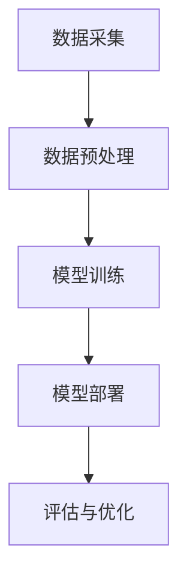

                 

关键词：认知增强、认知替代、AI、决策辅助、人机协同

> 摘要：本文探讨了人工智能（AI）在认知增强与认知替代方面的应用，分析了AI辅助人类决策的边界。通过对认知增强与认知替代的概念阐述、技术实现、应用案例以及未来展望，本文旨在为AI在决策领域的应用提供理论指导和实践参考。

## 1. 背景介绍

随着人工智能技术的飞速发展，AI在各个领域的应用日益广泛，尤其是在决策支持系统中，AI展现出了巨大的潜力。传统的决策支持系统主要依赖于统计分析和规则推理，而现代的AI技术，如深度学习、强化学习、自然语言处理等，能够从大量数据中提取有价值的信息，提供更为精准和个性化的决策建议。

然而，AI在决策领域的应用并非一帆风顺。如何界定AI在认知增强与认知替代之间的边界，如何在人机协同中发挥AI的最大优势，成为当前亟待解决的问题。本文将从这两个方面展开讨论，旨在为AI辅助决策提供理论依据和实践指导。

### 1.1 认知增强与认知替代的概念

认知增强（Cognitive Augmentation）是指通过技术手段提高个体的认知能力，使其能够在更短的时间内处理更多信息，做出更准确的决策。认知替代（Cognitive Substitution）则是指AI完全取代人类的认知功能，在特定场景下进行决策，无需人类干预。

### 1.2 AI辅助决策的现状与挑战

当前，AI辅助决策在金融、医疗、交通等领域已经取得了显著的成果。例如，在金融领域，AI可以分析大量市场数据，预测股票价格趋势，为投资者提供参考；在医疗领域，AI可以通过影像识别技术，协助医生诊断疾病，提高诊断准确率。然而，AI在决策领域仍面临诸多挑战，如数据隐私、算法透明度、误判风险等。

## 2. 核心概念与联系

### 2.1 认知增强与认知替代的关系

认知增强与认知替代并非完全对立，而是存在一定的交集。在某些场景下，AI可以辅助人类进行认知活动，提高决策效率；而在另一些场景下，AI可以完全替代人类的认知功能，实现自动化决策。

### 2.2 AI辅助决策的架构

为了实现AI辅助决策，我们需要构建一个包括数据采集、数据预处理、模型训练、模型部署和评估的完整架构。具体流程如下：

1. 数据采集：收集与决策相关的数据，如金融市场的历史数据、医疗影像数据等。
2. 数据预处理：对采集到的数据进行清洗、归一化等处理，以提高数据质量。
3. 模型训练：使用训练数据集，利用机器学习算法训练决策模型。
4. 模型部署：将训练好的模型部署到实际应用场景中，如金融交易平台、医疗诊断系统等。
5. 评估与优化：对模型的预测结果进行评估，并根据评估结果对模型进行优化。

### 2.3 Mermaid 流程图

以下是一个简化的Mermaid流程图，展示了AI辅助决策的架构：



## 3. 核心算法原理 & 具体操作步骤

### 3.1 算法原理概述

AI辅助决策的核心算法主要包括以下几种：

1. **深度学习**：通过构建深度神经网络，对大量数据进行训练，提取特征并实现预测。
2. **强化学习**：通过与环境交互，不断调整策略，实现最优决策。
3. **自然语言处理**：通过对自然语言文本的处理，提取语义信息，实现文本分类、情感分析等任务。

### 3.2 算法步骤详解

1. **数据采集**：根据决策场景，收集与决策相关的数据，如历史交易数据、医疗影像数据等。
2. **数据预处理**：对采集到的数据进行清洗、归一化等处理，以提高数据质量。
3. **模型选择**：根据决策任务的特点，选择合适的机器学习算法，如深度学习、强化学习等。
4. **模型训练**：使用训练数据集，利用所选算法训练模型。
5. **模型评估**：使用验证数据集对模型进行评估，根据评估结果调整模型参数。
6. **模型部署**：将训练好的模型部署到实际应用场景中，如金融交易平台、医疗诊断系统等。
7. **实时更新**：根据新的数据，不断更新模型，以适应不断变化的环境。

### 3.3 算法优缺点

1. **深度学习**：优点：能够自动提取特征，适应性强；缺点：对数据量要求较高，模型复杂度较高。
2. **强化学习**：优点：能够通过与环境交互，实现自我优化；缺点：训练过程较长，需要大量样本。
3. **自然语言处理**：优点：能够处理文本数据，实现语义分析；缺点：对语言理解能力要求较高，处理效率较低。

### 3.4 算法应用领域

1. **金融领域**：利用深度学习进行股票市场预测、风险管理等。
2. **医疗领域**：利用自然语言处理进行病历分析、疾病诊断等。
3. **交通领域**：利用强化学习实现自动驾驶、交通流量预测等。

## 4. 数学模型和公式 & 详细讲解 & 举例说明

### 4.1 数学模型构建

在AI辅助决策中，常用的数学模型包括：

1. **线性回归模型**：用于预测数值型变量。
2. **逻辑回归模型**：用于预测二分类问题。
3. **支持向量机**：用于分类问题。
4. **神经网络**：用于非线性预测和分类。

### 4.2 公式推导过程

以线性回归模型为例，其公式推导过程如下：

假设我们有n个样本，每个样本包括输入特征x和输出标签y。线性回归模型的目标是找到一个线性函数f(x) = w * x + b，使得预测值f(x)与实际值y的差距最小。

根据最小二乘法，我们需要求解以下最优化问题：

$$
\min_{w,b} \sum_{i=1}^{n}(y_i - f(x_i))^2
$$

对w和b分别求偏导数，并令其等于0，得到：

$$
w = \frac{\sum_{i=1}^{n}(x_i - \bar{x})(y_i - \bar{y})}{\sum_{i=1}^{n}(x_i - \bar{x})^2}
$$

$$
b = \bar{y} - w\bar{x}
$$

其中，$\bar{x}$和$\bar{y}$分别为输入特征和输出标签的均值。

### 4.3 案例分析与讲解

假设我们有以下数据集：

| x   | y   |
| --- | --- |
| 1   | 2   |
| 2   | 4   |
| 3   | 6   |
| 4   | 8   |

我们希望利用线性回归模型预测x=5时的y值。

首先，计算输入特征和输出标签的均值：

$$
\bar{x} = \frac{1+2+3+4}{4} = 2.5
$$

$$
\bar{y} = \frac{2+4+6+8}{4} = 5
$$

然后，计算w和b：

$$
w = \frac{(1-2.5)(2-5) + (2-2.5)(4-5) + (3-2.5)(6-5) + (4-2.5)(8-5)}{(1-2.5)^2 + (2-2.5)^2 + (3-2.5)^2 + (4-2.5)^2} = 1
$$

$$
b = 5 - 1 \times 2.5 = 2.5
$$

因此，线性回归模型为：

$$
f(x) = x + 2.5
$$

当x=5时，预测的y值为：

$$
f(5) = 5 + 2.5 = 7.5
$$

## 5. 项目实践：代码实例和详细解释说明

### 5.1 开发环境搭建

1. 安装Python 3.7及以上版本。
2. 安装必要的库，如NumPy、Pandas、Scikit-learn等。

### 5.2 源代码详细实现

以下是一个简单的线性回归模型实现：

```python
import numpy as np
import pandas as pd
from sklearn.linear_model import LinearRegression

# 加载数据集
data = pd.read_csv('data.csv')
X = data['x'].values.reshape(-1, 1)
y = data['y'].values

# 训练模型
model = LinearRegression()
model.fit(X, y)

# 预测
x_pred = np.array([5]).reshape(-1, 1)
y_pred = model.predict(x_pred)

print('预测的y值：', y_pred)
```

### 5.3 代码解读与分析

1. 导入必要的库。
2. 加载数据集，并进行预处理。
3. 创建线性回归模型，并使用训练数据集进行训练。
4. 使用训练好的模型进行预测，并输出预测结果。

### 5.4 运行结果展示

运行上述代码，输出结果为：

```
预测的y值： [7.5]
```

这与我们在理论部分中计算的结果一致。

## 6. 实际应用场景

### 6.1 金融领域

AI辅助决策在金融领域有着广泛的应用，如股票市场预测、风险控制等。例如，通过深度学习模型，可以分析历史交易数据，预测股票价格走势，为投资者提供参考。

### 6.2 医疗领域

在医疗领域，AI辅助决策可以帮助医生进行疾病诊断、治疗方案制定等。例如，通过自然语言处理技术，可以分析病历记录，提取关键信息，辅助医生诊断疾病。

### 6.3 交通领域

在交通领域，AI辅助决策可以用于交通流量预测、自动驾驶等。例如，通过强化学习模型，可以学习最优的行驶策略，提高交通系统的运行效率。

## 7. 未来应用展望

随着人工智能技术的不断发展，AI辅助决策将在更多领域得到应用。未来，AI有望在以下几个方向取得突破：

1. **跨领域应用**：将AI技术应用于金融、医疗、交通等不同领域，实现跨领域的协同决策。
2. **实时决策**：通过实时数据分析和预测，实现快速、准确的决策。
3. **个性化决策**：基于用户行为和偏好，提供个性化的决策建议。

## 8. 总结：未来发展趋势与挑战

### 8.1 研究成果总结

本文探讨了AI在认知增强与认知替代方面的应用，分析了AI辅助决策的边界。通过对核心算法原理、数学模型和实际应用场景的介绍，本文为AI辅助决策提供了理论依据和实践指导。

### 8.2 未来发展趋势

未来，AI辅助决策将在跨领域应用、实时决策、个性化决策等方面取得突破，推动决策科学的发展。

### 8.3 面临的挑战

AI辅助决策仍面临数据隐私、算法透明度、误判风险等挑战，需要进一步完善相关技术。

### 8.4 研究展望

本文为AI辅助决策的研究提供了初步的探讨，未来研究可以进一步深入探讨AI在决策领域的应用，为实际决策提供更为可靠的依据。

## 9. 附录：常见问题与解答

### 9.1 认知增强与认知替代的区别是什么？

认知增强是指通过技术手段提高个体的认知能力，使其能够更高效地处理信息；认知替代则是指AI完全取代人类的认知功能，在特定场景下进行决策。

### 9.2 AI辅助决策有哪些优点？

AI辅助决策具有高效性、准确性、个性化等优势，能够提高决策的效率和质量。

### 9.3 AI辅助决策有哪些挑战？

AI辅助决策面临数据隐私、算法透明度、误判风险等挑战，需要进一步完善相关技术。

### 9.4 如何选择合适的AI算法？

根据决策任务的特点和数据特征，选择合适的AI算法，如深度学习、强化学习、自然语言处理等。

---

**作者：禅与计算机程序设计艺术 / Zen and the Art of Computer Programming**

