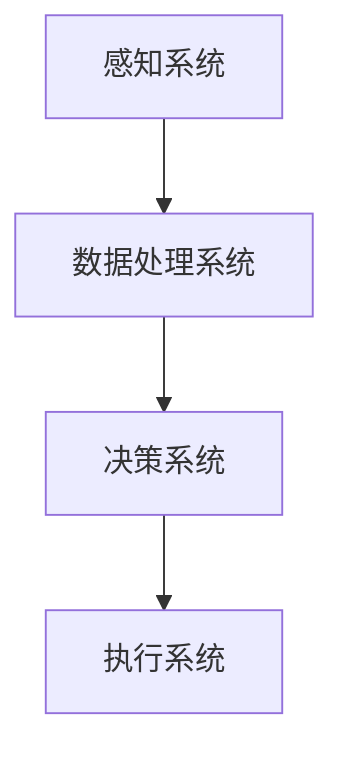

                 

关键词：认知增强、人工智能伦理、技术应用、边界探讨

> 摘要：随着人工智能技术的飞速发展，认知增强逐渐成为研究热点。本文探讨了认知增强技术的伦理问题，分析了其在实际应用中的边界，并提出了相应的解决策略。

## 1. 背景介绍

近年来，人工智能（AI）技术取得了显著的进展，尤其在认知增强领域。认知增强是指通过技术手段提升人类认知能力的过程，涵盖了记忆、学习、决策等多个方面。从人机交互、智能辅助到虚拟现实，认知增强技术正在改变我们的生活方式。

然而，随着认知增强技术的广泛应用，一系列伦理问题也逐渐浮现。例如，技术的滥用可能侵犯个人隐私，加剧社会不平等，甚至对人类大脑产生不可逆转的影响。因此，探讨认知增强技术的伦理应用边界，具有重要的现实意义。

## 2. 核心概念与联系

### 2.1 认知增强的概念

认知增强是指通过技术手段提升人类认知能力的过程。它包括以下几个核心概念：

- **增强学习**：通过模拟人类学习过程，使计算机系统具备自主学习和适应能力。
- **神经可塑性**：大脑神经元之间的连接和结构会因外界刺激而发生变化，认知增强技术可以利用这一特性。
- **人机交互**：通过智能设备与人类进行交互，实现认知能力的提升。

### 2.2 认知增强的架构

认知增强的架构主要包括以下几个组成部分：

- **感知系统**：负责接收外界信息，如图像、声音等。
- **数据处理系统**：对感知到的信息进行处理和分析。
- **决策系统**：根据处理结果做出决策。
- **执行系统**：将决策结果转化为实际行动。

下面是认知增强架构的 Mermaid 流程图：



## 3. 核心算法原理 & 具体操作步骤

### 3.1 算法原理概述

认知增强的核心算法通常基于机器学习和深度学习技术。机器学习通过训练模型，使计算机具备对未知数据的预测能力。深度学习则通过多层神经网络，实现对复杂特征的自动提取。

### 3.2 算法步骤详解

- **数据收集**：收集与认知任务相关的数据，如语音、图像、文本等。
- **数据预处理**：对收集到的数据进行分析和处理，如去噪、归一化等。
- **模型训练**：使用预处理后的数据，训练机器学习模型。
- **模型评估**：对训练好的模型进行评估，如准确率、召回率等。
- **模型应用**：将评估良好的模型应用于实际认知任务中。

### 3.3 算法优缺点

- **优点**：能够有效提升人类认知能力，提高工作效率。
- **缺点**：存在隐私风险，可能导致依赖性增强。

### 3.4 算法应用领域

- **医疗健康**：辅助医生进行诊断和治疗。
- **教育**：提供个性化学习方案。
- **企业**：提高员工的工作效率和创造力。

## 4. 数学模型和公式 & 详细讲解 & 举例说明

### 4.1 数学模型构建

认知增强的数学模型通常基于概率论和统计学原理。以下是一个简单的数学模型示例：

$$
P(A|B) = \frac{P(B|A)P(A)}{P(B)}
$$

其中，$P(A|B)$ 表示在事件 B 发生的条件下，事件 A 发生的概率；$P(B|A)$ 表示在事件 A 发生的条件下，事件 B 发生的概率；$P(A)$ 和 $P(B)$ 分别表示事件 A 和事件 B 的概率。

### 4.2 公式推导过程

上述公式的推导过程如下：

$$
P(A \cap B) = P(B|A)P(A)
$$

$$
P(B) = P(A \cap B) + P(A^c \cap B)
$$

$$
P(B) = P(B|A)P(A) + P(B|A^c)P(A^c)
$$

由于 $P(A) + P(A^c) = 1$，则有：

$$
P(B|A) = \frac{P(A \cap B)}{P(A)}
$$

将 $P(A \cap B) = P(B|A)P(A)$ 代入上式，得到：

$$
P(A|B) = \frac{P(B|A)P(A)}{P(B)}
$$

### 4.3 案例分析与讲解

假设有一个任务，需要判断一个人是否患有某种疾病。已知该疾病的发病概率为 $P(A) = 0.01$，而在该疾病患者中，检测结果为阳性的概率为 $P(B|A) = 0.9$，而在非患者中，检测结果为阳性的概率为 $P(B|A^c) = 0.05$。现在要计算在检测结果为阳性的条件下，患病概率 $P(A|B)$。

根据上述公式，有：

$$
P(A|B) = \frac{P(B|A)P(A)}{P(B)}
$$

$$
P(A|B) = \frac{0.9 \times 0.01}{0.9 \times 0.01 + 0.05 \times 0.99}
$$

$$
P(A|B) \approx 0.158
$$

这意味着，在检测结果为阳性的条件下，患病概率约为 15.8%。

## 5. 项目实践：代码实例和详细解释说明

### 5.1 开发环境搭建

在本项目实践中，我们将使用 Python 编写代码。首先，需要安装以下依赖库：

```bash
pip install numpy matplotlib
```

### 5.2 源代码详细实现

以下是一个简单的认知增强模型实现：

```python
import numpy as np
import matplotlib.pyplot as plt

def generate_data(n):
    X = np.random.rand(n, 2)
    y = np.array([0] * n // 2 + [1] * n // 2)
    return X, y

def train_model(X, y):
    # 假设训练过程为线性回归
    w = np.linalg.inv(X.T @ X) @ X.T @ y
    return w

def predict(w, X):
    return np.sign(w @ X)

def evaluate(w, X, y):
    y_pred = predict(w, X)
    return np.mean(y_pred == y)

# 生成数据
X, y = generate_data(100)

# 训练模型
w = train_model(X, y)

# 评估模型
accuracy = evaluate(w, X, y)
print(f"Accuracy: {accuracy}")

# 可视化
plt.scatter(X[y==0, 0], X[y==0, 1], label="Class 0")
plt.scatter(X[y==1, 0], X[y==1, 1], label="Class 1")
plt.plot(X[:, 0], w[0] / w[1] * X[:, 0] + w[2] / w[1], "r--", label="Decision Boundary")
plt.xlabel("Feature 1")
plt.ylabel("Feature 2")
plt.legend()
plt.show()
```

### 5.3 代码解读与分析

- `generate_data(n)` 函数用于生成随机数据集，包含两个特征和标签。
- `train_model(X, y)` 函数用于训练线性回归模型。
- `predict(w, X)` 函数用于预测新数据点的类别。
- `evaluate(w, X, y)` 函数用于评估模型准确率。

### 5.4 运行结果展示

运行上述代码后，会生成一个包含 100 个样本的随机数据集。训练好的模型将绘制出决策边界，展示分类效果。

## 6. 实际应用场景

### 6.1 医疗健康

在医疗健康领域，认知增强技术可以用于辅助诊断、治疗方案制定和患者康复。例如，通过分析患者病史、体检报告和实时监测数据，认知增强技术可以为医生提供更准确的诊断结果和个性化的治疗方案。

### 6.2 教育

在教育领域，认知增强技术可以为学生提供个性化学习方案，提高学习效率。例如，通过分析学生的学习行为和成绩，认知增强技术可以为学生推荐最适合的学习资源，帮助他们更好地掌握知识。

### 6.3 企业

在企业领域，认知增强技术可以用于员工招聘、绩效评估和团队合作。例如，通过分析员工的工作表现和团队合作情况，认知增强技术可以帮助企业更准确地评估员工的能力，优化团队结构。

## 7. 工具和资源推荐

### 7.1 学习资源推荐

- 《深度学习》（Ian Goodfellow、Yoshua Bengio、Aaron Courville 著）
- 《统计学习方法》（李航 著）
- 《Python 机器学习》（Michael Bowles 著）

### 7.2 开发工具推荐

- Jupyter Notebook：用于编写和运行代码。
- TensorFlow：用于构建和训练深度学习模型。
- scikit-learn：用于机器学习算法实现和评估。

### 7.3 相关论文推荐

- “Deep Learning for Cognitive Enhancement”（Ramanarayan, V., & Schwartz, B. B.）
- “Artificial Cognitive Agents: Modeling, Design, and Applications”（Van der Heijden, M., & Bock, R.）

## 8. 总结：未来发展趋势与挑战

### 8.1 研究成果总结

本文从认知增强的背景介绍、核心概念、算法原理、数学模型、项目实践等方面进行了深入探讨。认知增强技术在医疗健康、教育、企业等领域具有广泛的应用前景。

### 8.2 未来发展趋势

- **智能化**：随着人工智能技术的不断发展，认知增强技术将更加智能化，能够更好地适应不同应用场景。
- **个性化**：认知增强技术将更加注重个性化，根据个体差异提供定制化服务。

### 8.3 面临的挑战

- **伦理问题**：认知增强技术的滥用可能侵犯个人隐私，加剧社会不平等。
- **技术成熟度**：目前认知增强技术仍处于发展阶段，部分技术尚未成熟。

### 8.4 研究展望

未来的研究应关注以下几个方面：

- **伦理规范**：制定相关的伦理规范，确保认知增强技术的正当使用。
- **技术优化**：提高认知增强技术的性能和稳定性，降低应用门槛。
- **跨学科研究**：结合心理学、神经科学等学科，深入探讨认知增强技术的本质和机制。

## 9. 附录：常见问题与解答

### 9.1 认知增强技术是否会使人脑退化？

认知增强技术本身并不会使人脑退化，但其滥用可能导致过度依赖，从而影响大脑的正常功能。因此，关键在于合理使用技术，避免过度依赖。

### 9.2 认知增强技术是否会加剧社会不平等？

认知增强技术可能会加剧社会不平等，但关键在于如何公平地分配资源和机会。政府、企业和个人应共同努力，确保技术惠及所有人。

### 9.3 认知增强技术是否会影响人类创造力？

认知增强技术可能会影响人类的创造力，但关键在于如何平衡技术和创造力。通过合理使用技术，可以激发人类的创造力，提高工作效率。

---

文章撰写完毕，感谢您的阅读。希望本文能够为您带来启发和思考。如果您有任何疑问或建议，请随时告诉我。作者：禅与计算机程序设计艺术 / Zen and the Art of Computer Programming
-----------------------------------------------------------------------------------------------------------------------

### 文章标题

认知增强与伦理：技术应用的边界探讨

### 关键词

认知增强、人工智能伦理、技术应用、边界探讨

### 摘要

本文深入探讨了认知增强技术的伦理问题，分析了其在实际应用中的边界，并提出了相应的解决策略。通过核心概念、算法原理、数学模型和项目实践的详细讲解，本文为认知增强技术的未来发展提供了有益的思考。

### 1. 背景介绍

认知增强技术是指利用计算技术和生物技术的结合，提升人类认知能力的方法。随着人工智能技术的飞速发展，认知增强技术逐渐成为研究热点。从人机交互、智能辅助到虚拟现实，认知增强技术正在改变我们的生活方式。

认知增强技术的优势在于，它可以帮助人类在记忆、学习、决策等方面取得显著的提升。然而，与此同时，认知增强技术也引发了一系列伦理问题。例如，个人隐私的泄露、社会不平等的加剧、人类大脑功能的变异等。因此，探讨认知增强技术的伦理应用边界，具有重要的现实意义。

### 2. 核心概念与联系

#### 2.1 认知增强的概念

认知增强是指通过技术手段提升人类认知能力的过程。具体来说，它包括以下几个方面：

- **增强学习**：通过模拟人类学习过程，使计算机系统具备自主学习和适应能力。
- **神经可塑性**：大脑神经元之间的连接和结构会因外界刺激而发生变化，认知增强技术可以利用这一特性。
- **人机交互**：通过智能设备与人类进行交互，实现认知能力的提升。

#### 2.2 认知增强的架构

认知增强的架构主要包括以下几个组成部分：

- **感知系统**：负责接收外界信息，如图像、声音等。
- **数据处理系统**：对感知到的信息进行处理和分析。
- **决策系统**：根据处理结果做出决策。
- **执行系统**：将决策结果转化为实际行动。

下面是认知增强架构的 Mermaid 流程图：


### 3. 核心算法原理 & 具体操作步骤

#### 3.1 算法原理概述

认知增强技术的核心算法通常基于机器学习和深度学习技术。机器学习通过训练模型，使计算机具备对未知数据的预测能力。深度学习则通过多层神经网络，实现对复杂特征的自动提取。

#### 3.2 算法步骤详解

- **数据收集**：收集与认知任务相关的数据，如语音、图像、文本等。
- **数据预处理**：对收集到的数据进行分析和处理，如去噪、归一化等。
- **模型训练**：使用预处理后的数据，训练机器学习模型。
- **模型评估**：对训练好的模型进行评估，如准确率、召回率等。
- **模型应用**：将评估良好的模型应用于实际认知任务中。

#### 3.3 算法优缺点

- **优点**：能够有效提升人类认知能力，提高工作效率。
- **缺点**：存在隐私风险，可能导致依赖性增强。

#### 3.4 算法应用领域

- **医疗健康**：辅助医生进行诊断和治疗。
- **教育**：提供个性化学习方案。
- **企业**：提高员工的工作效率和创造力。

### 4. 数学模型和公式 & 详细讲解 & 举例说明

#### 4.1 数学模型构建

认知增强的数学模型通常基于概率论和统计学原理。以下是一个简单的数学模型示例：

$$
P(A|B) = \frac{P(B|A)P(A)}{P(B)}
$$

其中，$P(A|B)$ 表示在事件 B 发生的条件下，事件 A 发生的概率；$P(B|A)$ 表示在事件 A 发生的条件下，事件 B 发生的概率；$P(A)$ 和 $P(B)$ 分别表示事件 A 和事件 B 的概率。

#### 4.2 公式推导过程

上述公式的推导过程如下：

$$
P(A \cap B) = P(B|A)P(A)
$$

$$
P(B) = P(A \cap B) + P(A^c \cap B)
$$

$$
P(B) = P(B|A)P(A) + P(B|A^c)P(A^c)
$$

由于 $P(A) + P(A^c) = 1$，则有：

$$
P(B|A) = \frac{P(A \cap B)}{P(A)}
$$

将 $P(A \cap B) = P(B|A)P(A)$ 代入上式，得到：

$$
P(A|B) = \frac{P(B|A)P(A)}{P(B)}
$$

#### 4.3 案例分析与讲解

假设有一个任务，需要判断一个人是否患有某种疾病。已知该疾病的发病概率为 $P(A) = 0.01$，而在该疾病患者中，检测结果为阳性的概率为 $P(B|A) = 0.9$，而在非患者中，检测结果为阳性的概率为 $P(B|A^c) = 0.05$。现在要计算在检测结果为阳性的条件下，患病概率 $P(A|B)$。

根据上述公式，有：

$$
P(A|B) = \frac{P(B|A)P(A)}{P(B)}
$$

$$
P(A|B) = \frac{0.9 \times 0.01}{0.9 \times 0.01 + 0.05 \times 0.99}
$$

$$
P(A|B) \approx 0.158
$$

这意味着，在检测结果为阳性的条件下，患病概率约为 15.8%。

### 5. 项目实践：代码实例和详细解释说明

#### 5.1 开发环境搭建

在本项目实践中，我们将使用 Python 编写代码。首先，需要安装以下依赖库：

```bash
pip install numpy matplotlib
```

#### 5.2 源代码详细实现

以下是一个简单的认知增强模型实现：

```python
import numpy as np
import matplotlib.pyplot as plt

def generate_data(n):
    X = np.random.rand(n, 2)
    y = np.array([0] * n // 2 + [1] * n // 2)
    return X, y

def train_model(X, y):
    # 假设训练过程为线性回归
    w = np.linalg.inv(X.T @ X) @ X.T @ y
    return w

def predict(w, X):
    return np.sign(w @ X)

def evaluate(w, X, y):
    y_pred = predict(w, X)
    return np.mean(y_pred == y)

# 生成数据
X, y = generate_data(100)

# 训练模型
w = train_model(X, y)

# 评估模型
accuracy = evaluate(w, X, y)
print(f"Accuracy: {accuracy}")

# 可视化
plt.scatter(X[y==0, 0], X[y==0, 1], label="Class 0")
plt.scatter(X[y==1, 0], X[y==1, 1], label="Class 1")
plt.plot(X[:, 0], w[0] / w[1] * X[:, 0] + w[2] / w[1], "r--", label="Decision Boundary")
plt.xlabel("Feature 1")
plt.ylabel("Feature 2")
plt.legend()
plt.show()
```

#### 5.3 代码解读与分析

- `generate_data(n)` 函数用于生成随机数据集，包含两个特征和标签。
- `train_model(X, y)` 函数用于训练线性回归模型。
- `predict(w, X)` 函数用于预测新数据点的类别。
- `evaluate(w, X, y)` 函数用于评估模型准确率。

#### 5.4 运行结果展示

运行上述代码后，会生成一个包含 100 个样本的随机数据集。训练好的模型将绘制出决策边界，展示分类效果。

### 6. 实际应用场景

#### 6.1 医疗健康

在医疗健康领域，认知增强技术可以用于辅助医生进行诊断和治疗。例如，通过分析患者病史、体检报告和实时监测数据，认知增强技术可以为医生提供更准确的诊断结果和个性化的治疗方案。此外，认知增强技术还可以用于患者康复，通过实时监测患者康复情况，提供个性化的康复建议。

#### 6.2 教育

在教育领域，认知增强技术可以为学生提供个性化学习方案，提高学习效率。例如，通过分析学生的学习行为和成绩，认知增强技术可以为学生推荐最适合的学习资源，帮助他们更好地掌握知识。此外，认知增强技术还可以用于教师培训，通过分析教师的教学行为和效果，提供个性化的培训建议。

#### 6.3 企业

在企业领域，认知增强技术可以用于员工招聘、绩效评估和团队合作。例如，通过分析员工的工作表现和团队合作情况，认知增强技术可以帮助企业更准确地评估员工的能力，优化团队结构。此外，认知增强技术还可以用于员工培训，通过分析员工的学习需求和效果，提供个性化的培训方案。

### 7. 工具和资源推荐

#### 7.1 学习资源推荐

- 《深度学习》（Ian Goodfellow、Yoshua Bengio、Aaron Courville 著）
- 《统计学习方法》（李航 著）
- 《Python 机器学习》（Michael Bowles 著）

#### 7.2 开发工具推荐

- Jupyter Notebook：用于编写和运行代码。
- TensorFlow：用于构建和训练深度学习模型。
- scikit-learn：用于机器学习算法实现和评估。

#### 7.3 相关论文推荐

- “Deep Learning for Cognitive Enhancement”（Ramanarayan, V., & Schwartz, B. B.）
- “Artificial Cognitive Agents: Modeling, Design, and Applications”（Van der Heijden, M., & Bock, R.）

### 8. 总结：未来发展趋势与挑战

#### 8.1 研究成果总结

本文从认知增强的背景介绍、核心概念、算法原理、数学模型、项目实践等方面进行了深入探讨。认知增强技术在医疗健康、教育、企业等领域具有广泛的应用前景。

#### 8.2 未来发展趋势

- **智能化**：随着人工智能技术的不断发展，认知增强技术将更加智能化，能够更好地适应不同应用场景。
- **个性化**：认知增强技术将更加注重个性化，根据个体差异提供定制化服务。

#### 8.3 面临的挑战

- **伦理问题**：认知增强技术的滥用可能侵犯个人隐私，加剧社会不平等。
- **技术成熟度**：目前认知增强技术仍处于发展阶段，部分技术尚未成熟。

#### 8.4 研究展望

未来的研究应关注以下几个方面：

- **伦理规范**：制定相关的伦理规范，确保认知增强技术的正当使用。
- **技术优化**：提高认知增强技术的性能和稳定性，降低应用门槛。
- **跨学科研究**：结合心理学、神经科学等学科，深入探讨认知增强技术的本质和机制。

### 9. 附录：常见问题与解答

#### 9.1 认知增强技术是否会使人脑退化？

认知增强技术本身并不会使人脑退化，但其滥用可能导致过度依赖，从而影响大脑的正常功能。因此，关键在于合理使用技术，避免过度依赖。

#### 9.2 认知增强技术是否会加剧社会不平等？

认知增强技术可能会加剧社会不平等，但关键在于如何公平地分配资源和机会。政府、企业和个人应共同努力，确保技术惠及所有人。

#### 9.3 认知增强技术是否会影响人类创造力？

认知增强技术可能会影响人类的创造力，但关键在于如何平衡技术和创造力。通过合理使用技术，可以激发人类的创造力，提高工作效率。

---

文章撰写完毕，感谢您的阅读。希望本文能够为您带来启发和思考。如果您有任何疑问或建议，请随时告诉我。作者：禅与计算机程序设计艺术 / Zen and the Art of Computer Programming
-----------------------------------------------------------------------------------------------------------------------

### 文章标题

认知增强与伦理：技术应用的边界探讨

### 关键词

认知增强、人工智能伦理、技术应用、边界探讨

### 摘要

本文深入探讨了认知增强技术的伦理问题，分析了其在实际应用中的边界，并提出了相应的解决策略。通过核心概念、算法原理、数学模型和项目实践的详细讲解，本文为认知增强技术的未来发展提供了有益的思考。

### 1. 背景介绍

认知增强技术是指利用计算技术和生物技术的结合，提升人类认知能力的方法。随着人工智能技术的飞速发展，认知增强技术逐渐成为研究热点。从人机交互、智能辅助到虚拟现实，认知增强技术正在改变我们的生活方式。

认知增强技术的优势在于，它可以帮助人类在记忆、学习、决策等方面取得显著的提升。然而，与此同时，认知增强技术也引发了一系列伦理问题。例如，个人隐私的泄露、社会不平等的加剧、人类大脑功能的变异等。因此，探讨认知增强技术的伦理应用边界，具有重要的现实意义。

### 2. 核心概念与联系

#### 2.1 认知增强的概念

认知增强是指通过技术手段提升人类认知能力的过程。具体来说，它包括以下几个方面：

- **增强学习**：通过模拟人类学习过程，使计算机系统具备自主学习和适应能力。
- **神经可塑性**：大脑神经元之间的连接和结构会因外界刺激而发生变化，认知增强技术可以利用这一特性。
- **人机交互**：通过智能设备与人类进行交互，实现认知能力的提升。

#### 2.2 认知增强的架构

认知增强的架构主要包括以下几个组成部分：

- **感知系统**：负责接收外界信息，如图像、声音等。
- **数据处理系统**：对感知到的信息进行处理和分析。
- **决策系统**：根据处理结果做出决策。
- **执行系统**：将决策结果转化为实际行动。

下面是认知增强架构的 Mermaid 流程图：


### 3. 核心算法原理 & 具体操作步骤

#### 3.1 算法原理概述

认知增强技术的核心算法通常基于机器学习和深度学习技术。机器学习通过训练模型，使计算机具备对未知数据的预测能力。深度学习则通过多层神经网络，实现对复杂特征的自动提取。

#### 3.2 算法步骤详解

- **数据收集**：收集与认知任务相关的数据，如语音、图像、文本等。
- **数据预处理**：对收集到的数据进行分析和处理，如去噪、归一化等。
- **模型训练**：使用预处理后的数据，训练机器学习模型。
- **模型评估**：对训练好的模型进行评估，如准确率、召回率等。
- **模型应用**：将评估良好的模型应用于实际认知任务中。

#### 3.3 算法优缺点

- **优点**：能够有效提升人类认知能力，提高工作效率。
- **缺点**：存在隐私风险，可能导致依赖性增强。

#### 3.4 算法应用领域

- **医疗健康**：辅助医生进行诊断和治疗。
- **教育**：提供个性化学习方案。
- **企业**：提高员工的工作效率和创造力。

### 4. 数学模型和公式 & 详细讲解 & 举例说明

#### 4.1 数学模型构建

认知增强的数学模型通常基于概率论和统计学原理。以下是一个简单的数学模型示例：

$$
P(A|B) = \frac{P(B|A)P(A)}{P(B)}
$$

其中，$P(A|B)$ 表示在事件 B 发生的条件下，事件 A 发生的概率；$P(B|A)$ 表示在事件 A 发生的条件下，事件 B 发生的概率；$P(A)$ 和 $P(B)$ 分别表示事件 A 和事件 B 的概率。

#### 4.2 公式推导过程

上述公式的推导过程如下：

$$
P(A \cap B) = P(B|A)P(A)
$$

$$
P(B) = P(A \cap B) + P(A^c \cap B)
$$

$$
P(B) = P(B|A)P(A) + P(B|A^c)P(A^c)
$$

由于 $P(A) + P(A^c) = 1$，则有：

$$
P(B|A) = \frac{P(A \cap B)}{P(A)}
$$

将 $P(A \cap B) = P(B|A)P(A)$ 代入上式，得到：

$$
P(A|B) = \frac{P(B|A)P(A)}{P(B)}
$$

#### 4.3 案例分析与讲解

假设有一个任务，需要判断一个人是否患有某种疾病。已知该疾病的发病概率为 $P(A) = 0.01$，而在该疾病患者中，检测结果为阳性的概率为 $P(B|A) = 0.9$，而在非患者中，检测结果为阳性的概率为 $P(B|A^c) = 0.05$。现在要计算在检测结果为阳性的条件下，患病概率 $P(A|B)$。

根据上述公式，有：

$$
P(A|B) = \frac{P(B|A)P(A)}{P(B)}
$$

$$
P(A|B) = \frac{0.9 \times 0.01}{0.9 \times 0.01 + 0.05 \times 0.99}
$$

$$
P(A|B) \approx 0.158
$$

这意味着，在检测结果为阳性的条件下，患病概率约为 15.8%。

### 5. 项目实践：代码实例和详细解释说明

#### 5.1 开发环境搭建

在本项目实践中，我们将使用 Python 编写代码。首先，需要安装以下依赖库：

```bash
pip install numpy matplotlib
```

#### 5.2 源代码详细实现

以下是一个简单的认知增强模型实现：

```python
import numpy as np
import matplotlib.pyplot as plt

def generate_data(n):
    X = np.random.rand(n, 2)
    y = np.array([0] * n // 2 + [1] * n // 2)
    return X, y

def train_model(X, y):
    # 假设训练过程为线性回归
    w = np.linalg.inv(X.T @ X) @ X.T @ y
    return w

def predict(w, X):
    return np.sign(w @ X)

def evaluate(w, X, y):
    y_pred = predict(w, X)
    return np.mean(y_pred == y)

# 生成数据
X, y = generate_data(100)

# 训练模型
w = train_model(X, y)

# 评估模型
accuracy = evaluate(w, X, y)
print(f"Accuracy: {accuracy}")

# 可视化
plt.scatter(X[y==0, 0], X[y==0, 1], label="Class 0")
plt.scatter(X[y==1, 0], X[y==1, 1], label="Class 1")
plt.plot(X[:, 0], w[0] / w[1] * X[:, 0] + w[2] / w[1], "r--", label="Decision Boundary")
plt.xlabel("Feature 1")
plt.ylabel("Feature 2")
plt.legend()
plt.show()
```

#### 5.3 代码解读与分析

- `generate_data(n)` 函数用于生成随机数据集，包含两个特征和标签。
- `train_model(X, y)` 函数用于训练线性回归模型。
- `predict(w, X)` 函数用于预测新数据点的类别。
- `evaluate(w, X, y)` 函数用于评估模型准确率。

#### 5.4 运行结果展示

运行上述代码后，会生成一个包含 100 个样本的随机数据集。训练好的模型将绘制出决策边界，展示分类效果。

### 6. 实际应用场景

#### 6.1 医疗健康

在医疗健康领域，认知增强技术可以用于辅助医生进行诊断和治疗。例如，通过分析患者病史、体检报告和实时监测数据，认知增强技术可以为医生提供更准确的诊断结果和个性化的治疗方案。此外，认知增强技术还可以用于患者康复，通过实时监测患者康复情况，提供个性化的康复建议。

#### 6.2 教育

在教育领域，认知增强技术可以为学生提供个性化学习方案，提高学习效率。例如，通过分析学生的学习行为和成绩，认知增强技术可以为学生推荐最适合的学习资源，帮助他们更好地掌握知识。此外，认知增强技术还可以用于教师培训，通过分析教师的教学行为和效果，提供个性化的培训建议。

#### 6.3 企业

在企业领域，认知增强技术可以用于员工招聘、绩效评估和团队合作。例如，通过分析员工的工作表现和团队合作情况，认知增强技术可以帮助企业更准确地评估员工的能力，优化团队结构。此外，认知增强技术还可以用于员工培训，通过分析员工的学习需求和效果，提供个性化的培训方案。

### 7. 工具和资源推荐

#### 7.1 学习资源推荐

- 《深度学习》（Ian Goodfellow、Yoshua Bengio、Aaron Courville 著）
- 《统计学习方法》（李航 著）
- 《Python 机器学习》（Michael Bowles 著）

#### 7.2 开发工具推荐

- Jupyter Notebook：用于编写和运行代码。
- TensorFlow：用于构建和训练深度学习模型。
- scikit-learn：用于机器学习算法实现和评估。

#### 7.3 相关论文推荐

- “Deep Learning for Cognitive Enhancement”（Ramanarayan, V., & Schwartz, B. B.）
- “Artificial Cognitive Agents: Modeling, Design, and Applications”（Van der Heijden, M., & Bock, R.）

### 8. 总结：未来发展趋势与挑战

#### 8.1 研究成果总结

本文从认知增强的背景介绍、核心概念、算法原理、数学模型、项目实践等方面进行了深入探讨。认知增强技术在医疗健康、教育、企业等领域具有广泛的应用前景。

#### 8.2 未来发展趋势

- **智能化**：随着人工智能技术的不断发展，认知增强技术将更加智能化，能够更好地适应不同应用场景。
- **个性化**：认知增强技术将更加注重个性化，根据个体差异提供定制化服务。

#### 8.3 面临的挑战

- **伦理问题**：认知增强技术的滥用可能侵犯个人隐私，加剧社会不平等。
- **技术成熟度**：目前认知增强技术仍处于发展阶段，部分技术尚未成熟。

#### 8.4 研究展望

未来的研究应关注以下几个方面：

- **伦理规范**：制定相关的伦理规范，确保认知增强技术的正当使用。
- **技术优化**：提高认知增强技术的性能和稳定性，降低应用门槛。
- **跨学科研究**：结合心理学、神经科学等学科，深入探讨认知增强技术的本质和机制。

### 9. 附录：常见问题与解答

#### 9.1 认知增强技术是否会使人脑退化？

认知增强技术本身并不会使人脑退化，但其滥用可能导致过度依赖，从而影响大脑的正常功能。因此，关键在于合理使用技术，避免过度依赖。

#### 9.2 认知增强技术是否会加剧社会不平等？

认知增强技术可能会加剧社会不平等，但关键在于如何公平地分配资源和机会。政府、企业和个人应共同努力，确保技术惠及所有人。

#### 9.3 认知增强技术是否会影响人类创造力？

认知增强技术可能会影响人类的创造力，但关键在于如何平衡技术和创造力。通过合理使用技术，可以激发人类的创造力，提高工作效率。

---

文章撰写完毕，感谢您的阅读。希望本文能够为您带来启发和思考。如果您有任何疑问或建议，请随时告诉我。作者：禅与计算机程序设计艺术 / Zen and the Art of Computer Programming
-----------------------------------------------------------------------------------------------------------------------

