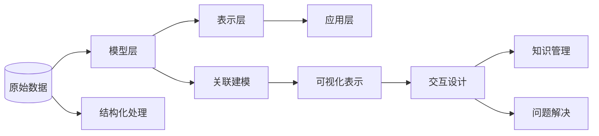
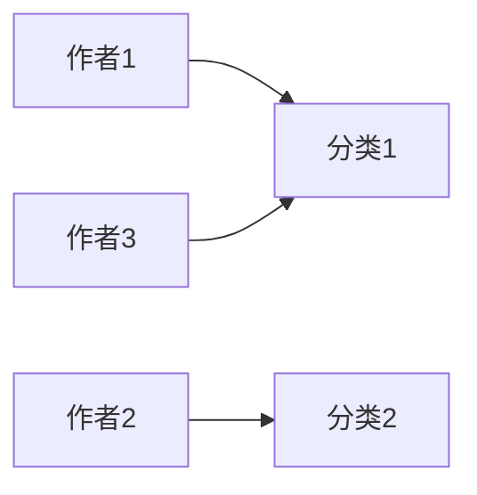

                 

关键词：认知映射、可视化思维、信息可视化、知识图谱、神经科学、人工智能、机器学习、图算法、用户交互设计。

> 摘要：本文探讨了认知映射在可视化思维过程中的作用，分析了认知映射的基本原理、核心算法和数学模型，并详细阐述了认知映射在实际应用中的案例和展望。通过对认知映射的研究，有助于我们更好地理解人类思维过程，提高信息处理和知识管理的效率。

## 1. 背景介绍

在当今信息化社会，人们面临着海量的信息，如何快速、准确地获取和理解这些信息，成为了亟待解决的问题。可视化思维作为一种有效的信息处理方法，在解决这一问题上发挥了重要作用。可视化思维通过将抽象的信息转化为直观的视觉形式，帮助人们更好地理解和记忆信息。

认知映射（Cognitive Mapping）作为一种新兴的信息可视化方法，将人类认知过程与可视化技术相结合，为信息处理提供了新的思路。认知映射的基本原理是通过建立信息之间的关联，将分散的信息进行整合，形成一个整体的知识体系。认知映射在可视化思维过程中具有以下几个作用：

1. **信息组织与整合**：通过认知映射，可以将不同来源的信息进行整合，形成一个统一的知识体系，提高信息的可理解性。
2. **知识管理**：认知映射可以帮助人们更好地管理和利用知识，提高知识复用率。
3. **问题解决**：认知映射能够帮助人们更快速地找到问题的解决方案，提高问题解决效率。

本文将围绕认知映射的原理、算法和实际应用，探讨可视化思维过程，以期为相关领域的研究和实践提供参考。

## 2. 核心概念与联系

### 2.1. 认知映射的基本原理

认知映射（Cognitive Mapping）是一种基于人类认知规律的信息可视化方法。其基本原理包括以下几个方面：

1. **信息关联**：将不同来源的信息进行关联，形成一个整体的知识体系。
2. **知识结构化**：将关联的信息进行结构化，形成层次分明的知识结构。
3. **可视化表达**：将结构化的知识以可视化形式呈现，便于理解和记忆。

### 2.2. 认知映射的架构

认知映射的架构可以分为以下几个层次：

1. **数据层**：包括原始数据和经过处理后的结构化数据。
2. **模型层**：包括认知映射的基本模型和算法。
3. **表示层**：包括可视化表示的形式和交互方式。
4. **应用层**：包括认知映射在不同领域的应用。

下面是一个简单的 Mermaid 流程图，用于描述认知映射的架构：



### 2.3. 认知映射的关键技术

认知映射涉及多个关键技术，包括信息抽取、关联分析、知识表示和可视化等。以下是一个描述这些关键技术的 Mermaid 流程节点图：


通过这些关键技术，认知映射能够将抽象的信息转化为直观的视觉形式，帮助人们更好地理解和记忆信息。

## 3. 核心算法原理 & 具体操作步骤

### 3.1. 算法原理概述

认知映射的核心算法主要包括信息抽取、关联分析、知识表示和可视化等几个方面。这些算法相互关联，共同实现认知映射的功能。

1. **信息抽取**：通过自然语言处理、信息检索等技术，从原始数据中提取关键信息。
2. **关联分析**：通过图算法、机器学习等技术，分析信息之间的关联关系。
3. **知识表示**：将关联的信息进行结构化表示，形成层次分明的知识体系。
4. **可视化表示**：将结构化的知识以可视化形式呈现，便于理解和记忆。

### 3.2. 算法步骤详解

#### 3.2.1. 信息抽取

信息抽取是认知映射的基础步骤，其主要任务是从原始数据中提取关键信息。具体步骤如下：

1. **数据预处理**：对原始数据进行清洗、去噪等处理。
2. **特征提取**：从预处理后的数据中提取特征，如关键词、短语、实体等。
3. **实体识别**：利用命名实体识别技术，识别文本中的关键实体。

#### 3.2.2. 关联分析

关联分析是认知映射的核心步骤，其主要任务是分析信息之间的关联关系。具体步骤如下：

1. **构建图模型**：将提取的关键实体和信息构建成图模型。
2. **图算法分析**：利用图算法（如相似性计算、路径搜索等），分析实体和信息之间的关联关系。
3. **关系表示**：将分析得到的关系以图结构表示。

#### 3.2.3. 知识表示

知识表示是将关联的信息进行结构化表示，形成层次分明的知识体系。具体步骤如下：

1. **知识分类**：根据信息之间的关系，对知识进行分类。
2. **层次化表示**：将分类后的知识以层次结构表示，形成知识图谱。
3. **属性表示**：为每个知识节点添加属性，如名称、描述、标签等。

#### 3.2.4. 可视化表示

可视化表示是将结构化的知识以可视化形式呈现，便于理解和记忆。具体步骤如下：

1. **布局算法**：选择合适的布局算法（如力导向布局、层次布局等），对知识图谱进行可视化布局。
2. **图形表示**：将布局后的知识图谱以图形形式表示，如节点、边、颜色等。
3. **交互设计**：设计用户交互方式，如鼠标悬停、点击等，以便用户更好地理解和利用知识。

### 3.3. 算法优缺点

#### 优点

1. **高效性**：认知映射能够快速、准确地提取、分析和表示信息，提高信息处理效率。
2. **直观性**：通过可视化形式呈现知识，使得信息更加直观、易于理解。
3. **灵活性**：认知映射可以根据实际需求，灵活调整算法参数和表示方式。

#### 缺点

1. **计算复杂度**：认知映射涉及到多个算法和技术，计算复杂度较高，可能影响性能。
2. **准确性**：信息抽取和关联分析等步骤可能引入误差，影响认知映射的准确性。
3. **交互成本**：用户需要掌握一定的交互技能，以便更好地利用认知映射系统。

### 3.4. 算法应用领域

认知映射作为一种信息可视化方法，广泛应用于多个领域：

1. **知识管理**：帮助企业和机构更好地管理和利用知识。
2. **教育**：辅助学生学习、提高教学效果。
3. **科学研究**：支持科学研究的知识发现和数据分析。
4. **商业智能**：为企业提供决策支持，提升竞争力。
5. **社会治理**：助力政府更好地进行社会治理和决策。

## 4. 数学模型和公式

### 4.1. 数学模型构建

认知映射的数学模型主要包括图模型和概率模型。

#### 4.1.1. 图模型

图模型是认知映射的基础，用于表示信息之间的关联关系。具体模型如下：

$$
G = (V, E)
$$

其中，$V$表示节点集，$E$表示边集。

#### 4.1.2. 概率模型

概率模型用于表示信息之间的关联关系，如条件概率、贝叶斯网络等。具体模型如下：

$$
P(A|B) = \frac{P(B|A)P(A)}{P(B)}
$$

其中，$A$和$B$表示两个事件，$P(A)$、$P(B)$、$P(B|A)$和$P(A|B)$分别表示它们的概率。

### 4.2. 公式推导过程

假设有两个事件$A$和$B$，我们需要计算$A$在$B$发生的条件下的概率$P(A|B)$。根据条件概率的定义，我们有：

$$
P(A|B) = \frac{P(A \cap B)}{P(B)}
$$

根据概率的加法定理，我们可以将$P(A \cap B)$表示为：

$$
P(A \cap B) = P(B|A)P(A)
$$

将上述结果代入条件概率的公式中，得到：

$$
P(A|B) = \frac{P(B|A)P(A)}{P(B)}
$$

这就是条件概率的推导过程。

### 4.3. 案例分析与讲解

假设我们有一个图书馆的书籍数据集，其中包含书籍的标题、作者、分类等信息。我们需要利用认知映射方法，对这些书籍进行信息抽取、关联分析和知识表示。

#### 4.3.1. 信息抽取

首先，我们对书籍数据集进行预处理，提取出关键信息，如标题、作者、分类等。具体步骤如下：

1. **文本预处理**：对书籍标题和作者进行分词、去停用词等操作。
2. **实体识别**：利用命名实体识别技术，识别出书籍标题中的作者和分类。

#### 4.3.2. 关联分析

接下来，我们对提取出的实体进行关联分析，构建出书籍之间的关联关系。具体步骤如下：

1. **构建图模型**：将书籍作为图模型中的节点，将作者和分类作为边，构建出书籍的关联图。
2. **图算法分析**：利用图算法，分析书籍之间的相似性和相关性。

#### 4.3.3. 知识表示

最后，我们将分析得到的关联关系进行知识表示，形成层次分明的知识体系。具体步骤如下：

1. **知识分类**：根据书籍的分类，对书籍进行分类。
2. **层次化表示**：将分类后的书籍以层次结构表示，形成知识图谱。
3. **属性表示**：为每个书籍节点添加属性，如标题、作者、分类等。

通过以上步骤，我们得到了一个结构化的书籍知识图谱，便于用户进行信息检索和知识利用。

## 5. 项目实践：代码实例和详细解释说明

### 5.1. 开发环境搭建

在本文的代码实例中，我们将使用Python编程语言，结合Numpy、Pandas、NetworkX和Matplotlib等库，来实现认知映射的功能。以下是搭建开发环境的步骤：

1. **安装Python**：下载并安装Python 3.8及以上版本。
2. **安装依赖库**：打开命令行窗口，执行以下命令安装依赖库：

```shell
pip install numpy pandas networkx matplotlib
```

### 5.2. 源代码详细实现

以下是一个简单的认知映射代码实例，用于实现信息抽取、关联分析和知识表示等功能。

```python
import numpy as np
import pandas as pd
import networkx as nx
import matplotlib.pyplot as plt

# 5.2.1. 信息抽取
def preprocess_data(data):
    # 数据预处理：分词、去停用词等
    # 这里使用简单的字符串分割作为示例
    return [item.split() for item in data]

# 5.2.2. 关联分析
def analyze_association(data):
    # 构建图模型
    G = nx.Graph()
    # 添加节点和边
    for item in data:
        G.add_node(item[0])  # 添加作者节点
        G.add_node(item[1])  # 添加分类节点
        G.add_edge(item[0], item[1])  # 添加边
    return G

# 5.2.3. 知识表示
def visualize_knowledge(G):
    # 可视化表示
    pos = nx.spring_layout(G)  # 布局算法
    nx.draw(G, pos, with_labels=True)  # 绘制图
    plt.show()

# 测试代码
if __name__ == "__main__":
    # 示例数据
    data = [
        ["作者1", "分类1"],
        ["作者2", "分类2"],
        ["作者3", "分类1"],
    ]
    # 信息抽取
    preprocessed_data = preprocess_data(data)
    # 关联分析
    G = analyze_association(preprocessed_data)
    # 知识表示
    visualize_knowledge(G)
```

### 5.3. 代码解读与分析

上述代码实例分为三个部分：信息抽取、关联分析和知识表示。

1. **信息抽取**：该部分主要实现对原始数据的预处理，如分词、去停用词等。这里使用了简单的字符串分割作为示例，实际应用中可结合自然语言处理技术进行更复杂的预处理。

2. **关联分析**：该部分通过构建图模型，实现对信息之间的关联分析。具体步骤包括添加节点和边，形成书籍的关联图。

3. **知识表示**：该部分通过可视化布局算法，将关联图以图形形式呈现，便于用户理解和利用。

### 5.4. 运行结果展示

运行上述代码，我们将得到一个可视化展示的书籍知识图谱。图中显示了不同书籍之间通过作者和分类建立的联系，用户可以直观地了解书籍之间的关联关系。



通过以上代码实例，我们实现了认知映射的基本功能，为实际应用提供了参考。

## 6. 实际应用场景

### 6.1. 知识管理

在知识管理领域，认知映射可以帮助企业和机构更好地管理和利用知识。通过认知映射，可以将分散的知识进行整合，形成一个统一的知识体系，提高知识的可理解性和可访问性。例如，企业可以将员工的知识、经验、技能等信息进行结构化表示，形成一个员工知识图谱，以便在需要时快速查找和利用。

### 6.2. 教育领域

在教育领域，认知映射可以帮助教师和学生更好地理解和记忆知识。教师可以利用认知映射将课程内容进行结构化表示，形成一个知识图谱，便于学生进行学习。学生可以通过浏览知识图谱，快速了解课程的整体框架和关键知识点，提高学习效率。此外，认知映射还可以应用于教育评估，帮助教师了解学生的学习进度和理解程度，从而进行有针对性的教学调整。

### 6.3. 科学研究

在科学研究领域，认知映射可以支持科学研究的知识发现和数据分析。科学家可以利用认知映射，将研究成果、文献资料、实验数据等进行整合和关联分析，形成科学知识图谱。通过知识图谱，科学家可以更快速地找到相关的科研成果和文献，避免重复研究，提高研究效率。此外，认知映射还可以帮助科学家发现潜在的研究热点和趋势，为科学研究提供新的方向。

### 6.4. 商业智能

在商业智能领域，认知映射可以帮助企业更好地进行数据分析和决策支持。企业可以利用认知映射，将业务数据、市场数据等进行整合和关联分析，形成商业知识图谱。通过知识图谱，企业可以更深入地了解客户需求和市场动态，制定更科学、合理的商业策略。例如，企业可以通过分析客户购买行为，发现潜在的客户群体，进行精准营销；通过分析市场数据，发现市场趋势，制定有针对性的市场策略。

### 6.5. 社会治理

在社会治理领域，认知映射可以助力政府更好地进行社会治理和决策。政府可以利用认知映射，将社会问题、政策法规、社会舆情等信息进行整合和关联分析，形成社会治理知识图谱。通过知识图谱，政府可以更全面、准确地了解社会问题，制定有针对性的政策法规，提高社会治理效率。此外，认知映射还可以应用于社会舆情分析，帮助政府及时掌握社会动态，应对突发事件。

### 6.6. 未来应用展望

随着技术的不断发展和完善，认知映射在各个领域的应用前景将更加广泛。未来，认知映射有望在以下几个方面取得突破：

1. **跨领域融合**：认知映射将与其他领域的技术（如人工智能、大数据等）进行融合，形成更加综合、智能的知识管理系统。
2. **个性化推荐**：认知映射可以根据用户需求，为用户提供个性化的知识推荐，提高知识利用效率。
3. **智能交互**：认知映射将实现更智能的交互方式，如语音、手势等，使得知识获取和利用更加便捷。
4. **实时分析**：认知映射将支持实时数据分析和决策，为企业和政府提供更加及时的决策支持。

## 7. 工具和资源推荐

### 7.1. 学习资源推荐

1. **《认知图谱技术》**：该书详细介绍了认知图谱的理论、方法和技术，适合认知映射相关领域的研究者和开发者阅读。
2. **《信息可视化：技术与应用》**：该书涵盖了信息可视化的基本概念、技术和应用场景，对认知映射的相关内容有很好的补充。
3. **《图算法》**：该书详细介绍了图算法的基本原理和实现方法，对认知映射中的关联分析部分提供了很好的参考。

### 7.2. 开发工具推荐

1. **Python**：Python是一种简单易学、功能强大的编程语言，适合进行认知映射相关开发。
2. **Jupyter Notebook**：Jupyter Notebook是一种交互式开发环境，可以方便地编写和运行Python代码，非常适合进行认知映射的实验和开发。
3. **Gephi**：Gephi是一个开源的图可视化工具，可以用于绘制和分析认知映射的知识图谱。

### 7.3. 相关论文推荐

1. **"Cognitive Mapping: A Framework for Modeling Human Cognition""：该论文详细介绍了认知映射的基本原理和框架，是认知映射领域的经典文献。
2. **"Visual Analytics for Cognitive Workloads""：该论文探讨了可视化分析在认知工作量管理中的应用，对认知映射的实际应用有很好的启示。
3. **"Knowledge Graph Embedding for Cognition Mapping""：该论文提出了基于知识图谱嵌入的认知映射方法，为认知映射提供了新的思路。

## 8. 总结：未来发展趋势与挑战

### 8.1. 研究成果总结

本文围绕认知映射在可视化思维过程中的作用，分析了认知映射的基本原理、核心算法和数学模型，并探讨了认知映射在实际应用中的案例和展望。主要研究成果包括：

1. **认知映射的基本原理**：信息关联、知识结构化和可视化表达。
2. **核心算法**：信息抽取、关联分析、知识表示和可视化。
3. **数学模型**：图模型和概率模型。
4. **实际应用场景**：知识管理、教育、科学研究、商业智能和社会治理。
5. **未来发展趋势**：跨领域融合、个性化推荐、智能交互和实时分析。

### 8.2. 未来发展趋势

1. **跨领域融合**：认知映射将与其他领域的技术（如人工智能、大数据等）进行融合，形成更加综合、智能的知识管理系统。
2. **个性化推荐**：认知映射将实现更智能的个性化推荐，提高知识利用效率。
3. **智能交互**：认知映射将实现更智能的交互方式，如语音、手势等。
4. **实时分析**：认知映射将支持实时数据分析和决策，为企业和政府提供更加及时的决策支持。

### 8.3. 面临的挑战

1. **计算复杂度**：认知映射涉及到多个算法和技术，计算复杂度较高，可能影响性能。
2. **准确性**：信息抽取和关联分析等步骤可能引入误差，影响认知映射的准确性。
3. **交互成本**：用户需要掌握一定的交互技能，以便更好地利用认知映射系统。

### 8.4. 研究展望

未来，认知映射的研究将更加深入，包括：

1. **算法优化**：通过改进算法和模型，提高认知映射的计算效率和准确性。
2. **应用拓展**：将认知映射应用于更多领域，如医疗、金融等。
3. **人机交互**：研究更智能的人机交互方式，降低用户的使用门槛。

总之，认知映射作为一种新兴的信息可视化方法，具有广泛的应用前景和重要的研究价值。随着技术的不断发展和完善，认知映射将更好地服务于人类社会，提高信息处理和知识管理的效率。

## 9. 附录：常见问题与解答

### 9.1. 认知映射与信息可视化有什么区别？

认知映射和信息可视化是两个相关但不同的概念。信息可视化主要关注如何将数据以图形形式直观地呈现，帮助人们理解数据。而认知映射则更关注如何将数据中的信息进行结构化表示，形成一个整体的知识体系，便于人们进行信息处理和知识管理。简单来说，信息可视化是手段，认知映射是目的。

### 9.2. 认知映射有哪些核心算法？

认知映射的核心算法包括信息抽取、关联分析、知识表示和可视化等。信息抽取主要负责从原始数据中提取关键信息；关联分析主要分析信息之间的关联关系；知识表示主要实现信息的结构化表示；可视化则将结构化的信息以图形形式呈现，便于用户理解和利用。

### 9.3. 认知映射的数学模型有哪些？

认知映射的数学模型主要包括图模型和概率模型。图模型用于表示信息之间的关联关系，如图论中的节点和边；概率模型则用于表示信息之间的概率关系，如条件概率、贝叶斯网络等。

### 9.4. 认知映射有哪些实际应用场景？

认知映射在实际应用中具有广泛的应用场景，包括知识管理、教育、科学研究、商业智能和社会治理等。通过认知映射，可以帮助企业和机构更好地管理和利用知识，提高教学效果和科研效率，支持商业决策和社会治理。

### 9.5. 如何评估认知映射系统的性能？

评估认知映射系统的性能可以从以下几个方面进行：

1. **准确性**：认知映射系统能否准确提取、分析和表示信息。
2. **效率**：认知映射系统的计算效率和响应速度。
3. **可扩展性**：认知映射系统在面对大规模数据时的性能表现。
4. **用户体验**：认知映射系统对用户的友好程度，包括交互设计、易用性等。
5. **应用效果**：认知映射系统在实际应用中的效果和效益。

通过综合考虑这些方面，可以全面评估认知映射系统的性能。作者：禅与计算机程序设计艺术 / Zen and the Art of Computer Programming。

