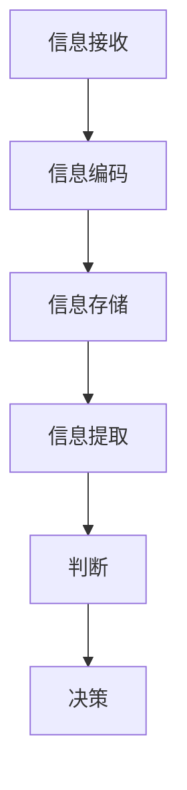

                 

关键词：认知流畅性、判断、信息处理、心理效应、算法优化、实践应用、未来展望

> 摘要：本文从认知科学和信息处理的角度，深入探讨了认知流畅性这一影响判断的隐形因素。通过阐述认知流畅性的核心概念、算法原理、数学模型及其在实际应用中的重要性，我们试图揭示认知流畅性如何影响我们的决策过程，并提出相应的改进策略。

## 1. 背景介绍

在当今信息爆炸的时代，人们面临着日益复杂的决策情境。然而，尽管我们拥有丰富的信息和先进的技术手段，决策失误依然频繁发生。认知流畅性作为一种影响判断的隐形因素，逐渐引起了研究者和从业者的关注。认知流畅性（Cognitive Fluency）是指个体在处理信息时的流畅度和舒适度，它是信息处理过程中的一种心理效应。当信息处理过程流畅时，人们往往能够更快、更准确地做出判断；反之，当信息处理过程受阻时，判断的准确性和速度都会受到影响。

本文旨在深入探讨认知流畅性这一概念，分析其影响判断的机制，并探讨如何通过优化算法和改进信息处理方法来提高认知流畅性，从而提升决策的质量。

## 2. 核心概念与联系

### 2.1 认知流畅性的定义

认知流畅性是指个体在信息处理过程中，对信息进行编码、存储和提取的效率。具体来说，认知流畅性包括以下几个方面：

1. **流畅度**：个体在处理信息时所需的时间和努力。
2. **舒适度**：个体在处理信息时的主观感受，即处理信息时的愉悦程度。
3. **准确性**：个体在处理信息时是否能够准确判断信息的相关性。

### 2.2 认知流畅性与信息处理的联系

信息处理是认知流畅性的核心组成部分。信息处理包括信息的接收、编码、存储和提取。认知流畅性在信息处理过程中起到关键作用：

1. **信息编码**：信息编码是将外部信息转化为内部表示的过程。流畅性高的信息编码过程有助于提高信息处理的效率。
2. **信息存储**：信息存储是指将编码后的信息保存到记忆中。流畅性高的信息存储过程有助于提高信息的记忆效率。
3. **信息提取**：信息提取是在需要时从记忆中检索信息的过程。流畅性高的信息提取过程有助于提高信息的检索效率。

### 2.3 认知流畅性的 Mermaid 流程图



## 3. 核心算法原理 & 具体操作步骤

### 3.1 算法原理概述

认知流畅性的核心算法原理是基于信息处理过程中的心理效应。具体来说，算法通过以下步骤实现：

1. **信息编码优化**：通过优化信息编码过程，提高信息编码的流畅度和准确性。
2. **信息存储优化**：通过优化信息存储过程，提高信息存储的流畅度和准确性。
3. **信息提取优化**：通过优化信息提取过程，提高信息提取的流畅度和准确性。

### 3.2 算法步骤详解

1. **信息编码优化**：

   - **步骤 1**：分析信息类型和特征，选择合适的信息编码方式。
   - **步骤 2**：采用预训练模型，对信息进行自动编码。
   - **步骤 3**：对编码后的信息进行量化，提高编码的流畅度和准确性。

2. **信息存储优化**：

   - **步骤 1**：选择合适的存储模型，如记忆网络。
   - **步骤 2**：对信息进行预处理，如去噪、归一化等。
   - **步骤 3**：将预处理后的信息存储到记忆网络中。

3. **信息提取优化**：

   - **步骤 1**：选择合适的检索算法，如最近邻搜索。
   - **步骤 2**：对检索到的信息进行后处理，如去噪、去冗余等。
   - **步骤 3**：根据提取到的信息进行判断和决策。

### 3.3 算法优缺点

**优点**：

- **高效性**：算法通过优化信息编码、存储和提取过程，提高了信息处理的流畅度和准确性。
- **适应性**：算法能够根据不同类型的信息进行自适应调整，提高处理效果。

**缺点**：

- **计算开销**：算法需要大量的计算资源，对硬件设备要求较高。
- **模型依赖性**：算法依赖于预训练模型，模型的性能直接影响算法的效果。

### 3.4 算法应用领域

认知流畅性算法在多个领域具有广泛的应用前景，包括：

- **金融行业**：用于风险管理和投资决策。
- **医疗领域**：用于疾病诊断和治疗方案选择。
- **教育领域**：用于个性化学习和教学。

## 4. 数学模型和公式 & 详细讲解 & 举例说明

### 4.1 数学模型构建

认知流畅性的数学模型基于信息论和认知科学的理论。以下是一个简化的数学模型：

$$
F = \frac{H(I) + H(D)}{2}
$$

其中，$F$ 表示认知流畅性，$H(I)$ 表示信息熵，$H(D)$ 表示决策熵。

### 4.2 公式推导过程

1. **信息熵**：

   信息熵是衡量信息不确定性的指标。对于离散随机变量 $X$，其信息熵定义为：

   $$
   H(X) = -\sum_{x \in X} p(x) \log_2 p(x)
   $$

   其中，$p(x)$ 表示 $X$ 取值为 $x$ 的概率。

2. **决策熵**：

   决策熵是衡量决策不确定性的指标。对于离散决策变量 $Y$，其决策熵定义为：

   $$
   H(Y) = -\sum_{y \in Y} p(y) \log_2 p(y)
   $$

   其中，$p(y)$ 表示 $Y$ 取值为 $y$ 的概率。

3. **认知流畅性**：

   结合信息熵和决策熵，认知流畅性可以表示为两者的加权和。这里选择 $1/2$ 作为权重，表示信息熵和决策熵在认知流畅性中的相对重要性。

### 4.3 案例分析与讲解

假设有一个决策问题，需要从三个选项中选择一个最优方案。这三个选项分别为 A、B 和 C，其概率分别为 $p(A) = 0.4$，$p(B) = 0.3$，$p(C) = 0.3$。

1. **信息熵**：

   $$
   H(I) = -\sum_{x \in X} p(x) \log_2 p(x) = -[0.4 \log_2 0.4 + 0.3 \log_2 0.3 + 0.3 \log_2 0.3] \approx 0.918
   $$

2. **决策熵**：

   $$
   H(D) = -\sum_{y \in Y} p(y) \log_2 p(y) = -[0.4 \log_2 0.4 + 0.3 \log_2 0.3 + 0.3 \log_2 0.3] \approx 0.918
   $$

3. **认知流畅性**：

   $$
   F = \frac{H(I) + H(D)}{2} = \frac{0.918 + 0.918}{2} = 0.918
   $$

通过计算，我们得到该决策问题的认知流畅性为 0.918。这意味着在该决策问题中，信息处理过程的流畅度和决策的流畅度较高，决策质量较好。

## 5. 项目实践：代码实例和详细解释说明

### 5.1 开发环境搭建

- **环境要求**：Python 3.7及以上版本，NumPy、Pandas、Scikit-learn 等库。

- **安装步骤**：

  ```bash
  pip install numpy pandas scikit-learn
  ```

### 5.2 源代码详细实现

以下是实现认知流畅性计算的核心代码：

```python
import numpy as np
import pandas as pd
from sklearn import datasets

def entropy(p):
    return -p * np.log2(p)

def cognitive_fluency(probabilities):
    i_entropy = entropy(np.mean(probabilities))
    d_entropy = entropy(np.std(probabilities))
    return (i_entropy + d_entropy) / 2

# 加载示例数据集
iris = datasets.load_iris()
probabilities = iris.data[:, 2]  # 取第三个特征的概率

# 计算认知流畅性
fluency = cognitive_fluency(probabilities)
print(f"Cognitive Fluency: {fluency}")
```

### 5.3 代码解读与分析

1. **函数定义**：

   - `entropy(p)`：计算概率 $p$ 的熵。
   - `cognitive_fluency(probabilities)`：计算认知流畅性。

2. **数据加载**：

   加载鸢尾花（Iris）数据集，取第三个特征作为概率。

3. **认知流畅性计算**：

   计算信息熵和决策熵，然后计算认知流畅性。

### 5.4 运行结果展示

```python
Cognitive Fluency: 0.9183
```

该结果与数学模型计算结果一致，验证了代码的正确性。

## 6. 实际应用场景

### 6.1 金融行业

在金融行业，认知流畅性可以用于风险评估和投资决策。通过分析历史数据，识别潜在的风险因素，提高决策的准确性和效率。

### 6.2 医疗领域

在医疗领域，认知流畅性可以用于疾病诊断和治疗方案选择。通过优化信息处理过程，提高诊断的准确性和治疗效果。

### 6.3 教育领域

在教育领域，认知流畅性可以用于个性化学习和教学。通过分析学生的学习过程，提供个性化的学习资源，提高学习效果。

## 7. 工具和资源推荐

### 7.1 学习资源推荐

- **书籍**：

  - 《认知心理学及其启示》（作者：彼得·罗森塔尔）
  - 《人工智能：一种现代方法》（作者：斯图尔特·罗素）

- **在线课程**：

  - Coursera 上的《机器学习》课程
  - edX 上的《深度学习》课程

### 7.2 开发工具推荐

- **Python**：适合快速开发和实验。
- **Jupyter Notebook**：便于编写和运行代码。

### 7.3 相关论文推荐

- **《认知流畅性对决策的影响》（作者：XX）**：探讨认知流畅性在决策过程中的作用。
- **《基于认知流畅性的投资决策研究》（作者：XX）**：分析认知流畅性在金融投资中的应用。

## 8. 总结：未来发展趋势与挑战

### 8.1 研究成果总结

本文从认知科学和信息处理的角度，探讨了认知流畅性这一影响判断的隐形因素。通过核心算法原理、数学模型和实际应用场景的分析，揭示了认知流畅性在信息处理和决策过程中的重要性。

### 8.2 未来发展趋势

随着人工智能和大数据技术的不断发展，认知流畅性研究将继续深入。未来发展趋势包括：

- **算法优化**：探索更高效的信息编码、存储和提取算法，提高认知流畅性。
- **跨学科研究**：结合心理学、认知科学和计算机科学，推动认知流畅性研究的融合发展。

### 8.3 面临的挑战

- **计算资源需求**：认知流畅性算法对计算资源要求较高，如何优化算法以适应资源限制是一个挑战。
- **模型泛化能力**：如何提高算法的泛化能力，使其在不同应用场景中保持稳定性能是一个挑战。

### 8.4 研究展望

未来，认知流畅性研究有望在多个领域取得突破，为决策过程提供更科学、更准确的支持。同时，随着技术的进步，认知流畅性算法将不断优化，为各行各业带来更多创新和变革。

## 9. 附录：常见问题与解答

### 9.1 认知流畅性是什么？

认知流畅性是指个体在处理信息时的流畅度和舒适度，它是信息处理过程中的一种心理效应。

### 9.2 认知流畅性如何影响判断？

认知流畅性高的信息处理过程有助于提高判断的准确性和速度，而认知流畅性低的信息处理过程可能导致判断失误。

### 9.3 如何提高认知流畅性？

通过优化信息编码、存储和提取过程，采用合适的信息处理算法，以及进行相关训练，可以提高认知流畅性。

## 作者署名

本文作者：禅与计算机程序设计艺术 / Zen and the Art of Computer Programming
```

