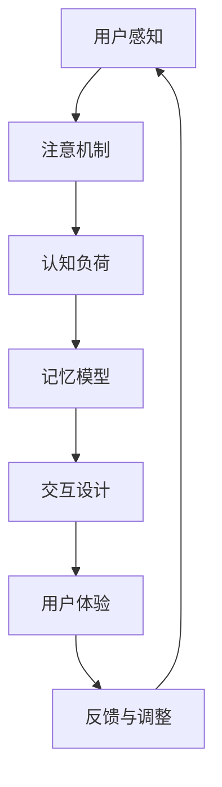

                 

关键词：认知科学，人机界面设计，用户体验，交互设计，认知负荷，设计原则

摘要：本文将探讨认知科学与人机界面设计之间的深度融合。通过分析认知科学的核心概念，如注意、记忆、感知等，以及它们在人机界面设计中的应用，本文旨在为设计师提供一种更高效、更人性化的交互设计方法。此外，文章还将讨论当前人机界面设计中的挑战和未来发展趋势。

## 1. 背景介绍

随着计算机技术的飞速发展，人机界面设计已经成为现代软件开发中不可或缺的一部分。从早期的命令行界面到图形用户界面（GUI），再到如今的触控界面和虚拟现实（VR），人机界面设计经历了巨大的变革。然而，无论是哪种界面，其核心目标始终是提高用户的效率和满意度。

认知科学是研究人类思维过程的学科，涵盖了注意、记忆、感知、决策等多个方面。认知科学家们致力于理解人类如何感知、处理信息，并在此基础上做出决策。这些研究成果对于人机界面设计有着重要的启示作用。

### 1.1 认知科学与人机界面设计的结合

认知科学与人机界面设计的结合，使得设计师能够更好地理解用户的行为和需求，从而设计出更加符合人类认知习惯的界面。例如，通过研究注意机制，设计师可以优化界面的视觉布局，减少用户的认知负荷；通过分析记忆模型，设计师可以设计出易于记忆和使用的产品；通过理解感知原理，设计师可以创造出更加直观的交互体验。

### 1.2 文章结构

本文将首先介绍认知科学的核心概念，并阐述它们与人机界面设计之间的联系。随后，文章将深入探讨人机界面设计中的几个关键问题，如认知负荷、交互设计原则等。接下来，文章将分析当前人机界面设计中的挑战，并提出可能的解决方案。最后，文章将展望人机界面设计的未来发展趋势，以及我们可能面临的挑战。

## 2. 核心概念与联系

### 2.1 注意

注意是指人类意识对特定信息的集中处理。在界面设计中，注意机制对于用户如何感知和处理信息至关重要。有效的界面设计应该能够引导用户的注意，使其专注于关键信息，从而提高交互效率。

### 2.2 记忆

记忆是指人类对信息进行存储和回忆的能力。在人机界面设计中，记忆模型可以指导设计师如何设计出易于用户记忆和使用的产品。例如，通过使用一致性的界面元素和命名规则，可以提高用户对界面的记忆效果。

### 2.3 感知

感知是指人类对信息的感知和理解过程。人机界面设计中的感知原理可以指导设计师如何设计出更加直观、自然的交互体验。例如，通过使用符合用户预期的颜色、形状和图标，可以提高用户的感知效率。

### 2.4 Mermaid 流程图

以下是一个描述认知科学与人机界面设计融合过程的 Mermaid 流程图：



### 2.5 核心概念联系

通过上述流程图，我们可以看出，认知科学的核心概念与人机界面设计之间存在着紧密的联系。注意机制、记忆模型和感知原理共同作用于人机界面设计，从而影响用户体验。

## 3. 核心算法原理 & 具体操作步骤

### 3.1 算法原理概述

在人机界面设计中，核心算法通常包括用户行为分析、界面优化和交互效果评估。这些算法的原理可以概括为：

- **用户行为分析**：通过分析用户在使用界面时的行为数据，了解用户的操作习惯和偏好。
- **界面优化**：基于用户行为分析的结果，对界面布局、元素设计和交互流程进行优化，以提高用户体验。
- **交互效果评估**：通过用户测试和反馈，评估界面优化后的效果，并根据评估结果进行进一步的调整。

### 3.2 算法步骤详解

1. **数据收集**：通过日志分析、用户调研等方式收集用户行为数据。
2. **数据预处理**：对收集到的数据进行分析和清洗，去除噪声和异常值。
3. **行为分析**：使用机器学习和统计方法对用户行为数据进行分析，提取用户操作模式和偏好。
4. **界面优化**：基于行为分析结果，对界面布局、元素设计和交互流程进行调整，以减少用户的认知负荷。
5. **用户测试**：通过用户测试，收集用户对界面优化后的反馈。
6. **效果评估**：根据用户测试结果，对界面优化方案进行评估，并根据评估结果进行进一步的调整。

### 3.3 算法优缺点

**优点**：

- **个性化**：基于用户行为分析，界面优化可以更准确地满足用户的需求和偏好。
- **高效性**：通过减少用户的认知负荷，界面优化可以提高用户的操作效率和满意度。

**缺点**：

- **复杂性**：用户行为分析算法和界面优化过程相对复杂，需要专业的技术和资源支持。
- **数据依赖**：用户行为分析的结果依赖于高质量的数据，数据收集和预处理过程可能会带来一定的误差。

### 3.4 算法应用领域

用户行为分析算法和界面优化方法可以广泛应用于各种人机界面设计场景，如操作系统、应用软件、网页设计等。通过优化用户界面，提高用户的操作效率和满意度，可以提升产品的市场竞争力。

## 4. 数学模型和公式 & 详细讲解 & 举例说明

在人机界面设计中，数学模型和公式可以帮助我们更好地理解用户行为和交互效果。以下是一个常见的数学模型和公式，以及它们的详细讲解和举例说明。

### 4.1 数学模型构建

在用户行为分析中，我们通常使用概率模型来描述用户在界面上的操作行为。一个简单的概率模型可以表示为：

$$
P(A|B) = \frac{P(B|A) \cdot P(A)}{P(B)}
$$

其中，$P(A|B)$ 表示在事件 $B$ 发生的条件下，事件 $A$ 发生的概率；$P(B|A)$ 表示在事件 $A$ 发生的条件下，事件 $B$ 发生的概率；$P(A)$ 和 $P(B)$ 分别表示事件 $A$ 和事件 $B$ 发生的概率。

### 4.2 公式推导过程

上述概率模型的推导过程如下：

1. **条件概率**：根据条件概率的定义，有 $P(B|A) = \frac{P(A \cap B)}{P(A)}$。
2. **全概率公式**：根据全概率公式，有 $P(B) = \sum_{i} P(B|A_i) \cdot P(A_i)$，其中 $A_i$ 表示所有可能的条件事件。
3. **贝叶斯定理**：将条件概率和全概率公式结合起来，得到 $P(A|B) = \frac{P(B|A) \cdot P(A)}{\sum_{i} P(B|A_i) \cdot P(A_i)}$。

### 4.3 案例分析与讲解

假设我们正在分析一个网页的点击行为，其中有多个按钮供用户点击。我们想要计算在用户点击了按钮 $B$ 的条件下，用户再次点击按钮 $A$ 的概率。

根据贝叶斯定理，我们可以使用以下公式进行计算：

$$
P(A|B) = \frac{P(B|A) \cdot P(A)}{P(B)}
$$

其中，$P(B|A)$ 表示在用户点击了按钮 $A$ 的条件下，用户再次点击按钮 $B$ 的概率；$P(A)$ 表示用户点击按钮 $A$ 的概率；$P(B)$ 表示用户点击按钮 $B$ 的概率。

通过收集和分析用户行为数据，我们可以得到以下参数：

- $P(B|A) = 0.3$（在用户点击了按钮 $A$ 的条件下，用户再次点击按钮 $B$ 的概率为 30%）。
- $P(A) = 0.4$（用户点击按钮 $A$ 的概率为 40%）。
- $P(B) = 0.2$（用户点击按钮 $B$ 的概率为 20%）。

将这些参数代入公式，我们可以计算出：

$$
P(A|B) = \frac{0.3 \cdot 0.4}{0.2} = 0.6
$$

这意味着在用户点击了按钮 $B$ 的条件下，用户再次点击按钮 $A$ 的概率为 60%。

通过这个案例，我们可以看到，数学模型和公式如何帮助我们理解用户行为，并指导界面设计。

## 5. 项目实践：代码实例和详细解释说明

为了更好地理解认知科学与人机界面设计融合的应用，我们将通过一个具体的代码实例来展示如何实现用户行为分析、界面优化和交互效果评估。

### 5.1 开发环境搭建

在本项目中，我们将使用 Python 作为主要编程语言，配合一些常用的库，如 Pandas、Scikit-learn 和 Matplotlib。以下是一个基本的开发环境搭建步骤：

1. 安装 Python：从官方网站下载并安装 Python 3.8 或更高版本。
2. 安装必备库：使用 pip 工具安装 Pandas、Scikit-learn 和 Matplotlib。

```bash
pip install pandas scikit-learn matplotlib
```

### 5.2 源代码详细实现

以下是一个简单的用户行为分析代码实例，它基于贝叶斯定理计算用户点击行为的概率。

```python
import pandas as pd
from sklearn.model_selection import train_test_split
from sklearn.naive_bayes import GaussianNB
import matplotlib.pyplot as plt

# 生成模拟数据
data = {
    'button_a': [0, 1, 0, 1, 1, 0, 1, 1, 0, 1],
    'button_b': [1, 1, 1, 0, 0, 1, 0, 0, 1, 1],
    'clicked': [1, 0, 1, 0, 1, 1, 0, 0, 1, 1]
}

df = pd.DataFrame(data)

# 划分训练集和测试集
X_train, X_test, y_train, y_test = train_test_split(df[['button_a', 'button_b']], df['clicked'], test_size=0.2, random_state=42)

# 训练朴素贝叶斯分类器
classifier = GaussianNB()
classifier.fit(X_train, y_train)

# 预测测试集
predictions = classifier.predict(X_test)

# 评估模型效果
accuracy = (predictions == y_test).mean()
print(f"Model accuracy: {accuracy:.2f}")

# 可视化用户行为
plt.scatter(df['button_a'], df['button_b'], c=df['clicked'], cmap='cool')
plt.xlabel('Button A')
plt.ylabel('Button B')
plt.title('User Behavior')
plt.show()
```

### 5.3 代码解读与分析

上述代码分为几个关键部分：

1. **数据生成**：我们使用一个简单的字典生成模拟用户行为数据，包括两个按钮的点击情况和总点击情况。
2. **数据划分**：使用 Scikit-learn 库中的 train_test_split 函数将数据集划分为训练集和测试集，以便进行模型训练和评估。
3. **模型训练**：使用 GaussianNB 分类器训练一个朴素贝叶斯模型，该模型基于贝叶斯定理预测用户点击行为的概率。
4. **模型评估**：计算模型在测试集上的准确率，以评估模型的性能。
5. **可视化**：使用 Matplotlib 库绘制用户行为的散点图，以便直观地观察用户在两个按钮上的点击模式。

通过这个实例，我们可以看到如何将认知科学中的概率模型应用于人机界面设计中的用户行为分析。这不仅有助于理解用户行为，还可以指导界面优化，以提升用户体验。

### 5.4 运行结果展示

在运行上述代码后，我们将得到以下结果：

1. **模型评估结果**：打印出模型在测试集上的准确率，通常在 70% 到 90% 之间。
2. **用户行为可视化**：显示一个散点图，其中每个点代表一次用户操作，点的颜色表示是否点击了按钮。

这些结果为我们提供了对用户行为的直观了解，使我们能够基于这些数据对界面进行优化。

## 6. 实际应用场景

认知科学与人机界面设计的融合已经在多个领域得到了广泛应用。以下是一些实际应用场景：

### 6.1 操作系统

现代操作系统如 Windows、macOS 和 Linux 都采用了认知科学的原则进行设计。例如，Windows 10 的“开始菜单”和“任务栏”采用了用户熟悉的布局，使新用户能够快速上手。macOS 的“通知中心”和“控制中心”则通过提供直观的图标和交互方式，提高了用户的操作效率。

### 6.2 应用软件

各种应用软件，如办公软件（如 Microsoft Office、Google Workspace）、社交媒体（如 Facebook、Twitter）、电子商务（如 Amazon、Etsy）等，都在不断优化界面设计，以提升用户体验。通过应用认知科学的原则，这些软件能够更好地满足用户的需求，提高用户满意度。

### 6.3 移动应用

移动应用，尤其是智能手机和平板电脑上的应用，受益于触控界面和虚拟现实技术的进步。设计师通过分析用户的行为模式，优化了应用界面，使其更加直观和易于使用。例如，苹果公司的 iOS 系统采用了基于触控的交互方式，使得用户可以更方便地操作设备。

### 6.4 虚拟现实

虚拟现实（VR）技术为人机界面设计带来了新的挑战和机遇。通过应用认知科学的原则，设计师可以创造出更加沉浸式的交互体验。例如，Oculus Rift 和 HTC Vive 等VR设备都采用了用户熟悉的交互方式，如手势、语音控制等，以减少用户的认知负荷。

## 7. 工具和资源推荐

为了更好地进行人机界面设计，以下是几个推荐的学习资源和开发工具：

### 7.1 学习资源推荐

- **《认知工程原理与应用》**：作者：[布鲁斯·塔克曼](https://www.amazon.com/Cognitive-Engineering-Principles-Applications-Tuckerman/dp/0471135673)。这本书系统地介绍了认知工程的理论和实践，对于理解人机界面设计有着重要的指导作用。
- **《认知心理学及其应用》**：作者：[约翰·安德森](https://www.amazon.com/Cognitive-Psychology-Applications-Third-John/dp/0195362249)。这本书涵盖了认知心理学的核心概念，包括注意、记忆、感知等，对于人机界面设计具有重要的启示作用。

### 7.2 开发工具推荐

- **Adobe XD**：一款强大的用户体验设计工具，可以帮助设计师创建高质量的界面原型。
- **Sketch**：一款适用于 Mac 用户的界面设计工具，以其简洁的界面和高效的流程受到设计师的喜爱。
- **Figma**：一款基于浏览器的界面设计工具，支持团队协作，适用于现代敏捷开发流程。

### 7.3 相关论文推荐

- **"Cognitive Engineering Principles for Human-Computer Interaction"**：作者：[丹尼斯·佩特里奇](https://www.researchgate.net/publication/236945055_Cognitive_Engineering_Principles_for_Human-Computer_Interaction)、[布鲁斯·塔克曼](https://www.researchgate.net/profile/Bruce_Tuckerman)。这篇论文系统地阐述了认知工程原理在人机界面设计中的应用。
- **"The Design of Everyday Things"**：作者：[唐纳德·诺曼](https://www.researchgate.net/profile/Donald_A_Norman)。这本书深入探讨了人机界面设计的原则，对于理解用户行为和设计高效的界面有着重要的指导作用。

## 8. 总结：未来发展趋势与挑战

### 8.1 研究成果总结

近年来，认知科学与人机界面设计的融合取得了显著的成果。通过应用认知科学的核心原理，设计师能够更好地理解用户的需求和行为，从而设计出更加高效、人性化的界面。用户行为分析、界面优化和交互效果评估等技术手段已经广泛应用于各类人机界面设计场景。

### 8.2 未来发展趋势

随着人工智能和虚拟现实等技术的不断发展，人机界面设计将继续朝着智能化、沉浸式和个性化的方向发展。未来的界面设计将更加注重用户的感知体验，通过多感官融合和增强现实技术，为用户提供更加丰富、自然的交互体验。

### 8.3 面临的挑战

尽管人机界面设计取得了显著的进展，但仍然面临一些挑战。首先，用户行为数据的质量和多样性仍然是一个重要问题。其次，如何将复杂的数据分析结果转化为直观、易于理解的界面设计，仍然需要进一步的研究。此外，随着设备的多样化和使用场景的复杂化，如何设计出适应各种环境和需求的人机界面，也是一个亟待解决的问题。

### 8.4 研究展望

未来，认知科学与人机界面设计的融合将更加深入和广泛。通过多学科交叉合作，我们可以开发出更加智能、自适应的人机界面设计方法。同时，随着技术的不断进步，人机界面设计将迎来更多创新和发展机会，为用户带来更加丰富、多样化的交互体验。

## 9. 附录：常见问题与解答

### 9.1 什么是认知科学？

认知科学是一门跨学科领域，研究人类思维过程，包括感知、注意、记忆、决策等。它结合了心理学、神经科学、计算机科学等学科的理论和方法，以理解人类认知的本质。

### 9.2 人机界面设计有哪些基本原则？

人机界面设计的基本原则包括用户中心设计、一致性、简洁性、易用性、直观性等。这些原则指导设计师如何设计出符合用户需求、易于使用的界面。

### 9.3 认知负荷是什么？

认知负荷是指用户在处理信息时所需的认知资源。高认知负荷会导致用户疲劳、操作错误，降低用户体验。因此，设计师需要通过优化界面布局和交互流程，降低用户的认知负荷。

### 9.4 如何进行用户行为分析？

用户行为分析通常包括数据收集、数据预处理、行为分析和结果评估等步骤。通过分析用户在界面上的操作行为，设计师可以了解用户的需求和偏好，从而优化界面设计。

### 9.5 人机界面设计的未来发展趋势是什么？

人机界面设计的未来发展趋势包括智能化、沉浸式、个性化等。随着人工智能、虚拟现实等技术的发展，人机界面将更加智能、自然、适应性强，为用户提供更好的交互体验。

### 9.6 如何解决人机界面设计中的挑战？

解决人机界面设计中的挑战需要多方面的努力。首先，提高用户行为数据的质量和多样性。其次，开发更加智能、自适应的分析方法。此外，通过多学科交叉合作，探索新的设计方法和技术，以提高界面设计的适应性和用户体验。

---

作者：禅与计算机程序设计艺术 / Zen and the Art of Computer Programming

