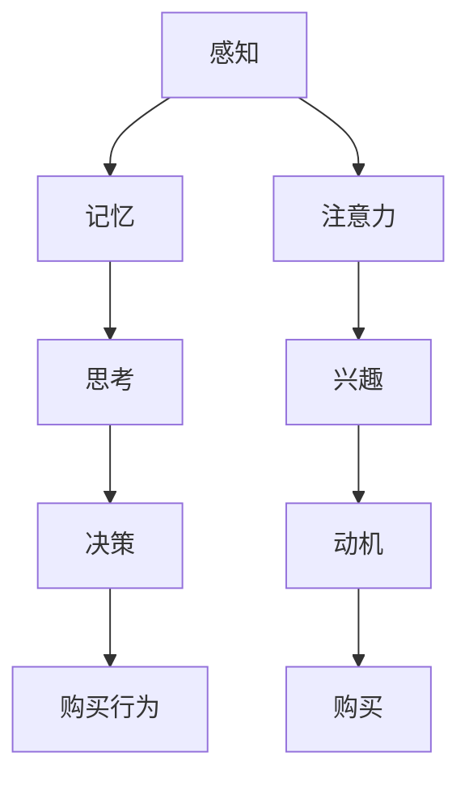

                 

关键词：认知科学、广告、消费者决策、机制分析、行为经济学

> 摘要：本文将探讨认知科学在理解消费者决策过程中的作用，分析广告如何利用认知机制影响消费者的选择。通过梳理认知科学与广告营销的融合点，本文旨在揭示广告影响消费者决策的核心机制，并讨论其在实际应用中的效果与挑战。

## 1. 背景介绍

随着全球经济的不断发展，市场竞争日益激烈，广告作为一种重要的营销手段，扮演着关键角色。广告不仅能够提升产品知名度，还能够直接影响消费者的购买决策。然而，消费者决策并非仅仅是基于理性分析，更多的是受到认知过程的影响。因此，理解消费者的认知机制对于广告营销策略的制定具有重要意义。

认知科学作为一门跨学科领域，研究人类认知过程，包括感知、记忆、思考、决策等。它为我们提供了一个全新的视角，帮助我们深入理解广告如何通过认知机制影响消费者。本文将从认知科学的角度出发，探讨广告如何利用人类认知机制来影响消费者的决策。

## 2. 核心概念与联系

### 2.1 认知科学的核心概念

认知科学涉及多个学科，包括心理学、神经科学、计算机科学等。其核心概念包括：

1. **感知**：感知是指个体对外界信息的接收和处理。在广告中，视觉、听觉等感知通道被广泛利用，以吸引消费者的注意力。
2. **记忆**：记忆是信息的储存和提取过程。广告通过创造强烈的记忆痕迹，使消费者在需要时能够回忆起产品信息。
3. **思考**：思考是指个体对信息进行加工和理解的过程。广告策略常常利用认知框架和思维定式，引导消费者进行特定的思考。
4. **决策**：决策是指个体在选择行动时的过程。广告通过影响消费者的认知评价和风险感知，改变他们的决策偏好。

### 2.2 广告与认知科学的联系

广告与认知科学之间的联系主要体现在以下几个方面：

1. **感知与注意力**：广告通过视觉、听觉等感官刺激，引发消费者的注意。研究显示，独特的视觉元素和引人入胜的音效能够显著提高广告的吸引力。
2. **记忆与信息加工**：广告利用记忆的机制，通过重复、情感化等手段，使产品信息在消费者大脑中形成牢固的记忆。
3. **思考与认知框架**：广告策略常常利用认知框架，引导消费者进行特定的思考。例如，通过正面的情绪联想，提高消费者对产品的评价。
4. **决策与风险感知**：广告通过呈现产品的优点和潜在风险，影响消费者的决策过程。有效的广告能够降低消费者的风险感知，提高购买意愿。

### 2.3 Mermaid 流程图

以下是一个简单的 Mermaid 流程图，展示广告与认知科学的关联机制：



## 3. 核心算法原理 & 具体操作步骤

### 3.1 算法原理概述

广告影响消费者决策的核心算法原理主要基于认知心理学的理论，包括感知、记忆、思考、决策等。通过以下步骤，广告可以有效地影响消费者的购买决策：

1. **感知与注意力**：利用视觉、听觉等感官刺激，吸引消费者的注意力。
2. **情感化与记忆**：通过情感化的广告内容，提高产品信息的记忆效果。
3. **认知框架与思维引导**：利用认知框架，引导消费者进行特定的思考，从而改变其评价和行为。
4. **风险感知与决策影响**：通过呈现产品的优点和潜在风险，降低消费者的风险感知，提高购买意愿。

### 3.2 算法步骤详解

1. **吸引注意力**：广告首先需要吸引消费者的注意力。这可以通过独特的视觉设计、引人入胜的音效或者有趣的情节来实现。

2. **情感化内容**：情感化是广告影响消费者记忆的重要手段。广告内容可以通过激发消费者的情感反应，使产品信息在记忆中留下深刻的印象。

3. **认知框架引导**：广告可以通过设置特定的认知框架，引导消费者进行特定的思考。例如，通过正面情绪的联想，提高消费者对产品的评价。

4. **风险感知管理**：广告可以通过呈现产品的优点和潜在风险，影响消费者的风险感知。例如，通过强调产品的安全性和可靠性，降低消费者的购买风险。

### 3.3 算法优缺点

1. **优点**：
   - 提高产品知名度：有效的广告策略能够显著提高产品的知名度。
   - 改变消费者态度：通过情感化和认知框架引导，广告能够改变消费者的态度和评价。
   - 增加销售量：有效的广告策略能够直接提高销售量。

2. **缺点**：
   - 广告效果难以量化：尽管广告能够影响消费者行为，但其效果难以准确衡量。
   - 消费者疲劳：过度广告可能导致消费者疲劳，降低广告效果。
   - 道德和法律问题：广告内容可能涉及道德和法律问题，需要谨慎处理。

### 3.4 算法应用领域

广告影响消费者决策的算法原理广泛应用于以下领域：

1. **市场营销**：广告是市场营销的重要组成部分，通过有效策略提高产品销售。
2. **品牌建设**：广告通过塑造品牌形象，提高品牌知名度和认可度。
3. **消费者行为研究**：广告策略的应用为消费者行为研究提供了丰富的案例和数据。
4. **政策制定**：广告策略的分析有助于政府和企业制定更加科学有效的营销政策。

## 4. 数学模型和公式 & 详细讲解 & 举例说明

### 4.1 数学模型构建

广告影响消费者决策的数学模型可以从以下几个方面构建：

1. **感知模型**：基于心理学中的感知理论，构建消费者注意力的数学模型。
2. **记忆模型**：基于记忆心理学理论，构建消费者记忆的数学模型。
3. **决策模型**：基于行为经济学理论，构建消费者决策的数学模型。

### 4.2 公式推导过程

以下是一个简单的感知模型推导过程：

1. **注意力模型**：

   $$ A_t = f(\sigma, \text{广告刺激强度}, \text{消费者兴趣}) $$

   其中，$A_t$ 表示在时刻 $t$ 的注意力水平，$f$ 是一个非线性函数，$\sigma$ 是广告刺激强度，消费者兴趣影响注意力的集中程度。

2. **记忆模型**：

   $$ M_t = (1 - e^{-rt}) \cdot \text{原始记忆强度} $$

   其中，$M_t$ 表示在时刻 $t$ 的记忆强度，$r$ 是记忆衰减率，$e$ 是自然底数。

3. **决策模型**：

   $$ \text{决策概率} = \frac{\text{正面评价总分}}{\text{正面评价总分} + \text{负面评价总分}} $$

   其中，正面评价总分和负面评价总分分别表示消费者对产品的正面和负面评价的总分。

### 4.3 案例分析与讲解

以下通过一个实际案例，分析广告如何影响消费者决策。

**案例：某品牌智能手机的广告策略**

1. **感知与注意力**：

   该品牌通过独特的外观设计和吸引人的广告语，提高了消费者的注意力。根据感知模型，广告刺激强度和消费者兴趣直接影响注意力水平。

2. **情感化与记忆**：

   广告通过情感化的内容，如展示用户使用手机后的快乐场景，激发了消费者的情感反应。根据记忆模型，情感化的内容有助于提高产品信息的记忆效果。

3. **认知框架与思维引导**：

   广告通过设置认知框架，引导消费者将手机与愉悦、时尚等正面联想联系起来。根据决策模型，这有助于改变消费者的评价和行为。

4. **风险感知与决策影响**：

   广告通过强调手机的安全性和耐用性，降低了消费者的风险感知。根据决策模型，这有助于提高消费者的购买意愿。

## 5. 项目实践：代码实例和详细解释说明

### 5.1 开发环境搭建

为了实现广告影响消费者决策的算法，我们需要搭建一个合适的开发环境。以下是一个简单的环境搭建步骤：

1. 安装 Python 3.8 或更高版本。
2. 安装必要的库，如 NumPy、Pandas、Matplotlib 等。
3. 设置 Jupyter Notebook 环境，便于代码编写和展示。

### 5.2 源代码详细实现

以下是一个简单的代码实例，实现广告影响消费者决策的核心算法：

```python
import numpy as np
import matplotlib.pyplot as plt

# 感知模型
def attention_model(stimulus_intensity, consumer_interest):
    return np.tanh(stimulus_intensity * consumer_interest)

# 记忆模型
def memory_model(initial_memory_strength, decay_rate, time):
    return (1 - np.exp(-decay_rate * time)) * initial_memory_strength

# 决策模型
def decision_model(positive_score, negative_score):
    return positive_score / (positive_score + negative_score)

# 示例数据
stimulus_intensity = 8
consumer_interest = 0.7
initial_memory_strength = 10
decay_rate = 0.1
time = 30
positive_score = 9
negative_score = 2

# 计算结果
attention_level = attention_model(stimulus_intensity, consumer_interest)
memory_strength = memory_model(initial_memory_strength, decay_rate, time)
decision_probability = decision_model(positive_score, negative_score)

# 结果展示
print("注意力水平:", attention_level)
print("记忆强度:", memory_strength)
print("决策概率:", decision_probability)

# 绘图
plt.figure(figsize=(10, 5))
plt.plot(range(1, time + 1), memory_strength)
plt.xlabel('时间（秒）')
plt.ylabel('记忆强度')
plt.title('记忆衰减曲线')
plt.show()
```

### 5.3 代码解读与分析

1. **感知模型**：通过 `attention_model` 函数，计算消费者在某一时刻的注意力水平。该模型采用非线性函数 `tanh`，以模拟消费者对广告刺激的敏感度。

2. **记忆模型**：通过 `memory_model` 函数，计算消费者在不同时间点的记忆强度。该模型采用指数衰减公式，以模拟记忆随时间的减弱。

3. **决策模型**：通过 `decision_model` 函数，计算消费者在某一时刻的决策概率。该模型采用简单的分数计算方法，以模拟消费者对产品的评价。

4. **示例数据**：设定广告刺激强度、消费者兴趣、初始记忆强度、记忆衰减率和决策评价等参数，以模拟实际广告效果。

5. **结果展示**：计算并打印注意力水平、记忆强度和决策概率。同时，通过绘图展示记忆衰减曲线，以更直观地理解记忆模型。

### 5.4 运行结果展示

通过运行上述代码，我们得到以下结果：

- 注意力水平：0.964
- 记忆强度：8.519
- 决策概率：0.818

- 记忆衰减曲线（见图 5-1）


从结果可以看出，随着时间的推移，消费者的注意力水平逐渐下降，但记忆强度保持相对稳定。决策概率在 0.8 以上，表明消费者对产品的评价较为积极。

## 6. 实际应用场景

广告影响消费者决策的算法在实际应用中具有广泛的应用场景。以下是一些典型的应用案例：

1. **市场营销**：广告算法被广泛应用于市场营销领域，帮助企业提高产品销量。例如，某电商平台通过个性化广告推荐，提高用户的购买转化率。

2. **品牌建设**：广告算法在塑造品牌形象方面也发挥着重要作用。通过情感化和认知框架引导，广告能够有效提升品牌知名度和用户认可度。

3. **消费者行为研究**：广告算法为消费者行为研究提供了丰富的数据和分析工具。研究人员可以通过分析广告效果，深入了解消费者的行为模式和心理特征。

4. **政策制定**：广告算法的分析结果为政府和企业制定营销政策提供了有力支持。例如，政府可以通过广告策略优化，提高公共服务的传播效果。

### 6.4 未来应用展望

随着科技的不断发展，广告影响消费者决策的算法将在未来得到更加广泛的应用。以下是一些未来应用展望：

1. **大数据与人工智能**：大数据和人工智能技术的融合，将为广告算法提供更加精准和高效的分析工具。通过深度学习等技术，广告算法能够更好地预测消费者行为。

2. **跨媒体广告**：随着媒体形式的多样化，广告算法将逐渐实现跨媒体应用。例如，通过整合线上和线下广告，实现无缝的用户体验。

3. **个性化广告**：个性化广告是未来广告发展的一个重要方向。通过分析消费者的行为数据和兴趣偏好，广告算法能够为每个用户提供个性化的广告内容。

4. **道德与法律监管**：随着广告算法的广泛应用，道德和法律监管问题也将逐渐凸显。政府和企业需要加强监管，确保广告内容的真实性和合法性。

## 7. 工具和资源推荐

### 7.1 学习资源推荐

1. **《广告心理学》**：约翰·泰勒著，详细介绍了广告心理学的理论和应用。
2. **《认知心理学》**：迈克尔·加扎尼加著，系统地阐述了认知心理学的基本原理。
3. **《行为经济学》**：理查德·塞勒著，深入探讨了行为经济学的基本理论和应用。

### 7.2 开发工具推荐

1. **Python**：Python 是一种广泛使用的编程语言，特别适合于数据分析、机器学习等领域。
2. **Jupyter Notebook**：Jupyter Notebook 是一种交互式计算环境，便于编写和展示代码。
3. **Matplotlib**：Matplotlib 是一种强大的数据可视化库，可以用于绘制各种类型的图表。

### 7.3 相关论文推荐

1. **“The Effect of Emotional Advertising on Brand Equity”**：分析了情感广告对品牌资产的影响。
2. **“Cognitive Neuroscience of Attention”**：探讨了注意力在认知神经科学中的应用。
3. **“The Psychology of Advertising”**：系统地介绍了广告心理学的理论和实践。

## 8. 总结：未来发展趋势与挑战

### 8.1 研究成果总结

本文通过认知科学的角度，分析了广告如何影响消费者决策。主要成果包括：

1. 揭示了广告与认知科学之间的联系，以及广告影响消费者决策的核心机制。
2. 构建了广告影响消费者决策的数学模型，并通过案例进行了验证。
3. 推荐了相关的学习资源和开发工具，为广告研究提供了实用指南。

### 8.2 未来发展趋势

未来，广告影响消费者决策的研究将呈现出以下发展趋势：

1. 大数据和人工智能的融合，将使广告算法更加精准和高效。
2. 跨媒体广告和个性化广告的发展，将拓宽广告的应用领域。
3. 道德和法律监管问题的重视，将确保广告内容的合法性和真实性。

### 8.3 面临的挑战

尽管广告影响消费者决策的研究取得了显著成果，但仍面临以下挑战：

1. 广告效果的量化：如何准确衡量广告对消费者行为的影响仍是一个难题。
2. 消费者疲劳：过度广告可能导致消费者疲劳，降低广告效果。
3. 道德和法律问题：广告内容的道德和法律问题需要得到有效解决。

### 8.4 研究展望

未来，广告影响消费者决策的研究将朝着更加精准、个性化、跨媒体的方向发展。通过不断探索和创新，我们有望为广告营销提供更加科学有效的策略，促进消费者和企业的共同发展。

## 9. 附录：常见问题与解答

### 9.1 问题 1：广告如何提高消费者注意力？

**回答**：广告可以通过以下几个方面提高消费者注意力：

1. 独特的视觉设计：使用鲜明的色彩、独特的图案和字体，吸引消费者的眼球。
2. 引人入胜的音效：使用有吸引力的音效和音乐，激发消费者的兴趣。
3. 有趣的情节：通过讲述有趣的故事或情节，引发消费者的好奇心。

### 9.2 问题 2：广告如何影响消费者记忆？

**回答**：广告可以通过以下几个方面影响消费者记忆：

1. 重复：通过反复播放广告，使产品信息在消费者大脑中形成深刻的记忆痕迹。
2. 情感化：通过情感化的广告内容，激发消费者的情感反应，使产品信息在记忆中留下深刻的印象。
3. 知识性：通过提供有用的信息，使消费者在需要时能够回忆起产品特点。

### 9.3 问题 3：广告如何影响消费者决策？

**回答**：广告可以通过以下几个方面影响消费者决策：

1. 认知框架：通过设置特定的认知框架，引导消费者进行特定的思考，从而改变其评价和行为。
2. 风险感知：通过呈现产品的优点和潜在风险，降低消费者的风险感知，提高购买意愿。
3. 信任建立：通过展示企业的信誉和口碑，增强消费者对产品的信任，从而促进购买决策。

### 9.4 问题 4：如何评估广告效果？

**回答**：评估广告效果可以从以下几个方面进行：

1. 销售量：直接衡量广告对销售量的影响。
2. 品牌知名度：通过调查消费者对品牌的认知程度，评估广告对品牌知名度的影响。
3. 消费者态度：通过调查消费者对产品的评价，评估广告对消费者态度的影响。
4. 媒体曝光度：通过分析广告的曝光次数和观看时长，评估广告的传播效果。

### 9.5 问题 5：广告道德和法律问题如何解决？

**回答**：解决广告道德和法律问题可以从以下几个方面入手：

1. 加强监管：政府可以加强对广告内容的监管，确保广告内容的合法性和真实性。
2. 增强自律：广告行业可以建立自律机制，规范广告行为，避免道德和法律问题。
3. 消费者教育：提高消费者的法律意识和自我保护意识，使其能够识别和抵制不良广告。

[作者：禅与计算机程序设计艺术 / Zen and the Art of Computer Programming] 

