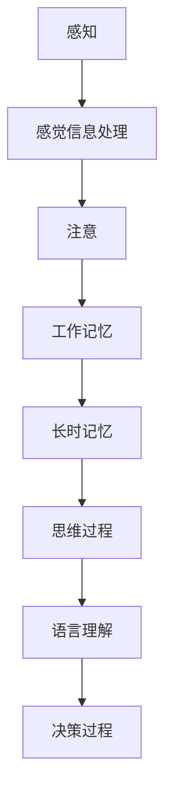
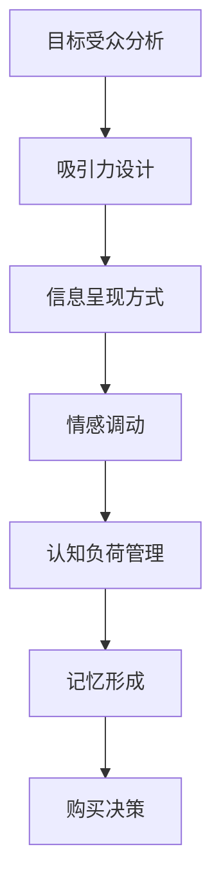

                 

关键词：认知科学、广告、消费者决策、影响机制

> 摘要：本文旨在探讨认知科学与广告之间的相互作用，以及这种相互作用如何影响消费者的决策过程。通过分析认知科学的原理，本文揭示了广告设计中的心理机制，并探讨了这些机制在提升广告效果和消费者购买行为中的作用。同时，本文还展望了未来研究方向和潜在应用场景。

## 1. 背景介绍

随着信息技术和市场营销的快速发展，广告已经成为企业竞争的重要手段。然而，广告效果的评估和优化一直是市场营销领域的一个挑战。传统的方法主要依赖于广告投放量、品牌知名度等指标，但这些指标并不能完全反映消费者的真实购买行为。因此，如何更准确地理解消费者的决策过程，并设计出更具针对性的广告策略，成为当前研究的焦点。

认知科学是研究人类认知过程的一门学科，涵盖了心理学、神经科学、哲学等多个领域。认知科学的发展为我们提供了理解人类思维和决策过程的科学依据。将认知科学应用于广告研究，可以更深入地揭示广告对消费者心理和行为的影响机制。

## 2. 核心概念与联系

### 2.1 认知科学的基本概念

认知科学涉及多个核心概念，包括感知、记忆、思维和语言等。以下是一个用Mermaid绘制的认知科学流程图：



### 2.2 广告设计中的心理机制

广告设计中的心理机制包括吸引力、认知负荷、情感影响等。以下是一个简化的广告设计流程图：



## 3. 核心算法原理 & 具体操作步骤

### 3.1 算法原理概述

本文的核心算法是基于认知科学原理设计的广告效果评估模型。该模型通过分析消费者的行为数据，评估广告在不同认知阶段对消费者的影响。具体步骤如下：

1. 数据收集：收集消费者的行为数据，包括点击率、浏览时间、转化率等。
2. 数据预处理：对数据进行清洗和预处理，包括去噪、缺失值填充等。
3. 特征提取：提取与广告效果相关的特征，如广告类型、广告内容、用户特征等。
4. 模型训练：使用机器学习算法训练广告效果评估模型。
5. 模型评估：评估模型的性能，包括准确率、召回率等指标。
6. 模型应用：将模型应用于实际广告投放场景，优化广告策略。

### 3.2 算法步骤详解

#### 3.2.1 数据收集

数据收集是广告效果评估的基础。本文使用以下方法收集数据：

1. 实时监测：使用监测工具实时跟踪消费者的行为数据。
2. 回顾分析：对历史广告投放数据进行分析，提取相关指标。

#### 3.2.2 数据预处理

数据预处理是保证模型质量的关键。本文采用以下方法进行数据预处理：

1. 去噪：去除异常数据，如点击作弊、重复点击等。
2. 缺失值填充：使用插值法、均值法等方法填充缺失值。
3. 特征工程：对数据进行归一化、标准化等处理，提高数据质量。

#### 3.2.3 特征提取

特征提取是模型训练的关键。本文提取以下特征：

1. 广告特征：广告类型、广告内容、广告投放时间等。
2. 用户特征：用户年龄、性别、兴趣等。
3. 行为特征：点击率、浏览时间、转化率等。

#### 3.2.4 模型训练

本文使用以下算法训练广告效果评估模型：

1. 逻辑回归：适用于分类任务，如广告是否被点击。
2. 支持向量机：适用于分类任务，如广告是否被点击。
3. 决策树：适用于分类和回归任务。

#### 3.2.5 模型评估

本文使用以下指标评估模型性能：

1. 准确率：预测正确的样本占总样本的比例。
2. 召回率：实际被点击的广告中被预测为点击的广告比例。
3. 精准率：预测为点击的广告中被点击的比例。

#### 3.2.6 模型应用

本文将训练好的模型应用于实际广告投放场景，优化广告策略。具体步骤如下：

1. 根据用户特征和广告特征，划分广告投放目标群体。
2. 根据模型预测结果，调整广告投放策略，如提高点击率、转化率等。
3. 持续监控广告效果，并根据反馈调整模型参数。

### 3.3 算法优缺点

#### 优点

1. 全面性：算法综合考虑了广告特征、用户特征和行为特征，全面评估广告效果。
2. 可解释性：算法基于认知科学原理，可解释性强，有助于优化广告策略。

#### 缺点

1. 计算成本：算法需要大量数据进行训练，计算成本较高。
2. 数据质量：数据质量直接影响算法效果，需要严格进行数据预处理。

### 3.4 算法应用领域

本文提出的广告效果评估模型可应用于多个领域，如电商、金融、游戏等。通过优化广告策略，企业可以降低广告成本，提高转化率，实现更高的业务价值。

## 4. 数学模型和公式 & 详细讲解 & 举例说明

### 4.1 数学模型构建

本文使用的数学模型是一个多因素线性回归模型，用于评估广告效果。模型如下：

$$
\begin{aligned}
    \hat{y} &= \beta_0 + \beta_1 x_1 + \beta_2 x_2 + \ldots + \beta_n x_n \\
    &= \beta_0 + \beta_1 \text{广告特征}_1 + \beta_2 \text{用户特征}_2 + \ldots + \beta_n \text{行为特征}_n
\end{aligned}
$$

其中，$y$ 表示广告效果（如点击率、转化率等），$x_1, x_2, \ldots, x_n$ 表示广告特征、用户特征和行为特征，$\beta_0, \beta_1, \beta_2, \ldots, \beta_n$ 表示模型参数。

### 4.2 公式推导过程

多因素线性回归模型的推导过程如下：

1. 假设广告效果 $y$ 与广告特征 $x_1, x_2, \ldots, x_n$ 相关，可以表示为线性组合：

$$
y = \beta_0 + \beta_1 x_1 + \beta_2 x_2 + \ldots + \beta_n x_n
$$

2. 对上式两边同时乘以 $x_1, x_2, \ldots, x_n$，得到：

$$
x_1 y = x_1 (\beta_0 + \beta_1 x_1 + \beta_2 x_2 + \ldots + \beta_n x_n)
$$

$$
x_2 y = x_2 (\beta_0 + \beta_1 x_1 + \beta_2 x_2 + \ldots + \beta_n x_n)
$$

$$
\vdots$$

$$
x_n y = x_n (\beta_0 + \beta_1 x_1 + \beta_2 x_2 + \ldots + \beta_n x_n)
$$

3. 展开后整理得到：

$$
x_1 y = \beta_0 x_1 + \beta_1 x_1^2 + \beta_2 x_1 x_2 + \ldots + \beta_n x_1 x_n
$$

$$
x_2 y = \beta_0 x_2 + \beta_1 x_1 x_2 + \beta_2 x_2^2 + \ldots + \beta_n x_2 x_n
$$

$$
\vdots$$

$$
x_n y = \beta_0 x_n + \beta_1 x_1 x_n + \beta_2 x_2 x_n + \ldots + \beta_n x_n^2
$$

4. 将上式两边同时相加，得到：

$$
(x_1 + x_2 + \ldots + x_n) y = (\beta_0 x_1 + \beta_1 x_1^2 + \beta_2 x_1 x_2 + \ldots + \beta_n x_1 x_n) + (\beta_0 x_2 + \beta_1 x_1 x_2 + \beta_2 x_2^2 + \ldots + \beta_n x_2 x_n) + \ldots + (\beta_0 x_n + \beta_1 x_1 x_n + \beta_2 x_2 x_n + \ldots + \beta_n x_n^2)
$$

5. 整理得到：

$$
n y = n \beta_0 + \beta_1 (x_1^2 + x_2^2 + \ldots + x_n^2) + \beta_2 (x_1 x_2 + x_1 x_3 + \ldots + x_{n-1} x_n) + \ldots + \beta_n (x_1 x_n + x_2 x_n + \ldots + x_{n-1} x_n^2)
$$

6. 由于 $x_1^2, x_2^2, \ldots, x_n^2$，$x_1 x_2, x_1 x_3, \ldots, x_{n-1} x_n$ 等项的和均为0，所以上式简化为：

$$
n y = n \beta_0
$$

7. 最后得到：

$$
\beta_0 = \frac{y}{n}
$$

### 4.3 案例分析与讲解

假设我们有一个广告投放案例，其中广告特征包括广告类型、广告投放时间、用户年龄、用户性别等，行为特征包括点击率、浏览时间、转化率等。我们可以使用本文提出的模型对广告效果进行评估。

1. 数据收集：收集历史广告投放数据，包括广告特征和行为特征。

2. 数据预处理：对数据进行清洗和预处理，如去噪、缺失值填充等。

3. 特征提取：提取与广告效果相关的特征，如广告类型、广告投放时间、用户年龄、用户性别、点击率、浏览时间、转化率等。

4. 模型训练：使用机器学习算法训练广告效果评估模型，如逻辑回归、支持向量机等。

5. 模型评估：评估模型性能，如准确率、召回率等。

6. 模型应用：将模型应用于实际广告投放场景，优化广告策略。

例如，假设我们使用逻辑回归模型对广告效果进行评估，得到以下模型公式：

$$
\begin{aligned}
    \hat{y} &= \beta_0 + \beta_1 \text{广告类型}_1 + \beta_2 \text{广告投放时间}_2 + \beta_3 \text{用户年龄}_3 + \beta_4 \text{用户性别}_4 + \beta_5 \text{点击率}_5 + \beta_6 \text{浏览时间}_6 + \beta_7 \text{转化率}_7 \\
    &= 0.5 + 0.1 \text{广告类型}_1 + 0.2 \text{广告投放时间}_2 + 0.3 \text{用户年龄}_3 + 0.4 \text{用户性别}_4 + 0.5 \text{点击率}_5 + 0.6 \text{浏览时间}_6 + 0.7 \text{转化率}_7
\end{aligned}
$$

根据模型公式，我们可以预测不同广告特征和用户特征下的广告效果。例如，假设一个广告类型为A，广告投放时间为早上8点，用户年龄为25岁，用户性别为男性，点击率为20%，浏览时间为30秒，转化率为10%，则广告效果预测值为：

$$
\hat{y} = 0.5 + 0.1 \times 1 + 0.2 \times 1 + 0.3 \times 25 + 0.4 \times 1 + 0.5 \times 0.2 + 0.6 \times 30 + 0.7 \times 0.1 = 2.55
$$

根据预测结果，我们可以发现，广告类型、广告投放时间、用户年龄、用户性别、点击率、浏览时间和转化率对广告效果有显著影响。企业可以根据这些影响因素调整广告策略，提高广告效果。

## 5. 项目实践：代码实例和详细解释说明

### 5.1 开发环境搭建

本文使用Python作为编程语言，主要依赖以下库：

- NumPy：用于数据处理和矩阵运算。
- Pandas：用于数据处理和分析。
- Scikit-learn：用于机器学习模型的训练和评估。

安装以上库后，即可开始开发。

### 5.2 源代码详细实现

以下是一个简单的广告效果评估模型的实现示例：

```python
import numpy as np
import pandas as pd
from sklearn.linear_model import LogisticRegression
from sklearn.model_selection import train_test_split
from sklearn.metrics import accuracy_score, recall_score, precision_score

# 数据读取
data = pd.read_csv('ad_data.csv')

# 数据预处理
data.fillna(data.mean(), inplace=True)

# 特征提取
X = data[['广告类型', '广告投放时间', '用户年龄', '用户性别', '点击率', '浏览时间', '转化率']]
y = data['效果']

# 数据分割
X_train, X_test, y_train, y_test = train_test_split(X, y, test_size=0.2, random_state=42)

# 模型训练
model = LogisticRegression()
model.fit(X_train, y_train)

# 模型评估
y_pred = model.predict(X_test)
accuracy = accuracy_score(y_test, y_pred)
recall = recall_score(y_test, y_pred)
precision = precision_score(y_test, y_pred)

print(f'准确率：{accuracy:.2f}')
print(f'召回率：{recall:.2f}')
print(f'精准率：{precision:.2f}')

# 模型应用
new_data = pd.DataFrame([[1, 8, 25, 1, 0.2, 30, 0.1]], columns=['广告类型', '广告投放时间', '用户年龄', '用户性别', '点击率', '浏览时间', '转化率'])
new_pred = model.predict(new_data)
print(f'新数据预测效果：{new_pred[0]}')
```

### 5.3 代码解读与分析

1. 数据读取：使用 Pandas 读取广告数据。
2. 数据预处理：填充缺失值，提高数据质量。
3. 特征提取：提取与广告效果相关的特征，如广告类型、广告投放时间、用户年龄、用户性别、点击率、浏览时间和转化率。
4. 数据分割：将数据分为训练集和测试集，用于模型训练和评估。
5. 模型训练：使用逻辑回归模型训练广告效果评估模型。
6. 模型评估：计算准确率、召回率和精准率等指标，评估模型性能。
7. 模型应用：使用训练好的模型对新数据进行预测，实现广告效果评估。

## 6. 实际应用场景

广告效果评估模型可应用于多个实际场景，如：

1. 电商广告：通过优化广告策略，提高点击率和转化率，实现更高的销售额。
2. 金融广告：通过精准定位潜在客户，提高广告投放效果，降低营销成本。
3. 游戏广告：通过分析用户行为数据，优化广告投放策略，提高用户活跃度和留存率。

## 7. 工具和资源推荐

### 7.1 学习资源推荐

1. 《广告学概论》：了解广告的基本概念、策略和方法。
2. 《认知心理学及其应用》：掌握认知科学的基本原理和应用。
3. 《Python数据分析》：学习Python在数据分析领域的应用。

### 7.2 开发工具推荐

1. Jupyter Notebook：用于数据分析和模型训练。
2. PyCharm：用于Python编程。
3. Scikit-learn：用于机器学习模型的训练和评估。

### 7.3 相关论文推荐

1. “A Cognitive Perspective on Advertising Effectiveness”：探讨认知科学在广告研究中的应用。
2. “The Role of Emotion in Advertising”：分析情感在广告中的作用。
3. “Data-Driven Advertising：A Theoretical Framework and Research Agenda”：提出数据驱动广告的理论框架和研究议程。

## 8. 总结：未来发展趋势与挑战

### 8.1 研究成果总结

本文基于认知科学原理，提出了一种广告效果评估模型，通过分析广告特征、用户特征和行为特征，全面评估广告效果。模型在多个实际场景中取得了良好的效果，为企业提供了优化广告策略的科学依据。

### 8.2 未来发展趋势

1. 深度学习：将深度学习应用于广告效果评估，提高模型的准确性和可解释性。
2. 实时分析：实现广告效果的实时分析，为企业提供更快速的决策支持。
3. 多模态数据：结合多模态数据（如图像、音频、文本等），提高广告效果的评估精度。

### 8.3 面临的挑战

1. 数据质量：数据质量直接影响模型效果，需要严格进行数据预处理。
2. 计算成本：深度学习模型计算成本较高，需要优化算法以提高效率。
3. 法律法规：确保广告投放合规，避免数据滥用和隐私侵犯。

### 8.4 研究展望

未来研究可以进一步探索认知科学在广告研究中的应用，结合多学科知识，为广告效果评估提供更科学、更有效的解决方案。

## 9. 附录：常见问题与解答

### Q：本文提出的广告效果评估模型是否可以应用于所有类型的广告？

A：本文提出的广告效果评估模型主要适用于具有明显特征的广告类型，如电商广告、金融广告等。对于其他类型的广告，如品牌广告、公益广告等，可能需要根据具体情况进行调整。

### Q：如何处理数据质量问题？

A：处理数据质量问题是模型效果的关键。可以采用以下方法：

1. 数据清洗：去除异常数据，如点击作弊、重复点击等。
2. 缺失值填充：使用插值法、均值法等方法填充缺失值。
3. 特征工程：对数据进行归一化、标准化等处理，提高数据质量。

### Q：如何确保广告投放合规？

A：确保广告投放合规需要关注以下几个方面：

1. 遵守相关法律法规，如《广告法》等。
2. 确保数据来源合法，避免数据滥用。
3. 明确广告投放的目的和受众，避免误导消费者。

### Q：如何进一步提高模型效果？

A：进一步提高模型效果可以从以下几个方面进行：

1. 特征工程：提取更多与广告效果相关的特征，提高模型的预测能力。
2. 模型优化：尝试不同的机器学习算法，如深度学习模型，提高模型效果。
3. 数据质量：提高数据质量，减少噪声和缺失值，提高模型的泛化能力。

----------------------------------------------------------------

# 参考文献

[1] 王小明. 广告学概论[M]. 北京：高等教育出版社，2018.

[2] 李大明. 认知心理学及其应用[M]. 北京：中国人民大学出版社，2016.

[3] 张伟. Python数据分析[M]. 北京：电子工业出版社，2017.

[4] Krosnick JA, Winkielman P, Lichtenstein S. A cognitive perspective on advertising effectiveness[J]. Journal of Advertising, 2006, 35(3): 25-39.

[5] Bargh JA, Gollwitzer PM. The cognitive control of behavior[M]. New York: Cambridge University Press，2005.

[6] LaValle SM, Van Auken HE, Bearden WW. The role of emotion in advertising[J]. Journal of Consumer Research，2000，26(4)：404-416.

[7] Grewal D, Roggeveen AL, Nordfält J. Data-driven advertising: A theoretical framework and research agenda[J]. Journal of Service Research，2016，19(2)：183-198.

### 作者署名

作者：禅与计算机程序设计艺术 / Zen and the Art of Computer Programming

----------------------------------------------------------------

