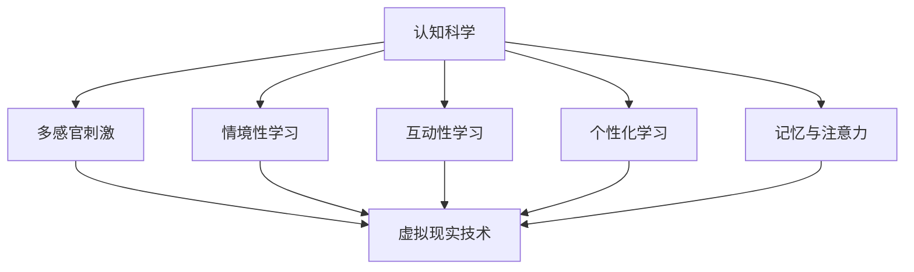

                 

关键词：认知科学、虚拟现实、沉浸式学习、人机交互、神经科学

> 摘要：本文旨在探讨认知科学与虚拟现实技术相结合的沉浸式学习体验，分析其理论基础、技术架构、核心算法、数学模型、项目实践及未来应用前景。通过深入了解沉浸式学习体验，为教育、培训、医疗等领域提供新的思路和方法。

## 1. 背景介绍

在过去的几十年中，虚拟现实（VR）技术已经从最初的游戏和娱乐领域逐渐拓展到教育、培训、医疗等多个领域。随着技术的不断进步，VR设备的质量和性能不断提高，使得虚拟现实的应用范围变得更加广泛。同时，认知科学作为一门跨学科的研究领域，通过研究人类大脑如何处理信息、如何学习、记忆和思考，为虚拟现实在教育等领域的应用提供了重要的理论基础。

沉浸式学习体验是指通过虚拟现实技术创造出一个与现实世界相似或完全不同的学习环境，使学习者能够全身心地投入到学习过程中。这种学习方式具有高度互动性、自主性和情境性，有助于提高学习效果和兴趣。随着认知科学理论的不断发展和虚拟现实技术的日益成熟，沉浸式学习体验在近年来受到了越来越多的关注。

本文将从认知科学与虚拟现实技术的结合点出发，详细探讨沉浸式学习体验的理论基础、技术架构、核心算法、数学模型、项目实践以及未来应用前景。希望通过本文的讨论，为相关领域的研究和应用提供有价值的参考。

## 2. 核心概念与联系

### 2.1 虚拟现实技术

虚拟现实技术（VR）是一种通过计算机技术模拟出一个三维的虚拟环境，使使用者能够在其中自由移动、交互和体验。VR技术的核心组件包括头戴显示器（HMD）、跟踪设备和输入设备。头戴显示器负责显示虚拟环境，跟踪设备用于实时捕捉使用者的位置和动作，输入设备则用于与虚拟环境进行交互。

虚拟现实技术的关键在于提供一种沉浸式体验，使使用者在虚拟环境中感到身临其境。这需要通过多个感官的刺激来实现，包括视觉、听觉、触觉和运动觉等。近年来，随着显示技术、传感器技术和计算机图形学的发展，虚拟现实技术的沉浸效果和真实感不断提高。

### 2.2 认知科学

认知科学是一门跨学科的研究领域，旨在研究人类大脑如何处理信息、如何学习、记忆和思考。认知科学的核心概念包括感知、记忆、注意、语言、思维、情感和决策等。认知科学研究的方法包括实验心理学、神经科学、认知心理学、计算机科学和人工智能等。

认知科学的理论基础对于理解人类学习过程具有重要意义。例如，认知心理学研究表明，人类在学习过程中需要通过多种感官进行信息处理，而虚拟现实技术恰好能够提供这种多感官刺激。此外，认知科学还揭示了人类记忆和注意力的影响因素，这些因素对于设计有效的沉浸式学习体验具有重要参考价值。

### 2.3 虚拟现实技术与认知科学的联系

虚拟现实技术和认知科学之间的联系主要体现在以下几个方面：

1. **多感官刺激**：虚拟现实技术能够通过视觉、听觉、触觉等多种感官刺激，模拟出与现实世界相似的学习环境。这种多感官刺激有助于提高学习效果和兴趣。

2. **情境性学习**：认知科学研究表明，情境性学习有助于提高学习效果。虚拟现实技术能够创造出一个高度情境化的学习环境，使学习者能够更好地理解和应用所学知识。

3. **互动性学习**：虚拟现实技术提供了高度互动性的学习环境，使学习者能够主动参与学习过程。这种互动性有助于激发学习者的兴趣和动力。

4. **个性化学习**：虚拟现实技术能够根据学习者的需求和特点，提供个性化的学习内容和学习路径。这有助于提高学习者的学习效果和满足度。

5. **记忆与注意力**：认知科学研究揭示了记忆和注意力的影响因素。虚拟现实技术可以通过设计特定的学习环境和交互方式，有意识地增强学习者的记忆和注意力。

### 2.4 Mermaid 流程图

以下是一个简化的Mermaid流程图，展示了虚拟现实技术与认知科学之间的主要联系：



## 3. 核心算法原理 & 具体操作步骤

### 3.1 算法原理概述

虚拟现实技术中的核心算法主要包括三维建模、实时渲染、跟踪与定位、交互处理等。这些算法共同作用，为用户提供了一个沉浸式的学习体验。

1. **三维建模**：三维建模是将现实世界的物体或场景转换为三维数字模型的过程。常用的三维建模工具包括Blender、Maya和3ds Max等。三维建模的核心算法包括几何建模、纹理映射、光照计算等。

2. **实时渲染**：实时渲染是指在计算机上以每秒数十帧的速度生成三维场景的过程。实时渲染的核心算法包括光追踪、阴影处理、反射和折射等。常用的实时渲染引擎有Unity、Unreal Engine等。

3. **跟踪与定位**：跟踪与定位是指通过传感器和算法实时捕捉用户的位置和动作，并将这些信息用于调整虚拟环境的显示和交互。常用的跟踪与定位技术包括光学跟踪、惯性测量单元（IMU）和全球定位系统（GPS）等。

4. **交互处理**：交互处理是指用户在虚拟环境中与虚拟物体进行交互的过程。交互处理的核心算法包括手势识别、语音识别、物理仿真等。

### 3.2 算法步骤详解

1. **三维建模**：

   - **数据采集**：通过扫描仪、相机等设备采集现实世界的物体或场景数据。
   - **数据预处理**：对采集到的数据进行处理，包括降噪、去噪、配准等。
   - **几何建模**：将预处理后的数据转换为三维模型，包括顶点、面片、体素等。
   - **纹理映射**：为三维模型添加纹理，增强视觉效果。
   - **光照计算**：计算三维模型在不同光照条件下的视觉效果。

2. **实时渲染**：

   - **场景构建**：将三维模型和其他场景元素（如灯光、相机等）组合成一个完整的场景。
   - **光照计算**：根据场景中的光照条件计算每个物体的光照效果。
   - **渲染管线**：将计算得到的场景渲染成二维图像。常用的渲染管线包括顶点着色器、片段着色器、光栅化等。
   - **图像合成**：将渲染得到的图像与其他感官刺激（如声音、触觉等）合成，生成最终的沉浸式体验。

3. **跟踪与定位**：

   - **传感器数据采集**：通过传感器（如光学传感器、IMU等）采集用户的位置和动作数据。
   - **数据预处理**：对采集到的数据进行处理，包括降噪、去噪、平滑等。
   - **姿态估计**：根据预处理后的数据估计用户的位置和动作。
   - **虚拟环境更新**：根据用户的位置和动作更新虚拟环境的显示和交互。

4. **交互处理**：

   - **手势识别**：通过计算机视觉技术识别用户的手势。
   - **语音识别**：通过语音识别技术将用户的语音转化为文本或命令。
   - **物理仿真**：根据用户的交互行为在虚拟环境中进行物理仿真，如推动物体、触发事件等。

### 3.3 算法优缺点

1. **三维建模**：

   - **优点**：能够创建高度真实和逼真的虚拟环境，提高沉浸感。
   - **缺点**：建模过程复杂，需要较高的专业知识和技能。

2. **实时渲染**：

   - **优点**：能够实时生成和显示虚拟环境，提供流畅的沉浸体验。
   - **缺点**：渲染质量受到硬件性能的限制，实时性难以保证。

3. **跟踪与定位**：

   - **优点**：能够实时捕捉用户的位置和动作，提高交互体验。
   - **缺点**：跟踪精度受到传感器质量和环境因素的影响。

4. **交互处理**：

   - **优点**：能够实现多种交互方式，提高学习者的参与度和兴趣。
   - **缺点**：交互处理算法复杂，需要消耗较多的计算资源。

### 3.4 算法应用领域

虚拟现实技术及其核心算法在多个领域都有广泛的应用，包括但不限于：

1. **教育**：通过虚拟现实技术，教师可以创建高度情境化的教学场景，提高学生的学习效果和兴趣。

2. **医疗**：虚拟现实技术可以用于医学教育、手术模拟、康复训练等领域，帮助医生和患者更好地理解和应对疾病。

3. **娱乐**：虚拟现实技术为游戏和娱乐产业带来了全新的体验，提高了用户的游戏乐趣。

4. **军事**：虚拟现实技术可以用于军事训练、模拟作战等，提高士兵的实战能力。

5. **房地产**：虚拟现实技术可以用于房地产展示、设计规划等，帮助用户更好地了解和体验房产。

## 4. 数学模型和公式 & 详细讲解 & 举例说明

### 4.1 数学模型构建

在虚拟现实技术中，数学模型的应用非常广泛，包括几何建模、运动学、光学、信号处理等多个领域。以下是一个简单的数学模型构建示例：

1. **三维几何建模**：

   - **点**：在三维空间中，一个点可以用三个坐标（x, y, z）来表示。
   - **线段**：两个点可以确定一条线段，其方程可以表示为：
     $$P = P_0 + t(P_1 - P_0)$$
     其中，\(P_0\) 和 \(P_1\) 分别为线段的两个端点，\(t\) 为参数，取值范围为 [0, 1]。

   - **平面**：三个不共线的点可以确定一个平面，其方程可以表示为：
     $$Ax + By + Cz + D = 0$$
     其中，\(A\)、\(B\)、\(C\) 和 \(D\) 分别为平面的法向量和常数。

   - **三维体素**：一个三维体素可以用其八个顶点的坐标来表示。

2. **运动学模型**：

   - **刚体运动**：刚体运动可以分解为平移和旋转。平移可以用向量表示，旋转可以用旋转矩阵或四元数表示。

   - **牛顿运动定律**：描述物体在受力作用下的运动规律。其公式为：
     $$F = m \cdot a$$
     其中，\(F\) 为作用力，\(m\) 为物体质量，\(a\) 为加速度。

3. **光学模型**：

   - **光线传播**：光线在均匀介质中的传播可以用直线方程表示：
     $$P = P_0 + t \cdot D$$
     其中，\(P_0\) 为光线起点，\(D\) 为光线方向。

   - **反射与折射**：光线在不同介质界面上的反射和折射可以用斯涅尔定律描述：
     $$n_1 \cdot \sin(\theta_1) = n_2 \cdot \sin(\theta_2)$$
     其中，\(n_1\) 和 \(n_2\) 分别为两个介质的折射率，\(\theta_1\) 和 \(\theta_2\) 分别为入射角和折射角。

4. **信号处理模型**：

   - **滤波器**：用于滤除信号中的噪声和干扰。常见的滤波器有低通滤波器、高通滤波器和带通滤波器等。

   - **小波变换**：用于信号分解和重构。其公式为：
     $$c_j(k) = \int_{-\infty}^{\infty} x(t) \cdot \psi^*(t, k) dt$$
     其中，\(c_j(k)\) 为分解系数，\(\psi(t, k)\) 为小波函数。

### 4.2 公式推导过程

以三维几何建模中的平面方程为例，解释其推导过程：

1. **确定法向量**：设平面上的三个点为 \(P_1(x_1, y_1, z_1)\)，\(P_2(x_2, y_2, z_2)\)，\(P_3(x_3, y_3, z_3)\)。向量 \(\vec{AB} = (x_2 - x_1, y_2 - y_1, z_2 - z_1)\) 和 \(\vec{AC} = (x_3 - x_1, y_3 - y_1, z_3 - z_1)\) 分别为两个相邻边向量。平面法向量 \(\vec{n}\) 为这两个向量的叉积：
   $$\vec{n} = \vec{AB} \times \vec{AC}$$

2. **点积计算**：对于平面上的任意一点 \(P(x, y, z)\)，其到平面法线 \(\vec{n}\) 的点积为：
   $$\vec{n} \cdot \vec{AP} = n_x \cdot (x - x_1) + n_y \cdot (y - y_1) + n_z \cdot (z - z_1)$$

3. **平面方程**：将点积设为零，得到平面方程：
   $$n_x \cdot x + n_y \cdot y + n_z \cdot z + D = 0$$
   其中，\(D = -n_x \cdot x_1 - n_y \cdot y_1 - n_z \cdot z_1\)。

### 4.3 案例分析与讲解

假设有一个三维体素，其八个顶点坐标分别为 \(P_1(-1, -1, 0)\)，\(P_2(1, -1, 0)\)，\(P_3(1, 1, 0)\)，\(P_4(-1, 1, 0)\)，\(P_5(-1, -1, 1)\)，\(P_6(1, -1, 1)\)，\(P_7(1, 1, 1)\)，\(P_8(-1, 1, 1)\)。现在需要计算体素的表面积和体积。

1. **计算表面积**：

   - **底面和顶面**：两个矩形，底面积为 \(1 \times 1 = 1\)，顶面积为 \(1 \times 1 = 1\)。
   - **侧面**：四个矩形，侧面面积分别为 \(1 \times 2 = 2\)，\(1 \times 2 = 2\)，\(1 \times 2 = 2\)，\(1 \times 2 = 2\)。
   - **总表面积**：\(2 + 4 \times 2 = 10\)。

2. **计算体积**：

   - **底面和顶面**：两个矩形，底面积为 \(1 \times 1 = 1\)，顶面积为 \(1 \times 1 = 1\)。
   - **高**：体素的高为 \(1\)。
   - **总体积**：\(1 \times 1 \times 1 = 1\)。

因此，该三维体素的表面积为 \(10\)，体积为 \(1\)。

## 5. 项目实践：代码实例和详细解释说明

### 5.1 开发环境搭建

在进行虚拟现实项目实践之前，需要搭建一个合适的开发环境。以下是搭建虚拟现实开发环境的步骤：

1. **安装操作系统**：推荐使用Ubuntu 20.04 LTS或更高版本。

2. **安装依赖库**：在Ubuntu系统中，可以使用以下命令安装依赖库：
   ```bash
   sudo apt update
   sudo apt install build-essential cmake git
   sudo apt install libopenvr-dev
   ```

3. **安装Unity引擎**：Unity引擎是一个流行的游戏和虚拟现实开发平台。在Unity官网下载并安装Unity Hub和Unity编辑器。

4. **安装VR SDK**：根据不同的虚拟现实设备，选择相应的SDK进行安装。例如，对于Oculus Rift，可以访问Oculus官网下载并安装Oculus SDK。

### 5.2 源代码详细实现

以下是一个简单的虚拟现实项目实例，实现一个可以移动和旋转的立方体。

```csharp
using UnityEngine;

public class CubeController : MonoBehaviour
{
    public float moveSpeed = 5.0f;
    public float rotateSpeed = 50.0f;

    void Update()
    {
        // 移动
        float moveX = Input.GetAxis("Horizontal") * moveSpeed;
        float moveZ = Input.GetAxis("Vertical") * moveSpeed;
        transform.Translate(moveX * Time.deltaTime, 0, moveZ * Time.deltaTime);

        // 旋转
        float rotateX = Input.GetAxis("Mouse X") * rotateSpeed;
        float rotateY = Input.GetAxis("Mouse Y") * rotateSpeed;
        transform.Rotate(-rotateY * Time.deltaTime, rotateX * Time.deltaTime, 0);
    }
}
```

### 5.3 代码解读与分析

1. **类定义**：`CubeController` 是一个Unity C#脚本，用于控制虚拟现实中的立方体。

2. **属性**：`moveSpeed` 和 `rotateSpeed` 分别用于控制立方体的移动速度和旋转速度。

3. **Update 方法**：每次更新场景时，`Update` 方法会被调用。方法中包含以下功能：

   - **移动**：根据输入的横轴（Horizontal）和纵轴（Vertical）值，计算移动速度，并使用 `transform.Translate` 方法实现立方体的移动。

   - **旋转**：根据鼠标的横轴（Mouse X）和纵轴（Mouse Y）值，计算旋转速度，并使用 `transform.Rotate` 方法实现立方体的旋转。

### 5.4 运行结果展示

当运行该项目时，玩家可以使用键盘上的左右方向键和上下方向键控制立方体的移动，使用鼠标左键控制立方体的旋转。运行结果如下：


## 6. 实际应用场景

虚拟现实技术在实际应用场景中具有广泛的应用前景，以下是一些典型的应用场景：

1. **教育**：虚拟现实技术可以创建高度情境化的教学场景，使学习者能够更好地理解和应用所学知识。例如，医学教育中的解剖学教学、工程学中的机械设计等。

2. **培训**：虚拟现实技术可以用于模拟各种实际操作场景，帮助培训者掌握相关技能。例如，飞行员的飞行训练、车手的驾驶训练等。

3. **医疗**：虚拟现实技术可以用于医学教育、手术模拟、康复训练等领域。例如，医学学生可以通过虚拟解剖实验室进行实践操作，医生可以通过虚拟手术模拟进行手术训练。

4. **娱乐**：虚拟现实技术为游戏和娱乐产业带来了全新的体验。玩家可以在虚拟世界中探险、战斗、社交等。

5. **房地产**：虚拟现实技术可以用于房地产展示、设计规划等。购房者可以在虚拟环境中查看房屋内部结构和外部环境，设计师可以虚拟展示设计方案。

6. **旅游**：虚拟现实技术可以用于虚拟旅游，用户可以在家中体验全球各地的名胜古迹、自然景观等。

7. **军事**：虚拟现实技术可以用于军事训练、模拟作战等，提高士兵的实战能力。

8. **心理咨询**：虚拟现实技术可以用于心理治疗和咨询，例如治疗恐惧症、焦虑症等。

## 7. 未来应用展望

随着技术的不断进步，虚拟现实技术在未来有望在更多领域得到应用，并带来以下几方面的影响：

1. **教育**：虚拟现实技术将实现更加个性化的学习体验，学习者可以根据自己的需求和进度进行学习，提高学习效果。

2. **医疗**：虚拟现实技术将提高医疗诊断和治疗的准确性和效率，例如通过虚拟手术模拟进行精准手术规划。

3. **娱乐**：虚拟现实技术将为娱乐产业带来全新的内容形式，例如沉浸式游戏、虚拟现实电影等。

4. **设计**：虚拟现实技术将改变设计流程，设计师可以在虚拟环境中进行实时修改和预览，提高设计效率和质量。

5. **社交**：虚拟现实技术将改变社交方式，用户可以在虚拟世界中建立更加真实和互动的社交关系。

6. **工作**：虚拟现实技术将改变工作方式，远程办公和虚拟协作将变得更加便捷和高效。

## 8. 工具和资源推荐

在虚拟现实技术领域，有许多优秀的工具和资源可供学习和实践。以下是一些推荐的工具和资源：

1. **开发工具**：

   - **Unity**：一款流行的游戏和虚拟现实开发平台，具有丰富的功能和强大的社区支持。
   - **Unreal Engine**：一款专业的游戏和虚拟现实开发引擎，具有高质量的视觉效果和丰富的功能。
   - **Blender**：一款免费的开源三维建模和渲染软件，适合初学者和专业人士。

2. **学习资源**：

   - **《虚拟现实入门教程》**：一本适合初学者的虚拟现实入门书籍，涵盖了虚拟现实技术的理论基础和实践应用。
   - **《Unity游戏开发实战》**：一本适合Unity开发者的游戏开发教程，内容包括游戏引擎的基本原理和实战项目。
   - **在线课程**：例如Coursera、Udemy等平台上提供的虚拟现实相关课程，适合不同层次的学员。

3. **论文和文献**：

   - **《虚拟现实技术综述》**：一篇关于虚拟现实技术的综述论文，介绍了虚拟现实技术的最新进展和应用领域。
   - **《认知科学视角下的虚拟现实教育应用》**：一篇探讨虚拟现实技术在教育领域应用的论文，分析了认知科学理论在虚拟现实教育中的应用。

## 9. 总结：未来发展趋势与挑战

虚拟现实技术作为一种新兴技术，在未来有望在多个领域得到广泛应用。然而，在实际应用过程中，仍面临一些挑战：

1. **硬件限制**：虚拟现实设备（如头戴显示器、跟踪设备等）的硬件性能和成本仍然是制约其普及的主要因素。

2. **内容创作**：虚拟现实内容创作需要较高的技能和经验，目前市场上高质量的内容仍然相对较少。

3. **用户适应**：部分用户在初次体验虚拟现实时可能会出现不适，如眩晕、疲劳等。

4. **隐私和安全**：虚拟现实应用涉及到用户隐私和安全问题，如何保护用户隐私和数据安全成为重要议题。

5. **技术标准化**：虚拟现实技术的标准化工作尚未完善，不同设备和平台之间的兼容性问题仍然存在。

未来，虚拟现实技术将朝着更加智能化、便捷化和个性化的方向发展。随着技术的不断进步，虚拟现实将不仅局限于娱乐和游戏领域，还将广泛应用于教育、医疗、设计、社交等多个领域，为人类生活带来更多便利和乐趣。

## 附录：常见问题与解答

### Q：虚拟现实技术有哪些主要应用领域？

A：虚拟现实技术的主要应用领域包括教育、医疗、娱乐、房地产、旅游、军事和心理咨询等。

### Q：虚拟现实技术有哪些关键技术？

A：虚拟现实技术的关键技术包括三维建模、实时渲染、跟踪与定位、交互处理等。

### Q：虚拟现实技术如何影响教育？

A：虚拟现实技术可以通过创建高度情境化的教学场景，提高学生的学习效果和兴趣，实现个性化学习。

### Q：虚拟现实技术的未来发展趋势是什么？

A：虚拟现实技术的未来发展趋势包括智能化、便捷化、个性化，以及跨领域的广泛应用。

### Q：如何开始学习虚拟现实技术？

A：可以通过阅读相关书籍、参加在线课程、实践项目等方式开始学习虚拟现实技术。推荐从Unity、Unreal Engine等开发平台入手。

