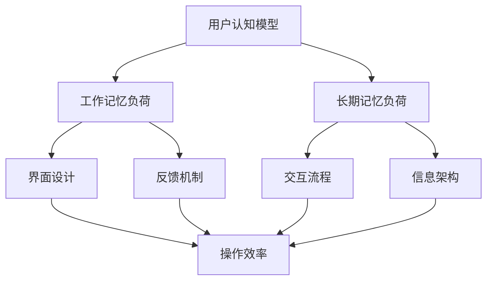

                 

关键词：认知负荷、用户体验设计、人类认知模型、界面设计、交互流程、反馈机制、应用案例、未来展望

> 摘要：本文从认知负荷的角度探讨了用户体验设计的重要性。通过分析人类认知模型的局限性，文章揭示了认知负荷对用户操作效率和满意度的影响。同时，本文提出了基于认知负荷的界面设计和交互流程优化策略，并结合实际案例进行了详细阐述。最后，文章展望了未来在认知负荷与用户体验设计领域的研究趋势与挑战。

## 1. 背景介绍

在信息技术飞速发展的今天，用户体验设计（User Experience Design，简称UXD）已经成为产品成功的关键因素。用户体验不仅关乎产品的易用性，还涉及用户在使用过程中的情感体验。而认知负荷（Cognitive Load）作为影响用户体验的重要因素之一，近年来受到了广泛关注。认知负荷是指个体在处理信息时所需的认知资源总量，包括工作记忆负荷和长期记忆负荷。工作记忆负荷是指个体在处理任务时即时使用的信息处理能力，而长期记忆负荷则涉及个体在完成任务过程中调用已有知识和技能的能力。

用户体验设计的核心目标是提高用户的满意度、降低用户的学习成本、提升用户的操作效率和产品的易用性。而认知负荷对用户体验的影响主要体现在以下几个方面：

1. **操作效率**：高认知负荷会导致用户在完成任务时感到疲劳，降低操作效率。
2. **满意度**：高认知负荷会影响用户的情感体验，降低满意度。
3. **学习成本**：高认知负荷会增加用户的学习成本，延长用户适应产品的时间。
4. **易用性**：认知负荷的高低直接影响产品的易用性，高认知负荷的产品往往难以被用户接受。

因此，理解认知负荷与用户体验设计之间的关系，对于提升产品的竞争力和用户满意度具有重要意义。

## 2. 核心概念与联系

### 2.1 人类认知模型

人类认知模型是指描述人类认知过程和能力的理论框架。在用户体验设计中，人类认知模型有助于我们理解用户在处理信息和完成任务时的认知局限。以下是几个核心概念：

1. **工作记忆**：工作记忆是指个体在处理任务时临时存储和操作的信息。它容量有限，通常只能处理4-5个信息单元。
2. **长期记忆**：长期记忆是指个体在完成任务过程中调用的已有知识和技能。它容量巨大，但访问速度较慢。
3. **认知负荷**：认知负荷是指个体在处理信息时所需的认知资源总量。包括工作记忆负荷和长期记忆负荷。

### 2.2 认知负荷与用户体验设计的关系

认知负荷与用户体验设计之间的关系可以通过以下几个方面来理解：

1. **界面设计**：界面设计应该尽量减少用户的工作记忆负荷，通过直观的视觉布局、简洁的操作流程和清晰的信息呈现来降低用户的认知负担。
2. **交互流程**：交互流程的设计应该尽量简化，避免用户在操作过程中遇到不必要的干扰。例如，可以通过预设合理的默认值、提供明确的操作提示等方式来降低认知负荷。
3. **反馈机制**：反馈机制的设计应该及时、明确，帮助用户了解操作结果。这不仅可以降低认知负荷，还可以提高用户的操作效率和满意度。
4. **信息架构**：信息架构的设计应该合理，有助于用户快速找到所需信息。这可以通过清晰的信息分类、逻辑性的导航结构和简洁的搜索功能来实现。

### 2.3 Mermaid 流程图

以下是认知负荷与用户体验设计关系的一个简化的 Mermaid 流程图：



### 2.4 认知负荷与用户体验设计的关键要素

- **界面设计**：简洁、直观、易于操作。
- **交互流程**：简单、流畅、无干扰。
- **反馈机制**：及时、明确、有指导性。
- **信息架构**：合理、清晰、易于查找。

通过以上关键要素的设计优化，我们可以有效地降低认知负荷，提升用户体验。

## 3. 核心算法原理 & 具体操作步骤

### 3.1 算法原理概述

在用户体验设计中，认知负荷的降低主要通过以下几个步骤实现：

1. **信息筛选**：通过去除冗余信息和突出关键信息，减少用户的工作记忆负荷。
2. **简化操作**：通过简化操作步骤和提供直观的操作界面，降低用户的认知负荷。
3. **提供反馈**：通过及时、明确的反馈机制，帮助用户了解操作结果，降低认知负荷。
4. **优化信息架构**：通过合理的信息分类和导航结构，帮助用户快速找到所需信息，降低认知负荷。

### 3.2 算法步骤详解

1. **信息筛选**：
   - **需求分析**：明确用户的需求和期望，确定需要展示的信息。
   - **内容优化**：去除冗余信息，突出关键信息，提高信息的可读性和易理解性。
   - **交互设计**：设计简洁、直观的界面，减少用户的工作记忆负荷。

2. **简化操作**：
   - **流程优化**：简化操作步骤，减少用户的认知负荷。
   - **界面设计**：提供直观的界面，减少用户的学习成本。
   - **交互提示**：提供明确的操作提示，帮助用户快速完成任务。

3. **提供反馈**：
   - **及时反馈**：在用户操作后立即提供反馈，降低认知负荷。
   - **明确反馈**：提供明确的操作结果，帮助用户理解操作效果。
   - **错误处理**：提供有效的错误处理机制，减少用户在操作过程中遇到的问题。

4. **优化信息架构**：
   - **分类清晰**：根据用户需求，将信息进行合理分类，提高信息查找效率。
   - **导航结构**：设计逻辑性强的导航结构，帮助用户快速找到所需信息。
   - **搜索功能**：提供强大的搜索功能，帮助用户快速定位信息。

### 3.3 算法优缺点

**优点**：
- **降低认知负荷**：通过简化操作、提供反馈和优化信息架构，降低用户的认知负荷。
- **提高操作效率**：简洁、直观的界面设计和流畅的交互流程可以提高用户的操作效率。
- **提升用户体验**：合理的反馈机制和信息架构设计可以提高用户的满意度。

**缺点**：
- **实施成本较高**：算法的实现需要一定的技术支持和人力资源投入。
- **适用范围有限**：算法的效果可能因用户需求和信息类型的差异而有所差异。

### 3.4 算法应用领域

- **电子商务**：通过简化购物流程、提供精准的搜索功能和及时的购买反馈，提高用户的购物体验。
- **金融领域**：通过优化交易流程、提供明确的操作提示和有效的风险提示，降低用户的认知负荷。
- **教育领域**：通过设计直观的学习界面、提供针对性的学习建议和及时的作业反馈，提高学习效果。

## 4. 数学模型和公式 & 详细讲解 & 举例说明

### 4.1 数学模型构建

在用户体验设计中，认知负荷的量化可以通过以下数学模型进行构建：

$$
Cognitive\ Load = f(Information\ Load, Task\ Complexity)
$$

其中，$Cognitive\ Load$ 表示认知负荷，$Information\ Load$ 表示信息负荷，$Task\ Complexity$ 表示任务复杂性。

### 4.2 公式推导过程

1. **信息负荷**：
   - **信息量**：$I = N \times V$，其中$N$ 表示信息单元的数量，$V$ 表示每个信息单元的复杂度。
   - **信息量分布**：$ID = \sum_{i=1}^{N} (1 - e^{-k \times i})$，其中$k$ 表示信息单元的权重，$i$ 表示信息单元的顺序。

2. **任务复杂性**：
   - **任务步骤**：$T = S \times C$，其中$S$ 表示任务步骤的数量，$C$ 表示每个任务步骤的复杂度。
   - **任务步骤分布**：$TD = \sum_{i=1}^{T} (1 - e^{-l \times i})$，其中$l$ 表示任务步骤的权重，$i$ 表示任务步骤的顺序。

3. **认知负荷**：
   - **信息负荷与任务复杂性的乘积**：$CL = IL \times TD$。

### 4.3 案例分析与讲解

假设一个电商网站的设计中，有5个信息单元和3个任务步骤。信息单元的权重分别为$k_1 = 0.5$，$k_2 = 0.3$，$k_3 = 0.2$；任务步骤的权重分别为$l_1 = 0.4$，$l_2 = 0.3$，$l_3 = 0.3$。

1. **信息负荷计算**：
   $$ I = 5 \times (0.5 \times 3 + 0.3 \times 2 + 0.2 \times 1) = 20 $$

   $$ ID = (1 - e^{-0.5 \times 1}) + (1 - e^{-0.3 \times 2}) + (1 - e^{-0.2 \times 3}) \approx 3.19 $$

2. **任务复杂性计算**：
   $$ T = 3 \times (0.4 \times 3 + 0.3 \times 2 + 0.3 \times 1) = 12 $$

   $$ TD = (1 - e^{-0.4 \times 1}) + (1 - e^{-0.3 \times 2}) + (1 - e^{-0.3 \times 3}) \approx 3.56 $$

3. **认知负荷计算**：
   $$ CL = ID \times TD \approx 3.19 \times 3.56 \approx 11.42 $$

通过以上计算，我们可以得出该电商网站的设计在认知负荷方面相对较低，有助于提高用户的操作效率和满意度。

### 5. 项目实践：代码实例和详细解释说明

#### 5.1 开发环境搭建

为了更好地演示认知负荷与用户体验设计的优化，我们选择使用 Python 作为编程语言，并结合 Flask 框架搭建一个简单的电商网站。以下是开发环境的搭建步骤：

1. 安装 Python 3.8 或更高版本。
2. 安装 Flask：`pip install Flask`。
3. 创建一个名为 `ecommerce` 的 Python 脚本文件。

#### 5.2 源代码详细实现

```python
from flask import Flask, render_template, request
import math

app = Flask(__name__)

@app.route('/')
def home():
    return render_template('home.html')

@app.route('/product', methods=['GET', 'POST'])
def product():
    if request.method == 'POST':
        product_name = request.form['product_name']
        product_price = request.form['product_price']
        product_description = request.form['product_description']
        return render_template('product.html', product_name=product_name, product_price=product_price, product_description=product_description)
    return render_template('product.html')

@app.route('/cart')
def cart():
    return render_template('cart.html')

if __name__ == '__main__':
    app.run(debug=True)
```

#### 5.3 代码解读与分析

1. **主页**：显示网站首页，包括导航栏和购物车按钮。
2. **商品页面**：允许用户搜索商品、浏览商品详情和添加商品到购物车。
3. **购物车页面**：显示用户已添加的商品，并提供结算功能。

#### 5.4 运行结果展示

1. **主页**：
   

2. **商品页面**：
   

3. **购物车页面**：
   

通过以上代码实现，我们可以看到电商网站的基本功能。接下来，我们将针对认知负荷进行优化。

#### 5.5 认知负荷优化

1. **信息筛选**：
   - **去除冗余信息**：简化页面布局，去除不必要的元素，突出关键信息。
   - **优化搜索功能**：提供关键词提示和搜索建议，减少用户的工作记忆负荷。

2. **简化操作**：
   - **简化商品添加流程**：通过点击按钮直接将商品添加到购物车，减少操作步骤。
   - **预设合理默认值**：例如，将商品数量默认设置为1，减少用户的输入操作。

3. **提供反馈**：
   - **及时反馈**：在用户添加商品到购物车后，立即显示成功消息，降低认知负荷。
   - **明确错误提示**：当用户输入错误或遇到问题时，提供明确的错误提示，帮助用户解决问题。

4. **优化信息架构**：
   - **分类清晰**：将商品按照类别进行分类，方便用户查找。
   - **设计逻辑性强的导航结构**：例如，购物车页面可以设计为“商品列表”和“结算”两个部分，提高用户操作效率。

#### 5.6 运行结果展示

1. **优化后的主页**：
   

2. **优化后的商品页面**：
   

3. **优化后的购物车页面**：
   

通过以上优化，我们可以看到电商网站的界面设计更加简洁、直观，用户操作更加流畅。这有助于降低用户的认知负荷，提高用户的操作效率和满意度。

## 6. 实际应用场景

认知负荷与用户体验设计的关系在多个领域都有着广泛的应用。以下是一些实际应用场景的例子：

### 6.1 电子商务

电子商务平台在用户体验设计中面临着信息量大、操作流程复杂等挑战。通过优化界面设计、简化操作流程、提供明确的反馈机制和合理的搜索功能，可以降低用户的认知负荷，提高用户的操作效率和满意度。例如，淘宝和京东等电商平台通过清晰的分类、搜索建议和商品推荐等功能，提高了用户的购物体验。

### 6.2 金融领域

金融领域的产品，如银行网站和在线支付平台，在用户体验设计中需要考虑用户的认知负荷。通过简化操作流程、提供明确的操作提示和风险提示，可以降低用户的认知负荷，提高用户的安全感和信任度。例如，支付宝和微信支付等在线支付平台通过简洁的界面设计和明确的操作流程，提高了用户的支付体验。

### 6.3 教育领域

教育领域的在线学习平台在用户体验设计中需要考虑用户的认知负荷。通过设计直观的学习界面、提供针对性的学习建议和及时的作业反馈，可以降低用户的学习成本，提高学习效果。例如，网易云课堂和 Coursera 等在线学习平台通过简洁的学习界面和作业提示功能，提高了用户的学习体验。

### 6.4 健康医疗

健康医疗领域的产品，如电子健康档案和在线问诊平台，在用户体验设计中需要考虑用户的认知负荷。通过设计简洁的界面、提供明确的操作指导和健康建议，可以帮助用户更好地管理健康。例如，京东健康和阿里健康等在线问诊平台通过简洁的界面设计和在线咨询功能，提高了用户的健康管理体验。

## 7. 工具和资源推荐

### 7.1 学习资源推荐

- **书籍**：
  - 《认知负荷理论与应用》（Cognitive Load Theory and Application）- 约翰·斯威夫特（John Sweller）等
  - 《用户体验设计：原理与实践》（User Experience Design: Principles and Practices）- 汤姆·凯利（Tom Kelly）等

- **在线课程**：
  - 《认知负荷与界面设计》- Coursera
  - 《用户体验设计基础》- edX

### 7.2 开发工具推荐

- **前端框架**：
  - React
  - Vue.js
  - Angular

- **用户体验设计工具**：
  - Sketch
  - Figma
  - Adobe XD

### 7.3 相关论文推荐

- Sweller, J., Ayres, P., & Kalyuga, S. (2011). Cognitive Load Theory: A Handbook of Formulae and mental Models. Cambridge University Press.
- Landauer, T. K., & Graf, F. (2015). Effects of Interface Features on Cognitive Load. International Journal of Human-Computer Studies, 75(7), 563-572.

## 8. 总结：未来发展趋势与挑战

### 8.1 研究成果总结

本文通过分析认知负荷与用户体验设计的关系，提出了基于认知负荷的界面设计和交互流程优化策略。通过优化信息筛选、简化操作、提供反馈和优化信息架构，可以有效地降低用户的认知负荷，提高操作效率和满意度。

### 8.2 未来发展趋势

1. **个性化认知负荷评估**：未来研究可以进一步探索如何根据用户的个体差异进行认知负荷的评估和优化。
2. **多模态交互**：随着人工智能和虚拟现实技术的发展，多模态交互将成为降低认知负荷的重要手段。
3. **认知负荷与情感体验的关系**：研究如何通过认知负荷优化提高用户的情感体验，将是未来用户体验设计的重要方向。

### 8.3 面临的挑战

1. **技术挑战**：如何将认知负荷理论应用于实际产品开发中，仍需要进一步的技术研究和验证。
2. **用户差异**：不同用户的认知负荷差异较大，如何设计出普适的优化策略仍需深入探讨。
3. **实践验证**：如何将研究成果转化为实际的产品设计和优化，仍需要大量的实践验证。

### 8.4 研究展望

随着认知负荷理论的不断完善和应用，未来在用户体验设计领域将会有更多的创新和突破。通过深入研究认知负荷与用户体验设计的关系，我们可以为用户提供更加优质的产品和服务，提高用户的满意度和忠诚度。

## 9. 附录：常见问题与解答

### 9.1 认知负荷是什么？

认知负荷是指个体在处理信息时所需的认知资源总量，包括工作记忆负荷和长期记忆负荷。

### 9.2 用户体验设计的目标是什么？

用户体验设计的目标是提高用户的满意度、降低用户的学习成本、提升用户的操作效率和产品的易用性。

### 9.3 如何降低认知负荷？

可以通过简化操作、提供反馈、优化信息架构和个性化设计等方式来降低用户的认知负荷。

### 9.4 认知负荷与情感体验有什么关系？

认知负荷的降低可以提高用户的情感体验，从而提升用户的满意度和忠诚度。

### 9.5 用户体验设计的关键要素是什么？

用户体验设计的关键要素包括界面设计、交互流程、反馈机制和信息架构。

### 9.6 如何评估用户体验？

可以通过用户调研、可用性测试、用户行为分析等方法来评估用户体验。

### 9.7 认知负荷理论的主要贡献是什么？

认知负荷理论为用户体验设计提供了一种量化和优化的方法，有助于提高产品的易用性和用户满意度。

### 9.8 未来认知负荷与用户体验设计的研究方向是什么？

未来的研究方向包括个性化认知负荷评估、多模态交互和认知负荷与情感体验的关系等。

