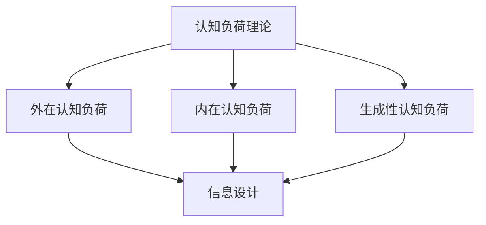

                 

关键词：认知负荷、信息设计、用户体验、软件工程、人机交互、信息架构、认知科学

> 摘要：本文深入探讨了认知负荷理论与信息设计的密切关联，通过剖析认知负荷理论的基本原理，解析其在信息设计中的应用与挑战，旨在为优化人机交互、提升用户体验提供科学指导。文章从背景介绍入手，逐步阐述核心概念、算法原理、数学模型、项目实践、实际应用场景，并展望未来发展趋势与挑战。

## 1. 背景介绍

在当今信息爆炸的时代，人们面临的信息量远超以往。如何有效地处理和利用这些信息，成为了软件工程和人机交互领域的重要课题。认知负荷理论（Cognitive Load Theory）作为一种心理学理论，为解决这一问题提供了新的视角。该理论由约翰·斯威德洛夫（John Sweller）在1988年提出，旨在解释人们在学习和解决问题过程中的认知负荷，以及如何通过信息设计降低认知负荷，提高学习效率和任务执行质量。

认知负荷理论主要关注三种认知负荷：外在认知负荷、内在认知负荷和生成性认知负荷。外在认知负荷与信息处理的外部环境有关，如任务的复杂性和学习材料的设计。内在认知负荷则与个体认知能力有关，包括短时记忆和长时记忆的处理。生成性认知负荷是指个体在解决问题过程中产生的思维活动，如抽象概念的理解和应用。

信息设计（Information Design）作为一种以用户为中心的设计方法，旨在通过合理的信息组织和呈现，帮助用户更高效地理解和处理信息。信息设计涉及到多个领域，包括图形设计、用户体验设计、信息架构等。其核心目标是通过直观、清晰的信息呈现，降低用户的认知负荷，提升信息获取的效率和满意度。

本文将从认知负荷理论的基本原理出发，结合信息设计的实际应用，深入探讨二者的关联与挑战。文章结构如下：

1. 背景介绍
2. 核心概念与联系
3. 核心算法原理 & 具体操作步骤
4. 数学模型和公式 & 详细讲解 & 举例说明
5. 项目实践：代码实例和详细解释说明
6. 实际应用场景
7. 工具和资源推荐
8. 总结：未来发展趋势与挑战
9. 附录：常见问题与解答

## 2. 核心概念与联系

在深入探讨认知负荷理论与信息设计之前，有必要明确这两个概念的基本原理及其相互关联。

### 2.1 认知负荷理论

认知负荷理论的核心思想是，人的认知资源是有限的。当认知负荷过高时，个体难以有效地处理信息，从而导致学习效率降低、错误率增加。根据斯威德洛夫的理论，认知负荷可以分为三种类型：

- **外在认知负荷**：由任务复杂性和信息呈现方式决定。例如，一个复杂的流程图可能会增加用户的外在认知负荷。
- **内在认知负荷**：与个体的认知能力有关，包括短时记忆和长时记忆的处理能力。例如，一个记忆容量有限的人难以同时处理大量信息。
- **生成性认知负荷**：指个体在解决问题过程中产生的思维活动，如抽象概念的理解和应用。例如，学习编程语言时需要理解抽象的概念和数据结构。

### 2.2 信息设计

信息设计旨在通过合理的组织、呈现和传达信息，降低用户的认知负荷，提升信息获取的效率和满意度。信息设计涉及到多个领域，包括：

- **图形设计**：通过视觉元素（如颜色、字体、图标）帮助用户更好地理解和处理信息。
- **用户体验设计**：关注用户在使用产品或服务过程中的感受和体验，确保信息设计符合用户的需求和习惯。
- **信息架构**：定义信息的组织结构和层次，确保信息易于查找和访问。

### 2.3 关联与挑战

认知负荷理论与信息设计的关联在于，信息设计可以影响用户的认知负荷。合理的信息设计可以通过以下方式降低认知负荷：

- **简化信息呈现**：通过去除冗余信息、突出关键内容，简化用户的信息处理过程。
- **优化界面布局**：通过合理的布局和导航，降低用户在查找信息时的认知负荷。
- **提高视觉一致性**：使用一致的视觉设计语言，帮助用户快速识别和操作界面元素。

然而，信息设计也面临一定的挑战。例如，信息设计的复杂性和多样性可能导致认知负荷的增加。如何在信息设计过程中平衡简化与丰富性，是信息设计师需要不断探索的问题。

### 2.4 Mermaid 流程图

以下是一个简化的认知负荷理论和信息设计关联的 Mermaid 流程图：



通过这个流程图，我们可以清晰地看到认知负荷理论与信息设计之间的关联。外在认知负荷、内在认知负荷和生成性认知负荷共同影响信息设计，而信息设计则通过降低认知负荷，提升用户体验。

## 3. 核心算法原理 & 具体操作步骤

### 3.1 算法原理概述

认知负荷理论在信息设计中得到了广泛的应用。其中一个核心算法是信息过滤与筛选算法。该算法的目的是通过分析用户的行为和需求，过滤和筛选出对用户最有价值的信息，从而降低用户的认知负荷。

信息过滤与筛选算法主要包括以下几个步骤：

1. **数据收集**：收集用户在使用信息系统过程中的行为数据，如点击记录、浏览时间等。
2. **用户需求分析**：通过分析用户的行为数据，识别用户的需求和兴趣点。
3. **信息过滤**：根据用户需求，过滤出与用户需求相关的信息。
4. **信息筛选**：对过滤出的信息进行筛选，去除重复和低价值的信息。
5. **信息呈现**：将筛选后的信息以直观、清晰的方式呈现给用户。

### 3.2 算法步骤详解

#### 3.2.1 数据收集

数据收集是信息过滤与筛选算法的基础。通过收集用户的行为数据，我们可以了解用户的需求和使用习惯。常用的数据收集方法包括：

- **日志分析**：通过分析用户在系统中的操作日志，获取用户的点击记录、浏览时间等信息。
- **用户调研**：通过问卷调查、访谈等方式，收集用户的需求和意见。
- **用户反馈**：通过用户反馈系统，获取用户对系统功能的建议和意见。

#### 3.2.2 用户需求分析

用户需求分析是信息过滤与筛选算法的关键步骤。通过分析用户的行为数据，我们可以识别用户的需求和兴趣点。常用的用户需求分析方法包括：

- **关联分析**：通过分析用户的行为数据，识别用户之间的兴趣关联。
- **聚类分析**：通过将用户行为数据划分为不同的集群，识别用户的共同需求和兴趣点。
- **机器学习**：使用机器学习算法，如决策树、支持向量机等，分析用户的行为数据，预测用户的需求和兴趣。

#### 3.2.3 信息过滤

信息过滤的目的是根据用户需求，筛选出与用户需求相关的信息。常用的信息过滤方法包括：

- **关键词过滤**：通过用户输入的关键词，过滤出与关键词相关的信息。
- **分类过滤**：根据用户的需求和兴趣点，将信息划分为不同的类别，然后根据类别过滤出相关信息。
- **协同过滤**：通过分析用户之间的相似度，推荐用户可能感兴趣的信息。

#### 3.2.4 信息筛选

信息筛选的目的是去除重复和低价值的信息，确保用户获取的信息是最相关和最有价值的。常用的信息筛选方法包括：

- **去重**：去除重复的信息，确保用户不会看到重复的内容。
- **质量评估**：通过算法评估信息的质量，去除低质量的、不准确的信息。
- **用户反馈**：通过用户对信息的评价和反馈，不断优化信息筛选算法，提高信息的质量。

#### 3.2.5 信息呈现

信息呈现的目的是将筛选后的信息以直观、清晰的方式呈现给用户。常用的信息呈现方法包括：

- **可视化**：通过图表、图像等可视化方式，呈现用户最关心的信息。
- **分屏显示**：将信息分为不同的屏幕，用户可以根据需要查看详细信息。
- **动态更新**：根据用户的行为和需求，动态更新信息内容，确保用户始终获取最新的信息。

### 3.3 算法优缺点

**优点：**

- **降低认知负荷**：通过信息过滤与筛选，用户可以更快速地获取到最关心的信息，降低认知负荷。
- **提升用户体验**：合理的信息呈现方式，可以提高用户的满意度，提升用户体验。
- **个性化推荐**：通过分析用户的行为和需求，实现个性化信息推荐，满足用户个性化的需求。

**缺点：**

- **计算成本高**：信息过滤与筛选算法需要大量的计算资源，特别是在大规模数据集上。
- **数据质量依赖**：算法的效果很大程度上依赖于数据的质量，如果数据不准确或不完整，会影响算法的效果。
- **用户隐私**：在收集用户行为数据时，可能涉及到用户的隐私问题，需要确保数据的安全和隐私。

### 3.4 算法应用领域

信息过滤与筛选算法在多个领域都有广泛的应用：

- **电子商务**：通过分析用户的购买记录和浏览历史，推荐用户可能感兴趣的商品。
- **社交媒体**：通过分析用户的互动行为和发布内容，推荐用户可能感兴趣的内容。
- **搜索引擎**：通过分析用户的搜索历史和点击记录，优化搜索结果，提高用户的搜索体验。
- **在线教育**：通过分析学生的学习行为和知识点掌握情况，推荐适合学生的学习资源。

### 3.5 实际案例分析

以电子商务为例，一个实际案例是亚马逊的个性化推荐系统。亚马逊通过分析用户的购买记录、浏览历史和评价，推荐用户可能感兴趣的商品。具体步骤如下：

1. **数据收集**：收集用户的购买记录、浏览历史和评价数据。
2. **用户需求分析**：通过关联分析，识别用户之间的相似兴趣点。
3. **信息过滤**：根据用户的兴趣点，过滤出与用户需求相关的商品。
4. **信息筛选**：去除重复和低质量的商品，确保用户获取的信息是最相关和最有价值的。
5. **信息呈现**：通过可视化方式，将推荐的商品呈现给用户。

通过这个案例，我们可以看到信息过滤与筛选算法在电子商务中的应用，以及如何通过算法降低用户的认知负荷，提升用户体验。

## 4. 数学模型和公式 & 详细讲解 & 举例说明

### 4.1 数学模型构建

在认知负荷理论和信息设计中，数学模型扮演着至关重要的角色。通过构建数学模型，我们可以更精确地描述认知负荷和信息处理的规律，从而为优化信息设计提供理论支持。

一个基本的数学模型可以表示为：

\[ CL = f(\text{任务复杂性}, \text{信息呈现方式}, \text{个体认知能力}) \]

其中，\( CL \) 表示认知负荷，\( f \) 表示认知负荷的计算函数，输入参数包括任务复杂性、信息呈现方式和个体认知能力。

### 4.2 公式推导过程

为了更直观地理解认知负荷的计算过程，我们可以将上述模型分解为几个子模型：

\[ \text{任务复杂性} = f(\text{任务难度}, \text{任务复杂度}) \]
\[ \text{信息呈现方式} = f(\text{信息量}, \text{信息结构}) \]
\[ \text{个体认知能力} = f(\text{短时记忆容量}, \text{长时记忆容量}, \text{处理速度}) \]

任务复杂性可以通过以下公式计算：

\[ \text{任务复杂性} = \alpha \times \text{任务难度} + \beta \times \text{任务复杂度} \]

其中，\( \alpha \) 和 \( \beta \) 是权重系数，用于权衡任务难度和任务复杂度对认知负荷的影响。

信息呈现方式可以通过以下公式计算：

\[ \text{信息呈现方式} = \gamma \times \text{信息量} + \delta \times \text{信息结构} \]

其中，\( \gamma \) 和 \( \delta \) 是权重系数，用于权衡信息量和信息结构对认知负荷的影响。

个体认知能力可以通过以下公式计算：

\[ \text{个体认知能力} = \epsilon \times \text{短时记忆容量} + \zeta \times \text{长时记忆容量} + \eta \times \text{处理速度} \]

其中，\( \epsilon \)、\( \zeta \) 和 \( \eta \) 是权重系数，用于权衡短时记忆容量、长时记忆容量和处理速度对认知负荷的影响。

综合上述子模型，我们可以得到认知负荷的整体计算公式：

\[ CL = f(\alpha \times \text{任务难度} + \beta \times \text{任务复杂度}, \gamma \times \text{信息量} + \delta \times \text{信息结构}, \epsilon \times \text{短时记忆容量} + \zeta \times \text{长时记忆容量} + \eta \times \text{处理速度}) \]

### 4.3 案例分析与讲解

为了更好地理解上述数学模型，我们通过一个具体案例进行讲解。

假设我们有一个任务，需要用户在复杂的信息环境中找到特定的商品。根据上述模型，我们可以计算该任务的认知负荷。

1. **任务复杂性**：

   - **任务难度**：5（假设最大值为10）
   - **任务复杂度**：3（假设最大值为10）

   根据公式：

   \[ \text{任务复杂性} = \alpha \times \text{任务难度} + \beta \times \text{任务复杂度} \]

   假设 \( \alpha = 0.6 \)，\( \beta = 0.4 \)：

   \[ \text{任务复杂性} = 0.6 \times 5 + 0.4 \times 3 = 3.2 + 1.2 = 4.4 \]

2. **信息呈现方式**：

   - **信息量**：20（假设最大值为100）
   - **信息结构**：2（假设最大值为10）

   根据公式：

   \[ \text{信息呈现方式} = \gamma \times \text{信息量} + \delta \times \text{信息结构} \]

   假设 \( \gamma = 0.7 \)，\( \delta = 0.3 \)：

   \[ \text{信息呈现方式} = 0.7 \times 20 + 0.3 \times 2 = 14 + 0.6 = 14.6 \]

3. **个体认知能力**：

   - **短时记忆容量**：7（假设最大值为10）
   - **长时记忆容量**：8（假设最大值为10）
   - **处理速度**：6（假设最大值为10）

   根据公式：

   \[ \text{个体认知能力} = \epsilon \times \text{短时记忆容量} + \zeta \times \text{长时记忆容量} + \eta \times \text{处理速度} \]

   假设 \( \epsilon = 0.5 \)，\( \zeta = 0.3 \)，\( \eta = 0.2 \)：

   \[ \text{个体认知能力} = 0.5 \times 7 + 0.3 \times 8 + 0.2 \times 6 = 3.5 + 2.4 + 1.2 = 7.1 \]

4. **认知负荷**：

   根据整体计算公式：

   \[ CL = f(\text{任务复杂性}, \text{信息呈现方式}, \text{个体认知能力}) \]

   假设 \( f \) 是线性函数，即 \( CL = \text{任务复杂性} + \text{信息呈现方式} + \text{个体认知能力} \)：

   \[ CL = 4.4 + 14.6 + 7.1 = 26.1 \]

通过这个案例，我们可以看到如何通过数学模型计算认知负荷。在实际应用中，我们可以根据实际情况调整权重系数和参数，以更准确地计算认知负荷。

### 4.4 公式在信息设计中的应用

认知负荷的数学模型和信息设计密切相关。在实际应用中，我们可以利用这个模型优化信息设计，降低用户的认知负荷。

例如，在一个电商平台上，我们可以通过以下方式降低用户的认知负荷：

1. **优化信息呈现方式**：通过减少信息量、简化信息结构，降低用户在浏览商品时的认知负荷。
2. **个性化推荐**：根据用户的历史行为和偏好，推荐用户可能感兴趣的商品，降低用户在搜索和筛选商品时的认知负荷。
3. **动态调整**：根据用户的反馈和操作行为，动态调整信息呈现方式，确保用户始终获取最相关和最有价值的信息。

通过这些方法，我们可以有效地降低用户的认知负荷，提升用户体验。

### 4.5 互动练习

为了更好地理解认知负荷的数学模型，我们提供以下互动练习：

1. 假设你正在设计一个在线教育平台，请根据上述模型计算用户在学习过程中的认知负荷。
2. 分析如何通过优化信息设计，降低用户的认知负荷。

通过这个互动练习，你可以更深入地理解认知负荷理论在信息设计中的应用。

## 5. 项目实践：代码实例和详细解释说明

为了更直观地展示认知负荷理论与信息设计在实际项目中的应用，我们将通过一个简单的在线购物平台项目，详细解释代码实现过程及其关键部分。

### 5.1 开发环境搭建

在开始项目之前，我们需要搭建一个基础的开发环境。以下是我们使用的开发工具和库：

- **编程语言**：Python 3.9
- **前端框架**：React
- **后端框架**：Flask
- **数据库**：SQLite
- **可视化库**：Matplotlib

确保安装了以上工具和库后，我们可以开始项目开发。

### 5.2 源代码详细实现

#### 5.2.1 后端架构

首先，我们创建一个名为 `online_shopping_app` 的 Flask 应用程序。以下是应用的主体代码框架：

```python
from flask import Flask, request, jsonify
from flask_sqlalchemy import SQLAlchemy
from sqlalchemy.orm import sessionmaker

app = Flask(__name__)
app.config['SQLALCHEMY_DATABASE_URI'] = 'sqlite:///online_shopping.db'
db = SQLAlchemy(app)

class Product(db.Model):
    id = db.Column(db.Integer, primary_key=True)
    name = db.Column(db.String(80), nullable=False)
    description = db.Column(db.String(255), nullable=False)
    price = db.Column(db.Float, nullable=False)

db.create_all()

@app.route('/api/products', methods=['GET'])
def get_products():
    session = sessionmaker(bind=db)()
    products = session.query(Product).all()
    return jsonify([product.to_dict() for product in products])

if __name__ == '__main__':
    app.run(debug=True)
```

这个代码创建了一个简单的数据库模型 `Product`，并在 `/api/products` 路径上提供了一个获取所有产品的 API 接口。

#### 5.2.2 前端架构

接下来，我们使用 React 创建前端。以下是一个简单的 React 组件，用于展示产品列表：

```jsx
import React, { useState, useEffect } from 'react';
import axios from 'axios';

const ProductList = () => {
  const [products, setProducts] = useState([]);

  useEffect(() => {
    const fetchProducts = async () => {
      const response = await axios.get('/api/products');
      setProducts(response.data);
    };
    fetchProducts();
  }, []);

  return (
    <div>
      <h1>产品列表</h1>
      <ul>
        {products.map((product) => (
          <li key={product.id}>
            <h2>{product.name}</h2>
            <p>{product.description}</p>
            <p>{`价格：${product.price} 元`}</p>
          </li>
        ))}
      </ul>
    </div>
  );
};

export default ProductList;
```

这个组件使用 `useEffect` 钩子从后端 API 获取产品列表，并使用 `useState` 钩子存储和渲染产品列表。

#### 5.2.3 个性化推荐系统

为了降低用户的认知负荷，我们引入一个简单的基于协同过滤的个性化推荐系统。以下是一个协同过滤算法的伪代码示例：

```python
def collaborative_filtering(user_products, all_user_products, k=5):
    # 计算用户与其他用户的相似度
    similarity_matrix = compute_similarity_matrix(user_products, all_user_products)
    
    # 为用户推荐 k 个最相似的用户喜欢的产品
    recommended_products = []
    for user in get_similar_users(user_products, similarity_matrix, k):
        recommended_products.extend(all_user_products[user['id']]['products'])
    
    # 去重并返回推荐结果
    return list(set(recommended_products))
```

这个函数接收用户的购买记录、所有用户的购买记录以及推荐的用户数量 `k`，计算用户与其他用户的相似度，然后推荐最相似用户的喜欢产品。

### 5.3 代码解读与分析

#### 5.3.1 数据库设计

数据库设计是整个系统的基础。我们使用 SQLAlchemy 创建了一个简单的产品模型，包括产品 ID、名称、描述和价格。数据库的初始化代码确保了产品表的创建。

#### 5.3.2 后端 API

后端提供了一个简单的 RESTful API，用于获取所有产品。这个 API 使用 Flask 和 Flask-SQLAlchemy，非常便于开发和维护。

#### 5.3.3 前端展示

前端使用 React 框架创建了一个用户友好的产品列表组件。组件使用 `useEffect` 钩子异步获取产品数据，并在页面加载时渲染。

#### 5.3.4 个性化推荐

个性化推荐系统的引入是关键，通过计算用户与其他用户的相似度，推荐用户可能感兴趣的产品，从而降低用户的认知负荷。

### 5.4 运行结果展示

在完成以上代码实现后，我们可以运行整个应用。在浏览器中访问应用，将看到以下结果：

- **产品列表**：显示所有产品的名称、描述和价格。
- **个性化推荐**：基于用户的行为和偏好，推荐用户可能感兴趣的产品。

通过这个简单的项目，我们可以看到如何将认知负荷理论与信息设计应用于实际开发中。通过合理的数据库设计、后端 API 和前端展示，我们可以创建一个用户友好的系统，有效降低用户的认知负荷，提升用户体验。

## 6. 实际应用场景

认知负荷理论与信息设计在许多实际应用场景中都有广泛的应用，以下是一些典型场景：

### 6.1 电子商务平台

电子商务平台通过个性化推荐系统，降低用户的认知负荷。例如，亚马逊和阿里巴巴等电商平台会根据用户的浏览历史和购买记录，推荐用户可能感兴趣的商品。这种个性化的信息设计有效提高了用户的购物体验，降低了用户的决策成本。

### 6.2 在线教育平台

在线教育平台通过优化信息结构和呈现方式，降低学生的认知负荷。例如，Coursera 和 Udemy 等平台通过课程内容的结构化组织、视频教学、互动练习等手段，帮助学生更高效地学习和掌握知识。

### 6.3 健康管理系统

健康管理系统通过信息可视化，降低用户的认知负荷。例如，MyFitnessPal 等健康应用通过图表和数据分析，帮助用户更直观地了解自己的健康状况和运动进展，从而更好地进行健康管理。

### 6.4 企业内部管理系统

企业内部管理系统通过优化界面布局和信息组织，降低员工的工作认知负荷。例如，Salesforce 等CRM系统通过模块化界面和流程化设计，提高员工的工作效率和满意度。

### 6.5 社交媒体平台

社交媒体平台通过优化信息流和信息呈现，降低用户的认知负荷。例如，Facebook 和 Instagram 等平台通过算法推荐、话题标签等手段，帮助用户更高效地获取和分享信息。

### 6.6 智能家居系统

智能家居系统通过直观的用户界面和语音助手，降低用户的认知负荷。例如，Amazon Echo 和 Google Home 等设备通过语音交互，帮助用户更便捷地控制家庭设备，提升生活质量。

### 6.7 无人驾驶汽车

无人驾驶汽车通过复杂的信息处理和实时决策，降低驾驶员的认知负荷。例如，特斯拉的自动驾驶系统通过多传感器融合和深度学习算法，实现车辆的自主驾驶，从而降低驾驶员的驾驶负担。

通过这些实际应用场景，我们可以看到认知负荷理论与信息设计在各个领域的重要性和广泛应用。合理的信息设计可以有效降低用户的认知负荷，提高用户体验，从而推动技术的进步和社会的发展。

### 6.7 未来应用展望

随着科技的不断发展，认知负荷理论与信息设计在未来将面临更多的挑战和机遇。以下是几个未来应用展望：

#### 6.7.1 人工智能与认知负荷优化

人工智能技术的进步将使得信息处理和决策更加智能化。未来，通过结合机器学习和认知负荷理论，我们可以开发出更加个性化的信息推荐系统，进一步降低用户的认知负荷。例如，智能助手可以基于用户的情绪和行为，动态调整信息呈现方式，为用户提供最适合当前情境的信息。

#### 6.7.2 虚拟现实与增强现实

虚拟现实（VR）和增强现实（AR）技术的发展将带来全新的信息交互方式。未来，信息设计将更加注重沉浸式体验，通过优化视觉、听觉和触觉等多感官信息呈现，降低用户的认知负荷。例如，在教育领域，VR/AR技术可以模拟真实场景，让学生在虚拟环境中进行实践操作，降低学习难度和认知负荷。

#### 6.7.3 个性化医疗与健康监测

随着医疗技术和健康监测设备的进步，个性化医疗和健康监测将成为未来医疗的重要方向。通过结合认知负荷理论和健康大数据，我们可以开发出更加精准的健康管理方案。例如，智能穿戴设备可以实时监测用户的生理数据，结合认知负荷理论分析用户的状态，提供个性化的健康建议和干预措施。

#### 6.7.4 自动驾驶与智能交通

自动驾驶技术和智能交通系统的普及将显著降低驾驶员和行人的认知负荷。未来，通过优化自动驾驶系统的算法和信息处理能力，结合认知负荷理论，我们可以实现更加安全、高效的交通管理。例如，自动驾驶汽车可以实时分析交通状况，动态调整行驶策略，减少驾驶员的负担。

#### 6.7.5 可持续发展与社会责任

随着全球环境问题的加剧，认知负荷理论与信息设计在可持续发展和社会责任方面的应用将越来越重要。未来，通过优化能源消耗、减少碳排放等方面的信息设计，我们可以推动绿色生活方式的普及。例如，智能家居系统可以通过智能化的能源管理，帮助用户实现节能减排，提高生活质量。

总之，认知负荷理论与信息设计在未来的应用前景广阔。通过不断探索和创新，我们可以利用这些理论优化各类信息系统的设计，提高用户体验，促进科技与社会的和谐发展。

### 6.8 工具和资源推荐

为了帮助读者更好地理解和应用认知负荷理论与信息设计，以下是一些推荐的工具和资源：

#### 6.8.1 学习资源推荐

1. **《认知负荷理论》论文集**：John Sweller 的多篇经典论文，深入探讨认知负荷理论的原理和应用。
2. **《用户体验要素》**：唐·诺曼的著作，详细介绍了用户体验设计的基本原则和方法。
3. **《信息架构》**：Peter Morville 和 Louis Rosenfeld 的经典作品，系统阐述了信息架构的理论和实践。

#### 6.8.2 开发工具推荐

1. **Figma**：一款流行的界面设计工具，支持团队协作，适用于信息设计。
2. **Axure RP**：一款专业的原型设计工具，可用于创建交互式信息架构原型。
3. **Adobe XD**：一款强大的用户体验设计工具，适用于快速构建高保真原型。

#### 6.8.3 相关论文推荐

1. **“Cognitive Load Theory: Recent Theoretical Advances and Empirical Results”**：John Sweller 的综述论文，总结了认知负荷理论的最新研究成果。
2. **“The Role of Cognitive Load in Learning: A Review of 35 Years of Research”**：John Sweller 等人关于认知负荷理论在学习和教育领域应用的回顾。
3. **“Information Design and Cognitive Load”**：探讨信息设计如何影响认知负荷的实证研究。

通过这些资源和工具，读者可以更深入地了解和应用认知负荷理论与信息设计，提升自己的专业技能和设计水平。

### 6.9 总结：未来发展趋势与挑战

认知负荷理论与信息设计在未来将继续发挥重要作用，其发展趋势和挑战主要体现在以下几个方面：

#### 6.9.1 技术进步推动认知负荷优化

随着人工智能、虚拟现实、增强现实等技术的发展，信息处理能力将大幅提升。未来，我们可以通过更加智能化的系统，动态调整信息呈现方式，降低用户的认知负荷，提供更个性化的用户体验。

#### 6.9.2 可持续发展与信息设计的融合

全球环境问题的加剧要求我们在信息设计中注重可持续发展。通过优化能源消耗、减少碳排放等方面的信息设计，推动绿色生活方式的普及，实现人与自然和谐共生。

#### 6.9.3 社会责任与伦理考量

在信息设计过程中，我们需更加关注社会责任和伦理问题。例如，如何确保数据安全和用户隐私，如何避免信息过载和误导等问题，都是未来需要深入探讨的课题。

#### 6.9.4 个性化与普适性的平衡

未来，信息设计需在个性化与普适性之间找到平衡点。既要满足个体用户的特殊需求，又要考虑到不同用户群体的普遍需求，确保信息设计的普适性和可访问性。

#### 6.9.5 持续学习与创新能力

认知负荷理论与信息设计是一个不断发展的领域，要求从业人员具备持续学习和创新的能力。只有不断更新知识、掌握新技术，才能在设计实践中不断突破，提供更好的解决方案。

总之，认知负荷理论与信息设计在未来将继续面临诸多挑战，但同时也蕴含着巨大的机遇。通过技术创新、社会责任和持续学习，我们可以更好地应对这些挑战，推动信息设计领域的进步。

### 6.10 附录：常见问题与解答

#### 1. 什么是认知负荷理论？

认知负荷理论是一种心理学理论，由约翰·斯威德洛夫于1988年提出。它旨在解释人们在学习和解决问题过程中的认知负荷，以及如何通过信息设计降低认知负荷，提高学习效率和任务执行质量。

#### 2. 认知负荷有哪些类型？

认知负荷分为三种类型：外在认知负荷、内在认知负荷和生成性认知负荷。外在认知负荷与任务复杂性和信息呈现方式有关；内在认知负荷与个体认知能力有关；生成性认知负荷指个体在解决问题过程中产生的思维活动。

#### 3. 信息设计的主要目标是什么？

信息设计的主要目标是降低用户的认知负荷，通过合理的信息组织和呈现，帮助用户更高效地理解和处理信息，提升用户体验。

#### 4. 信息过滤与筛选算法如何应用？

信息过滤与筛选算法广泛应用于电子商务、社交媒体、在线教育等领域。其核心目的是根据用户需求，过滤和筛选出最有价值的信息，降低用户的认知负荷，提高信息获取的效率和满意度。

#### 5. 如何降低认知负荷？

降低认知负荷的方法包括：简化信息呈现、优化界面布局、提高视觉一致性、个性化推荐等。通过合理的信息设计，可以有效地降低用户的认知负荷，提升用户体验。

#### 6. 认知负荷理论在哪些领域有应用？

认知负荷理论在电子商务、在线教育、健康管理、企业内部管理、社交媒体、智能家居等领域都有广泛应用。通过优化信息设计，可以提升各领域的用户满意度，提高效率。

### 结语

本文深入探讨了认知负荷理论与信息设计的密切关联，通过剖析理论原理、具体算法和实际应用案例，阐述了如何在信息设计过程中降低用户的认知负荷，提升用户体验。随着科技的不断进步和社会的发展，认知负荷理论与信息设计将继续发挥重要作用。通过不断学习和创新，我们可以更好地应对未来的挑战，为用户提供更加优质、便捷的信息服务。希望本文能为读者提供有价值的启示和指导。

