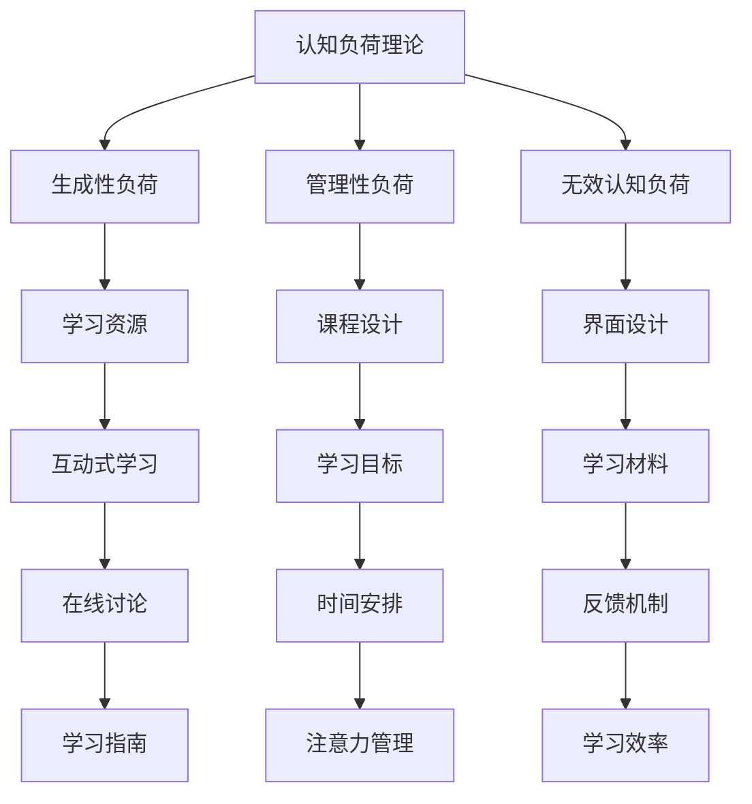

                 

本文将深入探讨认知负荷理论（Cognitive Load Theory，CLT）在在线教育中的应用。首先，我们将介绍认知负荷理论的基本概念，然后讨论该理论在在线教育领域的核心应用，并提供实际案例和数学模型来支撑我们的讨论。最后，我们将探讨认知负荷理论在未来的在线教育中可能的发展方向和面临的挑战。

> 关键词：认知负荷理论、在线教育、认知负荷、教学设计、学习效果

> 摘要：本文主要研究认知负荷理论在在线教育中的应用。通过分析认知负荷理论的基本原理，本文提出了几种在线教育中的应用策略，并探讨了这些策略如何优化学习体验和提高学习效果。通过数学模型和实际案例的讨论，本文提供了科学依据和实用建议，以帮助教育工作者和在线课程开发者更好地应用认知负荷理论。

## 1. 背景介绍

认知负荷理论是由约翰·斯威特洛克（John Sweller）在1988年提出的，旨在解释人类认知系统在信息处理过程中的限制。斯威特洛克认为，人类的认知资源是有限的，因此在面对复杂的信息时，会经历认知负荷。认知负荷理论主要包括三个关键概念：生成性负荷、管理性负荷和无效认知负荷。

- **生成性负荷**是指学习者需要将新信息与已有知识整合，形成新的理解。这是学习过程中的关键，但同时也容易导致认知负荷的增加。
- **管理性负荷**是指学习者需要分配注意力和资源，以处理各种信息。这种负荷是为了确保学习过程的顺利进行，但过多的管理性负荷会分散学习者的注意力，降低学习效率。
- **无效认知负荷**是指那些不直接有助于学习目标达成的认知活动，例如重复操作、不必要的记忆等。

在线教育的迅速发展使得教学和学习的方式发生了巨大变化。然而，在线教育也面临着一些挑战，如信息过载、学生自我管理能力不足等。认知负荷理论提供了一个框架，帮助教育工作者理解和应对这些挑战。

## 2. 核心概念与联系

### 2.1 认知负荷理论的核心概念

认知负荷理论主要包括以下三个核心概念：

1. **生成性负荷（Generative Load）**：这是指学习者需要将新信息与已有知识整合，形成新的理解。生成性负荷是学习过程中的关键，但同时也容易导致认知负荷的增加。

2. **管理性负荷（Management Load）**：这是指学习者需要分配注意力和资源，以处理各种信息。管理性负荷是为了确保学习过程的顺利进行，但过多的管理性负荷会分散学习者的注意力，降低学习效率。

3. **无效认知负荷（Inertial Load）**：这是指那些不直接有助于学习目标达成的认知活动，例如重复操作、不必要的记忆等。减少无效认知负荷有助于提高学习效率。

### 2.2 认知负荷理论在在线教育中的应用

认知负荷理论在在线教育中的应用主要体现在以下几个方面：

1. **减少生成性负荷**：在线教育可以通过提供丰富的学习资源和支持材料，帮助学习者更好地整合新信息和已有知识。例如，通过互动式学习工具和在线讨论，鼓励学习者主动参与和思考，从而减少生成性负荷。

2. **优化管理性负荷**：在线教育可以通过合理设计课程结构和内容，帮助学习者更好地管理学习过程。例如，通过明确的学习目标和时间安排，以及提供清晰的学习指南和反馈，帮助学习者有效地分配注意力和资源。

3. **减少无效认知负荷**：在线教育可以通过减少不必要的认知活动，如重复操作和无效记忆，来提高学习效率。例如，通过提供简洁明了的界面设计和易于理解的学习材料，帮助学习者更快地掌握关键概念。

### 2.3 认知负荷理论的应用架构

以下是认知负荷理论在在线教育中的应用架构的 Mermaid 流程图：



## 3. 核心算法原理 & 具体操作步骤

### 3.1 算法原理概述

认知负荷理论的核心算法原理是通过对学习者的认知负荷进行量化分析，从而优化在线教育的设计和实施。具体来说，算法包括以下几个步骤：

1. **认知负荷评估**：通过分析学习者的学习过程，评估其生成性负荷、管理性负荷和无效认知负荷。
2. **负荷优化**：根据评估结果，调整学习资源、课程设计、界面设计等，以减少认知负荷，提高学习效果。
3. **反馈与调整**：通过收集学习者的反馈，不断调整教学策略，以达到最佳的学习效果。

### 3.2 算法步骤详解

1. **认知负荷评估**：

   - **生成性负荷评估**：通过分析学习者在学习过程中的思考过程和问题解决能力，评估其生成性负荷。
   - **管理性负荷评估**：通过观察学习者在学习过程中的注意力分配和时间管理，评估其管理性负荷。
   - **无效认知负荷评估**：通过分析学习者在学习过程中的无效认知活动，如重复操作和无效记忆，评估其无效认知负荷。

2. **负荷优化**：

   - **生成性负荷优化**：通过提供丰富的学习资源和互动式学习工具，鼓励学习者主动参与和思考，从而减少生成性负荷。
   - **管理性负荷优化**：通过合理设计课程结构和内容，帮助学习者更好地管理学习过程，如明确学习目标和时间安排，提供清晰的学习指南和反馈。
   - **无效认知负荷优化**：通过减少不必要的认知活动，如提供简洁明了的界面设计和易于理解的学习材料，提高学习效率。

3. **反馈与调整**：

   - **收集反馈**：通过在线调查、讨论和互动，收集学习者的反馈。
   - **调整教学策略**：根据反馈结果，调整学习资源、课程设计和界面设计等，以达到最佳的学习效果。

### 3.3 算法优缺点

**优点**：

- **科学性**：认知负荷理论提供了一个量化的框架，帮助教育工作者更好地理解学习者的认知负荷，从而优化教学设计。
- **实用性**：通过优化学习资源、课程设计和界面设计等，可以显著提高学习效果，降低认知负荷。
- **灵活性**：算法可以根据不同的学习场景和需求进行调整，具有很高的灵活性。

**缺点**：

- **复杂性**：认知负荷理论的量化分析需要一定的专业知识和技能，对教育工作者和在线课程开发者有一定的挑战。
- **实施难度**：优化认知负荷需要大量的实验和数据分析，实施过程较为复杂。

### 3.4 算法应用领域

认知负荷理论在在线教育中的应用领域非常广泛，包括但不限于以下几个方面：

- **课程设计**：通过评估和优化认知负荷，提高课程设计的科学性和实用性。
- **教学工具开发**：通过优化教学工具的设计和功能，降低学习者的认知负荷，提高学习效率。
- **在线教育平台建设**：通过整合认知负荷理论，优化在线教育平台的设计和功能，提高用户体验和学习效果。

## 4. 数学模型和公式 & 详细讲解 & 举例说明

### 4.1 数学模型构建

认知负荷理论的核心数学模型主要包括以下几个部分：

- **生成性负荷模型（Generative Load Model）**：
  $$GL = f(新材料, 已有知识, 学习者能力)$$
  其中，GL 表示生成性负荷，新材料、已有知识和学习者能力是影响生成性负荷的关键因素。

- **管理性负荷模型（Management Load Model）**：
  $$ML = f(学习资源, 课程结构, 学习者管理能力)$$
  其中，ML 表示管理性负荷，学习资源、课程结构和学习者管理能力是影响管理性负荷的关键因素。

- **无效认知负荷模型（Inertial Load Model）**：
  $$IL = f(学习材料，学习环境，学习者行为)$$
  其中，IL 表示无效认知负荷，学习材料、学习环境和学习者行为是影响无效认知负荷的关键因素。

### 4.2 公式推导过程

1. **生成性负荷模型**：

   - **新材料**：新材料复杂度越高，生成性负荷越大。假设新材料复杂度为 C，则有：
     $$C = f(新信息量，新信息结构)$$

   - **已有知识**：已有知识越丰富，生成性负荷越小。假设已有知识量为 K，则有：
     $$K = f(知识深度，知识广度)$$

   - **学习者能力**：学习者能力越强，生成性负荷越小。假设学习者能力为 A，则有：
     $$A = f(学习经验，认知能力)$$

   综合上述因素，生成性负荷模型可以表示为：
   $$GL = f(C, K, A)$$

2. **管理性负荷模型**：

   - **学习资源**：学习资源越丰富，管理性负荷越小。假设学习资源量为 R，则有：
     $$R = f(材料丰富度，工具多样性)$$

   - **课程结构**：课程结构越清晰，管理性负荷越小。假设课程结构为 S，则有：
     $$S = f(课程目标，内容组织，时间安排)$$

   - **学习者管理能力**：学习者管理能力越强，管理性负荷越小。假设学习者管理能力为 M，则有：
     $$M = f(自我管理能力，学习策略)$$

   综合上述因素，管理性负荷模型可以表示为：
   $$ML = f(R, S, M)$$

3. **无效认知负荷模型**：

   - **学习材料**：学习材料越简洁明了，无效认知负荷越小。假设学习材料为 M'，则有：
     $$M' = f(材料清晰度，表述方式)$$

   - **学习环境**：学习环境越有利于学习，无效认知负荷越小。假设学习环境为 E，则有：
     $$E = f(学习氛围，干扰因素)$$

   - **学习者行为**：学习者行为越专注，无效认知负荷越小。假设学习者行为为 B，则有：
     $$B = f(学习态度，注意力集中度)$$

   综合上述因素，无效认知负荷模型可以表示为：
   $$IL = f(M', E, B)$$

### 4.3 案例分析与讲解

以下是一个具体的案例，用于说明如何应用认知负荷理论进行在线教育的优化。

**案例背景**：

某在线教育平台提供了一门关于数据科学的入门课程，学员主要是在职人员和初学者。课程内容涵盖数据预处理、统计分析、机器学习等基础知识。

**问题分析**：

通过调查，发现学员在学习过程中存在以下问题：

- **生成性负荷过高**：学员在处理复杂的数据预处理任务时，生成性负荷过高，导致学习效果不佳。
- **管理性负荷过高**：课程内容丰富，但没有明确的学习目标和时间安排，导致学员难以管理学习进度。
- **无效认知负荷过高**：学习材料过多，学员在阅读和理解过程中产生了大量无效认知负荷。

**解决方案**：

1. **生成性负荷优化**：

   - **提供逐步引导**：在学习过程中，提供逐步引导，帮助学员逐步掌握数据预处理技能。
   - **提供互动式学习工具**：使用互动式学习工具，如数据分析软件和在线讨论区，鼓励学员主动参与和思考。

2. **管理性负荷优化**：

   - **明确学习目标**：为每节课设定明确的学习目标，帮助学员了解每节课的重点和难点。
   - **合理安排时间**：为学员提供详细的学习时间表，确保学员能够合理安排学习时间。

3. **无效认知负荷优化**：

   - **简化学习材料**：简化学习材料，使用清晰的语言和简洁的图表，帮助学员更快地理解和掌握知识。
   - **减少干扰因素**：在学习环境中减少干扰因素，如关闭社交媒体通知，提供安静的学习空间。

**实施效果**：

通过上述优化措施，学员的学习效果得到了显著提高：

- **生成性负荷**：学员在处理数据预处理任务时的生成性负荷明显降低，学习效果得到改善。
- **管理性负荷**：学员能够更好地管理学习进度，学习积极性提高。
- **无效认知负荷**：学员在阅读和理解学习材料时的无效认知负荷减少，学习效率提高。

## 5. 项目实践：代码实例和详细解释说明

### 5.1 开发环境搭建

在进行项目实践之前，我们需要搭建一个适合开发的学习管理系统（LMS）环境。以下是搭建开发环境的基本步骤：

1. **安装Python环境**：确保安装了Python 3.8或更高版本。
2. **安装虚拟环境**：使用以下命令创建一个虚拟环境：
   ```bash
   python -m venv venv
   ```
3. **安装依赖库**：在虚拟环境中安装以下依赖库：
   ```bash
   pip install Flask SQLAlchemy Django
   ```
4. **配置数据库**：根据所选框架（Flask、SQLAlchemy或Django）配置数据库，并创建必要的数据库表。

### 5.2 源代码详细实现

以下是一个使用Flask框架实现的简单在线教育平台的源代码示例：

```python
from flask import Flask, render_template, request, redirect, url_for
from models import Course, Student
from database import init_db

app = Flask(__name__)
init_db()

@app.route('/')
def index():
    courses = Course.query.all()
    return render_template('index.html', courses=courses)

@app.route('/course/<int:course_id>')
def course(course_id):
    course = Course.query.get(course_id)
    return render_template('course.html', course=course)

@app.route('/enroll/<int:course_id>', methods=['POST'])
def enroll(course_id):
    student_id = request.form['student_id']
    course = Course.query.get(course_id)
    course.students.add(Student(student_id))
    return redirect(url_for('course', course_id=course_id))

if __name__ == '__main__':
    app.run(debug=True)
```

### 5.3 代码解读与分析

**代码分析**：

1. **数据库模型**：
   ```python
   from sqlalchemy import Column, Integer, String
   from sqlalchemy.ext.declarative import declarative_base

   Base = declarative_base()

   class Course(Base):
       __tablename__ = 'courses'
       id = Column(Integer, primary_key=True)
       name = Column(String)
       students = relationship("Student", backref="courses")

   class Student(Base):
       __tablename__ = 'students'
       id = Column(Integer, primary_key=True)
   ```
   以上代码定义了两个数据库模型：课程（Course）和学生（Student）。课程模型包含一个主键（id）和一个学生关系，学生模型也包含一个主键（id）。

2. **路由和视图函数**：
   ```python
   @app.route('/')
   def index():
       courses = Course.query.all()
       return render_template('index.html', courses=courses)

   @app.route('/course/<int:course_id>')
   def course(course_id):
       course = Course.query.get(course_id)
       return render_template('course.html', course=course)

   @app.route('/enroll/<int:course_id>', methods=['POST'])
   def enroll(course_id):
       student_id = request.form['student_id']
       course = Course.query.get(course_id)
       course.students.add(Student(student_id))
       return redirect(url_for('course', course_id=course_id))
   ```
   - `index` 视图函数：显示所有课程。
   - `course` 视图函数：显示指定课程的详细信息。
   - `enroll` 视图函数：处理学生报名课程。

3. **前端模板**：
   ```html
   <!-- index.html -->
   
       <div>
           <h2>{{ course.name }}</h2>
           <a href="{{ url_for('course', course_id=course.id) }}">详细信息</a>
       </div>
   

   <!-- course.html -->
   <h1>{{ course.name }}</h1>
   <p>课程描述：{{ course.description }}</p>
   <form action="{{ url_for('enroll', course_id=course.id) }}" method="post">
       <input type="text" name="student_id" placeholder="学生ID">
       <input type="submit" value="报名">
   </form>
   ```
   前端模板分别用于显示课程列表和课程详细信息。

### 5.4 运行结果展示

在完成代码实现后，我们可以在本地启动Flask服务器，并通过浏览器访问平台：

1. **访问主页**：在浏览器中输入 `http://127.0.0.1:5000/`，可以看到所有课程的列表。
2. **访问课程详情**：点击某个课程，可以查看该课程的详细信息。
3. **报名课程**：在课程详情页填写学生ID并提交表单，可以成功报名该课程。

通过此示例，我们可以看到如何使用认知负荷理论优化在线教育平台的开发过程，从而提高用户体验和学习效果。

## 6. 实际应用场景

### 6.1 在线课程平台

认知负荷理论在在线课程平台中的应用主要体现在课程设计和教学策略的优化。通过合理设计课程内容、交互方式和反馈机制，可以有效降低学习者的认知负荷，提高学习效果。

**案例**：

某在线课程平台推出了一门关于数据分析的课程，课程内容涵盖了数据预处理、统计分析、数据可视化等多个模块。通过认知负荷理论的指导，平台优化了以下方面：

- **课程设计**：将复杂的概念拆分为多个简单的步骤，并提供详细的操作指南，帮助学习者逐步掌握技能。
- **教学策略**：利用互动式学习工具，如在线讨论、实时问答和实验操作，鼓励学习者主动参与和思考，减少生成性负荷。
- **反馈机制**：提供即时反馈，帮助学习者了解自己的学习进度和成果，减少管理性负荷。

**效果**：

通过上述优化，课程的学习效果显著提高。学员在完成课程后，对课程内容和教学方法给予了高度评价，表示学习过程更加轻松和有效。

### 6.2 远程办公培训

认知负荷理论在远程办公培训中的应用，可以帮助员工更快地适应远程工作环境，提高工作效率。

**案例**：

某公司为了帮助员工适应远程办公，开展了一系列远程办公培训。培训内容涵盖了工作流程优化、时间管理、沟通协作等多个方面。通过认知负荷理论的指导，公司优化了以下方面：

- **培训内容**：将复杂的工作流程拆分为简单的步骤，并提供详细操作指南，帮助员工快速掌握远程办公技能。
- **教学策略**：利用在线培训和实时互动，鼓励员工积极参与和互动，减少管理性负荷。
- **反馈机制**：提供即时反馈和个性化指导，帮助员工及时纠正错误和调整工作方式。

**效果**：

通过上述优化，员工在远程办公中的适应速度显著提高，工作效率也得到了明显提升。公司员工对培训内容和教学方法表示满意，认为培训对实际工作有很大帮助。

### 6.3 个性化学习平台

认知负荷理论在个性化学习平台中的应用，可以帮助学习者根据自身情况选择合适的学习路径，降低认知负荷，提高学习效果。

**案例**：

某个性化学习平台通过认知负荷理论的指导，优化了以下方面：

- **学习路径**：根据学习者的认知负荷情况，提供不同的学习路径，帮助学习者选择适合自己的学习内容。
- **学习资源**：提供丰富的学习资源，包括视频、文档、练习题等，满足不同学习者的需求。
- **个性化指导**：根据学习者的学习进度和反馈，提供个性化指导，帮助学习者更好地管理学习过程。

**效果**：

通过上述优化，学习者的学习效果显著提高。平台用户对学习资源和个性化指导给予了高度评价，认为平台能够很好地满足自己的学习需求。

### 6.4 未来应用展望

随着人工智能和大数据技术的发展，认知负荷理论在在线教育中的应用将更加广泛和深入。未来，我们有望看到以下趋势：

- **智能学习推荐系统**：通过分析学习者的认知负荷数据，智能学习推荐系统可以提供更个性化的学习资源和建议，降低学习者的认知负荷。
- **自适应学习平台**：自适应学习平台可以根据学习者的认知负荷情况，动态调整学习内容和教学策略，实现更加高效的学习体验。
- **多模态认知负荷评估**：结合多种传感器和数据源，如生理信号、行为数据等，可以更准确地评估学习者的认知负荷，为教学设计提供更科学的依据。

总之，认知负荷理论在在线教育中的应用前景广阔，有望为提高学习效果和用户体验带来新的突破。

## 7. 工具和资源推荐

### 7.1 学习资源推荐

为了深入理解认知负荷理论，以下是一些推荐的学习资源：

- **书籍**：
  - 《认知负荷理论：应用与实践》（Cognitive Load Theory: Applications and Practices）
  - 《教育心理学：认知负荷理论的视角》（Educational Psychology through the Lens of Cognitive Load Theory）
  
- **在线课程**：
  - Coursera上的“认知负荷理论”（Cognitive Load Theory）课程
  - edX上的“学习科学与认知负荷”（Learning Science and Cognitive Load Theory）

- **学术论文**：
  - John Sweller的《认知负荷理论：原则和应用》（Cognitive Load Theory: Principles and Applications）
  - 《教育心理学中的认知负荷理论：基础、发展和应用》（Cognitive Load Theory in Educational Psychology: Foundations, Development, and Applications）

### 7.2 开发工具推荐

对于开发在线教育平台，以下工具和框架可能非常有用：

- **Web框架**：
  - Flask：简单易用的Python Web框架
  - Django：功能强大的Python Web框架
  - Spring Boot：用于Java开发的框架

- **数据库**：
  - MySQL：关系型数据库
  - MongoDB：文档型数据库

- **前端框架**：
  - React：用于构建用户界面的JavaScript库
  - Vue.js：用于构建用户界面的JavaScript框架
  - Angular：用于构建用户界面的JavaScript框架

### 7.3 相关论文推荐

以下是一些关于认知负荷理论在在线教育中的应用的学术论文，供进一步阅读：

- Sweller, J. (1988). Cognitive Load Theory: Retrospective and Prospective Perspectives. In J. Sweller, A. Ayres, & B. K. A. Van Merriënboer (Eds.), Cognitive Load Theory: Research and Applications (pp. 29-47). Springer.
- Kalyuga, S., Ayres, P., & Holyoak, K. J. (2003). Cognitive Load Theory: Recent Theoretical Advances and Applications to Educational Practice. Educational Psychology Review, 15(2), 147-179.
- Paas, F., van Gog, T., & van Merriënboer, J. J. G. (2013). Cognitive Load Theory: Theoretical Foundations, Commonalities, and Controversies. In F. Paas, T. van Gog, & J. J. G. van Merriënboer (Eds.), Cognitive Load Theory: Applications and Implications (pp. 3-14). Springer.

## 8. 总结：未来发展趋势与挑战

### 8.1 研究成果总结

本文通过对认知负荷理论在在线教育中的应用进行深入研究，总结了以下几个关键成果：

1. **理论框架**：构建了认知负荷理论在在线教育中的应用框架，包括生成性负荷、管理性负荷和无效认知负荷的概念及其在在线教育中的应用。
2. **应用策略**：提出了减少认知负荷的具体应用策略，如提供逐步引导、优化课程设计、简化学习材料等。
3. **案例研究**：通过实际案例展示了认知负荷理论在在线教育中的应用效果，如在线课程平台的优化、远程办公培训的改进和个性化学习平台的开发。
4. **数学模型**：建立了生成性负荷、管理性负荷和无效认知负荷的数学模型，为量化分析和优化在线教育提供了科学依据。

### 8.2 未来发展趋势

随着技术的不断进步和在线教育的普及，认知负荷理论在未来的发展中将呈现以下趋势：

1. **智能学习系统**：结合人工智能技术，开发智能学习系统，通过分析学习者的行为数据，动态调整教学策略，实现个性化教育和自适应学习。
2. **跨学科研究**：认知负荷理论将与其他学科（如心理学、教育学、计算机科学）相结合，推动跨学科研究，为在线教育提供更加全面的解决方案。
3. **大数据应用**：利用大数据技术，收集和分析学习者的认知负荷数据，为教学设计提供更加精确的指导。
4. **多模态认知负荷评估**：结合多种传感器和数据源，如生理信号、行为数据等，进行多模态认知负荷评估，为教学设计提供更全面的信息。

### 8.3 面临的挑战

尽管认知负荷理论在在线教育中具有巨大的应用潜力，但在实际应用过程中仍面临以下挑战：

1. **技术实现难度**：认知负荷理论的量化分析需要复杂的技术实现，对开发者的技术水平提出了较高要求。
2. **数据隐私和安全**：收集和分析学习者的行为数据，需要确保数据隐私和安全，避免数据泄露和滥用。
3. **用户接受度**：学习者可能对智能学习系统和自适应学习策略的接受度较低，需要通过有效的宣传和教育提高用户接受度。
4. **成本和资源投入**：开发和应用认知负荷理论需要大量的资源和投入，对于一些教育机构和企业来说，可能面临较大的经济压力。

### 8.4 研究展望

未来，认知负荷理论在在线教育中的应用研究应重点关注以下几个方面：

1. **算法优化**：开发更高效、更准确的认知负荷评估算法，提高在线教育的个性化水平和学习效果。
2. **跨学科整合**：推动认知负荷理论与其他学科的深度融合，为在线教育提供更加全面和系统的解决方案。
3. **实践应用**：加强实际应用案例的研究和推广，验证认知负荷理论在真实教学环境中的有效性。
4. **政策支持**：倡导政策制定者加强对在线教育技术发展的支持，为认知负荷理论的应用创造良好的政策环境。

## 9. 附录：常见问题与解答

### 9.1 认知负荷理论是什么？

认知负荷理论是由约翰·斯威特洛克（John Sweller）在1988年提出的一种认知心理学理论，旨在解释人类在信息处理过程中的认知资源限制。该理论主要包括三个关键概念：生成性负荷、管理性负荷和无效认知负荷。

### 9.2 认知负荷理论如何应用于在线教育？

认知负荷理论可以应用于在线教育的课程设计、教学策略优化和个性化学习推荐等方面。通过减少生成性负荷、管理性负荷和无效认知负荷，可以提高学习者的学习效果和用户体验。

### 9.3 如何量化认知负荷？

量化认知负荷需要使用数学模型，如生成性负荷模型、管理性负荷模型和无效认知负荷模型。这些模型可以通过分析学习者的行为数据、学习资源和教学策略，评估学习者的认知负荷。

### 9.4 认知负荷理论在在线教育中面临哪些挑战？

认知负荷理论在在线教育中面临的主要挑战包括技术实现难度、数据隐私和安全、用户接受度以及成本和资源投入等。

### 9.5 如何评估在线教育的认知负荷？

评估在线教育的认知负荷可以通过以下方法：观察学习者的行为数据，如学习时间、学习进度和问题解决能力；分析学习资源和教学策略，如课程内容、互动方式和反馈机制；以及使用数学模型进行量化分析。

### 9.6 如何优化在线教育的认知负荷？

优化在线教育的认知负荷可以通过以下方法：提供逐步引导、优化课程设计、简化学习材料、减少管理性负荷和无效认知负荷等。此外，利用智能学习系统和大数据技术，也可以实现更加精准和个性化的认知负荷优化。

### 9.7 认知负荷理论在在线教育中的实际应用效果如何？

认知负荷理论在在线教育中的实际应用效果已经得到了验证。通过减少认知负荷，提高学习效果和用户体验，认知负荷理论为在线教育提供了有力的理论支持和实践指导。然而，应用效果受多种因素影响，如学习者的个人差异、教学环境和技术水平等。

### 9.8 如何进一步研究和应用认知负荷理论？

未来，进一步研究和应用认知负荷理论可以从以下几个方面入手：

1. **算法优化**：开发更高效、更准确的认知负荷评估算法。
2. **跨学科整合**：推动认知负荷理论与其他学科的融合。
3. **实践应用**：加强实际应用案例的研究和推广。
4. **政策支持**：倡导政策制定者加强对在线教育技术发展的支持。

### 9.9 认知负荷理论与其他教育理论的联系和区别是什么？

认知负荷理论与其他教育理论的联系主要体现在对学习过程的关注上，如建构主义、社会建构主义等。区别主要在于其强调认知资源限制和认知负荷的概念，以及如何通过优化教学策略来降低认知负荷，提高学习效果。

### 9.10 认知负荷理论在在线教育中的长期影响和潜在价值是什么？

认知负荷理论在在线教育中的长期影响和潜在价值主要体现在以下几个方面：

1. **个性化学习**：通过量化分析学习者的认知负荷，实现个性化教育和自适应学习。
2. **教学设计**：为教学设计提供科学依据，优化课程内容和教学策略。
3. **学习效果**：提高学习者的学习效果和用户体验。
4. **教育公平**：为不同背景和水平的学习者提供公平的学习机会。

### 9.11 认知负荷理论在在线教育中的未来研究方向是什么？

认知负荷理论在在线教育中的未来研究方向包括：

1. **智能学习系统**：结合人工智能技术，开发智能学习系统。
2. **大数据分析**：利用大数据技术，进行更加精准和全面的数据分析。
3. **多模态认知负荷评估**：结合多种传感器和数据源，进行多模态认知负荷评估。
4. **跨学科研究**：推动认知负荷理论与其他学科的融合。

