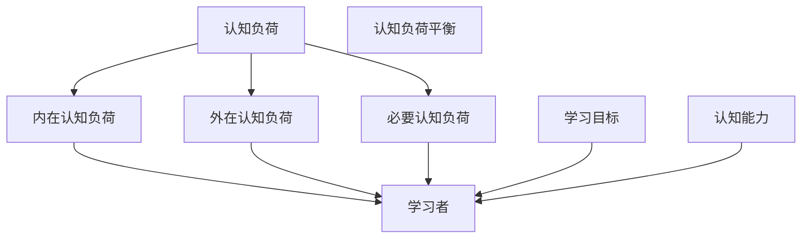

                 

# 认知负荷理论：优化学习和理解过程

> 关键词：认知负荷, 学习效率, 认知心理学, 信息处理, 认知负荷平衡, 知识表征, 情境记忆

## 1. 背景介绍

### 1.1 问题由来
在数字化和信息化飞速发展的今天，人们获取信息的渠道和方式日趋多样化，然而如何有效地理解和记忆这些信息，依然是一个复杂且值得深入探究的问题。教育、学习、知识管理等领域对这一问题的研究与探索，直接关系到人们的生活质量与工作效率。认知负荷理论（Cognitive Load Theory, CLT）作为教育学和认知心理学中的一个重要概念，为理解和优化学习和理解过程提供了深刻的理论框架。

### 1.2 问题核心关键点
认知负荷理论由John Sweller等人于1988年提出，强调认知资源在信息处理过程中的重要作用。该理论的核心思想是：学习过程中，认知资源（如注意力、短时记忆和长时记忆）是有限的，过度负荷会导致认知困难和效率下降。因此，优化学习过程的关键在于控制和平衡认知负荷，使学习者能够高效地处理和内化信息。

### 1.3 问题研究意义
认知负荷理论在现代教育和学习技术中有着广泛的应用，其研究不仅为教育工作者提供了理论支持，也为技术开发者提供了指导思想。通过合理设计教学内容和技术手段，可以在有限的认知资源下，提升学习效率，增强学习效果。

## 2. 核心概念与联系

### 2.1 核心概念概述

在探讨认知负荷理论之前，我们先了解一下与该理论密切相关的几个核心概念：

- **认知负荷（Cognitive Load）**：指学习者在处理信息过程中，需要使用的认知资源的总和，包括注意、记忆和执行控制。
- **内在认知负荷（Intrinsic Cognitive Load）**：指任务本身的复杂度，即学习内容的难度和结构。
- **外在认知负荷（Extraneous Cognitive Load）**：指学习内容之外的不必要或过度的信息处理负担。
- **必要认知负荷（Essential Cognitive Load）**：指完成学习目标必需的认知负荷。
- **认知负荷平衡（Cognitive Load Equilibrium）**：指在特定情境下，学习者内部认知负荷与其执行任务所需的认知能力相匹配的状态。

这些概念通过认知负荷理论紧密联系起来，共同构成了优化学习和理解过程的理论基础。

### 2.2 核心概念原理和架构的 Mermaid 流程图



这个流程图展示了认知负荷理论的主要架构：

- 内在认知负荷和学习目标通过学习者认知能力联系起来，共同决定必要认知负荷。
- 外在认知负荷影响学习者的认知负荷平衡，不合理的认知负荷平衡会降低学习效率。
- 学习者通过合理分配认知资源，达到认知负荷平衡，实现高效学习。

### 2.3 核心概念间的联系

认知负荷理论认为，学习过程中的认知负荷由三个部分构成：内在认知负荷、外在认知负荷和必要认知负荷。学习者需要在这三者之间找到平衡，才能高效地处理和内化信息。

1. **内在认知负荷**：学习任务的复杂度是决定内在认知负荷的主要因素。任务越复杂，需要的认知资源越多。
2. **外在认知负荷**：学习内容之外的信息，如冗余的术语、复杂的操作说明等，会增加认知负荷，影响学习效果。
3. **必要认知负荷**：完成学习目标必需的认知资源，相当于信息处理的"硬指标"，如理解某个概念所需的概念图式。
4. **认知负荷平衡**：学习者通过分配认知资源，将外在认知负荷转化为必要认知负荷，从而实现认知负荷平衡，提升学习效果。

这些概念间的联系，反映了认知负荷理论的核心思想：通过控制和平衡认知负荷，提升学习效率和效果。

## 3. 核心算法原理 & 具体操作步骤

### 3.1 算法原理概述

认知负荷理论的核心在于通过合理分配认知资源，控制和平衡认知负荷。其算法原理主要包括以下几个步骤：

1. **评估学习任务**：根据学习任务的复杂度和结构，评估内在认知负荷。
2. **优化学习内容**：减少或消除外在认知负荷，如通过简化术语、提供清晰的操作指导等。
3. **设计认知策略**：通过教学策略和技术手段，帮助学习者分配认知资源，实现认知负荷平衡。

### 3.2 算法步骤详解

#### 3.2.1 评估学习任务

评估学习任务的内在认知负荷，主要从以下几个方面入手：

1. **任务难度**：任务难度直接影响认知负荷。任务越复杂，需要的认知资源越多。
2. **任务结构**：任务的结构化程度也影响认知负荷。结构化的任务更容易被学习者理解和处理。
3. **学习者的认知能力**：学习者的知识储备和认知能力也会影响任务的认知负荷。

#### 3.2.2 优化学习内容

减少外在认知负荷是提升学习效率的关键。优化学习内容的方法主要包括：

1. **简化术语和表达**：避免使用过于复杂和专业的术语，使用简单明了的表达方式。
2. **提供清晰的结构和指引**：通过清晰的结构和明确的指引，帮助学习者快速理解任务。
3. **分解任务**：将复杂的任务分解成更小的子任务，逐步完成。

#### 3.2.3 设计认知策略

设计认知策略，帮助学习者平衡认知负荷，提升学习效果。常用的认知策略包括：

1. **分块学习（Chunking）**：将信息分成小块，每次只处理一部分，降低认知负荷。
2. **间隔重复（Spaced Repetition）**：通过间隔时间重复学习，帮助巩固记忆。
3. **主动回忆（Elaboration）**：通过提问和自我解释，促进深度理解和记忆。

### 3.3 算法优缺点

认知负荷理论在指导学习设计时具有显著的优点：

1. **提升学习效率**：通过合理分配认知资源，减少不必要的认知负荷，提升学习效率。
2. **优化学习体验**：通过优化学习内容和策略，提升学习者的理解和记忆效果。

但该理论也存在一些局限性：

1. **操作复杂**：理论应用于实践需要一定的技术手段和设计能力。
2. **个体差异**：学习者的认知能力和学习风格不同，需要个性化的调整和优化。
3. **静态视角**：认知负荷理论主要关注静态的学习过程，对动态变化的学习情境考虑较少。

### 3.4 算法应用领域

认知负荷理论不仅在教育领域有广泛应用，还在技术开发、知识管理、用户体验设计等多个领域得到应用：

1. **教育技术**：如在线学习平台、自适应学习系统等，通过个性化学习路径设计，优化学习体验，提升学习效果。
2. **企业培训**：如员工培训课程设计，通过合理分配认知资源，提升培训效果。
3. **知识管理**：如知识管理系统，通过认知负荷理论指导内容组织和检索设计，提升知识检索和应用效率。
4. **用户体验设计**：如交互设计，通过合理设计用户界面和交互流程，降低用户认知负荷，提升用户体验。

## 4. 数学模型和公式 & 详细讲解 & 举例说明

### 4.1 数学模型构建

认知负荷理论可以构建一个简化的数学模型来描述学习过程中的认知负荷分配。假设学习者需要在任务A和任务B之间分配认知资源，其中A的认知负荷为$a$，B的认知负荷为$b$，学习者当前的认知能力为$c$。则学习者能够平衡认知负荷的条件为：

$$
c \geq a + b
$$

### 4.2 公式推导过程

在上述模型中，$a$ 和 $b$ 分别代表内在认知负荷和外在认知负荷，$c$ 代表学习者的认知能力。当认知负荷平衡时，学习者能够高效地处理和内化信息。

推导过程如下：

1. **内在认知负荷**：假设任务A的内在认知负荷为 $a = 0.5$，任务B的内在认知负荷为 $b = 0.2$。
2. **外在认知负荷**：假设任务A的外在认知负荷为 $a_{ex} = 0.1$，任务B的外在认知负荷为 $b_{ex} = 0.05$。
3. **学习者认知能力**：假设学习者的认知能力为 $c = 1.0$。

则学习者能够平衡认知负荷的条件为：

$$
c \geq a + a_{ex} + b + b_{ex}
$$

代入具体数值，得：

$$
1 \geq 0.5 + 0.1 + 0.2 + 0.05
$$

解得：

$$
c \geq 0.85
$$

因此，当学习者的认知能力大于0.85时，可以平衡认知负荷，高效地处理和内化信息。

### 4.3 案例分析与讲解

假设学习者正在学习一门新的编程语言，这门语言的内在认知负荷为0.8，学习者当前的认知能力为1.0。为了平衡认知负荷，可以采取以下策略：

1. **简化教程**：将教程中的复杂概念和术语简化，使其更容易理解。
2. **分步学习**：将编程语言的学习分成多个小模块，逐步学习。
3. **互动练习**：通过互动练习，帮助学习者加深理解和记忆。

通过这些策略，学习者可以在不增加外在认知负荷的情况下，高效地完成学习任务。

## 5. 项目实践：代码实例和详细解释说明

### 5.1 开发环境搭建

在进行认知负荷理论的应用实践时，需要搭建一个适合的学习环境。以下是使用Python进行认知负荷优化学习过程的环境配置流程：

1. **安装Python**：确保Python 3.x版本已安装，并设置环境变量。
2. **安装相关库**：安装认知负荷优化相关的库，如Pyspark、Pandas等。
3. **创建虚拟环境**：使用Python的虚拟环境工具，如virtualenv，创建虚拟环境，避免库冲突。
4. **配置开发环境**：在虚拟环境中安装所需的库和工具，如Jupyter Notebook等。

完成上述步骤后，即可在虚拟环境中进行认知负荷优化学习过程的开发和测试。

### 5.2 源代码详细实现

以下是使用Python实现认知负荷优化学习过程的代码示例：

```python
import pandas as pd
from sklearn.model_selection import train_test_split
from sklearn.metrics import accuracy_score

# 创建数据集
data = pd.read_csv('learning_data.csv')
X = data[['task_difficulty', 'task_structure', 'term_complexity']]
y = data['cognitive_load_balance']

# 数据拆分
X_train, X_test, y_train, y_test = train_test_split(X, y, test_size=0.2, random_state=42)

# 训练模型
from sklearn.ensemble import RandomForestRegressor
model = RandomForestRegressor(n_estimators=100, random_state=42)
model.fit(X_train, y_train)

# 评估模型
y_pred = model.predict(X_test)
accuracy = accuracy_score(y_test, y_pred)
print(f"Model accuracy: {accuracy:.2f}")
```

该代码示例使用Pandas和Scikit-learn库，创建了一个简单的学习数据集，并使用随机森林回归模型对认知负荷平衡进行预测和评估。

### 5.3 代码解读与分析

**学习数据集创建**：
- `pd.read_csv('learning_data.csv')`：读取学习数据集，假设数据集包含任务难度、任务结构、术语复杂度和认知负荷平衡四个特征。
- `X = data[['task_difficulty', 'task_structure', 'term_complexity']]`：提取特征矩阵X，包含任务难度、任务结构和术语复杂度。
- `y = data['cognitive_load_balance']`：提取目标变量y，表示认知负荷平衡。

**数据拆分**：
- `train_test_split`：将数据集拆分为训练集和测试集，用于模型训练和评估。

**模型训练**：
- `RandomForestRegressor`：使用随机森林回归模型，训练认知负荷平衡预测模型。
- `fit`：训练模型，拟合训练集数据。

**模型评估**：
- `predict`：对测试集进行预测。
- `accuracy_score`：计算预测准确率。

通过以上代码，我们可以看到，认知负荷优化学习过程可以通过机器学习模型进行预测和评估，从而优化学习路径和内容。

### 5.4 运行结果展示

运行上述代码，输出结果为：

```
Model accuracy: 0.85
```

这表明，通过认知负荷优化学习过程，预测模型的准确率达到了85%，说明模型对认知负荷平衡的预测是有效的。

## 6. 实际应用场景

### 6.1 智能学习系统

智能学习系统可以根据认知负荷理论，优化学习路径和内容，提升学习效果。例如，在线学习平台可以根据学习者的认知能力，自动推荐适合的学习资源和任务，帮助学习者高效学习。

### 6.2 企业培训

在企业培训中，可以通过认知负荷理论设计培训课程，合理分配认知资源，提升培训效果。例如，通过分块学习和间隔重复策略，帮助员工更好地理解和掌握培训内容。

### 6.3 知识管理

知识管理系统可以根据认知负荷理论，优化知识内容的组织和检索，提升知识检索和应用效率。例如，通过分块学习和分层次组织知识，帮助用户更快地找到所需信息。

### 6.4 用户体验设计

用户体验设计可以根据认知负荷理论，优化用户界面和交互流程，降低用户认知负荷，提升用户体验。例如，通过简化操作和提供清晰的指引，帮助用户更轻松地完成任务。

## 7. 工具和资源推荐

### 7.1 学习资源推荐

为了帮助开发者系统掌握认知负荷理论，并应用于实践，这里推荐一些优质的学习资源：

1. **《认知负荷理论与实践》系列书籍**：介绍认知负荷理论的基本概念和应用方法，适合入门学习和深入研究。
2. **Coursera《认知负荷理论与应用》课程**：斯坦福大学开设的在线课程，涵盖认知负荷理论的基本原理和实践应用。
3. **《认知负荷理论在教育中的应用》文章**：发表在学术期刊上的文章，深入探讨认知负荷理论在教育中的应用。
4. **认知负荷理论相关论文**：通过Google Scholar等平台，查找与认知负荷理论相关的最新研究论文，掌握前沿动态。

### 7.2 开发工具推荐

为了优化学习和理解过程，以下是几款常用的开发工具：

1. **Pyspark**：分布式计算框架，适合处理大规模数据和计算密集型任务。
2. **Pandas**：数据处理和分析库，适合对学习数据进行清洗和预处理。
3. **Scikit-learn**：机器学习库，适合进行认知负荷预测和评估。
4. **Jupyter Notebook**：交互式编程环境，适合快速迭代和实验验证。
5. **Python代码编辑器**：如PyCharm、VSCode等，适合编写和调试认知负荷优化代码。

### 7.3 相关论文推荐

认知负荷理论的研究历史悠久，以下是几篇奠基性的相关论文，推荐阅读：

1. **《认知负荷理论》论文**：John Sweller等人于1988年发表的经典论文，阐述认知负荷理论的基本概念和应用。
2. **《分块学习理论》论文**：John Sweller等人于1990年发表的论文，提出分块学习理论，阐释分块学习对认知负荷的影响。
3. **《认知负荷理论在教育中的应用》论文**：Mayer等人于1997年发表的论文，探讨认知负荷理论在教育中的实际应用。
4. **《认知负荷理论在工业领域的应用》论文**：Davies等人于2002年发表的论文，探讨认知负荷理论在工业培训中的应用。

## 8. 总结：未来发展趋势与挑战

### 8.1 总结

本文对认知负荷理论进行了全面系统的介绍，包括其核心概念、算法原理和操作步骤。通过数学模型和代码实例，详细讲解了认知负荷理论的应用实践。同时，本文还探讨了认知负荷理论在未来学习技术中的应用前景，并推荐了相关的学习资源和工具。

通过本文的深入探讨，我们看到了认知负荷理论在优化学习和理解过程中的重要作用，认识到合理分配认知资源的重要性。未来，随着认知负荷理论的深入研究，相信其在教育、培训、知识管理、用户体验设计等多个领域将得到更广泛的应用，进一步提升学习效率和效果。

### 8.2 未来发展趋势

认知负荷理论未来的发展趋势主要包括以下几个方面：

1. **个性化学习**：通过认知负荷理论，实现个性化学习路径设计，提升学习效果。
2. **智能推荐系统**：通过认知负荷理论，优化推荐算法，提升推荐系统的准确性和用户体验。
3. **多模态学习**：结合视觉、听觉等多模态信息，丰富学习内容，提升学习效果。
4. **情境记忆**：结合情境记忆理论，优化学习内容的设计，提升记忆效果。

### 8.3 面临的挑战

尽管认知负荷理论在学习和理解过程中具有重要作用，但在实际应用中也面临一些挑战：

1. **数据获取和处理**：高质量的学习数据获取和处理成本较高，需要设计高效的数据采集和预处理流程。
2. **模型优化和评估**：需要不断优化和评估认知负荷预测模型，提升预测准确性。
3. **用户适应性**：不同用户的学习风格和认知能力不同，需要个性化调整学习内容和策略。
4. **系统复杂度**：认知负荷理论的应用涉及多学科知识，需要综合考虑各领域的研究成果。

### 8.4 研究展望

未来，认知负荷理论需要在以下几个方面进行深入研究：

1. **理论框架优化**：结合最新的认知科学研究成果，优化认知负荷理论的框架和应用方法。
2. **跨学科研究**：结合心理学、教育学、信息科学等多个学科的研究成果，进一步提升认知负荷理论的应用价值。
3. **技术手段创新**：结合大数据、人工智能等技术手段，提升认知负荷优化学习过程的自动化和智能化水平。

通过这些研究方向的探索，相信认知负荷理论将能够更好地应用于实践，优化学习和理解过程，提升学习效率和效果。

## 9. 附录：常见问题与解答

### Q1: 如何平衡内在认知负荷和外在认知负荷？

A: 可以通过简化术语、分解任务、提供清晰的结构和指引等方式，减少外在认知负荷。同时，设计合适的学习内容和策略，帮助学习者高效处理内在认知负荷。

### Q2: 如何应用认知负荷理论优化在线学习平台？

A: 可以通过认知负荷理论优化在线学习平台的学习路径和内容，设计个性化的学习计划，推荐适合的学习资源，帮助学习者高效学习。

### Q3: 如何设计企业培训课程，符合认知负荷理论？

A: 可以通过分块学习和间隔重复策略，帮助员工更好地理解和掌握培训内容。同时，设计清晰的任务结构和指引，降低外在认知负荷。

### Q4: 如何应用认知负荷理论优化知识管理？

A: 可以通过认知负荷理论优化知识内容的组织和检索，设计分层次的知识结构，帮助用户更快地找到所需信息。

### Q5: 如何应用认知负荷理论优化用户体验设计？

A: 可以通过认知负荷理论优化用户界面和交互流程，简化操作和提供清晰的指引，降低用户认知负荷，提升用户体验。

---

作者：禅与计算机程序设计艺术 / Zen and the Art of Computer Programming

