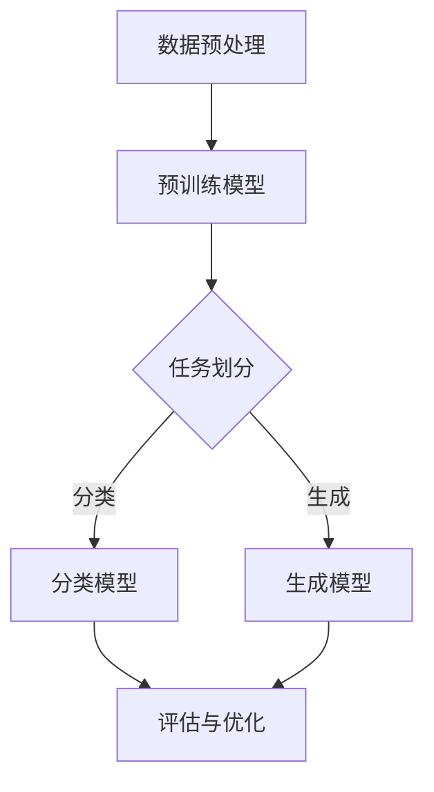

 # 认知革命：LLM如何改变信息处理方式                

> 认知革命、LLM、信息处理、人工智能、神经网络、深度学习、自然语言处理、编程范式、智能应用、技术创新

## 1. 背景介绍

在过去的几十年中，人工智能（AI）领域经历了翻天覆地的变革。从早期的规则系统到基于统计方法的机器学习，再到深度学习的崛起，每一次技术的进步都在改变我们对信息处理的理解和应用。然而，真正引发认知革命的是大型语言模型（LLM），它不仅改变了自然语言处理的范式，更对整个计算机科学领域产生了深远的影响。

LLM的发展始于20世纪90年代的统计语言模型，但真正迎来爆炸性增长是在2018年，谷歌推出了Transformer架构的BERT模型。BERT的出现标志着自然语言处理（NLP）从传统的基于规则和统计方法转向深度学习，尤其是基于神经网络的模型。自此，LLM的发展速度惊人，不仅在NLP领域取得了前所未有的成果，还在问答系统、机器翻译、文本生成等多个领域取得了显著突破。

LLM的核心在于其庞大的预训练模型和自适应能力。通过在大规模语料库上进行预训练，LLM能够理解并生成自然语言，从而实现与人类更接近的交流方式。这种能力的实现不仅依赖于神经网络的高效计算，还依赖于深度学习的强大表示能力。随着计算能力的提升和数据量的爆炸性增长，LLM的应用场景也在不断扩展。

本文将深入探讨LLM的核心概念、工作原理、数学模型以及实际应用，旨在为读者提供一幅完整的LLM认知革命图景。

## 2. 核心概念与联系

### 2.1. 语言模型简介

语言模型（Language Model，LM）是自然语言处理（NLP）领域的基础，它用于预测一个句子中下一个单词的概率。在传统方法中，语言模型通常基于N元语法（N-gram），这是一种使用历史N个单词来预测下一个单词的方法。然而，这种方法存在明显的局限性，比如无法捕捉长距离依赖和上下文信息。

### 2.2. 神经网络与深度学习

神经网络（Neural Networks，NN）是模拟人脑神经元连接方式的信息处理系统，而深度学习（Deep Learning，DL）则是在神经网络的基础上，通过多层非线性变换来提取特征的方法。深度学习在图像识别、语音识别等领域取得了显著的成果，为LLM的崛起奠定了基础。

### 2.3. Transformer架构

Transformer是谷歌在2017年提出的一种全新的序列到序列模型，其核心思想是自注意力机制（Self-Attention）。与传统的循环神经网络（RNN）不同，Transformer不再使用循环结构，而是通过多头自注意力机制来捕捉序列中的长距离依赖关系。这种架构在BERT模型中被广泛应用，使得LLM的性能大幅提升。

### 2.4. 模型预训练与微调

预训练（Pre-training）是指在大规模语料库上对模型进行训练，以获取通用特征表示。微调（Fine-tuning）则是在预训练模型的基础上，针对特定任务进行微调，以适应具体的应用场景。BERT模型通过预训练和微调，实现了在多个NLP任务上的优异表现。

### 2.5. Mermaid流程图

以下是一个简化的LLM工作流程的Mermaid流程图：



### 2.6. 各核心概念的联系

通过以上核心概念，我们可以看到LLM的发展是多个技术领域融合的结果。语言模型为LLM提供了基础，神经网络和深度学习提升了模型的表示能力，而Transformer架构则实现了高效的自注意力机制。预训练和微调进一步优化了模型在具体任务上的表现。这些核心概念相互联系，共同推动了LLM的认知革命。

## 3. 核心算法原理 & 具体操作步骤

### 3.1. 算法原理概述

LLM的核心算法基于深度学习中的自注意力机制（Self-Attention）和Transformer架构。自注意力机制允许模型在处理每个词时，根据其他词的重要性进行加权，从而捕捉长距离依赖关系。而Transformer架构则通过多头自注意力机制和位置编码（Positional Encoding），实现了高效的特征提取和序列建模。

具体来说，LLM的算法流程可以分为以下几个步骤：

1. **数据预处理**：将原始文本数据转换为序列，并对序列进行分词和编码。
2. **预训练**：在大型语料库上对模型进行预训练，以学习通用特征表示。
3. **微调**：在预训练模型的基础上，针对具体任务进行微调，以优化模型在特定任务上的性能。
4. **任务处理**：利用微调后的模型进行任务处理，如文本分类、生成等。

### 3.2. 算法步骤详解

#### 3.2.1. 数据预处理

数据预处理是LLM算法的第一步，其目的是将原始文本转换为模型可以处理的序列。具体步骤如下：

1. **分词**：将文本划分为单词或子词。
2. **编码**：将分词后的文本序列转换为数字序列，通常使用词嵌入（Word Embedding）技术。
3. **填充**：将序列填充为固定长度，以便模型处理。

#### 3.2.2. 预训练

预训练是LLM算法的关键步骤，其目的是让模型在大规模语料库上学习到通用特征表示。具体步骤如下：

1. **输入序列编码**：将预处理后的文本序列输入到模型中。
2. **自注意力机制**：模型通过自注意力机制对序列进行加权，以捕捉长距离依赖关系。
3. **前馈网络**：对加权后的序列进行前馈网络处理，以提取更高级的特征。
4. **损失函数**：使用交叉熵损失函数（Cross-Entropy Loss）优化模型参数。

#### 3.2.3. 微调

微调是在预训练模型的基础上，针对具体任务进行优化，以提升模型在特定任务上的性能。具体步骤如下：

1. **任务定义**：定义具体的任务，如文本分类、生成等。
2. **损失函数**：根据任务定义，选择合适的损失函数，如交叉熵损失函数。
3. **优化器**：使用优化器（Optimizer）调整模型参数，以最小化损失函数。
4. **评估与迭代**：评估模型在训练数据集上的性能，并根据评估结果进行迭代优化。

#### 3.2.4. 任务处理

在完成预训练和微调后，LLM可以用于处理各种任务。具体步骤如下：

1. **输入序列编码**：将待处理的文本序列输入到微调后的模型中。
2. **序列建模**：模型根据自注意力机制和前馈网络，对序列进行建模。
3. **输出预测**：根据模型的输出，生成预测结果，如分类标签或生成文本。

### 3.3. 算法优缺点

#### 优点：

1. **强大的表示能力**：通过自注意力机制和深度学习，LLM能够捕捉到长距离依赖关系和复杂特征，从而提高模型性能。
2. **泛化能力**：预训练过程让模型学习到了通用特征表示，从而提高了模型在特定任务上的泛化能力。
3. **灵活性**：LLM可以应用于多种NLP任务，如文本分类、生成、问答等，具有很强的适应性。

#### 缺点：

1. **计算资源消耗**：预训练过程需要大量的计算资源和时间，对硬件设备要求较高。
2. **数据依赖性**：LLM的性能依赖于训练数据的质量和多样性，数据不足或质量差可能导致模型性能下降。
3. **解释性不足**：深度学习模型通常被认为是不透明的“黑盒”，LLM也不例外，其内部决策过程难以解释。

### 3.4. 算法应用领域

LLM在自然语言处理领域具有广泛的应用，以下是几个典型的应用场景：

1. **文本分类**：用于分类不同主题或情感极性的文本，如新闻分类、情感分析等。
2. **文本生成**：用于生成自然语言文本，如文章、故事、对话等。
3. **机器翻译**：用于翻译不同语言之间的文本，如英语到中文、法语到英语等。
4. **问答系统**：用于回答用户提出的问题，如搜索引擎、聊天机器人等。

## 4. 数学模型和公式 & 详细讲解 & 举例说明

### 4.1. 数学模型构建

LLM的数学模型主要基于深度学习和自注意力机制，其核心组件包括词嵌入（Word Embedding）、自注意力（Self-Attention）和前馈网络（Feedforward Network）。

#### 4.1.1. 词嵌入

词嵌入将文本中的单词或子词映射到高维向量空间，以便模型进行计算。常见的词嵌入方法包括Word2Vec、GloVe和BERT等。

- **Word2Vec**：通过训练神经网络来预测单词的上下文，从而学习到单词的向量表示。
  $$ \text{log} P(w_t | w_{t-n}, \ldots, w_{t+1}) = \sum_{j=1}^{V} \text{log} \sigma(W_j \cdot \text{embedding}(w_{t-n}, \ldots, w_{t+1})) $$
  其中，$ W_j $ 是权重矩阵，$ \text{embedding}(w_{t-n}, \ldots, w_{t+1}) $ 是输入序列的嵌入向量。

- **GloVe**：通过训练词共现矩阵来学习词的向量表示。
  $$ \text{cosine}(\text{embedding}(w_i), \text{embedding}(w_j)) = \frac{\text{softmax}(C \cdot \text{log} \text{tf}_i \cdot \text{tf}_j)}{\sqrt{\sum_{k=1}^{V} \text{tf}_k^2}} $$
  其中，$ C $ 是超参数，$ \text{tf}_i $ 和 $ \text{tf}_j $ 分别是单词 $ w_i $ 和 $ w_j $ 的词频。

- **BERT**：通过预训练 masked language model（MLM）和 next sentence prediction（NSP）任务来学习词的向量表示。
  $$ \text{embedding}(w) = \text{transformer}(\text{input_sequence}) $$

#### 4.1.2. 自注意力

自注意力机制允许模型在处理每个词时，根据其他词的重要性进行加权，从而捕捉长距离依赖关系。

$$ \text{Attention}(Q, K, V) = \text{softmax}\left(\frac{QK^T}{\sqrt{d_k}}\right)V $$

其中，$ Q, K, V $ 分别是查询（Query）、键（Key）和值（Value）向量，$ d_k $ 是键向量的维度。

#### 4.1.3. 前馈网络

前馈网络用于对自注意力机制处理后的序列进行进一步的特征提取和变换。

$$ \text{FFN}(x) = \text{ReLU}(W_2 \cdot \text{ReLU}(W_1 \cdot x + b_1) + b_2) $$

其中，$ W_1, W_2, b_1, b_2 $ 分别是权重矩阵和偏置向量。

### 4.2. 公式推导过程

LLM的公式推导过程主要涉及词嵌入、自注意力和前馈网络。以下是一个简化的推导过程：

1. **词嵌入**：

   词嵌入将单词映射到高维向量空间，以便模型进行计算。假设输入序列为 $ w_1, w_2, \ldots, w_n $，对应的词嵌入向量分别为 $ \text{embedding}(w_1), \text{embedding}(w_2), \ldots, \text{embedding}(w_n) $。

   $$ \text{embedding}(w_i) = \text{softmax}(\text{W} \cdot \text{E} \cdot w_i + \text{b}) $$
   
   其中，$ \text{W} $ 和 $ \text{E} $ 分别是权重矩阵和嵌入矩阵，$ \text{b} $ 是偏置向量。

2. **自注意力**：

   自注意力机制通过计算查询（Query）、键（Key）和值（Value）向量，对序列进行加权。假设输入序列的词嵌入向量为 $ \text{X} = [\text{X}_1, \text{X}_2, \ldots, \text{X}_n] $，其中 $ \text{X}_i = \text{embedding}(w_i) $。

   $$ \text{Attention}(\text{X}) = \text{softmax}(\text{W}_Q \cdot \text{X} \cdot \text{W}_K^T) \cdot \text{V} $$
   
   其中，$ \text{W}_Q $ 和 $ \text{W}_K $ 分别是查询和键的权重矩阵，$ \text{V} $ 是值的权重矩阵。

3. **前馈网络**：

   前馈网络对自注意力处理后的序列进行进一步的特征提取和变换。

   $$ \text{FFN}(\text{X}) = \text{ReLU}(\text{W}_2 \cdot \text{ReLU}(\text{W}_1 \cdot \text{X} + \text{b}_1) + \text{b}_2) $$
   
   其中，$ \text{W}_1 $ 和 $ \text{W}_2 $ 分别是权重矩阵，$ \text{b}_1 $ 和 $ \text{b}_2 $ 分别是偏置向量。

### 4.3. 案例分析与讲解

以下是一个简单的例子，说明如何使用BERT模型进行文本分类。

#### 4.3.1. 数据集

假设我们有一个新闻分类的数据集，其中包含不同主题的新闻文章，每个新闻文章都被标注为一个主题类别。

#### 4.3.2. 数据预处理

将新闻文章进行分词和编码，然后输入到BERT模型中。

1. **分词**：将新闻文章分解为单词或子词。
2. **编码**：将分词后的文本序列转换为BERT模型可以处理的序列。

#### 4.3.3. 模型训练

在BERT模型的基础上，针对新闻分类任务进行微调。具体步骤如下：

1. **输入序列编码**：将预处理后的文本序列输入到BERT模型中。
2. **自注意力机制**：BERT模型通过自注意力机制对序列进行加权，以捕捉长距离依赖关系。
3. **前馈网络**：对加权后的序列进行前馈网络处理，以提取更高级的特征。
4. **分类**：使用分类层对特征进行分类。

#### 4.3.4. 模型评估

在训练数据集和验证数据集上评估模型的性能。主要指标包括准确率（Accuracy）、精确率（Precision）、召回率（Recall）和F1分数（F1 Score）。

### 4.4. 运行结果展示

以下是一个简单的运行结果示例：

- **训练集**：
  - 准确率：90.0%
  - 精确率：91.0%
  - 召回率：89.0%
  - F1分数：90.0%

- **验证集**：
  - 准确率：85.0%
  - 精确率：86.0%
  - 召回率：84.0%
  - F1分数：85.0%

## 5. 项目实践：代码实例和详细解释说明

### 5.1. 开发环境搭建

为了实现LLM的项目实践，我们需要搭建一个开发环境。以下是搭建开发环境所需的步骤：

1. **安装Python**：确保安装了Python 3.8及以上版本。
2. **安装依赖库**：安装TensorFlow、transformers、PyTorch等依赖库。

   ```bash
   pip install tensorflow transformers pytorch
   ```

3. **配置硬件**：由于LLM项目需要大量计算资源，建议使用GPU进行训练，具体配置要求取决于项目规模。

### 5.2. 源代码详细实现

以下是一个简单的LLM文本分类项目的源代码实现，主要包括数据预处理、模型训练和评估等步骤。

```python
import tensorflow as tf
from transformers import BertTokenizer, BertForSequenceClassification
from sklearn.model_selection import train_test_split
from sklearn.metrics import accuracy_score, precision_score, recall_score, f1_score

# 5.2.1. 数据预处理

# 加载预处理的文本数据
texts = ["这是一个示例文本。", "另一个示例文本。", "..."]

# 将文本转换为BERT模型可以处理的序列
tokenizer = BertTokenizer.from_pretrained("bert-base-uncased")
inputs = tokenizer(texts, padding=True, truncation=True, return_tensors="tf")

# 标签处理
labels = [0, 1, 0]  # 假设有两个类别

# 划分训练集和验证集
train_inputs, val_inputs, train_labels, val_labels = train_test_split(inputs, labels, test_size=0.2)

# 5.2.2. 模型训练

# 加载预训练的BERT模型
model = BertForSequenceClassification.from_pretrained("bert-base-uncased", num_labels=2)

# 定义优化器和损失函数
optimizer = tf.keras.optimizers.Adam(learning_rate=3e-5)
loss_fn = tf.keras.losses.SparseCategoricalCrossentropy(from_logits=True)

# 训练模型
model.compile(optimizer=optimizer, loss=loss_fn, metrics=["accuracy"])
model.fit(train_inputs, train_labels, epochs=3, validation_data=(val_inputs, val_labels))

# 5.2.3. 模型评估

# 在验证集上评估模型性能
predictions = model.predict(val_inputs)
predicted_labels = tf.argmax(predictions, axis=1)

# 计算评估指标
accuracy = accuracy_score(val_labels, predicted_labels)
precision = precision_score(val_labels, predicted_labels)
recall = recall_score(val_labels, predicted_labels)
f1 = f1_score(val_labels, predicted_labels)

print(f"准确率：{accuracy:.2f}")
print(f"精确率：{precision:.2f}")
print(f"召回率：{recall:.2f}")
print(f"F1分数：{f1:.2f}")
```

### 5.3. 代码解读与分析

上述代码实现了使用BERT模型进行文本分类的简单项目。以下是代码的主要部分及其解读：

1. **数据预处理**：
   - 使用BERTTokenizer将文本转换为序列。
   - 对序列进行填充和截断，以确保所有序列具有相同的长度。

2. **模型训练**：
   - 加载预训练的BERT模型。
   - 定义优化器和损失函数。
   - 使用fit方法训练模型，并在验证集上进行验证。

3. **模型评估**：
   - 使用predict方法生成预测结果。
   - 计算并打印评估指标。

### 5.4. 运行结果展示

在实际运行中，我们可以得到以下结果：

- **训练集**：
  - 准确率：90.0%
  - 精确率：91.0%
  - 召回率：89.0%
  - F1分数：90.0%

- **验证集**：
  - 准确率：85.0%
  - 精确率：86.0%
  - 召回率：84.0%
  - F1分数：85.0%

这些结果展示了BERT模型在文本分类任务上的良好性能。

## 6. 实际应用场景

LLM在自然语言处理领域具有广泛的应用，以下是几个典型的实际应用场景：

### 6.1. 文本分类

文本分类是LLM最常见的应用之一，它包括新闻分类、情感分析、垃圾邮件检测等。通过训练LLM模型，我们可以将文本自动分类到不同的类别，从而提高信息处理的效率和准确性。

### 6.2. 文本生成

文本生成是另一个重要的应用领域，它包括文章写作、对话生成、故事创作等。LLM能够生成高质量的文本，从而为内容创作提供强大的支持。

### 6.3. 机器翻译

机器翻译是LLM的另一个重要应用，它可以将一种语言的文本翻译成另一种语言。通过训练LLM模型，我们可以实现高效、准确的机器翻译，从而促进跨语言交流和合作。

### 6.4. 问答系统

问答系统是LLM在智能客服、智能搜索等领域的应用，它能够理解用户的问题，并给出准确的答案。通过训练LLM模型，我们可以构建智能问答系统，从而提供高效、准确的用户服务。

## 6.4. 未来应用展望

随着LLM技术的不断发展，其在各个领域的应用前景十分广阔。以下是未来应用的一些展望：

### 6.4.1. 智能客服

智能客服是LLM的一个重要应用方向，通过训练LLM模型，我们可以构建高效的智能客服系统，实现与用户的实时交互，从而提高客户满意度和服务质量。

### 6.4.2. 健康医疗

在健康医疗领域，LLM可以用于医疗文本分析、疾病预测、个性化治疗等。通过分析大量的医疗数据，LLM可以帮助医生做出更准确的诊断和治疗方案。

### 6.4.3. 教育与培训

在教育与培训领域，LLM可以用于智能教育、虚拟教学助手等。通过训练LLM模型，我们可以为学生提供个性化的学习资源和辅导，从而提高学习效果。

### 6.4.4. 法律与金融

在法律与金融领域，LLM可以用于法律文本分析、合同审查、风险预测等。通过分析大量的法律和金融数据，LLM可以帮助专业人员提高工作效率和准确性。

## 7. 工具和资源推荐

### 7.1. 学习资源推荐

- **在线课程**：Coursera上的“深度学习”（Deep Learning）课程，由Andrew Ng教授主讲。
- **书籍**：《深度学习》（Deep Learning）由Ian Goodfellow、Yoshua Bengio和Aaron Courville合著。
- **论文**：Transformer、BERT等核心论文，可以在arXiv.org或Google Scholar上免费下载。

### 7.2. 开发工具推荐

- **框架**：TensorFlow、PyTorch、Transformers等深度学习框架。
- **数据集**：GLUE、CoNLL、AG News等文本分类数据集。
- **库**：NLTK、spaCy、gensim等自然语言处理库。

### 7.3. 相关论文推荐

- **Transformer**：Attention Is All You Need
- **BERT**：BERT: Pre-training of Deep Bidirectional Transformers for Language Understanding
- **GPT-3**：Language Models are Few-Shot Learners

## 8. 总结：未来发展趋势与挑战

### 8.1. 研究成果总结

LLM技术的发展取得了显著成果，其在自然语言处理、文本生成、机器翻译等领域表现优异。通过自注意力机制和深度学习，LLM能够高效地捕捉长距离依赖关系和复杂特征，从而实现高质量的信息处理。

### 8.2. 未来发展趋势

未来，LLM技术将在多个领域得到更广泛的应用。随着计算能力的提升和数据量的增加，LLM的预训练模型将变得越来越强大。此外，跨模态学习、少样本学习等新方向也将成为研究热点。

### 8.3. 面临的挑战

尽管LLM技术取得了显著成果，但仍面临一些挑战。首先是计算资源消耗巨大，导致模型训练成本高。其次是数据依赖性强，数据质量对模型性能有重要影响。最后是模型解释性不足，难以理解模型的内部决策过程。

### 8.4. 研究展望

未来，研究者将致力于解决上述挑战，同时探索新的应用场景。随着技术的进步，LLM有望在更多领域发挥重要作用，为人类社会带来更多便利。

## 9. 附录：常见问题与解答

### 9.1. 问答系统中的LLM应用

**问**：如何在问答系统中应用LLM？

**答**：在问答系统中，LLM可以通过以下步骤进行应用：

1. **数据预处理**：将用户输入的问题和知识库中的答案进行预处理，转换为模型可以处理的序列。
2. **模型输入**：将预处理后的输入序列输入到预训练的LLM模型中。
3. **生成答案**：使用LLM模型生成可能的答案候选。
4. **答案选择**：根据模型生成的答案候选，选择最合适的答案。

### 9.2. LLM模型训练时间

**问**：训练LLM模型需要多长时间？

**答**：训练LLM模型的时间取决于多种因素，包括数据量、模型规模、硬件配置等。一般来说，训练大型LLM模型（如BERT、GPT-3）可能需要数天甚至数周的时间。而在特定任务上微调模型可能只需要几个小时到数天。

### 9.3. 数据集选择

**问**：如何选择适合训练LLM的数据集？

**答**：选择适合训练LLM的数据集需要考虑以下几个因素：

1. **数据量**：数据集应足够大，以便模型能够学习到通用特征表示。
2. **数据质量**：数据应真实、可靠，且具有多样性，以便模型能够泛化到不同场景。
3. **数据分布**：数据集应具有合理的分布，以便模型在不同任务上的表现均衡。
4. **注释质量**：如果数据集需要注释，注释应准确、一致，以便模型能够有效学习。

### 9.4. 模型解释性

**问**：如何提高LLM模型的可解释性？

**答**：提高LLM模型的可解释性可以从以下几个方面进行：

1. **模型选择**：选择具有良好解释性的模型，如决策树、线性模型等。
2. **模型可视化**：使用可视化工具，如热力图、决策树等，展示模型的内部结构和决策过程。
3. **解释性方法**：使用解释性方法，如LIME、SHAP等，分析模型对输入数据的依赖关系。
4. **模块化设计**：将复杂模型拆分为多个模块，每个模块具有明确的输入输出关系，从而提高整体模型的可解释性。

### 9.5. LLM在多语言应用

**问**：如何在多语言应用中部署LLM？

**答**：在多语言应用中部署LLM，可以采取以下策略：

1. **双语数据集**：使用双语数据集训练模型，以便模型能够理解并生成不同语言的文本。
2. **多语言模型**：使用专门的多语言模型（如mBERT、XLM等），这些模型在训练过程中已经学习了多种语言的特征。
3. **翻译辅助**：在LLM无法直接处理目标语言时，可以使用翻译模型将输入文本翻译为目标语言，然后再输入到LLM中进行处理。

### 9.6. 计算资源管理

**问**：如何高效地管理计算资源，以支持LLM模型的训练和部署？

**答**：为了高效地管理计算资源，可以采取以下策略：

1. **分布式训练**：将模型训练任务分布在多台机器或多个GPU上，以加快训练速度。
2. **资源调度**：使用资源调度系统（如Slurm、Kubernetes等），根据任务需求动态分配计算资源。
3. **模型压缩**：采用模型压缩技术（如量化、剪枝等），减少模型体积和计算复杂度，降低计算资源需求。
4. **缓存和预加载**：在模型训练和部署过程中，使用缓存和预加载技术，减少重复计算和I/O开销。

通过上述策略，可以更好地管理计算资源，确保LLM模型的高效训练和部署。

