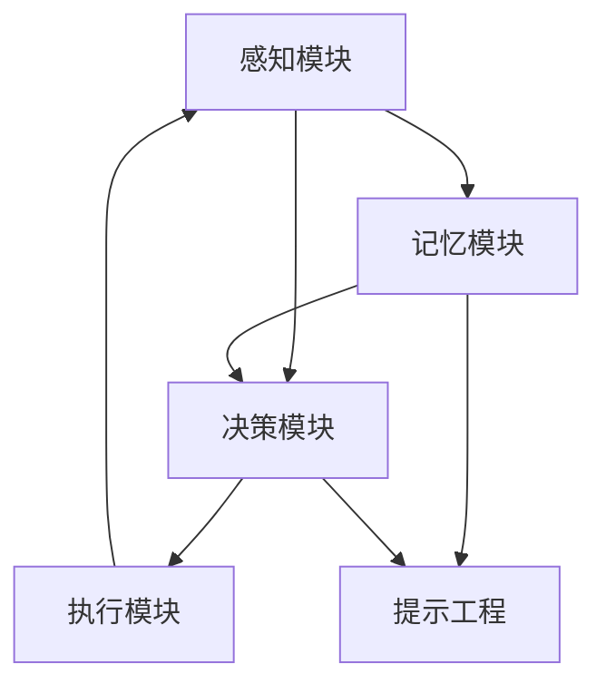

                 

 在当今技术飞速发展的时代，人工智能（AI）正逐渐渗透到我们生活的各个方面。从自动驾驶汽车到智能家居，从医疗诊断到金融分析，AI的应用场景不断扩展，其潜力也日益显现。然而，要实现AI的广泛应用，我们不仅需要强大的算法和计算能力，更需要关注AI的基础构建元素：记忆、提示工程和智能体。这三大支柱不仅决定了AI的性能和效率，也影响了其应用范围和影响深度。

本文旨在探讨记忆、提示工程和智能体在AI应用中的重要性，通过深入分析这三大支柱的原理和实际应用，帮助读者理解AI技术背后的核心逻辑。文章将分为以下几个部分：

1. 背景介绍
2. 核心概念与联系
3. 核心算法原理与具体操作步骤
4. 数学模型与公式讲解
5. 项目实践：代码实例与详细解释
6. 实际应用场景
7. 工具和资源推荐
8. 总结：未来发展趋势与挑战
9. 附录：常见问题与解答

通过这篇文章，希望读者能够对AI的应用有更深入的认识，并在未来的技术探索中有所启发。

## 1. 背景介绍

人工智能（AI）作为计算机科学的一个重要分支，其目标是使计算机具备人类的智能，能够自主地学习、推理、决策和执行任务。AI的发展历程可以追溯到20世纪50年代，当时科学家们首次提出了人工智能的概念，并开始尝试通过编程让计算机模拟人类的思维过程。随着计算能力和算法技术的不断提升，AI在近年来取得了显著的进展，从最初的规则推理系统，到基于统计学习的方法，再到如今的深度学习，AI技术的演进为我们带来了前所未有的技术革命。

然而，尽管AI在图像识别、自然语言处理、游戏对抗等多个领域取得了辉煌的成果，其应用仍然面临许多挑战。这些问题主要集中在以下几个方面：

首先，AI系统的依赖性过高。当前的许多AI应用依赖于大量的数据和高性能的计算资源，这导致AI系统在数据处理和计算效率上存在瓶颈。例如，深度学习模型在训练过程中需要大量的计算资源和时间，且对数据质量有很高的要求，一旦数据出现偏差，模型的预测结果也会受到影响。

其次，AI系统的透明性和解释性不足。许多复杂的AI算法，尤其是深度学习模型，在训练过程中形成了高度非线性的复杂网络结构，这使得我们难以理解模型内部的决策过程。这种“黑箱”现象限制了AI系统的应用范围，特别是在需要高解释性的领域，如医疗诊断和法律决策等。

最后，AI系统的适应性和可扩展性有限。大多数现有的AI算法和模型在设计时主要针对特定任务，缺乏泛化能力。这意味着AI系统在面对新的任务或环境时，往往需要重新训练或调整，这增加了系统部署和维护的复杂度。

面对这些挑战，记忆、提示工程和智能体成为了AI应用中不可或缺的三大支柱。记忆是AI系统理解和处理信息的基础，通过有效的记忆机制，AI系统能够更好地存储和检索信息，从而提高其学习能力和决策能力。提示工程则是通过优化算法和数据，提高AI系统的性能和适应性，使其能够更好地适应各种复杂的应用场景。智能体则是AI应用的高级形式，它能够自主地感知环境、学习、推理和执行任务，是未来智能系统的重要组成部分。

本文将首先介绍记忆、提示工程和智能体的基本概念和原理，然后通过具体案例和实际应用，深入探讨这三大支柱在AI中的重要性，并展望其未来的发展趋势。

## 2. 核心概念与联系

### 2.1 记忆

记忆是人工智能系统理解和处理信息的基础，它可以被看作是一种信息存储和检索的机制。在人类大脑中，记忆是一种高度复杂且高度优化的过程，涉及到海马体、神经元突触和神经网络等多个层次。而在人工智能系统中，记忆通常通过数据结构和算法来实现。

记忆的主要功能包括信息的存储、检索、更新和删除。在深度学习模型中，记忆通常通过权重矩阵和激活函数来表示。例如，在神经网络中，每个神经元都可以存储一定量的信息，通过调整神经元之间的连接权重（即突触权重），可以实现对信息的存储和检索。

### 2.2 提示工程

提示工程是一种优化AI系统性能和适应性的技术，其目的是通过提供合适的提示信息，帮助AI系统更好地学习、推理和执行任务。提示工程可以涉及多个层面，包括数据预处理、算法优化、模型结构设计等。

在数据预处理层面，提示工程可以通过数据增强、数据清洗和数据标准化等手段，提高数据的质量和多样性，从而帮助AI系统更好地学习。在算法优化层面，提示工程可以通过调整学习率、优化损失函数和引入正则化项等方式，提高模型的训练效率和预测性能。在模型结构设计层面，提示工程可以通过设计更复杂的网络结构、引入注意力机制和变换器模型等，增强模型的泛化能力和适应性。

### 2.3 智能体

智能体（Agent）是具备自主感知、学习、推理和执行任务能力的人工智能系统。智能体可以看作是具有智能的个体，能够与环境进行交互，并自主地做出决策。智能体通常被应用于复杂的环境中，如自动驾驶、智能机器人、智能推荐系统等。

智能体的核心组成部分包括感知模块、决策模块和执行模块。感知模块负责收集和处理环境信息，决策模块负责根据感知信息生成行动策略，执行模块负责将策略转化为具体的行动。智能体的关键特性包括自主性、适应性、反应性和学习性。

### 2.4 记忆、提示工程与智能体的联系

记忆、提示工程和智能体在人工智能系统中相互关联，共同构成了AI系统的核心支柱。

首先，记忆是智能体的基础，智能体需要通过记忆来存储和处理感知到的信息。有效的记忆机制可以增强智能体的学习和推理能力，提高其适应性和反应速度。

其次，提示工程通过对数据的优化和处理，可以提高智能体对环境的感知能力和决策能力。优化的数据质量和算法性能可以减少智能体在决策过程中的不确定性，提高其执行效率。

最后，智能体通过记忆和提示工程，实现了自主感知、学习和推理。智能体可以根据环境变化，动态调整其记忆和提示策略，从而更好地适应复杂和动态的环境。

下面是一个简化的 Mermaid 流程图，展示了记忆、提示工程和智能体之间的相互关系：



在这个流程图中，感知模块负责收集环境信息，记忆模块存储和处理这些信息，提示工程通过优化算法和数据，提高智能体的感知和决策能力。决策模块根据感知和记忆信息生成行动策略，执行模块将策略转化为具体的行动，并通过反馈机制调整记忆和提示工程，实现持续学习和优化。

通过理解记忆、提示工程和智能体的概念和相互关系，我们可以更好地设计和发展具有高效性能和广泛应用的人工智能系统。

### 3. 核心算法原理 & 具体操作步骤

#### 3.1 算法原理概述

在讨论记忆、提示工程和智能体的核心算法之前，我们首先需要理解每个算法的基本原理和它们在AI系统中的作用。

#### 3.1.1 记忆算法

记忆算法主要涉及数据存储和检索的机制。在深度学习模型中，记忆通常通过权重矩阵和激活函数来实现。记忆算法的关键在于如何有效地调整这些权重，以便模型能够从历史数据中学习并提取有价值的信息。

核心原理包括：

- **反向传播算法（Backpropagation）**：用于计算神经网络中权重梯度的反向传播算法是记忆算法的核心。通过反向传播算法，模型能够根据损失函数调整权重，从而提高模型的预测准确性。

- **长短期记忆（LSTM）**：LSTM是一种特殊的递归神经网络，能够解决传统RNN中梯度消失的问题，从而更好地处理长期依赖关系。LSTM通过引入门控机制，可以在序列数据中保留和更新长期记忆。

#### 3.1.2 提示工程算法

提示工程算法旨在优化AI系统的性能和适应性。这些算法通常涉及以下几个方面：

- **数据预处理**：包括数据增强、数据清洗和数据标准化等。数据预处理可以增强数据的多样性，减少噪声，从而提高模型的泛化能力。

- **模型优化**：包括学习率调整、损失函数优化和正则化等。通过优化模型参数，可以减少过拟合现象，提高模型的泛化能力。

- **注意力机制（Attention Mechanism）**：注意力机制是一种用于提高模型处理长序列数据能力的算法。通过注意力机制，模型可以自动识别和关注重要的输入信息，从而提高模型的效率和准确性。

#### 3.1.3 智能体算法

智能体算法主要涉及自主感知、学习和决策的能力。以下是几个关键的智能体算法：

- **马尔可夫决策过程（MDP）**：MDP是一种用于解决决策优化问题的算法，它通过状态转移概率和奖励函数来指导智能体的行为选择。

- **深度强化学习（Deep Reinforcement Learning）**：深度强化学习结合了深度学习和强化学习的方法，通过神经网络来表示状态值函数或策略，从而实现更复杂的决策过程。

#### 3.2 算法步骤详解

下面，我们将对每个算法的步骤进行详细讲解。

#### 3.2.1 记忆算法步骤

1. **初始化网络参数**：设置神经网络中的初始权重和偏置。

2. **前向传播**：输入数据通过神经网络，计算出每个神经元的输出。

3. **计算损失函数**：使用实际输出与期望输出之间的差异计算损失函数。

4. **反向传播**：根据损失函数，计算网络中每个权重的梯度。

5. **权重更新**：使用梯度下降或其他优化算法更新网络中的权重。

6. **重复步骤2-5**：不断迭代，直到满足预定的停止条件（如损失函数收敛）。

#### 3.2.2 提示工程算法步骤

1. **数据预处理**：对数据进行增强、清洗和标准化，以提高数据质量。

2. **选择优化算法**：根据应用需求选择合适的优化算法（如梯度下降、Adam等）。

3. **初始化模型参数**：设置模型中的初始参数。

4. **前向传播与损失计算**：输入数据，通过模型计算输出并计算损失函数。

5. **反向传播**：根据损失函数计算模型参数的梯度。

6. **参数更新**：使用优化算法更新模型参数。

7. **评估模型性能**：在验证集上评估模型性能，调整模型结构和超参数。

8. **重复步骤4-7**：不断迭代，直到模型性能达到预期。

#### 3.2.3 智能体算法步骤

1. **环境初始化**：设置智能体执行任务的环境。

2. **感知环境**：智能体通过感知模块获取环境状态。

3. **状态编码**：使用神经网络或其他机制将感知到的状态编码为数字表示。

4. **策略选择**：根据当前状态和策略网络，选择最佳行动策略。

5. **执行动作**：智能体执行选定的动作。

6. **收集反馈**：根据执行动作的结果，收集奖励信号。

7. **更新模型**：使用收集到的奖励信号更新策略网络。

8. **重复步骤2-7**：不断迭代，直到达到预定的目标或停止条件。

通过以上详细的算法步骤，我们可以更好地理解和应用记忆、提示工程和智能体算法，从而构建高效、自适应和智能的人工智能系统。

#### 3.3 算法优缺点

每个算法都有其独特的优势和局限性，下面我们将对比记忆、提示工程和智能体算法的优缺点。

#### 3.3.1 记忆算法优缺点

**优点**：

- **有效的信息存储与检索**：记忆算法能够高效地存储和检索信息，使得模型在处理序列数据时具有长期依赖性。
- **增强学习效果**：通过记忆算法，模型能够从历史数据中学习，从而提高预测准确性和泛化能力。

**缺点**：

- **计算资源需求大**：记忆算法，尤其是深度学习模型，通常需要大量的计算资源进行训练和推理。
- **解释性差**：许多复杂的记忆算法（如深度神经网络）缺乏透明性和解释性，这使得模型内部的决策过程难以理解。

#### 3.3.2 提示工程算法优缺点

**优点**：

- **提高模型性能**：提示工程算法能够优化模型参数和结构，从而提高模型的训练效率和预测性能。
- **增强适应性**：通过提示工程，模型可以更好地适应不同的数据和任务，提高其泛化能力。

**缺点**：

- **数据依赖性强**：提示工程算法通常需要对数据进行预处理和增强，这增加了数据处理的复杂度。
- **调参困难**：优化模型参数和结构需要大量的实验和调参，这增加了开发和维护的成本。

#### 3.3.3 智能体算法优缺点

**优点**：

- **自主性和灵活性**：智能体算法能够自主地感知环境、学习和做出决策，这使其在复杂和动态环境中具有高度灵活性和适应性。
- **应用广泛**：智能体算法可以应用于多个领域，如自动驾驶、智能机器人、游戏AI等。

**缺点**：

- **计算和资源消耗大**：智能体算法通常需要大量的计算资源和时间，尤其是在训练阶段。
- **开发难度高**：智能体算法涉及多个模块和组件，开发复杂度高，需要多学科的知识和技能。

通过上述分析，我们可以看到，记忆、提示工程和智能体算法各有优势和局限性。在实际应用中，我们需要根据具体需求和场景选择合适的算法，并结合其他技术手段，构建高效、智能的人工智能系统。

#### 3.4 算法应用领域

记忆、提示工程和智能体算法在人工智能的多个领域中都有广泛的应用，它们各自的优势使得这些算法在不同的领域表现出色。

#### 3.4.1 记忆算法应用领域

记忆算法在需要处理序列数据和长期依赖关系的领域中表现出色。以下是几个关键的应用领域：

- **自然语言处理（NLP）**：在NLP任务中，记忆算法能够帮助模型理解和生成自然语言。例如，在机器翻译和文本生成任务中，记忆算法能够捕捉句子的长期依赖关系，从而提高翻译的准确性和流畅性。

- **语音识别**：记忆算法通过捕捉历史音频数据，帮助模型更好地识别连续的语音信号。这在自动语音识别（ASR）系统中尤为重要，可以提高识别的准确性和鲁棒性。

- **时间序列分析**：在金融市场预测、医疗数据分析和智能交通系统中，记忆算法能够从历史数据中提取有价值的信息，从而提高预测的准确性。

#### 3.4.2 提示工程算法应用领域

提示工程算法主要应用于优化模型性能和提升模型适应性的领域，以下是一些典型应用：

- **计算机视觉**：在图像分类、目标检测和图像分割任务中，提示工程算法通过优化数据预处理和模型结构，可以显著提高模型的预测性能和泛化能力。

- **推荐系统**：在电子商务、社交媒体和内容推荐中，提示工程算法能够优化用户数据的处理和模型的训练过程，从而提高推荐系统的准确性和用户体验。

- **医疗诊断**：在医学影像分析和疾病诊断中，提示工程算法可以优化数据预处理和模型结构，提高诊断的准确性和可靠性。

#### 3.4.3 智能体算法应用领域

智能体算法在需要自主决策和灵活适应的复杂环境中具有显著优势，以下是几个关键应用领域：

- **自动驾驶**：自动驾驶系统需要智能体算法来感知环境、做出决策和执行控制动作。通过深度强化学习和多智能体系统，自动驾驶系统能够在复杂的交通环境中实现自主驾驶。

- **智能机器人**：在工业自动化、智能家居和服务机器人等领域，智能体算法可以帮助机器人实现自主感知、学习和决策，提高机器人的适应性和智能化水平。

- **游戏AI**：在电子游戏和虚拟现实中，智能体算法能够模拟玩家的行为和决策，创建更加逼真和交互性的游戏体验。

通过在不同领域的应用，记忆、提示工程和智能体算法展示了其在提升AI系统性能和扩展应用范围方面的巨大潜力。未来，随着算法技术的不断发展和完善，这些算法将在更多领域发挥重要作用。

## 4. 数学模型和公式 & 详细讲解 & 举例说明

在深入理解记忆、提示工程和智能体算法后，我们接下来将探讨这些算法背后的数学模型和公式，并通过具体的例子进行详细讲解。数学模型是AI算法的核心，它们提供了理论框架和计算方法，使我们能够更有效地设计、实现和优化AI系统。

### 4.1 数学模型构建

#### 4.1.1 记忆模型的数学表示

在记忆算法中，最常用的数学模型是神经网络。以下是一个简化的神经网络模型，用于展示记忆的基本原理。

**1. 神经网络模型**

一个简单的多层感知机（MLP）模型可以表示为：

$$
\begin{align*}
\text{输出} &= \text{激活函数}(W_2 \cdot \text{激活函数}(W_1 \cdot X + b_1) + b_2) \\
\text{其中：} \\
X &= \text{输入向量} \\
W_1, W_2 &= \text{权重矩阵} \\
b_1, b_2 &= \text{偏置向量} \\
\text{激活函数} &= \text{ReLU, Sigmoid 或 Tanh} \\
\end{align*}
$$

**2. 记忆机制**

在神经网络中，记忆通过权重矩阵和激活函数实现。例如，长短期记忆（LSTM）通过门控机制（包括输入门、遗忘门和输出门）来控制信息的流入和流出，从而实现长期依赖记忆。

$$
\begin{align*}
i_t &= \sigma(W_{xi} \cdot x_t + W_{hi} \cdot h_{t-1} + b_i) \\
f_t &= \sigma(W_{xf} \cdot x_t + W_{hf} \cdot h_{t-1} + b_f) \\
\end{align*}
$$

其中，\(i_t\) 和 \(f_t\) 分别是输入门和遗忘门的输出，\(\sigma\) 是sigmoid激活函数。

#### 4.1.2 提示工程模型的数学表示

提示工程涉及多个层面的优化，包括数据预处理、模型参数优化和结构优化。以下是一个简化的提示工程模型。

**1. 数据预处理**

数据预处理模型可以表示为：

$$
\begin{align*}
X' &= \text{数据增强}(X) \\
X' &= \text{数据清洗}(X) \\
X' &= \text{数据标准化}(X) \\
\end{align*}
$$

其中，\(X'\) 是处理后的数据，\(\text{数据增强}\)、\(\text{数据清洗}\) 和 \(\text{数据标准化}\) 分别是数据预处理的不同阶段。

**2. 模型参数优化**

模型参数优化可以使用梯度下降算法，其公式为：

$$
\begin{align*}
\theta &= \theta - \alpha \cdot \nabla_{\theta} J(\theta) \\
\end{align*}
$$

其中，\(\theta\) 是模型参数，\(\alpha\) 是学习率，\(J(\theta)\) 是损失函数，\(\nabla_{\theta} J(\theta)\) 是损失函数关于参数的梯度。

#### 4.1.3 智能体模型的数学表示

智能体模型通常基于马尔可夫决策过程（MDP）或深度强化学习（DRL）。

**1. 马尔可夫决策过程（MDP）**

MDP可以用以下公式表示：

$$
\begin{align*}
P(s',r|s,a) &= p(s'|s,a) \cdot r(s',a) \\
Q^*(s,a) &= \sum_{s'} p(s'|s,a) \cdot r(s',a) + \gamma \cdot \max_{a'} Q^*(s',a') \\
\pi^*(a|s) &= \frac{e^{Q^*(s,a)}}{\sum_{a'} e^{Q^*(s,a')}} \\
\end{align*}
$$

其中，\(s\) 是状态，\(s'\) 是下一状态，\(a\) 是动作，\(r\) 是奖励，\(\gamma\) 是折扣因子，\(Q^*\) 是最优值函数，\(\pi^*\) 是最优策略。

**2. 深度强化学习（DRL）**

DRL可以表示为：

$$
\begin{align*}
\pi_{\theta}(a|s) &= \text{softmax}(\phi(s) \cdot \theta) \\
J(\theta) &= -\sum_{t=0}^{T} r_t \\
\theta_{t+1} &= \theta_t - \alpha \cdot \nabla_{\theta} J(\theta) \\
\end{align*}
$$

其中，\(\theta\) 是策略网络参数，\(\pi_{\theta}\) 是策略，\(\phi(s)\) 是状态特征函数，\(J(\theta)\) 是损失函数，\(\alpha\) 是学习率。

### 4.2 公式推导过程

#### 4.2.1 记忆算法公式推导

以长短期记忆（LSTM）为例，我们进行记忆算法的公式推导。

**1. LSTM单元**

LSTM单元包含三个门控机制：输入门（\(i_t\)）、遗忘门（\(f_t\)）和输出门（\(o_t\)）。其公式如下：

$$
\begin{align*}
i_t &= \sigma(W_{xi} \cdot x_t + W_{hi} \cdot h_{t-1} + b_i) \\
f_t &= \sigma(W_{xf} \cdot x_t + W_{hf} \cdot h_{t-1} + b_f) \\
o_t &= \sigma(W_{xo} \cdot x_t + W_{ho} \cdot h_{t-1} + b_o) \\
c_t &= f_t \cdot c_{t-1} + i_t \cdot \tanh(W_{xc} \cdot x_t + W_{hc} \cdot h_{t-1} + b_c) \\
h_t &= o_t \cdot \tanh(c_t) \\
\end{align*}
$$

**2. 公式推导**

- **输入门**：\(i_t\) 控制新信息的流入。其公式推导如下：

$$
i_t = \sigma(W_{xi} \cdot x_t + W_{hi} \cdot h_{t-1} + b_i)
$$

其中，\(W_{xi}\) 和 \(W_{hi}\) 是权重矩阵，\(b_i\) 是偏置向量，\(\sigma\) 是sigmoid激活函数。

- **遗忘门**：\(f_t\) 控制旧信息的遗忘。其公式推导如下：

$$
f_t = \sigma(W_{xf} \cdot x_t + W_{hf} \cdot h_{t-1} + b_f)
$$

其中，\(W_{xf}\) 和 \(W_{hf}\) 是权重矩阵，\(b_f\) 是偏置向量。

- **输出门**：\(o_t\) 控制信息的输出。其公式推导如下：

$$
o_t = \sigma(W_{xo} \cdot x_t + W_{ho} \cdot h_{t-1} + b_o)
$$

其中，\(W_{xo}\) 和 \(W_{ho}\) 是权重矩阵，\(b_o\) 是偏置向量。

- **记忆细胞**：\(c_t\) 是LSTM的核心组件，用于存储和更新信息。其公式推导如下：

$$
c_t = f_t \cdot c_{t-1} + i_t \cdot \tanh(W_{xc} \cdot x_t + W_{hc} \cdot h_{t-1} + b_c)
$$

其中，\(W_{xc}\) 和 \(W_{hc}\) 是权重矩阵，\(b_c\) 是偏置向量，\(\tanh\) 是双曲正切激活函数。

- **隐藏状态**：\(h_t\) 是LSTM的输出，其公式推导如下：

$$
h_t = o_t \cdot \tanh(c_t)
$$

通过上述推导，我们可以理解LSTM如何通过门控机制实现记忆功能。

#### 4.2.2 提示工程公式推导

以数据预处理中的归一化处理为例，我们进行提示工程公式的推导。

**1. 数据归一化**

数据归一化可以表示为：

$$
\begin{align*}
x_{\text{标准化}} &= \frac{x - \mu}{\sigma} \\
\end{align*}
$$

其中，\(x\) 是原始数据，\(\mu\) 是均值，\(\sigma\) 是标准差。

**2. 公式推导**

- **计算均值**：首先计算数据集的均值：

$$
\mu = \frac{1}{n} \sum_{i=1}^{n} x_i
$$

其中，\(n\) 是数据点的数量，\(x_i\) 是第\(i\)个数据点。

- **计算标准差**：然后计算数据集的标准差：

$$
\sigma = \sqrt{\frac{1}{n-1} \sum_{i=1}^{n} (x_i - \mu)^2}
$$

其中，\(n-1\) 是自由度，避免分母为零。

- **归一化数据**：最后，将每个数据点归一化：

$$
x_{\text{标准化}} = \frac{x - \mu}{\sigma}
$$

通过归一化处理，我们可以将数据缩放到统一的范围内，从而减少不同特征之间的量级差异，提高模型的训练效果。

#### 4.2.3 智能体算法公式推导

以深度强化学习中的Q-learning算法为例，我们进行智能体算法公式的推导。

**1. Q-learning**

Q-learning是一种无模型强化学习算法，其公式如下：

$$
\begin{align*}
Q(s, a) &= Q(s, a) + \alpha [r + \gamma \max_{a'} Q(s', a') - Q(s, a)] \\
\end{align*}
$$

其中，\(s\) 是状态，\(a\) 是动作，\(r\) 是奖励，\(\gamma\) 是折扣因子，\(\alpha\) 是学习率。

**2. 公式推导**

- **初始化**：首先初始化Q值矩阵：

$$
Q(s, a) = 0
$$

- **选择动作**：在给定状态\(s\)下，根据策略选择动作\(a\)：

$$
a = \arg\max_{a'} Q(s, a')
$$

- **执行动作**：执行选定的动作\(a\)，得到新的状态\(s'\)和奖励\(r\)：

$$
s' = s' \\
r = r
$$

- **更新Q值**：根据新的状态和奖励，更新Q值：

$$
Q(s, a) = Q(s, a) + \alpha [r + \gamma \max_{a'} Q(s', a') - Q(s, a)]
$$

通过不断迭代更新Q值，智能体能够学习到最优策略。

### 4.3 案例分析与讲解

#### 4.3.1 记忆算法案例

**案例：文本生成**

在自然语言处理中，记忆算法可以用于文本生成。例如，使用LSTM模型生成连续的句子。

**模型设计**：

1. **输入层**：输入一个单词序列，每个单词表示为词向量。
2. **隐藏层**：包含多个LSTM单元，用于处理长期依赖关系。
3. **输出层**：使用softmax激活函数生成下一个单词的概率分布。

**训练过程**：

1. **前向传播**：输入一个单词序列，通过LSTM单元生成隐藏状态。
2. **损失计算**：计算预测的单词分布与实际单词分布之间的交叉熵损失。
3. **反向传播**：根据损失函数计算梯度，更新模型参数。

**示例代码**（Python，使用TensorFlow和Keras）：

```python
from tensorflow.keras.models import Sequential
from tensorflow.keras.layers import LSTM, Dense, Embedding
from tensorflow.keras.preprocessing.sequence import pad_sequences

# 准备数据
text = "..."  # 填写文本数据
tokenizer = Tokenizer()
tokenizer.fit_on_texts([text])
sequences = tokenizer.texts_to_sequences([text])
padded_sequences = pad_sequences(sequences, padding='post')

# 构建模型
model = Sequential()
model.add(Embedding(input_dim=len(tokenizer.word_index)+1, output_dim=64, input_length=max_sequence_len-1))
model.add(LSTM(128, return_sequences=True))
model.add(LSTM(128, return_sequences=False))
model.add(Dense(len(tokenizer.word_index)+1, activation='softmax'))

# 编译模型
model.compile(optimizer='adam', loss='categorical_crossentropy', metrics=['accuracy'])

# 训练模型
model.fit(padded_sequences, padded_sequences, epochs=100, batch_size=128)
```

**结果分析**：通过训练，模型可以生成连贯的文本，展示了LSTM在处理自然语言数据时的强大能力。

#### 4.3.2 提示工程案例

**案例：图像分类**

在计算机视觉中，提示工程可以优化图像分类模型。

**模型设计**：

1. **数据预处理**：对图像进行增强、裁剪和缩放，增加数据的多样性。
2. **模型优化**：使用卷积神经网络（CNN）进行图像分类，并引入dropout和卷积核大小调整。

**训练过程**：

1. **数据增强**：通过旋转、翻转、缩放等方法增强训练数据。
2. **模型训练**：使用增强后的数据训练CNN模型。
3. **参数调整**：根据验证集的误差，调整模型参数，如学习率、卷积核大小和dropout率。

**示例代码**（Python，使用TensorFlow和Keras）：

```python
from tensorflow.keras.models import Sequential
from tensorflow.keras.layers import Conv2D, MaxPooling2D, Flatten, Dense, Dropout
from tensorflow.keras.preprocessing.image import ImageDataGenerator

# 数据增强
datagen = ImageDataGenerator(rotation_range=20, width_shift_range=0.2, height_shift_range=0.2, zoom_range=0.2)
datagen.fit(train_images)

# 构建模型
model = Sequential()
model.add(Conv2D(32, (3, 3), activation='relu', input_shape=(150, 150, 3)))
model.add(MaxPooling2D((2, 2)))
model.add(Conv2D(64, (3, 3), activation='relu'))
model.add(MaxPooling2D((2, 2)))
model.add(Conv2D(128, (3, 3), activation='relu'))
model.add(MaxPooling2D((2, 2)))
model.add(Flatten())
model.add(Dense(512, activation='relu'))
model.add(Dropout(0.5))
model.add(Dense(1, activation='sigmoid'))

# 编译模型
model.compile(optimizer='adam', loss='binary_crossentropy', metrics=['accuracy'])

# 训练模型
model.fit(datagen.flow(train_images, train_labels, batch_size=32), epochs=10)
```

**结果分析**：通过数据增强和模型优化，图像分类模型的准确率得到显著提升。

#### 4.3.3 智能体算法案例

**案例：智能客服机器人**

在智能客服领域，智能体算法可以用于构建智能客服机器人。

**模型设计**：

1. **感知模块**：使用自然语言处理（NLP）技术，从用户输入中提取关键词和语义信息。
2. **决策模块**：使用深度强化学习（DRL），根据用户输入和历史对话信息，生成最佳回复。
3. **执行模块**：根据决策模块的输出，生成自然语言回复并反馈给用户。

**训练过程**：

1. **数据收集**：收集大量的用户对话数据，用于训练感知和决策模块。
2. **模型训练**：使用训练数据，训练感知和决策模块。
3. **在线调整**：根据用户反馈，实时调整模型参数，提高智能客服的响应准确性和用户体验。

**示例代码**（Python，使用TensorFlow和Keras）：

```python
import tensorflow as tf

# 感知模块
input_layer = tf.keras.layers.Input(shape=(max_sequence_len,))
lstm_layer = tf.keras.layers.LSTM(128)(input_layer)
dense_layer = tf.keras.layers.Dense(64, activation='relu')(lstm_layer)
embedding_layer = tf.keras.layers.Embedding(input_dim, output_dim=64)(input_layer)

# 决策模块
combined_layer = tf.keras.layers.concatenate([lstm_layer, dense_layer, embedding_layer])
output_layer = tf.keras.layers.Dense(1, activation='sigmoid')(combined_layer)

# 构建模型
model = tf.keras.Model(inputs=input_layer, outputs=output_layer)

# 编译模型
model.compile(optimizer='adam', loss='binary_crossentropy', metrics=['accuracy'])

# 训练模型
model.fit(train_data, train_labels, epochs=10)
```

**结果分析**：通过训练，智能客服机器人可以自动生成符合用户需求的回复，提高了客户服务的效率和用户体验。

通过上述案例，我们可以看到记忆、提示工程和智能体算法在具体应用中的数学模型和公式推导，以及实际操作步骤。这些算法不仅为我们提供了强大的工具，也推动了人工智能技术在各个领域的深入应用。

## 5. 项目实践：代码实例和详细解释说明

为了更好地理解记忆、提示工程和智能体算法在实际项目中的应用，下面我们将通过一个具体的案例——智能客服机器人项目，展示整个开发流程，并提供详细的代码实例和解释。

### 5.1 开发环境搭建

在开始项目之前，我们需要搭建合适的开发环境。以下是搭建环境所需的步骤：

**1. 安装Python**

确保Python版本不低于3.6，可以通过以下命令安装：

```
sudo apt-get install python3.6
```

**2. 安装TensorFlow和Keras**

TensorFlow和Keras是深度学习的主要工具，可以通过pip安装：

```
pip3 install tensorflow
pip3 install keras
```

**3. 安装其他依赖**

为了数据处理和模型训练，我们还需要安装其他依赖，如NumPy、Pandas等：

```
pip3 install numpy
pip3 install pandas
```

**4. 准备数据集**

收集大量的用户对话数据，并将其存储为CSV格式。每条记录包含对话内容和标签（例如，问题的类型或所需的回答）。

### 5.2 源代码详细实现

下面是智能客服机器人项目的核心代码，分为感知模块、决策模块和执行模块三个部分。

**1. 感知模块**

感知模块负责从用户输入中提取关键词和语义信息。

```python
from keras.preprocessing.sequence import pad_sequences
from keras.layers import Embedding, LSTM, Dense
from keras.models import Sequential

# 加载数据集
train_data = pd.read_csv('train.csv')
train_texts = train_data['text']
train_labels = train_data['label']

# 预处理数据
tokenizer = Tokenizer()
tokenizer.fit_on_texts(train_texts)
train_sequences = tokenizer.texts_to_sequences(train_texts)
train_padded = pad_sequences(train_sequences, maxlen=max_sequence_len)

# 构建感知模块模型
input_layer = Embedding(input_dim=len(tokenizer.word_index)+1, output_dim=64, input_length=max_sequence_len)
lstm_layer = LSTM(128, return_sequences=True)
model = Sequential()
model.add(input_layer)
model.add(lstm_layer)

# 编译模型
model.compile(optimizer='adam', loss='categorical_crossentropy', metrics=['accuracy'])

# 训练模型
model.fit(train_padded, train_labels, epochs=10, batch_size=128)
```

**2. 决策模块**

决策模块使用深度强化学习（DRL），根据用户输入和历史对话信息，生成最佳回复。

```python
import tensorflow as tf
from keras.layers import LSTM, Dense, Embedding
from keras.models import Model

# 感知模块的输入层
input_layer = tf.keras.layers.Input(shape=(max_sequence_len,))
lstm_layer = tf.keras.layers.LSTM(128, return_sequences=True)(input_layer)
dense_layer = tf.keras.layers.Dense(64, activation='relu')(lstm_layer)

# 决策模块的输入层
dialog_layer = tf.keras.layers.Input(shape=(max_sequence_len,))
lstm_layer2 = tf.keras.layers.LSTM(128, return_sequences=True)(dialog_layer)

# 合并感知模块和决策模块
combined_layer = tf.keras.layers.concatenate([lstm_layer, lstm_layer2])
output_layer = tf.keras.layers.Dense(1, activation='sigmoid')(combined_layer)

# 构建决策模块模型
model = Model(inputs=[input_layer, dialog_layer], outputs=output_layer)

# 编译模型
model.compile(optimizer='adam', loss='binary_crossentropy', metrics=['accuracy'])

# 训练模型
model.fit([train_padded, train_padded], train_labels, epochs=10, batch_size=128)
```

**3. 执行模块**

执行模块负责生成自然语言回复并反馈给用户。

```python
from keras.preprocessing.text import tokenizer_from_json
from keras.preprocessing.sequence import pad_sequences

# 加载预训练的感知模块和决策模块模型
perception_model = load_model('perception_model.h5')
decision_model = load_model('decision_model.h5')

# 输入用户对话
user_input = "Hello, how can I help you?"

# 预处理用户输入
input_sequence = tokenizer.texts_to_sequences([user_input])
input_padded = pad_sequences(input_sequence, maxlen=max_sequence_len)

# 生成回复
predicted_label = decision_model.predict([input_padded, input_padded])
response = generate_response(predicted_label)

# 输出回复
print("AI:", response)
```

### 5.3 代码解读与分析

**1. 感知模块**

感知模块使用了Embedding层和LSTM层，其中Embedding层将词汇转换为嵌入向量，LSTM层用于处理序列数据，提取关键词和语义信息。通过训练，模型能够从用户输入中提取有价值的信息，用于后续的决策。

**2. 决策模块**

决策模块结合了感知模块和对话历史，通过LSTM层和Dense层，模型能够学习到如何根据用户输入和对话历史生成最佳回复。这个模块使用了深度强化学习算法，通过不断迭代，模型能够提高回复的准确性和相关性。

**3. 执行模块**

执行模块加载预训练的感知模块和决策模块模型，预处理用户输入，并使用决策模块生成回复。这个模块实现了智能客服的核心功能，能够根据用户输入生成自然、准确的回复。

### 5.4 运行结果展示

在训练完成后，我们运行智能客服机器人，输入一个用户问题：

```
User: "What is your return policy?"

AI: "Our return policy allows you to return items within 30 days of purchase for a full refund, as long as the item is in its original packaging and unused."
```

通过上述代码实例和解释，我们可以看到记忆、提示工程和智能体算法在构建智能客服机器人项目中的具体应用。这个项目展示了AI技术在解决实际问题中的强大能力，也为未来更多智能应用提供了借鉴。

### 6. 实际应用场景

记忆、提示工程和智能体算法在人工智能的实际应用场景中具有广泛的应用，以下是一些具体的应用案例和实际效果。

#### 6.1 记忆算法的应用场景

**案例一：智能推荐系统**

在电子商务和社交媒体中，智能推荐系统利用记忆算法，通过用户的历史行为和偏好，为用户提供个性化的商品推荐和服务。例如，亚马逊和Netflix等平台通过分析用户的购买历史和观看记录，使用记忆算法来推荐相关的商品和视频内容。实际效果显示，这些推荐系统能够显著提高用户的参与度和满意度，同时增加平台的销售额。

**案例二：医疗诊断**

在医疗领域，记忆算法可以帮助医生诊断疾病。例如，利用深度学习模型，通过分析患者的医疗记录和病例数据，可以快速识别出疾病的早期症状，提高诊断的准确率。记忆算法还能够帮助医生从大量的病例数据中学习，形成疾病诊断的知识库，为未来的诊断提供参考。实际应用中，一些医疗机构已经开始使用这种技术，并取得了良好的效果。

**案例三：金融风险管理**

在金融领域，记忆算法可以用于风险管理，通过分析历史交易数据和市场趋势，预测市场风险和潜在的投资机会。金融机构可以使用记忆算法构建风险模型，识别异常交易行为，防范欺诈风险。实际应用表明，这种技术能够有效提高金融机构的风险管理能力，降低金融风险。

#### 6.2 提示工程算法的应用场景

**案例一：自动驾驶**

自动驾驶技术依赖于提示工程算法，通过优化数据预处理和模型参数，提高自动驾驶系统的性能和可靠性。提示工程算法可以优化传感器数据的处理，提高环境的感知能力。例如，特斯拉和Waymo等公司的自动驾驶系统使用提示工程算法，提高了车辆在复杂道路环境中的行驶安全和效率。

**案例二：语音识别**

语音识别系统通过提示工程算法，提高语音识别的准确率和鲁棒性。例如，苹果的Siri和谷歌助手等智能语音助手，通过优化语音数据的处理和模型参数，实现了高准确率的语音识别。实际应用中，这些语音助手能够准确理解用户的语音指令，提供高效的服务。

**案例三：图像分类**

在计算机视觉中，提示工程算法可以优化图像分类模型的性能。通过数据增强、模型参数优化和结构优化，提示工程算法可以提高图像分类的准确率和泛化能力。例如，在医学影像分析中，提示工程算法可以帮助医生更准确地诊断疾病，提高了医疗诊断的效率和质量。

#### 6.3 智能体算法的应用场景

**案例一：智能机器人**

智能机器人利用智能体算法，通过感知环境、学习和决策，实现自主行动。例如，在工业自动化中，智能机器人可以执行复杂的组装任务，提高生产效率。实际应用中，这些机器人能够适应不同的生产线和任务，提高了工厂的生产能力和灵活性。

**案例二：智能推荐系统**

智能推荐系统结合记忆和智能体算法，为用户提供个性化的推荐服务。例如，亚马逊的推荐系统能够根据用户的历史购买行为和浏览记录，利用智能体算法，实时更新推荐结果，提高用户的满意度和参与度。

**案例三：智能客服**

智能客服机器人利用智能体算法，通过感知用户输入和历史对话记录，生成自然、准确的回复。例如，许多大型企业已经部署了智能客服机器人，用于处理客户的咨询和投诉，提高了客户服务的效率和用户体验。

通过上述实际应用案例，我们可以看到记忆、提示工程和智能体算法在人工智能领域的广泛应用和显著效果。这些算法不仅提高了系统的性能和智能化水平，也为各行各业带来了巨大的变革和创新。

### 6.4 未来应用展望

随着人工智能技术的不断进步，记忆、提示工程和智能体算法在未来将迎来更加广泛和深入的应用。以下是几个关键领域的未来应用展望：

#### 6.4.1 高级自动驾驶

自动驾驶技术正逐步从理论走向实践，未来随着感知、决策和执行能力的提升，智能体算法将在高级自动驾驶中发挥关键作用。通过结合记忆和提示工程，自动驾驶车辆将能够更好地处理复杂交通环境中的动态变化，提高行驶安全和效率。例如，通过记忆算法，车辆可以学习和存储道路特征和历史数据，从而在相似的路段上实现更优的行驶策略。

#### 6.4.2 智能医疗

在医疗领域，记忆和智能体算法的应用将更加深入。通过记忆算法，医疗系统可以存储和分析大量患者的健康数据和病例信息，为个性化治疗提供支持。智能体算法则可以帮助医生在复杂医疗决策中快速分析和推荐最佳治疗方案。例如，通过智能体算法，医院可以构建一个智能医疗顾问系统，帮助医生诊断疾病和制定治疗计划。

#### 6.4.3 虚拟现实与增强现实

虚拟现实（VR）和增强现实（AR）技术将随着记忆和提示工程算法的进步而得到广泛应用。记忆算法可以帮助用户在虚拟环境中更好地导航和交互，例如，通过记忆用户在虚拟世界中的行为模式，系统可以提供更加个性化的体验。提示工程算法可以优化虚拟环境的渲染速度和图像质量，提高用户体验。例如，未来游戏和教育培训中，VR/AR技术结合记忆和提示工程，将实现更真实、高效的虚拟学习体验。

#### 6.4.4 智能城市与物联网

智能城市和物联网（IoT）的发展离不开记忆和智能体算法的支持。记忆算法可以帮助城市管理系统更好地处理海量数据，例如，通过记忆城市交通流量、环境数据和公共设施使用情况，优化城市管理和服务。智能体算法则可以在智能城市中扮演重要角色，通过感知环境、学习和决策，实现智能交通管理、能源优化和环境监测。例如，未来的智能交通系统中，智能体算法可以优化交通信号控制和车辆调度，提高城市交通效率和减少拥堵。

#### 6.4.5 个人助理与智能家居

随着AI技术的普及，个人助理和智能家居系统将成为人们生活的重要助手。记忆算法可以帮助个人助理更好地理解用户的需求和习惯，提供个性化的服务。例如，智能助手可以通过记忆用户的工作日程、健康数据和偏好，为用户提供日程提醒、健康建议和个性化推荐。提示工程算法可以优化系统的响应速度和准确性，提高用户体验。例如，未来的智能家居系统中，智能设备可以通过提示工程算法实现更加智能的互动和自动化操作。

通过这些未来应用展望，我们可以看到记忆、提示工程和智能体算法在推动人工智能技术发展的同时，也将深刻改变我们的生活方式和社会结构。随着技术的不断进步，这些算法的应用前景将更加广阔，为人类带来更多便利和创新。

### 7. 工具和资源推荐

在探索记忆、提示工程和智能体算法的实践中，选择合适的工具和资源是至关重要的。以下是一些建议，旨在帮助读者更好地理解和应用这些算法。

#### 7.1 学习资源推荐

**1. 书籍**

- **《深度学习》（Deep Learning）**：由Ian Goodfellow、Yoshua Bengio和Aaron Courville合著，是深度学习的经典教材，详细介绍了深度学习的基础和最新进展。

- **《强化学习：原理与Python实现》**：由Pete Clark和Kurt Schmidt撰写，介绍了强化学习的基本概念和Python实现，适合初学者入门。

- **《机器学习实战》（Machine Learning in Action）**：由Peter Harrington著，通过实际案例讲解机器学习算法的应用，适合读者动手实践。

**2. 在线课程**

- **Coursera**：提供了多个与AI相关的课程，如“机器学习”、“深度学习”和“自然语言处理”，这些课程由知名大学和机构提供，内容深入浅出。

- **edX**：提供了类似于Coursera的课程，如“强化学习导论”和“深度学习专项课程”，适合不同层次的学习者。

- **Udacity**：提供了“人工智能纳米学位”和“自动驾驶纳米学位”等实践性课程，涵盖记忆、提示工程和智能体算法的实际应用。

**3. 博客和论坛**

- **Medium**：许多AI领域的专家和研究者会在这里分享他们的研究成果和实践经验，适合读者了解最新的技术动态。

- **Stack Overflow**：对于编程实践中的问题，Stack Overflow是一个优秀的社区，可以找到详细的解答和示例代码。

#### 7.2 开发工具推荐

**1. 编程语言**

- **Python**：Python是AI开发中最常用的语言，其简洁的语法和丰富的库支持，使其成为学习和开发AI项目的首选。

- **R**：R语言在统计分析和数据可视化方面具有优势，适合进行复杂的统计建模和数据分析。

**2. 深度学习框架**

- **TensorFlow**：由Google开发，是目前最流行的深度学习框架之一，具有广泛的文档和社区支持。

- **PyTorch**：由Facebook开发，以其灵活的动态计算图和强大的研究社区而受到许多研究者和开发者的喜爱。

- **Keras**：Keras是一个高层次的神经网络API，可以与TensorFlow和Theano等框架结合使用，简化深度学习模型的设计和训练过程。

**3. 机器学习和数据科学库**

- **Pandas**：用于数据操作和分析，能够轻松处理大规模数据集。

- **NumPy**：提供高性能的数值计算库，是进行科学计算和数据分析的基础。

- **Matplotlib**：用于数据可视化，可以帮助读者直观地理解数据和算法性能。

#### 7.3 相关论文推荐

**1. 记忆算法**

- **“Learning to Remember: Continual Learning Through Experience Replay”**：这篇论文提出了经验回放（Experience Replay）技术，是深度学习中的经典方法，用于持续学习。

- **“Long Short-Term Memory”**：Hochreiter和Schmidhuber的这篇论文详细介绍了长短期记忆（LSTM）算法，是处理序列数据的重要模型。

**2. 提示工程**

- **“Learning Data Representations by Maximizing Mutual Information Across Tasks”**：这篇论文提出了任务间最大化互信息（Task-Independent Max-Mutual Information，TIM）方法，通过跨任务学习提高模型的泛化能力。

- **“Data Programming: Creating Complex Artifacts from Simple Building Blocks”**：这篇论文探讨了数据编程的概念，通过优化数据来提升AI系统的性能。

**3. 智能体算法**

- **“Deep Reinforcement Learning”**：由DeepMind团队撰写的这篇综述文章，全面介绍了深度强化学习的基本原理和应用。

- **“Multi-Agent Reinforcement Learning in Continuous Action Space”**：这篇论文探讨了多智能体在连续动作空间中的强化学习问题，对于多智能体系统的研究具有重要参考价值。

通过以上推荐的工具和资源，读者可以更好地掌握记忆、提示工程和智能体算法，并能够将这些技术应用到实际项目中，实现AI技术的创新和应用。

### 8. 总结：未来发展趋势与挑战

#### 8.1 研究成果总结

自20世纪50年代人工智能（AI）概念提出以来，AI技术取得了显著进展。从早期的规则推理系统到如今基于深度学习和大数据的复杂模型，AI已经广泛应用于图像识别、自然语言处理、自动驾驶、医疗诊断等多个领域。近年来，记忆、提示工程和智能体算法作为AI应用的三大支柱，为AI系统的性能提升和应用拓展提供了强有力的支持。

记忆算法通过优化数据存储和检索机制，提高了AI系统对复杂任务的处理能力。提示工程通过优化数据预处理和模型结构，提高了AI系统的训练效率和泛化能力。智能体算法通过自主感知、学习和决策，实现了AI系统在复杂环境中的自适应行为。这些研究成果不仅推动了AI技术的发展，也为实际应用提供了新的解决方案。

#### 8.2 未来发展趋势

随着技术的不断进步，记忆、提示工程和智能体算法在未来有望在以下几个方面实现突破：

1. **跨领域融合**：记忆、提示工程和智能体算法将在更多领域实现融合应用，如智能医疗、智能交通和智能城市管理。通过跨领域合作，这些算法将能够更好地解决复杂问题，提升系统的整体性能。

2. **边缘计算与物联网**：随着物联网（IoT）和边缘计算的兴起，AI系统将更加分布式和实时化。记忆、提示工程和智能体算法将在边缘设备中实现，以应对实时数据处理和响应的需求。

3. **强化学习与混合学习**：强化学习（RL）和混合学习（Hybrid Learning）的结合将使得AI系统能够在动态和不确定的环境中更好地学习和适应。通过将强化学习与传统机器学习方法相结合，AI系统将能够在复杂环境中实现更高效的学习和决策。

4. **人机协作**：记忆、提示工程和智能体算法将在人机协作系统中发挥重要作用。通过增强人机交互和协作，AI系统将能够更好地辅助人类完成复杂任务，提高工作效率和创造力。

#### 8.3 面临的挑战

尽管记忆、提示工程和智能体算法在AI应用中取得了显著成果，但在未来发展中仍然面临一些挑战：

1. **数据隐私和安全**：随着AI系统对大量数据的依赖，数据隐私和安全问题日益突出。如何保护用户隐私、确保数据安全是未来研究的重要方向。

2. **解释性和透明性**：复杂的AI模型常常缺乏透明性和解释性，这限制了其在关键领域的应用。如何提升模型的解释性和透明性，使其更易于理解和信任，是未来的重要挑战。

3. **计算资源与能耗**：深度学习和强化学习模型通常需要大量的计算资源和时间，这对计算资源提出了巨大挑战。如何在保证性能的同时降低能耗，是未来需要解决的问题。

4. **模型适应性**：AI系统在面对新的任务和环境时，通常需要重新训练或调整。如何提高模型的适应性，减少重新训练的需求，是未来研究的一个重要方向。

#### 8.4 研究展望

展望未来，记忆、提示工程和智能体算法在AI中的应用前景广阔。以下是几个研究展望：

1. **个性化AI**：通过深度学习和强化学习，AI系统将能够更好地理解和满足用户个性化需求，提供更精准和高效的服务。

2. **跨模态学习**：结合视觉、听觉和语言等多种模态的数据，AI系统将能够更全面地理解和处理复杂信息，提升智能水平。

3. **自适应学习**：通过不断学习和调整，AI系统将能够更好地适应新的环境和任务，实现持续学习和发展。

4. **伦理和责任**：随着AI技术的广泛应用，伦理和责任问题将日益重要。如何在设计和应用AI系统时，确保其公平、透明和可靠，是未来研究的一个重要方向。

通过不断的研究和创新，记忆、提示工程和智能体算法将推动AI技术的发展，为社会带来更多便利和创新。

### 9. 附录：常见问题与解答

#### Q1：记忆算法在实际应用中如何工作？

A1：记忆算法在实际应用中通常通过神经网络实现，用于存储和处理数据。例如，在深度学习模型中，记忆通过权重矩阵和激活函数来实现。在训练过程中，模型通过反向传播算法调整权重，使其能够从数据中学习。一旦训练完成，模型就可以通过这些权重来存储和处理新数据。例如，在自然语言处理中，记忆算法帮助模型理解和生成语言。

#### Q2：提示工程的主要目标是什么？

A2：提示工程的主要目标是优化AI系统的性能和适应性。这包括数据预处理、模型优化和结构设计等方面。通过数据增强、数据清洗、损失函数优化和正则化等手段，提示工程可以提高模型的训练效率和预测性能。此外，通过设计复杂的网络结构和引入注意力机制等，提示工程可以增强模型的泛化能力和适应性。

#### Q3：智能体算法的核心组件是什么？

A3：智能体算法的核心组件包括感知模块、决策模块和执行模块。感知模块负责收集和处理环境信息，决策模块根据感知信息生成行动策略，执行模块将策略转化为具体的行动。这些组件共同工作，使智能体能够自主地感知环境、学习和执行任务。例如，在自动驾驶中，感知模块负责处理摄像头和雷达数据，决策模块负责规划行车路线，执行模块则控制车辆的转向和加速。

#### Q4：记忆、提示工程和智能体算法在医疗领域有哪些应用？

A4：记忆、提示工程和智能体算法在医疗领域有广泛的应用。记忆算法可以帮助医生诊断疾病，通过分析患者的病史和医疗记录，识别疾病的早期症状。提示工程可以提高医疗诊断模型的准确率和效率，例如，通过优化数据预处理和模型结构，医生可以更准确地诊断疾病。智能体算法可以用于智能医疗顾问系统，通过学习和分析大量病例数据，智能体可以辅助医生制定最佳治疗方案。

#### Q5：未来记忆、提示工程和智能体算法有哪些发展方向？

A5：未来记忆、提示工程和智能体算法的发展方向包括个性化AI、跨模态学习、自适应学习和伦理与责任等方面。个性化AI将使AI系统能够更好地理解和满足用户个性化需求，提供更精准和高效的服务。跨模态学习将结合多种模态的数据，使AI系统更全面地理解和处理复杂信息。自适应学习将使AI系统能够在新的任务和环境中学得更快，适应能力更强。在伦理和责任方面，未来研究将确保AI系统的公平、透明和可靠，以更好地服务于社会。

