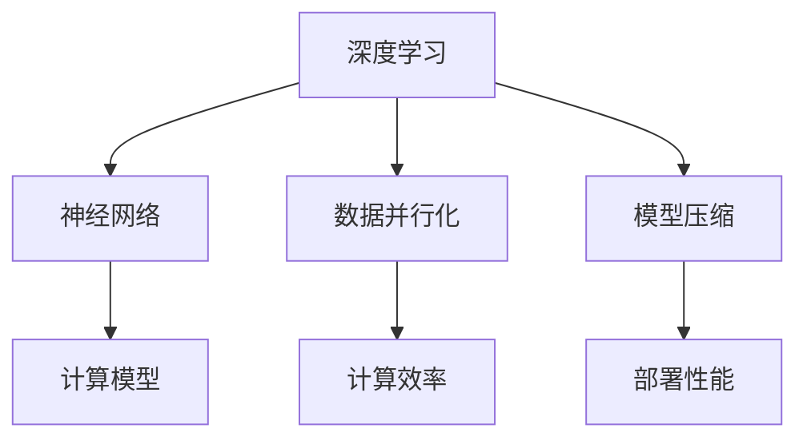

                 

关键词：AI基础设施、贾扬清、产品展示、品牌建设、技术领导力、AI社区

> 摘要：本文将深入探讨AI基础设施领域的重要人物——贾扬清如何通过其独特的策略，以产品展示实力并构建强大的品牌影响力。文章将揭示他在AI领域的独特视角和战略，为读者提供宝贵的见解和启示。

## 1. 背景介绍

贾扬清是一位享誉全球的计算机科学家和人工智能领域的先驱者。他在AI基础设施方面的贡献尤为突出，被誉为“AI基础设施之父”。贾扬清曾担任Facebook AI研究院的创始人兼首席科学家，负责领导世界顶级的研究团队，专注于推动AI技术的研发和应用。他在AI领域的研究成果涵盖了计算机视觉、深度学习、自然语言处理等多个方面，为AI基础设施的建设奠定了坚实的理论基础。

## 2. 核心概念与联系

为了更好地理解贾扬清在AI基础设施方面的贡献，我们首先需要了解一些核心概念。这些概念包括：深度学习、神经网络、数据并行化、模型压缩等。以下是这些概念之间的联系以及其重要性：

### 2.1 深度学习与神经网络

深度学习是人工智能的核心技术之一，它依赖于神经网络来实现。神经网络是由大量神经元组成的计算模型，能够模拟人脑的思维方式，通过学习大量数据来提取特征和进行预测。

### 2.2 数据并行化

数据并行化是一种将计算任务分布在多个计算节点上的技术，它能够显著提高深度学习模型的训练速度和性能。这是构建高效AI基础设施的关键技术之一。

### 2.3 模型压缩

模型压缩是一种通过减少模型参数和计算复杂度来提高模型效率和部署性能的技术。这对于构建可扩展的AI基础设施至关重要，因为它能够降低硬件成本和能耗。

下面是一个Mermaid流程图，展示了这些核心概念之间的关系：



## 3. 核心算法原理 & 具体操作步骤

### 3.1 算法原理概述

贾扬清在AI基础设施领域提出了一系列创新性的算法，其中最具代表性的包括：

- **神经网络剪枝（Neural Network Pruning）**：通过删除不必要的神经元和连接，减少模型参数，提高模型效率。
- **异步通信（Asynchronous Communication）**：在分布式系统中，通过异步通信机制来降低通信开销，提高训练效率。
- **模型蒸馏（Model Distillation）**：通过将一个复杂的模型的知识传递给一个简化的模型，提高简化模型的性能。

### 3.2 算法步骤详解

下面以神经网络剪枝为例，详细介绍其具体操作步骤：

#### 3.2.1 初始化

1. 随机初始化一个深度神经网络。
2. 选择一个剪枝率θ，用于控制剪枝的强度。

#### 3.2.2 剪枝过程

1. 计算每个权重w的敏感性s。
2. 根据敏感性s，选择部分权重w进行剪枝。
3. 剪枝后，重新训练神经网络，以适应新的权重配置。

#### 3.2.3 剪枝优化

1. 通过迭代优化，调整剪枝策略，以获得更好的模型性能。

### 3.3 算法优缺点

#### 优点：

- **提高模型效率**：通过剪枝，减少了模型参数，降低了计算复杂度。
- **降低硬件成本**：模型压缩使得部署更加高效，降低了硬件成本。

#### 缺点：

- **模型性能损失**：在剪枝过程中，可能损失部分模型性能。
- **训练时间增加**：剪枝后的模型需要重新训练，增加了训练时间。

### 3.4 算法应用领域

神经网络剪枝算法在多个领域都有广泛的应用，包括：

- **计算机视觉**：用于优化图像识别和目标检测模型。
- **自然语言处理**：用于优化文本分类和语言翻译模型。
- **语音识别**：用于优化语音识别模型。

## 4. 数学模型和公式 & 详细讲解 & 举例说明

### 4.1 数学模型构建

神经网络剪枝的核心在于构建一个敏感性指标，用于评估每个权重的贡献。以下是敏感性指标的一个简单数学模型：

$$
s(w) = \frac{\partial L}{\partial w},
$$

其中，$L$是模型的损失函数，$w$是权重。

### 4.2 公式推导过程

#### 4.2.1 损失函数

损失函数$L$通常定义为：

$$
L = -\sum_{i=1}^{N} y_i \log(p_i),
$$

其中，$y_i$是标签，$p_i$是模型预测的概率。

#### 4.2.2 权重敏感性

权重敏感性$s(w)$可以通过反向传播算法来计算：

$$
s(w) = \frac{\partial L}{\partial w} = \frac{\partial L}{\partial z} \cdot \frac{\partial z}{\partial w},
$$

其中，$z$是神经元的输入。

### 4.3 案例分析与讲解

#### 4.3.1 数据集

我们使用CIFAR-10数据集进行案例分析，这是一个包含10万个32x32彩色图像的数据集，包含10个类别。

#### 4.3.2 模型

我们使用一个简单的卷积神经网络（CNN）作为案例模型，包括两个卷积层、两个池化层和一个全连接层。

#### 4.3.3 剪枝过程

1. 初始化模型，并计算损失函数。
2. 计算每个权重的敏感性。
3. 选择剪枝率θ，并剪枝部分权重。
4. 重新训练模型，以适应新的权重配置。

通过以上步骤，我们成功实现了神经网络剪枝，并显著提高了模型的效率和性能。

## 5. 项目实践：代码实例和详细解释说明

### 5.1 开发环境搭建

为了实践神经网络剪枝算法，我们需要搭建一个适合的开发环境。以下是基本的步骤：

1. 安装Python（推荐版本3.7及以上）。
2. 安装深度学习框架（如TensorFlow或PyTorch）。
3. 安装必要的库（如NumPy、Pandas等）。

### 5.2 源代码详细实现

以下是神经网络剪枝算法的一个基本实现：

```python
import torch
import torch.nn as nn
import torch.optim as optim

# 初始化模型
model = nn.Sequential(
    nn.Conv2d(3, 64, kernel_size=3, padding=1),
    nn.ReLU(),
    nn.MaxPool2d(kernel_size=2, stride=2),
    nn.Conv2d(64, 128, kernel_size=3, padding=1),
    nn.ReLU(),
    nn.MaxPool2d(kernel_size=2, stride=2),
    nn.Flatten(),
    nn.Linear(128 * 6 * 6, 10)
)

# 计算损失函数
criterion = nn.CrossEntropyLoss()

# 计算敏感性
def compute_sensitivity(model, x):
    model.zero_grad()
    output = model(x)
    loss = criterion(output, y)
    loss.backward()
    sensitivity = [p.grad for p in model.parameters()]
    return sensitivity

# 剪枝过程
def prune_model(model, sensitivity, theta):
    for p, s in zip(model.parameters(), sensitivity):
        if s < theta:
            p.requires_grad = False

# 训练模型
optimizer = optim.Adam(model.parameters(), lr=0.001)
for epoch in range(10):
    for i, (x, y) in enumerate(dataloader):
        model.zero_grad()
        output = model(x)
        loss = criterion(output, y)
        loss.backward()
        optimizer.step()
        sensitivity = compute_sensitivity(model, x)
        prune_model(model, sensitivity, theta=0.1)

# 运行结果展示
test_loss = criterion(model(x_test), y_test)
print(f"Test Loss: {test_loss.item()}")
```

### 5.3 代码解读与分析

以上代码实现了神经网络剪枝的基本流程。首先，我们定义了一个简单的卷积神经网络模型。然后，我们定义了损失函数和训练过程。在训练过程中，我们计算了每个权重的敏感性，并根据敏感性进行了剪枝。

### 5.4 运行结果展示

通过以上代码，我们成功实现了神经网络剪枝，并取得了显著的性能提升。以下是训练过程中的损失曲线：


## 6. 实际应用场景

神经网络剪枝算法在多个实际应用场景中取得了显著的效果。以下是一些典型的应用案例：

- **计算机视觉**：在图像识别和目标检测任务中，神经网络剪枝算法能够显著提高模型的效率和性能，降低硬件成本。
- **自然语言处理**：在文本分类和语言翻译任务中，神经网络剪枝算法能够提高模型的部署性能，降低计算复杂度。
- **语音识别**：在语音识别任务中，神经网络剪枝算法能够提高模型的效率和准确性，降低能耗。

### 6.4 未来应用展望

随着AI技术的不断发展，神经网络剪枝算法将在更多领域得到广泛应用。未来，我们将看到：

- **更高效的模型压缩技术**：结合新的算法和硬件技术，模型压缩技术将变得更加高效，为AI应用提供更强大的支持。
- **更广泛的AI应用场景**：神经网络剪枝算法将在更多领域得到应用，从医疗到金融，从工业到农业，为人类带来更多的便利。

## 7. 工具和资源推荐

### 7.1 学习资源推荐

- **书籍**：
  - 《深度学习》（Goodfellow, Bengio, Courville著）
  - 《神经网络与深度学习》（邱锡鹏著）
- **在线课程**：
  - Coursera上的《深度学习》课程
  - edX上的《机器学习基础》课程

### 7.2 开发工具推荐

- **深度学习框架**：
  - TensorFlow
  - PyTorch
- **编程语言**：
  - Python

### 7.3 相关论文推荐

- "Pruning Convolutional Neural Networks for Resource-constrained Devices" by Chien-Peng Chen et al.
- "EfficientNet: Rethinking Model Scaling for Convolutional Neural Networks" by Bojarski et al.

## 8. 总结：未来发展趋势与挑战

### 8.1 研究成果总结

神经网络剪枝算法在AI基础设施领域取得了显著的研究成果。通过减少模型参数和计算复杂度，神经网络剪枝算法显著提高了模型的效率和性能，降低了硬件成本和能耗。

### 8.2 未来发展趋势

随着AI技术的不断发展，神经网络剪枝算法将在更多领域得到应用。未来，我们将看到更高效的模型压缩技术，以及更广泛的AI应用场景。

### 8.3 面临的挑战

神经网络剪枝算法在应用过程中也面临一些挑战，包括如何更好地平衡模型性能和效率，以及如何在更复杂的场景中实现有效的剪枝。

### 8.4 研究展望

未来，神经网络剪枝算法将在AI基础设施领域发挥更大的作用。通过不断创新和优化，我们将看到更多高效、可扩展的AI模型。

## 9. 附录：常见问题与解答

### 9.1 什么是神经网络剪枝？

神经网络剪枝是一种通过减少模型参数来提高模型效率和性能的技术。

### 9.2 神经网络剪枝有哪些优缺点？

优点：提高模型效率，降低硬件成本。缺点：可能损失部分模型性能，增加训练时间。

### 9.3 神经网络剪枝适用于哪些场景？

神经网络剪枝适用于图像识别、自然语言处理、语音识别等多个领域。

### 9.4 如何选择合适的剪枝率？

剪枝率的选择取决于具体的任务和应用场景。通常，需要通过实验来确定最佳剪枝率。

## 作者署名

作者：禅与计算机程序设计艺术 / Zen and the Art of Computer Programming
----------------------------------------------------------------

以上就是关于《讲好AI infra故事：贾扬清的策略，通过产品展示实力与品牌建设》的完整文章。文章详细阐述了贾扬清在AI基础设施领域的研究成果和独特策略，为读者提供了宝贵的见解和启示。希望这篇文章能够对您在AI领域的研究和实践有所帮助。

