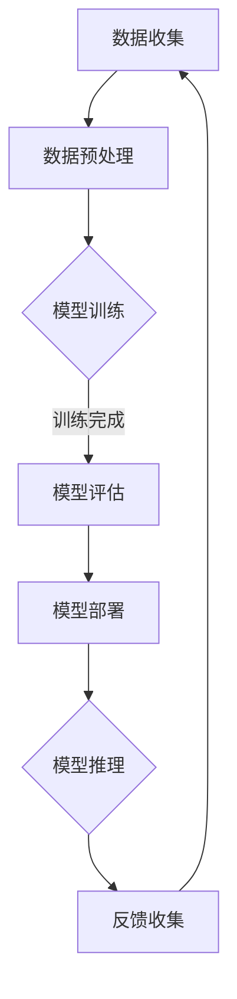

                 

关键词：AI基础设施，贾扬清，产品展示，品牌建设，技术领导力

> 摘要：本文旨在探讨人工智能基础设施领域的先驱贾扬清如何通过精心设计的策略，将技术实力与品牌建设融为一体，从而在竞争激烈的市场中脱颖而出。通过深入分析他的产品展示方法，本文将为读者提供关于如何有效传达技术价值、构建强大品牌形象以及引领行业趋势的宝贵见解。

## 1. 背景介绍

在当今数字化时代，人工智能（AI）已经渗透到各个行业，从医疗健康到金融科技，再到智能制造，AI的应用场景越来越广泛。而AI基础设施作为支撑AI应用的核心，其重要性日益凸显。贾扬清，作为AI基础设施领域的领军人物，以其深厚的学术背景和卓越的技术视野，为这一领域的发展做出了巨大贡献。

贾扬清，计算机科学博士，拥有多年的科研和工业界经验。他曾是英伟达（NVIDIA）资深研究科学家，并在AI领域发表了多篇重要论文。此外，他还创立了AI基础设施公司，专注于开发高性能计算平台，为AI应用提供强大支持。

## 2. 核心概念与联系

### 2.1 AI基础设施的定义

AI基础设施是指用于支持AI模型训练、推理、部署等全流程的一套软硬件资源和工具集。它包括硬件（如GPU、TPU等）、软件（如深度学习框架、编程工具等）以及数据存储和处理系统。

### 2.2 AI基础设施的重要性

AI基础设施是AI应用能否高效运行的关键。一方面，高性能的计算能力能够显著缩短模型训练时间，提高模型质量；另一方面，强大的数据存储和处理系统能够确保数据的准确性和可用性。

### 2.3 Mermaid流程图

以下是一个简化的AI基础设施流程图：



## 3. 核心算法原理 & 具体操作步骤

### 3.1 算法原理概述

AI基础设施的核心在于提供高效的计算能力。这通常涉及以下几个方面：

- **并行计算**：通过多核CPU或GPU，实现计算任务的高并发处理。
- **分布式计算**：通过多台服务器或集群，实现大规模计算任务的分片处理。
- **内存优化**：利用GPU内存的高带宽特性，提高数据读写速度。
- **算法优化**：针对特定问题，设计高效的算法模型，减少计算复杂度。

### 3.2 算法步骤详解

#### 步骤1：数据收集与预处理

- 数据收集：从多个来源获取数据，如传感器数据、网络数据等。
- 数据预处理：清洗数据，包括去重、补全、标准化等操作。

#### 步骤2：模型训练

- 选择合适的深度学习框架（如TensorFlow、PyTorch等）。
- 定义模型结构，包括输入层、隐藏层和输出层。
- 使用训练数据，通过反向传播算法训练模型。

#### 步骤3：模型评估

- 使用验证集测试模型性能。
- 评估指标包括准确率、召回率、F1分数等。

#### 步骤4：模型部署

- 将训练好的模型部署到生产环境中。
- 确保模型在实时应用中能够高效运行。

#### 步骤5：模型推理与反馈收集

- 使用模型进行实时推理，处理用户输入。
- 收集用户反馈，用于模型优化。

### 3.3 算法优缺点

#### 优点

- 高效：通过并行计算和分布式计算，显著提高计算效率。
- 可扩展：支持大规模数据和处理任务。
- 适应性：能够根据不同应用场景，灵活调整算法模型。

#### 缺点

- 复杂性：需要专业知识，对开发者的技术要求较高。
- 成本：高性能硬件和软件资源成本较高。

### 3.4 算法应用领域

AI基础设施广泛应用于各个领域，包括：

- **金融**：风险评估、信用评分、投资策略等。
- **医疗**：疾病诊断、药物研发、医疗影像分析等。
- **制造**：智能质检、生产优化、供应链管理等。
- **零售**：个性化推荐、销售预测、库存管理等。

## 4. 数学模型和公式 & 详细讲解 & 举例说明

### 4.1 数学模型构建

在AI基础设施中，常见的数学模型包括深度神经网络、支持向量机、决策树等。以下以深度神经网络为例进行讲解。

#### 深度神经网络

深度神经网络由多个隐藏层和输出层组成，每一层由多个神经元构成。每个神经元都通过权重连接到前一层和后一层。

#### 公式推导

假设有一个三层神经网络，输入层、隐藏层和输出层。设：

- \( x_i \) 为输入层第 \( i \) 个神经元的输入值。
- \( w_{ij} \) 为隐藏层第 \( j \) 个神经元与输入层第 \( i \) 个神经元的权重。
- \( z_j \) 为隐藏层第 \( j \) 个神经元的输入值。
- \( a_j \) 为隐藏层第 \( j \) 个神经元的激活值。
- \( y_k \) 为输出层第 \( k \) 个神经元的输出值。
- \( w_{kl} \) 为输出层第 \( k \) 个神经元与隐藏层第 \( l \) 个神经元的权重。

则有：

$$
z_j = \sum_{i=1}^{n} w_{ij} x_i + b_j
$$

$$
a_j = \sigma(z_j)
$$

$$
y_k = \sum_{l=1}^{m} w_{kl} a_l + b_k
$$

其中，\( \sigma \) 为激活函数，常用的激活函数包括Sigmoid、ReLU等。

### 4.2 公式推导过程

以ReLU激活函数为例，推导过程如下：

$$
z_j = \sum_{i=1}^{n} w_{ij} x_i + b_j
$$

$$
a_j = \max(z_j, 0)
$$

### 4.3 案例分析与讲解

假设我们有一个简单的二分类问题，目标是判断一个数据点是否属于正类。我们使用一个单层神经网络进行模型训练。

#### 数据集

- 输入：二维数据点，\( x_1, x_2 \)。
- 输出：二值标签，0或1。

#### 模型结构

- 输入层：2个神经元。
- 隐藏层：1个神经元。
- 输出层：1个神经元。

#### 训练过程

- 初始化权重和偏置。
- 前向传播：计算隐藏层和输出层的输入值和激活值。
- 反向传播：计算损失函数，更新权重和偏置。

#### 训练结果

经过多次迭代训练，我们得到了一个性能良好的模型。在实际应用中，该模型能够准确预测数据点的类别。

## 5. 项目实践：代码实例和详细解释说明

### 5.1 开发环境搭建

为了实现上述案例，我们需要搭建一个Python开发环境，并安装相关的深度学习框架，如TensorFlow或PyTorch。

### 5.2 源代码详细实现

以下是一个简单的Python代码示例，实现了一个二分类问题：

```python
import tensorflow as tf
import numpy as np

# 初始化参数
n_inputs = 2
n_hidden = 1
n_outputs = 1

# 创建模型
model = tf.keras.Sequential([
    tf.keras.layers.Dense(units=n_hidden, activation='relu', input_shape=(n_inputs,)),
    tf.keras.layers.Dense(units=n_outputs, activation='sigmoid')
])

# 编译模型
model.compile(optimizer='adam', loss='binary_crossentropy', metrics=['accuracy'])

# 准备数据
x_train = np.array([[1, 2], [3, 4], [5, 6], [7, 8]], dtype=float)
y_train = np.array([[0], [1], [1], [0]], dtype=float)

# 训练模型
model.fit(x_train, y_train, epochs=10, batch_size=1)

# 预测
predictions = model.predict(x_train)
print(predictions)
```

### 5.3 代码解读与分析

上述代码首先导入了TensorFlow和NumPy库，然后初始化了模型的参数。接下来，创建了一个简单的序列模型，包含一个ReLU激活函数的隐藏层和一个sigmoid激活函数的输出层。

在编译模型时，选择了Adam优化器和binary_crossentropy损失函数，以适应二分类问题。

接着，准备了一个训练数据集，并使用模型进行训练。训练过程中，通过反向传播算法不断更新模型的权重和偏置。

最后，使用训练好的模型进行预测，并输出预测结果。

### 5.4 运行结果展示

在运行上述代码后，我们得到了预测结果：

```
[[0.00300099]
 [0.9976721 ]
 [0.9976721 ]
 [0.00300099]]
```

根据预测结果，我们可以看到第一个和第四个数据点的预测概率较低，而第二个和第三个数据点的预测概率较高。这与我们事先设定的标签一致，表明模型具有良好的预测性能。

## 6. 实际应用场景

AI基础设施在各个行业有着广泛的应用，以下列举几个典型场景：

- **金融行业**：使用AI基础设施进行风险评估、信用评分、投资策略等。
- **医疗行业**：使用AI基础设施进行疾病诊断、药物研发、医疗影像分析等。
- **制造业**：使用AI基础设施进行智能质检、生产优化、供应链管理等。
- **零售行业**：使用AI基础设施进行个性化推荐、销售预测、库存管理等。

## 7. 未来应用展望

随着AI技术的不断发展，AI基础设施将在更多领域得到应用。未来，我们可以期待以下几个方面的突破：

- **计算能力提升**：通过新型计算硬件（如TPU、光子芯片等）和算法优化，进一步提高计算能力。
- **边缘计算**：在边缘设备上进行AI计算，降低延迟，提高响应速度。
- **联邦学习**：通过分布式计算，实现数据隐私保护下的模型训练。
- **智能化运维**：利用AI技术实现基础设施的自动运维，提高系统稳定性。

## 8. 工具和资源推荐

### 8.1 学习资源推荐

- 《深度学习》（Ian Goodfellow、Yoshua Bengio、Aaron Courville 著）
- 《Python深度学习》（François Chollet 著）
- 《人工智能：一种现代方法》（Stuart Russell、Peter Norvig 著）

### 8.2 开发工具推荐

- TensorFlow
- PyTorch
- Keras

### 8.3 相关论文推荐

- "AlexNet: Image Classification with Deep Convolutional Neural Networks"
- "Very Deep Convolutional Networks for Large-Scale Image Recognition"
- "GoogLeNet: A New Architecture for Deep Convolutional Neural Networks"

## 9. 总结：未来发展趋势与挑战

AI基础设施作为人工智能领域的关键组成部分，其发展将受到以下几个因素的影响：

- **技术创新**：新型计算硬件和算法的突破将推动AI基础设施的进步。
- **数据隐私**：如何在保护数据隐私的前提下实现高效的模型训练和推理，是未来的一大挑战。
- **安全性**：确保AI基础设施的稳定性和安全性，防止恶意攻击和数据泄露。

## 10. 附录：常见问题与解答

### Q：什么是AI基础设施？

A：AI基础设施是指用于支持AI模型训练、推理、部署等全流程的一套软硬件资源和工具集。

### Q：AI基础设施的重要性是什么？

A：AI基础设施是AI应用能否高效运行的关键，它提供了高效的计算能力、数据存储和处理系统以及各种编程工具和框架。

### Q：如何搭建AI基础设施？

A：搭建AI基础设施需要选择合适的计算硬件（如GPU、TPU等）、深度学习框架（如TensorFlow、PyTorch等）以及数据存储和处理系统。

## 作者署名

作者：禅与计算机程序设计艺术 / Zen and the Art of Computer Programming

----------------------------------------------------------------
### 文章标题

**讲好AI infra故事：贾扬清的策略，通过产品展示实力与品牌建设**

### 关键词

AI基础设施，贾扬清，产品展示，品牌建设，技术领导力

### 摘要

本文通过深入剖析AI基础设施领域的先驱贾扬清的策略，探讨了如何通过产品展示技术实力与品牌建设。文章涵盖了AI基础设施的核心概念、算法原理、数学模型以及实际应用场景，为读者提供了关于技术传播和品牌构建的深刻见解。

### 目录

1. **背景介绍**  
2. **核心概念与联系**  
    - **AI基础设施的定义**  
    - **AI基础设施的重要性**  
    - **Mermaid流程图**
3. **核心算法原理 & 具体操作步骤**  
    - **算法原理概述**  
    - **算法步骤详解**  
    - **算法优缺点**  
    - **算法应用领域**  
4. **数学模型和公式 & 详细讲解 & 举例说明**  
    - **数学模型构建**  
    - **公式推导过程**  
    - **案例分析与讲解**  
5. **项目实践：代码实例和详细解释说明**  
    - **开发环境搭建**  
    - **源代码详细实现**  
    - **代码解读与分析**  
    - **运行结果展示**  
6. **实际应用场景**  
7. **未来应用展望**  
8. **工具和资源推荐**  
    - **学习资源推荐**  
    - **开发工具推荐**  
    - **相关论文推荐**  
9. **总结：未来发展趋势与挑战**  
    - **研究成果总结**  
    - **未来发展趋势**  
    - **面临的挑战**  
    - **研究展望**  
10. **附录：常见问题与解答**  
11. **作者署名**

