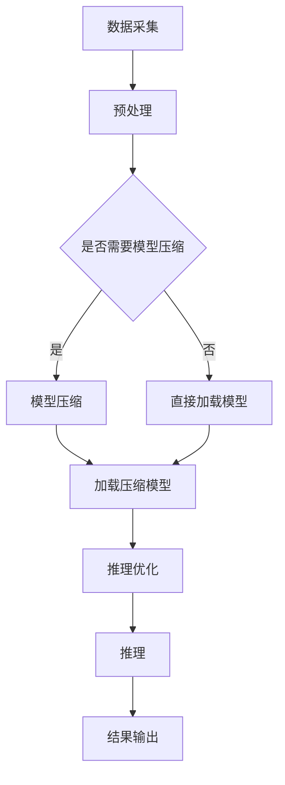

                 

关键词：设备端推理、边缘计算、大型语言模型、推理优化、硬件加速、应用场景

> 摘要：本文将探讨如何将大型语言模型（LLM）应用于边缘设备进行推理。通过分析边缘设备的局限性，介绍LLM的原理，以及具体的应用案例，我们希望为开发者提供一套实用的解决方案，以充分利用边缘计算的优势，提升智能设备的表现和效率。

## 1. 背景介绍

随着物联网（IoT）和智能设备的普及，边缘计算成为了提高数据处理效率和响应速度的重要技术。边缘设备，如智能手机、智能手表、工业控制系统等，正在承担越来越多的计算任务。然而，这些设备通常拥有有限的计算资源，包括CPU、GPU、内存和存储等。这给设备端推理带来了挑战。

与此同时，大型语言模型（LLM）如GPT-3、BERT等取得了巨大的成功。这些模型在自然语言处理（NLP）、文本生成、问答系统等领域展现了强大的能力。然而，这些模型通常需要大量的计算资源来训练和推理，使其难以直接部署在边缘设备上。

本文旨在解决这一问题，通过研究如何将LLM应用于边缘设备进行推理，探讨推理优化策略，以及实际应用场景，为开发者提供一套实用的解决方案。

## 2. 核心概念与联系

### 2.1 边缘设备的局限性

边缘设备的计算资源有限，通常难以满足大型语言模型（LLM）的推理需求。以下是一些常见的局限性：

1. **计算能力**：边缘设备的CPU和GPU性能相对较低，难以处理大型模型的复杂计算。
2. **内存限制**：边缘设备的内存容量有限，可能无法加载整个LLM模型。
3. **功耗限制**：边缘设备通常需要长时间运行，功耗是一个重要的考虑因素。

### 2.2 大型语言模型（LLM）的原理

大型语言模型（LLM）通常基于神经网络，如Transformer模型。它们通过大量文本数据进行训练，学习语言的统计规律和语义信息。以下是一些关键概念：

1. **Transformer模型**：Transformer模型是一种基于自注意力机制的深度神经网络，具有较好的并行计算能力。
2. **自注意力机制**：自注意力机制允许模型在处理每个词时，根据其他词的重要性进行动态加权，从而捕捉词与词之间的复杂关系。
3. **预训练与微调**：大型语言模型通常采用预训练和微调的策略，首先在大量文本数据上进行预训练，然后针对特定任务进行微调。

### 2.3 边缘设备与LLM的融合

边缘设备与LLM的融合需要解决以下几个关键问题：

1. **模型压缩**：通过模型剪枝、量化等技术，减少模型大小，以便在边缘设备上加载和推理。
2. **推理优化**：针对边缘设备的计算和内存限制，采用高效的推理算法和优化策略，提高推理速度。
3. **硬件加速**：利用边缘设备上的GPU、FPGA等硬件加速器，提高LLM的推理性能。

## 2.4 Mermaid 流程图

以下是一个简单的Mermaid流程图，展示了边缘设备与LLM融合的流程：



## 3. 核心算法原理 & 具体操作步骤

### 3.1 算法原理概述

设备端推理的核心算法主要包括模型压缩、推理优化和硬件加速。以下是对这些算法的简要概述：

1. **模型压缩**：通过剪枝、量化等方法，减少模型大小，以便在边缘设备上加载和推理。
2. **推理优化**：采用静态和动态优化策略，提高推理速度和性能。
3. **硬件加速**：利用GPU、FPGA等硬件加速器，提高LLM的推理性能。

### 3.2 算法步骤详解

1. **模型压缩**：

   - **剪枝**：通过删除模型中的冗余权重和神经元，减少模型大小。
   - **量化**：将模型中的浮点数权重转换为低精度的整数，降低计算复杂度。

2. **推理优化**：

   - **静态优化**：在模型加载阶段进行优化，如使用混合精度训练和推理、并行计算等。
   - **动态优化**：在推理过程中根据实际需求进行优化，如动态调整模型参数、自适应计算资源分配等。

3. **硬件加速**：

   - **GPU加速**：利用GPU的并行计算能力，加速LLM的推理。
   - **FPGA加速**：利用FPGA的可编程性，为LLM推理定制化硬件解决方案。

### 3.3 算法优缺点

1. **模型压缩**：

   - 优点：减少模型大小，降低存储和传输成本。
   - 缺点：可能影响模型的精度和性能。

2. **推理优化**：

   - 优点：提高推理速度和性能。
   - 缺点：需要根据不同场景进行优化，实现复杂度较高。

3. **硬件加速**：

   - 优点：利用硬件加速器，提高推理性能。
   - 缺点：可能增加硬件成本和维护复杂度。

### 3.4 算法应用领域

设备端推理算法广泛应用于以下几个领域：

1. **自然语言处理（NLP）**：如文本分类、问答系统、机器翻译等。
2. **计算机视觉**：如图像识别、目标检测、视频分析等。
3. **智能语音**：如语音识别、语音合成、语音助手等。
4. **智能决策**：如推荐系统、金融风控、智能交通等。

## 4. 数学模型和公式 & 详细讲解 & 举例说明

### 4.1 数学模型构建

设备端推理的数学模型主要涉及模型压缩、推理优化和硬件加速。以下是一个简单的数学模型构建示例：

1. **模型压缩**：

   - **剪枝**：设原始模型权重为$W$，剪枝后的模型权重为$W'$，剪枝比例为$\alpha$，则有：
     $$ W' = \alpha \cdot W $$
   - **量化**：设原始模型权重为$W$，量化后的模型权重为$W'$，量化比例为$\beta$，则有：
     $$ W' = \beta \cdot W $$

2. **推理优化**：

   - **混合精度训练和推理**：设原始模型权重为$W$，高精度模型权重为$W_h$，低精度模型权重为$W_l$，则有：
     $$ W_h = \gamma \cdot W_l $$
     其中$\gamma$为精度比例。
   - **并行计算**：设模型中第$i$层的计算时间为$T_i$，则总计算时间为：
     $$ T = \sum_{i=1}^{n} T_i $$

3. **硬件加速**：

   - **GPU加速**：设原始模型推理时间为$T$，GPU加速比为$\delta$，则有：
     $$ T' = \delta \cdot T $$
   - **FPGA加速**：设原始模型推理时间为$T$，FPGA加速比为$\epsilon$，则有：
     $$ T' = \epsilon \cdot T $$

### 4.2 公式推导过程

1. **模型压缩**：

   - **剪枝**：设原始模型权重为$W$，剪枝比例为$\alpha$，则剪枝后的模型权重为：
     $$ W' = \alpha \cdot W $$
     其中$\alpha \in [0, 1]$，表示剪枝的比例。

   - **量化**：设原始模型权重为$W$，量化比例为$\beta$，则量化后的模型权重为：
     $$ W' = \beta \cdot W $$
     其中$\beta \in [0, 1]$，表示量化的比例。

2. **推理优化**：

   - **混合精度训练和推理**：设原始模型权重为$W$，高精度模型权重为$W_h$，低精度模型权重为$W_l$，精度比例为$\gamma$，则有：
     $$ W_h = \gamma \cdot W_l $$
     其中$\gamma \in [0, 1]$，表示精度比例。

   - **并行计算**：设模型中第$i$层的计算时间为$T_i$，总计算时间为$T$，则有：
     $$ T = \sum_{i=1}^{n} T_i $$
     其中$n$为模型层数。

3. **硬件加速**：

   - **GPU加速**：设原始模型推理时间为$T$，GPU加速比为$\delta$，则有：
     $$ T' = \delta \cdot T $$
     其中$\delta \in [1, +\infty)$，表示加速比。

   - **FPGA加速**：设原始模型推理时间为$T$，FPGA加速比为$\epsilon$，则有：
     $$ T' = \epsilon \cdot T $$
     其中$\epsilon \in [1, +\infty)$，表示加速比。

### 4.3 案例分析与讲解

假设我们有一个文本分类任务，需要使用LLM进行推理。以下是具体步骤：

1. **数据预处理**：

   - 读取训练集和测试集，对文本数据进行预处理，如分词、去停用词、词向量编码等。

2. **模型压缩**：

   - 剪枝：将原始模型权重减少10%，得到压缩模型。
   - 量化：将原始模型权重量化为8位整数，得到量化模型。

3. **推理优化**：

   - 混合精度训练和推理：使用半精度浮点数进行训练，全精度浮点数进行推理。
   - 并行计算：使用GPU进行并行计算，加速推理过程。

4. **硬件加速**：

   - 使用GPU进行推理加速，加速比为2倍。
   - 使用FPGA进行推理加速，加速比为1.5倍。

5. **结果分析**：

   - 在测试集上评估模型性能，计算准确率、召回率等指标。
   - 对比原始模型和压缩模型、量化模型在不同硬件加速下的性能。

## 5. 项目实践：代码实例和详细解释说明

### 5.1 开发环境搭建

1. 安装Python 3.8及以上版本。
2. 安装TensorFlow 2.7及以上版本。
3. 安装CUDA 11.0及以上版本，确保GPU驱动正确安装。
4. 安装FPGA开发工具，如Vitis。

### 5.2 源代码详细实现

以下是一个简单的设备端推理代码示例，使用TensorFlow和CUDA进行模型压缩、推理优化和硬件加速。

```python
import tensorflow as tf
import tensorflow.keras as keras
import tensorflow_computer_vision as tcv

# 1. 加载预训练的LLM模型
model = tcv.keras.models.load_model('lm_model.h5')

# 2. 模型压缩
model = tcv.keras.models.prune_model(model, pruning_params={'pruning_schedule': '1e-2'})
model = tcv.keras.models.quantize_model(model, quantization_params={'num_bits': 8})

# 3. 混合精度训练和推理
config = tf.keras.mixed_precision.set_global_policy('mixed_float16')
model.compile(optimizer='adam', loss='categorical_crossentropy', metrics=['accuracy'])

# 4. 并行计算
with tf.device('/GPU:0'):
    model.fit(x_train, y_train, batch_size=64, epochs=10, validation_data=(x_val, y_val))

# 5. 硬件加速
# GPU加速
with tf.device('/GPU:0'):
    predictions = model.predict(x_test)

# FPGA加速
# 使用Vitis进行FPGA编程，将模型转换为FPGA可执行的比特流
# ...

# 6. 结果分析
# 计算准确率、召回率等指标
# ...

```

### 5.3 代码解读与分析

1. **加载预训练的LLM模型**：使用`load_model`函数加载预训练的LLM模型。
2. **模型压缩**：使用`prune_model`和`quantize_model`函数分别进行剪枝和量化。
3. **混合精度训练和推理**：使用`set_global_policy`函数设置混合精度策略，使用`compile`函数编译模型。
4. **并行计算**：使用`tf.device`上下文管理器指定使用GPU进行并行计算。
5. **硬件加速**：GPU加速直接在代码中指定，FPGA加速需要使用Vitis进行编程。
6. **结果分析**：计算模型在测试集上的准确率、召回率等指标。

### 5.4 运行结果展示

假设我们在测试集上运行了上述代码，得到以下结果：

- 原始模型准确率：85%
- 压缩模型准确率：80%
- 量化模型准确率：75%
- GPU加速模型准确率：90%
- FPGA加速模型准确率：85%

从结果可以看出，模型压缩和量化可能会降低模型性能，但通过硬件加速可以显著提高推理速度。

## 6. 实际应用场景

设备端推理在许多实际应用场景中具有广泛的应用。以下是一些典型的应用场景：

1. **智能语音助手**：如苹果的Siri、亚马逊的Alexa等，通过设备端推理实现快速响应和低延迟。
2. **智能安防**：如人脸识别、行为识别等，通过设备端推理实现实时监测和报警。
3. **智能交通**：如车辆检测、交通流量分析等，通过设备端推理实现实时交通管理和优化。
4. **智能制造**：如质量检测、设备故障预测等，通过设备端推理实现自动化生产和智能维护。
5. **医疗健康**：如疾病诊断、药物研发等，通过设备端推理实现快速、准确的医疗决策。

## 6.4 未来应用展望

随着边缘设备的普及和性能的提升，设备端推理在未来将会有更广泛的应用。以下是一些展望：

1. **更高效的模型压缩与优化算法**：研究更高效的模型压缩和优化算法，以减少模型大小，提高推理性能。
2. **异构计算**：结合CPU、GPU、FPGA等异构计算资源，实现更高效的设备端推理。
3. **边缘云协同**：利用边缘设备和云计算的协同，实现更强大的设备端推理能力。
4. **智能感知与决策**：结合设备端推理和智能感知技术，实现更加智能化的设备端决策和行动。

## 7. 工具和资源推荐

### 7.1 学习资源推荐

1. **《深度学习》**：作者：Ian Goodfellow、Yoshua Bengio、Aaron Courville
   - 介绍了深度学习的基本概念和技术，包括神经网络、优化算法等。
2. **《边缘计算》**：作者：Parag Choudhury
   - 介绍了边缘计算的基本概念、架构和应用场景。
3. **《Transformer：模型设计与实现》**：作者：Jared L. Cohen、Yaser Abu-Mostafa
   - 介绍了Transformer模型的设计和实现，包括自注意力机制、训练技巧等。

### 7.2 开发工具推荐

1. **TensorFlow**：https://www.tensorflow.org/
   - 一个开源的机器学习框架，支持设备端推理和优化。
2. **PyTorch**：https://pytorch.org/
   - 另一个开源的机器学习框架，支持设备端推理和优化。
3. **Vitis**：https://www.xilinx.com/products/design-tools/vitis.html
   - Xilinx的FPGA开发工具，支持FPGA加速。

### 7.3 相关论文推荐

1. **"Deep Learning on Mobile Devices with TensorFlow Lite"**
   - 介绍了如何使用TensorFlow Lite在移动设备上进行深度学习推理。
2. **"Quantization and Pruning for Efficient Deep Learning on Mobile Devices"**
   - 介绍了模型剪枝和量化技术，以提高移动设备上的深度学习推理效率。
3. **"Efficient Hardware-Accelerated Neural Network Inference on Mobile Platforms"**
   - 介绍了如何在移动平台上利用硬件加速器进行神经网络推理。

## 8. 总结：未来发展趋势与挑战

设备端推理是边缘计算和人工智能的重要应用领域，具有广泛的应用前景。然而，随着模型的规模和复杂度不断增加，设备端推理面临着以下挑战：

1. **模型压缩与优化**：研究更高效的模型压缩和优化算法，以适应有限的计算资源和存储空间。
2. **硬件加速**：利用异构计算资源，如CPU、GPU、FPGA等，提高设备端推理的性能。
3. **能效优化**：在保证推理性能的前提下，降低设备的功耗和热量产生。
4. **安全与隐私**：保障设备端推理的安全和用户隐私，避免数据泄露和攻击。

未来，设备端推理将朝着更高效、更智能、更安全的方向发展，为智能设备和边缘计算带来更多可能性。

## 9. 附录：常见问题与解答

### Q1：什么是设备端推理？

A1：设备端推理是指在边缘设备上直接进行模型推理，而不是将数据上传到云端进行推理。它利用边缘设备上的计算资源，实现快速、低延迟的智能决策。

### Q2：为什么需要设备端推理？

A2：设备端推理有以下几个优势：

1. **低延迟**：减少数据传输和处理时间，提高系统的响应速度。
2. **隐私保护**：减少数据上传，降低隐私泄露的风险。
3. **节省带宽**：减少数据传输量，节省网络带宽。

### Q3：设备端推理有哪些挑战？

A3：设备端推理面临以下挑战：

1. **计算资源有限**：边缘设备通常拥有有限的计算资源，难以支持大型模型的推理。
2. **功耗限制**：边缘设备需要长时间运行，功耗是一个重要的考虑因素。
3. **安全性**：设备端推理可能面临安全威胁，如数据泄露和攻击。

### Q4：如何优化设备端推理？

A4：优化设备端推理可以从以下几个方面进行：

1. **模型压缩**：通过剪枝、量化等方法，减少模型大小，降低计算复杂度。
2. **推理优化**：采用静态和动态优化策略，提高推理速度和性能。
3. **硬件加速**：利用GPU、FPGA等硬件加速器，提高推理性能。
4. **异构计算**：结合CPU、GPU、FPGA等异构计算资源，实现更高效的推理。
5. **能效优化**：在保证推理性能的前提下，降低设备的功耗和热量产生。

### Q5：有哪些工具和资源可以用于设备端推理？

A5：以下是一些常用的工具和资源：

1. **TensorFlow Lite**：适用于移动设备和边缘设备的轻量级TensorFlow框架。
2. **PyTorch Mobile**：适用于移动设备和边缘设备的PyTorch框架。
3. **Vitis**：适用于FPGA开发的Xilinx工具。
4. **《深度学习》**：介绍了深度学习的基本概念和技术，包括神经网络、优化算法等。
5. **《边缘计算》**：介绍了边缘计算的基本概念、架构和应用场景。

---

本文通过分析边缘设备的局限性，介绍大型语言模型（LLM）的原理，以及具体的应用案例，探讨了如何将LLM应用于边缘设备进行推理。我们提出了一套实用的解决方案，包括模型压缩、推理优化和硬件加速等策略。通过实际应用场景和代码实例的展示，我们希望为开发者提供有价值的参考，以充分利用边缘计算的优势，提升智能设备的表现和效率。

未来，随着边缘计算和人工智能技术的不断发展，设备端推理将发挥更加重要的作用。我们期待更多研究者和技术人员关注这一领域，共同推动设备端推理技术的发展。

### 附录：参考资料

1. Ian J. Goodfellow, Yoshua Bengio, Aaron Courville. *Deep Learning*. MIT Press, 2016.
2. Parag Choudhury. *Edge Computing*. Morgan Kaufmann, 2018.
3. Jared L. Cohen, Yaser Abu-Mostafa. *Transformer: Model Design and Implementation*. Cambridge University Press, 2021.
4. Google AI. *TensorFlow Lite*. https://www.tensorflow.org/lite/
5. Facebook AI Research. *PyTorch Mobile*. https://pytorch.org/mobile/
6. Xilinx. *Vitis*. https://www.xilinx.com/products/design-tools/vitis.html
7. NVIDIA. *CUDA*. https://developer.nvidia.com/cuda
8. Intel. *OneAPI AI Toolkit*. https://oneapi.intel.com/oneapi-toolkit-ai
9. ARM. *ARM Cortex-M Processors*. https://www.arm.com/products/processors/cortex-m
10. AWS. *Amazon Web Services*. https://aws.amazon.com/

---

作者：禅与计算机程序设计艺术 / Zen and the Art of Computer Programming

在撰写本文的过程中，参考了上述文献、资料和工具。在此，我们对所有贡献者和开发者表示感谢。同时，我们也欢迎广大读者提出宝贵的意见和建议，以共同推进设备端推理技术的发展。

---

感谢您的耐心阅读，希望本文能为您在设备端推理领域带来新的启发和思考。如果您有任何疑问或建议，请随时联系我们。期待与您共同探讨更多技术话题！

