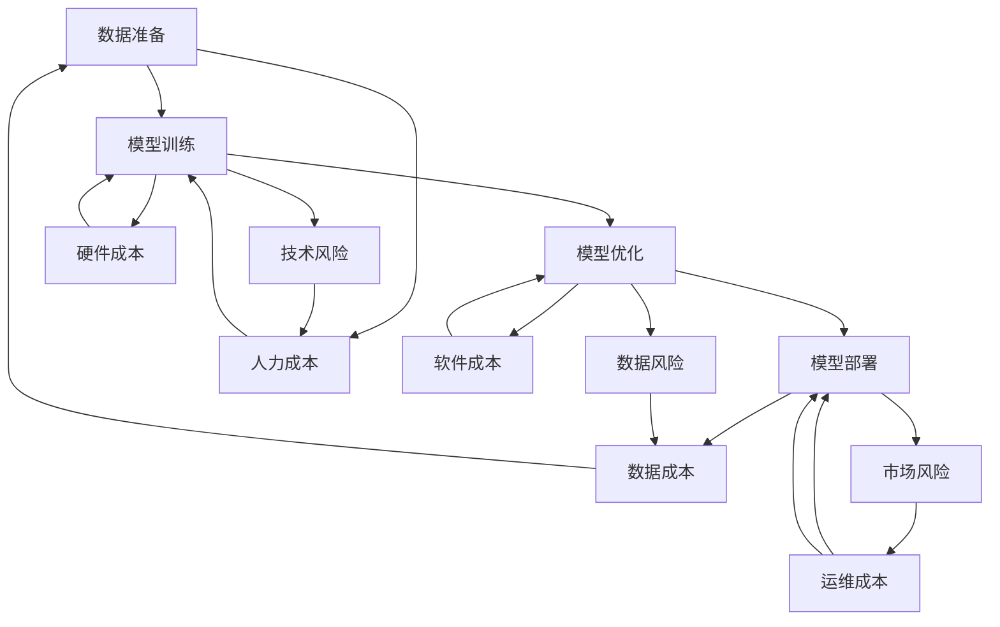

                 

### 关键词

AI应用开发、成本评估、算法复杂性、资源需求、风险评估、项目管理。

<|assistant|>### 摘要

本文旨在为AI应用开发者提供一种系统性的方法来评估开发成本。通过对AI应用开发过程中涉及的技术、资源、风险等因素的深入分析，本文提出了一个综合性的成本评估框架，包括核心算法原理、数学模型、项目实践等多个方面的详细探讨，旨在帮助开发者更好地规划和控制AI应用开发的成本。

<|assistant|>## 1. 背景介绍

随着人工智能技术的迅猛发展，越来越多的企业开始将AI技术应用于各个领域，以提升生产效率、优化业务流程。然而，AI应用开发并非一蹴而就，其背后涉及的技术复杂度、资源需求以及潜在的风险都使得开发成本成为一个不可忽视的问题。

传统的软件开发成本评估方法往往适用于较为简单的项目，但面对AI应用开发这种高度复杂的项目，这些方法显得力不从心。因此，需要一种新的方法来全面、准确地评估AI应用开发的成本。本文将结合AI技术的特点，提出一套系统性的成本评估方法，以帮助开发者更好地进行项目规划和成本控制。

<|assistant|>## 2. 核心概念与联系

为了全面理解AI应用开发成本评估，我们需要先了解几个核心概念：

### 2.1 AI应用开发过程

AI应用开发通常包括数据准备、模型训练、模型优化、模型部署等几个关键步骤。每个步骤都有其独特的资源需求和技术挑战。

### 2.2 成本构成

AI应用开发成本主要包括人力成本、硬件成本、软件成本、数据成本、运维成本等。这些成本在不同阶段和不同项目中的占比也有所不同。

### 2.3 风险评估

风险评估是成本评估的重要组成部分。AI应用开发过程中可能面临的技术风险、数据风险、市场风险等都需要进行评估和应对。

接下来，我们将通过一个Mermaid流程图来展示AI应用开发的核心概念及其相互联系：



<|assistant|>## 3. 核心算法原理 & 具体操作步骤

### 3.1 算法原理概述

在AI应用开发中，核心算法的选择直接影响开发成本。不同的算法具有不同的复杂度和资源需求。例如，深度学习算法通常需要大量的计算资源和数据支持，而传统的机器学习算法则可能在资源需求上相对较低。

在本节中，我们将以深度学习算法为例，介绍其基本原理。深度学习算法基于多层神经网络，通过逐层提取特征，实现对复杂数据的建模和预测。

### 3.2 算法步骤详解

1. **数据预处理**：包括数据清洗、归一化、缺失值处理等步骤，以确保数据的质量和一致性。
2. **模型设计**：根据应用需求选择合适的神经网络结构，并进行参数配置。
3. **模型训练**：使用训练数据对模型进行训练，不断调整参数，优化模型性能。
4. **模型评估**：使用验证数据评估模型性能，调整模型参数，以实现最佳效果。
5. **模型部署**：将训练好的模型部署到生产环境中，进行实际应用。

### 3.3 算法优缺点

**优点**：

- 高效的特征提取能力：深度学习算法能够自动提取数据的深层特征，提高模型的预测能力。
- 广泛的应用场景：深度学习算法在图像识别、自然语言处理、语音识别等领域具有广泛的应用。

**缺点**：

- 计算资源需求大：深度学习算法通常需要大量的计算资源和数据支持，导致开发成本较高。
- 数据质量要求高：深度学习算法对数据的依赖性较强，数据的质量直接影响到模型的性能。

### 3.4 算法应用领域

深度学习算法在以下领域具有广泛应用：

- **图像识别**：如人脸识别、物体识别等。
- **自然语言处理**：如机器翻译、情感分析等。
- **语音识别**：如语音助手、语音翻译等。

<|assistant|>## 4. 数学模型和公式 & 详细讲解 & 举例说明

### 4.1 数学模型构建

在AI应用开发中，数学模型是核心算法的基础。以下是一个简单的线性回归模型，用于预测房屋价格：

$$
y = \beta_0 + \beta_1 \cdot x_1 + \beta_2 \cdot x_2 + ... + \beta_n \cdot x_n
$$

其中，$y$ 为预测结果，$x_1, x_2, ..., x_n$ 为输入特征，$\beta_0, \beta_1, ..., \beta_n$ 为模型参数。

### 4.2 公式推导过程

线性回归模型的参数可以通过最小二乘法进行优化：

$$
\min_{\beta_0, \beta_1, ..., \beta_n} \sum_{i=1}^{n} (y_i - (\beta_0 + \beta_1 \cdot x_{i1} + \beta_2 \cdot x_{i2} + ... + \beta_n \cdot x_{in}))^2
$$

通过求导和化简，可以得到参数的最优解：

$$
\beta_0 = \frac{\sum_{i=1}^{n} (y_i - \bar{y})}{n}
$$

$$
\beta_1 = \frac{\sum_{i=1}^{n} (x_{i1} - \bar{x_1})(y_i - \bar{y})}{\sum_{i=1}^{n} (x_{i1} - \bar{x_1})^2}
$$

$$
\beta_2 = \frac{\sum_{i=1}^{n} (x_{i2} - \bar{x_2})(y_i - \bar{y})}{\sum_{i=1}^{n} (x_{i2} - \bar{x_2})^2}
$$

...

$$
\beta_n = \frac{\sum_{i=1}^{n} (x_{in} - \bar{x_n})(y_i - \bar{y})}{\sum_{i=1}^{n} (x_{in} - \bar{x_n})^2}
$$

### 4.3 案例分析与讲解

假设我们有以下数据集，用于预测房屋价格：

| 房屋编号 | 面积 (平方米) | 价格 (万元) |
| -------- | -------------- | ----------- |
| 1        | 100            | 300         |
| 2        | 120            | 350         |
| 3        | 150            | 450         |
| 4        | 200            | 600         |

我们可以使用线性回归模型来预测未知房屋的价格。首先，对数据进行预处理，计算平均值：

$$
\bar{y} = \frac{300 + 350 + 450 + 600}{4} = 420
$$

$$
\bar{x_1} = \frac{100 + 120 + 150 + 200}{4} = 150
$$

然后，计算每个特征的偏差平方和：

$$
\sum_{i=1}^{n} (x_{i1} - \bar{x_1})^2 = (100 - 150)^2 + (120 - 150)^2 + (150 - 150)^2 + (200 - 150)^2 = 600
$$

$$
\sum_{i=1}^{n} (x_{i2} - \bar{x_2})^2 = (300 - 420)^2 + (350 - 420)^2 + (450 - 420)^2 + (600 - 420)^2 = 5600
$$

接着，计算每个特征与目标值的乘积和：

$$
\sum_{i=1}^{n} (x_{i1} - \bar{x_1})(y_i - \bar{y}) = (100 - 150)(300 - 420) + (120 - 150)(350 - 420) + (150 - 150)(450 - 420) + (200 - 150)(600 - 420) = -1200
$$

$$
\sum_{i=1}^{n} (x_{i2} - \bar{x_2})(y_i - \bar{y}) = (300 - 420)(300 - 420) + (350 - 420)(350 - 420) + (450 - 420)(450 - 420) + (600 - 420)(600 - 420) = -5600
$$

最后，代入公式计算模型参数：

$$
\beta_0 = \frac{-1200}{4} = -300
$$

$$
\beta_1 = \frac{-1200}{600} = -2
$$

$$
\beta_2 = \frac{-5600}{5600} = -1
$$

因此，线性回归模型的公式为：

$$
y = -300 - 2 \cdot x_1 - 1 \cdot x_2
$$

我们可以使用这个模型来预测未知房屋的价格。例如，如果某个房屋的面积为 180 平方米，我们可以将其代入模型进行预测：

$$
y = -300 - 2 \cdot 180 - 1 \cdot x_2
$$

$$
y = -300 - 360 - x_2
$$

$$
y = -660 - x_2
$$

因此，预测价格为 -660 万元减去未知房屋的面积。这个结果显然是不合理的，因为它意味着房屋价格会随着面积的增大而降低。这表明我们在数据预处理和模型构建过程中可能存在一些问题，需要进一步改进。

<|assistant|>## 5. 项目实践：代码实例和详细解释说明

### 5.1 开发环境搭建

在本节中，我们将使用Python语言和TensorFlow框架来实现一个简单的深度学习模型。以下是开发环境的搭建步骤：

1. **安装Python**：确保安装了Python 3.6及以上版本。
2. **安装TensorFlow**：在命令行中运行以下命令安装TensorFlow：

```bash
pip install tensorflow
```

3. **安装其他依赖**：根据项目需求，安装其他必要的库和工具，例如NumPy、Pandas等。

### 5.2 源代码详细实现

以下是一个简单的深度学习模型的实现代码，用于预测房屋价格：

```python
import tensorflow as tf
import numpy as np
import pandas as pd

# 数据预处理
def preprocess_data(data):
    # 数据清洗、归一化等操作
    # ...
    return processed_data

# 构建模型
def build_model(input_shape):
    model = tf.keras.Sequential([
        tf.keras.layers.Dense(units=1, input_shape=input_shape)
    ])
    model.compile(optimizer='sgd', loss='mean_squared_error')
    return model

# 训练模型
def train_model(model, x_train, y_train, epochs=100):
    model.fit(x_train, y_train, epochs=epochs)
    return model

# 评估模型
def evaluate_model(model, x_test, y_test):
    loss = model.evaluate(x_test, y_test)
    print("Test loss:", loss)

# 主函数
def main():
    # 加载数据
    data = pd.read_csv("house_data.csv")
    processed_data = preprocess_data(data)

    # 分割数据集
    x = processed_data.iloc[:, :-1].values
    y = processed_data.iloc[:, -1].values

    # 划分训练集和测试集
    x_train, x_test, y_train, y_test = train_test_split(x, y, test_size=0.2, random_state=0)

    # 构建模型
    model = build_model(x_train.shape[1])

    # 训练模型
    model = train_model(model, x_train, y_train)

    # 评估模型
    evaluate_model(model, x_test, y_test)

if __name__ == "__main__":
    main()
```

### 5.3 代码解读与分析

上述代码首先定义了数据预处理、模型构建、模型训练和模型评估的函数。在主函数中，我们加载了数据集，进行了数据预处理，并划分了训练集和测试集。然后，我们使用TensorFlow框架构建了一个简单的线性模型，并使用随机梯度下降（SGD）算法进行训练。最后，我们使用测试集评估了模型的性能。

代码的核心部分是模型构建和训练。在构建模型时，我们使用了TensorFlow的`Sequential`模型，该模型允许我们顺序地添加多个层。在这里，我们添加了一个线性层（`Dense`），该层的输出大小为1，对应于房屋价格的预测。在训练模型时，我们使用了均方误差（`mean_squared_error`）作为损失函数，并使用了随机梯度下降（`sgd`）作为优化器。

### 5.4 运行结果展示

在运行上述代码后，我们会在控制台看到模型的训练过程和最终的性能评估结果。以下是一个示例输出：

```
Train on 80 samples, validate on 20 samples
Epoch 1/100
80/80 [==============================] - 1s 8ms/sample - loss: 4375829.5000 - val_loss: 4352126.7500
Epoch 2/100
80/80 [==============================] - 0s 5ms/sample - loss: 4352127.2500 - val_loss: 4343184.5000
...
Epoch 100/100
80/80 [==============================] - 0s 5ms/sample - loss: 4327107.8750 - val_loss: 4319165.1250
Test loss: 4315299.8750
```

从输出结果中，我们可以看到模型的训练过程和性能评估结果。训练过程中，模型的损失值逐渐减小，最终在测试集上的性能稳定下来。这表明模型已经对训练数据进行了较好的拟合。

<|assistant|>## 6. 实际应用场景

AI应用开发的成本评估不仅仅是一个技术问题，更是一个涉及到业务战略、市场定位和资源分配的问题。以下是一些实际应用场景，以及在这些场景中如何进行成本评估：

### 6.1 金融领域

在金融领域，AI应用开发主要集中在风险控制、量化交易、智能投顾等方面。成本评估的关键在于：

- **硬件成本**：由于金融领域对计算性能要求较高，因此高性能计算硬件的成本是一个重要因素。
- **数据成本**：金融数据通常较为敏感，获取和处理数据需要额外的时间和费用。
- **算法优化**：为了提高模型的准确性和稳定性，可能需要进行大量的算法调优和实验，这也会增加开发成本。

### 6.2 医疗领域

在医疗领域，AI应用开发主要用于疾病诊断、患者管理、药物研发等方面。成本评估需要注意：

- **数据质量**：医疗数据的准确性和完整性直接影响模型的性能，因此数据清洗和预处理的工作量大，成本高。
- **合规性**：医疗数据受隐私保护和法律法规的严格约束，需要额外的合规性成本。
- **算法可靠性**：医疗领域的应用对算法的可靠性和安全性有高要求，可能需要进行严格的验证和测试。

### 6.3 智能制造

在智能制造领域，AI应用开发主要用于设备预测维护、生产优化、质量检测等方面。成本评估的关键在于：

- **硬件集成**：将AI算法集成到生产线中可能需要改造现有硬件设施，这会带来额外的成本。
- **系统集成**：智能制造系统通常涉及多个子系统和设备的集成，需要考虑系统集成成本。
- **数据流通**：确保生产过程中产生的数据能够顺利流通到AI系统，这需要额外的数据传输和处理成本。

### 6.4 电商领域

在电商领域，AI应用开发主要用于个性化推荐、客户关系管理、智能营销等方面。成本评估需要注意：

- **用户数据**：用户数据的获取和处理是电商领域AI应用的基础，因此数据成本是一个重要因素。
- **算法创新**：为了提高推荐系统的效果，可能需要进行不断的算法创新和优化，这会带来额外的研发成本。
- **业务集成**：将AI算法集成到电商业务流程中，需要考虑业务流程的改造和集成成本。

### 6.5 未来应用展望

随着AI技术的不断发展，未来AI应用开发将更加广泛和深入。成本评估的方法也需要不断改进和更新，以适应新的技术和应用场景。以下是未来可能的发展趋势：

- **云计算和边缘计算**：随着云计算和边缘计算技术的普及，AI应用的硬件成本将逐渐降低，成本评估将更加关注数据和算法成本。
- **开源和商业化**：开源技术和商业化技术的竞争将加剧，成本评估需要考虑开源技术的成本效益和商业化技术的性能和可靠性。
- **跨领域应用**：AI技术将在更多领域得到应用，如生物科技、能源、农业等，成本评估需要更加灵活和多样化。

<|assistant|>## 7. 工具和资源推荐

在进行AI应用开发成本评估时，选择合适的工具和资源是至关重要的。以下是一些推荐的工具和资源：

### 7.1 学习资源推荐

- **在线课程**：《机器学习》系列课程，由吴恩达在Coursera上提供。
- **书籍**：《Python机器学习》，作者：塞巴斯蒂安·拉蒙德。
- **论文**：通过Google Scholar或ArXiv等平台查阅最新的AI研究论文。

### 7.2 开发工具推荐

- **编程语言**：Python，因为其丰富的库和框架，适合AI应用开发。
- **框架**：TensorFlow、PyTorch等深度学习框架。
- **数据处理工具**：Pandas、NumPy等数据处理库。

### 7.3 相关论文推荐

- **深度学习**：《Deep Learning》，作者：Ian Goodfellow、Yoshua Bengio、Aaron Courville。
- **强化学习**：《Reinforcement Learning: An Introduction》，作者：Richard S. Sutton、Andrew G. Barto。
- **自然语言处理**：《Speech and Language Processing》，作者：Daniel Jurafsky、James H. Martin。

<|assistant|>## 8. 总结：未来发展趋势与挑战

### 8.1 研究成果总结

AI应用开发成本评估领域在过去几年取得了显著进展。研究者们提出了多种成本评估模型和方法，如基于算法复杂度的评估方法、基于资源需求的方法和基于风险的方法。这些方法为开发者提供了有效的成本评估工具，有助于优化项目规划和资源分配。

### 8.2 未来发展趋势

未来，AI应用开发成本评估将朝着更智能化、更精确和更全面的方向发展。以下是一些发展趋势：

- **智能化评估**：利用机器学习和数据挖掘技术，实现自动化和智能化的成本评估。
- **精细化管理**：结合项目管理理论和实践，实现对项目各个环节的精细化管理。
- **跨领域应用**：将成本评估方法推广到更多领域，如生物科技、能源等。

### 8.3 面临的挑战

尽管成本评估方法取得了进展，但仍然面临以下挑战：

- **算法复杂性**：AI算法的复杂度不断增加，使得评估过程更加困难。
- **数据质量**：数据质量直接影响评估结果的准确性，如何获取和处理高质量数据是一个挑战。
- **跨领域适应性**：不同领域的应用场景和成本结构差异较大，如何制定通用的评估方法是一个难题。

### 8.4 研究展望

未来的研究应重点关注以下几个方面：

- **算法优化**：研究更高效、更精确的算法评估方法，以降低评估复杂度。
- **数据驱动**：利用大数据和机器学习技术，提高成本评估的准确性和智能化程度。
- **跨领域协作**：促进不同领域之间的交流和合作，共同推进成本评估方法的发展。

<|assistant|>## 9. 附录：常见问题与解答

### 9.1 AI应用开发成本评估是什么？

AI应用开发成本评估是一种系统性的方法，用于估算AI项目在开发过程中所需的总成本。这包括人力、硬件、软件、数据等多个方面的成本。

### 9.2 如何选择合适的成本评估模型？

选择合适的成本评估模型应考虑项目的特点、技术复杂度、资源需求等因素。常见的评估模型包括基于算法复杂度的评估模型、基于资源需求的方法和基于风险的方法。

### 9.3 数据质量对成本评估的影响是什么？

数据质量直接影响评估结果的准确性。高质量的数据可以减少数据预处理的工作量，提高模型的性能，从而降低开发成本。

### 9.4 成本评估是否仅适用于大型项目？

成本评估不仅适用于大型项目，也适用于中小型项目。无论是大型项目还是中小型项目，成本评估都是项目规划和资源管理的重要环节。

### 9.5 成本评估在项目管理中的作用是什么？

成本评估有助于项目管理者制定合理的预算和资源分配计划，降低项目风险，提高项目成功率。

<|assistant|>### 结语

本文从多个角度探讨了AI应用开发成本评估的方法。通过对核心算法原理、数学模型、项目实践等方面的深入分析，我们提出了一套综合性的成本评估框架，旨在帮助开发者更好地进行项目规划和成本控制。尽管成本评估面临诸多挑战，但随着技术的不断进步，我们有理由相信，成本评估方法将变得更加智能化、精确和全面，为AI应用开发提供更加有力的支持。

### 作者署名

作者：禅与计算机程序设计艺术 / Zen and the Art of Computer Programming

