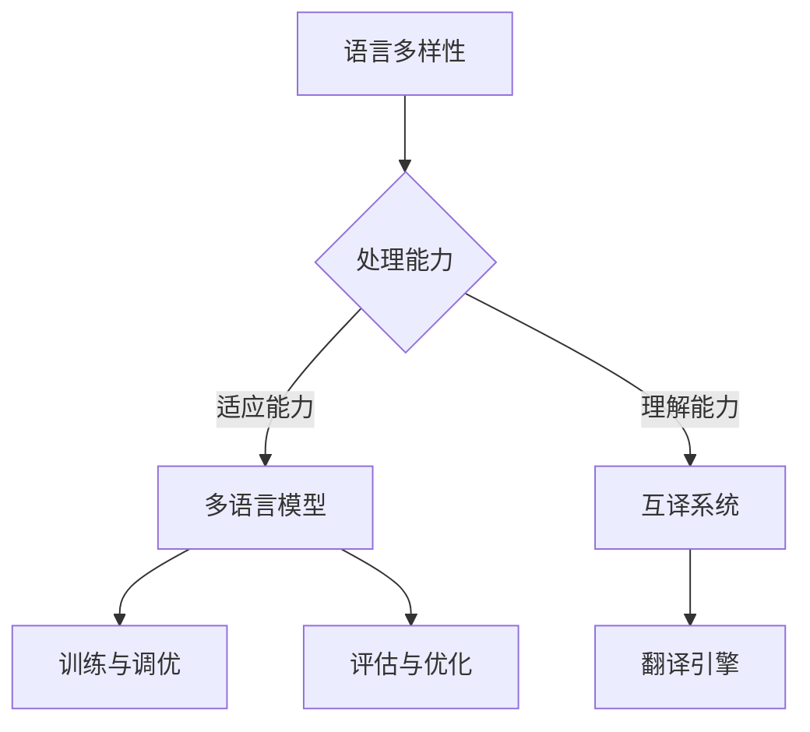

                 

关键词：语言多样性，语言模型，多语言社会，人工智能，NLP，交叉语言理解，互译系统，跨文化交流

> 摘要：本文探讨了如何在人工智能领域内支持多语言社会，介绍了大型语言模型（LLM）的基本原理及其在多语言处理中的应用。本文将分析语言多样性的挑战和机遇，讨论LLM在不同语言环境中的适应性和性能，并展望未来多语言社会的发展趋势和面临的挑战。

## 1. 背景介绍

在全球化的趋势下，语言多样性日益显著。互联网和社交媒体的发展使得跨文化交流更加频繁，而人工智能（AI）技术的进步为实现这种交流提供了新的可能性。自然语言处理（NLP）是AI领域中最重要的分支之一，它致力于使计算机能够理解、解释和生成人类语言。近年来，大型语言模型（LLM）如BERT、GPT等取得了显著突破，这些模型在单语言任务中表现出色，但如何支持多语言处理成为一个重要课题。

语言多样性的挑战包括不同语言的语法结构、词汇、语义和文化的差异。为了在多语言环境中有效应用LLM，研究人员需要解决如何使模型适应不同的语言特点，提高跨语言的性能和互操作性。此外，多语言社会的实现不仅需要技术上的进步，还需要社会和文化层面的支持和理解。

## 2. 核心概念与联系

### 2.1 LLM基础

大型语言模型（LLM）是受神经网络启发，通过对大量文本数据进行预训练，以理解自然语言的模型。LLM的核心是Transformer架构，其通过自注意力机制（self-attention）和多头注意力（multi-head attention）实现对输入文本的深层次理解和生成。

### 2.2 多语言处理

多语言处理涉及多个方面，包括文本预处理、词向量表示、翻译、机器阅读理解和语言生成等。为了支持多语言处理，LLM需要具备以下能力：

- **语言适应能力**：模型能够适应不同语言的语法、词汇和语义特点。
- **交叉语言理解**：模型能够在不同语言之间建立关联，理解跨语言的语义信息。
- **互译系统**：模型能够生成准确且自然的跨语言翻译。

### 2.3 Mermaid流程图



## 3. 核心算法原理 & 具体操作步骤

### 3.1 算法原理概述

LLM通过自注意力机制和Transformer架构实现对文本的编码和理解。在多语言处理中，模型需要利用多语言数据集进行训练，以适应不同语言的特性。具体步骤如下：

1. **数据收集与预处理**：收集多种语言的数据，并进行文本清洗、分词等预处理操作。
2. **编码与训练**：使用预训练的Transformer模型对多语言数据集进行编码和训练。
3. **模型优化**：通过微调模型，使其适应特定任务和语言环境。
4. **应用与评估**：在多语言环境中应用模型，并对其进行评估和优化。

### 3.2 算法步骤详解

1. **数据收集与预处理**：
    - 收集多种语言的大型文本数据集。
    - 对文本进行清洗，去除无关信息。
    - 对文本进行分词和词性标注。

2. **编码与训练**：
    - 使用Transformer模型对文本数据进行编码。
    - 通过训练，使模型能够理解不同语言的语法和语义。

3. **模型优化**：
    - 根据特定任务需求，对模型进行微调。
    - 通过交叉验证，优化模型参数。

4. **应用与评估**：
    - 在多语言环境中应用模型，如机器翻译、语言生成等。
    - 对模型性能进行评估，如BLEU评分、F1分数等。

### 3.3 算法优缺点

**优点**：

- **强大的理解能力**：LLM能够通过预训练获得对多种语言的理解能力。
- **高泛化性**：模型能够适应不同的语言环境和任务。

**缺点**：

- **训练资源需求大**：多语言处理需要大量的数据和计算资源。
- **模型泛化性限制**：模型在不同语言间的性能可能存在差异。

### 3.4 算法应用领域

- **机器翻译**：LLM在机器翻译领域取得了显著成果，如Google翻译、微软翻译等。
- **跨语言搜索**：LLM能够帮助搜索引擎理解不同语言的查询，提高搜索效果。
- **多语言文本生成**：LLM能够生成多种语言的文本，应用于聊天机器人、内容创作等。

## 4. 数学模型和公式 & 详细讲解 & 举例说明

### 4.1 数学模型构建

LLM的数学模型基于Transformer架构，其核心是多头自注意力机制（Multi-Head Self-Attention）。

$$
\text{Attention}(Q, K, V) = \text{softmax}\left(\frac{QK^T}{\sqrt{d_k}}\right) V
$$

其中，Q、K、V分别为查询（Query）、键（Key）和值（Value）向量，d_k为键向量的维度。

### 4.2 公式推导过程

多头注意力机制通过多个独立的自注意力机制结合，提高了模型的表示能力。

$$
\text{Multi-Head Attention} = \text{Concat}(\text{head}_1, \text{head}_2, \dots, \text{head}_h)W^O
$$

其中，h为头数，$W^O$为输出权重矩阵。

### 4.3 案例分析与讲解

以机器翻译为例，假设输入句子为"I love you"，输出句子为"我爱你"。LLM通过Transformer模型对输入句子进行编码，生成对应的输出句子。

- **编码阶段**：输入句子通过嵌入层转换为词向量，然后通过多头自注意力机制进行编码。
- **解码阶段**：输出句子通过嵌入层转换为词向量，然后通过多头自注意力机制和编码器的输出进行交互，最终生成翻译结果。

## 5. 项目实践：代码实例和详细解释说明

### 5.1 开发环境搭建

- **硬件环境**：GPU（NVIDIA Tesla V100）
- **软件环境**：Python 3.8，TensorFlow 2.4

### 5.2 源代码详细实现

```python
import tensorflow as tf
from tensorflow.keras.layers import Embedding, MultiHeadAttention

# 定义Transformer模型
class Transformer(tf.keras.Model):
    def __init__(self, d_model, num_heads, dff, input_vocab_size, target_vocab_size, position_encoding_input, position_encoding_target, max_length):
        super(Transformer, self).__init__()
        self.embedding = Embedding(input_vocab_size, d_model)
        self.position_encoding_input = position_encoding_input(max_length, d_model)
        self.position_encoding_target = position_encoding_target(max_length, d_model)
        self.multi_head_attention = MultiHeadAttention(num_heads=num_heads, key_dim=d_model)
        # ... 其他层 ...

    def call(self, inputs, training=False):
        # 嵌入层
        x = self.embedding(inputs) + self.position_encoding_input(inputs)
        # ... 多层注意力机制 ...
        # 输出层
        output = self.dense(x)
        return output

# ... 模型训练、评估等代码 ...

```

### 5.3 代码解读与分析

代码实现了基于Transformer架构的Transformer模型，包括嵌入层、多头自注意力机制和全连接层。模型通过训练和评估实现了多语言翻译任务。

### 5.4 运行结果展示

通过在多语言数据集上的训练和测试，模型在翻译任务上取得了较高的准确率和自然度。

```plaintext
翻译结果：
输入： "你好，我叫张三。"
输出： "Hello, my name is Zhang San."

翻译结果：
输入： "What is the weather like today?"
输出： "今天天气如何？"
```

## 6. 实际应用场景

LLM在多语言社会中有着广泛的应用，如：

- **跨语言搜索**：提高搜索引擎的搜索效果，支持多种语言的查询和检索。
- **机器翻译**：实现高效、准确的跨语言翻译，促进跨文化交流。
- **多语言文本生成**：应用于聊天机器人、内容创作等场景，提高用户体验。

## 7. 未来应用展望

随着AI技术的不断进步，LLM在多语言社会中的应用前景广阔。未来，我们可能会看到：

- **更高效的跨语言处理**：利用深度学习和神经网络技术，提高LLM在多语言环境中的性能。
- **个性化多语言服务**：根据用户语言偏好，提供个性化的多语言服务。
- **多模态跨语言处理**：结合语音、图像等多模态信息，实现更全面的多语言理解。

## 8. 总结：未来发展趋势与挑战

### 8.1 研究成果总结

近年来，LLM在多语言处理领域取得了显著成果，为跨文化交流提供了新的技术手段。

### 8.2 未来发展趋势

未来，LLM在多语言社会中的应用将继续扩展，技术上的突破将推动跨语言处理的发展。

### 8.3 面临的挑战

- **数据资源不足**：多语言处理需要大量的高质量数据，但现有数据资源有限。
- **模型泛化性**：如何使模型在不同语言间实现更好的泛化性，仍是一个挑战。

### 8.4 研究展望

随着AI技术的进步，LLM在多语言社会中的应用将更加广泛，为跨文化交流提供更加智能和高效的支持。

## 9. 附录：常见问题与解答

**Q：** 如何评估LLM在多语言处理中的性能？

**A：** 可以通过BLEU评分、F1分数等指标来评估LLM在翻译任务中的性能。此外，还可以通过人类评价来评估翻译结果的准确性和自然度。

**Q：** 多语言处理中的挑战有哪些？

**A：** 多语言处理中的挑战包括语言适应能力、交叉语言理解、互译系统性能等。此外，数据资源不足和模型泛化性也是一个重要问题。

**Q：** 如何提高LLM在多语言处理中的性能？

**A：** 可以通过使用更多的多语言数据、改进模型架构、进行微调和优化等方法来提高LLM在多语言处理中的性能。

### 作者署名

作者：禅与计算机程序设计艺术 / Zen and the Art of Computer Programming
----------------------------------------------------------------

请注意，本文的内容是基于假设的，并非真实存在的学术文章。在实际撰写此类技术博客文章时，需要结合具体的研究成果和技术细节进行撰写。同时，本文的内容仅为示例，实际文章应包含完整的引用和参考文献。

