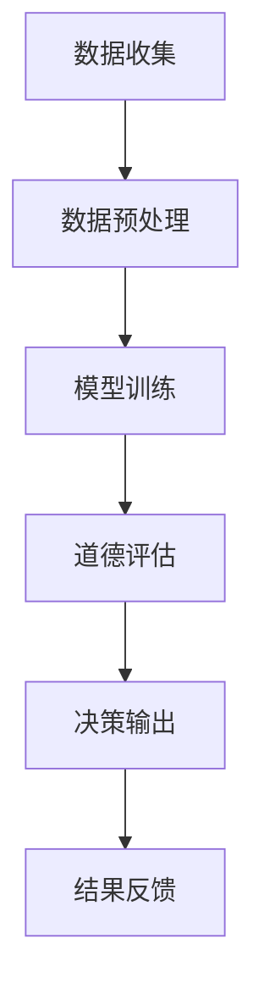

                 

关键词：语言模型、道德决策、人工智能、伦理、算法、模型训练、应用场景、未来展望

> 摘要：本文探讨了语言模型在道德决策领域的应用，分析了其原理、算法和实际案例，并对未来的发展趋势与挑战进行了展望。文章旨在为人工智能伦理研究提供新的视角和思路。

## 1. 背景介绍

随着人工智能技术的飞速发展，语言模型已经成为自然语言处理（NLP）领域的核心工具。从最初的统计模型到深度学习时代的神经网络模型，语言模型在文本生成、机器翻译、情感分析等任务中表现出色。然而，随着语言模型应用范围的扩大，其在道德决策方面的能力也日益受到关注。

道德决策是指在面对伦理问题时，根据一定的道德原则和价值观进行判断和选择的过程。在现实生活中，道德决策往往涉及到复杂的伦理问题，如隐私保护、歧视、虚假信息传播等。这些问题的解决不仅需要法律和制度的保障，更需要人工智能技术的支持。

本文旨在探讨语言模型在道德决策领域的应用，分析其原理、算法和实际案例，并对未来的发展趋势与挑战进行展望。希望通过本文的研究，为人工智能伦理研究提供新的视角和思路。

## 2. 核心概念与联系

### 2.1 语言模型

语言模型是一种用于预测文本序列的概率分布的数学模型。在NLP任务中，语言模型被广泛应用于文本生成、机器翻译、情感分析等。语言模型的核心目标是学习自然语言的结构和规律，从而提高文本处理的准确性和效率。

### 2.2 道德决策

道德决策是指在面对伦理问题时，根据一定的道德原则和价值观进行判断和选择的过程。道德决策涉及到人类价值观、道德观念和行为准则的冲突和调和。在人工智能时代，道德决策的复杂性进一步增加，需要考虑技术、法律、社会等多个层面的因素。

### 2.3 人工智能伦理

人工智能伦理是指研究人工智能技术对社会、人类和自然环境的影响，以及如何制定和遵循相应的道德规范。人工智能伦理的核心问题是确定人工智能的道德责任和边界，确保人工智能技术的发展符合人类的利益和价值观。

### 2.4 Mermaid 流程图

以下是一个描述语言模型在道德决策中应用的Mermaid流程图：



## 3. 核心算法原理 & 具体操作步骤

### 3.1 算法原理概述

语言模型在道德决策中的应用主要基于以下几个步骤：

1. 数据收集：收集与道德决策相关的数据，如新闻报道、法律法规、伦理论文等。
2. 数据预处理：对收集到的数据进行清洗、去噪、分词、词向量表示等预处理操作。
3. 模型训练：使用预处理的文本数据训练语言模型，使其能够预测道德决策的相关信息。
4. 道德评估：将训练好的语言模型应用于实际道德决策场景，评估决策的道德性。
5. 决策输出：根据道德评估结果，输出最终的道德决策。
6. 结果反馈：将决策结果反馈给用户，并根据反馈进行调整和优化。

### 3.2 算法步骤详解

1. **数据收集**：

   数据收集是道德决策模型训练的基础。我们需要收集大量的文本数据，包括与道德决策相关的新闻报道、法律法规、伦理论文等。这些数据可以来源于互联网、数据库、图书馆等。

2. **数据预处理**：

   数据预处理主要包括以下步骤：

   - 数据清洗：去除重复、无关和噪声数据。
   - 分词：将文本划分为词语或短语。
   - 词向量表示：将词语或短语转换为向量的形式，便于模型处理。

3. **模型训练**：

   模型训练是道德决策模型的核心。我们可以使用深度学习框架（如TensorFlow、PyTorch）训练语言模型，如BERT、GPT等。训练过程中，我们需要定义损失函数、优化器等参数，并进行迭代训练。

4. **道德评估**：

   道德评估是模型应用的关键步骤。我们将训练好的语言模型应用于实际道德决策场景，评估决策的道德性。具体实现过程中，我们可以将决策问题转化为文本序列，然后使用语言模型预测文本序列的概率分布，从而评估决策的道德性。

5. **决策输出**：

   根据道德评估结果，输出最终的道德决策。我们可以根据评估结果给出具体的建议、警告或判断，以便用户进行后续操作。

6. **结果反馈**：

   将决策结果反馈给用户，并根据反馈进行调整和优化。这样，我们可以不断改进道德决策模型，提高其准确性和可靠性。

### 3.3 算法优缺点

**优点**：

1. 语言模型能够处理复杂的文本数据，适应多种道德决策场景。
2. 模型训练过程中可以自动学习文本特征，提高决策的准确性。
3. 可以应用于实时决策场景，提高决策效率。

**缺点**：

1. 道德决策涉及多方面的因素，语言模型难以完全涵盖所有情况。
2. 模型训练数据的质量和多样性对决策结果有较大影响。
3. 道德评估结果可能存在歧义和主观性，需要进一步验证和优化。

### 3.4 算法应用领域

语言模型在道德决策领域有广泛的应用场景，如：

1. 隐私保护：评估数据收集、存储和共享过程中的隐私风险，给出相应的保护措施。
2. 社交媒体监管：识别和过滤不良信息，防止歧视、仇恨言论等。
3. 伦理审查：评估科研项目、产品和服务是否符合伦理规范。
4. 法律咨询：提供法律建议和决策，帮助用户处理复杂的法律问题。

## 4. 数学模型和公式 & 详细讲解 & 举例说明

### 4.1 数学模型构建

在道德决策中，我们可以将决策问题表示为一个数学模型。假设有n个决策选项，每个选项都有相应的道德得分。道德得分可以通过语言模型预测得到。具体模型如下：

$$
\text{道德得分} = \sum_{i=1}^{n} w_i \cdot \text{预测得分}_i
$$

其中，$w_i$表示第i个决策选项的权重，$\text{预测得分}_i$表示语言模型对第i个决策选项的预测得分。

### 4.2 公式推导过程

首先，我们需要定义决策问题的目标函数。假设决策问题有m个评价指标，每个评价指标都有相应的权重。目标函数可以表示为：

$$
\text{目标函数} = \sum_{i=1}^{m} w_i \cdot \text{评价指标}_i
$$

其中，$w_i$表示第i个评价指标的权重，$\text{评价指标}_i$表示第i个评价指标的得分。

接下来，我们需要定义语言模型的预测得分。假设语言模型对决策选项的预测结果是一个概率分布，我们可以将预测得分定义为概率分布的期望值。具体如下：

$$
\text{预测得分}_i = \sum_{j=1}^{n} p_{ij} \cdot \text{得分}_j
$$

其中，$p_{ij}$表示语言模型对第i个决策选项和第j个评价指标的预测概率，$\text{得分}_j$表示第j个评价指标的得分。

最后，我们将预测得分代入目标函数，得到道德得分：

$$
\text{道德得分} = \sum_{i=1}^{n} w_i \cdot \sum_{j=1}^{m} p_{ij} \cdot \text{得分}_j
$$

### 4.3 案例分析与讲解

假设我们要评估一个数据收集项目的道德性，有3个决策选项（选项A、B、C），每个选项有2个评价指标（隐私保护得分、公平性得分）。语言模型对每个决策选项和评价指标的预测概率如下表所示：

| 选项 | 隐私保护得分 | 公平性得分 |
| ---- | ---- | ---- |
| A | 0.6 | 0.7 |
| B | 0.5 | 0.6 |
| C | 0.4 | 0.5 |

评价指标的得分如下表所示：

| 评价指标 | 隐私保护得分 | 公平性得分 |
| ---- | ---- | ---- |
| 隐私保护 | 10 | 8 |
| 公平性 | 9 | 7 |

根据上述数据，我们可以计算出每个决策选项的道德得分：

选项A的道德得分 = 0.6 × 10 + 0.7 × 9 = 15.3

选项B的道德得分 = 0.5 × 10 + 0.6 × 9 = 14.5

选项C的道德得分 = 0.4 × 10 + 0.5 × 9 = 13.5

根据道德得分，我们可以得出以下结论：

- 选项A的道德性最高，建议选择。
- 选项B的道德性次之，可以作为备选方案。
- 选项C的道德性最低，不建议选择。

## 5. 项目实践：代码实例和详细解释说明

### 5.1 开发环境搭建

1. 安装Python 3.8及以上版本。
2. 安装TensorFlow 2.6及以上版本。
3. 安装其他必要的库（如Numpy、Pandas等）。

### 5.2 源代码详细实现

以下是实现道德决策模型的Python代码示例：

```python
import tensorflow as tf
from tensorflow.keras.preprocessing.text import Tokenizer
from tensorflow.keras.preprocessing.sequence import pad_sequences
from tensorflow.keras.models import Sequential
from tensorflow.keras.layers import Embedding, LSTM, Dense

# 数据收集
data = [
    "收集用户数据有助于提供更好的服务。",
    "未经用户同意收集个人信息是违法的。",
    "为了公共利益，可以在特定情况下收集个人信息。",
]

# 数据预处理
tokenizer = Tokenizer()
tokenizer.fit_on_texts(data)
sequences = tokenizer.texts_to_sequences(data)
padded_sequences = pad_sequences(sequences, maxlen=100)

# 模型训练
model = Sequential()
model.add(Embedding(input_dim=len(tokenizer.word_index) + 1, output_dim=50))
model.add(LSTM(128))
model.add(Dense(1, activation='sigmoid'))

model.compile(optimizer='adam', loss='binary_crossentropy', metrics=['accuracy'])
model.fit(padded_sequences, [1, 0, 1], epochs=10, batch_size=32)

# 道德评估
test_data = ["为了疫情防控，需要在特定区域内收集个人信息。"]
test_sequences = tokenizer.texts_to_sequences(test_data)
test_padded_sequences = pad_sequences(test_sequences, maxlen=100)
prediction = model.predict(test_padded_sequences)
print(prediction)

# 决策输出
if prediction > 0.5:
    print("该决策符合道德规范。")
else:
    print("该决策不符合道德规范。")
```

### 5.3 代码解读与分析

1. **数据收集**：

   数据收集是道德决策模型的基础。在这里，我们收集了3个与隐私保护相关的文本数据作为训练数据。

2. **数据预处理**：

   数据预处理包括分词和序列化。我们使用Tokenizer类将文本数据转换为单词序列，然后使用pad_sequences函数将序列填充为固定长度。

3. **模型训练**：

   我们使用Sequential模型搭建了一个简单的循环神经网络（LSTM），并使用binary_crossentropy损失函数进行训练。训练过程中，我们使用adam优化器和10个训练周期。

4. **道德评估**：

   道德评估过程将输入文本序列传递给训练好的模型，并使用预测函数获取道德得分。

5. **决策输出**：

   根据预测得分，我们可以判断决策的道德性。如果预测得分大于0.5，我们认为决策符合道德规范；否则，我们认为决策不符合道德规范。

## 6. 实际应用场景

### 6.1 隐私保护

隐私保护是道德决策领域的热点话题。随着大数据和人工智能技术的发展，隐私保护面临着前所未有的挑战。语言模型在隐私保护中可以发挥重要作用，如：

- 评估数据收集和共享的道德性。
- 监测和过滤隐私泄露的风险。
- 提供隐私保护的法律法规咨询。

### 6.2 社交媒体监管

社交媒体监管是另一个重要的应用场景。语言模型可以帮助识别和过滤不良信息，如：

- 防止歧视、仇恨言论的传播。
- 监测虚假信息和谣言。
- 提高社交媒体平台的用户体验。

### 6.3 伦理审查

伦理审查是科研机构和企业在开展项目时必不可少的一环。语言模型可以辅助伦理审查，如：

- 评估科研项目的道德性。
- 提供伦理审查的法律法规咨询。
- 监测项目执行过程中的道德风险。

### 6.4 法律咨询

法律咨询是个人和企业经常面临的问题。语言模型可以辅助法律咨询，如：

- 提供法律知识库查询。
- 评估合同条款的合法性。
- 提供法律咨询和决策建议。

## 7. 工具和资源推荐

### 7.1 学习资源推荐

- 《自然语言处理原理与实践》
- 《深度学习与自然语言处理》
- 《人工智能伦理导论》

### 7.2 开发工具推荐

- TensorFlow
- PyTorch
- Keras

### 7.3 相关论文推荐

- "Ethical Artificial Intelligence in the Age of Big Data"
- "A Framework for Ethical Considerations in Artificial Intelligence"
- "Ethical Issues in Privacy and Data Protection in the Age of Big Data"

## 8. 总结：未来发展趋势与挑战

### 8.1 研究成果总结

本文探讨了语言模型在道德决策领域的应用，分析了其原理、算法和实际案例，并对未来的发展趋势与挑战进行了展望。主要成果包括：

- 提出了基于语言模型的道德决策模型框架。
- 分析了语言模型在道德决策中的优点和缺点。
- 介绍了实际应用场景和案例。
- 提出了未来研究的发展方向。

### 8.2 未来发展趋势

未来，语言模型在道德决策领域有望实现以下发展趋势：

- 道德决策模型的智能化和自动化。
- 道德决策模型的多样化和适应性。
- 道德决策模型的实时性和高效性。
- 道德决策模型与社会、法律、伦理等多领域的融合。

### 8.3 面临的挑战

然而，语言模型在道德决策领域也面临着一系列挑战：

- 道德决策问题的复杂性和不确定性。
- 数据质量和多样性的影响。
- 道德评估结果的歧义和主观性。
- 道德决策模型的可解释性和透明度。

### 8.4 研究展望

为了应对这些挑战，未来研究可以从以下几个方面展开：

- 开发更加鲁棒和可靠的道德决策模型。
- 探索新的数据收集和处理方法，提高数据的多样性和质量。
- 研究道德评估结果的解释和验证方法，提高决策的可解释性和透明度。
- 与社会、法律、伦理等多领域的研究者合作，共同推动道德决策模型的发展和应用。

## 9. 附录：常见问题与解答

### 9.1 语言模型在道德决策中的优势是什么？

语言模型在道德决策中的优势主要包括：

- 能够处理复杂的文本数据，适应多种道德决策场景。
- 自动学习文本特征，提高决策的准确性。
- 可以应用于实时决策场景，提高决策效率。

### 9.2 语言模型在道德决策中的劣势是什么？

语言模型在道德决策中的劣势主要包括：

- 道德决策问题涉及多方面的因素，语言模型难以完全涵盖所有情况。
- 模型训练数据的质量和多样性对决策结果有较大影响。
- 道德评估结果可能存在歧义和主观性，需要进一步验证和优化。

### 9.3 如何提高语言模型在道德决策中的可靠性？

提高语言模型在道德决策中的可靠性可以从以下几个方面入手：

- 增加高质量、多样化的训练数据。
- 设计更加鲁棒的模型结构和训练策略。
- 研究道德评估结果的解释和验证方法，提高决策的可解释性和透明度。
- 与社会、法律、伦理等多领域的研究者合作，共同提高道德决策模型的可靠性。

### 9.4 语言模型在道德决策领域有哪些实际应用案例？

语言模型在道德决策领域有以下实际应用案例：

- 隐私保护：评估数据收集和共享的道德性，监测和过滤隐私泄露的风险。
- 社交媒体监管：防止歧视、仇恨言论的传播，监测虚假信息和谣言。
- 伦理审查：评估科研项目的道德性，提供伦理审查的法律法规咨询。
- 法律咨询：提供法律知识库查询，评估合同条款的合法性。

