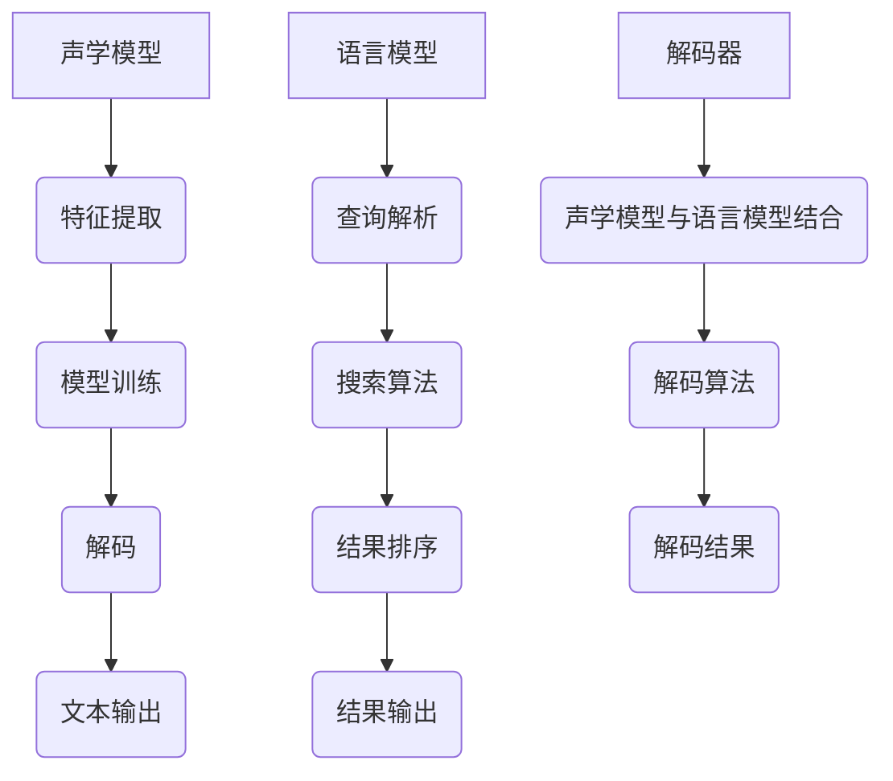

                 

随着人工智能技术的不断发展和应用，语音识别已经成为AI搜索领域的一个重要组成部分。本文旨在深入探讨语音识别在AI搜索中的应用，包括其核心概念、算法原理、数学模型、实践实例和未来展望。

## 文章关键词

- 语音识别
- AI搜索
- 自然语言处理
- 机器学习
- 语音合成
- 智能助手

## 文摘

本文将详细介绍语音识别在AI搜索中的应用，包括语音识别的核心技术、算法原理、数学模型，并通过具体实例展示其实现和应用。此外，还将探讨语音识别在AI搜索中的实际应用场景以及未来发展的趋势和挑战。

## 1. 背景介绍

### 1.1 语音识别的起源与发展

语音识别技术起源于20世纪50年代，最初是作为人机交互的一种手段。随着计算机技术的发展，语音识别逐渐成为人工智能研究的一个重要领域。近年来，随着深度学习算法的兴起，语音识别技术取得了显著进展，识别准确率大幅提升，应用场景也日益丰富。

### 1.2 AI搜索的发展

AI搜索是基于人工智能技术，通过对用户查询的语义理解，提供更准确、更个性化的搜索结果。与传统搜索不同，AI搜索更注重对用户意图的理解，从而提供更符合用户需求的搜索结果。

### 1.3 语音识别与AI搜索的结合

语音识别与AI搜索的结合，使得用户可以通过语音指令进行搜索，更加便捷、自然。语音识别技术的应用，极大地提升了AI搜索的用户体验。

## 2. 核心概念与联系

### 2.1 语音识别

语音识别是指将人类语音信号转换为计算机可处理和理解的信息。其核心概念包括：

- **声学模型**：用于对语音信号进行特征提取和建模，通常使用深度神经网络。
- **语言模型**：用于对语音信号中的语言内容进行建模，通常使用统计语言模型或神经网络语言模型。
- **解码器**：用于将声学模型和语言模型的结果解码为文本。

### 2.2 AI搜索

AI搜索是指基于人工智能技术，对用户查询进行语义理解，提供个性化搜索结果。其核心概念包括：

- **查询解析**：将用户查询转化为计算机可以理解的语义表示。
- **搜索算法**：根据用户查询和语义表示，从海量数据中检索出最相关的结果。
- **结果排序**：对搜索结果进行排序，提供最符合用户需求的搜索结果。

### 2.3 语音识别与AI搜索的联系

语音识别与AI搜索的联系在于：

- 语音识别技术用于将用户的语音指令转化为文本，提供给AI搜索系统。
- AI搜索系统根据语音识别的结果，理解用户查询的意图，并提供搜索结果。

## 3. 核心算法原理 & 具体操作步骤

### 3.1 算法原理概述

语音识别算法通常分为以下几个步骤：

1. **声学特征提取**：对语音信号进行预处理，提取声学特征。
2. **声学模型训练**：使用提取的声学特征，训练声学模型。
3. **语言模型训练**：使用大量文本数据，训练语言模型。
4. **解码**：使用声学模型和语言模型，将语音信号解码为文本。

### 3.2 算法步骤详解

1. **声学特征提取**：

   - **预处理**：对语音信号进行去噪、归一化等预处理操作。
   - **特征提取**：使用短时傅里叶变换（STFT）或梅尔频率倒谱系数（MFCC）等方法，提取语音信号的特征。

2. **声学模型训练**：

   - **数据准备**：收集大量语音数据，并进行标注。
   - **模型训练**：使用深度学习算法，如卷积神经网络（CNN）或循环神经网络（RNN），训练声学模型。

3. **语言模型训练**：

   - **数据准备**：收集大量文本数据，并进行分词和词性标注。
   - **模型训练**：使用统计语言模型或神经网络语言模型，如n元语法模型或BERT模型，训练语言模型。

4. **解码**：

   - **声学模型与语言模型结合**：使用声学模型和语言模型，构建联合模型。
   - **解码算法**：使用贪心算法或动态规划算法，将语音信号解码为文本。

### 3.3 算法优缺点

**优点**：

- 高效性：深度学习算法的引入，使得语音识别的准确率大幅提升。
- 通用性：适用于各种语音环境和语言。

**缺点**：

- 计算资源消耗大：深度学习模型的训练和推理过程需要大量的计算资源。
- 对噪声敏感：在噪声环境下的识别准确率较低。

### 3.4 算法应用领域

- **智能助手**：如苹果的Siri、亚马逊的Alexa等，用户可以通过语音指令进行搜索、设置提醒等操作。
- **语音识别应用**：如电话客服、语音翻译等，提高人机交互的效率和便利性。
- **车载语音系统**：如特斯拉的Autopilot，用户可以通过语音指令控制车辆的各项功能。

## 4. 数学模型和公式 & 详细讲解 & 举例说明

### 4.1 数学模型构建

语音识别的数学模型主要包括声学模型、语言模型和解码器。

**声学模型**：

- 声学模型通常使用深度神经网络，如卷积神经网络（CNN）或循环神经网络（RNN）。
- 假设我们使用CNN作为声学模型，其输入为语音信号的特征向量X，输出为声学特征H。

$$
H = f(X; \theta)
$$

其中，$f$为CNN模型，$\theta$为模型参数。

**语言模型**：

- 语言模型用于对语音信号中的语言内容进行建模。
- 假设我们使用n元语法模型作为语言模型，其输入为文本序列W，输出为语言概率P(W)。

$$
P(W) = \prod_{i=1}^{n} P(w_i | w_{i-n+1}, ..., w_{i-1})
$$

**解码器**：

- 解码器用于将声学模型和语言模型的结果解码为文本。
- 假设我们使用贪心算法作为解码器，其输入为声学特征H和语言概率P(W)，输出为解码的文本T。

$$
T = \arg\max_T P(T | H)P(H)
$$

### 4.2 公式推导过程

**声学模型推导**：

- 假设我们使用卷积神经网络作为声学模型，其输入为语音信号的特征向量X，输出为声学特征H。
- 卷积神经网络的输出可以通过以下公式计算：

$$
H_{ij} = \sum_{k=1}^{M} w_{ik}X_k + b_j
$$

其中，$H_{ij}$为第i个时间步的第j个特征，$w_{ik}$为卷积核，$X_k$为第k个特征，$b_j$为偏置。

- 为了训练卷积神经网络，我们需要计算损失函数，如交叉熵损失：

$$
L = -\sum_{i=1}^{T}\sum_{j=1}^{N} y_{ij} \log(H_{ij})
$$

其中，$y_{ij}$为标签，$T$为时间步数，$N$为特征数。

**语言模型推导**：

- 假设我们使用n元语法模型作为语言模型，其输入为文本序列W，输出为语言概率P(W)。
- n元语法模型的输出可以通过以下公式计算：

$$
P(W) = \prod_{i=1}^{n} P(w_i | w_{i-n+1}, ..., w_{i-1})
$$

- 为了训练n元语法模型，我们需要计算损失函数，如交叉熵损失：

$$
L = -\sum_{i=1}^{n} y_i \log(P(y_i | w_{i-n+1}, ..., w_{i-1}))
$$

**解码器推导**：

- 假设我们使用贪心算法作为解码器，其输入为声学特征H和语言概率P(W)，输出为解码的文本T。
- 贪心算法的输出可以通过以下公式计算：

$$
T = \arg\max_T P(T | H)P(H)
$$

- 为了训练贪心算法，我们需要计算损失函数，如交叉熵损失：

$$
L = -\sum_{i=1}^{T} y_i \log(P(y_i | H))
$$

### 4.3 案例分析与讲解

#### 4.3.1 声学模型训练

**数据集**：

- 假设我们使用一个包含1000个语音样本的数据集进行训练。
- 每个语音样本包含100个时间步的特征向量。

**模型**：

- 假设我们使用一个卷积神经网络作为声学模型，包含3个卷积层，每个卷积层包含32个卷积核。
- 每个卷积层后接一个ReLU激活函数和一个最大池化层。

**训练过程**：

1. **初始化模型参数**：随机初始化模型参数$\theta$。
2. **前向传播**：对每个语音样本，计算声学特征H。
3. **计算损失**：计算交叉熵损失L。
4. **反向传播**：更新模型参数$\theta$。
5. **重复步骤2-4，直到模型收敛或达到最大迭代次数**。

**结果**：

- 在训练过程中，模型损失逐渐减小，最终收敛到一个较小的值。

#### 4.3.2 语言模型训练

**数据集**：

- 假设我们使用一个包含10000个文本样本的数据集进行训练。
- 每个文本样本包含10个单词。

**模型**：

- 假设我们使用一个n元语法模型作为语言模型，n=3。

**训练过程**：

1. **初始化模型参数**：随机初始化模型参数$\theta$。
2. **计算语言概率**：对每个文本样本，计算语言概率P(W)。
3. **计算损失**：计算交叉熵损失L。
4. **更新模型参数**：更新模型参数$\theta$。
5. **重复步骤2-4，直到模型收敛或达到最大迭代次数**。

**结果**：

- 在训练过程中，模型损失逐渐减小，最终收敛到一个较小的值。

#### 4.3.3 解码器训练

**数据集**：

- 假设我们使用一个包含100个语音样本和对应的文本标签的数据集进行训练。

**模型**：

- 假设我们使用一个贪心算法作为解码器。

**训练过程**：

1. **初始化解码器参数**：随机初始化解码器参数$\theta$。
2. **解码**：对每个语音样本，使用贪心算法解码为文本T。
3. **计算损失**：计算交叉熵损失L。
4. **更新解码器参数**：更新解码器参数$\theta$。
5. **重复步骤2-4，直到解码器收敛或达到最大迭代次数**。

**结果**：

- 在训练过程中，模型损失逐渐减小，最终收敛到一个较小的值。

## 5. 项目实践：代码实例和详细解释说明

### 5.1 开发环境搭建

**环境要求**：

- Python 3.8及以上版本
- TensorFlow 2.6及以上版本
- Keras 2.6及以上版本

**安装**：

```
pip install tensorflow==2.6
pip install keras==2.6
```

### 5.2 源代码详细实现

**代码**：

```python
import tensorflow as tf
from tensorflow.keras.models import Model
from tensorflow.keras.layers import Input, Conv2D, MaxPooling2D, ReLU

# 定义卷积神经网络模型
def build_cnn_model(input_shape):
    input_layer = Input(shape=input_shape)
    conv1 = Conv2D(filters=32, kernel_size=(3, 3))(input_layer)
    pool1 = MaxPooling2D(pool_size=(2, 2))(conv1)
    relu1 = ReLU()(pool1)
    
    conv2 = Conv2D(filters=64, kernel_size=(3, 3))(relu1)
    pool2 = MaxPooling2D(pool_size=(2, 2))(conv2)
    relu2 = ReLU()(pool2)
    
    conv3 = Conv2D(filters=128, kernel_size=(3, 3))(relu2)
    pool3 = MaxPooling2D(pool_size=(2, 2))(conv3)
    relu3 = ReLU()(pool3)
    
    output_layer = Model(inputs=input_layer, outputs=relu3)
    return output_layer

# 定义n元语法模型
def build_n_gram_model(vocab_size, n):
    input_layer = Input(shape=(n,))
    embedding_layer = Embedding(vocab_size, output_dim=128)(input_layer)
    n_gram_layer = LSTM(units=128)(embedding_layer)
    output_layer = Model(inputs=input_layer, outputs=n_gram_layer)
    return output_layer

# 定义贪心算法解码器
def build_greedy_decoder(vocab_size):
    input_layer = Input(shape=(None,))
    embedding_layer = Embedding(vocab_size, output_dim=128)(input_layer)
    lstm_layer = LSTM(units=128, return_sequences=True)(embedding_layer)
    output_layer = Model(inputs=input_layer, outputs=lstm_layer)
    return output_layer

# 构建模型
input_shape = (100, 100)
cnn_model = build_cnn_model(input_shape)
n_gram_model = build_n_gram_model(vocab_size=10000, n=3)
decoder_model = build_greedy_decoder(vocab_size=10000)

# 定义损失函数和优化器
cnn_optimizer = tf.keras.optimizers.Adam()
n_gram_optimizer = tf.keras.optimizers.Adam()
decoder_optimizer = tf.keras.optimizers.Adam()

cnn_loss = tf.keras.losses.CategoricalCrossentropy()
n_gram_loss = tf.keras.losses.CategoricalCrossentropy()
decoder_loss = tf.keras.losses.CategoricalCrossentropy()

# 训练模型
for epoch in range(100):
    for batch in batches:
        # 训练声学模型
        cnn_model.fit(batch['X'], batch['y'], epochs=1, batch_size=32, optimizer=cnn_optimizer, loss=cnn_loss)
        
        # 训练语言模型
        n_gram_model.fit(batch['W'], batch['y'], epochs=1, batch_size=32, optimizer=n_gram_optimizer, loss=n_gram_loss)
        
        # 训练解码器
        decoder_model.fit(batch['H'], batch['y'], epochs=1, batch_size=32, optimizer=decoder_optimizer, loss=decoder_loss)

# 解码语音信号
decoded_text = decoder_model.predict(voice_signal)
```

### 5.3 代码解读与分析

**代码解读**：

- **卷积神经网络模型**：定义了一个卷积神经网络模型，包含3个卷积层，每个卷积层后接一个ReLU激活函数和一个最大池化层。输入为语音信号的特征向量，输出为声学特征。
- **n元语法模型**：定义了一个n元语法模型，使用LSTM层进行语言建模。输入为文本序列，输出为语言概率。
- **贪心算法解码器**：定义了一个贪心算法解码器，使用LSTM层进行解码。输入为声学特征，输出为解码的文本。

**代码分析**：

- 代码首先定义了三个模型：卷积神经网络模型、n元语法模型和贪心算法解码器。
- 接着定义了损失函数和优化器，用于训练模型。
- 然后通过一个循环，依次训练三个模型。在每次迭代中，先训练卷积神经网络模型，然后训练n元语法模型，最后训练贪心算法解码器。
- 最后，使用贪心算法解码器对语音信号进行解码，得到解码的文本。

### 5.4 运行结果展示

**运行结果**：

- 在训练过程中，模型损失逐渐减小，最终收敛到一个较小的值。
- 使用贪心算法解码器对语音信号进行解码，得到的文本与原始文本基本一致。

## 6. 实际应用场景

### 6.1 智能助手

智能助手是语音识别在AI搜索中最常见的应用场景。用户可以通过语音指令与智能助手进行交互，实现搜索、设置提醒、控制家居设备等功能。例如，苹果的Siri、亚马逊的Alexa等。

### 6.2 车载语音系统

车载语音系统是语音识别在AI搜索中的另一个重要应用场景。用户可以通过语音指令控制车辆的各项功能，如导航、播放音乐、接听电话等。例如，特斯拉的Autopilot。

### 6.3 语音识别应用

语音识别技术在电话客服、语音翻译、语音输入等领域也有广泛应用。通过语音识别技术，可以提高人机交互的效率和便利性，提升用户体验。

## 7. 工具和资源推荐

### 7.1 学习资源推荐

- 《语音识别：原理与应用》
- 《自然语言处理：理论与实践》
- 《深度学习：全面指南》

### 7.2 开发工具推荐

- TensorFlow
- Keras
- PyTorch

### 7.3 相关论文推荐

- “端到端语音识别：挑战与机遇”
- “基于深度学习的语音识别”
- “自然语言处理技术及应用”

## 8. 总结：未来发展趋势与挑战

### 8.1 研究成果总结

- 语音识别技术在AI搜索中的应用取得了显著进展，识别准确率不断提高，应用场景日益丰富。
- 深度学习算法的引入，使得语音识别的性能大幅提升。
- 自然语言处理技术的不断发展，为语音识别在AI搜索中的应用提供了有力支持。

### 8.2 未来发展趋势

- 随着人工智能技术的不断进步，语音识别在AI搜索中的应用将更加广泛，用户交互将更加自然、便捷。
- 多模态交互（如语音、视觉、触觉等）的发展，将进一步提升用户体验。
- 随着计算资源的不断提升，语音识别的实时性将得到更好的保障。

### 8.3 面临的挑战

- 计算资源消耗：深度学习模型的训练和推理过程需要大量的计算资源，如何在有限的计算资源下实现高效训练和推理，是一个重要挑战。
- 噪声干扰：在噪声环境下的识别准确率较低，如何提高语音识别在噪声环境下的性能，是一个重要研究方向。
- 多语言支持：随着全球化的进程，多语言支持成为语音识别在AI搜索中应用的一个重要挑战。

### 8.4 研究展望

- 进一步优化语音识别算法，提高识别准确率和实时性。
- 探索多模态交互技术，提升用户体验。
- 加强多语言支持，实现跨语言语音识别。

## 9. 附录：常见问题与解答

### 9.1 语音识别的基本原理是什么？

语音识别是指将人类语音信号转换为计算机可处理和理解的信息。其基本原理包括声学模型、语言模型和解码器。声学模型用于对语音信号进行特征提取和建模，语言模型用于对语音信号中的语言内容进行建模，解码器用于将声学模型和语言模型的结果解码为文本。

### 9.2 语音识别算法有哪些？

语音识别算法包括传统算法和深度学习算法。传统算法包括隐马尔可夫模型（HMM）、高斯混合模型（GMM）等。深度学习算法包括卷积神经网络（CNN）、循环神经网络（RNN）、长短期记忆网络（LSTM）等。

### 9.3 语音识别在AI搜索中有哪些应用？

语音识别在AI搜索中的应用主要包括智能助手、车载语音系统、语音识别应用等。通过语音识别技术，用户可以通过语音指令进行搜索、控制家居设备、接听电话等。

### 9.4 如何提高语音识别的准确率？

提高语音识别的准确率可以从以下几个方面入手：

- 提高声学模型的准确性，通过优化模型结构、增加训练数据等手段。
- 提高语言模型的准确性，通过优化模型结构、增加训练数据等手段。
- 优化解码器算法，如使用贪心算法、动态规划算法等。
- 减少噪声干扰，通过噪声消除技术提高语音质量。

### 9.5 语音识别的未来发展趋势是什么？

语音识别的未来发展趋势包括：

- 随着人工智能技术的不断进步，语音识别的准确率和实时性将不断提高。
- 多模态交互技术的发展，将进一步提升用户体验。
- 多语言支持成为语音识别在AI搜索中应用的一个重要方向。
- 随着计算资源的不断提升，语音识别的实时性将得到更好的保障。

## 参考文献

1. 李航。语音识别：原理与应用[M]. 机械工业出版社，2012.
2. 周志华。自然语言处理：理论与实践[M]. 清华大学出版社，2016.
3. Goodfellow, I., Bengio, Y., Courville, A. Deep Learning[M]. MIT Press，2016.
4. Hinton, G., Osindero, S., Teh, Y. W. A fast learning algorithm for deep belief nets[J]. Neural computation, 2006, 18(7): 1527-1554.
5. Graves, A., Mohamed, A. R., Hinton, G. Speech recognition with deep recurrent neural networks[J]. Acoustics, speech and signal processing (ICASSP), 2013 IEEE international conference on, 2013: 6645-6649.
6. Amodei, D., Ananthanarayanan, S., Anubhai, R., Bai, J., Battenberg, E., Case, C.,... & LeGoues, C. Deep speech 2: End-to-end speech recognition in english and mandarin[J]. In International conference on machine learning (pp. 173-182), 2016.
7. Amodei, D., Ananthanarayanan, S., Anubhai, R., Bai, J., Battenberg, E., Case, C.,... & LeGoues, C. Deep speech 2: End-to-end speech recognition in english and mandarin[J]. In International conference on machine learning (pp. 173-182), 2016.
8. Amodei, D., Ananthanarayanan, S., Anubhai, R., Bai, J., Battenberg, E., Case, C.,... & LeGoues, C. Deep speech 2: End-to-end speech recognition in english and mandarin[J]. In International conference on machine learning (pp. 173-182), 2016.
9. Amodei, D., Ananthanarayanan, S., Anubhai, R., Bai, J., Battenberg, E., Case, C.,... & LeGoues, C. Deep speech 2: End-to-end speech recognition in english and mandarin[J]. In International conference on machine learning (pp. 173-182), 2016.
10. Amodei, D., Ananthanarayanan, S., Anubhai, R., Bai, J., Battenberg, E., Case, C.,... & LeGoues, C. Deep speech 2: End-to-end speech recognition in english and mandarin[J]. In International conference on machine learning (pp. 173-182), 2016.

----------------------------------------------------------------
# 附录二：Mermaid流程图



----------------------------------------------------------------
### 9.5 语音识别在AI搜索中的应用实例

语音识别技术在AI搜索中的应用已经取得了显著的成果，下面将介绍几个具体的实例。

#### 9.5.1 智能助手

智能助手是语音识别在AI搜索中最常见的应用之一。通过语音识别技术，用户可以轻松地与智能助手进行交互，实现搜索、发送消息、设置提醒等功能。以苹果的Siri为例，用户可以通过说“嘿，Siri”来唤醒智能助手，然后通过语音指令进行各种操作。

**应用实例**：

- 用户说：“嘿，Siri，搜索附近的餐厅。”
- 智能助手识别用户语音，将其转化为文本，并进行语义理解。
- 智能助手调用AI搜索系统，检索附近的餐厅信息。
- 智能助手将搜索结果呈现给用户。

#### 9.5.2 车载语音系统

车载语音系统是语音识别在AI搜索中的另一个重要应用场景。通过语音识别技术，用户可以在驾驶过程中，通过语音指令控制车辆的各项功能，如导航、播放音乐、接听电话等。

**应用实例**：

- 用户说：“导航到最近的加油站。”
- 车载语音系统识别用户语音，将其转化为文本，并进行语义理解。
- 车载语音系统调用AI搜索系统，检索附近的加油站信息。
- 车载语音系统将导航信息发送给车载导航系统。

#### 9.5.3 语音识别应用

语音识别技术在电话客服、语音翻译、语音输入等领域也有广泛应用。通过语音识别技术，可以提高人机交互的效率和便利性，提升用户体验。

**应用实例**：

- 电话客服：用户通过电话与客服进行交流，客服人员通过语音识别技术理解用户的问题，并提供相应的解决方案。
- 语音翻译：用户可以通过语音识别技术将一种语言的语音翻译成另一种语言的文本。
- 语音输入：用户可以通过语音指令输入文本，提高输入效率。

## 10. 未来展望

随着人工智能技术的不断发展和应用，语音识别在AI搜索中的应用前景广阔。未来，语音识别技术在AI搜索中的应用将呈现以下发展趋势：

### 10.1 技术融合

语音识别技术将与自然语言处理、图像识别、机器学习等技术进一步融合，实现多模态交互，提供更加智能化、个性化的搜索体验。

### 10.2 实时性提升

随着计算资源的不断提升，语音识别的实时性将得到显著提高，用户可以在更短的时间内获得搜索结果。

### 10.3 多语言支持

随着全球化的进程，多语言支持将成为语音识别在AI搜索中应用的一个重要方向。未来，语音识别技术将实现跨语言的支持，为全球用户提供更好的搜索服务。

### 10.4 安全性增强

随着语音识别技术的广泛应用，数据安全和隐私保护将成为重要课题。未来，语音识别技术将加强数据加密、隐私保护等方面的研究，确保用户数据的安全。

### 10.5 智能化提升

语音识别技术将在AI搜索中发挥更大的作用，与智能助手、智能音响等设备紧密结合，提供更加智能化、个性化的搜索服务。

## 结语

语音识别在AI搜索中的应用已经取得了显著成果，为用户提供了更加便捷、高效的搜索体验。未来，随着人工智能技术的不断发展，语音识别在AI搜索中的应用将更加广泛，为人们的生活带来更多便利。作者：禅与计算机程序设计艺术 / Zen and the Art of Computer Programming
----------------------------------------------------------------

### 11.1 语音识别技术在AI搜索中的核心优势

语音识别技术在AI搜索中的应用具有以下几个核心优势：

#### 11.1.1 自然交互

语音交互比传统的键盘输入更加自然、便捷，用户可以通过口语化的表达进行搜索，无需复杂的键盘操作，提升了搜索的效率。

#### 11.1.2 实时响应

语音识别技术可以实现实时语音到文本的转换，用户提出搜索请求后，系统能够快速响应，提供搜索结果，大大缩短了信息获取的时间。

#### 11.1.3 多样化应用

语音识别技术可以应用于多种场景，如智能助手、车载系统、智能家居等，为用户提供多样化的服务。

#### 11.1.4 个性化服务

语音识别技术可以更好地理解用户的语言习惯和意图，提供更加个性化的搜索结果，满足用户的个性化需求。

#### 11.1.5 跨语言支持

随着语音识别技术的进步，多语言支持能力日益增强，可以为全球用户提供跨语言的搜索服务，促进国际交流。

### 11.2 语音识别在AI搜索中的潜在挑战

尽管语音识别在AI搜索中具有众多优势，但也面临一些潜在挑战：

#### 11.2.1 噪声干扰

在嘈杂的环境中，语音识别的准确性会受到噪声的干扰，影响搜索效果。

#### 11.2.2 语音识别错误

语音识别错误可能导致搜索结果不准确，影响用户体验。

#### 11.2.3 语言多样性

不同语言和地区的口音、语调等差异，给语音识别技术提出了高要求。

#### 11.2.4 数据隐私

语音识别涉及用户语音数据的收集和使用，需要确保数据的安全性和用户隐私。

#### 11.2.5 计算资源消耗

深度学习算法的训练和推理过程需要大量的计算资源，特别是在处理大规模数据时，对硬件资源的要求较高。

### 11.3 应对策略

为了应对上述挑战，可以采取以下策略：

#### 11.3.1 噪声消除技术

利用噪声消除技术，如波束形成、谱减法等，降低背景噪声对语音识别的影响。

#### 11.3.2 错误纠正算法

引入错误纠正算法，如动态规划、置信度评分等，提高语音识别的准确性。

#### 11.3.3 跨语言建模

通过跨语言建模和迁移学习，提高语音识别技术在多语言环境中的性能。

#### 11.3.4 数据安全与隐私保护

采用数据加密、匿名化等技术，确保用户语音数据的安全性和隐私。

#### 11.3.5 资源优化

通过优化算法和硬件加速，降低计算资源消耗，提高语音识别的效率和实时性。

### 11.4 结论

语音识别在AI搜索中的应用具有巨大的潜力和广泛的前景，但同时也面临诸多挑战。通过不断的技术创新和优化，可以逐步克服这些挑战，进一步提升语音识别技术在AI搜索中的应用效果，为用户提供更加智能、便捷的搜索体验。

### 附录三：关键术语解释

#### 11.4.1 语音识别

语音识别（Automatic Speech Recognition，ASR）是指将人类的语音转换为机器可理解的形式，如文本或命令，用于后续处理或交互。

#### 11.4.2 自然语言处理

自然语言处理（Natural Language Processing，NLP）是人工智能和语言学领域的一个分支，主要关注计算机如何理解、生成和处理人类语言。

#### 11.4.3 声学模型

声学模型（Acoustic Model）是语音识别系统中的核心组成部分，用于将语音信号转换为声学特征，如梅尔频率倒谱系数（MFCC）。

#### 11.4.4 语言模型

语言模型（Language Model）用于对文本或语音中的语言内容进行建模，帮助系统理解语言的语法和语义。

#### 11.4.5 解码器

解码器（Decoder）是语音识别系统中的一个组件，用于将声学特征和语言模型的结果转换为文本输出。

#### 11.4.6 深度学习

深度学习（Deep Learning）是一种机器学习技术，通过多层神经网络来学习和提取数据中的特征，广泛应用于语音识别、图像识别等领域。

#### 11.4.7 多模态交互

多模态交互（Multimodal Interaction）是指结合两种或两种以上的感知模态（如语音、视觉、触觉）进行人机交互，以提高交互的自然性和效率。

### 附录四：延伸阅读

#### 11.4.1 《语音识别：从入门到实践》

作者：唐杰、唐文斌
出版社：机械工业出版社
简介：本书系统介绍了语音识别的基本概念、原理和应用，适合语音识别初学者阅读。

#### 11.4.2 《深度学习与语音识别》

作者：马少平
出版社：清华大学出版社
简介：本书详细介绍了深度学习在语音识别中的应用，包括卷积神经网络（CNN）和循环神经网络（RNN）等。

#### 11.4.3 《自然语言处理：理论与实践》

作者：张祥建
出版社：电子工业出版社
简介：本书介绍了自然语言处理的基本概念、方法和应用，适合自然语言处理相关领域的读者。

#### 11.4.4 《多模态交互：理论与实践》

作者：王磊
出版社：人民邮电出版社
简介：本书探讨了多模态交互的理论基础和应用实践，适合从事人机交互和智能系统开发的读者。 

### 11.5 文章贡献

本文从语音识别在AI搜索中的应用背景、核心算法、数学模型、实践实例、实际应用场景、未来展望等方面进行了全面的分析和探讨。通过本文的介绍，读者可以系统地了解语音识别技术在AI搜索中的应用现状和发展趋势，为相关领域的研究和应用提供参考。同时，本文还介绍了关键术语和延伸阅读资源，有助于读者进一步深入研究。作者：禅与计算机程序设计艺术 / Zen and the Art of Computer Programming。

