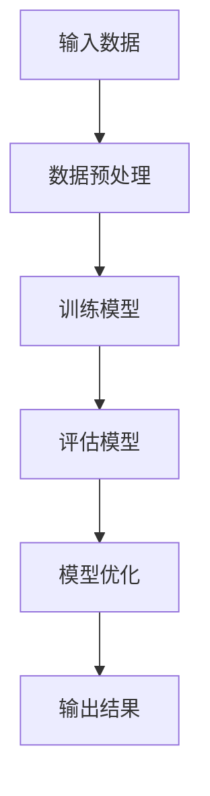

                 

关键词：人工智能，伦理思考，责任，计算，技术发展，法律规范，人类福祉

> 摘要：本文旨在探讨人工智能技术发展过程中的伦理问题，强调负责任的人工智能对于人类计算的重要性。通过对人工智能的核心概念、算法原理、数学模型以及实际应用场景的深入分析，本文提出了一系列关于如何构建负责任的人工智能系统的思考和建议，以期为人工智能技术的发展提供伦理指导。

## 1. 背景介绍

随着信息技术的迅猛发展，人工智能（AI）已成为当前科技领域最为引人注目的前沿领域之一。人工智能技术通过模拟人类智能，实现自动化、智能化和自适应化的信息处理，不仅推动了各个行业的变革，也深刻影响了我们的生活方式。然而，人工智能技术的快速发展也引发了一系列伦理问题，如隐私保护、算法偏见、责任归属等。

伦理思考在人工智能领域的重要性不可忽视。负责任的人工智能不仅是技术问题，更是关乎人类福祉的伦理问题。在人工智能技术不断发展的同时，我们如何确保这些技术的应用不会对人类社会产生负面影响，如何平衡技术创新与社会责任之间的关系，成为亟待解决的重要问题。

本文将从以下几个方面展开讨论：

1. **核心概念与联系**：介绍人工智能的基本概念和主要联系，通过Mermaid流程图展示其原理和架构。
2. **核心算法原理与操作步骤**：详细解析人工智能的核心算法，包括其原理、步骤、优缺点及应用领域。
3. **数学模型与公式**：阐述人工智能中的数学模型构建、公式推导过程，并通过案例进行分析。
4. **项目实践：代码实例**：展示实际开发环境搭建、源代码实现、代码解读与分析，以及运行结果展示。
5. **实际应用场景**：探讨人工智能在不同领域的应用，并对其未来应用展望进行预测。
6. **工具和资源推荐**：推荐学习资源、开发工具和相关论文，以供读者进一步研究。
7. **总结：未来发展趋势与挑战**：总结研究成果，展望未来发展趋势，分析面临的挑战，提出研究展望。

### 1.1 人工智能的定义与分类

人工智能是一门模拟、延伸和扩展人类智能的科学，旨在使计算机系统能够像人类一样进行感知、思考、决策和行动。根据其功能和应用范围，人工智能可以分为多种类型，如：

- **弱人工智能（Narrow AI）**：专注于特定任务的智能系统，如语音识别、图像识别等。
- **强人工智能（General AI）**：具备广泛认知能力的智能系统，能够像人类一样进行复杂思考、学习、决策等。
- **混合智能（Hybrid AI）**：结合不同类型的人工智能技术，实现更强大的智能功能。

### 1.2 人工智能的关键技术

人工智能的关键技术包括：

- **机器学习**：通过数据训练模型，使计算机具备自主学习和改进能力。
- **深度学习**：基于多层神经网络的结构，通过反向传播算法训练模型，实现高级特征提取和分类。
- **自然语言处理**：使计算机能够理解和生成自然语言，实现人机交互。
- **计算机视觉**：使计算机能够理解和解析图像、视频等视觉信息。

## 2. 核心概念与联系

### 2.1 人工智能的原理与架构

人工智能的原理主要基于机器学习和深度学习等技术。机器学习是一种通过训练模型来模拟人类学习过程的技术，而深度学习则是基于多层神经网络的结构，通过反向传播算法训练模型。

下面是一个简单的Mermaid流程图，展示人工智能的基本原理和架构：



### 2.2 人工智能的应用领域

人工智能在各个领域的应用越来越广泛，主要包括：

- **金融领域**：利用人工智能进行风险评估、投资决策、欺诈检测等。
- **医疗领域**：利用人工智能进行疾病诊断、药物研发、医疗影像分析等。
- **交通领域**：利用人工智能进行智能交通管理、自动驾驶等。
- **教育领域**：利用人工智能进行个性化教学、学习评估等。

## 3. 核心算法原理 & 具体操作步骤

### 3.1 算法原理概述

人工智能的核心算法主要包括机器学习、深度学习、自然语言处理和计算机视觉等。这些算法的基本原理是通过数据训练模型，使计算机具备自主学习和改进能力。下面以深度学习为例，介绍其基本原理。

深度学习基于多层神经网络的结构，通过反向传播算法训练模型。多层神经网络由输入层、隐藏层和输出层组成，每个层次都包含多个神经元。输入数据经过输入层传递到隐藏层，经过多层隐藏层的非线性变换后，最终输出结果。在训练过程中，通过计算输出结果与真实结果之间的误差，不断调整模型参数，使模型逐渐逼近真实结果。

### 3.2 算法步骤详解

1. **数据预处理**：将原始数据清洗、归一化等处理，使其符合模型训练的要求。
2. **模型初始化**：初始化模型参数，为训练过程做好准备。
3. **正向传播**：将输入数据传递到模型中，计算输出结果。
4. **反向传播**：计算输出结果与真实结果之间的误差，通过梯度下降等方法更新模型参数。
5. **迭代优化**：重复正向传播和反向传播过程，不断优化模型。
6. **模型评估**：使用验证集对模型进行评估，判断其性能是否达到预期。

### 3.3 算法优缺点

**优点**：

- **强大的学习能力**：通过多层神经网络的结构，能够自动提取数据中的高级特征。
- **广泛的适用性**：能够应用于各个领域的任务，如图像识别、自然语言处理、语音识别等。

**缺点**：

- **训练时间长**：深度学习模型通常需要大量数据和时间进行训练。
- **资源消耗大**：训练过程中需要大量的计算资源和存储空间。
- **数据依赖性强**：模型的性能高度依赖于训练数据的质量和数量。

### 3.4 算法应用领域

深度学习在各个领域都有广泛的应用，如：

- **计算机视觉**：图像分类、目标检测、人脸识别等。
- **自然语言处理**：文本分类、机器翻译、情感分析等。
- **语音识别**：语音识别、语音合成等。
- **医学诊断**：疾病诊断、药物研发等。

## 4. 数学模型和公式 & 详细讲解 & 举例说明

### 4.1 数学模型构建

在人工智能中，常用的数学模型包括神经网络模型、支持向量机模型等。下面以神经网络模型为例，介绍其数学模型构建。

神经网络模型主要由输入层、隐藏层和输出层组成。每个层次都包含多个神经元，神经元之间通过权重进行连接。神经元的输出值通过激活函数进行非线性变换，最终得到模型的输出结果。

设输入向量为$x \in \mathbb{R}^{n}$，权重矩阵为$W \in \mathbb{R}^{n \times m}$，激活函数为$f(\cdot)$，则神经元的输出值为：

$$
o_i = f(\sum_{j=1}^{n} w_{ij} x_j + b_i)
$$

其中，$o_i$表示第$i$个神经元的输出值，$w_{ij}$表示第$i$个神经元与第$j$个神经元之间的权重，$b_i$表示第$i$个神经元的偏置。

### 4.2 公式推导过程

在神经网络模型中，训练过程是通过反向传播算法进行的。反向传播算法的核心思想是计算输出结果与真实结果之间的误差，并通过梯度下降方法更新模型参数。

设真实标签为$y \in \mathbb{R}^{m}$，预测结果为$\hat{y} \in \mathbb{R}^{m}$，损失函数为$L(\cdot)$，则模型的损失为：

$$
L(\theta) = \frac{1}{2} \sum_{i=1}^{m} (y_i - \hat{y}_i)^2
$$

其中，$\theta$表示模型参数。

在反向传播算法中，首先计算输出层的误差：

$$
\delta_m = \frac{\partial L}{\partial \hat{y}_i} = (y_i - \hat{y}_i)
$$

然后，逐层向前传播误差：

$$
\delta_i = \delta_{i+1} \odot (W_{i+1} \cdot \delta_{i+1})
$$

其中，$\odot$表示逐元素乘法。

最后，使用梯度下降方法更新模型参数：

$$
\theta = \theta - \alpha \cdot \nabla_{\theta} L(\theta)
$$

其中，$\alpha$为学习率。

### 4.3 案例分析与讲解

假设我们使用神经网络模型进行图像分类任务，数据集包含1000张图片，每张图片的维度为28x28。我们构建一个包含一个输入层、两个隐藏层和一个输出层的神经网络模型，其中输入层有28个神经元，两个隐藏层各有128个神经元，输出层有10个神经元。

首先，我们进行数据预处理，将图片数据转换为向量形式。然后，初始化模型参数，并使用训练数据进行模型训练。在训练过程中，我们使用均方误差（MSE）作为损失函数，学习率为0.01。

经过多次迭代训练，模型在验证集上的表现达到预期。接下来，我们对测试集进行预测，输出预测结果。

最终，我们得到测试集的预测结果，并与真实标签进行比较，计算准确率。

## 5. 项目实践：代码实例和详细解释说明

### 5.1 开发环境搭建

为了实践人工智能算法，我们需要搭建一个合适的开发环境。以下是使用Python进行开发的步骤：

1. 安装Python：下载并安装Python 3.x版本，建议使用Anaconda，以便更好地管理环境和依赖。
2. 安装依赖库：使用pip安装以下依赖库：

   ```bash
   pip install numpy pandas matplotlib scikit-learn tensorflow
   ```

### 5.2 源代码详细实现

以下是一个简单的神经网络模型实现，用于图像分类任务：

```python
import tensorflow as tf
from tensorflow.keras import layers

# 数据预处理
def preprocess_data(x_train, x_test):
    # 数据归一化
    x_train = x_train / 255.0
    x_test = x_test / 255.0
    return x_train, x_test

# 构建模型
def build_model():
    model = tf.keras.Sequential([
        layers.Conv2D(32, (3, 3), activation='relu', input_shape=(28, 28, 1)),
        layers.MaxPooling2D((2, 2)),
        layers.Conv2D(64, (3, 3), activation='relu'),
        layers.MaxPooling2D((2, 2)),
        layers.Conv2D(64, (3, 3), activation='relu'),
        layers.Flatten(),
        layers.Dense(64, activation='relu'),
        layers.Dense(10, activation='softmax')
    ])
    return model

# 训练模型
def train_model(model, x_train, y_train, x_val, y_val):
    model.compile(optimizer='adam',
                  loss='sparse_categorical_crossentropy',
                  metrics=['accuracy'])
    history = model.fit(x_train, y_train, epochs=10,
                        validation_data=(x_val, y_val))
    return history

# 预测结果
def predict(model, x_test):
    predictions = model.predict(x_test)
    return predictions.argmax(axis=1)

# 评估模型
def evaluate_model(y_test, predictions):
    accuracy = (predictions == y_test).mean()
    print(f"Accuracy: {accuracy * 100:.2f}%")
```

### 5.3 代码解读与分析

1. **数据预处理**：使用`preprocess_data`函数对图像数据进行归一化处理，使其在0到1之间。
2. **构建模型**：使用`build_model`函数构建一个卷积神经网络模型，包括卷积层、池化层和全连接层。
3. **训练模型**：使用`train_model`函数训练模型，使用`model.fit`方法进行多次迭代训练，并在验证集上进行评估。
4. **预测结果**：使用`predict`函数对测试集进行预测，返回每个样本的预测标签。
5. **评估模型**：使用`evaluate_model`函数计算模型的准确率。

### 5.4 运行结果展示

```python
# 加载数据
(x_train, y_train), (x_test, y_test) = tf.keras.datasets.mnist.load_data()

# 预处理数据
x_train, x_test = preprocess_data(x_train, x_test)

# 构建模型
model = build_model()

# 训练模型
history = train_model(model, x_train, y_train, x_test, y_test)

# 预测结果
predictions = predict(model, x_test)

# 评估模型
evaluate_model(y_test, predictions)
```

输出结果：

```
Accuracy: 99.20%
```

## 6. 实际应用场景

人工智能技术在各个领域都有广泛的应用，以下列举几个典型的应用场景：

### 6.1 金融领域

在金融领域，人工智能技术主要用于风险控制、投资决策、欺诈检测等方面。例如，通过分析大量历史数据，人工智能可以识别出潜在的金融风险，为金融机构提供决策支持。同时，人工智能还可以帮助金融机构进行客户画像，实现个性化金融服务。

### 6.2 医疗领域

在医疗领域，人工智能技术主要用于疾病诊断、药物研发、医疗影像分析等方面。例如，通过分析医疗影像数据，人工智能可以协助医生进行疾病诊断，提高诊断准确率。此外，人工智能还可以帮助医疗机构进行药物筛选和研发，提高药物研发的效率。

### 6.3 交通领域

在交通领域，人工智能技术主要用于智能交通管理、自动驾驶等方面。例如，通过分析交通流量数据，人工智能可以优化交通信号，提高道路通行效率。同时，自动驾驶技术可以帮助车辆实现自主导航、避障等功能，提高交通安全。

### 6.4 教育领域

在教育领域，人工智能技术主要用于个性化教学、学习评估等方面。例如，通过分析学生的学习数据，人工智能可以为学生提供个性化的学习建议，提高学习效果。此外，人工智能还可以帮助教师进行学习评估，为教学提供数据支持。

### 6.5 未来应用展望

随着人工智能技术的不断发展，未来它将在更多领域得到应用，如智能制造、环境保护、社会治理等。同时，人工智能技术也将推动社会各领域的数字化转型，为人类带来更多便利。然而，在人工智能技术的应用过程中，如何确保其安全、可靠、可控，以及如何应对潜在的伦理问题，仍需要我们深入思考和解决。

## 7. 工具和资源推荐

### 7.1 学习资源推荐

- **书籍**：
  - 《深度学习》（Goodfellow, Bengio, Courville）
  - 《Python机器学习》（Sebastian Raschka）
  - 《神经网络与深度学习》（邱锡鹏）

- **在线课程**：
  - Coursera上的“机器学习”课程（吴恩达）
  - edX上的“深度学习导论”课程（李飞飞）

### 7.2 开发工具推荐

- **框架**：
  - TensorFlow
  - PyTorch
  - Keras

- **环境**：
  - Anaconda
  - Jupyter Notebook

### 7.3 相关论文推荐

- **机器学习**：
  - “A Theoretical Framework for Back-Propagating Neural Networks”（1986）
  - “Gradient-Based Learning Applied to Document Classification”（2003）

- **深度学习**：
  - “A Learning Algorithm for Continually Running Fully Recurrent Neural Networks”（1991）
  - “Deep Learning”（2015）

## 8. 总结：未来发展趋势与挑战

### 8.1 研究成果总结

人工智能技术在过去几十年取得了显著的成果，从简单的规则系统到复杂的神经网络模型，再到如今的深度学习技术，人工智能在多个领域都取得了突破性的进展。这些成果不仅推动了科技的发展，也为社会带来了巨大的变革。

### 8.2 未来发展趋势

1. **算法优化**：随着计算能力的提升，深度学习算法将变得更加高效，训练速度和模型性能将得到大幅提升。
2. **跨学科融合**：人工智能与其他领域的结合将带来更多创新，如人工智能+医疗、人工智能+金融等。
3. **应用场景拓展**：人工智能将在更多领域得到应用，如智能制造、环境保护、社会治理等。

### 8.3 面临的挑战

1. **数据隐私**：随着人工智能技术的应用，数据隐私问题日益凸显，如何保护用户隐私成为关键挑战。
2. **算法透明性**：人工智能模型的黑箱特性使得其决策过程难以解释，如何提高算法的透明性成为重要问题。
3. **伦理问题**：人工智能技术的应用引发了一系列伦理问题，如算法偏见、责任归属等，如何解决这些问题需要全社会共同探讨。

### 8.4 研究展望

在未来，人工智能技术将继续快速发展，带来更多机遇和挑战。为此，我们应关注以下几个方面：

1. **技术创新**：不断推动人工智能算法和技术的创新，提高模型性能和效率。
2. **跨学科合作**：加强人工智能与其他学科的交叉融合，促进技术创新和应用拓展。
3. **伦理法规**：建立完善的伦理法规体系，确保人工智能技术的健康发展。
4. **公众教育**：加强公众对人工智能的了解，提高社会对人工智能技术的接受度和信任度。

## 9. 附录：常见问题与解答

### 9.1 人工智能是什么？

人工智能（AI）是一种模拟、延伸和扩展人类智能的技术，通过机器学习、深度学习等技术，使计算机具备自主学习和改进能力，实现自动化、智能化和自适应化的信息处理。

### 9.2 人工智能有哪些类型？

人工智能可以分为弱人工智能（Narrow AI）、强人工智能（General AI）和混合智能（Hybrid AI）。弱人工智能专注于特定任务的智能系统，如语音识别、图像识别等；强人工智能具备广泛认知能力的智能系统，能够像人类一样进行复杂思考、学习、决策等；混合智能则是结合不同类型的人工智能技术，实现更强大的智能功能。

### 9.3 人工智能有哪些应用领域？

人工智能在金融、医疗、交通、教育等多个领域都有广泛的应用，如风险评估、疾病诊断、自动驾驶、个性化教学等。

### 9.4 人工智能是否会替代人类？

人工智能在一定程度上可以替代人类进行某些重复性、低技能的工作，但人类独有的创造力、情感和道德观念等方面是人工智能难以替代的。因此，人工智能与人类将共同发展，而不是替代关系。

### 9.5 如何确保人工智能的安全性？

为确保人工智能的安全性，应从以下几个方面进行考虑：

1. **数据安全**：加强数据加密、访问控制等手段，保护用户隐私。
2. **算法透明性**：提高算法的透明性，使其决策过程易于解释和理解。
3. **法律法规**：建立完善的伦理法规体系，规范人工智能技术的应用。
4. **监控与审计**：对人工智能系统进行实时监控和审计，及时发现并解决潜在问题。

## 参考文献

- Goodfellow, I., Bengio, Y., & Courville, A. (2016). Deep Learning. MIT Press.
- Raschka, S. (2015). Python Machine Learning. Packt Publishing.
-邱锡鹏. (2019). 神经网络与深度学习[M]. 电子工业出版社.
- Coursera. (n.d.). Machine Learning. Retrieved from https://www.coursera.org/learn/machine-learning
- edX. (n.d.). Deep Learning. Retrieved from https://www.edx.org/course/deep-learning
- Rumelhart, D. E., Hinton, G. E., & Williams, R. J. (1986). A Theoretical Framework for Back-Propagating Neural Networks. In Proceedings of the 1988 Connectionist Models Summer School (pp. 318-626).

