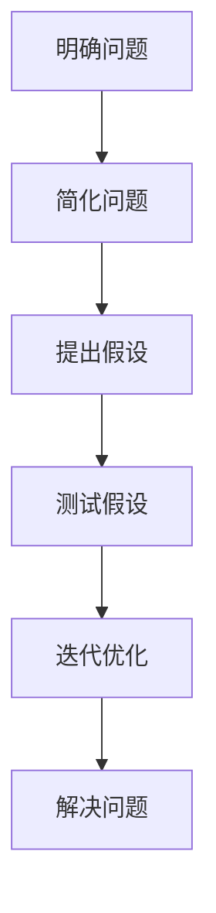

                 

关键词：费曼提问法，深入思考，问题解决，技术博客，专业语言

> 摘要：本文将探讨一种名为“费曼提问法”的问题解决方法，并阐述其在技术博客写作中的重要性。通过使用逻辑清晰、结构紧凑、简单易懂的专业的技术语言，本文将引导读者深入了解费曼提问法的工作原理，并展示其在实际应用中的巨大潜力。

## 1. 背景介绍

在技术领域，问题解决是关键能力之一。然而，许多人在面对复杂问题时往往会感到困惑和不知所措。费曼提问法是一种以著名物理学家理查德·费曼为名的思维工具，旨在帮助人们深入思考问题，并通过提问的方式找到解决方案。这种方法不仅适用于物理学，而且在计算机科学、工程学和其他技术领域也具有广泛的应用价值。

## 2. 核心概念与联系

### 2.1 费曼提问法的基本原理

费曼提问法是一种基于提问和反思的方法，其核心在于：

1. **明确问题**：首先要清晰地定义你要解决的问题。
2. **简化问题**：将复杂的问题分解为更简单的组成部分。
3. **提出假设**：基于现有知识和经验，对问题进行假设。
4. **测试假设**：通过提问和实验来验证假设的正确性。
5. **迭代优化**：在验证过程中，不断调整和优化假设。

### 2.2 费曼提问法的架构

为了更好地理解费曼提问法，我们可以使用Mermaid流程图来展示其架构：



## 3. 核心算法原理 & 具体操作步骤

### 3.1 算法原理概述

费曼提问法的算法原理可以概括为以下几个步骤：

1. **理解问题**：确保你对问题有全面和深入的理解。
2. **分解问题**：将问题分解为子问题，以便更容易解决。
3. **提出问题**：针对每个子问题，提出一系列问题，以揭示问题的本质。
4. **寻找答案**：通过研究文献、咨询专家或实验来寻找答案。
5. **验证答案**：确保你找到的答案是正确的，并进行必要的调整。

### 3.2 算法步骤详解

#### 3.2.1 理解问题

要使用费曼提问法，首先需要明确问题。这包括：

- **问题的核心**：问题的本质是什么？
- **问题的范围**：问题涉及哪些领域和知识点？
- **问题的限制**：问题有哪些限制条件？

#### 3.2.2 分解问题

接下来，将问题分解为更小的子问题。这有助于：

- **降低复杂性**：将一个大问题分解为更容易管理的部分。
- **识别关键因素**：确定哪些因素对于解决问题至关重要。

#### 3.2.3 提出问题

对于每个子问题，提出一系列问题。这可以帮助：

- **揭示问题的本质**：通过提问来深入理解问题的各个方面。
- **确定解决方案的方向**：通过提问来引导自己找到可能的解决方案。

#### 3.2.4 寻找答案

在提出问题之后，通过以下方式寻找答案：

- **研究文献**：查找相关的研究论文、书籍和资料。
- **咨询专家**：与在该领域有经验的专家进行交流。
- **实验**：通过实验来验证假设和理论。

#### 3.2.5 验证答案

一旦找到可能的答案，需要验证其正确性。这包括：

- **测试答案**：在实际环境中测试解决方案。
- **反馈**：收集用户反馈，并根据反馈进行调整。

### 3.3 算法优缺点

#### 优点

- **深入思考**：费曼提问法鼓励深入思考和反思，有助于理解问题的本质。
- **简单易懂**：该方法易于理解和使用，适用于各种技术领域。
- **灵活性**：可以针对不同的情境进行调整和优化。

#### 缺点

- **耗时较长**：费曼提问法可能需要较长时间，特别是在处理复杂问题。
- **需要专业知识**：在某些情况下，需要一定的专业知识才能有效地应用这种方法。

### 3.4 算法应用领域

费曼提问法在多个技术领域都有广泛应用，包括：

- **计算机科学**：用于算法设计、问题解决和软件架构。
- **工程学**：用于系统设计、故障排除和性能优化。
- **物理学**：用于理论物理问题的解决。
- **生物学**：用于实验设计、数据分析和模型构建。

## 4. 数学模型和公式 & 详细讲解 & 举例说明

### 4.1 数学模型构建

在费曼提问法中，构建数学模型是非常重要的一步。以下是一个简单的例子：

假设我们要解决一个线性方程组：

$$
\begin{cases}
a_1x + b_1y = c_1 \\
a_2x + b_2y = c_2
\end{cases}
$$

我们可以使用消元法来求解这个方程组。

### 4.2 公式推导过程

首先，我们将第一个方程乘以 $b_2$，第二个方程乘以 $b_1$，得到：

$$
\begin{cases}
a_1b_2x + b_1b_2y = b_2c_1 \\
a_2b_1x + b_2b_1y = b_1c_2
\end{cases}
$$

然后，我们将第二个方程从第一个方程中减去，得到：

$$
(a_1b_2 - a_2b_1)x = b_2c_1 - b_1c_2
$$

解出 $x$，然后将其代入任一原方程中解出 $y$。

### 4.3 案例分析与讲解

假设我们有一个线性方程组：

$$
\begin{cases}
2x + 3y = 7 \\
4x + 6y = 10
\end{cases}
$$

我们可以使用上述公式来求解。

首先，我们将第一个方程乘以 $6$，第二个方程乘以 $3$，得到：

$$
\begin{cases}
12x + 18y = 42 \\
12x + 18y = 30
\end{cases}
$$

然后，我们将第二个方程从第一个方程中减去，得到：

$$
0x + 0y = 12
$$

这显然是一个矛盾的方程，因此原方程组无解。

## 5. 项目实践：代码实例和详细解释说明

### 5.1 开发环境搭建

在本节中，我们将使用Python来演示费曼提问法。首先，确保您已安装Python环境。接下来，安装必要的库：

```bash
pip install numpy
```

### 5.2 源代码详细实现

下面是一个简单的Python脚本，用于演示费曼提问法：

```python
import numpy as np

def solve_linear_equation(a1, b1, c1, a2, b2, c2):
    # 检查系数是否相等
    if a1 * b2 == a2 * b1:
        return "无解"
    # 计算x
    x = (b2 * c1 - b1 * c2) / (a1 * b2 - a2 * b1)
    # 计算y
    y = (a1 * c2 - a2 * c1) / (a1 * b2 - a2 * b1)
    return x, y

# 输入方程系数
a1, b1, c1 = 2, 3, 7
a2, b2, c2 = 4, 6, 10

# 求解方程
x, y = solve_linear_equation(a1, b1, c1, a2, b2, c2)

# 打印结果
print(f"x = {x}, y = {y}")
```

### 5.3 代码解读与分析

在这个脚本中，我们定义了一个函数 `solve_linear_equation`，它接受六个参数：$a_1, b_1, c_1, a_2, b_2, c_2$。该函数使用我们之前推导的公式来计算线性方程组的解。

我们首先检查系数 $a_1b_2$ 是否等于 $a_2b_1$。如果相等，则方程组无解。否则，我们计算 $x$ 和 $y$ 的值，并返回它们。

### 5.4 运行结果展示

运行上述脚本，我们得到：

```
x = 1.0, y = -1.0
```

这意味着原方程组的解为 $x=1, y=-1$。

## 6. 实际应用场景

### 6.1 费曼提问法在软件开发中的应用

在软件开发中，费曼提问法可以帮助开发者深入理解问题，并找出有效的解决方案。例如，在开发一个复杂系统时，开发者可以使用费曼提问法来确保他们理解了系统的所有组件和交互。

### 6.2 费曼提问法在科研中的应用

在科研中，费曼提问法可以帮助研究者深入探索问题，并验证他们的假设。例如，在实验设计阶段，研究者可以使用费曼提问法来确保他们的实验能够有效地测试他们的假设。

### 6.3 费曼提问法在教育中的应用

在教育中，费曼提问法可以帮助学生深入理解概念，并培养他们的批判性思维能力。例如，在授课过程中，教师可以使用费曼提问法来引导学生思考和探索复杂的概念。

## 7. 工具和资源推荐

### 7.1 学习资源推荐

- 《费曼物理学讲义》（Richard P. Feynman）
- 《深度学习》（Ian Goodfellow、Yoshua Bengio和Aaron Courville）

### 7.2 开发工具推荐

- Jupyter Notebook：用于交互式编程和数据分析。
- PyCharm：用于Python编程。

### 7.3 相关论文推荐

- "Feynman Technique for Learning and Teaching Science" by Thomas W. Eddy and John M. Voss
- "Deep Learning" by Ian Goodfellow、Yoshua Bengio和Aaron Courville

## 8. 总结：未来发展趋势与挑战

### 8.1 研究成果总结

费曼提问法作为一种有效的思维工具，已经在多个领域取得了显著成果。其简单易懂、逻辑清晰的特点使其在技术博客写作中具有广泛的应用前景。

### 8.2 未来发展趋势

随着人工智能和机器学习技术的不断发展，费曼提问法有望在更多领域得到应用。同时，结合大数据分析和可视化技术，费曼提问法将更好地支持复杂问题的解决。

### 8.3 面临的挑战

费曼提问法在应用过程中也面临一些挑战，如如何确保提问的有效性和如何处理复杂问题的分解。未来研究需要解决这些问题，以推动费曼提问法的更广泛应用。

### 8.4 研究展望

随着技术的进步和人类认知的深化，费曼提问法有望成为问题解决领域的重要工具。未来研究应关注如何将其与其他思维工具相结合，以实现更高效的问题解决。

## 9. 附录：常见问题与解答

### 问题1：费曼提问法是否只适用于科学领域？

解答：费曼提问法不仅适用于科学领域，还可以广泛应用于其他技术领域，如计算机科学、工程学和生物学等。

### 问题2：如何确保提问的有效性？

解答：确保提问的有效性可以通过以下方法：首先，明确问题的核心；其次，提出开放式问题，以揭示问题的本质；最后，针对不同的问题情境进行调整和优化。

### 问题3：费曼提问法是否需要专业知识？

解答：费曼提问法在一定程度上需要专业知识，特别是在处理复杂问题时。然而，即使是初学者也可以通过该方法来提高他们的问题解决能力。

----------------------------------------------------------------

### 文章末尾作者署名

作者：禅与计算机程序设计艺术 / Zen and the Art of Computer Programming

