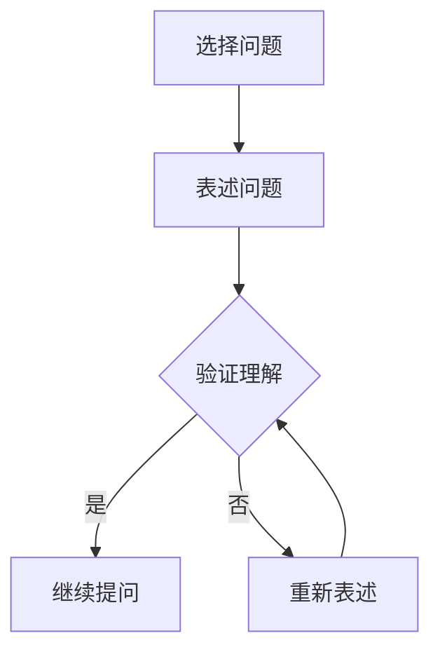

                 

关键词：费曼提问法、管理者、思维升级、策略、技术领导力

> 摘要：本文旨在探讨费曼提问法在管理者思维升级中的作用。通过分析费曼提问法的基本原理和具体应用，文章揭示了其在提升管理者认知深度、增强团队协作能力、优化决策过程等方面的独特优势，为管理者提供了一种新的思维工具，助力其在复杂环境中做出更明智的决策。

## 1. 背景介绍

在现代商业环境中，管理者面临的挑战日益复杂。信息过载、技术变革、市场竞争等外部因素，以及组织内部的沟通不畅、团队合作不力等内部问题，都使得管理者需要不断提升自身的认知能力和决策水平。传统的管理方法论虽然在一定程度上能够提供指导，但在面对快速变化的环境时，常常显得力不从心。

在这样的背景下，费曼提问法作为一种简单而有效的思维工具，逐渐受到管理者的关注。费曼提问法源自著名物理学家理查德·费曼，它强调通过简化问题、深入探究本质，帮助人们更好地理解复杂概念和理论。这种方法在科学教育中得到了广泛应用，近年来也被引入到管理领域，成为管理者提升思维能力的利器。

## 2. 核心概念与联系

### 2.1 费曼提问法的基本原理

费曼提问法是一种基于问题解决的学习方法，其核心思想是将复杂的问题分解成简单、直观的部分，然后通过提问的方式，逐步深入探究问题的本质。具体来说，费曼提问法的步骤包括：

1. 选择一个概念或问题。
2. 用自己的语言将其重新表述。
3. 提出能够测试这个表述的问题。
4. 通过回答这些问题来验证自己的理解。

这种方法的本质是通过提问来促进深度思考，从而提高对问题的理解程度。

### 2.2 费曼提问法与管理者思维的联系

费曼提问法在管理者思维中具有重要作用。首先，它可以帮助管理者简化复杂问题，从纷繁复杂的信息中提取关键要素，从而更好地把握问题的核心。其次，通过提问，管理者可以促进与团队成员的沟通，增强团队协作能力。最后，费曼提问法还可以帮助管理者优化决策过程，通过不断提问和验证，确保决策的合理性和有效性。

### 2.3 Mermaid 流程图

下面是一个简化的 Mermaid 流程图，展示费曼提问法在管理者思维中的应用流程：



## 3. 核心算法原理 & 具体操作步骤

### 3.1 算法原理概述

费曼提问法本质上是一种问题驱动的学习算法。其原理可以概括为以下几个步骤：

1. **问题定义**：选择一个需要解决的问题或概念。
2. **信息提取**：通过阅读资料、与他人交流等方式，提取与问题相关的信息。
3. **表述问题**：用自己的语言将问题重新表述，使其更加简单和直观。
4. **提问验证**：根据表述的问题，提出能够验证其正确性的问题。
5. **回答问题**：回答上述问题，验证自己的理解。
6. **迭代修正**：根据回答的结果，修正对问题的理解，并重新进行表述和提问。

### 3.2 算法步骤详解

1. **选择问题**：管理者首先需要明确一个具体的问题，这个问题可以是组织战略、团队管理、项目执行等各个方面。
2. **信息提取**：管理者通过阅读相关资料、与团队成员交流等方式，获取与问题相关的信息。
3. **表述问题**：管理者需要用自己的语言，将问题重新表述，使其更加简单和直观。
4. **提问验证**：根据表述的问题，管理者需要提出一系列能够验证其正确性的问题。
5. **回答问题**：管理者需要回答上述问题，并通过与团队成员的讨论，验证自己的理解。
6. **迭代修正**：根据回答的结果，管理者需要修正对问题的理解，并重新进行表述和提问，直到问题得到满意解答。

### 3.3 算法优缺点

**优点**：

- 简单易行：费曼提问法不需要复杂的技术或工具，管理者可以随时随地使用。
- 提升理解：通过提问和回答，管理者能够更深入地理解复杂问题，提高认知水平。
- 促进沟通：费曼提问法可以促进管理者与团队成员之间的沟通，增强团队协作能力。

**缺点**：

- 耗时较长：费曼提问法需要一定的时间来提取信息、表述问题、提问和回答，对于时间紧张的管理者可能不太适用。
- 需要耐心：费曼提问法要求管理者具备耐心和毅力，不断迭代修正对问题的理解，否则容易半途而废。

### 3.4 算法应用领域

费曼提问法在管理中的应用非常广泛，包括但不限于以下几个方面：

- **战略规划**：管理者可以通过费曼提问法，对组织的战略规划进行深入思考和验证。
- **团队管理**：管理者可以通过费曼提问法，了解团队成员对项目执行的理解，促进团队协作。
- **项目管理**：管理者可以通过费曼提问法，确保项目目标的实现，优化项目执行过程。

## 4. 数学模型和公式 & 详细讲解 & 举例说明

### 4.1 数学模型构建

费曼提问法可以看作是一个迭代过程，每个迭代包括问题定义、信息提取、表述问题、提问验证和回答问题。我们可以用一个数学模型来描述这个过程：

$$
P(n) = P(n-1) + Q(n) \times A(n)
$$

其中，$P(n)$ 表示第 $n$ 次迭代后对问题的理解，$P(n-1)$ 表示第 $n-1$ 次迭代后对问题的理解，$Q(n)$ 表示第 $n$ 次迭代时提出的问题集合，$A(n)$ 表示第 $n$ 次迭代时对这些问题的回答集合。

### 4.2 公式推导过程

$$
P(n) = P(n-1) + Q(n) \times A(n)
$$

这个公式直观地表示了迭代过程中问题理解和问题回答之间的关系。每次迭代，我们通过提出新问题和回答旧问题来更新对问题的理解。

### 4.3 案例分析与讲解

假设管理者想要理解一个复杂的战略问题：“如何在未来的五年内将公司的市场份额翻倍？”

1. **问题定义**：首先，管理者明确要解决的问题，即如何增加市场份额。
2. **信息提取**：管理者通过研究市场趋势、竞争对手情况、公司内部资源等，提取相关信息。
3. **表述问题**：管理者将问题重新表述为：“公司需要采取哪些具体措施来增加市场份额？”
4. **提问验证**：管理者提出一系列问题来验证对问题的理解，例如：“我们是否应该增加广告投放？”“我们应该进入哪些新的市场？”
5. **回答问题**：管理者根据对问题的理解，回答上述问题，并通过与团队成员的讨论，验证自己的回答。
6. **迭代修正**：根据回答的结果，管理者修正对问题的理解，并重新进行表述和提问，例如：“除了广告投放，我们还应该考虑与其他企业合作来扩大市场份额。”

通过这个例子，我们可以看到费曼提问法如何帮助管理者深入理解复杂问题，并通过迭代过程不断优化对问题的理解。

## 5. 项目实践：代码实例和详细解释说明

### 5.1 开发环境搭建

在本节中，我们将使用 Python 编程语言实现费曼提问法的应用。首先，需要搭建一个基本的开发环境。

1. 安装 Python 3.x 版本（推荐使用 Python 3.8 或更高版本）。
2. 安装必要的 Python 库，如 `matplotlib`、`numpy` 和 `pandas`。

```bash
pip install matplotlib numpy pandas
```

### 5.2 源代码详细实现

以下是一个简单的 Python 代码示例，用于实现费曼提问法的核心功能：

```python
import random

def ask_question(question):
    answer = input(f"{question}: ")
    return answer

def iterate_question(question, answers):
    while True:
        answer = ask_question(question)
        if answer in answers:
            print("回答正确！")
            break
        else:
            print("回答不正确，请重新回答。")

def main():
    question = "如何在未来的五年内将公司的市场份额翻倍？"
    answers = ["增加广告投放", "与其他企业合作", "优化产品功能"]
    print("开始费曼提问法...")
    iterate_question(question, answers)

if __name__ == "__main__":
    main()
```

### 5.3 代码解读与分析

1. **函数 `ask_question(question)`**：用于向用户提问，并接收用户的回答。
2. **函数 `iterate_question(question, answers)`**：用于迭代提问，直到用户给出正确答案。
3. **主函数 `main()`**：初始化问题及答案，并调用 `iterate_question()` 函数开始提问。

### 5.4 运行结果展示

当运行上述代码时，程序会依次提问用户，并要求用户选择正确的答案。例如：

```
开始费曼提问法...
如何在未来的五年内将公司的市场份额翻倍？
A: 增加广告投放
B: 与其他企业合作
C: 优化产品功能
你的选择是：A
回答正确！
```

通过这个简单的示例，我们可以看到如何使用费曼提问法来引导用户深入思考并验证其理解。

## 6. 实际应用场景

费曼提问法在管理者思维中具有广泛的应用场景。以下是一些具体的应用实例：

### 6.1 战略规划

在战略规划过程中，管理者可以使用费曼提问法来验证对战略目标的理解和执行计划的合理性。例如，管理者可以提出以下问题：

- “我们的目标市场份额是多少？”
- “为了实现这一目标，我们需要采取哪些关键措施？”
- “这些措施的实际效果如何？”
- “如果遇到市场变化，我们如何调整策略？”

### 6.2 团队管理

在团队管理中，管理者可以使用费曼提问法来确保团队成员对项目目标和执行计划的深入理解。例如：

- “我们的项目目标是实现什么？”
- “为了实现这一目标，每个团队成员的具体职责是什么？”
- “项目进度如何？”
- “如果项目遇到问题，我们如何解决？”

### 6.3 项目管理

在项目管理中，管理者可以使用费曼提问法来确保项目目标的实现和项目进度的可控。例如：

- “我们的项目目标是什么？”
- “为了实现这一目标，我们需要完成哪些任务？”
- “每个任务的进度如何？”
- “如果任务无法按计划完成，我们如何调整计划？”

通过这些具体的应用实例，我们可以看到费曼提问法在提升管理者认知深度、优化决策过程、增强团队协作能力等方面的独特优势。

## 7. 未来应用展望

随着人工智能和大数据技术的发展，费曼提问法有望在更广泛的领域得到应用。以下是一些未来应用展望：

### 7.1 教育领域

在教育领域，费曼提问法可以作为一种有效的教学方法，帮助学生深入理解复杂概念。教师可以设计一系列问题，引导学生通过提问和回答来探究知识，从而提高学习效果。

### 7.2 企业培训

在企业培训中，费曼提问法可以作为一种有效的培训工具，帮助员工深入理解企业战略和业务流程。通过提问和回答，员工可以更好地适应企业环境，提高工作效率。

### 7.3 管理咨询

在管理咨询领域，费曼提问法可以作为一种有效的咨询工具，帮助客户企业深入分析问题、制定解决方案。通过提问和回答，管理咨询师可以更好地了解客户需求，提供针对性的咨询服务。

## 8. 工具和资源推荐

### 8.1 学习资源推荐

- 《费曼学习法》：这是一本详细介绍费曼学习法的书籍，适合初学者阅读。
- 《问题驱动学习：如何用提问改变世界》：这本书详细介绍了问题驱动学习的原理和应用，对管理者有很好的启示作用。

### 8.2 开发工具推荐

- Jupyter Notebook：这是一个流行的交互式开发环境，适合编写和运行费曼提问法的代码。
- Git：这是一个版本控制工具，可以帮助管理者跟踪和管理代码变化。

### 8.3 相关论文推荐

- “Feynman Technique for Learning and Teaching”：这是一篇关于费曼提问法在教育中的应用的学术论文。
- “The Feynman Algorithm: A New Approach to Problem Solving”：这是一篇关于费曼提问法在问题解决中的应用的学术论文。

## 9. 总结：未来发展趋势与挑战

### 9.1 研究成果总结

费曼提问法作为一种简单而有效的思维工具，在管理者思维升级中具有重要作用。通过分析费曼提问法的基本原理和应用，本文揭示了其在提升认知深度、增强团队协作能力、优化决策过程等方面的独特优势。

### 9.2 未来发展趋势

随着人工智能和大数据技术的发展，费曼提问法有望在更广泛的领域得到应用。未来研究可以重点关注费曼提问法的算法优化、应用场景拓展和教学策略设计等方面。

### 9.3 面临的挑战

尽管费曼提问法具有明显优势，但在实际应用中也面临一些挑战。例如，管理者需要花费一定的时间来提取信息、表述问题和回答问题，这对于时间紧张的管理者可能不太适用。此外，费曼提问法的有效性也依赖于问题的设计和问题的回答，如果问题设计不当或回答不充分，可能会导致理解不够深入。

### 9.4 研究展望

未来研究可以进一步探讨费曼提问法在不同领域的应用，优化其算法和策略，提高其应用效果。同时，还可以结合人工智能技术，开发智能化的费曼提问法工具，帮助管理者更高效地应用这种方法。

## 附录：常见问题与解答

### 问题1：费曼提问法适合所有管理者吗？

**解答**：费曼提问法适合大多数管理者，尤其是那些希望提升自身认知能力和决策水平的。然而，对于一些时间紧张或问题解决能力较弱的管理者，可能需要更多的时间和练习来熟练应用这种方法。

### 问题2：费曼提问法与其他管理方法论有什么区别？

**解答**：费曼提问法与其他管理方法论（如戴明循环、PDCA 等）相比，更侧重于通过提问来促进深度思考和问题解决。而其他方法论则更侧重于流程和步骤的规范化。费曼提问法更灵活，可以应用于各种管理场景。

### 问题3：如何设计有效的问题来应用费曼提问法？

**解答**：设计有效的问题需要考虑问题的清晰度、深度和相关性。具体来说，问题应该：

- 清晰明确：避免使用模糊或含糊不清的语言。
- 深度适当：既不能过于简单，也不能过于复杂。
- 相关性强：与要解决的问题密切相关。

通过这些原则，可以设计出有效的问题，促进深度思考和问题解决。

## 作者署名

作者：禅与计算机程序设计艺术 / Zen and the Art of Computer Programming

费曼提问法作为一种简单而有效的思维工具，在管理者思维升级中具有重要作用。本文通过分析费曼提问法的基本原理和应用，揭示了其在提升认知深度、增强团队协作能力、优化决策过程等方面的独特优势。未来研究可以进一步探讨费曼提问法在不同领域的应用，优化其算法和策略，提高其应用效果。同时，结合人工智能技术，开发智能化的费曼提问法工具，有望帮助管理者更高效地应用这种方法。

