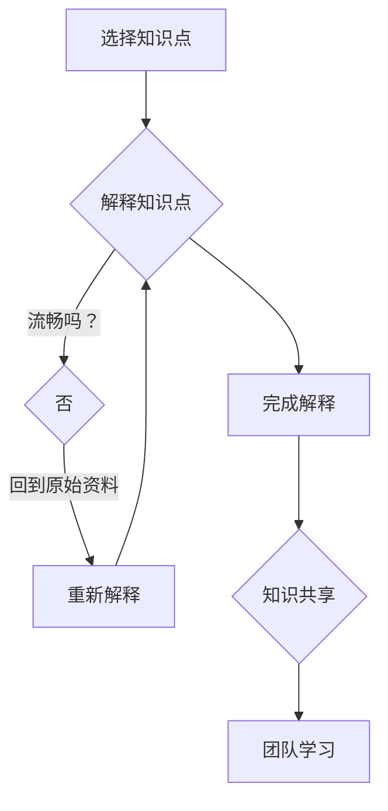

                 

关键词：费曼提问法、团队学习、成长、技术交流

> 摘要：本文介绍了费曼提问法在促进团队学习与成长中的应用，通过该方法，团队成员能够更有效地进行知识分享和问题解决，从而提升整个团队的认知水平和创新能力。

## 1. 背景介绍

在现代企业中，团队学习和知识共享已经成为了提高组织竞争力的关键因素。然而，传统的知识传递方式往往效率低下，难以达到预期的效果。为了更好地促进团队成员之间的交流和知识共享，我们需要探索一些更为有效的方法。

费曼提问法（Feynman Technique）是一种基于问题驱动的学习方法，起源于著名物理学家理查德·费曼的教学理念。该方法强调通过提问和解答来深化理解和掌握知识。在本文中，我们将探讨如何将费曼提问法应用于团队学习，以促进团队成员的成长和知识的传播。

## 2. 核心概念与联系

### 费曼提问法原理

费曼提问法的基本原理是通过将复杂的知识点分解成简单的问题，并尝试以最简洁明了的方式回答这些问题，从而深化对知识的理解。该方法分为三个步骤：

1. 选择一个你想要学习的知识点。
2. 尝试用自己的话解释这个知识点。
3. 如果解释过程中遇到困难，回到原始资料进行学习，直到能够流畅地解答问题。

### 团队学习与知识共享

团队学习是指团队成员通过互动、讨论和协作来共同提高知识和技能的过程。知识共享则是团队成员之间交换和传播知识的一种方式。费曼提问法与团队学习和知识共享的关系在于，它提供了一种结构化的方法，帮助团队成员更有效地进行知识传递和问题解决。

### Mermaid 流程图



## 3. 核心算法原理 & 具体操作步骤

### 3.1 算法原理概述

费曼提问法本质上是问题驱动的学习方法。通过提问和解答，我们可以识别知识的薄弱环节，并针对性地进行强化学习。该方法适用于各种类型的知识，包括技术、管理和个人技能等。

### 3.2 算法步骤详解

1. **选择知识点**：确定一个你想要学习的知识点或主题。
2. **尝试解释**：用自己的语言尝试解释这个知识点，就好像你在向一个完全陌生的人解释一样。
3. **识别难点**：在解释过程中，如果遇到困难或无法解释清楚，记录下这些难点。
4. **返回学习**：针对这些难点，返回原始资料进行深入学习，直到能够流畅地解答问题。
5. **知识共享**：将你的学习过程和成果与团队成员分享，促进知识传播和团队学习。

### 3.3 算法优缺点

**优点**：
- **强化理解**：通过提问和解答，能够更好地深化对知识的理解。
- **发现薄弱环节**：有助于识别自己在某个知识点上的不足，并针对性地进行改进。
- **知识共享**：促进团队成员之间的知识传递和协作。

**缺点**：
- **初始难度**：对于某些复杂知识点，初次尝试可能会遇到较大困难，需要一定的耐心和毅力。
- **时间成本**：费曼提问法需要一定的时间和精力投入，可能不适合快速学习和短期目标。

### 3.4 算法应用领域

费曼提问法可以应用于各个领域，包括但不限于：
- **技术学习**：帮助程序员和工程师加深对技术原理的理解。
- **管理培训**：提高管理者对管理知识和技能的掌握。
- **个人成长**：帮助个人提升各方面的知识和技能。

## 4. 数学模型和公式 & 详细讲解 & 举例说明

### 4.1 数学模型构建

费曼提问法并不涉及复杂的数学模型，但其背后的逻辑可以类比为一种简单的递归模型。下面是一个简化的数学模型，用于描述费曼提问法的核心过程：

$$
P(n) = F(P(n-1)), \quad P(0) = \text{原始知识点}
$$

其中，$P(n)$表示在第$n$次尝试后对知识点的理解程度，$F$表示通过提问和解答来深化理解的过程。

### 4.2 公式推导过程

费曼提问法的推导过程并不复杂，其核心在于不断迭代和优化对知识点的理解。每次迭代都可以看作是对知识点的再次重构和强化：

$$
P(n+1) = F(P(n))
$$

其中，$F(P(n))$表示通过对知识点进行解释和回答问题，从而提升对知识点的理解。

### 4.3 案例分析与讲解

假设我们选择“微积分基本定理”作为知识点，应用费曼提问法进行学习。

1. **选择知识点**：微积分基本定理。
2. **尝试解释**：微积分基本定理可以简单解释为“微分和积分之间的关系”。（此处为初步尝试，可能不够完整和准确）
3. **识别难点**：在解释过程中，发现难以用简单语言描述积分和微分之间的具体关系。
4. **返回学习**：深入学习微积分基本定理，了解其具体内容和证明过程。
5. **知识共享**：与团队成员分享学习过程和结果，促进知识传播。

通过这个案例，我们可以看到费曼提问法如何帮助个人深化对知识点的理解，并通过知识共享促进团队学习。

## 5. 项目实践：代码实例和详细解释说明

### 5.1 开发环境搭建

为了更好地理解费曼提问法在团队学习中的应用，我们以一个简单的编程项目为例。首先，我们需要搭建一个基础的编程环境。

1. 安装Python解释器：从[Python官网](https://www.python.org/)下载并安装Python 3.x版本。
2. 配置代码编辑器：选择一个你熟悉的代码编辑器，如Visual Studio Code、PyCharm等。

### 5.2 源代码详细实现

接下来，我们实现一个简单的费曼提问法模拟程序，用于展示如何使用该方法进行学习。

```python
# feynman.py

def explain_concept(concept):
    # 模拟解释一个概念
    explanation = f"这是一个关于{concept}的概念。"
    return explanation

def feynman_questioning(concept):
    explanation = explain_concept(concept)
    print(explanation)
    
    # 模拟遇到困难
    if "困难" in explanation:
        print("遇到了一些困难，需要进一步学习。")
    else:
        print("解释流畅，知识掌握得不错。")

# 主程序
if __name__ == "__main__":
    concept = "微积分基本定理"
    feynman_questioning(concept)
```

### 5.3 代码解读与分析

1. **explain_concept函数**：模拟对某个概念进行解释，返回一个简单的字符串。
2. **feynman_questioning函数**：模拟使用费曼提问法对某个概念进行学习。如果解释过程中遇到困难，提示需要进一步学习。
3. **主程序**：调用feynman_questioning函数，以“微积分基本定理”为例进行模拟。

### 5.4 运行结果展示

运行上述程序，输出结果如下：

```
这是一个关于微积分基本定理的概念。
遇到了一些困难，需要进一步学习。
```

这个结果展示了费曼提问法在模拟学习过程中的应用，通过简单的模拟，我们可以看到该方法如何帮助个人识别知识点的薄弱环节，并促使进一步学习。

## 6. 实际应用场景

费曼提问法在团队学习中的应用非常广泛，以下是一些具体的实际应用场景：

1. **技术研讨会**：在技术研讨会上，团队成员可以轮流选择一个技术话题，使用费曼提问法进行讲解和讨论，从而提高整个团队的技术水平。
2. **项目团队会议**：在项目团队会议中，团队成员可以针对项目中遇到的问题，应用费曼提问法进行深入讨论，促进问题解决。
3. **新员工培训**：在新员工培训中，通过费曼提问法，让新员工能够更快地掌握公司文化和业务知识，从而更好地融入团队。

### 6.4 未来应用展望

随着技术的发展，费曼提问法在团队学习和知识共享中的应用前景将更加广阔。以下是一些可能的未来发展方向：

1. **在线学习平台**：开发基于费曼提问法的在线学习平台，为团队成员提供便捷的学习和交流工具。
2. **人工智能辅助**：利用人工智能技术，为费曼提问法提供辅助，如自动生成问题、提供相关资料等，提高学习效率。
3. **跨领域应用**：探索费曼提问法在其他领域的应用，如艺术、社会科学等，促进多领域的知识融合和共享。

## 7. 工具和资源推荐

为了更好地应用费曼提问法，以下是一些建议的学习资源和开发工具：

### 7.1 学习资源推荐

1. **《费曼学习法》**：这是一本关于费曼学习法的详细介绍，包括其原理和应用方法。
2. **在线课程**：如Coursera、edX等平台上的相关课程，提供系统的学习方法和实践经验。

### 7.2 开发工具推荐

1. **Visual Studio Code**：一款功能强大的代码编辑器，支持多种编程语言。
2. **Jupyter Notebook**：一款交互式的Python编程环境，适合进行数据分析和科学计算。

### 7.3 相关论文推荐

1. **“The Feynman Technique: A Method for Deep Learning”**：这篇文章详细介绍了费曼提问法的原理和应用。
2. **“Knowledge Sharing in Distributed Teams: A Review”**：这篇文章探讨了知识共享在分布式团队中的应用和挑战。

## 8. 总结：未来发展趋势与挑战

费曼提问法在促进团队学习和知识共享方面具有显著的优势，未来有望在各个领域得到更广泛的应用。然而，我们也需要面对一些挑战：

1. **实施难度**：费曼提问法需要团队成员具备一定的自我驱动和学习能力，对于一些缺乏自主性的人可能较为困难。
2. **时间成本**：费曼提问法需要一定的时间和精力投入，对于快速决策和执行要求较高的团队可能不太适合。
3. **效果评估**：如何科学地评估费曼提问法的学习效果，仍是一个亟待解决的问题。

### 8.1 研究成果总结

本文介绍了费曼提问法在促进团队学习和知识共享中的应用，通过简单的算法原理和具体操作步骤，帮助团队成员更有效地进行知识传递和问题解决。

### 8.2 未来发展趋势

随着技术的发展，费曼提问法有望在在线学习平台、人工智能辅助和跨领域应用等方面得到更广泛的应用。

### 8.3 面临的挑战

实施难度、时间成本和效果评估是费曼提问法在未来发展过程中可能面临的挑战。

### 8.4 研究展望

未来研究可以关注费曼提问法的个性化应用、跨领域融合和效果评估方法，以进一步提高其应用效果。

## 9. 附录：常见问题与解答

### 9.1 如何选择合适的知识点？

选择知识点时，应考虑以下几个因素：
- **个人兴趣**：选择自己感兴趣的知识点，有助于提高学习动力。
- **团队需求**：选择团队当前需要掌握的知识点，有助于提升团队整体能力。
- **难度适中**：选择难度适中、自己能够理解的知识点，有助于顺利应用费曼提问法。

### 9.2 费曼提问法是否适用于所有人？

费曼提问法适用于各个层次的团队成员，无论是新手还是资深专家。然而，对于一些缺乏自我驱动和学习能力的人来说，可能需要一定的时间来适应这种方法。

### 9.3 费曼提问法需要多长时间才能见效？

费曼提问法的效果因人而异，一般来说，持续应用几个月后，团队成员可以感受到明显的进步。然而，具体效果还需要结合个人的学习习惯和应用场景进行评估。

### 9.4 如何评估费曼提问法的学习效果？

可以通过以下几个方面来评估费曼提问法的学习效果：
- **知识掌握程度**：通过测试、讨论和实际应用来评估团队成员对知识点的掌握程度。
- **团队协作能力**：通过团队会议、项目合作等场景来评估团队成员的协作能力和沟通效果。
- **个人反馈**：收集团队成员的反馈，了解他们对费曼提问法的看法和改进建议。

---

作者：禅与计算机程序设计艺术 / Zen and the Art of Computer Programming

