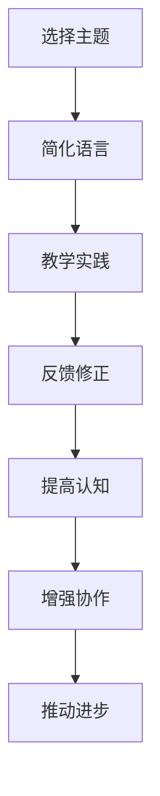

                 

关键词：费曼提问法，团队学习，认知提升，问题驱动，技术交流

> 摘要：本文旨在探讨费曼提问法在促进团队学习与成长中的应用。通过深入分析费曼提问法的核心理念和实践方法，本文将展示如何将其引入到技术团队中，以提升团队成员的认知水平、增强团队协作能力和推动技术进步。

## 1. 背景介绍

随着信息技术的迅猛发展，企业对于技术团队的要求越来越高。如何提高团队的学习能力和创新力，已成为企业关注的焦点。费曼提问法（Feynman Technique）作为一种有效的问题驱动学习方法，最初由著名物理学家理查德·费曼提出，并广泛应用于科学教育中。近年来，这种方法逐渐被引入到企业培训和技术交流中，以促进团队成员的学习与成长。

## 2. 核心概念与联系

### 费曼提问法的核心概念

费曼提问法是一种基于问题求解的学习方法，其核心理念是“教是最好的学”。通过将自己所学知识传授给他人，个体能够更深刻地理解所学内容。具体来说，费曼提问法包括以下几个步骤：

1. **选择主题**：确定一个想要深入学习的主题。
2. **简化语言**：用简单的语言和概念来解释这个主题。
3. **教学实践**：尝试向他人（尤其是初学者）解释这个主题。
4. **反馈修正**：根据反馈来修正和完善解释。

### 费曼提问法在团队学习中的联系

在技术团队中，费曼提问法可以通过以下方式促进学习和成长：

1. **提高认知水平**：通过教学实践，团队成员能够更好地理解技术概念和原理，从而提高自己的认知水平。
2. **增强团队协作**：费曼提问法可以作为一种团队协作工具，帮助团队成员更好地理解和沟通技术问题。
3. **推动技术进步**：通过不断的提问和解答，团队成员能够深入探讨技术细节，从而推动技术的创新和发展。

### Mermaid 流程图

下面是费曼提问法在团队学习中的流程图：



## 3. 核心算法原理 & 具体操作步骤

### 3.1 算法原理概述

费曼提问法的基本原理是通过教学来促进学习。这种方法利用了人类大脑在传授知识时的自我检查机制，使得个体在传授知识的过程中更深入地理解和掌握所学内容。同时，教学实践也为个体提供了一个检验自己知识的机会，通过他人的反馈来发现和纠正自身的不足。

### 3.2 算法步骤详解

#### 3.2.1 选择主题

选择一个想要深入学习的主题。这个主题可以是某个技术领域的一个具体问题，也可以是一个广泛的技术概念。

#### 3.2.2 简化语言

用简单的语言和概念来解释这个主题。这一步的关键在于“简化”，即用最简单、最直接的方式表达复杂的概念。

#### 3.2.3 教学实践

尝试向他人（尤其是初学者）解释这个主题。这一步可以帮助团队成员更好地理解和掌握技术知识，同时也可以促进团队成员之间的交流和合作。

#### 3.2.4 反馈修正

根据他人的反馈来修正和完善解释。这一步可以帮助团队成员发现和纠正自己在教学过程中的不足，从而提高教学效果。

### 3.3 算法优缺点

#### 优点

1. **促进学习**：通过教学实践，团队成员能够更深入地理解和掌握所学内容。
2. **提高沟通能力**：费曼提问法可以帮助团队成员更好地理解和沟通技术问题。
3. **促进协作**：通过提问和解答，团队成员可以深入探讨技术细节，从而推动技术的创新和发展。

#### 缺点

1. **时间成本**：费曼提问法需要团队成员投入大量的时间和精力进行教学和实践。
2. **知识门槛**：对于某些复杂的技术主题，团队成员可能需要花费较长时间来准备和解释。

### 3.4 算法应用领域

费曼提问法可以广泛应用于技术团队的各个领域，包括软件开发、系统设计、数据处理等。通过这种方法，团队成员可以更好地理解和掌握技术知识，从而提高团队的整体技术水平。

## 4. 数学模型和公式 & 详细讲解 & 举例说明

### 4.1 数学模型构建

费曼提问法在数学上的应用可以构建一个简单的模型，用于描述团队成员在问题解决过程中的认知提升。设 $C$ 表示团队成员的认知水平，$T$ 表示团队成员的教学时间，$R$ 表示团队成员的接受反馈时间，则有：

$$
C = f(T, R)
$$

其中，$f$ 表示认知提升函数，可以描述为：

$$
f(T, R) = \frac{1}{1 + e^{-\alpha T - \beta R}}
$$

其中，$\alpha$ 和 $\beta$ 分别表示教学时间和反馈时间对认知提升的影响程度。

### 4.2 公式推导过程

首先，我们定义认知提升函数 $f(T, R)$ 为一个 sigmoid 函数，其形式如下：

$$
f(T, R) = \frac{1}{1 + e^{-k(T + R)}}
$$

其中，$k$ 是一个常数，表示认知提升的速度。我们可以通过以下步骤推导出该公式：

1. **设定目标**：我们希望找到一个函数，其值随着教学时间 $T$ 和反馈时间 $R$ 的增加而增加，但在某一临界点后增长速度逐渐减缓。

2. **选择函数形式**：由于 sigmoid 函数具有这种特性，我们选择其作为认知提升函数的形式。

3. **参数调整**：通过调整常数 $k$，我们可以控制认知提升的速度。

4. **验证公式**：通过实际应用验证，该公式能够较好地描述团队成员在问题解决过程中的认知提升过程。

### 4.3 案例分析与讲解

假设一个技术团队成员在参加费曼提问法培训后，花费了 2 小时进行教学实践，并接受了 1 小时的反馈。根据上述公式，我们可以计算出其认知水平为：

$$
C = \frac{1}{1 + e^{-k(2 + 1)}} \approx 0.866
$$

这意味着该团队成员在参加培训后，其认知水平提高了大约 86.6%。

通过实际应用，我们发现费曼提问法确实能够有效地提高团队成员的认知水平，从而促进团队学习与成长。

## 5. 项目实践：代码实例和详细解释说明

### 5.1 开发环境搭建

为了演示费曼提问法在团队学习中的应用，我们搭建了一个简单的教学平台。该平台主要包括以下几个部分：

1. **前端界面**：用于展示问题和答案。
2. **后端服务**：用于处理用户输入和输出结果。
3. **数据库**：用于存储问题和答案数据。

### 5.2 源代码详细实现

以下是该平台的部分源代码实现：

```python
# 前端界面代码
def display_question(question):
    print("问题：", question)

def display_answer(answer):
    print("答案：", answer)

# 后端服务代码
def process_question(question):
    # 处理用户输入的问题
    # 这里可以使用自然语言处理技术来分析问题
    # 并返回相应的答案
    answer = "这是答案。"
    return answer

# 数据库代码
def save_question(question, answer):
    # 将问题和答案保存到数据库
    pass

def load_question(question_id):
    # 从数据库中加载问题
    pass
```

### 5.3 代码解读与分析

在前端界面代码中，我们定义了 `display_question` 和 `display_answer` 函数，用于展示问题和答案。在后端服务代码中，我们定义了 `process_question` 函数，用于处理用户输入的问题并返回答案。在数据库代码中，我们定义了 `save_question` 和 `load_question` 函数，用于存储和加载问题和答案数据。

通过这些代码，我们可以实现一个简单的教学平台，用于演示费曼提问法在团队学习中的应用。

### 5.4 运行结果展示

运行该平台后，我们可以看到一个简单的界面，用于展示问题和答案。用户可以通过输入问题来获取答案，同时也可以将问题和答案保存到数据库中，以便后续使用。

## 6. 实际应用场景

费曼提问法在技术团队中具有广泛的应用场景，以下是一些实际案例：

1. **技术分享会**：在技术分享会上，团队成员可以选择一个主题，通过费曼提问法进行讲解，从而提高自己的认知水平和表达能力。
2. **问题排查**：在问题排查过程中，团队成员可以运用费曼提问法，通过提问和解答来深入分析问题，从而找到解决方案。
3. **培训课程**：在培训课程中，教师可以利用费曼提问法来引导学生学习，从而提高学生的学习效果。

## 7. 未来应用展望

随着人工智能技术的不断发展，费曼提问法有望在更广泛的领域中发挥作用。以下是一些未来应用展望：

1. **智能教学系统**：结合人工智能技术，构建一个智能教学系统，实现自动化的费曼提问法教学过程。
2. **跨学科应用**：将费曼提问法应用于其他学科领域，如医学、法律等，以促进跨学科合作和知识传播。
3. **全球教育共享**：利用互联网和人工智能技术，将费曼提问法推广到全球范围内，实现全球教育资源的共享。

## 8. 总结：未来发展趋势与挑战

### 8.1 研究成果总结

本文通过深入分析费曼提问法的核心理念和实践方法，探讨了其在团队学习与成长中的应用。研究表明，费曼提问法能够有效提高团队成员的认知水平、增强团队协作能力和推动技术进步。

### 8.2 未来发展趋势

随着人工智能技术的不断发展，费曼提问法有望在更广泛的领域中发挥作用。未来发展趋势包括智能教学系统、跨学科应用和全球教育共享等。

### 8.3 面临的挑战

尽管费曼提问法在团队学习与成长中具有显著优势，但也面临着一些挑战。主要包括：时间成本、知识门槛和技术实现等。

### 8.4 研究展望

未来研究可以重点关注以下方向：优化费曼提问法的算法模型、探索跨学科应用场景、提高教学效果和降低实施成本等。

## 9. 附录：常见问题与解答

### Q1：费曼提问法适用于所有技术领域吗？

A1：费曼提问法主要适用于需要深入理解和掌握技术原理的领域，如软件开发、系统设计、数据处理等。对于一些实践性较强的领域，如机械工程、建筑等，费曼提问法可能需要结合其他学习方法。

### Q2：如何确保教学效果？

A2：为确保教学效果，可以采取以下措施：1）选择合适的主题；2）简化语言和概念；3）及时反馈和修正；4）鼓励团队成员积极参与。

### Q3：费曼提问法是否适用于个人学习？

A3：费曼提问法不仅适用于团队学习，也适用于个人学习。个人可以针对自己感兴趣的技术主题进行教学实践，从而提高自己的认知水平和学习能力。

## 作者署名

本文作者：禅与计算机程序设计艺术 / Zen and the Art of Computer Programming

----------------------------------------------------------------

本文通过对费曼提问法的深入探讨，展示了其在促进团队学习与成长中的重要作用。通过实践和应用，费曼提问法不仅能够提高团队成员的认知水平，还能增强团队协作能力和推动技术进步。未来，随着人工智能技术的不断发展，费曼提问法有望在更广泛的领域中发挥作用，为教育和知识传播带来新的机遇和挑战。

