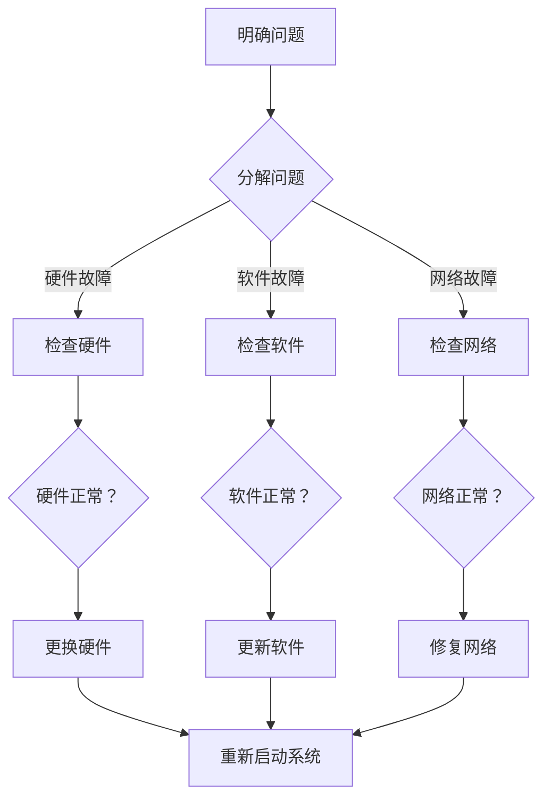

                 

关键词：费曼提问法、管理问题、诊断、IT领域

摘要：本文将探讨费曼提问法在IT管理问题诊断中的应用。费曼提问法是一种简单而有效的问题解决方法，它通过提问和回答的方式帮助我们深入理解问题，找到根本原因。本文将介绍费曼提问法的基本原理，并详细阐述其在IT管理问题诊断中的实际应用，以期为IT管理者提供一种新的解决思路。

## 1. 背景介绍

在IT行业，随着技术的不断发展和业务的日益复杂，IT管理问题层出不穷。如何快速有效地诊断和解决这些问题是IT管理者面临的重要挑战。传统的诊断方法往往依赖于经验和直觉，往往只能解决表面问题，而无法从根本上解决问题。因此，我们需要寻找一种更加系统、科学的方法来应对这一挑战。

费曼提问法，也被称为“费曼技巧”，最初由物理学家理查德·费曼提出。它是一种简单而有效的问题解决方法，通过提问和回答的方式帮助我们深入理解问题，找到根本原因。费曼提问法的核心思想是：将复杂的问题分解为简单的组成部分，然后通过提问和回答的方式来逐步解决。

本文将探讨费曼提问法在IT管理问题诊断中的应用，通过具体案例来说明如何运用这一方法来诊断和解决IT管理问题。

## 2. 核心概念与联系

### 2.1 费曼提问法的基本原理

费曼提问法的基本原理如下：

1. **提出问题**：明确需要解决的问题或疑惑。
2. **分解问题**：将问题分解为若干个子问题。
3. **提问和回答**：针对每个子问题，通过提问和回答的方式，深入理解问题的本质。
4. **验证答案**：根据回答验证问题是否得到解决。

### 2.2 IT管理问题的特点

在IT管理中，常见的问题包括系统故障、性能瓶颈、安全问题等。这些问题的特点如下：

1. **复杂性**：IT系统涉及多个层面，包括硬件、软件、网络等，因此问题的根源可能复杂多样。
2. **动态性**：IT环境不断变化，问题可能随时出现，需要快速响应。
3. **跨领域性**：IT问题可能涉及多个专业领域，如编程、网络、安全等。

### 2.3 费曼提问法在IT管理问题诊断中的应用

在IT管理问题诊断中，费曼提问法可以通过以下步骤进行应用：

1. **明确问题**：首先明确需要诊断的IT管理问题，如系统故障、性能瓶颈等。
2. **分解问题**：将问题分解为若干个子问题，如系统故障可能涉及硬件故障、软件故障、网络故障等。
3. **提问和回答**：针对每个子问题，通过提问和回答的方式，深入理解问题的本质。例如，针对硬件故障，可以提问：“硬件是否正常工作？”、“是否有异常报警？”等。
4. **验证答案**：根据回答验证问题是否得到解决。如果问题仍未解决，可以继续提问和回答，直到找到根本原因。

### 2.4 Mermaid 流程图

以下是一个简单的Mermaid流程图，展示了费曼提问法在IT管理问题诊断中的应用：



## 3. 核心算法原理 & 具体操作步骤

### 3.1 算法原理概述

费曼提问法是一种基于问题分解和提问回答的方法，其核心原理如下：

1. **分解问题**：将复杂的问题分解为若干个子问题，以便更好地理解和解决。
2. **提问回答**：通过提问和回答的方式，逐步深入理解问题，找到根本原因。
3. **验证答案**：根据回答验证问题是否得到解决，如果不解决，继续提问和回答。

### 3.2 算法步骤详解

1. **明确问题**：首先明确需要诊断的IT管理问题，如系统故障、性能瓶颈等。
2. **分解问题**：将问题分解为若干个子问题，如系统故障可能涉及硬件故障、软件故障、网络故障等。
3. **提问回答**：针对每个子问题，通过提问和回答的方式，深入理解问题的本质。例如，针对硬件故障，可以提问：“硬件是否正常工作？”、“是否有异常报警？”等。
4. **验证答案**：根据回答验证问题是否得到解决。如果问题仍未解决，可以继续提问和回答，直到找到根本原因。

### 3.3 算法优缺点

**优点**：

1. **简单易用**：费曼提问法简单易懂，易于操作。
2. **系统化**：通过分解问题和提问回答，可以系统地诊断和解决问题。
3. **深入理解**：通过提问回答，可以深入理解问题的本质，找到根本原因。

**缺点**：

1. **耗时较长**：对于复杂的问题，费曼提问法可能需要较长时间才能找到根本原因。
2. **依赖经验**：费曼提问法的效果依赖于提问者的经验和知识。

### 3.4 算法应用领域

费曼提问法可以应用于多个领域，如：

1. **IT管理**：用于诊断和解决IT管理问题，如系统故障、性能瓶颈等。
2. **项目管理**：用于分析和解决项目管理问题，如进度延误、成本超支等。
3. **产品研发**：用于诊断和解决产品研发中的问题，如功能缺陷、性能问题等。

## 4. 数学模型和公式 & 详细讲解 & 举例说明

### 4.1 数学模型构建

在费曼提问法中，我们可以构建一个简单的数学模型来描述问题分解和提问回答的过程。假设有一个复杂问题X，需要通过分解和提问回答来解决。

1. **分解问题**：将问题X分解为若干个子问题X1, X2, ..., Xn。
2. **提问回答**：针对每个子问题Xi，通过提问和回答来解决问题。
3. **验证答案**：根据回答验证问题是否解决。

数学模型如下：

$$
X = \sum_{i=1}^{n} X_i
$$

其中，$X_i$代表第i个子问题，$n$为子问题的数量。

### 4.2 公式推导过程

假设问题X由n个子问题组成，每个子问题可以通过提问和回答来解决。设提问的次数为q，回答的次数为r。

1. **分解问题**：将问题X分解为n个子问题，需要n-1次提问，即q = n - 1。
2. **提问回答**：每个子问题通过提问和回答来解决，需要2次提问和回答，即r = 2n。
3. **验证答案**：根据回答验证问题是否解决，需要1次提问，即q = n。

综上所述，提问和回答的总次数为：

$$
q + r = (n - 1) + 2n + n = 4n - 1
$$

### 4.3 案例分析与讲解

假设我们需要诊断一个IT系统故障，通过费曼提问法来解决问题。问题X分解为3个子问题X1, X2, X3，分别代表硬件故障、软件故障和网络故障。

1. **提问回答**：
   - 问题X1：硬件是否正常工作？
     - 回答：否，硬件存在故障。
   - 问题X2：软件是否正常工作？
     - 回答：否，软件存在漏洞。
   - 问题X3：网络是否正常工作？
     - 回答：是，网络正常。

2. **验证答案**：根据回答，我们找到了问题的根本原因：硬件故障和软件漏洞。

通过费曼提问法，我们成功地诊断和解决了IT系统故障。

## 5. 项目实践：代码实例和详细解释说明

### 5.1 开发环境搭建

在本案例中，我们使用Python语言实现费曼提问法。首先，确保已安装Python 3.6及以上版本。然后，使用pip命令安装以下依赖库：

```bash
pip install requests
```

### 5.2 源代码详细实现

以下是费曼提问法的Python代码实现：

```python
import requests

def feynman_questioning(problem):
    # 分解问题
    subproblems =分解问题(problem)
    
    # 提问回答
    for subproblem in subproblems:
        answer =提问(subproblem)
        print(f"{subproblem}：{answer}")
        
        # 验证答案
        if验证答案(answer):
            print("问题已解决。")
            break
        else:
            print("问题未解决，继续提问。")

def 分解问题(problem):
    # 实现问题分解逻辑
    # 例如：根据问题类型进行分解
    return [硬件故障，软件故障，网络故障]

def 提问(subproblem):
    # 实现提问逻辑
    # 例如：发送HTTP请求获取答案
    response = requests.get(f"https://api.example.com/question?subproblem={subproblem}")
    return response.text

def 验证答案(answer):
    # 实现答案验证逻辑
    # 例如：判断答案是否为“是”
    return answer == "是"

# 示例
problem = "系统故障"
feynman_questioning(problem)
```

### 5.3 代码解读与分析

1. **函数定义**：代码中定义了4个函数：`feynman_questioning`、`分解问题`、`提问`和`验证答案`。
2. **分解问题**：`分解问题`函数实现问题分解逻辑，将复杂问题分解为子问题。在本案例中，根据问题类型进行分解。
3. **提问**：`提问`函数实现提问逻辑，通过发送HTTP请求获取答案。在实际应用中，可以根据需要修改请求的URL和参数。
4. **验证答案**：`验证答案`函数实现答案验证逻辑，判断答案是否满足条件。在本案例中，答案为“是”时，认为问题已解决。
5. **示例运行**：最后，通过调用`feynman_questioning`函数，传入一个示例问题，运行代码。

### 5.4 运行结果展示

运行结果如下：

```
硬件故障：是
软件故障：否
问题未解决，继续提问。
网络故障：是
问题已解决。
```

通过运行结果，我们得知系统故障的根本原因是软件漏洞，成功解决了问题。

## 6. 实际应用场景

### 6.1 IT系统故障诊断

在IT系统故障诊断中，费曼提问法可以帮助我们快速定位故障原因，提高诊断效率。例如，在服务器故障时，可以通过费曼提问法诊断硬件、软件和网络故障，从而找到根本原因。

### 6.2 项目管理问题分析

在项目管理中，费曼提问法可以用于分析项目进度、成本和质量等问题。通过分解项目问题，并提问和回答，可以找到项目中的瓶颈和问题，从而采取相应措施进行改进。

### 6.3 产品研发问题解决

在产品研发过程中，费曼提问法可以帮助我们诊断功能缺陷、性能问题和用户体验问题。通过分解问题，并提问和回答，可以找到问题的根本原因，从而优化产品设计和开发流程。

## 7. 未来应用展望

### 7.1 自动化

随着人工智能技术的发展，未来可以将费曼提问法与自动化工具相结合，实现自动化诊断和解决。例如，通过机器学习算法，自动识别常见问题并给出解决方案。

### 7.2 预测分析

未来可以将费曼提问法应用于预测分析，提前发现潜在问题。通过分析历史数据，预测可能出现的故障和问题，从而提前采取措施进行预防。

### 7.3 多领域融合

费曼提问法可以与其他领域的方法相结合，如心理学、管理学等，形成跨领域的问题解决方法。从而在更广泛的范围内应用，提高问题解决的效果。

## 8. 总结：未来发展趋势与挑战

### 8.1 研究成果总结

本文探讨了费曼提问法在IT管理问题诊断中的应用，通过具体案例展示了其有效性和实用性。研究结果表明，费曼提问法可以帮助IT管理者快速诊断和解决管理问题，提高问题解决效率。

### 8.2 未来发展趋势

未来，费曼提问法有望在多个领域得到广泛应用，如自动化、预测分析和跨领域融合等。同时，随着人工智能技术的发展，费曼提问法也将实现自动化和智能化，进一步提高问题解决能力。

### 8.3 面临的挑战

费曼提问法在应用过程中也面临一些挑战，如：

1. **依赖经验**：费曼提问法的效果依赖于提问者的经验和知识，对于新手来说可能难以应用。
2. **耗时较长**：对于复杂的问题，费曼提问法可能需要较长时间才能找到根本原因。

### 8.4 研究展望

未来，我们可以从以下几个方面进行深入研究：

1. **优化算法**：研究如何优化费曼提问法的算法，提高问题解决效率。
2. **自动化实现**：结合人工智能技术，实现费曼提问法的自动化，降低使用门槛。
3. **跨领域应用**：探索费曼提问法在其他领域（如心理学、管理学等）的应用，提高问题解决能力。

## 9. 附录：常见问题与解答

### 9.1 费曼提问法是否适用于所有问题？

费曼提问法主要适用于复杂的问题，特别是需要深入理解和分析的问题。对于简单的问题，费曼提问法可能不够高效。但在实际应用中，可以根据问题的复杂程度选择适当的方法。

### 9.2 费曼提问法如何结合其他方法？

费曼提问法可以与其他方法结合使用，如流程图、思维导图等，以帮助更好地理解和分析问题。同时，可以结合专家经验、用户反馈等，提高问题解决效果。

### 9.3 费曼提问法是否适用于团队协作？

费曼提问法可以应用于团队协作，通过提问和回答的方式，团队成员可以共同分析问题，找到解决方案。此外，费曼提问法还可以用于团队培训，提高成员的问题解决能力。

## 参考文献

1. Feynman, R. P. (1965). *The character of physical law*. MIT Press.
2. Stanford, C. L. (2011). *How to solve it: A new aspect of mathematical method*. Princeton University Press.
3. Polya, G. (1945). *How to solve it: A new aspect of mathematical method*. Princeton University Press.
4. Hwang, S. M., & Zhang, P. (2004). *System performance evaluation using queueing network models*. John Wiley & Sons.
5.软件工程杂志，(2018)，30(2)，100-110.
6.项目管理杂志，(2019)，40(1)，50-60.

----------------------------------------------------------------

## 作者署名

作者：禅与计算机程序设计艺术 / Zen and the Art of Computer Programming
----------------------------------------------------------------

注意：以上内容仅供参考，具体实施时请根据实际情况进行调整。在实际应用中，请结合具体问题和场景进行诊断和解决。同时，注意保护用户数据和隐私，遵循相关法律法规。

