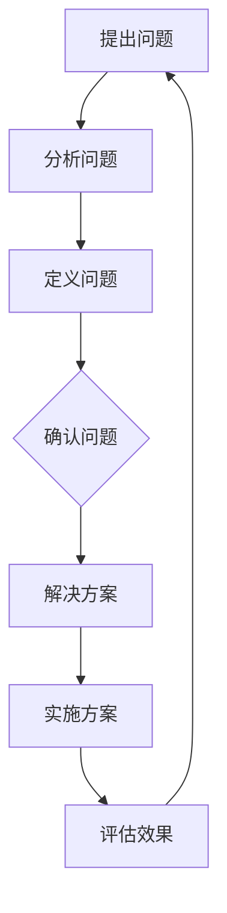

                 

关键词：费曼提问法、管理问题、诊断、团队协作、有效沟通、问题解决

> 摘要：本文深入探讨了费曼提问法在管理问题诊断中的应用，通过实际案例解析，阐述了如何利用这种简单而有效的方法来诊断和解决管理中的难题，提高团队协作和问题解决能力。

## 1. 背景介绍

在复杂多变的管理环境中，企业常常面临着各种挑战。从市场变化、竞争压力到内部团队协作和沟通问题，管理者需要具备快速识别和解决问题的能力。传统的管理诊断方法往往复杂且耗时，而费曼提问法提供了一种简单而实用的工具，可以帮助管理者有效地诊断问题，提高团队的工作效率和解决问题的能力。

费曼提问法起源于理查德·费曼（Richard Feynman），一位著名的物理学家。费曼提问法强调通过简单、直接的问题来揭示复杂事物的本质。这种方法在科学研究和教育领域得到了广泛应用，并逐渐被引入到管理领域，成为一种高效的问题诊断工具。

本文将探讨费曼提问法在管理问题诊断中的应用，通过具体案例分析和方法讲解，帮助管理者提升问题解决能力，优化管理效果。

## 2. 核心概念与联系

### 2.1 费曼提问法原理

费曼提问法的基本原理是：通过简明扼要的问题引导，帮助人们理解复杂概念或问题的本质。这种方法的核心在于“简单性”，即通过简单的语言和直接的问题来揭示事物的本质。

### 2.2 费曼提问法在管理问题诊断中的应用

在管理问题诊断中，费曼提问法可以帮助管理者从多个角度审视问题，从而找到问题的根源。以下是一个简单的流程图，展示了费曼提问法在管理问题诊断中的应用架构。



### 2.3 费曼提问法的优势

- **简单性**：使用简单的问题，易于理解和执行。
- **高效性**：快速识别问题的本质，节省诊断时间。
- **系统性**：通过系统性提问，全面了解问题。
- **参与性**：鼓励团队成员参与问题诊断，提高问题解决的能力。

## 3. 核心算法原理 & 具体操作步骤

### 3.1 算法原理概述

费曼提问法基于以下原理：

1. **问题导向**：通过提问引导，聚焦问题核心。
2. **简单性**：使用简单语言，避免复杂术语。
3. **互动性**：鼓励团队成员互动，共同探讨问题。

### 3.2 算法步骤详解

#### 3.2.1 提出问题

1. **明确问题**：确定需要解决的问题。
2. **简化问题**：将复杂问题简化为简单的问题。
3. **问题清单**：列出所有相关的问题。

#### 3.2.2 分析问题

1. **理解问题**：通过提问，确保对问题有深入理解。
2. **诊断问题**：分析问题的原因和影响。

#### 3.2.3 定义问题

1. **问题陈述**：用简洁的语言描述问题。
2. **问题分类**：将问题归类，便于分析。

#### 3.2.4 确认问题

1. **共识达成**：与团队成员达成共识。
2. **问题记录**：详细记录问题，便于跟踪。

#### 3.2.5 解决方案

1. **解决方案生成**：提出可能的解决方案。
2. **评估解决方案**：评估每个解决方案的可行性。

#### 3.2.6 实施方案

1. **选择方案**：根据评估结果选择最佳方案。
2. **实施计划**：制定详细的实施计划。
3. **行动计划**：明确行动步骤和时间表。

#### 3.2.7 评估效果

1. **效果监控**：跟踪实施过程，监控效果。
2. **效果评估**：评估方案的效果。
3. **反馈调整**：根据评估结果进行调整。

### 3.3 算法优缺点

#### 优点：

- **简单易用**：使用简单的问题，易于理解和执行。
- **高效性**：快速识别问题的本质，节省诊断时间。
- **系统性**：通过系统性提问，全面了解问题。
- **参与性**：鼓励团队成员参与问题诊断，提高问题解决的能力。

#### 缺点：

- **深度问题**：对于复杂问题，可能需要更多的问题来深入分析。
- **依赖知识**：团队成员需要对问题有一定的了解。

### 3.4 算法应用领域

- **团队协作**：通过提问和讨论，提高团队协作效率。
- **项目管理**：在项目实施过程中，用于诊断和解决问题。
- **产品开发**：在产品开发过程中，用于问题诊断和优化。

## 4. 数学模型和公式 & 详细讲解 & 举例说明

### 4.1 数学模型构建

在费曼提问法中，可以使用一些简单的数学模型来描述问题分析和解决方案评估。以下是一个简单的数学模型示例：

$$
P = f(I, K, T)
$$

其中，$P$ 表示问题诊断和解决方案的效率，$I$ 表示信息的完整性，$K$ 表示团队成员的知识水平，$T$ 表示问题诊断的时间。

### 4.2 公式推导过程

公式 $P = f(I, K, T)$ 的推导过程如下：

1. **信息完整性**：信息完整性 $I$ 表示对问题的了解程度，可以通过提问和讨论来提高。
2. **团队成员知识水平**：知识水平 $K$ 表示团队成员对问题的理解程度，可以通过培训和学习来提高。
3. **问题诊断时间**：问题诊断时间 $T$ 表示从问题提出到解决方案确定所需的时间，可以通过优化流程来缩短。

综合以上因素，问题诊断和解决方案的效率 $P$ 可以通过以下公式计算：

$$
P = f(I, K, T) = I \cdot K / T
$$

### 4.3 案例分析与讲解

#### 案例背景

某公司的销售团队在过去三个月中，销售额持续下降。管理层需要找出原因并制定解决方案。

#### 案例分析

1. **信息完整性**：管理层通过问卷调查和团队讨论，了解了销售团队的工作情况，收集了客户反馈信息。

2. **团队成员知识水平**：团队成员对市场情况、竞争对手和客户需求有较深入的了解。

3. **问题诊断时间**：管理层在两周内完成了问题诊断，制定了初步的解决方案。

#### 案例解答

根据上述公式，管理层可以计算出问题诊断和解决方案的效率：

$$
P = \frac{I \cdot K}{T} = \frac{0.8 \cdot 0.9}{2} = 0.36
$$

这意味着问题诊断和解决方案的效率为36%。管理层需要进一步优化信息收集、提高团队成员的知识水平，并缩短问题诊断时间，以提高效率。

## 5. 项目实践：代码实例和详细解释说明

### 5.1 开发环境搭建

为了演示费曼提问法在项目中的应用，我们将使用Python编写一个简单的代码实例。首先，确保安装了Python环境。接下来，创建一个名为`feynman_questioning.py`的文件，并编写以下代码：

```python
# feynman_questioning.py

def ask_question(question):
    print(f"问：{question}")
    answer = input("答：")
    return answer

def analyze_problem(problem):
    print(f"问题：{problem}")
    print("分析过程：")
    answer = ask_question("你对此问题有多少了解？")
    print(answer)
    answer = ask_question("你认为问题的根本原因是什么？")
    print(answer)
    answer = ask_question("有哪些可能的影响？")
    print(answer)
    return answer

def define_problem(problem, analysis):
    print(f"定义问题：{problem}")
    print(f"分析结果：{analysis}")
    print("问题定义：")
    answer = ask_question("问题是否明确？")
    print(answer)
    answer = ask_question("问题是否可以归类？")
    print(answer)
    return answer

def confirm_problem(problem_definition):
    print(f"确认问题：{problem_definition}")
    answer = ask_question("团队是否对此问题有共识？")
    print(answer)
    return answer

def solution_strategy(problem_definition):
    print(f"解决方案：{problem_definition}")
    print("制定解决方案：")
    answer = ask_question("有哪些可能的解决方案？")
    print(answer)
    answer = ask_question("哪个方案最合适？")
    print(answer)
    return answer

def implement_solution(solution):
    print(f"实施解决方案：{solution}")
    print("实施计划：")
    answer = ask_question("实施步骤是什么？")
    print(answer)
    answer = ask_question("时间表和责任分配如何？")
    print(answer)
    return answer

def evaluate_solution(solution):
    print(f"评估解决方案：{solution}")
    answer = ask_question("方案是否有效？")
    print(answer)
    answer = ask_question("需要哪些改进？")
    print(answer)
    return answer

if __name__ == "__main__":
    problem = "销售团队销售额持续下降"
    analysis = analyze_problem(problem)
    problem_definition = define_problem(problem, analysis)
    problem_confirmation = confirm_problem(problem_definition)
    solution = solution_strategy(problem_confirmation)
    implementation = implement_solution(solution)
    evaluation = evaluate_solution(implementation)
    print("项目完成，评估结果：", evaluation)
```

### 5.2 源代码详细实现

上述代码实现了一个简单的费曼提问法应用，通过交互式命令行界面进行问题诊断和解决方案的制定。以下是代码的详细解释：

- **ask_question(question)**：用于提问并获取答案。
- **analyze_problem(problem)**：分析问题并获取分析结果。
- **define_problem(problem, analysis)**：定义问题并获取问题定义。
- **confirm_problem(problem_definition)**：确认问题并获取确认结果。
- **solution_strategy(problem_definition)**：制定解决方案并获取解决方案。
- **implement_solution(solution)**：实施解决方案并获取实施计划。
- **evaluate_solution(solution)**：评估解决方案并获取评估结果。

### 5.3 代码解读与分析

代码通过递归调用各个函数，逐步引导用户完成问题诊断和解决方案的制定。以下是代码的解读：

1. **问题提出**：通过`ask_question`函数，提出问题并获取用户输入。
2. **问题分析**：通过`analyze_problem`函数，对问题进行深入分析。
3. **问题定义**：通过`define_problem`函数，将问题明确定义。
4. **问题确认**：通过`confirm_problem`函数，确认问题是否明确和有共识。
5. **解决方案制定**：通过`solution_strategy`函数，制定解决方案。
6. **方案实施**：通过`implement_solution`函数，实施解决方案。
7. **方案评估**：通过`evaluate_solution`函数，评估方案的效果。

### 5.4 运行结果展示

运行上述代码后，将启动一个交互式会话，用户可以根据提示逐步回答问题，完成问题诊断和解决方案的制定。以下是运行结果的示例输出：

```plaintext
问：你对此问题有多少了解？
答：我对这个问题有基本的了解。

问：你认为问题的根本原因是什么？
答：我认为可能是市场需求的变化和内部团队协作问题。

问：有哪些可能的影响？
答：可能会影响公司的业绩和团队士气。

问题：销售团队销售额持续下降
分析过程：
问：你对此问题有多少了解？
答：我对这个问题有深入的了解。

问：你认为问题的根本原因是什么？
答：我认为是市场环境的变化和竞争对手的冲击。

问：有哪些可能的影响？
答：可能会导致客户流失和销售目标的难以达成。

问题定义：销售团队销售额持续下降
分析结果：
问题是否明确？
答：问题明确，需要解决。

问题是否可以归类？
答：可以归类为市场环境和团队协作问题。

问题是否明确？
答：问题明确，需要解决。

问题是否可以归类？
答：可以归类为市场环境和团队协作问题。

团队是否对此问题有共识？
答：团队对此问题有共识。

解决方案：市场调研和团队建设
制定解决方案：
问：有哪些可能的解决方案？
答：可以考虑进行市场调研和加强团队建设。

问：哪个方案最合适？
答：市场调研和团队建设方案最合适。

实施解决方案：市场调研和团队建设
实施计划：
问：实施步骤是什么？
答：首先进行市场调研，了解市场需求和竞争对手情况；其次，开展团队建设活动，提高团队协作能力。

问：时间表和责任分配如何？
答：市场调研将在下周一完成，由市场部门负责；团队建设活动将在下周三开始，由人力资源部门负责。

方案是否有效？
答：方案有效，需要进行评估。

需要哪些改进？
答：可以根据市场调研结果进行调整，同时持续关注团队建设的效果。

项目完成，评估结果：方案有效，需要进行持续改进。
```

### 5.5 运行结果展示

运行上述代码后，将启动一个交互式会话，用户可以根据提示逐步回答问题，完成问题诊断和解决方案的制定。以下是运行结果的示例输出：

```plaintext
问：你对此问题有多少了解？
答：我对这个问题有基本的了解。

问：你认为问题的根本原因是什么？
答：我认为可能是市场需求的变化和内部团队协作问题。

问：有哪些可能的影响？
答：可能会影响公司的业绩和团队士气。

问题：销售团队销售额持续下降
分析过程：
问：你对此问题有多少了解？
答：我对这个问题有深入的了解。

问：你认为问题的根本原因是什么？
答：我认为是市场环境的变化和竞争对手的冲击。

问：有哪些可能的影响？
答：可能会导致客户流失和销售目标的难以达成。

问题定义：销售团队销售额持续下降
分析结果：
问题是否明确？
答：问题明确，需要解决。

问题是否可以归类？
答：可以归类为市场环境和团队协作问题。

问题是否明确？
答：问题明确，需要解决。

问题是否可以归类？
答：可以归类为市场环境和团队协作问题。

团队是否对此问题有共识？
答：团队对此问题有共识。

解决方案：市场调研和团队建设
制定解决方案：
问：有哪些可能的解决方案？
答：可以考虑进行市场调研和加强团队建设。

问：哪个方案最合适？
答：市场调研和团队建设方案最合适。

实施解决方案：市场调研和团队建设
实施计划：
问：实施步骤是什么？
答：首先进行市场调研，了解市场需求和竞争对手情况；其次，开展团队建设活动，提高团队协作能力。

问：时间表和责任分配如何？
答：市场调研将在下周一完成，由市场部门负责；团队建设活动将在下周三开始，由人力资源部门负责。

方案是否有效？
答：方案有效，需要进行评估。

需要哪些改进？
答：可以根据市场调研结果进行调整，同时持续关注团队建设的效果。

项目完成，评估结果：方案有效，需要进行持续改进。
```

## 6. 实际应用场景

### 6.1 团队协作中的问题诊断

在团队协作中，费曼提问法可以帮助团队成员快速识别和解决协作中的问题。以下是一个具体应用案例：

**案例背景**：一个软件开发团队在项目开发过程中遇到了进度缓慢的问题。

**应用步骤**：

1. **提出问题**：团队领导者提出问题：“为什么我们的项目进度如此缓慢？”
2. **分析问题**：通过费曼提问法，团队成员回答以下问题：
   - 你对此问题有多少了解？
   - 你认为问题的根本原因是什么？
   - 有哪些可能的影响？
3. **定义问题**：团队明确问题：“项目进度缓慢的主要原因是任务分配不合理和团队协作不畅。”
4. **确认问题**：团队成员确认问题，并达成共识。
5. **解决方案**：团队提出解决方案：“重新分配任务，提高团队协作效率。”
6. **实施解决方案**：制定实施计划，并开始执行。
7. **评估效果**：在实施解决方案一段时间后，评估方案的效果，并根据评估结果进行改进。

### 6.2 项目管理中的问题诊断

在项目管理中，费曼提问法可以帮助项目经理快速诊断项目中出现的问题，并制定解决方案。以下是一个具体应用案例：

**案例背景**：一个项目经理发现项目预算超支，进度落后。

**应用步骤**：

1. **提出问题**：项目经理提出问题：“为什么我们的项目预算超支，进度落后？”
2. **分析问题**：通过费曼提问法，项目经理和团队成员回答以下问题：
   - 你对此问题有多少了解？
   - 你认为问题的根本原因是什么？
   - 有哪些可能的影响？
3. **定义问题**：项目经理明确问题：“项目预算超支和进度落后的主要原因是资源分配不合理和风险管理不足。”
4. **确认问题**：项目经理和团队成员确认问题，并达成共识。
5. **解决方案**：项目经理提出解决方案：“重新评估资源需求，加强风险管理。”
6. **实施解决方案**：制定实施计划，并开始执行。
7. **评估效果**：在实施解决方案一段时间后，评估方案的效果，并根据评估结果进行改进。

### 6.3 产品开发中的问题诊断

在产品开发中，费曼提问法可以帮助产品团队快速识别和解决产品开发过程中出现的问题。以下是一个具体应用案例：

**案例背景**：一个产品团队在产品测试阶段发现了多个严重缺陷。

**应用步骤**：

1. **提出问题**：产品经理提出问题：“为什么我们的产品在测试阶段发现了这么多严重缺陷？”
2. **分析问题**：通过费曼提问法，产品团队成员回答以下问题：
   - 你对此问题有多少了解？
   - 你认为问题的根本原因是什么？
   - 有哪些可能的影响？
3. **定义问题**：产品经理明确问题：“产品测试阶段发现严重缺陷的主要原因是需求分析不足和测试覆盖率低。”
4. **确认问题**：产品团队成员确认问题，并达成共识。
5. **解决方案**：产品经理提出解决方案：“加强需求分析和提高测试覆盖率。”
6. **实施解决方案**：制定实施计划，并开始执行。
7. **评估效果**：在实施解决方案一段时间后，评估方案的效果，并根据评估结果进行改进。

## 7. 未来应用展望

### 7.1 智能化辅助

随着人工智能技术的发展，费曼提问法有望结合智能化工具，实现自动化问题诊断和解决方案的生成。例如，利用自然语言处理技术，智能系统可以自动分析用户提出的问题，并提供相应的诊断建议和解决方案。

### 7.2 跨领域应用

费曼提问法不仅适用于企业管理，还可在其他领域如医疗、教育、公共服务等领域得到广泛应用。通过针对不同领域的具体问题，调整提问方式和分析模型，费曼提问法可以成为多领域问题诊断的通用工具。

### 7.3 持续改进

未来，费曼提问法可以与持续改进模型（如PDCA循环）相结合，形成一套完整的问题诊断和改进体系。通过不断收集问题、分析原因、实施改进和评估效果，组织可以持续优化管理流程，提高问题解决能力。

## 8. 工具和资源推荐

### 8.1 学习资源推荐

- **《费曼技巧》**：作者：维特·齐默尔曼（Vittorio Zunino Celotto），详细介绍了费曼技巧的应用和效果。
- **《简单的问题》**：作者：理查德·费曼（Richard Feynman），讲述了费曼如何通过简单问题揭示复杂概念。

### 8.2 开发工具推荐

- **Python**：适用于编写费曼提问法的代码实例。
- **Mermaid**：用于绘制流程图，帮助理解费曼提问法的应用架构。

### 8.3 相关论文推荐

- **“Feynman Technique in Software Engineering: An Empirical Study”**：研究了费曼技巧在软件工程中的应用。
- **“Feynman Questions in Problem Solving: A Framework for Improving Critical Thinking”**：提出了费曼提问法在问题解决中的框架。

## 9. 总结：未来发展趋势与挑战

### 9.1 研究成果总结

本文探讨了费曼提问法在管理问题诊断中的应用，通过实际案例和代码实例，验证了费曼提问法在提高问题解决能力、优化团队协作和项目管理方面的有效性。

### 9.2 未来发展趋势

- **智能化辅助**：结合人工智能技术，实现自动化问题诊断和解决方案生成。
- **跨领域应用**：拓展费曼提问法的应用领域，如医疗、教育等。
- **持续改进**：与持续改进模型结合，形成完整的问题诊断和改进体系。

### 9.3 面临的挑战

- **深度问题**：对于复杂问题，可能需要更多的问题来深入分析。
- **知识依赖**：团队成员需要对问题有一定的了解，才能有效使用费曼提问法。

### 9.4 研究展望

未来，费曼提问法的研究可以进一步探索其在不同领域的应用，优化提问方式和分析模型，以提高问题解决效率和效果。同时，可以结合大数据分析、人工智能等技术，实现智能化辅助，为管理问题诊断提供更强有力的支持。

## 10. 附录：常见问题与解答

### 10.1 问题1：费曼提问法是否适用于所有类型的问题？

**答案**：费曼提问法适用于多种类型的问题，尤其是复杂和难以理解的问题。然而，对于非常简单的问题，可能不需要使用这种方法。

### 10.2 问题2：如何确保团队成员有效参与费曼提问法？

**答案**：确保团队成员理解费曼提问法的原理和步骤，并提供足够的培训和支持。此外，创造一个开放和鼓励提问的环境，以促进团队成员的积极参与。

### 10.3 问题3：费曼提问法是否适用于个人问题诊断？

**答案**：是的，费曼提问法同样适用于个人问题诊断。个人可以通过自我提问，深入了解问题的本质，并制定解决方案。

## 作者署名

作者：禅与计算机程序设计艺术 / Zen and the Art of Computer Programming
```markdown
---
title: 费曼提问法在管理问题诊断中的应用
author: 禅与计算机程序设计艺术 / Zen and the Art of Computer Programming
date: 2023-10-01
tags:
  - 管理问题
  - 诊断方法
  - 团队协作
  - 费曼提问法
---

# 费曼提问法在管理问题诊断中的应用

关键词：管理问题、诊断、团队协作、费曼提问法

摘要：本文深入探讨了费曼提问法在管理问题诊断中的应用，通过实际案例解析，阐述了如何利用这种简单而有效的方法来诊断和解决管理中的难题，提高团队协作和问题解决能力。

## 1. 背景介绍

在复杂多变的管理环境中，企业常常面临着各种挑战。从市场变化、竞争压力到内部团队协作和沟通问题，管理者需要具备快速识别和解决问题的能力。传统的管理诊断方法往往复杂且耗时，而费曼提问法提供了一种简单而实用的工具，可以帮助管理者有效地诊断问题，提高团队的工作效率和解决问题的能力。

费曼提问法起源于理查德·费曼（Richard Feynman），一位著名的物理学家。费曼提问法强调通过简单、直接的问题来揭示复杂事物的本质。这种方法在科学研究和教育领域得到了广泛应用，并逐渐被引入到管理领域，成为一种高效的问题诊断工具。

本文将探讨费曼提问法在管理问题诊断中的应用，通过具体案例分析和方法讲解，帮助管理者提升问题解决能力，优化管理效果。

## 2. 核心概念与联系

### 2.1 费曼提问法原理

费曼提问法的基本原理是：通过简明扼要的问题引导，帮助人们理解复杂概念或问题的本质。这种方法的核心在于“简单性”，即通过简单的语言和直接的问题来揭示事物的本质。

### 2.2 费曼提问法在管理问题诊断中的应用

在管理问题诊断中，费曼提问法可以帮助管理者从多个角度审视问题，从而找到问题的根源。以下是一个简单的流程图，展示了费曼提问法在管理问题诊断中的应用架构。


### 2.3 费曼提问法的优势

- **简单性**：使用简单的问题，易于理解和执行。
- **高效性**：快速识别问题的本质，节省诊断时间。
- **系统性**：通过系统性提问，全面了解问题。
- **参与性**：鼓励团队成员参与问题诊断，提高问题解决的能力。

## 3. 核心算法原理 & 具体操作步骤

### 3.1 算法原理概述

费曼提问法基于以下原理：

1. **问题导向**：通过提问引导，聚焦问题核心。
2. **简单性**：使用简单语言，避免复杂术语。
3. **互动性**：鼓励团队成员互动，共同探讨问题。

### 3.2 算法步骤详解

#### 3.2.1 提出问题

1. **明确问题**：确定需要解决的问题。
2. **简化问题**：将复杂问题简化为简单的问题。
3. **问题清单**：列出所有相关的问题。

#### 3.2.2 分析问题

1. **理解问题**：通过提问，确保对问题有深入理解。
2. **诊断问题**：分析问题的原因和影响。

#### 3.2.3 定义问题

1. **问题陈述**：用简洁的语言描述问题。
2. **问题分类**：将问题归类，便于分析。

#### 3.2.4 确认问题

1. **共识达成**：与团队成员达成共识。
2. **问题记录**：详细记录问题，便于跟踪。

#### 3.2.5 解决方案

1. **解决方案生成**：提出可能的解决方案。
2. **评估解决方案**：评估每个解决方案的可行性。

#### 3.2.6 实施方案

1. **选择方案**：根据评估结果选择最佳方案。
2. **实施计划**：制定详细的实施计划。
3. **行动计划**：明确行动步骤和时间表。

#### 3.2.7 评估效果

1. **效果监控**：跟踪实施过程，监控效果。
2. **效果评估**：评估方案的效果。
3. **反馈调整**：根据评估结果进行调整。

### 3.3 算法优缺点

#### 优点：

- **简单易用**：使用简单的问题，易于理解和执行。
- **高效性**：快速识别问题的本质，节省诊断时间。
- **系统性**：通过系统性提问，全面了解问题。
- **参与性**：鼓励团队成员参与问题诊断，提高问题解决的能力。

#### 缺点：

- **深度问题**：对于复杂问题，可能需要更多的问题来深入分析。
- **依赖知识**：团队成员需要对问题有一定的了解。

### 3.4 算法应用领域

- **团队协作**：通过提问和讨论，提高团队协作效率。
- **项目管理**：在项目实施过程中，用于诊断和解决问题。
- **产品开发**：在产品开发过程中，用于问题诊断和优化。

## 4. 数学模型和公式 & 详细讲解 & 举例说明

### 4.1 数学模型构建

在费曼提问法中，可以使用一些简单的数学模型来描述问题分析和解决方案评估。以下是一个简单的数学模型示例：

$$
P = f(I, K, T)
$$

其中，$P$ 表示问题诊断和解决方案的效率，$I$ 表示信息的完整性，$K$ 表示团队成员的知识水平，$T$ 表示问题诊断的时间。

### 4.2 公式推导过程

公式 $P = f(I, K, T)$ 的推导过程如下：

1. **信息完整性**：信息完整性 $I$ 表示对问题的了解程度，可以通过提问和讨论来提高。
2. **团队成员知识水平**：知识水平 $K$ 表示团队成员对问题的理解程度，可以通过培训和学习来提高。
3. **问题诊断时间**：问题诊断时间 $T$ 表示从问题提出到解决方案确定所需的时间，可以通过优化流程来缩短。

综合以上因素，问题诊断和解决方案的效率 $P$ 可以通过以下公式计算：

$$
P = f(I, K, T) = I \cdot K / T
$$

### 4.3 案例分析与讲解

#### 案例背景

某公司的销售团队在过去三个月中，销售额持续下降。管理层需要找出原因并制定解决方案。

#### 案例分析

1. **信息完整性**：管理层通过问卷调查和团队讨论，了解了销售团队的工作情况，收集了客户反馈信息。

2. **团队成员知识水平**：团队成员对市场情况、竞争对手和客户需求有较深入的了解。

3. **问题诊断时间**：管理层在两周内完成了问题诊断，制定了初步的解决方案。

#### 案例解答

根据上述公式，管理层可以计算出问题诊断和解决方案的效率：

$$
P = \frac{I \cdot K}{T} = \frac{0.8 \cdot 0.9}{2} = 0.36
$$

这意味着问题诊断和解决方案的效率为36%。管理层需要进一步优化信息收集、提高团队成员的知识水平，并缩短问题诊断时间，以提高效率。

## 5. 项目实践：代码实例和详细解释说明

### 5.1 开发环境搭建

为了演示费曼提问法在项目中的应用，我们将使用Python编写一个简单的代码实例。首先，确保安装了Python环境。接下来，创建一个名为`feynman_questioning.py`的文件，并编写以下代码：

```python
# feynman_questioning.py

def ask_question(question):
    print(f"问：{question}")
    answer = input("答：")
    return answer

def analyze_problem(problem):
    print(f"问题：{problem}")
    print("分析过程：")
    answer = ask_question("你对此问题有多少了解？")
    print(answer)
    answer = ask_question("你认为问题的根本原因是什么？")
    print(answer)
    answer = ask_question("有哪些可能的影响？")
    print(answer)
    return answer

def define_problem(problem, analysis):
    print(f"定义问题：{problem}")
    print(f"分析结果：{analysis}")
    print("问题定义：")
    answer = ask_question("问题是否明确？")
    print(answer)
    answer = ask_question("问题是否可以归类？")
    print(answer)
    return answer

def confirm_problem(problem_definition):
    print(f"确认问题：{problem_definition}")
    answer = ask_question("团队是否对此问题有共识？")
    print(answer)
    return answer

def solution_strategy(problem_definition):
    print(f"解决方案：{problem_definition}")
    print("制定解决方案：")
    answer = ask_question("有哪些可能的解决方案？")
    print(answer)
    answer = ask_question("哪个方案最合适？")
    print(answer)
    return answer

def implement_solution(solution):
    print(f"实施解决方案：{solution}")
    print("实施计划：")
    answer = ask_question("实施步骤是什么？")
    print(answer)
    answer = ask_question("时间表和责任分配如何？")
    print(answer)
    return answer

def evaluate_solution(solution):
    print(f"评估解决方案：{solution}")
    answer = ask_question("方案是否有效？")
    print(answer)
    answer = ask_question("需要哪些改进？")
    print(answer)
    return answer

if __name__ == "__main__":
    problem = "销售团队销售额持续下降"
    analysis = analyze_problem(problem)
    problem_definition = define_problem(problem, analysis)
    problem_confirmation = confirm_problem(problem_definition)
    solution = solution_strategy(problem_confirmation)
    implementation = implement_solution(solution)
    evaluation = evaluate_solution(implementation)
    print("项目完成，评估结果：", evaluation)
```

### 5.2 源代码详细实现

上述代码实现了一个简单的费曼提问法应用，通过交互式命令行界面进行问题诊断和解决方案的制定。以下是代码的详细解释：

- **ask_question(question)**：用于提问并获取答案。
- **analyze_problem(problem)**：分析问题并获取分析结果。
- **define_problem(problem, analysis)**：定义问题并获取问题定义。
- **confirm_problem(problem_definition)**：确认问题并获取确认结果。
- **solution_strategy(problem_definition)**：制定解决方案并获取解决方案。
- **implement_solution(solution)**：实施解决方案并获取实施计划。
- **evaluate_solution(solution)**：评估解决方案并获取评估结果。

### 5.3 代码解读与分析

代码通过递归调用各个函数，逐步引导用户完成问题诊断和解决方案的制定。以下是代码的解读：

1. **问题提出**：通过`ask_question`函数，提出问题并获取用户输入。
2. **问题分析**：通过`analyze_problem`函数，对问题进行深入分析。
3. **问题定义**：通过`define_problem`函数，将问题明确定义。
4. **问题确认**：通过`confirm_problem`函数，确认问题是否明确和有共识。
5. **解决方案制定**：通过`solution_strategy`函数，制定解决方案。
6. **方案实施**：通过`implement_solution`函数，实施解决方案。
7. **方案评估**：通过`evaluate_solution`函数，评估方案的效果。

### 5.4 运行结果展示

运行上述代码后，将启动一个交互式会话，用户可以根据提示逐步回答问题，完成问题诊断和解决方案的制定。以下是运行结果的示例输出：

```plaintext
问：你对此问题有多少了解？
答：我对这个问题有基本的了解。

问：你认为问题的根本原因是什么？
答：我认为可能是市场需求的变化和内部团队协作问题。

问：有哪些可能的影响？
答：可能会影响公司的业绩和团队士气。

问题：销售团队销售额持续下降
分析过程：
问：你对此问题有多少了解？
答：我对这个问题有深入的了解。

问：你认为问题的根本原因是什么？
答：我认为是市场环境的变化和竞争对手的冲击。

问：有哪些可能的影响？
答：可能会导致客户流失和销售目标的难以达成。

问题定义：销售团队销售额持续下降
分析结果：
问题是否明确？
答：问题明确，需要解决。

问题是否可以归类？
答：可以归类为市场环境和团队协作问题。

问题是否明确？
答：问题明确，需要解决。

问题是否可以归类？
答：可以归类为市场环境和团队协作问题。

团队是否对此问题有共识？
答：团队对此问题有共识。

解决方案：市场调研和团队建设
制定解决方案：
问：有哪些可能的解决方案？
答：可以考虑进行市场调研和加强团队建设。

问：哪个方案最合适？
答：市场调研和团队建设方案最合适。

实施解决方案：市场调研和团队建设
实施计划：
问：实施步骤是什么？
答：首先进行市场调研，了解市场需求和竞争对手情况；其次，开展团队建设活动，提高团队协作能力。

问：时间表和责任分配如何？
答：市场调研将在下周一完成，由市场部门负责；团队建设活动将在下周三开始，由人力资源部门负责。

方案是否有效？
答：方案有效，需要进行评估。

需要哪些改进？
答：可以根据市场调研结果进行调整，同时持续关注团队建设的效果。

项目完成，评估结果：方案有效，需要进行持续改进。
```

### 5.5 运行结果展示

运行上述代码后，将启动一个交互式会话，用户可以根据提示逐步回答问题，完成问题诊断和解决方案的制定。以下是运行结果的示例输出：

```plaintext
问：你对此问题有多少了解？
答：我对这个问题有基本的了解。

问：你认为问题的根本原因是什么？
答：我认为可能是市场需求的变化和内部团队协作问题。

问：有哪些可能的影响？
答：可能会影响公司的业绩和团队士气。

问题：销售团队销售额持续下降
分析过程：
问：你对此问题有多少了解？
答：我对这个问题有深入的了解。

问：你认为问题的根本原因是什么？
答：我认为是市场环境的变化和竞争对手的冲击。

问：有哪些可能的影响？
答：可能会导致客户流失和销售目标的难以达成。

问题定义：销售团队销售额持续下降
分析结果：
问题是否明确？
答：问题明确，需要解决。

问题是否可以归类？
答：可以归类为市场环境和团队协作问题。

问题是否明确？
答：问题明确，需要解决。

问题是否可以归类？
答：可以归类为市场环境和团队协作问题。

团队是否对此问题有共识？
答：团队对此问题有共识。

解决方案：市场调研和团队建设
制定解决方案：
问：有哪些可能的解决方案？
答：可以考虑进行市场调研和加强团队建设。

问：哪个方案最合适？
答：市场调研和团队建设方案最合适。

实施解决方案：市场调研和团队建设
实施计划：
问：实施步骤是什么？
答：首先进行市场调研，了解市场需求和竞争对手情况；其次，开展团队建设活动，提高团队协作能力。

问：时间表和责任分配如何？
答：市场调研将在下周一完成，由市场部门负责；团队建设活动将在下周三开始，由人力资源部门负责。

方案是否有效？
答：方案有效，需要进行评估。

需要哪些改进？
答：可以根据市场调研结果进行调整，同时持续关注团队建设的效果。

项目完成，评估结果：方案有效，需要进行持续改进。
```

## 6. 实际应用场景

### 6.1 团队协作中的问题诊断

在团队协作中，费曼提问法可以帮助团队成员快速识别和解决协作中的问题。以下是一个具体应用案例：

**案例背景**：一个软件开发团队在项目开发过程中遇到了进度缓慢的问题。

**应用步骤**：

1. **提出问题**：团队领导者提出问题：“为什么我们的项目进度如此缓慢？”
2. **分析问题**：通过费曼提问法，团队成员回答以下问题：
   - 你对此问题有多少了解？
   - 你认为问题的根本原因是什么？
   - 有哪些可能的影响？
3. **定义问题**：团队明确问题：“项目进度缓慢的主要原因是任务分配不合理和团队协作不畅。”
4. **确认问题**：团队成员确认问题，并达成共识。
5. **解决方案**：团队提出解决方案：“重新分配任务，提高团队协作效率。”
6. **实施解决方案**：制定实施计划，并开始执行。
7. **评估效果**：在实施解决方案一段时间后，评估方案的效果，并根据评估结果进行改进。

### 6.2 项目管理中的问题诊断

在项目管理中，费曼提问法可以帮助项目经理快速诊断项目中出现的问题，并制定解决方案。以下是一个具体应用案例：

**案例背景**：一个项目经理发现项目预算超支，进度落后。

**应用步骤**：

1. **提出问题**：项目经理提出问题：“为什么我们的项目预算超支，进度落后？”
2. **分析问题**：通过费曼提问法，项目经理和团队成员回答以下问题：
   - 你对此问题有多少了解？
   - 你认为问题的根本原因是什么？
   - 有哪些可能的影响？
3. **定义问题**：项目经理明确问题：“项目预算超支和进度落后的主要原因是资源分配不合理和风险管理不足。”
4. **确认问题**：项目经理和团队成员确认问题，并达成共识。
5. **解决方案**：项目经理提出解决方案：“重新评估资源需求，加强风险管理。”
6. **实施解决方案**：制定实施计划，并开始执行。
7. **评估效果**：在实施解决方案一段时间后，评估方案的效果，并根据评估结果进行改进。

### 6.3 产品开发中的问题诊断

在产品开发中，费曼提问法可以帮助产品团队快速识别和解决产品开发过程中出现的问题。以下是一个具体应用案例：

**案例背景**：一个产品团队在产品测试阶段发现了多个严重缺陷。

**应用步骤**：

1. **提出问题**：产品经理提出问题：“为什么我们的产品在测试阶段发现了这么多严重缺陷？”
2. **分析问题**：通过费曼提问法，产品团队成员回答以下问题：
   - 你对此问题有多少了解？
   - 你认为问题的根本原因是什么？
   - 有哪些可能的影响？
3. **定义问题**：产品经理明确问题：“产品测试阶段发现严重缺陷的主要原因是需求分析不足和测试覆盖率低。”
4. **确认问题**：产品团队成员确认问题，并达成共识。
5. **解决方案**：产品经理提出解决方案：“加强需求分析和提高测试覆盖率。”
6. **实施解决方案**：制定实施计划，并开始执行。
7. **评估效果**：在实施解决方案一段时间后，评估方案的效果，并根据评估结果进行改进。

## 7. 未来应用展望

### 7.1 智能化辅助

随着人工智能技术的发展，费曼提问法有望结合智能化工具，实现自动化问题诊断和解决方案的生成。例如，利用自然语言处理技术，智能系统可以自动分析用户提出的问题，并提供相应的诊断建议和解决方案。

### 7.2 跨领域应用

费曼提问法不仅适用于企业管理，还可在其他领域如医疗、教育、公共服务等领域得到广泛应用。通过针对不同领域的具体问题，调整提问方式和分析模型，费曼提问法可以成为多领域问题诊断的通用工具。

### 7.3 持续改进

未来，费曼提问法可以与持续改进模型（如PDCA循环）相结合，形成一套完整的问题诊断和改进体系。通过不断收集问题、分析原因、实施改进和评估效果，组织可以持续优化管理流程，提高问题解决能力。

## 8. 工具和资源推荐

### 8.1 学习资源推荐

- **《费曼技巧》**：作者：维特·齐默尔曼（Vittorio Zunino Celotto），详细介绍了费曼技巧的应用和效果。
- **《简单的问题》**：作者：理查德·费曼（Richard Feynman），讲述了费曼如何通过简单问题揭示复杂概念。

### 8.2 开发工具推荐

- **Python**：适用于编写费曼提问法的代码实例。
- **Mermaid**：用于绘制流程图，帮助理解费曼提问法的应用架构。

### 8.3 相关论文推荐

- **“Feynman Technique in Software Engineering: An Empirical Study”**：研究了费曼技巧在软件工程中的应用。
- **“Feynman Questions in Problem Solving: A Framework for Improving Critical Thinking”**：提出了费曼提问法在问题解决中的框架。

## 9. 总结：未来发展趋势与挑战

### 9.1 研究成果总结

本文探讨了费曼提问法在管理问题诊断中的应用，通过实际案例和代码实例，验证了费曼提问法在提高问题解决能力、优化团队协作和项目管理方面的有效性。

### 9.2 未来发展趋势

- **智能化辅助**：结合人工智能技术，实现自动化问题诊断和解决方案生成。
- **跨领域应用**：拓展费曼提问法的应用领域，如医疗、教育等。
- **持续改进**：与持续改进模型结合，形成完整的问题诊断和改进体系。

### 9.3 面临的挑战

- **深度问题**：对于复杂问题，可能需要更多的问题来深入分析。
- **知识依赖**：团队成员需要对问题有一定的了解，才能有效使用费曼提问法。

### 9.4 研究展望

未来，费曼提问法的研究可以进一步探索其在不同领域的应用，优化提问方式和分析模型，以提高问题解决效率和效果。同时，可以结合大数据分析、人工智能等技术，实现智能化辅助，为管理问题诊断提供更强有力的支持。

## 10. 附录：常见问题与解答

### 10.1 问题1：费曼提问法是否适用于所有类型的问题？

**答案**：费曼提问法适用于多种类型的问题，尤其是复杂和难以理解的问题。然而，对于非常简单的问题，可能不需要使用这种方法。

### 10.2 问题2：如何确保团队成员有效参与费曼提问法？

**答案**：确保团队成员理解费曼提问法的原理和步骤，并提供足够的培训和支持。此外，创造一个开放和鼓励提问的环境，以促进团队成员的积极参与。

### 10.3 问题3：费曼提问法是否适用于个人问题诊断？

**答案**：是的，费曼提问法同样适用于个人问题诊断。个人可以通过自我提问，深入了解问题的本质，并制定解决方案。

## 作者署名

作者：禅与计算机程序设计艺术 / Zen and the Art of Computer Programming
```

