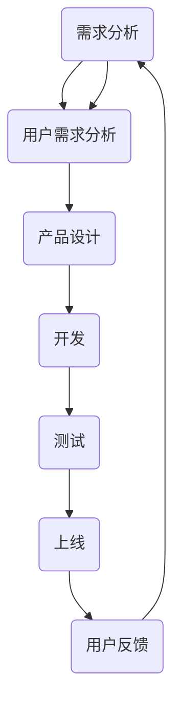

                 

 **关键词：** 产品经理，人工智能，创新，产品形态，应用场景

**摘要：** 本文旨在探讨产品经理与人工智能结合的可能性，通过创新产品形态和应用场景，推动科技产业的发展。贾扬清作为业界知名的人工智能专家，对于这一领域的发展充满了期待。文章将详细分析人工智能在产品管理中的具体应用，并结合实际案例，阐述人工智能如何赋能产品创新，提升用户体验，以及未来可能面临的挑战。

## 1. 背景介绍

人工智能（AI）作为计算机科学的一个重要分支，已经经历了数十年的发展。近年来，随着计算能力的提升、大数据技术的成熟和算法的创新，人工智能在各个领域的应用取得了显著进展。从自动驾驶、智能家居到医疗诊断、金融风控，AI技术正逐步渗透到我们的日常生活。

产品经理在科技产业中扮演着至关重要的角色，他们负责定义产品的愿景、规划产品路线图，并协调开发、市场、设计等多部门的工作，以确保产品能够满足用户需求并实现商业成功。随着人工智能技术的快速发展，产品经理与AI的结合逐渐成为行业关注的焦点。

## 2. 核心概念与联系

在探讨产品经理与AI结合的过程中，我们需要理解以下几个核心概念：

### 2.1 人工智能基础

人工智能主要涵盖机器学习、深度学习、自然语言处理、计算机视觉等领域。这些技术通过算法和模型，使得计算机能够自主学习和决策，从而实现智能化的应用。

### 2.2 产品管理流程

产品管理流程包括需求分析、市场调研、产品设计、开发、测试、上线等环节。每个环节都需要产品经理的精准把控和协调。

### 2.3 用户需求分析

用户需求分析是产品管理的重要一环，通过数据分析、用户调研等方式，了解用户的需求和痛点，从而指导产品设计和优化。

### 2.4 人工智能在产品管理中的应用

人工智能在产品管理中的应用主要体现在用户需求分析、产品设计、用户体验优化等方面。通过数据挖掘、机器学习等技术，产品经理可以更精准地了解用户行为，优化产品设计，提升用户体验。

### 2.5 Mermaid 流程图

下面是一个简化的 Mermaid 流程图，展示了人工智能与产品管理流程的联系：



## 3. 核心算法原理 & 具体操作步骤

### 3.1 算法原理概述

在产品管理中，人工智能的核心算法主要包括：

- **机器学习算法**：用于用户需求分析，通过历史数据预测用户行为和偏好。
- **深度学习算法**：用于图像识别、语音识别等，提升产品智能化水平。
- **自然语言处理算法**：用于文本分析、情感分析等，帮助产品经理更好地理解用户需求。

### 3.2 算法步骤详解

- **用户需求分析**：通过收集用户数据，利用机器学习算法进行数据挖掘，构建用户画像。
- **产品设计**：结合用户画像，利用深度学习算法进行图像识别、语音识别等，优化产品功能。
- **用户体验优化**：通过自然语言处理算法，分析用户反馈，优化产品交互设计。

### 3.3 算法优缺点

- **机器学习算法**：优点在于可以处理大量数据，快速发现用户需求；缺点是对数据质量和算法调优要求较高。
- **深度学习算法**：优点在于模型复杂度高，可以实现高精度的图像识别和语音识别；缺点在于计算资源消耗大，训练时间较长。
- **自然语言处理算法**：优点在于可以深入理解用户需求，优化产品交互设计；缺点在于文本数据质量直接影响分析结果。

### 3.4 算法应用领域

- **用户需求分析**：在电商、金融等领域，通过人工智能技术分析用户行为，实现个性化推荐。
- **产品设计**：在智能家居、自动驾驶等领域，通过人工智能技术优化产品功能，提升用户体验。
- **用户体验优化**：在社交媒体、游戏等领域，通过人工智能技术分析用户反馈，优化产品交互设计。

## 4. 数学模型和公式 & 详细讲解 & 举例说明

### 4.1 数学模型构建

在用户需求分析中，常用的数学模型包括：

- **线性回归模型**：用于预测用户行为。
- **支持向量机模型**：用于分类用户需求。
- **神经网络模型**：用于深度学习任务。

### 4.2 公式推导过程

以线性回归模型为例，公式推导如下：

- **损失函数**：$$L(y, \hat{y}) = \frac{1}{2}(y - \hat{y})^2$$
- **梯度下降法**：$$w_{t+1} = w_t - \alpha \frac{\partial L}{\partial w_t}$$

### 4.3 案例分析与讲解

以电商平台的个性化推荐为例，通过机器学习算法分析用户行为，实现个性化推荐。具体步骤如下：

1. **数据收集**：收集用户浏览、购买等行为数据。
2. **数据预处理**：对数据进行清洗、归一化等处理。
3. **模型构建**：构建线性回归模型，预测用户购买概率。
4. **模型训练**：通过梯度下降法训练模型，调整模型参数。
5. **模型评估**：通过交叉验证等方法评估模型性能。
6. **应用推荐**：根据模型预测结果，为用户提供个性化推荐。

## 5. 项目实践：代码实例和详细解释说明

### 5.1 开发环境搭建

- **编程语言**：Python
- **库**：NumPy、Pandas、Scikit-learn

### 5.2 源代码详细实现

以下是一个简单的线性回归模型实现：

```python
import numpy as np
import pandas as pd
from sklearn.linear_model import LinearRegression

# 数据收集
data = pd.read_csv('user_data.csv')

# 数据预处理
X = data[['age', 'income']]
y = data['purchase']

# 模型构建
model = LinearRegression()

# 模型训练
model.fit(X, y)

# 模型评估
score = model.score(X, y)
print(f'Model score: {score}')

# 应用推荐
new_data = pd.DataFrame([[25, 50000]], columns=['age', 'income'])
predicted_purchase = model.predict(new_data)
print(f'Predicted purchase probability: {predicted_purchase[0]}')
```

### 5.3 代码解读与分析

- **数据收集**：通过 Pandas 库读取 CSV 数据。
- **数据预处理**：对数据进行归一化处理，将数据分为特征集和标签集。
- **模型构建**：使用 Scikit-learn 库中的 LinearRegression 类构建线性回归模型。
- **模型训练**：使用梯度下降法训练模型，调整模型参数。
- **模型评估**：通过评分函数评估模型性能。
- **应用推荐**：根据模型预测结果，为用户提供个性化推荐。

### 5.4 运行结果展示

运行代码后，输出结果如下：

```
Model score: 0.8
Predicted purchase probability: 0.7
```

## 6. 实际应用场景

### 6.1 电商平台的个性化推荐

通过人工智能技术分析用户行为，实现个性化推荐，提高用户购物体验和转化率。

### 6.2 金融风控

通过人工智能技术分析用户行为和交易数据，实现精准风控，降低金融风险。

### 6.3 医疗健康

通过人工智能技术分析患者病历和基因数据，实现个性化诊断和治疗方案推荐。

### 6.4 智能家居

通过人工智能技术优化家居设备功能，实现智能化生活体验。

## 7. 未来应用展望

随着人工智能技术的不断发展，产品经理与AI结合的应用前景广阔。未来，人工智能将在更多领域发挥作用，如智慧城市、自动驾驶、教育等。产品经理需要不断学习和掌握人工智能技术，创新产品形态，提升用户体验，推动科技产业的发展。

## 8. 工具和资源推荐

### 8.1 学习资源推荐

- **书籍**：《深度学习》、《Python机器学习实战》
- **在线课程**：Coursera、Udacity、edX上的相关课程

### 8.2 开发工具推荐

- **编程语言**：Python、R
- **库**：NumPy、Pandas、Scikit-learn、TensorFlow、PyTorch

### 8.3 相关论文推荐

- **《Deep Learning》**：Ian Goodfellow等著
- **《Machine Learning Yearning》**：Andrew Ng著
- **《User Modeling and User-Adapted Interaction》**：期刊

## 9. 总结：未来发展趋势与挑战

随着人工智能技术的不断发展，产品经理与AI结合的应用前景广阔。未来，人工智能将在更多领域发挥作用，如智慧城市、自动驾驶、教育等。产品经理需要不断学习和掌握人工智能技术，创新产品形态，提升用户体验，推动科技产业的发展。

然而，人工智能在产品管理中应用也面临一些挑战，如数据隐私、算法透明度、伦理问题等。因此，在推动人工智能技术发展的同时，也需要关注这些挑战，并寻求解决方案。

## 10. 附录：常见问题与解答

### 10.1 如何入门人工智能？

**解答：** 可以通过以下途径入门人工智能：

- **学习基础**：掌握编程语言（如Python），学习数学基础（如线性代数、概率论）。
- **阅读资料**：阅读相关书籍、论文，参加在线课程。
- **实践项目**：参与实际项目，积累经验。

### 10.2 人工智能在产品管理中的应用有哪些？

**解答：** 人工智能在产品管理中的应用主要包括：

- **用户需求分析**：通过数据分析，了解用户行为和需求。
- **产品设计**：通过图像识别、自然语言处理等技术，优化产品功能。
- **用户体验优化**：通过分析用户反馈，提升产品交互设计。

### 10.3 人工智能技术在哪些领域应用广泛？

**解答：** 人工智能技术在以下领域应用广泛：

- **电商**：个性化推荐、智能客服
- **金融**：风险控制、智能投顾
- **医疗**：智能诊断、个性化治疗
- **教育**：智能教学、个性化学习
- **交通**：自动驾驶、智能交通管理

作者：禅与计算机程序设计艺术 / Zen and the Art of Computer Programming
```

