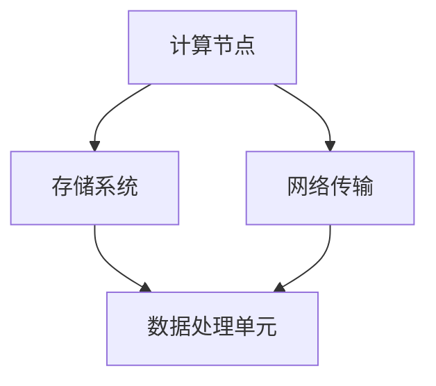

                 

在当今的科技领域，人工智能（AI）无疑是最具变革性的力量。贾扬清，作为一位人工智能领域的杰出科学家和企业家，他的创业机遇正是建立在AI计算和云服务的整合与创新之上。本文将深入探讨这一领域的发展趋势、核心算法、数学模型及其应用场景，以期为读者提供一幅完整的AI计算与云服务整合的蓝图。

## 关键词
- 人工智能
- 计算演进
- 云服务
- 创新技术
- 贾扬清
- AI计算架构

## 摘要
本文将详细介绍AI计算领域的演进过程，探讨贾扬清在这一领域的创业机遇。通过分析核心算法原理、数学模型及其应用，我们旨在揭示AI计算与云服务整合的创新路径，为相关从业者提供宝贵的指导和参考。

## 1. 背景介绍
### 1.1 AI计算的兴起
人工智能自诞生以来，经历了数十年的发展。随着计算能力的提升和数据量的爆发式增长，AI计算逐渐成为现代科技的重要组成部分。特别是在深度学习领域，计算力的提升使得复杂的神经网络模型得以训练和应用。

### 1.2 云服务的崛起
云服务为AI计算提供了强大的基础设施支持。云计算平台的弹性和可扩展性，使得研究人员和企业能够以较低的成本获得高性能的计算资源。这为AI计算的广泛应用奠定了基础。

### 1.3 贾扬清的背景
贾扬清，一位在人工智能领域享有盛誉的科学家，拥有丰富的学术和工业经验。他在AI计算架构、神经网络设计等方面有着深入的研究，并成功创办了多家AI企业，推动了AI计算与云服务的深度融合。

## 2. 核心概念与联系
### 2.1 AI计算架构
AI计算架构是指为人工智能应用提供计算支持的基础设施。它包括计算节点、存储系统、网络传输等多个层面。以下是AI计算架构的基本组成部分：



### 2.2 云服务与AI计算的整合
云服务与AI计算的整合主要体现在两个方面：一是计算资源的动态分配，二是数据处理的优化。通过云服务，AI计算可以高效地利用分布式计算资源，实现并行计算和大规模数据处理。

## 3. 核心算法原理 & 具体操作步骤
### 3.1 算法原理概述
AI计算的核心算法主要包括深度学习、强化学习和生成对抗网络等。其中，深度学习是目前应用最广泛的算法，它通过多层神经网络对数据进行建模和预测。

### 3.2 算法步骤详解
深度学习算法的基本步骤包括：数据预处理、模型设计、模型训练、模型评估和模型部署。以下是具体操作步骤：

1. **数据预处理**：对原始数据进行清洗、归一化和特征提取等操作。
2. **模型设计**：根据应用场景选择合适的神经网络架构，如卷积神经网络（CNN）或循环神经网络（RNN）。
3. **模型训练**：使用训练数据对模型进行训练，优化模型参数。
4. **模型评估**：使用验证数据评估模型性能，调整模型参数。
5. **模型部署**：将训练好的模型部署到云平台上，实现实时预测和应用。

### 3.3 算法优缺点
深度学习算法的优点在于其强大的建模能力和灵活性，能够处理复杂数据。但缺点是训练过程计算量大，需要大量计算资源和时间。

### 3.4 算法应用领域
深度学习算法在图像识别、自然语言处理、语音识别等领域取得了显著成果。随着计算能力的提升和算法的优化，其应用范围将进一步扩大。

## 4. 数学模型和公式 & 详细讲解 & 举例说明
### 4.1 数学模型构建
深度学习算法的核心是神经网络模型。神经网络由多层神经元组成，通过前向传播和反向传播更新权重和偏置。

### 4.2 公式推导过程
神经网络模型的训练过程可以通过以下公式表示：

$$
\begin{aligned}
\text{前向传播：} \\
\text{output} &= \sigma(\text{weight} \cdot \text{input} + \text{bias}) \\
\text{误差计算：} \\
\text{error} &= \text{output} - \text{target} \\
\text{反向传播：} \\
\text{weight} &= \text{weight} - \text{learning\_rate} \cdot \frac{\partial \text{error}}{\partial \text{weight}} \\
\text{bias} &= \text{bias} - \text{learning\_rate} \cdot \frac{\partial \text{error}}{\partial \text{bias}}
\end{aligned}
$$

### 4.3 案例分析与讲解
以图像识别为例，我们可以使用卷积神经网络（CNN）对图像进行分类。以下是具体实现步骤：

1. **数据预处理**：对图像进行缩放、裁剪和归一化处理。
2. **模型设计**：设计一个卷积神经网络，包括卷积层、池化层和全连接层。
3. **模型训练**：使用训练数据对模型进行训练，优化模型参数。
4. **模型评估**：使用验证数据评估模型性能，调整模型参数。
5. **模型部署**：将训练好的模型部署到云平台上，实现实时图像识别。

## 5. 项目实践：代码实例和详细解释说明
### 5.1 开发环境搭建
在开始项目实践之前，我们需要搭建一个适合深度学习的开发环境。以下是具体步骤：

1. **安装Python**：下载并安装Python 3.x版本。
2. **安装深度学习框架**：例如TensorFlow或PyTorch。
3. **安装依赖库**：如NumPy、Pandas等。

### 5.2 源代码详细实现
以下是一个简单的卷积神经网络实现代码示例：

```python
import tensorflow as tf

# 定义模型
model = tf.keras.Sequential([
    tf.keras.layers.Conv2D(32, (3, 3), activation='relu', input_shape=(28, 28, 1)),
    tf.keras.layers.MaxPooling2D((2, 2)),
    tf.keras.layers.Flatten(),
    tf.keras.layers.Dense(128, activation='relu'),
    tf.keras.layers.Dense(10, activation='softmax')
])

# 编译模型
model.compile(optimizer='adam',
              loss='sparse_categorical_crossentropy',
              metrics=['accuracy'])

# 训练模型
model.fit(train_images, train_labels, epochs=5)

# 评估模型
test_loss, test_acc = model.evaluate(test_images, test_labels)

# 预测
predictions = model.predict(test_images)
```

### 5.3 代码解读与分析
上述代码展示了如何使用TensorFlow构建和训练一个简单的卷积神经网络。代码主要分为以下几个部分：

1. **模型定义**：使用`tf.keras.Sequential`创建一个序列模型，依次添加卷积层、池化层和全连接层。
2. **模型编译**：设置优化器和损失函数，用于模型训练。
3. **模型训练**：使用`fit`方法对模型进行训练。
4. **模型评估**：使用`evaluate`方法评估模型性能。
5. **预测**：使用`predict`方法进行图像分类预测。

### 5.4 运行结果展示
在完成代码实现后，我们可以通过以下命令运行代码：

```bash
python cnn_example.py
```

运行结果将显示训练和评估过程中的指标，如损失函数值、准确率等。同时，我们还可以通过可视化工具查看模型的预测结果。

## 6. 实际应用场景
### 6.1 图像识别
图像识别是AI计算的重要应用领域之一。通过深度学习算法，我们可以对图像进行分类、检测和分割。例如，在医疗领域，AI计算可以帮助医生进行疾病诊断；在自动驾驶领域，AI计算可以实现车辆识别和路径规划。

### 6.2 自然语言处理
自然语言处理（NLP）是AI计算的重要应用领域之一。通过深度学习算法，我们可以对文本进行情感分析、机器翻译和语音识别等操作。例如，在客服领域，AI计算可以帮助企业实现智能客服系统；在教育和科研领域，AI计算可以帮助实现自然语言生成和文本分类。

### 6.3 语音识别
语音识别是AI计算的重要应用领域之一。通过深度学习算法，我们可以实现实时语音识别和语音合成。例如，在智能家居领域，AI计算可以帮助实现语音控制家电；在客服领域，AI计算可以帮助实现语音交互和智能客服。

## 7. 工具和资源推荐
### 7.1 学习资源推荐
1. **深度学习圣经**：《深度学习》（Goodfellow, Bengio, Courville 著）
2. **神经网络与深度学习**：吴恩达（Andrew Ng）的在线课程
3. **Python深度学习**：François Chollet 著

### 7.2 开发工具推荐
1. **TensorFlow**：Google开发的深度学习框架
2. **PyTorch**：Facebook开发的深度学习框架
3. **Keras**：Python的深度学习高级API

### 7.3 相关论文推荐
1. **AlexNet**：一种深度卷积神经网络架构
2. **ResNet**：一种具有深度残差块的卷积神经网络架构
3. **Transformer**：一种基于注意力机制的序列到序列模型

## 8. 总结：未来发展趋势与挑战
### 8.1 研究成果总结
近年来，AI计算和云服务的整合取得了显著成果。深度学习算法在各个领域的应用取得了突破性进展，推动了AI技术的普及和发展。云服务为AI计算提供了强大的基础设施支持，降低了计算门槛。

### 8.2 未来发展趋势
未来，AI计算和云服务的整合将继续深化。一方面，算法将更加高效和智能化，推动AI技术在更多领域的应用。另一方面，云服务将不断提升性能和可靠性，为AI计算提供更优质的资源支持。

### 8.3 面临的挑战
尽管AI计算和云服务的整合取得了显著成果，但仍面临一些挑战。例如，计算资源的分配和调度问题、数据安全和隐私问题、算法的可解释性和透明性问题等。这些问题需要进一步的研究和解决。

### 8.4 研究展望
未来，我们期待看到AI计算和云服务的进一步整合，实现更高效、更智能的计算体系。同时，我们也期待看到AI技术在各个领域的广泛应用，为社会发展和人类福祉作出更大贡献。

## 9. 附录：常见问题与解答
### 9.1 什么是AI计算？
AI计算是指利用计算机硬件和算法对数据进行处理和分析，以实现人工智能功能的过程。它包括深度学习、强化学习、生成对抗网络等多种算法。

### 9.2 云服务在AI计算中有什么作用？
云服务为AI计算提供了强大的基础设施支持，包括计算资源、存储资源、网络资源等。它可以帮助研究人员和企业以较低的成本获得高性能的计算资源，实现大规模数据处理和模型训练。

### 9.3 深度学习算法有哪些优缺点？
深度学习算法的优点在于其强大的建模能力和灵活性，能够处理复杂数据。但缺点是训练过程计算量大，需要大量计算资源和时间。

### 9.4 如何优化深度学习算法的性能？
优化深度学习算法的性能可以从多个方面入手，包括算法优化、硬件加速、数据预处理等。例如，使用更高效的算法框架、使用GPU或TPU等专用硬件进行训练。

### 9.5 AI计算在医疗领域有哪些应用？
AI计算在医疗领域有广泛的应用，包括疾病诊断、治疗建议、药物研发等。例如，通过深度学习算法，可以实现对医疗影像的自动识别和分析，帮助医生提高诊断准确性。

## 作者署名
本文作者：禅与计算机程序设计艺术 / Zen and the Art of Computer Programming
----------------------------------------------------------------

以上就是本文的全部内容。通过深入探讨AI计算的演进、云服务的整合与创新，以及贾扬清在这一领域的创业机遇，我们希望能为读者提供有价值的参考和启示。在未来的发展中，AI计算和云服务的整合将不断推动科技进步和社会发展，带来更多机遇和挑战。让我们共同期待这一激动人心的未来！

