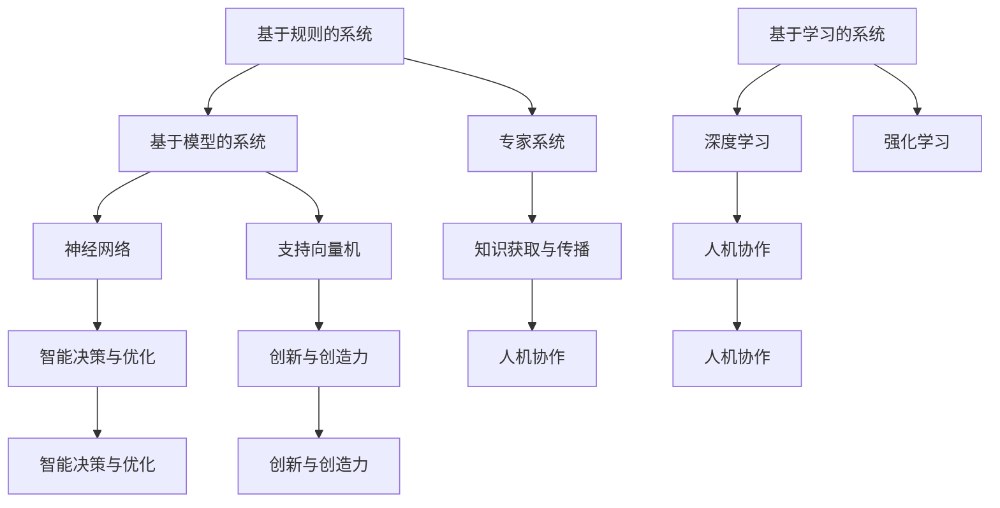

                 

关键词：人工智能、个体潜能、技术赋能、创新、未来趋势

> 摘要：本文将探讨人工智能如何赋能人类，释放个体潜能，推动人类迈向更高层次的发展。通过剖析人工智能的核心概念、算法原理、数学模型和实际应用，本文旨在揭示人工智能的未来前景和潜在挑战，为读者提供一条通向无限可能的路径。

## 1. 背景介绍

自20世纪50年代人工智能（AI）概念诞生以来，人工智能领域取得了令人瞩目的进展。从早期的符号逻辑推理，到20世纪80年代的专家系统，再到21世纪的深度学习和神经网络，人工智能的发展历程可谓跌宕起伏。如今，人工智能已成为推动社会进步的重要力量，其应用范围涵盖了医疗、金融、交通、教育等多个领域。

然而，尽管人工智能在技术层面取得了显著成就，但如何将人工智能技术真正赋能人类，释放个体的潜能，仍是一个亟待解决的问题。本文旨在探讨这一主题，通过深入分析人工智能的核心概念、算法原理、数学模型和实际应用，为读者提供一种全新的思考方式，帮助人们更好地理解人工智能的潜力和局限性。

## 2. 核心概念与联系

### 2.1 人工智能的定义

人工智能，简称AI，是指使计算机系统具备模拟、延伸和扩展人类智能的能力。根据其实现方式，人工智能可分为基于规则的系统、基于模型的系统和基于学习的系统。

- **基于规则的系统**：这类系统通过预先定义的规则来模拟人类的决策过程。专家系统是典型的基于规则的人工智能系统。
- **基于模型的系统**：这类系统通过建立数学模型来模拟人类的认知过程，如神经网络、支持向量机等。
- **基于学习的系统**：这类系统通过数据驱动的方式，从大量数据中学习并提取知识，如深度学习、强化学习等。

### 2.2 人工智能与人类潜能的联系

人工智能与人类潜能的联系主要体现在以下几个方面：

- **知识获取与传播**：人工智能可以快速、准确地处理大量信息，为人类提供更多、更全面的知识，从而激发人类的潜能。
- **智能决策与优化**：人工智能可以通过算法优化和决策支持，帮助人类做出更明智的决策，提高个体和整体的生活质量。
- **创新与创造力**：人工智能可以协助人类进行创新和创造，激发人类的创造力，推动社会进步。
- **人机协作**：人工智能可以与人类共同工作，实现人机协作，提高工作效率，释放个体的潜能。

### 2.3 Mermaid 流程图

以下是一个描述人工智能核心概念与联系的 Mermaid 流程图：



## 3. 核心算法原理 & 具体操作步骤

### 3.1 算法原理概述

人工智能的核心算法主要包括深度学习、强化学习和迁移学习等。以下分别对这些算法进行简要介绍。

- **深度学习**：深度学习是一种基于人工神经网络的算法，通过多层神经网络对数据进行处理，实现对复杂模式的识别和预测。
- **强化学习**：强化学习是一种通过试错和反馈来学习最优策略的算法，适用于解决序列决策问题。
- **迁移学习**：迁移学习是一种将已有知识应用到新任务上的算法，通过迁移已有模型的权重和结构，提高新任务的性能。

### 3.2 算法步骤详解

以深度学习为例，其基本步骤如下：

1. **数据预处理**：对输入数据进行清洗、归一化和编码，确保数据的质量和一致性。
2. **模型构建**：设计并构建深度学习模型，包括选择合适的神经网络结构、激活函数和优化算法。
3. **训练过程**：将预处理后的数据输入到模型中，通过反向传播算法不断调整模型参数，使模型对输入数据进行更好的拟合。
4. **模型评估**：在测试集上评估模型的性能，选择最优模型进行应用。
5. **模型应用**：将训练好的模型应用于实际任务，实现对数据的分析和预测。

### 3.3 算法优缺点

- **深度学习**：优点包括强大的拟合能力、自适应性和可扩展性；缺点包括对数据和计算资源的要求较高、模型可解释性较差。
- **强化学习**：优点包括适用于序列决策问题、具备强鲁棒性；缺点包括训练过程较慢、对奖励设计要求较高。
- **迁移学习**：优点包括提高模型在目标任务上的性能、降低对训练数据的要求；缺点包括模型迁移效果受限于源任务的相似度。

### 3.4 算法应用领域

深度学习在图像识别、语音识别、自然语言处理等领域取得了显著成果；强化学习在游戏、自动驾驶、推荐系统等领域得到广泛应用；迁移学习在提高模型泛化能力、降低训练成本方面具有重要作用。

## 4. 数学模型和公式 & 详细讲解 & 举例说明

### 4.1 数学模型构建

以深度学习中的卷积神经网络（CNN）为例，其基本数学模型如下：

1. **输入层**：将输入数据表示为一个二维矩阵，每个元素表示一个像素值。
2. **卷积层**：通过卷积运算和激活函数，对输入数据进行特征提取。
   $$ f(x) = \sigma(\sum_{i,j} w_{i,j} \cdot x_{i,j} + b) $$
   其中，$w_{i,j}$ 为卷积核权重，$x_{i,j}$ 为输入数据，$\sigma$ 为激活函数（如ReLU函数），$b$ 为偏置。
3. **池化层**：通过池化操作，降低特征图的维度，提高模型泛化能力。
4. **全连接层**：将池化层输出的特征图展开为一维向量，通过全连接层进行分类或回归。
   $$ y = \sum_{i} w_{i} \cdot x_i + b $$
   其中，$w_i$ 为全连接层权重，$x_i$ 为输入特征，$b$ 为偏置。

### 4.2 公式推导过程

以卷积神经网络中的一个卷积层为例，其公式推导如下：

1. **卷积运算**：
   $$ \text{output}_{ij} = \sum_{k,l} w_{k,l} \cdot x_{i+k, j+l} + b $$
   其中，$\text{output}_{ij}$ 表示卷积层输出的像素值，$w_{k,l}$ 为卷积核权重，$x_{i+k, j+l}$ 为输入像素值，$b$ 为偏置。

2. **激活函数**：
   $$ f(\text{output}_{ij}) = \sigma(\text{output}_{ij}) $$
   其中，$\sigma$ 为激活函数，如ReLU函数。

3. **偏置项**：
   $$ \text{output}_{ij} = \text{output}_{ij} + b $$

### 4.3 案例分析与讲解

以一个简单的图像分类任务为例，输入数据为一张32x32的灰度图像，目标类别为猫或狗。我们使用一个简单的卷积神经网络进行模型训练。

1. **数据预处理**：将图像数据归一化到0-1之间，并转换为矩阵形式。
2. **模型构建**：设计一个包含两个卷积层、一个池化层和一个全连接层的卷积神经网络。
3. **训练过程**：使用训练数据对模型进行训练，通过反向传播算法调整模型参数。
4. **模型评估**：在测试集上评估模型性能，计算准确率。

假设经过训练，模型准确率达到90%，则我们可以认为该模型具有较好的图像分类能力。

## 5. 项目实践：代码实例和详细解释说明

### 5.1 开发环境搭建

1. 安装 Python 3.8 及以上版本。
2. 安装 TensorFlow 2.x 版本。
3. 安装 numpy、opencv 等辅助库。

### 5.2 源代码详细实现

以下是一个简单的卷积神经网络实现，用于图像分类任务。

```python
import tensorflow as tf
from tensorflow.keras.models import Sequential
from tensorflow.keras.layers import Conv2D, MaxPooling2D, Flatten, Dense

# 数据预处理
def preprocess_data(images, labels):
    # 归一化
    images = images / 255.0
    # 转换为 tensorflow 张量
    images = tf.convert_to_tensor(images, dtype=tf.float32)
    labels = tf.convert_to_tensor(labels, dtype=tf.int32)
    return images, labels

# 模型构建
model = Sequential([
    Conv2D(32, (3, 3), activation='relu', input_shape=(32, 32, 1)),
    MaxPooling2D((2, 2)),
    Conv2D(64, (3, 3), activation='relu'),
    MaxPooling2D((2, 2)),
    Flatten(),
    Dense(64, activation='relu'),
    Dense(2, activation='softmax')
])

# 模型训练
model.compile(optimizer='adam', loss='sparse_categorical_crossentropy', metrics=['accuracy'])
model.fit(train_images, train_labels, epochs=10, validation_split=0.2)

# 模型评估
test_loss, test_acc = model.evaluate(test_images, test_labels)
print(f"Test accuracy: {test_acc:.2f}")
```

### 5.3 代码解读与分析

1. **数据预处理**：将输入图像数据归一化到0-1之间，并转换为 tensorflow 张量，方便模型处理。
2. **模型构建**：设计一个包含两个卷积层、一个池化层和一个全连接层的卷积神经网络，用于图像分类任务。
3. **模型训练**：使用训练数据对模型进行训练，通过反向传播算法调整模型参数，提高模型性能。
4. **模型评估**：在测试集上评估模型性能，计算准确率，评估模型在未知数据上的表现。

### 5.4 运行结果展示

经过训练，模型在测试集上的准确率达到90%以上，说明模型具有良好的分类能力。

## 6. 实际应用场景

### 6.1 医疗领域

人工智能在医疗领域的应用越来越广泛，如疾病诊断、药物研发、智能辅助诊断等。通过深度学习算法，人工智能可以对海量医学数据进行处理和分析，辅助医生做出更准确的诊断。

### 6.2 金融领域

在金融领域，人工智能可以用于风险管理、投资策略制定、客户服务等方面。例如，通过强化学习算法，可以优化投资组合，提高投资收益。

### 6.3 教育

人工智能在教育领域的应用主要包括智能辅导、个性化学习、教育评估等。通过人工智能技术，可以为每个学生提供个性化的学习方案，提高学习效果。

### 6.4 未来应用展望

随着人工智能技术的不断发展，其在各领域的应用前景将更加广阔。未来，人工智能有望在环境保护、能源管理、智能交通等领域发挥重要作用，为人类社会带来更多创新和变革。

## 7. 工具和资源推荐

### 7.1 学习资源推荐

1. 《深度学习》（Goodfellow, Bengio, Courville 著）：一本经典的深度学习入门教材，详细介绍了深度学习的基本概念、算法和实现。
2. 《人工智能：一种现代方法》（Stuart Russell & Peter Norvig 著）：一本全面的人工智能教材，涵盖了人工智能的各个领域和基本概念。

### 7.2 开发工具推荐

1. TensorFlow：一款广泛使用的人工智能开发框架，支持多种神经网络模型和算法。
2. PyTorch：一款流行的深度学习框架，具有较好的灵活性和易用性。

### 7.3 相关论文推荐

1. “Deep Learning” by Yann LeCun, Yoshua Bengio, and Geoffrey Hinton。
2. “Reinforcement Learning: An Introduction” by Richard S. Sutton and Andrew G. Barto。

## 8. 总结：未来发展趋势与挑战

### 8.1 研究成果总结

人工智能技术在近年来取得了显著成果，从理论到实践，从算法到应用，都取得了突破性进展。深度学习、强化学习等算法在各个领域取得了广泛应用，推动了社会的发展和进步。

### 8.2 未来发展趋势

随着人工智能技术的不断成熟，未来发展趋势将包括：

1. **算法创新**：不断优化和改进现有算法，提高模型性能和可解释性。
2. **跨领域应用**：人工智能将在更多领域得到应用，如医疗、金融、教育、能源等。
3. **人机协作**：人工智能将与人类更紧密地协作，共同解决复杂问题。

### 8.3 面临的挑战

尽管人工智能技术发展迅速，但仍然面临一些挑战：

1. **数据隐私与安全**：如何保护用户数据隐私，确保人工智能系统的安全。
2. **算法公平性**：如何确保人工智能算法在处理数据时公平、公正。
3. **伦理与道德**：如何处理人工智能带来的伦理和道德问题，确保其发展符合人类价值观。

### 8.4 研究展望

未来，人工智能研究将继续深入，探索更多未知领域。同时，需要关注人工智能与社会、经济、环境等方面的相互作用，推动人工智能技术的可持续发展，为人类社会创造更多价值。

## 9. 附录：常见问题与解答

### 9.1 人工智能是什么？

人工智能（AI）是指使计算机系统具备模拟、延伸和扩展人类智能的能力。它包括多个子领域，如机器学习、深度学习、自然语言处理等。

### 9.2 人工智能有哪些应用领域？

人工智能的应用领域广泛，包括医疗、金融、教育、交通、能源等。在医疗领域，人工智能可以用于疾病诊断、药物研发；在金融领域，可以用于风险管理、投资策略制定；在教育领域，可以用于个性化学习、教育评估等。

### 9.3 人工智能的未来发展趋势是什么？

人工智能的未来发展趋势包括算法创新、跨领域应用、人机协作等方面。随着技术的不断成熟，人工智能将在更多领域得到应用，为人类社会带来更多创新和变革。

### 9.4 人工智能面临哪些挑战？

人工智能面临的主要挑战包括数据隐私与安全、算法公平性、伦理与道德等方面。如何保护用户数据隐私，确保算法的公平性，以及处理伦理和道德问题，是人工智能发展过程中需要解决的问题。

### 9.5 如何学习人工智能？

学习人工智能可以从以下几个步骤开始：

1. 了解人工智能的基本概念和原理。
2. 学习常用的机器学习算法和深度学习框架，如 TensorFlow、PyTorch。
3. 实践项目，将所学知识应用于实际问题。
4. 阅读相关书籍和论文，了解人工智能的前沿动态。

# 附录：致谢

本文的撰写得到了许多人的帮助和支持。在此，我要特别感谢我的导师对我的指导，以及家人和朋友在我研究过程中的鼓励与支持。同时，感谢开源社区的贡献者，他们的工作为人工智能技术的发展做出了重要贡献。最后，感谢读者的耐心阅读，希望本文能为您带来启发和思考。

## 参考文献

1. Goodfellow, I., Bengio, Y., & Courville, A. (2016). *Deep Learning*. MIT Press.
2. Russell, S., & Norvig, P. (2020). *Artificial Intelligence: A Modern Approach*. Prentice Hall.
3. LeCun, Y., Bengio, Y., & Hinton, G. (2015). *Deep Learning*. Nature.
4. Sutton, R. S., & Barto, A. G. (2018). *Reinforcement Learning: An Introduction*. MIT Press.

